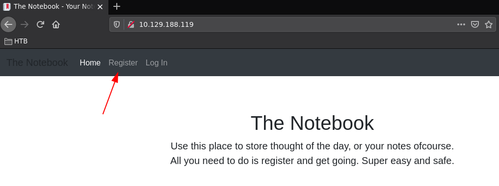
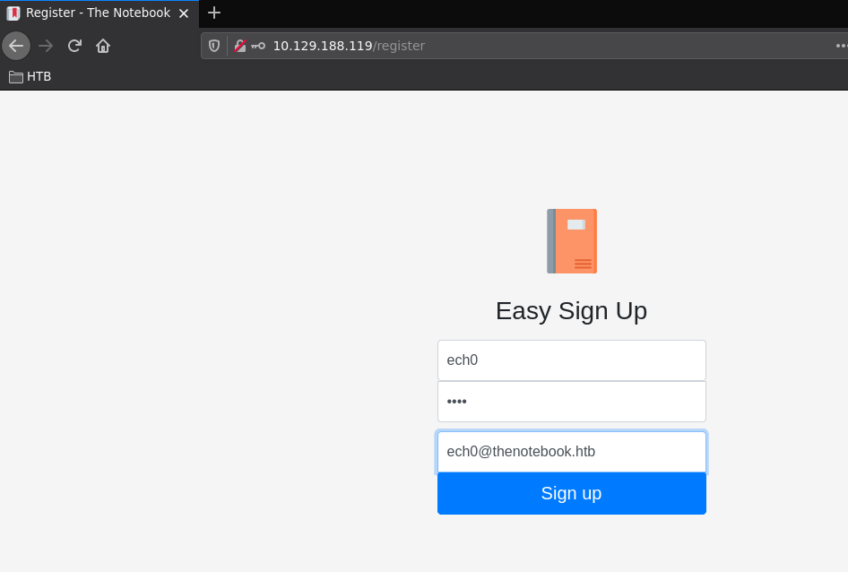
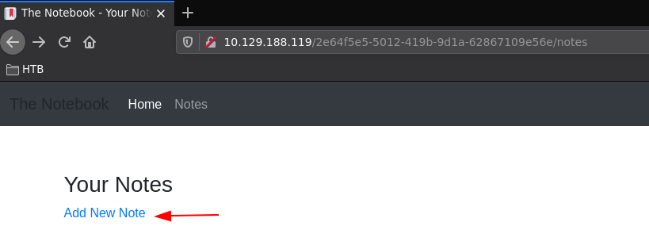
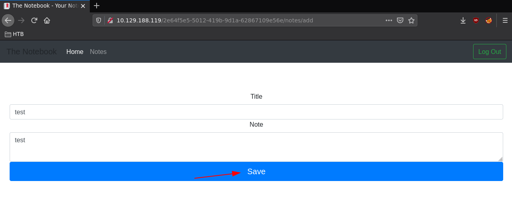
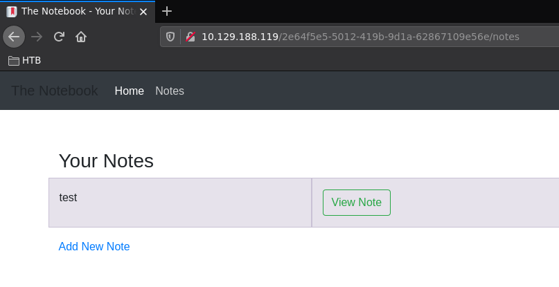
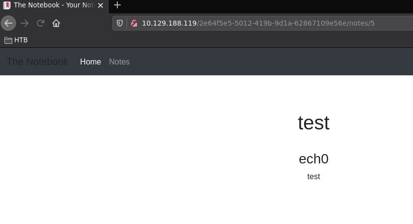

---
search:
  exclude: true
---
# TheNotebook Writeup

## Introduction :

TheNotebook is a medium Linux box released back in March 2021.

## **Part 1 : Initial Enumeration**

As always we begin our Enumeration using **Nmap** to enumerate opened ports. We will be using the flags **-sC** for default scripts and **-sV** to enumerate versions.
    
    
    [ 10.10.14.34/23 ] [ /dev/pts/12 ] [~/HTB/TheNotebook]
    → nmap -vvv -p- 10.129.188.119 --max-retries 0 -Pn --min-rate=500 2>/dev/null | grep Discovered
    Discovered open port 80/tcp on 10.129.188.119
    Discovered open port 22/tcp on 10.129.188.119
    
    [ 10.10.14.34/23 ] [ /dev/pts/12 ] [~/HTB/TheNotebook]
    → nmap -sCV -p 80,22 10.129.188.119
    Starting Nmap 7.91 ( https://nmap.org ) at 2021-08-14 10:05 CEST
    Nmap scan report for 10.129.188.119
    Host is up (0.027s latency).
    
    PORT   STATE SERVICE VERSION
    22/tcp open  ssh     OpenSSH 7.6p1 Ubuntu 4ubuntu0.3 (Ubuntu Linux; protocol 2.0)
    | ssh-hostkey:
    |   2048 86:df:10:fd:27:a3:fb:d8:36:a7:ed:90:95:33:f5:bf (RSA)
    |   256 e7:81:d6:6c:df:ce:b7:30:03:91:5c:b5:13:42:06:44 (ECDSA)
    |_  256 c6:06:34:c7:fc:00:c4:62:06:c2:36:0e:ee:5e:bf:6b (ED25519)
    80/tcp open  http    nginx 1.14.0 (Ubuntu)
    |_http-server-header: nginx/1.14.0 (Ubuntu)
    |_http-title: The Notebook - Your Note Keeper
    Service Info: OS: Linux; CPE: cpe:/o:linux:linux_kernel
    
    Service detection performed. Please report any incorrect results at https://nmap.org/submit/ .
    Nmap done: 1 IP address (1 host up) scanned in 7.85 seconds
    
    

## **Part 2 : Getting User Access**

Our nmap scan picked up port 80 so let's investigate it:

We can register an account and login:

Once that's done we can create a test note:

    

So here we're able to create notes and view them, but that's not really useful for us. The trick was to take a look into the cookie storage tab in F12, where we would see our auth token:

We can inspect it using [jwt.io](https://jwt.io/)

Here we see that there is a Key ID field, pointing to the box's local address on port 7070:
    
    
    [ 10.10.14.34/23 ] [ /dev/pts/12 ] [~/HTB/TheNotebook]
    → nmap -sCV -p 7070 10.129.188.119
    Starting Nmap 7.91 ( https://nmap.org ) at 2021-08-14 10:20 CEST
    Nmap scan report for 10.129.188.119
    Host is up (0.026s latency).
    
    PORT     STATE  SERVICE    VERSION
    7070/tcp closed realserver
    
    

It's not available to us, which probably means that it only accepts packets coming from localhost, so we might need to port forward it once we get access to the box later on.
    
    
    
    
    
    
    
    
    
    
    
    
    
    
    
    
    
    
    
    
    
    
    
    
    
    
    
    
    
    
    
    
    
    
    
    
    
    
    
    
    
    
    
    
    
    
    
    
    
    
    
    
    
    
    
    
    
    
    
    

## **Part 3 : Getting Root Access**

the text goes here
    
    
    
    
    
    
    
    
    
    
    
    
    
    
    
    
    
    
    
    
    
    
    
    
    
    
    
    
    
    
    
    
    
    
    
    
    
    
    
    
    
    
    
    
    
    
    
    
    
    
    
    
    
    
    
    
    
    
    
    

## **Conclusion**

Here we can see the progress graph :

