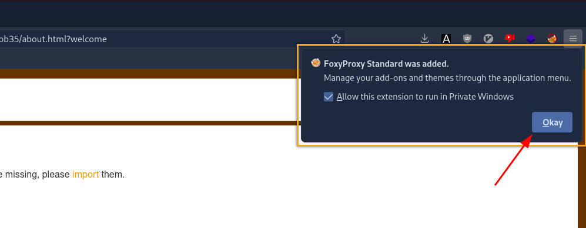
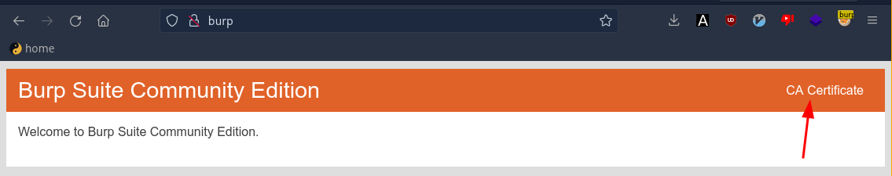
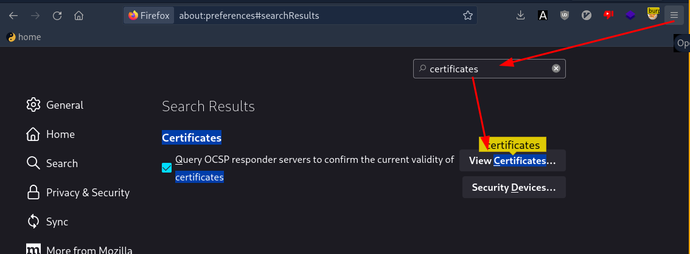
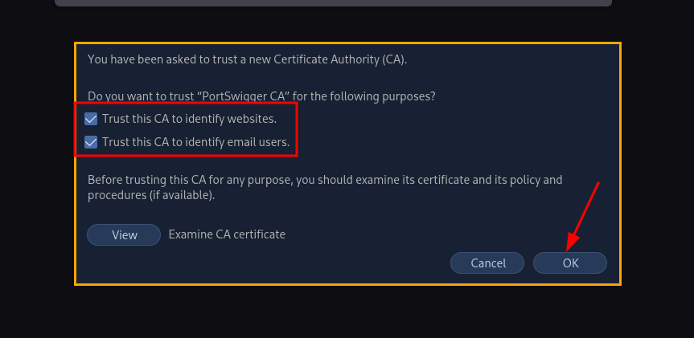

---
search:
  exclude: true
---
# Burpsuite Setup

## Introduction :

Burpsuite is a Java Application developped by PortSwigger which is used as a pentest framework for web applications. In this tutorial we're going to look at how it can be commonly used.

## **Installation**

First let's install [FoxyProxy](https://addons.mozilla.org/en-US/firefox/addon/foxyproxy-standard/?utm_source=addons.mozilla.org&utm_medium=referral&utm_content=search)

  

Then we install burpsuite:
    
    
    apt install burpsuite
    
    

## **Intercepting HTTP requests**

Now let's configure FoxyProxy to intercept the request we make to the server:

 

Now let's test it:

So here we intercepted the request we made for the server, we didn't forward it yet.
    
    
    GET /login.php HTTP/1.1
    Host: previse.htb
    User-Agent: Mozilla/5.0 (X11; Linux x86_64; rv:99.0) Gecko/20100101 Firefox/99.0
    Accept: text/html,application/xhtml+xml,application/xml;q=0.9,image/avif,image/webp,*/*;q=0.8
    Accept-Language: en-US,en;q=0.5
    Accept-Encoding: gzip, deflate
    Connection: close
    Cookie: PHPSESSID=s4pu8loq7vmi15a095ipjl1095
    Upgrade-Insecure-Requests: 1
    
    

Usually what we want to do is test what we can send to the web server, repeatedly. To do that we use the repeater tab (**CTRL+R** to send the request to the repeater tab and **CTRL+SHIFT+R** to go to the repeater tab):

So from here we can change the request and keep sending it to check how the web server behaves differently:

## **Intercepting HTTPS requests**

Now that we managed to intercept our HTTP request let's do the same with HTTPS, it requires a little more setup:

While the intercept is on, let's go to **http://burp** in order to download burpsuite's certificate:

    
    
    [ 10.10.14.68/23 ] [ /dev/pts/20 ] [~/Downloads]
    → file cacert.der
    cacert.der: Certificate, Version=3
    
    

And now with this we want our firefox browser to consider this certificate as secure, via a security exception:

  

Now with this change we can intercept HTTPS traffic:

Now do the 2 keybinds to send the request to the repeater tab:

And there you have it ! We have been able to intercept both HTTP and HTTPS traffic via burpsuite to debug how websites respond to our requests!

