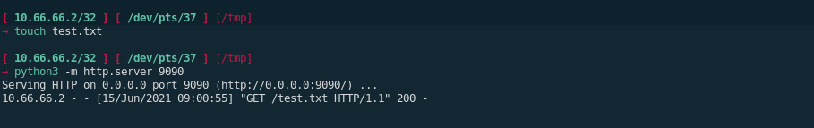

---
search:
  exclude: true
---
# File Transfers

## Introduction :

During system administration tasks and even more so during pentests, one will come across the need to transfer files from one host to another. And it is actually simpler than you think! There is no need to go through an external server for that.

## **Linux -> Linux**

On 99% of linux distributions, there is python installed by default, python has a HTTP module by default, and it can be used to 'serve' files from one host to another: 
    
    
    [ 10.66.66.2/32 ] [ /dev/pts/23 ] [blog/HTB/Tools]
    → ssh home
    Linux home 4.19.0-16-amd64 #1 SMP Debian 4.19.181-1 (2021-03-19) x86_64
    
    The programs included with the Debian GNU/Linux system are free software;
    the exact distribution terms for each program are described in the
    individual files in /usr/share/doc/*/copyright.
    
    Debian GNU/Linux comes with ABSOLUTELY NO WARRANTY, to the extent
    permitted by applicable law.
    Last login: Tue Jun 15 03:00:12 2021 from 127.0.0.1
    root@home:~# ip a | grep inet | grep 10.0.0
        inet 10.0.0.101/16 brd 10.0.255.255 scope global ens18
    
    
    
    [ 10.66.66.2/32 ] [ /dev/pts/37 ] [/tmp]
    → ip a | grep inet | grep 10.0.0
        inet 10.0.0.10/16 brd 10.0.255.255 scope global dynamic noprefixroute eth0
    
    

Let's say i want to transfer files from my 'home' machine at **10.0.0.101** to and from my 'mainpc' machine at **10.0.0.10**

First thing to check is if the hosts can ping each other:
    
    
    [ 10.66.66.2/32 ] [ /dev/pts/37 ] [/tmp]
    → ping 10.0.0.101 -c2
    PING 10.0.0.101 (10.0.0.101) 56(84) bytes of data.
    64 bytes from 10.0.0.101: icmp_seq=1 ttl=64 time=0.571 ms
    64 bytes from 10.0.0.101: icmp_seq=2 ttl=64 time=0.594 ms
    
    root@home:~# ping -c2 10.0.0.10
    PING 10.0.0.10 (10.0.0.10) 56(84) bytes of data.
    64 bytes from 10.0.0.10: icmp_seq=1 ttl=64 time=0.805 ms
    64 bytes from 10.0.0.10: icmp_seq=2 ttl=64 time=0.693 ms
    
    

And they can, now in order to SERVE files you can use python's SimpleHTTPServer module:
    
    
    [ 10.66.66.2/32 ] [ /dev/pts/37 ] [/tmp]
    → python -m SimpleHTTPServer 8080
    Serving HTTP on 0.0.0.0 port 8080 ...
    
    

Or you can use python3's http module:
    
    
    [ 10.66.66.2/32 ] [ /dev/pts/37 ] [/tmp]
    → python3 -m http.server 8080
    Serving HTTP on 0.0.0.0 port 8080 (http://0.0.0.0:8080/) ...
    
    

Now that the local http server is active on port 8080, you can see what it looks like from a web-browser:

so now you need to check if you have access to either **wget** , or **curl** or **nc**
    
    
    root@home:~# which wget curl nc
    /usr/bin/wget
    /usr/bin/curl
    /usr/bin/nc
    
    

These are all 3 binaries you can use to GET the files to that machine. Let's download our test.txt file to my home machine: 
    
    
    root@home:/tmp# wget http://10.0.0.10:8080/test.txt -O test.txt
    --2021-06-15 09:13:21--  http://10.0.0.10:8080/test.txt
    Connecting to 10.0.0.10:8080... connected.
    HTTP request sent, awaiting response... 200 OK
    Length: 0 [text/plain]
    Saving to: ‘test.txt’
    
    test.txt                               [ <=>                                                           ]       0  --.-KB/s    in 0s
    
    2021-06-15 09:13:21 (0.00 B/s) - ‘test.txt’ saved [0/0]
    
    root@home:/tmp# curl http://10.0.0.10:8080/test.txt > test.txt
      % Total    % Received % Xferd  Average Speed   Time    Time     Time  Current
                                     Dload  Upload   Total   Spent    Left  Speed
      0     0    0     0    0     0      0      0 --:--:-- --:--:-- --:--:--     0
    
    

Now in order to transfer files using netcat (nc) you need to do the following:
    
    
    root@home:/tmp# nc -lvnp 9001  > test.txt
    listening on [any] 9001 ...
    
    

First you setup netcat to listen on port 9001, and then you SEND the test file from the other host:
    
    
    [ 10.66.66.2/32 ] [ /dev/pts/38 ] [/tmp]
    → cat test.txt | nc 10.0.0.101 9001
    
    
    root@home:/tmp# nc -lvnp 9001  > test.txt
    listening on [any] 9001 ...
    connect to [10.0.0.101] from (UNKNOWN) [10.0.0.10] 41694
    
    ^C (or CTRL+C)
    

As you can see there has been a connection made there, and once it's done transferring hit CTRL+C to close netcat. We can also check the md5sum hashes of both files on both hosts to check if they are the same.
    
    
    root@home:/tmp# md5sum test.txt
    ef7cbb58d1d239b28fc6ae18e9ccf8ea  test.txt
    
    [ 10.66.66.2/32 ] [ /dev/pts/38 ] [/tmp]
    → md5sum test.txt
    ef7cbb58d1d239b28fc6ae18e9ccf8ea  test.txt
    
    

And as you can see here, both files are identical because they have the same hashes.

## **Linux -> Windows**

Now in order to transfer files from a linux host to a windows host, First just like before we use python to serve our files:
    
    
    [ 10.66.66.2/32 ] [ /dev/pts/37 ] [/tmp]
    → python3 -m http.server 8080
    Serving HTTP on 0.0.0.0 port 8080 (http://0.0.0.0:8080/) ...
    
    

Next you need to open powershell (either via SSH or via the windows desktop (WIN+X i)), and use the following:
    
    
    Windows PowerShell
    Copyright (C) Microsoft Corporation. All rights reserved.
    
    Try the new cross-platform PowerShell https://aka.ms/pscore6
    
    PS C:\Users\nothing> cd C:\Temp
    PS C:\Temp>
    

Now what we will use here to GET the file is the following one liner command:
    
    
    Invoke-WebRequest -Uri http://10.0.0.10:8080/test.txt -O test2.txt
    iwr -Uri http://10.0.0.10:8080/test.txt -O test2.txt
    
    

` 

This will basically download the file. Now if you want to run commands from the command line you can do the following:
    
    
    [ 10.66.66.2/32 ] [ /dev/pts/1 ] [/tmp]
    → echo 'ls' > test.ps1
    
    [ 10.66.66.2/32 ] [ /dev/pts/1 ] [/tmp]
    → python3 -m http.server 9090
    Serving HTTP on 0.0.0.0 port 9090 (http://0.0.0.0:9090/) ...
    
    iex(new-object net.webclient).downloadstring('http://10.0.0.10:9090/test.ps1')
    

` 

And there you go! We managed to run the code inside of the test.ps1 file right after downloading it.

