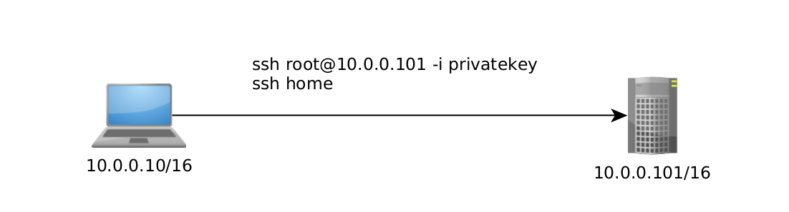
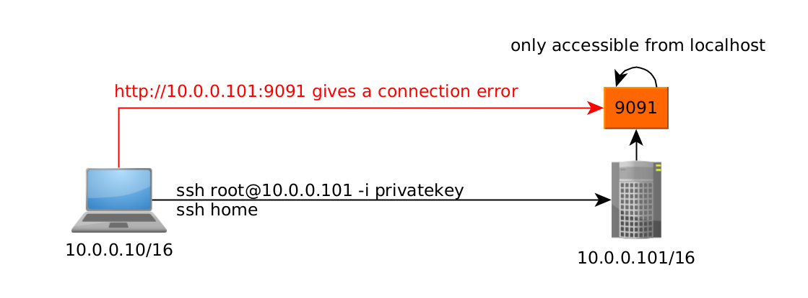
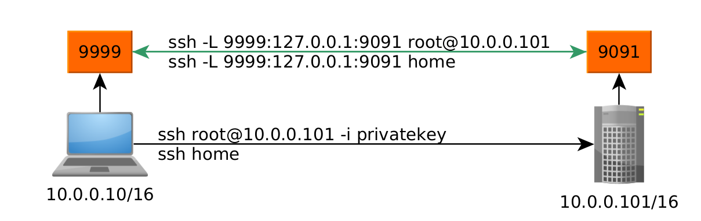
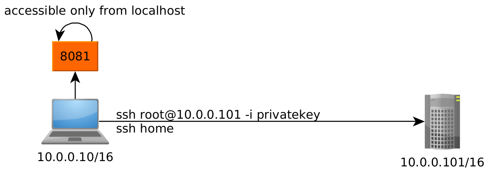
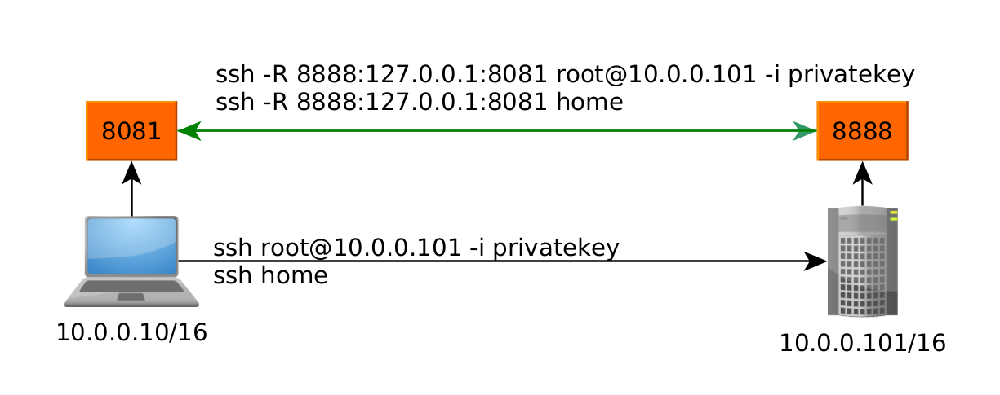

---
search:
  exclude: true
---
# SSH Tunnels

## Introduction :

SSH tunnels are commonly used in sysadmin and pentesting tasks in order to access remotel-only or local-only accessible ports. In this tutorial we're going to demonstrate how it works:

## **Requirements**

The prerequisite is obvious, get a SSH connection, i will use my ssh connection to my home host:
    
    
    [ 10.66.66.2/32 ] [ /dev/pts/19 ] [blog/HTB/Tools]
    → cat ~/.ssh/config
    Host home
            Hostname 10.0.0.101
            IdentityFile ~/.ssh/mainpc
            User root
    
    [ 10.66.66.2/32 ] [ /dev/pts/18 ] [blog/HTB/Tools]
    → ssh home
    Linux home 4.19.0-16-amd64 #1 SMP Debian 4.19.181-1 (2021-03-19) x86_64
    
    The programs included with the Debian GNU/Linux system are free software;
    the exact distribution terms for each program are described in the
    individual files in /usr/share/doc/*/copyright.
    
    Debian GNU/Linux comes with ABSOLUTELY NO WARRANTY, to the extent
    permitted by applicable law.
    Last login: Tue Jun 15 09:03:34 2021 from 10.0.0.10
    root@home:~#
    
    

That's a SSH connection using the private key in my **~/.ssh/** directory. Of course this also works with regular SSH connections, you just have to specify the username and the remote host **ssh user@ip**
    
    
    [ 10.66.66.2/32 ] [ /dev/pts/18 ] [blog/HTB/Tools]
    → ssh root@10.0.0.101
    root@10.0.0.101's password:
    Linux home 4.19.0-16-amd64 #1 SMP Debian 4.19.181-1 (2021-03-19) x86_64
    
    The programs included with the Debian GNU/Linux system are free software;
    the exact distribution terms for each program are described in the
    individual files in /usr/share/doc/*/copyright.
    
    Debian GNU/Linux comes with ABSOLUTELY NO WARRANTY, to the extent
    permitted by applicable law.
    Last login: Tue Jun 15 10:57:36 2021 from 10.0.0.10
    root@home:~#
    

Currently i am using the following network :

## **Using SSH Tunnels**

One of the many use cases you want to use SSH tunnels for, is to access ports that are only remotely accessible. For example, there is a port that will only accept connections from localhost (127.0.0.1), In theory this is not possible to access this port from across the network, it should only be possible on the server ITSELF.

Now the use case of SSH tunnels here is that we want to be able to access that **9091** port on the **10.0.0.101** host locally. But we currently can't because it restrics connections from it's localhost.
    
    
    [terminal 1]
    root@home:/tmp/test# python3 -m http.server 9091 --bind 127.0.0.1
    Serving HTTP on 127.0.0.1 port 9091 (http://127.0.0.1:9091/) ...
    
    [terminal 2]
    [ 10.66.66.2/32 ] [ /dev/pts/18 ] [blog/HTB/Tools]
    → curl 10.0.0.101:9091
    curl: (7) Failed to connect to 10.0.0.101 port 9091: Connection refused
    
    [ 10.66.66.2/32 ] [ /dev/pts/18 ] [blog/HTB/Tools]
    → ssh home
    
    root@home:~# curl 127.0.0.1:9091
    
    
    
    # Directory listing for /
    
    
    
    

Now here you see that we can only access the webserver from the hosts' localhost. So let's spawn a SSH Tunnel to port forward the remote 9091 port to our **local** port with the **-L** flag with the following syntax:

ssh **-L [local_bind:]localport:remote_bind:remoteport** user@ip 

If we don't specify the local bind, ssh assumes that this is 127.0.0.1, so let's say we want to port forward the remote port **9091** to our local port **9999** we use the following command:
    
    
    [ 10.66.66.2/32 ] [ /dev/pts/18 ] [blog/HTB/Tools]
    → **ssh -L 9999:127.0.0.1:9091 home**
    Linux home 4.19.0-16-amd64 #1 SMP Debian 4.19.181-1 (2021-03-19) x86_64
    
    The programs included with the Debian GNU/Linux system are free software;
    the exact distribution terms for each program are described in the
    individual files in /usr/share/doc/*/copyright.
    
    Debian GNU/Linux comes with ABSOLUTELY NO WARRANTY, to the extent
    permitted by applicable law.
    Last login: Tue Jun 15 12:22:58 2021 from 10.0.0.10
    root@home:~#
    
    

` 

Now with this the SSH Tunnel is active, and you can verify that we port forwarded the remote port 9091 to our local port 9999 :
    
    
    [ 10.66.66.2/32 ] [ /dev/pts/19 ] [blog/HTB/Tools]
    → curl 127.0.0.1:9999
    
    
    
    # Directory listing for /
    
    
    

Now we can also do the opposite, where we expose one of our local ports to the **remote** server using the **-R** flag which stands for Reverse:
    
    
    [ 10.66.66.2/32 ] [ /dev/pts/0 ] [/tmp/test]
    → python3 -m http.server 8081 --bind 127.0.0.1
    Serving HTTP on 127.0.0.1 port 8081 (http://127.0.0.1:8081/) ...
    
    

` 

We can check it is there with curl:
    
    
    [ 10.66.66.2/32 ] [ /dev/pts/19 ] [blog/HTB/Tools]
    → curl 127.0.0.1:8081
    
    
    
    # Directory listing for /
    
    
    
    [ 10.66.66.2/32 ] [ /dev/pts/19 ] [blog/HTB/Tools]
    → ssh home
    
    root@home:~# curl 10.0.0.10:8081
    curl: (7) Failed to connect to 10.0.0.10 port 8081: Connection refused
    
    

So we create a SSH tunnel using the following syntax:

ssh **-R [remote_bind:]remoteport:localbind:localport** user@ip

Same as before, the remote bind isn't needed, by default it will use localhost.

Here we want the remote host to have our local **8081** port to be forwarded to the remote **8888** port:
    
    
    [ 10.66.66.2/32 ] [ /dev/pts/18 ] [/tmp/test]
    → ssh -R 8888:127.0.0.1:8081 home
    
    root@home:~# curl 127.0.0.1:8888
    
    
    # Directory listing for /
    
    
    

And that's it! We verified that our port forwarding was successful.

