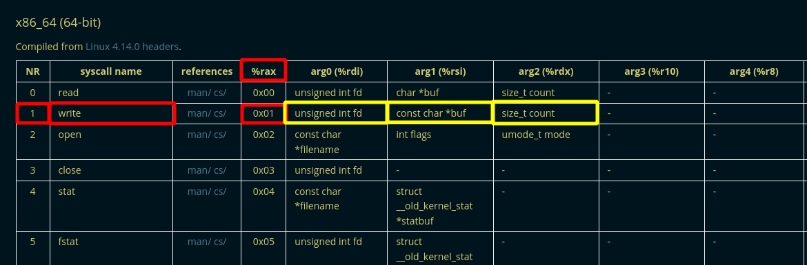
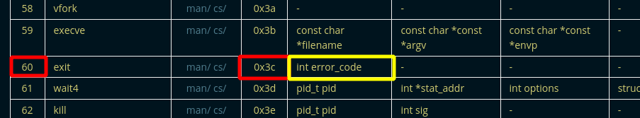

---
search:
  exclude: true
---
# Assembly x86_64 - Hello World Explained

## Assembly Code 

in the previous tutorial we made the following code:
    
    
    section .data
            text db "Hello, World!",10
    
    section .text
            global _start
    
    _start:
            mov rax, 1
            mov rdi, 1
            mov rsi, text
            mov rdx, 14
            syscall
    
            mov rax, 60
            mov rdi, 0
            syscall
    
    

now let's explain what this code is about piece by piece:
    
    
    section .data
            text db "Hello, World!",10
    

here 'db' stands for 'define bytes', this means we define raw data to insert into our code

after 'db' this is the bytes of data we are defining, each character in the string of text is a single byte. the '10' is a newline character, which can be represented as '\n'

the 'text' part is a name assigned to the address in memory that this data is located in. Whenever we use "text" later in the code, this will act as the memory address of the data 'db' that we defined, This is like putting a label on the memory address that contains the bytes define.

Registers are a part of the processor that temporarily holds memory, in the x86_64 architecture, registers hold 64 bits.

This means that each register can hold the values on its own, the main registers we will make use of are the following:

  1. rax
  2. rbx
  3. rcx
  4. rdx
  5. rsi
  6. rdi
  7. rbp
  8. r10
  9. r9
  10. r8

Now we also make use of a systemcall (abbreviated to syscall) which is used when a program requests a service from the kernel. Different Operating Systems mean different Kernels which means different Syscalls, they are not the same depending on the OS. All syscalls have an ID associated with them which is a number. Syscalls also take arguements which are inputs.

Now if you want to use syscalls, you first need the ID of the syscall and then you must know what arguements to give it, But you also need to know which registers correspond to the ID and to the arguements, so remember this table right here: 

**

  1. rax = syscall ID
  2. rdi = arg 1
  3. rsi = arg 2
  4. rdx = arg 3
  5. r10 = arg 4
  6. r8 = arg 5
  7. r9 = arg 6

**

Now where do we find informations about these syscalls ?We can use the list of them right [here ](https://chromium.googlesource.com/chromiumos/docs/+/HEAD/constants/syscalls.md) this is a very well made list made by Chromium OS Docs.

in the code we used we basically used the 'write' syscall whose id is 1. 

Therefore we set the rax register to 1 because that's our syscall id:

in the first arguement is a variable referenced in the docs as 'fd' which stands for file descriptor, we set that one to 1:

in the second arguement is our text variable we defined earlier, and the last arguement is a limit for the size of our text output (in characters) being set to 14. so we get the following code: 
    
    
    
    section .text
            global _start
    
    _start:
            mov rax, 1
            mov rdi, 1
            mov rsi, text
            mov rdx, 14
            syscall
    

Now the thing is we have yet another syscall after our hello world write syscall: 
    
    
    
            mov rax, 60
            mov rdi, 0
            syscall
    

And here we have an 'exit' syscall to end our executable.

and thus we get resulting final code:
    
    
    section .data
            text db "Hello, World!",10
    
    section .text
            global _start
    
    _start:
            mov rax, 1
            mov rdi, 1
            mov rsi, text
            mov rdx, 14
            syscall
    
            mov rax, 60
            mov rdi, 0
            syscall
    
    

Most x86_64 assembly code have 3 sections, the .data section , the .bss section and the .text section. the label we used here _start acts like a function, everytime we will use the word _start in our code, it is going to execute the portion of code that's associated with it.

In the next subject we're going to dig into jumps, calls and comparaisons, you can click [here](3.md).

