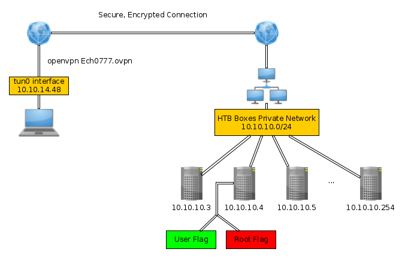
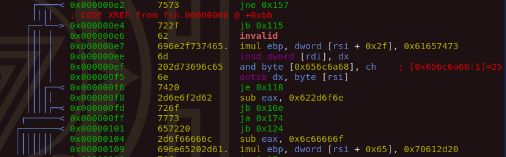

---
search:
  exclude: true
---
# Offensive Security Writeups (NO LONGER MAINTAINED) 

## [Hack The Box](https://app.hackthebox.eu/home/machines) is an online platform allowing you to test your penetration testing skills and exchange ideas and methodologies with thousands of people in the security field.

 Below you will find my personal writeups of the various boxes that can be found on hackthebox.eu, ranked by difficulty.

##  Hack The Box - Easy Boxes 

[ Template Page ](Easy/0.md)

  1. [ ✅ - Lame ](Easy/1.md)
  2. [ ✅ - Legacy ](Easy/2.md)
  3. [ ✅ - Devel ](Easy/3.md)
  4. [ ✅ - Beep ](Easy/4.md)
  5. [ ✅ - Optimum ](Easy/5.md)
  6. [ ✅ - Arctic ](Easy/6.md)
  7. [ ✅ - Grandpa ](Easy/7.md)
  8. [ ✅ - Granny ](Easy/8.md)
  9. [ ✅ - Bank ](Easy/9.md)
  10. [ ✅ - Blocky ](Easy/10.md)
  11. [ ✅ - Blue ](Easy/11.md)
  12. [ ✅ - Mirai ](Easy/12.md)
  13. [ ✅ - Shocker ](Easy/13.md)
  14. [ ✅ - Sense ](Easy/14.md)
  15. [ ✅ - Bashed ](Easy/15.md)
  16. [ ✅ - Nibbles ](Easy/16.md)
  17. [ ✅ - Valentine ](Easy/17.md)
  18. [ ✅ - Sunday](Easy/18.md)
  19. [ ✅ - Bounty](Easy/19.md)
  20. [ ✅ - Jerry ](Easy/20.md)
  21. [ ✅ - Active ](Easy/21.md)
  22. [ ✅ - Access ](Easy/22.md)
  23. [ ✅ - Frolic ](Easy/23.md)
  24. [ ✅ - Curling ](Easy/24.md)
  25. [ ✅ - Irked ](Easy/25.md)
  26. [ ✅ - Teacher ](Easy/26.md)
  27. [ ✅ - Help ](Easy/27.md)
  28. [ ✅ - FriendZone ](Easy/28.md)
  29. [ ✅ - Netmon ](Easy/29.md)
  30. [ ✅ - CasaDePapel ](Easy/30.md)
  31. [ ✅ - Bastion ](Easy/31.md)
  32. [ ✅ - SwagShop ](Easy/32.md)
  33. [ ✅ - Writeup ](Easy/33.md)
  34. [ ✅ - Haystack ](Easy/34.md)
  35. [ ✅ - Safe ](Easy/35.md)
  36. [ ✅ - Heist ](Easy/36.md)
  37. [ ✅ - Networked ](Easy/37.md)
  38. [ ✅ - Forest](Easy/38.md)
  39. [ ✅ - Postman](Easy/39.md)
  40. [ ✅ - Traverxec](Easy/40.md)
  41. [ ✅ - OpenAdmin](Easy/41.md)
  42. [ ✅ - Nest](Easy/42.md)
  43. [ ✅ - Traceback](Easy/43.md)
  44. [ ✅ - Remote](Easy/44.md)
  45. [ ✅ - Servmon](Easy/45.md)
  46. [ ✅ - Admirer](Easy/46.md)
  47. [ ✅ - Blunder](Easy/47.md)
  48. [ ✅ - Tabby](Easy/48.md)
  49. [ ✅ - Buff](Easy/49.md)
  50. [ ✅ - Omni](Easy/50.md)
  51. [ ✅ - Doctor](Easy/51.md)
  52. [ ✅ - Academy](Easy/52.md)
  53. [ ✅ - Laboratory](Easy/53.md)
  54. [ ✅ - Luanne](Easy/54.md)
  55. [ ✅ - Delivery](Easy/55.md)
  56. [ ✅ - Toolbox](Easy/56.md)
  57. [ ✅ - Sauna](Easy/57.md)
  58. [ ✅ - ScriptKiddie](Easy/58.md)
  59. [ ✅ - Armageddon](Easy/59.md)
  60. [ ✅ - Spectra](Easy/60.md)
  61. [ ✅ - Love](Easy/61.md)
  62. [ ✅ - Cap](Easy/62.md)
  63. [ ✅ - Knife](Easy/63.md)
  64. [ ✅ - Previse](Easy/64.md)
  65. [ ✅ - Paper](Easy/65.md)
  66. [ ✅ - BountyHunter](Easy/66.md)
  67. [ ✅ - Explore](Easy/67.md)
  68. [ ✅ - Horizontall](Easy/68.md)
  69. [ ✅ - Backdoor](Easy/69.md)
  70. [ ✅ - Driver](Easy/70.md)

##  Hack The Box - Medium Boxes 

[Template Page](Medium/0.md)

  1. [ ✅ - Popcorn](Medium/1.md)
  2. [ ✅ - Bastard](Medium/2.md)
  3. [ ✅ - Tenten](Medium/3.md)
  4. [ ✅ - Cronos](Medium/4.md)
  5. [ ✅ - October](Medium/5.md)
  6. [ ✅ - Lazy](Medium/6.md)
  7. [ ✅ - Sneaky](Medium/7.md)
  8. [ ✅ - Haircut](Medium/8.md)
  9. [ ✅ - Europa](Medium/9.md)
  10. [ ✅ - Nineveh](Medium/10.md)
  11. [ ✅ - Apocalyst](Medium/11.md)
  12. [ ✅ - SolidState](Medium/12.md)
  13. [ ✅ - Node](Medium/13.md)
  14. [ ✅ - Enterprise](Medium/14.md)
  15. [ ✅ - Jeeves](Medium/15.md)
  16. [ ✅ - Inception](Medium/16.md)
  17. [ ✅ - FluxCapacitor](Medium/17.md)
  18. [ ✅ - Chatterbox](Medium/18.md)
  19. [ ✅ - Aragog](Medium/19.md)
  20. [ ✅ - Bart](Medium/20.md)
  21. [ ✅ - Stratosphere](Medium/21.md)
  22. [ ✅ - Celestial](Medium/22.md)
  23. [ ✅ - Silo](Medium/23.md)
  24. [ ✅ - Poison](Medium/24.md)
  25. [ ✅ - Canape](Medium/25.md)
  26. [ ✅ - Olympus](Medium/26.md)
  27. [ ✅ - TartarSauce](Medium/27.md)
  28. [ ✅ - DevOops](Medium/28.md)
  29. [ ✅ - Hawk](Medium/29.md)
  30. [ ✅ - Waldo](Medium/30.md)
  31. [ ✅ - SecNotes](Medium/31.md)
  32. [ ✅ - Giddy](Medium/32.md)
  33. [ ✅ - Ypuffy](Medium/33.md)
  34. [ ✅ - Carrier](Medium/34.md)
  35. [ ✅ - Vault](Medium/35.md)
  36. [ ✅ - Redcross](Medium/36.md)
  37. [ ✅ - Lightweight](Medium/37.md)
  38. [ ✅ - Chaos](Medium/38.md)
  39. [ ✅ - Querier](Medium/39.md)
  40. [ ✅ - Arkham](Medium/40.md)
  41. [ ✅ - Unattended](Medium/41.md)
  42. [ ✅ - Luke](Medium/42.md)
  43. [ ✅ - Jarvis](Medium/43.md)
  44. [ ✅ - Craft](Medium/44.md)
  45. [ ✅ - Bitlab](Medium/45.md)
  46. [ ✅ - Wall](Medium/46.md)
  47. [ ✅ - Json](Medium/47.md)
  48. [ ✅ - AI](Medium/48.md)
  49. [ ✅ - Sniper ](Medium/49.md)
  50. [ ✅ - Mango ](Medium/50.md)
  51. [ ✅ - Obscurity](Medium/51.md)
  52. [ ✅ - Monteverde](Medium/52.md)
  53. [ ✅ - Book](Medium/53.md)
  54. [ ✅ - Cascade](Medium/54.md)
  55. [ ✅ - Magic](Medium/55.md)
  56. [ ✅ - Cache](Medium/56.md)
  57. [ ✅ - Fuse](Medium/57.md)
  58. [ ✅ - SneakyMailer](Medium/58.md)
  59. [ ✅ - OpenKeyS](Medium/59.md)
  60. [ ✅ - Worker](Medium/60.md)
  61. [ ✅ - Passage](Medium/61.md)
  62. [ ✅ - Jewel](Medium/62.md)
  63. [ ✅ - Bucket](Medium/63.md)
  64. [ ✅ - Time](Medium/64.md)
  65. [ ✅ - Ready](Medium/65.md)
  66. [ ✅ - Tenet](Medium/66.md)
  67. [ ✅ - Ophiuchi](Medium/67.md)

##  Hack The Box - Hard Boxes 

[Template Page](Hard/0.md)

  1. [ ✅ - Joker](Hard/1.md)
  2. [ ✅ - Calamity ](Hard/2.md)
  3. [ ✅ - Charon](Hard/3.md)
  4. [ ✅ - Shrek](Hard/4.md)
  5. [ ✅ - Mantis](Hard/5.md)
  6. [ ✅ - Kotarak](Hard/7.md)
  7. [ ✅ - Tally](Hard/6.md)
  8. [ ✅ - CrimeStoppers](Hard/8.md)
  9. [ ✅ - Falafel](Hard/9.md)
  10. [ ✅ - Dropzone](Hard/10.md)

##  Recurrent Tricks 

[ Template Page ](Easy/0.md)

  1. [✅ - File transfers ](Tools/files/index.md)
  2. [✅ - reverse shells with XC ](Tools/xc/index.md)
  3. [✅ - SSH Tunnels](Tools/sshtunnels/index.md)
  4. [ ✅ - Intercepting HTTP and HTTPS requests with Burpsuite](Tools/burp/index.md)

##  The Concept of Hacking

The Goal is to capture both the User and the Root flags by gaining unauthorized access to the machines on HTB's private network, in order to get the flags, one has to employ various sets of pentesting skills, from finding out common vulnerabilities in the easier boxes, to crafting custom-exploitation for the harder boxes.

# [Binary Exploitation](binexp.md)

gdb, gef, ghidra, pwntools, assembly, C, 32-64bit binaries, reverse engineering, CTF challenges

